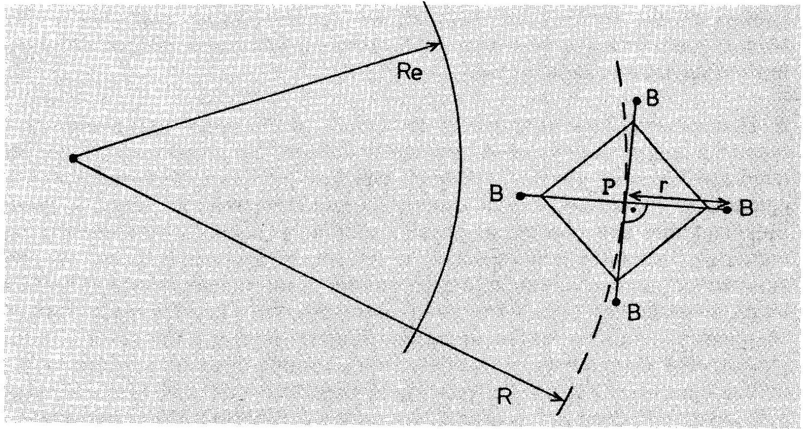
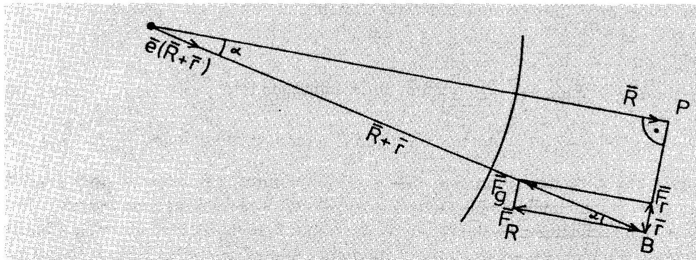

## PROBLEM 1 : A ROTATING SATELLITE.

The figure shows a satellite which is circling the Earth in an approximately circular orbit in the Earth's equatorial plane. The satellite consists of a massless central body P and four small peripheral bodies B. The four bodies B each have mass $m$ : they are fastened to P by means of long thin wires of length $r$ that do not stretch. All these five bodies, P and the four bodies B. are coplanar with the equatorial plane, and they can rotate within this plane. The four radial wires are linked to each other by further thin wires which keep the angles between the radial wires constant at 90°.

The link wires are included in the system in order to prevent oscillatory movement of the individual bodies B which would otherwise make the analysis of the movements extremely complicated. All the bodies B rotate around P at the same angular velocity, which is $\omega$ with respect to the fixed stars. Thus. the satellite behaves as a rigid body.

Analyze the following questions for the general case, considering all possible situations. including both senses of rotation of the bodies B. Also obtain numerical values for certain of the quantities found in questions (1) and (2)-the quantities required and the necessary numerical data are listed at the end of the problem.

1) The drawing shows the satellite in the position where for the various wires, $\mathbf { r }$ is parallel. anti-parallel or perpendicular to $\mathbf { R }$. (The vector $\mathbf { r }$ runs from body P to a body B and has length $r$; the vector R runs from the centre of mass of the Earth to the body P.)
Determine the force exerted by a radial wire on one of the bodies B in each of these four positions. These positions correspond approximately to the maximum and minimum forces.

2) Inside the four bodies B there are four identical machines, powered by solar energy, connected to the radial wires. Each machine pulls the wire in, towards B, for a short time whenever there is near maximum force in the wire (as indicated in the previous question), and lets the same length of wire out again when the tension is at a minimum. The length of wire that is pulled in and let out is 1\% of the mean length of the radial wire. The mean length does not change with time.
What is the net power converted by one machine, averaged over one rotation of the satellite?
The net power is defined as $\frac { W _ { 1 } - W _ { 2 } } { T }$, where $W _ { 1 }$ is the work that the machine performs on the wire when pulling it in, $W _ { 2 }$ is the work that the wire performs on the machine when it is reeled out and $T$ is the period of rotation.
3) Discuss the changes in the motion of the satellite that are caused by the action of the machines. In particular. analyze any changes that may occur in each of the situations listed in the table overleaf.
Fill in the table with your results and comments, and don't forget to hand it in.

Data:
Numerical answers are required in the following situation:
The radius of the orbit of the central body is given by $R = R _ { \mathrm { E } } + 500 \mathrm {~km}$.
The mean length of the radial wires is $r = 100 \mathrm {~km}$.
Thus the diameter of the satellite system is 200 km.
The bodies B have masses $m = 1000 \mathrm {~kg}$.
Initially the four bodies $B$ rotate, as referred to the stars. around the central body P at 10 revolutions/hour.

The masses of the wires are negligible, and the central body P is massless.
Advice:
Consider both senses of rotation for $\omega$.
Exact solutions are not expected. Results with 5\% accuracy are fully acceptable. Ignore the gravitational effect of the moon and the sun.

Useful data:
Mass of Earth
Gravitational constant
Radius of Earth at equator
Denote the product $M _ { \mathrm { E } } G$ by $K$.

$$
\begin{aligned}
M _ { \mathrm { E } } & = 5.97 \times 10 ^ { 24 } \mathrm {~kg} \\
G & = 6.673 \times 10 ^ { - 11 } \mathrm {~m} ^ { 3 } \mathrm {~kg} ^ { - 1 } \mathrm {~s} ^ { - 2 } \\
R _ { \mathrm { E } } & = 6378 \mathrm {~km} \\
K & = 3.983 \times 10 ^ { 14 } \mathrm {~m} ^ { 3 } \mathrm {~s} ^ { - 2 }
\end{aligned}
$$

Country code:

## ANSWER TABLE

Fill in this table as part of your answer. Write down equalities or inequalities and/or short explanations where necessary.

| The quantity indicated below ... | increases if $\_\_\_\_$ | decreases if $\_\_\_\_$ | stays unchanged if $\_\_\_\_$ | stays unchanged in all situations. |
| :--- | :--- | :--- | :--- | :--- |
| orbital velocity of the satellite |  |  |  | Yes □ No □ |
| radius R of the orbit of the satellite |  |  |  | Yes □ No □ |
| angular velocity $\omega$ of the satellite |  |  |  | Yes □ No □ |
| gravitational potential energy of the satellite |  |  |  | Yes □ No □ |
| Could the satellite reach a higher orbit as a result of the work done by the machines? Yes □ No □ |  |  |  |  |
| Could the satellite reach an arbitrarily high orbit, practically leaving the gravitational influence of Earth? Why?   Answer: $\_\_\_\_$ |  |  |  |  |

## SOLUTION : PROBLEM 1

Notation. Vectors are denoted as $\overrightarrow { \boldsymbol { r } } , \overrightarrow { \boldsymbol { R } }$. Without vector symbol, $r$ and $R$ mean the lengths of these vectors.
Unit vectors of specified direction are indicated by indicating the direction vector in brackets: $\vec { e } ( \vec { R } )$ is a vector of unit length, directed from the centre of earth to point P . The vector pointing from B to the centre of earth is $- \overrightarrow { \boldsymbol { e } } ( \overrightarrow { \boldsymbol { R } } + \overrightarrow { \boldsymbol { r } } )$ and $\overrightarrow { \boldsymbol { a } } = - \overrightarrow { \boldsymbol { e } } ( \overrightarrow { \boldsymbol { R } } ) K / R ^ { 2 } = - K \overrightarrow { \boldsymbol { R } } / R ^ { 3 }$ represents the gravitational acceleration at $\overrightarrow { \boldsymbol { R } }$.
Different cases are denoted as follows: in the first section, the word parallel means that $\vec { R }$ and $\vec { r }$ are parallel, i.e. that the periferal body B is highest up in its orbit. In the same way, antiparallel means the position of B nearest to the earth. In later sections, the different senses of rotation of the satellite are denoted as parallel and antiparallel: When the angular velocity vectors $\vec { \omega }$ and $\vec { \Omega }$ (the angular velocity of P with respect to the centre of the earth) are parallel, it means that the satellite rotates in the direction of its orbital motion.

## Determination of the tensional forces

Determination of the tensional forces requires certain approximations to be done:

1. The centre of the satellite is on a circular Kepler orbit, i.e.
$$
\Omega ^ { 2 } R = K / R ^ { 2 } .
$$

The problem formulation indicates that the initial orbit is intended to be circular. Physically, the orbit could also be elliptical.

2. $\omega$ and $\Omega$ are constant.
3. $r \ll R$ so that higher powers of $r / R$ can be neglected.
4. As shown in Figure 1, the extreme end of each radial wire of the satellite is free to swing back and forth according to the resultant acceleration of the body B. The force acting on a body B is generally not directed towards the centre P of the satellite. However, the end section of the wire between P and B is directed along the direction of the force. It is assumed that these free end sections are so short that their swinging doesn't affect significantly the motion of the bodies B of the satellite, i.e. that $\vec { \omega }$ and $\vec { r }$ are valid for describing the motion of B around P.
5. The side position was defined in the problem as the position where $\vec { r }$ and $\vec { R }$ are perpendicular. The distance between this point and the centre of the earth is $\sqrt { r ^ { 2 } + R ^ { 2 } } = R \sqrt { 1 + \left( r ^ { 2 } / R ^ { 2 } \right) } \approx 1.00011 R \approx R + 0.008 r$. Thus a good approximation for the side position is the point whose distance to the centre of earth equals $R$. We can equally well estimate the force for this approximate side point, the error of approximation will certainly be less than $5 \%$.

None of the assumptions 1, 2, 3, and 5 holds if $r$, the radius of the satellite, is thousands of kilometers and if the satellite is near the earth. With the numerical values given in the problem, $r / R \approx 0.0145$ so that the approximations are better than the expected accuracy of solution. Rigorous proof of these approximations

## PROBLEM 1 : A ROTATING SATELLITE.

might be more demanding than solving the problem itself. It was not expected from the competitors and it will not be given here.
The vectors $\vec { r }$ and $\vec { R }$, and the angular velocities $\vec { \omega }$ and $\vec { \Omega }$ are defined with respect to an inertial (non-rotating) frame of reference.

The location vector for one body B is $\overrightarrow { \boldsymbol { R } } + \overrightarrow { \boldsymbol { r } }$. Thus we get for the velocity and acceleration of B

$$
\begin{align*}
& \vec { v } = \vec { \Omega } \times \vec { R } + \vec { \omega } \times \vec { r }  \tag{1}\\
& \vec { a } = - \Omega ^ { 2 } \vec { R } - \omega ^ { 2 } \vec { r } \tag{2}
\end{align*}
$$

With less formalism: the motion of a body B is a superposition (or sum) of two circular motions, one around the earth and the other around the centre of the satellite. Thus also the acceleration of $B$ is the sum of the two accelerations: one directed towards the centre of earth, and of magnitude $\Omega ^ { 2 } R$, and the other directed towards the centre of the satellite, and of magnitude $\omega ^ { 2 } r$.
The gravitational force acting on the body $B$ depends on the distance of $B$ from the centre of earth, i.e. on the length of the sum of vectors $\overrightarrow { \boldsymbol { R } } + \overrightarrow { \boldsymbol { r } }$ :

$$
\begin{equation*}
F _ { \text {gravity } } = m \frac { K } { | \vec { R } + \vec { r } | ^ { 2 } } . \tag{3}
\end{equation*}
$$

and is directed towards the centre of earth, i.e. the direction is opposite to the sum of vectors $\overrightarrow { \boldsymbol { R } } + \overrightarrow { \boldsymbol { r } }$. In vector notation this can be written as

$$
\begin{align*}
\vec { F } _ { \text {gravity } } & = - m \frac { K \vec { e } ( \vec { R } + \vec { r } ) } { | \vec { R } + \vec { r } | ^ { 2 } }  \tag{4}\\
& = - m \frac { K ( \vec { R } + \vec { r } ) } { | \vec { R } + \vec { r } | ^ { 3 } } \tag{5}
\end{align*}
$$

Quite often, the second form is simpler in computations.
The total force acting on B corresponds to the acceleration:

$$
\begin{align*}
\vec { F } & = \vec { F } _ { \text {wire } } + \vec { F } _ { \text {gravity } }  \tag{6}\\
& = m \vec { a } = m \left( - \Omega ^ { 2 } \vec { R } - \omega ^ { 2 } \vec { r } \right) \tag{7}
\end{align*}
$$

This gives the tensional force:

$$
\begin{equation*}
\vec { F } _ { w i r e } / m = - \Omega ^ { 2 } \vec { R } - \omega ^ { 2 } \vec { r } + \frac { K ( \vec { R } + \vec { r } ) } { | \vec { R } + \vec { r } | ^ { 3 } } \tag{8}
\end{equation*}
$$

This is an exact result. Numerical answers can be calculated with this expression. One example is given in the section for numerical results. However, a better understanding is possible if we find an approximation so that such higher order terms are neglected which don't have a significant influence on the results. Indicate the

## SOLUTION : PROBLEM 1

position of the body $B$ by defining the distance of $B$ from the centre of earth as $| \overrightarrow { \boldsymbol { R } } + \overrightarrow { \boldsymbol { r } } | = R + \rho$ where $- r \leq \rho \leq r$. Express the denominator in powers of $\rho / R$ :

$$
\begin{equation*}
( R + \rho ) ^ { - 3 } = R ^ { - 3 } \left( 1 - 3 \rho / R + O ( r / R ) ^ { 2 } \right) \tag{9}
\end{equation*}
$$

Physically this approximation means that the change of gravitational acceleration is assumed to be linearly proportional to $\rho$, the change of radius. Substituting. this approximation in the expression of $\vec { F } _ { \text {wire } }$ gives the tensional force in arbitrary rotational position of the satellite as

$$
\begin{align*}
\overrightarrow { \boldsymbol { F } } _ { \text {wire } } / m & = - \Omega ^ { 2 } \overrightarrow { \boldsymbol { R } } - \omega ^ { 2 } \overrightarrow { \boldsymbol { r } } + \frac { ( \overrightarrow { \boldsymbol { R } } + \overrightarrow { \boldsymbol { r } } ) \left( 1 - 3 \rho / R + O ( r / R ) ^ { 2 } \right) } { R } \frac { K } { R ^ { 2 } }  \tag{10}\\
& = - \Omega ^ { 2 } \overrightarrow { \boldsymbol { R } } - \omega ^ { 2 } \overrightarrow { \boldsymbol { r } } + \Omega ^ { 2 } R \left( \overrightarrow { \boldsymbol { R } } / R + \overrightarrow { \boldsymbol { r } } / R - 3 \rho \overrightarrow { \boldsymbol { R } } / R ^ { 2 } + \overrightarrow { \boldsymbol { R } } O ( r / R ) ^ { 2 } \right)  \tag{11}\\
& \approx - \omega ^ { 2 } \overrightarrow { \boldsymbol { r } } + \Omega ^ { 2 } \overrightarrow { \boldsymbol { r } } - 3 \Omega ^ { 2 } \rho \frac { \overrightarrow { \boldsymbol { R } } } { R } \tag{12}
\end{align*}
$$

Analyze the contribution of the last term in the positions up ( $\vec { r }$ and $\vec { R }$ parallel), down ( $\vec { r }$ and $\vec { R }$ antiparallel), and sideways (instead of the exact definition, use the approximate definition which corresponds to the value $\rho = 0$ ):
$\mathbf { U } _ { \mathbf { p } } , \rho = + r : \quad \overrightarrow { \boldsymbol { R } } = \overrightarrow { \boldsymbol { r } } \frac { R } { r }$, giving $\rho \overrightarrow { \boldsymbol { R } } = r \overrightarrow { \boldsymbol { R } } = r \overrightarrow { \boldsymbol { r } } \frac { R } { r } = \overrightarrow { \boldsymbol { r } } R$.
The last term equals $- 3 \Omega ^ { 2 } \vec { r }$.
Down, $\rho = - r : \quad \overrightarrow { \boldsymbol { R } } = - \overrightarrow { \boldsymbol { r } } \frac { R } { r }$, giving $\rho \overrightarrow { \boldsymbol { R } } = - r \overrightarrow { \boldsymbol { R } } = - r \left( - \overrightarrow { \boldsymbol { r } } \frac { R } { r } \right) = \overrightarrow { \boldsymbol { r } } R$.
Again, the last term equals $- 3 \Omega ^ { 2 } \overrightarrow { \boldsymbol { r } }$.
Sideways, $\rho = 0$ : The last term is zero.
Substituting for the last term gives the force in the three different cases:

$$
\begin{align*}
\vec { F } _ { \min } & = - \left( \omega ^ { 2 } - \Omega ^ { 2 } \right) \vec { r } m \quad \text { if } \rho = 0  \tag{13}\\
\vec { F } _ { \max } & = - \left( \omega ^ { 2 } + 2 \Omega ^ { 2 } \right) \vec { r } m \quad \text { if } \rho = \pm r  \tag{14}\\
\Delta F & = F _ { \max } - F _ { \min } = 3 \Omega ^ { 2 } r m \tag{15}
\end{align*}
$$

In all three cases the force is parallel or antiparallel to the direction of vector $\vec { r }$. The expression $\left( \omega ^ { 2 } + 2 \Omega ^ { 2 } \right)$ is always positive. Thus $\vec { F } _ { \text {max } }$ is always directed to the direction of $- \vec { r }$, i.e. the wire is pulling the body B at 'up' and 'down' positions. However, the expression ( $\omega ^ { 2 } - \Omega ^ { 2 }$ ) becomes negative if $\omega < \Omega$. This would mean that $\vec { F } _ { \text {min } }$ is directed parallel to $\vec { r }$, i.e. that the wire is pushing the body B. This is impossible, however: it would cause the collapse of the satellite because the structure consisting of thin wires can only withstand pulling forces. Thus we must require $\omega > \Omega$ in the following analysis. The expression given for $\Delta F$ is based on this assumption.

## PROBLEM 1 : A ROTATING SATELLITE.

## Work done by the machines

The maximum force affecting any selected body B is present when B is in 'up' position and when B is in 'down' position, i.e. twice during one revolution of the satellite with respect to the vertical axis. Similarly the minimum force is present twice during one relative revolution, in the 'left' and 'right' side positions. The vertical direction rotates with the angular velocity $\Omega$ of the orbital motion. If the satellite rotates in the direction of its orbital motion ( $\overrightarrow { \boldsymbol { \omega } }$ and $\overrightarrow { \boldsymbol { \Omega } }$ are parallel) then the satellite must rotate slightly more than one full revolution in order to make one revolution with respect to the vertical axis. Then the angular velocity of the satellite with respect to the vertical axis is $\omega - \Omega$. In the other case (satellite rotates in the direction opposite to the direction of orbital motion) the angular velocity of the satellite with respect to the vertical axis is $\omega + \Omega$ : less than one absolute revolution is needed for one relative revolution. In vector notation both cases are given by the expression $\vec { \omega } - \vec { \Omega }$.
The machines perform two work cycles (one cycle: pulling the wire + releasing it) during one relative revolution. Thus the work per one relative revolution is

$$
\Delta E = 2 \Delta r \left( F _ { \max } - F _ { \min } \right) = 6 m \Delta r r \Omega ^ { 2 } = 0.06 m r ^ { 2 } \Omega ^ { 2 }
$$

The period of one relative revolution is

$$
\Delta T = 2 \pi / ( \omega \pm \Omega )
$$

where plus sign corresponds to the antiparallel case. The mean power is given by

$$
P = \Delta E / \Delta T = 2 \Delta r \left( F _ { \max } - F _ { \min } \right) / ( 2 \pi / ( \omega \pm \Omega ) ) = \Delta r \left( F _ { \max } - F _ { \min } \right) ( \omega \pm \Omega ) / \pi
$$

## Numerical results

From $K / R ^ { 2 } = \Omega ^ { 2 } R$ one gets $K R = 25.410 ^ { 20 } m ^ { 4 } s ^ { - 2 }$ and
$\Omega = \sqrt { \left( K R ^ { - 3 } \right) } = 0.001106 \mathrm { rad } / \mathrm { s }$. The orbital period is 5678 s .
The angular velocity of the satellite is $\omega = 2 \pi / 360 \mathrm {~s} = 0.01745 \mathrm { rad } / \mathrm { s }$.
The relative angular velocities are
$\omega - \Omega = 0.01634 \mathrm { rad } / \mathrm { s }$ (parallel case) and
$\omega + \Omega = 0.01856 \mathrm { rad } / \mathrm { s }$ (antiparallel case).

$$
\begin{align*}
F _ { \min } & = \left( \omega ^ { 2 } - \Omega ^ { 2 } \right) r m = 100 \mathrm {~km} 1000 \mathrm {~kg} 303.0810 ^ { - 6 } \mathrm {~s} ^ { - 2 } = 30339 \mathrm {~N}  \tag{16}\\
F _ { \max } & = \left( \omega ^ { 2 } + 2 \Omega ^ { 2 } \right) \mathrm { rm } = 100 \mathrm {~km} 1000 \mathrm {~kg} 307.6810 ^ { - 6 } \mathrm {~s} ^ { - 2 } = 30706 \mathrm {~N}  \tag{17}\\
F _ { \max } & - F _ { \min } = 3 \mathrm { rm } \Omega ^ { 2 } = 367 \mathrm {~N} . \tag{18}
\end{align*}
$$

$$
\begin{align*}
P & = \Delta r \left( F _ { \max } - F _ { \min } \right) ( \omega \pm \Omega ) / \pi  \tag{19}\\
P _ { \text {antiparallel } } & = 1 \mathrm {~km} 367 \mathrm {~N} 0.01856 \mathrm { rad } / \mathrm { s } \pi ^ { - 1 } = 2168 \mathrm {~W} .  \tag{20}\\
P _ { \text {parallel } } & = 1 \mathrm {~km} 367 \mathrm {~N} 0.01634 \mathrm { rad } / \mathrm { s } \pi ^ { - 1 } = 1909 \mathrm {~W} . \tag{21}
\end{align*}
$$

## SOLUTION : PROBLEM 1

Figure 2: Analysis of the forces acting on body B in the sideways position. The angle $\alpha$ is given by $\tan \alpha = r / R$. The tension is $F _ { r } = \sin \alpha F _ { g } \approx \tan \alpha F _ { g } = F _ { g } r / R$.

These values should be reported rounded to two significant figures because approximations have been used:

$$
\begin{align*}
P _ { \text {antiparallel } } & = 2200 \mathrm {~W} ,  \tag{22}\\
P _ { \text {parallel } } & = 1900 \mathrm {~W} . \tag{23}
\end{align*}
$$

Example of the exact expression. As an example, we evaluate here the force for the exact side position directly from the expression

$$
\begin{align*}
\vec { F } _ { w i r e } / m & = - \Omega ^ { 2 } \vec { R } - \omega ^ { 2 } \vec { r } + \frac { K ( \vec { R } + \vec { r } ) } { | \vec { R } + \vec { r } | ^ { 3 } }  \tag{24}\\
& = - \Omega ^ { 2 } \vec { R } - \omega ^ { 2 } \vec { r } + \frac { K \vec { e } ( \vec { R } + \vec { r } ) } { | \vec { R } + \vec { r } | ^ { 2 } } \tag{25}
\end{align*}
$$

Taking into account the Kepler equation and the radius value for the side point, we get

$$
\begin{align*}
\overrightarrow { \boldsymbol { F } } _ { w i r e } / m & = - \Omega ^ { 2 } \overrightarrow { \boldsymbol { R } } - \omega ^ { 2 } \overrightarrow { \boldsymbol { r } } + \frac { K } { 1.00011 ^ { 2 } R ^ { 2 } } \overrightarrow { \boldsymbol { e } } ( \overrightarrow { \boldsymbol { R } } + \overrightarrow { \boldsymbol { r } } )  \tag{26}\\
& = - \Omega ^ { 2 } \overrightarrow { \boldsymbol { R } } - \omega ^ { 2 } \overrightarrow { \boldsymbol { r } } + 0.99979 \Omega ^ { 2 } R \overrightarrow { \boldsymbol { e } } ( \overrightarrow { \boldsymbol { R } } + \overrightarrow { \boldsymbol { r } } ) \tag{27}
\end{align*}
$$

Now the unit vector $\overrightarrow { \boldsymbol { e } } ( \overrightarrow { \boldsymbol { R } } + \overrightarrow { \boldsymbol { r } } )$ must be expressed with the vectors $\overrightarrow { \boldsymbol { R } }$ and $\overrightarrow { \boldsymbol { r } }$ :

$$
\vec { e } ( \vec { R } + \vec { r } ) = \frac { \vec { R } + \vec { r } } { | \vec { R } + \vec { r } | } = 0.99989 \left( \frac { \vec { R } } { R } + \frac { \vec { r } } { R } \right) .
$$

## PROBLEM 1 : A ROTATING SATELLITE.

The same result may be obtained from a triangular construction, see Figure 2. Thus we get

$$
\begin{align*}
\vec { F } _ { w i r e } / m & = - \Omega ^ { 2 } \vec { R } - \omega ^ { 2 } \vec { r } + 0.99968 \Omega ^ { 2 } R \left( \frac { \vec { R } } { R } + \frac { \vec { r } } { R } \right)  \tag{28}\\
& = - 0.00032 \Omega ^ { 2 } \vec { R } - \left( \omega ^ { 2 } - 0.99968 \Omega ^ { 2 } \right) \vec { r } . \tag{29}
\end{align*}
$$

Within the numerical accuracy, this is an exact result. It is easily seen that the first term can be neglected because it is small and also because it represents a force which is perpendicular to the radial wire. In fact, it could be used for estimating the direction of the free-swinging end of the radial wire. The second term is practically identical with our earlier result for $F _ { m i n }$.

## Change of orbit

In principle, the work done by the machines in the satellite could transform the orbit into a non-circular shape. In this problem, however, it is given that the machines work four times during each rotational cycle of the satellite. Thus the effect of the machines is distributed more or less symmetrically all around the orbit. Because of the circular symmetry, we may safely assume that the orbit stays circular even while the machines are operating. Thus the change of orbit, as caused by the action of the machines, is from one circular Kepler orbit to another circular Kepler orbit. It would be possible to analyze the change of orbit by analyzing the resultant of the graviational forces which are acting on the four bodies B. This is, however, a difficult and laborious route. Full analysis of the situation is extremely difficult by that route. However, that might be the only possible method for analyzing how an intermittent use of the machines leads to an elliptic Kepler orbit. But in the present case it is not needed. Conservation laws are the all-important technique for analyzing many physical situations, and if it is possible to identify a sufficient number of conserved quantities, the problem can be transformed to solving the conservation equations. When rotational motion is considered, typical conserved quantities are: energy and angular momentum. The difficulty is often how to define the system correctly so that it includes all the energies which together are conserved, or all the angular momenta. First consider the angular momentum. As is explained elsewhere, the angular momentum of the rotational motion of the satellite need not be conserved. However, the total angular momentum $I _ { \text {tot } }$ of the satellite with respect to the centre of earth is conserved because the only external forces acting on the satellite are gravitational and directed towards the centre of earth. (This would not be true if the satellite were in a polar orbit and the non-spherical shape of the earth were considered). The $I _ { \text {tot } }$ consists of two parts: the internal angular momentum, due to the rotation of the satellite, and the orbital angular momentum, due to the motion of the centre-of-mass of the satellite around the earth.
Another conserved quantity is the energy. To be more precise, the total energy $E _ { \text {tot } }$ of the satellite is increased by the net work done by the machines. The following terms are included in $E _ { \text {tot } }$ :

## SOLUTION : PROBLEM 1

- The rotational energy of the satellite, $1 / 24 m \omega ^ { 2 } r ^ { 2 }$
- The orbital kinetic energy of the satellite, i.e. the kinetic energy of the motion of the centre-of-mass, $1 / 24 m \Omega ^ { 2 } R ^ { 2 }$
- The potential energy of the satellite in the gravitational fiel of earth, $- 4 m K / R$. In the first order approximation which we are using, this can be calculated as if the total mass of the satellite were concentrated in the centre point P.

Thus we have for the total energy the equation

$$
\begin{align*}
E _ { t o t } & = 4 m \left( - K / R + 1 / 2 \Omega ^ { 2 } R ^ { 2 } + 1 / 2 \omega ^ { 2 } r ^ { 2 } \right)  \tag{30}\\
& = 2 m \left( - \Omega ^ { 2 } R ^ { 2 } + \omega ^ { 2 } r ^ { 2 } \right) \quad \text { (because of Kepler) } . \tag{31}
\end{align*}
$$

A third equation for solving the system is obtained from the Kepler law, connecting the radius of orbit and the orbital velocity of the satellite. Thus we have the system of three equations

$$
\begin{align*}
\frac { K } { R ^ { 2 } } & = \Omega ^ { 2 } R \quad \text { (Kepler law) }  \tag{32}\\
I _ { t o t } & = 4 m \left( \omega r ^ { 2 } \pm \Omega R ^ { 2 } \right) = \text { Constant }  \tag{33}\\
E _ { 2 } - E _ { 1 } & = E _ { m } , \tag{34}
\end{align*}
$$

where $E _ { 1 }$ and $E _ { 2 }$ are the total energies before and after the machines have done the net work $E _ { m }$. The upper sign corresponds to the parallel case: the satellite rotates in the sense of the orbital motion, and the lower sign to the antiparallel case: the senses of the rotations are opposite.

These three independent equations are sufficient for solving the three unknowns $\Omega$, $R$, and $\omega$. As such, the equations do not give a clear picture of the change. The total angular momentum depends on three variables which all can vary when the orbit changes. Analysis of equations is best started by solving the orbital angular momentum as a function of $R$ from the Kepler equation:

$$
I _ { \text {orbit } } = 4 m \Omega R ^ { 2 } = 4 m \sqrt { \Omega ^ { 2 } R ^ { 4 } } = 4 m \sqrt { K R } .
$$

This shows that the orbital angular momentum increases whenever $R$ increases. Also, this gives for the total angular momentum the equation

$$
I _ { t o t } = 4 m \left( \omega r ^ { 2 } \pm \sqrt { ( K R ) } \right) = \text { Const }
$$

Because $r$ and $K$ are constants, this equation defines a connection between $\omega$ and $R$.

- Parallel case: if the satellite rotates faster, i.e. $\omega$ increases, then $R$ must decrease in order that $I _ { \text {tot } }$ be conserved. And if $\omega$ decreases, $R$ must increase.

## PROBLEM 1 : A ROTATING SATELLITE.

- Antiparallel case: if the satellite rotates faster, i.e. $\omega$ increases, then $R$ must increase in order that $I _ { \text {tot } }$ be conserved. Similarly, if $\omega$ decreases in the antiparallel case, then $R$ also must decrease.

Intuitively one would expect that the increase of the total energy of the satellite (because of the positive work done by the machines) would lead to increase of $\omega$, then the whole problem would be fully analyzed. However, it is necessary to analyze the energy equations in order to make certain that this really is true. The orbital energy as a function of $R$ is

$$
E _ { \text {orbit } } / 4 m = - K / R + 1 / 2 \Omega ^ { 2 } R ^ { 2 } = - 1 / 2 K / R ,
$$

and the total energy:

$$
E _ { t o t a l } / 2 m = - K / R + \omega ^ { 2 } r ^ { 2 } .
$$

As shown above, in the antiparallel case the conservation of angular momentum requires that $\omega$ and $R$ either both increase or both decrease. The first alternative is valid because then both terms of the total energy expression increase which correctly corresponds to the increase of total energy.
The parallel case requires a more detailed analysis. We form the differential change of $I _ { \text {tot } }$ :

$$
d \omega r ^ { 2 } + 1 / 2 K ( K R ) ^ { - 1 / 2 } d R = 0 .
$$

This is substituted in the expression of total energy,

$$
\begin{align*}
d E _ { \text {total } } / 2 m & = d \left( - K / R + \omega ^ { 2 } r ^ { 2 } \right)  \tag{35}\\
& = K / R ^ { 2 } d R + 2 \omega d \omega r ^ { 2 }  \tag{36}\\
& = K / R ^ { 2 } d R - 2 \omega 1 / 2 K ( K R ) ^ { - 1 / 2 } d R  \tag{37}\\
& = K d R \left( 1 / R ^ { 2 } - \omega ( K R ) ^ { - 1 / 2 } \right)  \tag{38}\\
& = K d R \left( 1 / R ^ { 2 } - \omega / \left( \Omega R ^ { 2 } \right) \right)  \tag{39}\\
& = K d R R ^ { - 2 } ( 1 - \omega / \Omega ) \tag{40}
\end{align*}
$$

Because $\omega > \Omega$, an increase of total energy corresponds to a decrease of $R$ and further to an increase of $\omega$. This confirms that $\omega$ is increasing in both cases, as intuitively expected.

## Answers to the tabulated questions.

The radius $R$ decreases in the parallel case and increases in the antiparallel case. The change of the orbital velocity is opposite to the change of $R$ : increase in the parallel and decrease in the antiparallel case.
The angular velocity $\omega$ increases.
The potential energy increases with increasing $R$, thus increasing in the antiparallel and decreasing in the parallel case.
As seen from earlier answers, it is possible that the satellite gets in a higher orbit.

## SOLUTION : PROBLEM 1

It happens in the antiparallel case.

The last question was not quite clear. It was hoped that this question might bring forward the contrast with ordinary rocket propulsion: it is possible for a rocket to practically leave the gravitational field of earth by using a finite amount of energy. However, a rotating satellite would need an infinite amount of energy if $R$ grows without limit: The equation for $I _ { \text {tot } }$ shows that $\omega$ must increase without limit, proportional to the square root of the radius of orbit. Tensional forces in the satellite would then also increase without limit, proportional to the radius $R$. Thus there would be a maximum value for $R$, corresponding to the strength of the radial wires. With larger values of $R$, the wires would break. Rather few participants were able to analyze this aspect of the problem.
In a few answers, the last question was seen in a different perspective. When the Kepler equation is taken into account, the work per one revolution can be written as

$$
\Delta E = 2 d r \left( F _ { \max } - F _ { \min } \right) = 6 m d r r \Omega ^ { 2 } = 6 K m d r r R ^ { - 3 }
$$

showing that the mean power decreases proportionally to $R ^ { - 2.5 }$. Thus the increase of $R$ gets slower and slower when time goes on. Strictly speaking, this alone would not prevent $R$ from reaching any predetermined value, given enough time.

## Grading

The credit points for this problem were split to two parts of five points each:

- Correct results for the forces 'up' and 'down' were given one and half points. Another 1.5 points were given for the correct force in the 'sideways' position. Small numerical errors were forgiven. If there was an essential error in the equations, then no credit was given for such a result.
- Two points were given if the mean power was correctly obtained as based on the results of the first part. This merit was given even if the forces were wrong. This part of the problem was very easy. (In fact, it was difficult enough because of the need to use the relative angular velocity, but this was only recognized after the competition.)
- The second half of points were given for the analysis of the changes of orbit. One point was given for the answer which correctly related changes in the orbital velocity and radius $R$, although it did not help in understanding the mechanism of orbit change. Half a point was given for each one of the conservation equations of energy and angular momentum even if there was no further analysis of the situation. One point was given if the conservation equations were correctly analyzed for one rotational sense, and another point if the other rotational sense was also covered. No credit was given for a few correct stray answers in the table if they did not reflect an understanding of the situation.

## PROBLEM [1]: A ROTATING SATELLITE.

- One point was given for the last question of the table, concerning the ability of the satellite to leave the gravitational field of earth.

## Remarks

1. Coriolis force? There was a difficulty in this problem which luckily was not affecting the competitors. When the problem was scrutinized, several people thought that it would be necessary to include the Coriolis term in the solution of the problem. Of course, it would be possible to use a rotating coordinate system. Either, one could use a system which rotates with $\Omega$, so that one coordinate axis points 'down', towards centre of earth. Or, one could use a system which rotates with the satellite, with angular velocity $\omega$, so that the bodies B of the satellite would be in fixed positions in this coordinate system. But both cases generate unnecessary complications without any useful simplifications. There are no relative movements which would need to be defined with respect to a rotating frame of reference.

> The only thing that is relative to another coordinate system is the relative angular velocity of the satellite with respect to the vertical axis (needed for the computation of the mean power). It is obtained simply as a sum or difference of the angular velocities $\omega$ and $\Omega$.

Thus it is better to work in one inertial coordinate system. Only a few of the competitors used or attempted to use Coriolis formalism!
2. The reason for varying forces. The vector presentation which we used for the solution does not explain the 'reason' for the variation of tension: The extra tension in up and down positions is caused by the variation of the gravitational force as a function of radius: higher up, the pull of earth is less, thus more tension is needed for keeping the body in orbit. And deeper down, the gravitational pull is stronger, needing more tension for supporting the body. The smaller tension in the side positions is explained by the direction of the gravitational pull: there is an angle between the pull directions at the centre of the satellite and at the body B. The whole phenomenon is well known as the tide: the gravitational forces of the sun and the moon create a change of apparent gravity on earth which is exactly the same phenomenon as the varying tensional forces of our rotational satellite.
3. Consistency check. The resultant of the calculated four forces acting on the four bodies B is zero (the opposing forces are of same magnitude but point in opposite directions). This is correct, it is consistent with the assumption that the central structures (wires and centre point) of the satellite are massless.
If the analysis were carried out to second order, then the resultant would not be zero, which would indicate a contradiction. This means that the original assumptions (centre point of satellite on circular Kepler orbit, constant $\omega$ and $\Omega$ ) would need to be revised in second order calculations. It would turn out that the centre point oscillates around the circular orbit with a frequency $2 ( \omega \pm \Omega ) / \pi$.

## SOLUTION : PROBLEM 1

4. Difficulty of the problem. From the outset it was estimated that this is a difficult problem. However, the problem turned out to be even more difficult than we estimated. Only about 10 \% of participants were able to analyze the change of orbit. One detail of the solution fooled both the participants, the team leaders, the grading team, and the author of the problem: we all calculated the mean power on the basis of the absolute angular velocity $\omega$ of the satellite. Only during the writing of this final report it was recognized that the relative angular velocity $\omega \pm \Omega$ must be used when calculating the mean power. The natural meaning of 'mean power' of a periodic process is the work done during one period divided by the length of that period. In one period there are the four positions of any single body B , thus the length of the period must be the time of one relative revolution of the satellite (relative with respect to the local vertical direction). Question 2 says ambiguously: 'averaged over one rotation of the satellite', but the only sensible interpretation of this is 'averaged over one rotation with respect to the local vertical'!
5. Usual mistakes in the solutions. In many solutions the decrease of tension in the side position was not recognized at all, it was assumed that the tension in side position is $\omega ^ { 2 } r m$. (The author of the problem first made this error, too. Only two days before the competition he got this part of the solution right.) If the vector formalism is used, then this decrease appears automatically. It can also be obtained by means of a geometrical diagram where the difference of the 'vertical' directions at P and at B is taken into account.
In a surprising number of solutions the tensions in up and down positions were wrong because of the following mistake: it was asssumed that the body B was performing one circular motion with angular velocity $\omega$ and radius $r$ and the second circular motion with $\Omega$ and $R + r$ (when considering the up position). This results in an excessive tension for the up position. Often there was also another error which caused the tension in the down position to be too small. Such a situation is not consistent, but the competitors did not make a consistency check.
In many solutions it was erroneously assumed that the angular momentum $4 m \omega r ^ { 2 }$ of the rotation of the satellite about its centre point P would be conserved. If this were true, then also $\omega$ would not be changed by the work done by the machines. The gravitational forces acting on B are not directed towards the centre of the satellite, they are not central forces with respect to the centre of the satellite. Thus there is no reason for assuming that the angular momentum or $\omega$ would remain constant.
It seems that a few competitors remembered the classical example of conservation of angular momentum: a skater accelerates his/her pirouette by pulling arms close to the body. It was thought that the work done by the machines goes for increasing the angular velocity of the satellite. In small scale, this would seem to be true: pulling one body B closer to P would indeed speed up $\omega$. The effect would not be cumulative, however: later the same $B$ would recede back to the original distance and there would be a slowing down of $\omega$ back to the original value. Without the inhomogeneous gravitational field, there would be no cumulative change of $\omega$. Furthermore, the problem was by purpose formulated so that while two bodies get closer to P, another

## PROBLEM 1 : A ROTATING SATELLITE.

two recede from P. Thus the moment of inertia of the satellite does not change and there is no fluctuation of the value of $\omega$.
In a few solutions the numerical values for maximum and minimum forces were rounded to two significant figures before calculating the difference. But then the error in the difference of two nearly equal forces may be nearly $100 \% !$. It is essential to maintain full accuracy in the intermediate results.
6. Experience with the fill-in table The fill-in table was introduced in the hope of achieving the following:

- Eliminating unnecessary explanations from the answers, thus making it possible to grade the answers with a minimum of language translations. It was thought that by asking sufficiently many details one can get a complete picture of whether the competitor does or doesn't understand the situation.
- Making the grading process fast, objective, and straightforward, treating all the participants justly and on equal basis.

These goals were only partly fulfilled:
It was possible to see if a competitor had a good understanding of the situation. Then all or almost all entries of the table were well answered. However, it was somewhat problematic how to deal with partly filled tables. Many answers contained such relations which are trivially true for all circular Kepler orbits. This had not been expected. It was necessary to formulate a policy about how to deal with true answers which did not address the intended matters.
The last question was unfortunately formulated so that it could be understood in two different ways. Also, this question was not supported by other related questions. Thus it was difficult to decide how to grade half-correct answers to the last question. Our experience indicates that a fill-in table may be a good device in making the grading process easier and more objective. However, it requires a good deal of careful planning and also test filling by a number of persons in order to eliminate multiple meanings of the questions.
