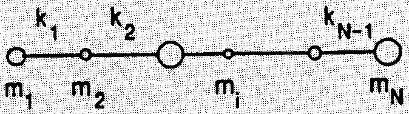
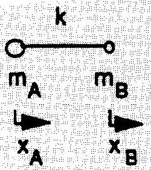
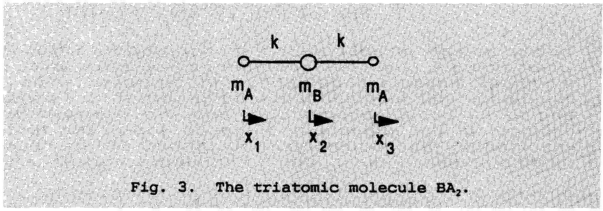
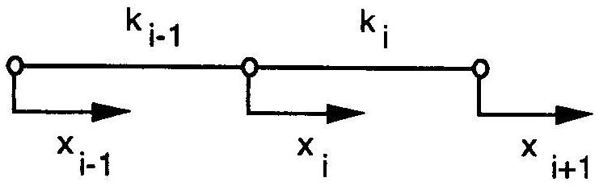
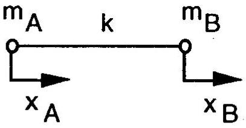
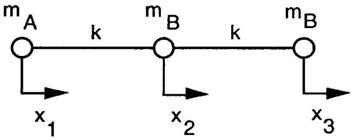

## PROBLEM 21: THE LONGITUDINAL MOTION OF A LINEAR MOLECULE

In this problem you will analyze the longitudinal motion of a linear molecule, i.e., the motion along the molecular axis. The rotational motion and the bending of the molecule are not considered. The molecule is assumed to consist of N atoms of mass $m _ { 1 } , m _ { 2 } , \ldots , m _ { n }$, respectively. Each atom is assumed to be connected to its neighbors by a chemical bond. Each bond is approximated by a massless spring which obeys Hooke's law with spring constants $k _ { 1 } , k _ { 2 } , \ldots k _ { N - 1 }$. The molecule is shown in Fig. 1.

Fig.1. A linear molecule with N atoms.

Use the following facts when solving this problem: The longitudinal vibrational motion of a linear molecule consists of a superposition of separate vibrational motions called normal vibrations, or normal modes. In a normal mode all atoms vibrate in simple harmonic motion with the same frequency and pass through their equilibrium positions simultaneously.

Questions

1) Let $x _ { 1 }$ be the displacement of atom $i$ from its equilibrium position. Express the force $F _ { 1 }$ acting on each atom $i$ as a function of the displacements $x _ { 1 } , x _ { 2 } , \ldots , x _ { N }$ and the spring constants $k _ { 1 } , k _ { 2 } , \ldots , k _ { N - 1 }$. What relationship is there among the forces $\mathrm { F } _ { 1 } , \mathrm {~F} _ { 2 } , \ldots , \mathrm {~F} _ { \mathrm { N } }$ ? Using this relationship, derive a relationship between the displacements $x _ { 1 } , x _ { 2 } , \ldots , x _ { N }$ and give a physical interpretation of this relationship.
2) Analyze the motion of a diatomic molecule AB (Fig. 2). The value of the spring constant is $k$. Derive an expression for the forces acting on atoms $A$ and $B$. Determine the possible types of motion of the molecule. Determine the corresponding vibrational frequencies and interpret the result. In particular, how is it possible for the atoms to vibrate with the same frequency even though their masses are not the same?

Fig. 2. The diatomic molecule AB

3) Analyze the motion of the triatomic molecule $B A _ { 2 }$ (Fig. 3)

Express the net force on each atom as a function of its displacement only. Deduce the possible motions of the molecule and the corresponding vibrational frequencies.
4) The frequencies of the two longitudinal modes of vibration of the $\mathrm { CO } _ { 2 }$ molecule are $3.998 \times 10 ^ { 13 } \mathrm {~Hz}$ and $7.042 \times 10 ^ { 13 } \mathrm {~Hz}$, respectively. Determine a numerical value for the spring constant of the CO bond.

How well do you think this approximation for the bond structure of the molecule describes the vibrational motion of the real molecule?

The atomic mass of the carbon atom $= 12$ amu and that of the oxygen atom $= 16 \mathrm { amu }$. The atomic mass unit $= 1.660 \times 10 ^ { - 27 } \mathrm {~kg}$.

## SOLUTION : PROBLEM 2

The solution is given as several basically equivalent versions. The problem is formulated in such a way that no knowledge of matrix theory as applied to problems of this kind is assumed. However, as many of the participants produced elegant and balanced solutions using matrix theory, a brief sketch of this kind of solution is also presented below.

1) The force on atom i can be deduced from Fig. 1. below.

## SOLUTION : PROBLEM 2

A positive displacement $\mathrm { x } _ { \mathrm { i } - 1 }$ of atom $\mathrm { i } - 1$ causes a shortening of the spring $\mathrm { k } _ { \mathrm { i } - 1 }$. That causes a force $\mathrm { k } _ { \mathrm { i } - 1 } \mathrm { x } _ { \mathrm { i } - 1 }$ (acting to the right) on atom i. Correspondingly, a displacement $\mathrm { x } _ { \mathrm { i } }$ of atom i causes a force $- k _ { i - 1 } x _ { i - 1 } - k _ { i } x _ { i }$ acting to the left on atom i. Finally, a displacement $x _ { i + 1 }$ on atom i causes a force $\mathrm { k } _ { \mathrm { i } + 1 } \mathrm { x } _ { \mathrm { i } + 1 }$ acting to the right on atom i. The forces on atom i add up to

$$
\begin{equation*}
F _ { i } = - k _ { i - 1 } \left( x _ { i } - x _ { i - 1 } \right) - k _ { i } \left( x _ { i } - x _ { i + 1 } \right) \tag{1}
\end{equation*}
$$

Taking into account that atom 1 has no left neighbor and atom N no right neighbor, the forces can be written

$$
\begin{aligned}
& F _ { 1 } = - k _ { 1 } \left( x _ { 1 } - x _ { 2 } \right) \\
& F _ { 2 } = - k _ { 1 } \left( x _ { 2 } - x _ { 1 } \right) - k _ { 2 } \left( x _ { 2 } - x _ { 3 } \right)
\end{aligned}
$$

.....

$$
\begin{array} { l l }
F _ { i } = & - k _ { i - 1 } \left( x _ { i } - x _ { i - 1 } \right) - k _ { i } \left( x _ { i } - x _ { i + 1 } \right) \\
\ldots & - k _ { N - 1 } \left( x _ { N } - x _ { N - 1 } \right) \\
F _ { N } = & - \tag{2}
\end{array}
$$

Adding up the forces gives the total force F acting on the molecule:

$$
\begin{equation*}
\mathrm { F } = \mathrm { F } _ { 1 } + \mathrm { F } _ { 2 } + \ldots + \mathrm { F } _ { \mathrm { N } } = 0 \tag{3}
\end{equation*}
$$

According to Newton's second law, this force equals the mass of the molecule multiplied by the acceleration of its center of mass:

$$
\begin{equation*}
\mathrm { F } = \mathrm { Ma } = 0 \tag{4}
\end{equation*}
$$

Each separate force equals the mass of the corresponding atom multiplied by the acceleration of that atom:

$$
\begin{equation*}
F _ { i } = M _ { i } a _ { i } \tag{5}
\end{equation*}
$$

(3) and (5) together give

$$
\begin{equation*}
m _ { 1 } a _ { 1 } + m _ { 2 } a _ { 2 } + \ldots . + m _ { N } a _ { N } = 0 \tag{6}
\end{equation*}
$$

Relation (6) gives

$$
\begin{equation*}
m _ { 1 } v _ { 1 } + m _ { 2 } v _ { 2 } + \ldots + m _ { N } v _ { N } = M v _ { 0 } = \text { constant } \tag{7}
\end{equation*}
$$

## PROBLEM 2 : THE LONGITUDINAL MOTION OF A LINEAR MOLECULE

where $\mathrm { v } _ { 0 }$ denotes the velocity of the center of mass. If the molecule is observed in a coordinate system moving with the center of mass, this velocity equals zero. Thus, we find the following relation between the displacements of the separate atoms:

$$
\begin{equation*}
m _ { 1 } x _ { 1 } + m _ { 2 } x _ { 2 } + \ldots + m _ { N } x _ { N } = M x _ { 0 } = \text { constant } \tag{8}
\end{equation*}
$$

This constant can be set equal to zero, meaning that the origin coincides with the center of mass of the molecule and that the motion of the center of mass is not influenced upon by the internal forces of the molecule .
2) The molecule and the pertinent quantities are shown in the figure below:

The forces on the atoms can be expressed as

$$
\begin{align*}
& F _ { A } = - k \left( x _ { A } - x _ { B } \right) = m _ { A } a _ { A } \\
& F _ { B } = - k \left( x _ { B } - x _ { A } \right) = m _ { B } a _ { B } \tag{9}
\end{align*}
$$

Again,

$$
\begin{equation*}
\mathrm { F } _ { \mathrm { A } } + \mathrm { F } _ { \mathrm { B } } = \mathrm { m } _ { \mathrm { A } } + \mathrm { m } _ { \mathrm { B } } = 0 \tag{10}
\end{equation*}
$$

In the center - of - mass system there correspondingly holds

$$
\begin{equation*}
m _ { A } x _ { A } + m _ { B } x _ { B } = 0 \tag{11}
\end{equation*}
$$

and further

$$
\begin{equation*}
x _ { B } = - \frac { m _ { A } } { m _ { B } } x _ { A } \tag{12}
\end{equation*}
$$

## SOLUTION : PROBLEM 2

Relations (9) can then be written

$$
\begin{align*}
& F _ { A } = - k \left( x _ { A } + \frac { m _ { A } } { m _ { B } } x _ { A } \right) = - k \left( \frac { m _ { A } + m _ { B } } { m _ { A } } \right) x _ { A } \\
& F _ { B } = - k \left( x _ { B } + \frac { m _ { B } } { m _ { A } } x _ { B } \right) = - k \left( \frac { m _ { A } + m _ { B } } { m _ { B } } \right) x _ { B } \tag{13}
\end{align*}
$$

According to the formulation of the problem, the force on each atom is proportional to its displacement. This can be expressed as

$$
\begin{align*}
& F _ { A } = - r _ { A } x _ { A } \\
& F _ { B } = - r _ { B } x _ { B } \tag{14}
\end{align*}
$$

The proportionality constants $\mathrm { r } _ { \mathrm { A } }$ and $\mathrm { r } _ { \mathrm { B } }$ are obtained by comparing (13) and (14):

$$
\begin{equation*}
r _ { A } = k \left( \frac { m _ { A } + m _ { B } } { m _ { B } } \right) ; r _ { B } = k \left( \frac { m _ { A } + m _ { B } } { m _ { A } } \right) \tag{15}
\end{equation*}
$$

The crucial point in the solution is now to utilize the fact given in the formulation of the problem that the atoms vibrate with equal frequencies:

$$
\begin{equation*}
\omega _ { A } = \sqrt { \frac { r _ { A } } { m _ { A } } } = \sqrt { \frac { m _ { A } + m _ { B } } { m _ { A } m _ { B } } } = \omega _ { B } \tag{16}
\end{equation*}
$$

The other solution to be deduced from Eqns. (9) and (11) is the trivial one corresponding to

$$
\begin{equation*}
x _ { A } = x _ { B } \tag{17}
\end{equation*}
$$

giving $\mathrm { w } = 0$, which corresponds to a uniform translation of the molecule without vibrational motion, or in the center-of-mass system, to a molecule at rest.
Another possible solution is obtained by assuming that $\mathrm { x } _ { \mathrm { A } }$ and $\mathrm { x } _ { \mathrm { B } }$ are proportional to each other, as can be inferred from the solution to Part 1 of the problem. Thus, we set

$$
\begin{equation*}
x _ { B } = c x _ { A } \tag{18}
\end{equation*}
$$

Inserting (18) into (13) gives

$$
\begin{align*}
& F _ { A } = - k \left( x _ { A } - c x _ { A } \right) = - k \left( 1 - c _ { B } \right) x _ { A } = - r _ { A } x _ { A } \\
& F _ { B } = - k \left( \frac { 1 } { C } x _ { B } - x _ { B } \right) = - k \left( \frac { 1 } { c _ { B } } - 1 \right) x _ { B } = - r _ { B } x _ { B } \tag{19}
\end{align*}
$$

## PROBLEM 2 : THE LONGITUDINAL MOTION OF A LINEAR MOLECULE

The vibrational angular frequencies are

$$
\begin{equation*}
\omega _ { A } = \sqrt { \frac { r _ { A } } { m _ { A } } } = \sqrt { \frac { k ( 1 - c ) } { m _ { A } } } = \omega _ { B } = \sqrt { \frac { r _ { B } } { m _ { B } } } = \sqrt { \frac { k \left( \frac { 1 } { c } - 1 \right) } { m _ { B } } } \tag{20}
\end{equation*}
$$

Solving the resulting second-degree equation for c gives the earlier derived results

$$
\begin{equation*}
c _ { 1 } = 1 , c _ { 2 } = - \frac { m _ { A } } { m _ { B } } \tag{21}
\end{equation*}
$$

The solution $\mathrm { c } _ { 1 } = 1$ directly gives $\mathrm { F } _ { \mathrm { A } } = \mathrm { F } _ { \mathrm { B } } = 0$ without any further conditions on $\mathrm { x } _ { \mathrm { A } }$ and $\mathrm { x } _ { \mathrm { B } }$. The solution $\mathrm { c } _ { 2 } = - \mathrm { m } _ { \mathrm { A } } / \mathrm { m } _ { \mathrm { B } }$ corresponds to the genuine vibrational motion. A third way of obtaining the solution is, of course, to use the full equations of motion

$$
\begin{align*}
& F _ { A } = m _ { A } \ddot { x } _ { A } = - k \left( x _ { A } - x _ { B } \right) \\
& F _ { B } = m _ { B } \ddot { x } _ { B } = - k \left( x _ { B } - x _ { A } \right) \tag{22}
\end{align*}
$$

and assuming harmonic solutions of the form

$$
\begin{equation*}
x _ { A } = x _ { A 0 } e ^ { i \omega t } ; x _ { B } = x _ { B 0 } e ^ { i \omega t } \tag{23}
\end{equation*}
$$

(23) inserted in (22) leads to the linear system of equations

$$
\begin{align*}
& \left( k - m _ { A } \omega ^ { 2 } \right) x _ { A 0 } - k x _ { B 0 } = 0 \\
& - k x _ { A 0 } + \left( k - m _ { B } \omega ^ { 2 } \right) x _ { B 0 } = 0 \tag{24}
\end{align*}
$$

Surprisingly many of the participants obtained the solution in this way, correctly utilizing the fact that the condition for a non-trivial solution is that the determinant of the coefficients of the unknowns equal zero:

$$
\left| \begin{array} { c c }
k - m _ { A } \omega ^ { 2 } & - k  \tag{25}\\
- k & k - m _ { B } \omega ^ { 2 }
\end{array} \right| = 0
$$

## SOLUTION : PROBLEM 2

The solution to this equation again retrieves the earlier results:

$$
\begin{equation*}
\omega _ { 1 } = 0 ; \omega _ { 2 } = \sqrt { \frac { k \left( m _ { A } + m _ { B } \right) } { m _ { A } m _ { B } } } \tag{26}
\end{equation*}
$$

with the amplitudes $\mathrm { x } _ { \mathrm { A } }$ and $\mathrm { x } _ { \mathrm { B } }$ obtained as before.
3) The molecule to be analyzed in the third part of the problem is illustrated in the following figure together with the pertinent quantities defined:

The forces on the atoms are

$$
\begin{align*}
& F _ { 1 } = - k \left( x _ { 1 } - x _ { 2 } \right) \\
& F _ { 2 } = - k \left( x _ { 2 } - x _ { 1 } \right) - k \left( x _ { 2 } - x _ { 3 } \right) = - k \left( - x _ { 1 } + 2 x _ { 2 } - x _ { 3 } \right) \\
& F _ { 3 } = - k \left( x _ { 3 } - x _ { 2 } \right) \tag{27}
\end{align*}
$$

Again we the displacements can be assumed proportional to each other, as the sum of the mass-weighted displacements is a constant:

$$
\begin{equation*}
x _ { 2 } = c _ { 2 } x _ { 1 } ; x _ { 3 } = c _ { 3 } x _ { 1 } \tag{28}
\end{equation*}
$$

where $c _ { 2 }$ and $c _ { 3 }$ are constants to be determined. According to the formulation of the problem, the participants were supposed to proceed by trying to express the force acting on each atom as a function of the displacement of that particular atom only. Inserting (28) in (27) then gives

$$
\begin{align*}
& F _ { 1 } = - k \left( 1 - c _ { 2 } \right) x _ { 1 } = - r _ { 1 } x _ { 1 } \\
& F _ { 2 } = - k \left( - \frac { 1 } { c _ { 2 } } + 2 - c _ { 3 } \right) x _ { 2 } = - r _ { 2 } x _ { 2 } \\
& F _ { 3 } = - k \left( 1 - \frac { c _ { 2 } } { c _ { 3 } } \right) x _ { 3 } = - r _ { 3 } x _ { 3 } \tag{29}
\end{align*}
$$

## PROBLEM 2 : THE LONGITUDINAL MOTION OF A LINEAR MOLECULE

The constants $c _ { 2 }$ and $c _ { 3 }$ can now be determined from the condition that the atoms vibrate with equal angular frequencies:

$$
\begin{equation*}
\omega _ { 1 } = \sqrt { \frac { r _ { 1 } } { m _ { A } } } = \omega _ { 2 } = \sqrt { \frac { r _ { 2 } } { m _ { B } } } = \omega _ { 3 } = \sqrt { \frac { r _ { 3 } } { m _ { A } } } \tag{30}
\end{equation*}
$$

Squaring the roots and using (29) gives the equations

$$
\begin{equation*}
\frac { 1 - c _ { 2 } } { m _ { A } } = \frac { - \frac { 1 } { c _ { 2 } } + 2 - \frac { c _ { 3 } } { c _ { 2 } } } { m _ { B } } = \frac { 1 - \frac { c _ { 2 } } { c _ { 3 } } } { m _ { A } } \tag{31}
\end{equation*}
$$

These equations must hold simultaneously, so that there hold the relations

$$
\begin{align*}
& 1 - c _ { 2 } = 1 - \frac { c _ { 2 } } { c _ { 3 } }  \tag{32}\\
& \frac { 1 - c _ { 2 } } { m _ { A } } = \left( 2 - \left( 1 + c _ { 3 } \right) \frac { 1 } { c _ { 2 } } \right) \frac { 1 } { m _ { B } } \tag{33}
\end{align*}
$$

The first of these equations has two different solutions:

1) $c _ { 2 } = 0 \& c _ { 3 } \neq 0$
2) $c _ { 3 } = 1 \& c _ { 2 } \neq 0$

The first solution inserted in (33) gives the result

$$
\begin{equation*}
\frac { 1 } { m _ { A } } = \left( 2 - \frac { 1 + c _ { 3 } } { c _ { 2 } } \right) \frac { 1 } { m _ { B } } \tag{35}
\end{equation*}
$$

If $c _ { 2 }$ is directly set $= 0$ in the right-hand member, the expression diverges. For that not to occur, the expression $1 + c _ { 3 }$ must vanish, impying the result

$$
\begin{equation*}
c _ { 3 } = - 1 \tag{36}
\end{equation*}
$$

Thus, we have

$$
\begin{equation*}
x _ { 2 } = 0 , x _ { 3 } = - x _ { 1 } \tag{37}
\end{equation*}
$$

## SOLUTION : PROBLEM 2

From (29) and (37) we obtain

$$
\begin{equation*}
r _ { 1 } = k ; \omega _ { 1 } = \sqrt { \frac { k } { m _ { A } } } \tag{38}
\end{equation*}
$$

The angular frequency $\mathrm { w } _ { 3 }$ is equal to $\mathrm { w } _ { 1 }$, because the solution actually was obtained on that condition. An additional complication is that the frequency $\mathrm { w } _ { 2 }$ comes out indeterminate, as atom 2 does not move at all in this particular vibrational mode. The participants were not supposed to analyze that fact any further; obtaining the result that the central atom does not move was enough.
The second solution in (34), i.e, $\mathrm { c } _ { 3 } = 1$ and $\mathrm { c } _ { 2 } \neq 0$ gives inserted in (33)

$$
\begin{equation*}
\frac { 1 - c _ { 2 } } { m _ { A } } = 2 \left( 1 - \frac { 1 } { c _ { 2 } } \right) \frac { 1 } { m _ { B } } \tag{39}
\end{equation*}
$$

This gives a second-degree equation for $\mathrm { c } _ { 2 }$ :

$$
\begin{equation*}
c _ { 2 } ^ { 2 } + \left( \frac { 2 m _ { A } } { m _ { B } } - 1 \right) c _ { 2 } - \frac { 2 m _ { A } } { m _ { B } } = 0 \tag{40}
\end{equation*}
$$

The roots of this equation are

$$
\begin{equation*}
c _ { 2,1 } = 1 ; c _ { 2,2 } = - \frac { 2 m _ { A } } { m _ { B } } \tag{41}
\end{equation*}
$$

The first solution corresponds to equal amplitudes for all atoms, again implying that no bonds are stretched and no vibrational motion occurs. The second root gives

$$
\begin{equation*}
F _ { 1 } = - k \left( 1 + \frac { 2 m _ { A } } { m _ { B } } \right) = - r _ { 1 } x _ { 1 } \tag{41}
\end{equation*}
$$

with the corresponding vibrational angular frequency

$$
\begin{equation*}
\omega _ { 1 } = \sqrt { \frac { r _ { 1 } } { m _ { A } } } = \sqrt { k \left( \frac { 2 } { m _ { B } } + \frac { 1 } { m _ { A } } \right) } \tag{42}
\end{equation*}
$$

## PROBLEM 2 : THE LONGITUDINAL MOTION OF A LINEAR MOLECULE

As in part 2 of this problem, the solution can also be obtained from the vanishing of the determinant formed from the equations of motion. They are

$$
\begin{align*}
& F _ { 1 } = m _ { A } \ddot { x } _ { 1 } = - k \left( x _ { 1 } - x _ { 2 } \right) \\
& F _ { 2 } = m _ { B } \ddot { x } _ { 2 } = - k \left( - x _ { 1 } + 2 x _ { 2 } - x _ { 3 } \right) \\
& F _ { 3 } = m _ { A } \ddot { x } _ { 3 } = - k \left( x _ { 3 } - x _ { 2 } \right) \tag{43}
\end{align*}
$$

Again assuming an complex exponential solution

$$
\begin{equation*}
x _ { i } = x _ { i 0 } e ^ { i \omega t } \tag{44}
\end{equation*}
$$

a linear system of equations is obtained by factoring out the exponential:

$$
\begin{align*}
& \left( k - m _ { A } \omega ^ { 2 } \right) x _ { 10 } - k x _ { 20 } = 0 \\
& - k x _ { 20 } + \left( 2 k - m _ { B } \omega ^ { 2 } \right) x _ { 20 } - k x _ { 30 } = 0 \\
& k x _ { 20 } + \left( k - m _ { A } \omega ^ { 2 } \right) x _ { 30 } = 0 \tag{45}
\end{align*}
$$

The condition for the existence of a non-vanishing solution is again

$$
\left| \begin{array} { c c c }
k - m _ { A } \omega ^ { 2 } & - k & 0  \tag{46}\\
- k & 2 k - m _ { B } \omega ^ { 2 } & - k \\
0 & - k & k - m _ { A } \omega ^ { 2 }
\end{array} \right| = 0
$$

The roots for the determinant are obtained as

$$
\begin{equation*}
\omega _ { 1 } = 0 ; \omega _ { 2 } = \sqrt { \frac { \mathrm { k } } { \mathrm {~m} _ { \mathrm { A } } } } ; \omega _ { 3 } = \sqrt { \mathrm { k } \left( \frac { 2 } { \mathrm {~m} _ { \mathrm { B } } } + \frac { 1 } { \mathrm {~m} _ { \mathrm { A } } } \right) } \tag{47}
\end{equation*}
$$

thus reproducing the earlier results. The amplitudes are trivially solved by inserting the roots in the equation system one at a time. This method of solution is, of course, much faster than the one suggested in the text, but it was not assumed that the participants would have to master the more advanced techniques. On the other hand, those who did it were rewarded for a correct solution, even though they took a shorter route demanding less physical reasoning than that suggested in the formulation of the problem.

## SOLUTION : PROBLEM 2

4) Within the realm of the model adopted, we note that $\mathrm { w } _ { 3 } > \mathrm { w } _ { 2 }$, so that the higher vibrational frequency, i.e $7.042 ^ { * } 10 ^ { 13 } \mathrm {~Hz}$, should be set to correspond to $\mathrm { w } _ { 3 }$ and the lower one, $3.998 ^ { * } 10 ^ { 13 } \mathrm {~Hz}$, should be set to correspond to $\mathrm { w } _ { 2 }$. First the correspondence between the angular frequency and the frequency is noted:

$$
\begin{equation*}
\omega = 2 \pi \nu \tag{48}
\end{equation*}
$$

Thus, there holds

$$
\begin{equation*}
\omega _ { 2 } = 2 \pi v _ { 2 } ; \omega _ { 3 } = 2 \pi v _ { 3 } \tag{49}
\end{equation*}
$$

The estimates for k come out as

$$
\begin{align*}
& k _ { 2 } \approx m _ { A } \omega _ { 2 } ^ { 2 } \approx 1670 \mathrm {~N} / \mathrm { m } \\
& k _ { 3 } \approx \left( \frac { m _ { A } m B } { 2 m _ { A } + m _ { B } } \right) \omega _ { 3 } ^ { 2 } \approx 1420 \mathrm {~N} / \mathrm { m } \tag{50}
\end{align*}
$$

The agreement is reasonable. The participants were not expected to produce any further speculations as to the reasons for the discrepancy. This part of the problem was rather meant as an illustration of the degree of accuracy inherent in a simple model of the kind presented here.
