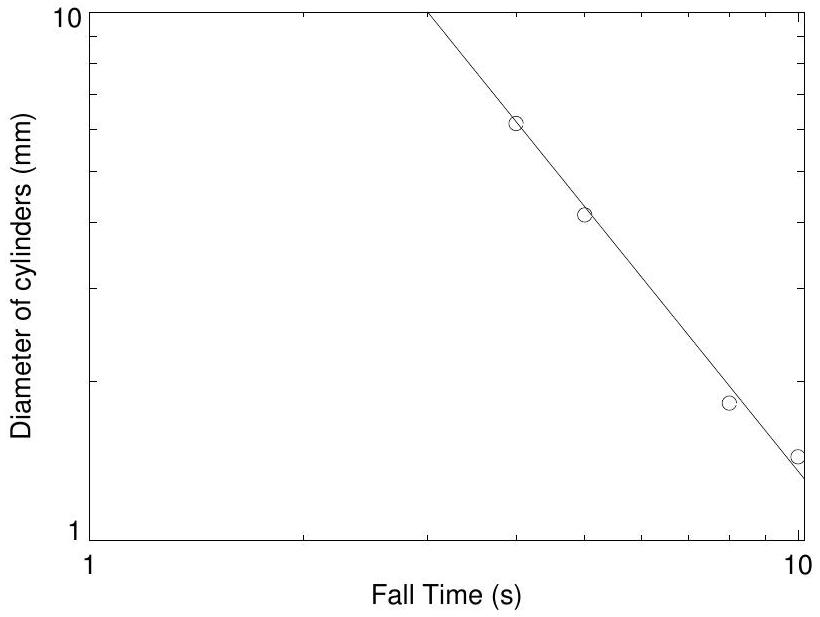
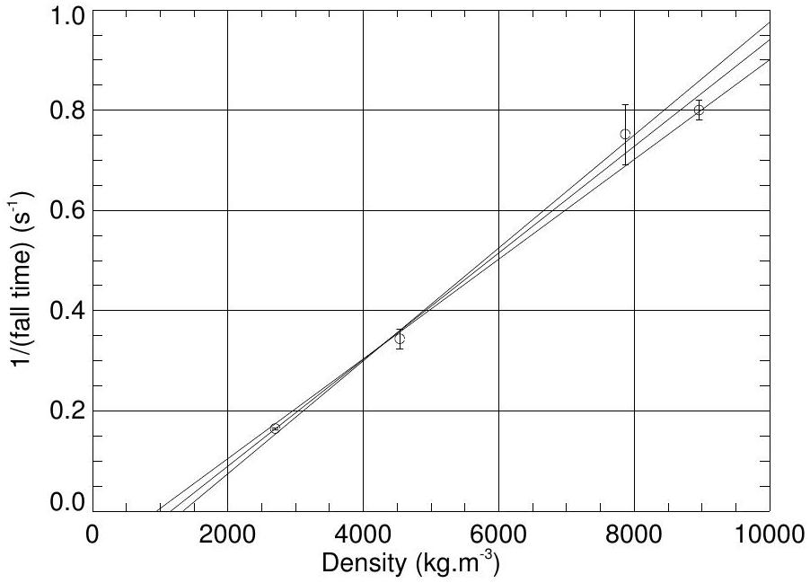

## Solution to Experimental Question 1

## Preliminary: Calculation of Terminal Velocity

When the cylinder is moving at its terminal velocity, the resultant of the three forces acting on the cylinder, gravity, viscous drag and buoyant force, is zero.

$$
V \rho g - 6 \pi \kappa \eta r ^ { m } v _ { T } - V \rho ^ { \prime } g = 0
$$

where $V = 2 \pi r ^ { 3 }$ is the volume of a cylinder (whose height is $2 r$ ).
This gives

$$
v _ { r } = C r ^ { 3 - m } \left( \rho - \rho ^ { \prime } \right)
$$

where

$$
C = \frac { g } { 3 \kappa \eta }
$$

## Experiment

## Determination of the exponent $m$

Aluminium cylinders of different diameters are dropped into the glycerine. Fall times between specified marks on the measuring cylinder containing the glycerine are recorded for each cylinder. A preliminary experiment should establish that the cylinders have reached their terminal velocity before detailed results are obtained. The measurements are repeated several times for each cylinder and an average fall time is calculated. Table 1 shows a typical set of data. To find the value of $m$ a graph of $\log$ (fall time) as a function of $\log$ (diameter) is plotted as in figure 1. The slope of the resulting straight line graph is $3 - m$ from which a value of $m$ can be determined. A reasonable value for $m$ is 1.33 with an uncertainty of order ±0.1. The uncertainty is estimated by the deviation from the line of best fit through the data points obtained by drawing other possible lines.

## Determination of the density of glycerine

Cylinders with the same geometry but different densities are dropped into the glycerine and timed as in the first part of the experiment. Table 2 shows a typical set of results. From equation (2) a linear plot of $1 / t$ as a function of density should yield a straight line with an intercept on the density axis corresponding to the density of glycerine. Figure 2 shows a typical plot. Alternatively the terminal velocities could be calculated and plotted against density which would again lead to the same intercept on the density axis. The uncertainty in the measurement can be estimated by drawing other possible straight lines through the data points and noting the change in the value of the intercept.

| Diameter (mm) | Individual readings (s) |  |  |  |  |  | Mean (s) |
| :--- | :--- | :--- | :--- | :--- | :--- | :--- | :--- |
| 10 | 1.44 | 1.56 | 1.44 | 1.37 | 1.44 | 1.41 | 1.44 |
| 4 | 6.22 | 6.06 | 6.16 | 6.13 | 6.13 | 6.22 | 6.15 |
| 8 | 1.80 | 1.82 | 1.78 | 1.84 | 1.82 | 1.81 | 1.82 |
| 5 | 4.06 | 4.34 | 4.09 | 4.12 | 4.25 | 4.13 | 4.13 |

Table 1: Sample data set

Figure 1: Sample plot

$$
\text { Slope } = - \frac { 58.2 } { 66.2 } \div \frac { 48.5 } { 93 } = - 1.67 \quad \therefore m = 3 - 1.67 = 1.33
$$

| Material | Individual readings (s) |  |  |  |  |  | Mean (s) |
| :--- | :--- | :--- | :--- | :--- | :--- | :--- | :--- |
| Ti | 3.00 | 2.91 | 2.97 | 2.91 | 2.84 | 2.75 | 2.91 |
| Cu | 1.25 | 1.25 | 1.28 | 1.25 | 1.22 | 1.22 | 1.25 |
| S.Steel | 1.31 | 1.32 | 1.38 | 1.44 | 1.31 | 1.34 | 1.33 |
| Al | 6.03 | 6.09 | 6.09 | 6.16 | 6.06 | 6.06 | 6.08 |

Table 2: Sample data set

Figure 2: Sample plot

$$
\rho ^ { \prime } = ( 1.1 \pm 0.2 ) \times 10 ^ { 3 } \mathrm {~kg} . \mathrm { m } ^ { - 3 }
$$

## Detailed mark allocation

Section I
Reasonable range of data points with a scatter of ~ 0.1 s [2]
Check that the cylinders have reached their terminal velocity
Visual check, or check referred to [1]
Specific data presented [1]
Labelled log-log graph [2]
Data points for all samples, with a reasonable scatter about a straight line on the log-log graph [1]
Calculation of $( 3 - m )$ from graph [1]
including estimate of error in determining $m$ [1]
Reasonable value of $m , \sim 1.33$ [1]
Subtotal [10]
Section 2
Reasonable range of data points [1]
Check that the cylinders have reached their terminal velocity [1]
Labelled graph of (falltime) ${ } ^ { - 1 }$ vs. density of cylinder [1]
Data points for all samples, with a reasonable scatter about a straight line on the (falltime) ${ } ^ { - 1 }$ vs. density of cylinder graph [1]
Calculation of the density of glycerine $\left( \rho ^ { \prime } \right)$ from this graph [1]
Estimate of uncertainty in $\rho ^ { \prime }$ [1]
Reasonable value of $\rho ^ { \prime }$. "Correct" value is $1.260 \mathrm {~kg} . \mathrm { m } ^ { - 3 }$ [1]
Subtotal [8]
TOTAL 20
