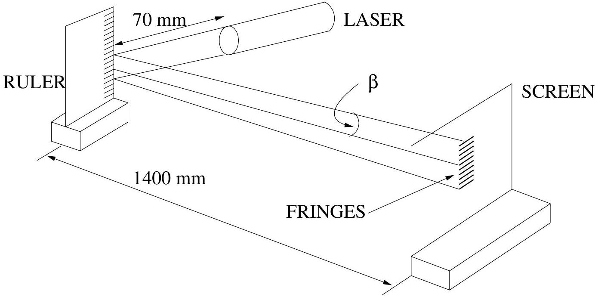
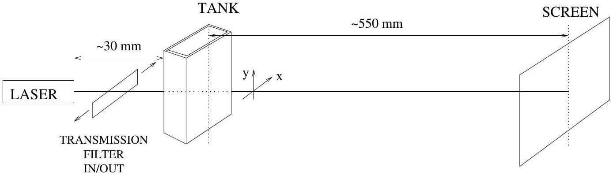
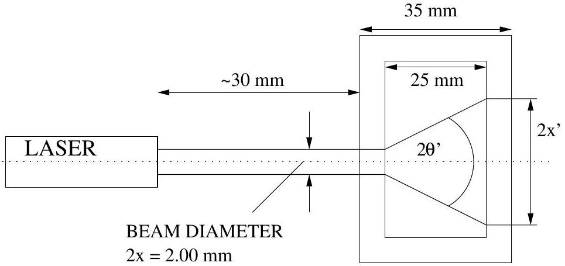
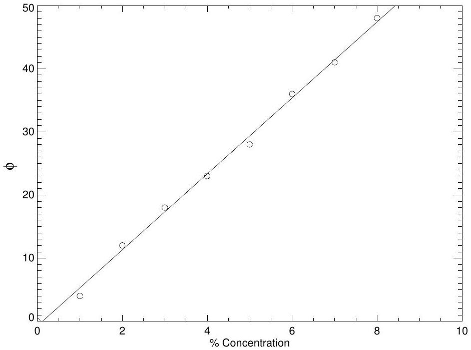
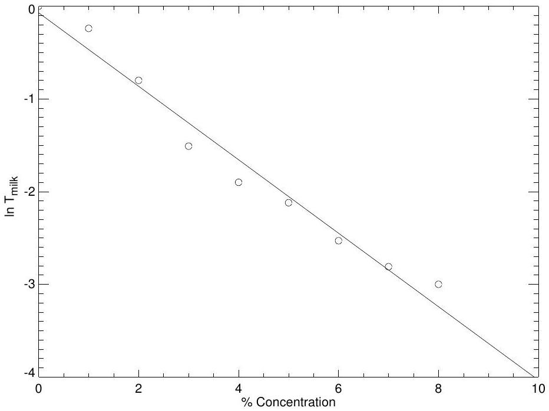

## Solution to Experimental Question 2

Section 1

i. A typical geometric layout is as shown below.
    (a) Maximum distance from ruler to screen is advised to increase the spread of the diffraction pattern.
    (b) Note that the grating (ruler) lines are horizontal, so that diffraction is in the vertical direction.

ii.Vis a vis the diffraction phenomenon, $\beta = \left( \frac { y } { 1400 \mathrm {~mm} } \right)$
The angle $\beta$ is measured using either a protractor (not recommended) or by measuring the value of the fringe separation on the screen, $y$, for a given order $N$.
If the separation between 20 orders is measured, then $N = \pm 10$ ( $N = 0$ is central zero order).
The values of $y$ should be tabulated for $N = 10$. If students choose other orders, this is also acceptable.

| $N$ | ±10 | $\pm 10$ | ±10 | ±10 | $\pm 10$ | $\pm 10$ | $\pm 10$ | $\pm 10$ | $\pm 10$ | $\pm 10$ |
| :--- | :--- | :--- | :--- | :--- | :--- | :--- | :--- | :--- | :--- | :--- |
| $2 y$ mm | 39.0 | 38.5 | 39.5 | 41.0 | 37.5 | 38.0 | 39.0 | 38.0 | 37.0 | 37.5 |
| $y$ mm | 19.5 | 19.25 | 19.75 | 20.5 | 18.75 | 19.0 | 19.5 | 19.0 | 18.5 | 18.75 |

Mean Value $= ( 19.25 \pm 1.25 ) \mathrm { mm }$
i.e. Mean "spot" distance $= 19.25 \mathrm {~mm}$ for order $N = 10$.
From observation of the ruler itself, the grating period, $h = ( 0.50 \pm 0.02 ) \mathrm { mm }$.
Thus in the relation

$$
\begin{aligned}
N \lambda & = \pm h \sin \beta \\
N & = 10 \\
h & = 0.5 \mathrm {~mm} \\
\sin \beta \simeq \beta & = \frac { y } { 1400 \mathrm {~mm} } = 0.01375 \\
10 \lambda & = 0.006875 \mathrm {~mm} \\
\lambda & = 0.0006875 \mathrm {~mm}
\end{aligned}
$$

Since $\beta$ is small, $\frac { \delta \lambda } { \lambda } \simeq \frac { \delta h } { h } + \frac { \delta y } { y } \simeq 10 \%$
i.e. measured $\lambda = ( 690 \pm 70 ) \mathrm { nm }$
The accepted value is 680 nm so that the departure from accepted value equals 1.5\%.

## Section 2

This section tests the student's ability to make semi-quantitative measurements and the use of judgement in making observations.

i. Using the $T = 50 \%$ transmission disc, students should note that the transmission through the tank is greater than this value. Using a linear approximation, 75\% could well be estimated. Using the hint about the eye's logarithmic response, the transmission through the tank could be estimated to be as high as 85\%.
Any figure for transmission between 75\% and 85\% is acceptable.
ii. Calculation of the transmission through the tank, using
$$
T = 1 - R = 1 - \left( \frac { n _ { 1 } - n _ { 2 } } { n _ { 1 } + n _ { 2 } } \right) ^ { 2 }
$$
for each of the four surfaces of the tank, and assuming $n = 1.59$ for the perspex, results in a total transmission
$$
T _ { \text {total } } = 80.80 \%
$$

## Section 3

With water in the tank, surfaces 2 and 3 become perspex/water interfaces instead of perspex/air interfacs, as in (ii).

The resultant value is

$$
T _ { \text {total } } = 88.5 \%
$$

## Section 4

Possible configuration for section 4 (and sections 2 and 3)

With pure water in the tank only, we see from Section 3 that the transmission $T$ is

$$
T _ { \text {Water } } \simeq 88 \%
$$

The aim here is to determine the beam divergence (scatter) and transmission as a function of milk concentration. Looking down on the tank, one sees

i. The entrance beam diameter is 2.00 mm . The following is an example of the calculations expected: With 0.5 mL milk added to the 50 mL water, we find
$$
\text { Scatterer concentration } = \frac { 0.5 } { 50 } = 1 \% = 0.01
$$
Scattering angle
$$
2 x ^ { \prime } = 2.2 \mathrm {~mm} \quad ; \quad 2 \theta ^ { \prime } = \frac { 2 x ^ { \prime } } { 30 } = 0.073
$$
Transmission estimated with the assistance of the neutral density filters
$$
T _ { \text {total } } = 0.7 .
$$
Hence
$$
T _ { \text {milk } } = \frac { 0.7 } { 0.88 } = 0.79
$$
Note that
$$
\begin{equation*}
T _ { \text {milk } } = \frac { T _ { \text {total } } } { T _ { \text {water } } } \quad \text { and } \quad T _ { \text {water } } = 0.88 \tag{1}
\end{equation*}
$$
If students miss the relationship (1), deduct one mark.
ii.\& iii. One thus obtains the following table of results. $2 \theta ^ { \prime }$ can be determined as shown above, OR by looking down onto the tank and using the protractor to measure the value of $2 \theta ^ { \prime }$. It is important to note that even in the presence of scattering, there is still a direct beam being transmitted. It is much stronger than the scattered radiation intensity, and some skill will be required in measuring the scattering angle $2 \theta ^ { \prime }$ using either method. Making the correct observations requires observational judgement on the part of the student.
Typical results are as follows:

| Milk volume (mL) | 0 | 0.5 | 1.0 | 1.5 | 2.0 | 2.5 | 3.0 | 3.5 | 4.0 |
| :--- | :--- | :--- | :--- | :--- | :--- | :--- | :--- | :--- | :--- |
| \% Concentration | 0 | 1 | 2 | 3 | 4 | 5 | 6 | 7 | 8 |
| $2 x ^ { \prime }$ | 2.00 | 2.2 | 6.2 | 9.4 | 12 | Protractor |  |  |  |
| $2 \theta ^ { \prime }$ (Degrees) | ~ 0 | 4 | 12 | 18 | 23 | 28 | 36 | 41 | 48 |
| $T _ { \text {milk } }$ | 1.0 | 0.79 | 0.45 | 0.22 | 0.15 | 0.12 | 0.08 | 0.06 | 0.05 |

    iii. From the graphed results in Figure 1, one obtains an approximately linear relationship between milk concentration, $C$, and scattering angle, $2 \theta ^ { \prime } ( = \phi )$ of the form
$$
\phi = 6 C .
$$
    iv.Assuming the given relation

$$
I = I _ { 0 } e ^ { - \mu z } = T _ { \text {milk } } I _ { 0 }
$$

where $z$ is the distance into the tank containing milk/water.
We have

$$
T _ { \text {milk } } = e ^ { - \mu z }
$$

Thus

$$
\ln T _ { \text {milk } } = - \mu z , \text { and } \mu = \text { constant } \times C
$$

Hence $\ln T _ { \text {milk } } = - \alpha z C$.
Since $z$ is a constant in this experiment, a plot of $\ln T _ { \text {milk } }$ as a function of $C$ should yield a straight line. Typical data for such a plot are as follows:

| \% Concentration | 0 | 1 | 2 | 3 | 4 | 5 | 6 | 7 | 8 |
| :--- | :--- | :--- | :--- | :--- | :--- | :--- | :--- | :--- | :--- |
| $T _ { \text {milk } }$ | 1.0 | 0.79 | 0.45 | 0.22 | 0.15 | 0.12 | 0.08 | 0.06 | 0.05 |
| $\ln T _ { \text {milk } }$ | 0 | -0.24 | -0.8 | -1.51 | -1.90 | -2.12 | -2.53 | -2.81 | -3.00 |

An approximately linear relationship is obtained, as shown in Figure 2, between $\ln T _ { \text {milk } }$ and $C$, the concentration viz.

$$
\ln T _ { \mathrm { milk } } \simeq - 0.4 C = - \mu z
$$

Thus we can write

$$
T _ { \mathrm { milk } } = e ^ { - 0.4 C } = e ^ { - \mu z }
$$

For the tank used, $z = 25 \mathrm {~mm}$ and thus

$$
0.4 C = 25 \mu \quad \text { or } \quad \mu = 0.016 C \quad \text { whence } \quad \alpha = 0.016 \mathrm {~mm} ^ { - 1 } \% ^ { - 1 }
$$

By extrapolation of the graph of $\ln T _ { \text {milk } }$ versus concentration $C$, one finds that for a scatterer concentration of 10\%

$$
\mu = 0.160 \mathrm {~mm} ^ { - 1 } .
$$

Figure 1: Sample plot

Figure 2: Sample plot

## Detailed Mark Allocation

Section 1
A clear diagram illustrating geometry used with appropriate allocations [1]
Optimal geometry used - as per model solution (laser close to ruler) [1]
Multiple measurements made to ascertain errors involved [1]
Correctly tabulated results [1]
Sources of error including suggestion of ruler variation (suggested by non-ideal diffraction pattern) [1]
Calculation of uncertainty [1]
Final result [2]
Allocated as per:

$$
\begin{aligned}
& \pm 10 \% ( 612,748 \mathrm {~nm} ) \\
& \pm 20 \% ( 544,816 \mathrm {~nm} ) \\
& \pm \text { anything worse }
\end{aligned}
$$

[2]
[1]
[0]
Section 2
For evidence of practical determination of transmission rather than simply "back calculating". Practical range 70-90\% [1]
For correct calculation of transmission (no more than 3 significant figures stated) [1]
Section 3
Correct calculation with no more than 3 significant figures stated and an indication that the measurement was performed [1]
Section 4
Illustrative diagram including viewing geometry used, i.e. horizontal/vertical [1]
For recognizing the difference between scattered light and the straight-through beam [1]
For taking the $T _ { \text {water } }$ into account when calculating $T _ { \text {milk } }$ [1]
Correctly calculated and tabulated results of $T _ { \text {milk } }$ with results within 20\% of model solution [1]
Using a graphical technique for determining the relationship between scatter angle and milk concentration [1]
Using a graphical technique to extrapolate $T _ { \text {milk } }$ to 10\% concentration [1]
Final result for $\mu$ [2]
Allocated as $\pm 40 \%$ [2], $\pm 60 \%$ [1], anything worse [0]
A reasonable attempt to consider uncertainties [1]
TOTAL 20
