## Solutions to Theoretical Question 1

## Gravitational Red Shift and the Measurement of Stellar Mass

(a) If a photon has an effective inertial mass $m$ determined by its energy then $m c ^ { 2 } = h f$ or $m = \frac { h f } { c ^ { 2 } }$. Now, assume that gravitational mass = inertial mass, and consider a photon of energy $h f$ (mass $m = \frac { h f } { c ^ { 2 } }$ ) emitted upwards at a distance $r$ from the centre of the star. It will lose energy on escape from the gravitational field of the star.
Apply the principle of conservation of energy:
Change in photon energy $\left( h f _ { i } - h f _ { f } \right) =$ change in gravitational energy, where subscript $i \rightarrow$ initial state and subscript $f \rightarrow$ final state.
$$
\begin{aligned}
h f _ { i } - h f _ { f } & = - \frac { G M m _ { f } } { \infty } - \left[ - \frac { G M m _ { i } } { r } \right] \\
h f _ { f } & = h f _ { i } - \frac { G M m _ { i } } { r } \\
h f _ { f } & = h f _ { i } - \frac { G M \frac { h f _ { i } } { c ^ { 2 } } } { r } \\
h f _ { f } & = h f _ { i } \left[ 1 - \frac { G M } { r c ^ { 2 } } \right] \\
\frac { f _ { f } } { f _ { i } } & = \left[ 1 - \frac { G M } { r c ^ { 2 } } \right] \\
\frac { \Delta f } { f } & = \frac { f _ { f } - f _ { i } } { f _ { i } } = - \frac { G M } { r c ^ { 2 } }
\end{aligned}
$$
The negative sign shows red-shift, i.e. a decrease in $f$, and an increase in wavelength. Thus, for a photon emitted from the surface of a star of radius $R$, we have
$$
\frac { \Delta f } { f } = \frac { G M } { R c ^ { 2 } }
$$
Since the change in photon energy is small, $( \delta f \ll f )$,
$$
m _ { f } \simeq m _ { i } = \frac { h f _ { i } } { c ^ { 2 } } .
$$
(b) The change in photon energy in ascending from $r _ { i }$ to $r _ { f }$ is given by
$$
\begin{aligned}
h f _ { i } - h f _ { f } & = - \frac { G M m _ { f } } { r _ { f } } + \frac { G M m _ { i } } { r _ { i } } \\
& \simeq \frac { G M h f _ { i } } { c ^ { 2 } } \left[ \frac { 1 } { r _ { i } } - \frac { 1 } { r _ { f } } \right] \\
\therefore \frac { f _ { f } } { f _ { i } } & = 1 - \frac { G M } { c ^ { 2 } } \left[ \frac { 1 } { r _ { i } } - \frac { 1 } { r _ { f } } \right]
\end{aligned}
$$
In the experiment, $R$ is the radius of the star, $d$ is the distance from the surface of the star to the spacecraft and the above equation becomes:
$$
\begin{equation*}
\frac { f _ { f } } { f _ { i } } = 1 - \frac { G M } { c ^ { 2 } } \left[ \frac { 1 } { R } - \frac { 1 } { R + d } \right] \tag{1}
\end{equation*}
$$
The frequency of the photon must be doppler shifted back from $f _ { f }$ to $f _ { i }$ in order to cause resonance excitation of the $\mathrm { He } ^ { + }$ions in the spacecraft.
Thus apply the relativistic Doppler principle to obtain:
$$
\frac { f ^ { \prime } } { f _ { f } } = \sqrt { \frac { 1 + \beta } { 1 - \beta } }
$$

where $f ^ { \prime }$ is the frequency as received by $\mathrm { He } ^ { + }$ions in the spacecraft, and $\beta = v / c$.
That is, the gravitationally reduced frequency $f _ { f }$ has been increased to $f ^ { \prime }$ because of the velocity of the ions on the spacecraft towards the star. Since $\beta \ll 1$,

$$
\frac { f _ { f } } { f ^ { \prime } } = ( 1 - \beta ) ^ { \frac { 1 } { 2 } } ( 1 + \beta ) ^ { - \frac { 1 } { 2 } } \simeq 1 - \beta
$$

Alternatively, since $\beta \ll 1$, use the classical Doppler effect directly.
Thus

$$
f ^ { \prime } = \frac { f _ { f } } { 1 - \beta }
$$

or

$$
\frac { f _ { f } } { f ^ { \prime } } = 1 - \beta
$$

Since $f ^ { \prime }$ must be equal to $f _ { i }$ for resonance absorption, we have

$$
\begin{equation*}
\frac { f _ { f } } { f _ { i } } = 1 - \beta \tag{2}
\end{equation*}
$$

Substitution of 2 into 1 gives

$$
\begin{equation*}
\beta = \frac { G M } { c ^ { 2 } } \left( \frac { 1 } { R } - \frac { 1 } { R + d } \right) \tag{3}
\end{equation*}
$$

Given the experimental data, we look for an effective graphical solution. That is, we require a linear equation linking the experimental data in $\beta$ and $d$.
Rewrite equation 3:

$$
\beta = \frac { G M } { c ^ { 2 } } \left[ \frac { R + d - R } { ( R + d ) R } \right]
$$

Inverting the equation gives:

$$
\frac { 1 } { \beta } = \left( \frac { R c ^ { 2 } } { G M } \right) \left[ \frac { R } { d } + 1 \right]
$$

or

$$
\frac { 1 } { \beta } = \left( \frac { R ^ { 2 } c ^ { 2 } } { G M } \right) \frac { 1 } { d } + \frac { R c ^ { 2 } } { G M }
$$

Graph of $\frac { 1 } { \beta }$ vs. $\frac { 1 } { d }$
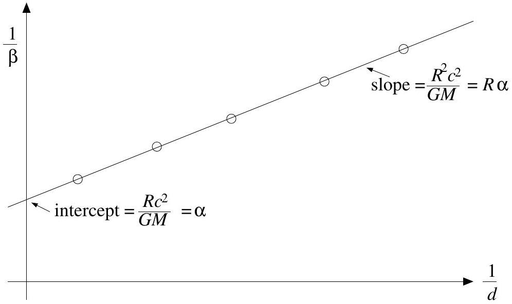

$$
\begin{equation*}
\text { The slope is } \left( \frac { R c ^ { 2 } } { G M } \right) R = \alpha R \tag{A}
\end{equation*}
$$

$$
\begin{equation*}
\text { The } \frac { 1 } { \beta } \text {-intercept is } \left( \frac { R c ^ { 2 } } { G M } \right) = \alpha \tag{B}
\end{equation*}
$$

$$
\begin{equation*}
\text { and the } \frac { 1 } { d } \text {-intercept is } - \frac { 1 } { R } \tag{C}
\end{equation*}
$$

$R$ and $M$ can be conveniently determined from (A) and (B). Equation (C) is redundant. However, it may be used as an (inaccurate) check if needed.
From the given data:

$$
\begin{aligned}
R & = 1.11 \times 10 ^ { 8 } \mathrm {~m} \\
M & = 5.2 \times 10 ^ { 3 } 0 \mathrm {~kg}
\end{aligned}
$$

$$
\begin{align*}
& \text { From the graph, the slope } \alpha R = 3.2 \times 10 ^ { 12 } \mathrm {~m}  \tag{A}\\
& \text { The } \frac { 1 } { \beta } \text {-intercept } \alpha = \frac { R c ^ { 2 } } { G M } = 0.29 \times 10 ^ { 5 } \tag{B}
\end{align*}
$$

Dividing (A) by (B)

$$
R = \frac { 3.2 \times 10 ^ { 12 } \mathrm {~m} } { 0.29 \times 10 ^ { 5 } } \simeq 1.104 \times 10 ^ { 8 } \mathrm {~m}
$$

Substituting this value of $R$ back into (B) gives:

$$
M = \frac { R c ^ { 2 } } { g \alpha } = \frac { \left( 1.104 \times 10 ^ { 8 } \right) \times \left( 3.0 \times 10 ^ { 8 } \right) ^ { 2 } } { \left( 6.7 \times 10 ^ { - 11 } \right) \times \left( 0.29 \times ^ { 1 } 0 ^ { 5 } \right) }
$$

or $M = 5.11 \times 10 ^ { 30 } \mathrm {~kg}$
(c)
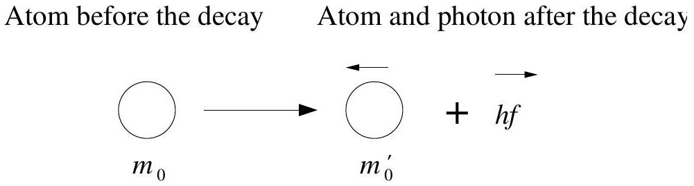
For the photon, photon momentum is $p = \frac { h f } { c }$ and photon energy is $E = h f$.
Use the mass-energy equivalence, $E = m c ^ { 2 }$, to relate the internal energy change of the atom to the rest-mass change. Thus:

$$
\begin{equation*}
\Delta E = \left( m _ { 0 } = m _ { 0 } ^ { \prime } \right) c ^ { 2 } \tag{1}
\end{equation*}
$$

In the laboratory frame of reference the energy before emission is

$$
\begin{equation*}
E = m _ { 0 } c ^ { 2 } \tag{2}
\end{equation*}
$$

Recalling the relativistic relation

$$
E ^ { 2 } = p ^ { 2 } c ^ { 2 } + m _ { 0 } ^ { 2 } c ^ { 4 }
$$

The energy after emission of a photon is

$$
\begin{equation*}
E = \sqrt { p ^ { 2 } c ^ { 2 } + m _ { 0 } ^ { \prime } { } ^ { 2 } c ^ { 4 } } + h f \tag{3}
\end{equation*}
$$

where also $p = h f / c$ by conservation of momentum.
Conservation of energy requires that (2) = (3), so that:

$$
\begin{array} { r }
\left( m _ { 0 } c ^ { 2 } - h f \right) ^ { 2 } = ( h f ) ^ { 2 } + m _ { 0 } ^ { 2 } c ^ { 4 } \\
\left( m _ { 0 } c ^ { 2 } \right) ^ { 2 } - 2 h f m _ { 0 } c ^ { 2 } = m _ { 0 } ^ { 2 } c ^ { 4 }
\end{array}
$$

Carrying out the algebra and using equation (1):

$$
\begin{aligned}
h f \left( 2 m _ { 0 } c ^ { 2 } \right) & = \left( m _ { 0 } ^ { 2 } - m _ { 0 } ^ { \prime 2 } \right) c ^ { 4 } \\
& = \left( m _ { 0 } - m _ { 0 } ^ { \prime } \right) c ^ { 2 } \left( m _ { 0 } + m _ { 0 } ^ { \prime } \right) c ^ { 2 } \\
& = \Delta E \left[ 2 m _ { 0 } - \left( m _ { 0 } - m _ { 0 } ^ { \prime } \right) \right] c ^ { 2 } \\
& = \Delta E \left[ 2 m _ { 0 } c ^ { 2 } - \Delta E \right]
\end{aligned}
$$

$$
h f = \Delta E \left[ 1 - \frac { \Delta E } { 2 m _ { 0 } c ^ { 2 } } \right]
$$

(ii)
For the emitted photon,

$$
h f = \Delta E \left[ 1 - \frac { \Delta E } { 2 m _ { 0 } c ^ { 2 } } \right] .
$$

If relativistic effects are ignored, then

$$
h f _ { 0 } = \Delta E .
$$

Hence the relativistic frequency shift $\frac { \Delta f } { f _ { 0 } }$ is given by

$$
\frac { \Delta f } { f _ { 0 } } = \frac { \Delta E } { 2 m _ { 0 } c ^ { 2 } }
$$

For $\mathrm { He } ^ { + }$transition $( n = 2 \rightarrow 1 )$, applying Bohr theory to the hydrogen-like helium ion gives:

$$
\Delta E = 13.6 \times 2 ^ { 2 } \times \left[ \frac { 1 } { 1 ^ { 2 } } - \frac { 1 } { 2 ^ { 2 } } \right] = 40.8 \mathrm { ev }
$$

Also, $m _ { 0 } c ^ { 2 } = 3.752 \times 10 ^ { 6 } \mathrm { eV }$. Therefore the frequency shift due to the recoil gives

$$
\frac { \Delta f } { f _ { 0 } } \simeq 5.44 \times 10 ^ { - 12 }
$$

This is very small compared to the gravitational red-shift of $\frac { \Delta f } { f } \sim 10 ^ { - 5 }$, and may be ignored in the gravitational red-shift experiment.

## Solutions to Theoretical Question 2

(a) Snell's Law may be expressed as
$$
\begin{equation*}
\frac { \sin \theta } { \sin \theta _ { 0 } } = \frac { c } { c _ { 0 } } , \tag{1}
\end{equation*}
$$
where $c$ is the speed of sound.
Consider some element of ray path $d s$ and treat this as, locally, an arc of a circle of radius $R$. Note that $R$ may take up any value between 0 and $\infty$. Consider a ray component which is initially directed upward from $S$.
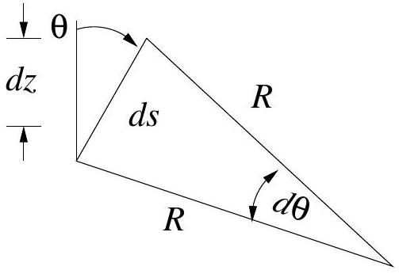
In the diagram, $d s = R d \theta$, or $\frac { d s } { d \theta } = R$.
From equation (1), for a small change in speed $d c$,
$$
\cos \theta d \theta = \frac { \sin \theta _ { 0 } } { c _ { 0 } } d c
$$
For the upwardly directed ray $c = c _ { 0 } + b z$ so $d c = b d z$ and
$$
\frac { \sin \theta _ { 0 } } { c _ { 0 } } b d z = \cos \theta d \theta , \text { hence } d z = \frac { c _ { 0 } } { \sin \theta _ { 0 } } \frac { 1 } { b } \cos \theta d \theta
$$
We may also write (here treating $d s$ as straight) $d z = d s \cos \theta$. So
$$
d s = \frac { c _ { 0 } } { \sin \theta _ { 0 } } \frac { 1 } { b } d \theta
$$
Hence
$$
\frac { d s } { d \theta } = R = \frac { c _ { 0 } } { \sin \theta _ { 0 } } \frac { 1 } { b } .
$$
This result strictly applies to the small arc segments $d s$. Note that from equation (1), however, it also applies for all $\theta$, i.e. for all points along the trajectory, which therefore forms an arc of a circle with radius $R$ until the ray enters the region $z < 0$.
(b) 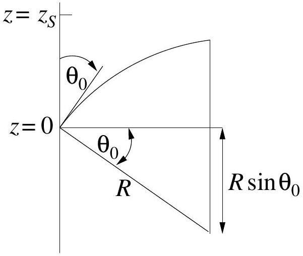

Here

$$
\begin{aligned}
z _ { s } & = R - R \sin \theta _ { 0 } \\
& = R \left( 1 - \sin \theta _ { 0 } \right) \\
& = \frac { c _ { 0 } } { b \sin \theta _ { 0 } } \left( 1 - \sin \theta _ { 0 } \right) ,
\end{aligned}
$$

from which

$$
\theta _ { 0 } = \sin ^ { - 1 } \left[ \frac { c _ { 0 } } { b z _ { s } + c _ { 0 } } \right] .
$$

(c)
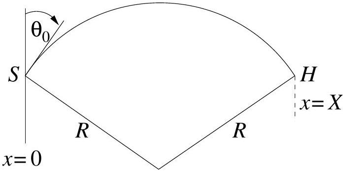
The simplest pathway between $S$ and $H$ is a single arc of a circle passing through $S$ and $H$. For this pathway:

$$
X = 2 R \cos \theta _ { 0 } = \frac { 2 c _ { 0 } \cos \theta _ { 0 } } { b \sin \theta _ { 0 } } = \frac { 2 c _ { 0 } } { b } \cot \theta _ { 0 } .
$$

Hence

$$
\cot \theta _ { 0 } = \frac { b X } { 2 c _ { 0 } } .
$$

The next possibility consists of two circular arcs linked as shown.
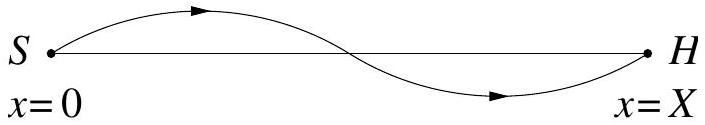
For this pathway:

$$
\frac { X } { 2 } = 2 R \cos \theta _ { 0 } = \frac { 2 c _ { 0 } } { b } \cot \theta _ { 0 } .
$$

i.e.

$$
\cot \theta _ { 0 } = \frac { b X } { 4 c _ { 0 } } .
$$

In general, for values of $\theta _ { 0 } < \frac { \pi } { 2 }$, rays emerging from $S$ will reach $H$ in $n$ arcs for launch angles given by

$$
\theta _ { 0 } = \cot ^ { - 1 } \left[ \frac { b X } { 2 n c _ { 0 } } \right] = \tan ^ { - 1 } \left[ \frac { 2 n c _ { 0 } } { b X } \right]
$$

where $n = 1,2,3,4 , \ldots$
Note that when $n = \infty , \theta _ { 0 } = \frac { \pi } { 2 }$ as expected for the axial ray.
(d)
With the values cited, the four smallest values of launch angle are

| $n$ | $\theta _ { 0 }$ (degrees) |
| :--- | :--- |
| 1 | 86.19 |
| 2 | 88.09 |
| 3 | 88.73 |
| 4 | 89.04 |

(e) The ray path associated with the smallest launch angle consists of a single arc as shown:
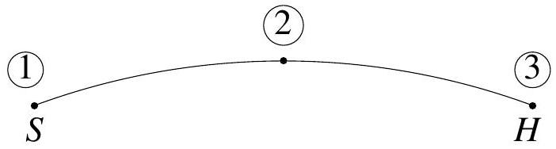
We seek
$$
\int _ { 1 } ^ { 3 } d t = \int _ { 1 } ^ { 3 } \frac { d s } { c }
$$
Try first:
$$
t _ { 12 } = \int _ { 1 } ^ { 2 } \frac { d s } { c } = \int _ { \theta _ { 0 } } ^ { \pi / 2 } \frac { R d \theta } { c }
$$
Using
$$
R = \frac { c } { b \sin \theta }
$$
gives
$$
t _ { 12 } = \frac { 1 } { b } \int _ { \theta _ { 0 } } ^ { \pi / 2 } \frac { d \theta } { \sin \theta }
$$
so that
$$
t _ { 12 } = \frac { 1 } { b } \left[ \ln \tan \frac { \theta } { 2 } \right] _ { \theta _ { 0 } } ^ { \pi / 2 } = - \frac { 1 } { b } \ln \tan \frac { \theta _ { 0 } } { 2 }
$$
Noting that $t _ { 13 } = 2 t _ { 12 }$ gives
$$
t _ { 13 } = - \frac { 2 } { b } \ln \tan \frac { \theta _ { 0 } } { 2 } .
$$
For the specified $b$, this gives a transit time for the smallest value of launch angle cited in the answer to part (d), of
$$
t _ { 13 } = 6.6546 \mathrm {~s}
$$
The axial ray will have travel time given by
$$
t = \frac { X } { c _ { 0 } }
$$
For the conditions given,
$$
t _ { 13 } = 6.6666 \mathrm {~s}
$$
thus this axial ray travels slower than the example cited for $n = 1$, thus the $n = 1$ ray will arrive first.

## Solutions to Theoretical Question 3

(a) The mass of the rod is given equal to the mass of the cylinder $M$ which itself is $\pi a ^ { 2 } l d$. Thus the total mass equals $2 M = 2 \pi a ^ { 2 } l d$. The mass of the displaced water is surely less than $\pi a ^ { 2 } l \rho$ (when the buoy is on the verge of sinking). Using Archimedes' principle, we may at the very least expect that
$$
2 \pi a ^ { 2 } l d < \pi a ^ { 2 } l \rho \text { or } d < \rho / 2
$$
In fact, with the floating angle $\alpha ( < \pi )$ as drawn, the volume of displaced water is obtained by geometry:
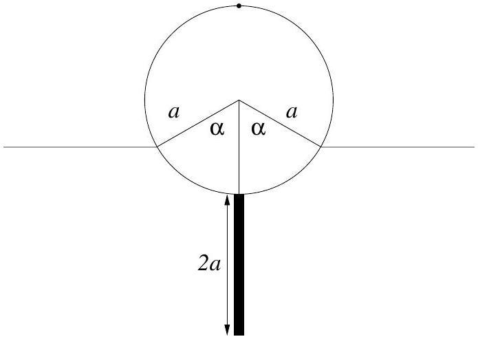
$$
V = l a ^ { 2 } \alpha - l a ^ { 2 } \sin \alpha \cos \alpha .
$$
By Archimedes' principle, the mass of the buoy equals the mass of displaced water. Therefore, $2 \pi a ^ { 2 } l d = l a ^ { 2 } \rho ( \alpha - \sin \alpha \cos \alpha )$, i.e. $\alpha$ is determined by the relation
$$
\alpha - \sin \alpha \cos \alpha = 2 d \pi / \rho .
$$
(b) If the cylinder is depressed a small distance $z$ vertically from equilibrium, the nett upward restoring force is the weight of the extra water displaced or $g \rho .2 a \sin \alpha . l z$, directed oppositely to $z$. This is characteristic of simple harmonic motion and hence the Newtonian equation of motion of the buoy is (upon taking account of the extra factor 1/3)
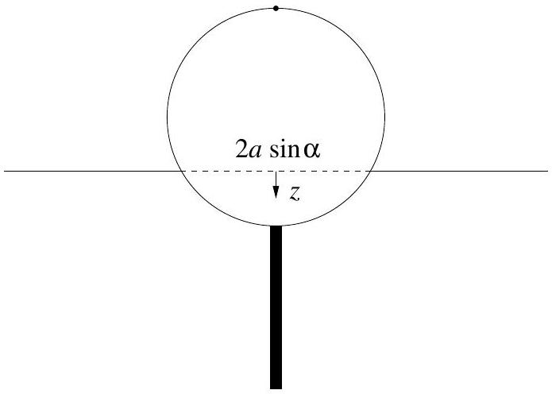
$$
8 M \ddot { z } / 3 = - 2 \rho g l z a \sin \alpha \text { or } \ddot { z } + \frac { 3 \rho g \sin \alpha } { 4 \pi d a } z = 0 ,
$$
and this is the standard sinusoidal oscillator equation (like a simple pendulum). The solution is of the type $z = \sin \left( \omega _ { z } t \right)$, with the angular frequency
$$
\omega _ { z } = \sqrt { \frac { 3 \rho g \sin \alpha } { 4 \pi d a } } = \sqrt { \frac { 3 g \sin \alpha } { 2 a ( \alpha - \cos \alpha \sin \alpha ) } } ,
$$
where we have used the relation worked out at the end of the first part.

(c) Without regard to the torque and only paying heed to vertical forces, if the buoy is swung by some angle so that its weight is supported by the nett pressure of the water outside, the volume of water displaced is the same as in equilibrium. Thus the centre of buoyancy remains at the same distance from the centre of the cylinder. Consequently we deduce that the buoyancy arc is an arc of a circle centred at the middle of the cylinder. In other words, the metacentre $M$ of the swinging motion is just the centre of the cylinder. In fact the question assumes this.
We should also notice that the centre of mass $G$ of the buoy is at the point where the rod touches the cylinder, since the masses of rod and cylinder each equal $M$. Of course the cylinder will experience a nett torque when the rod is inclined to the vertical. To find the period of swing, we first need to determine the moment of inertia of the solid cylinder about the central axis; this is just like a disc about the centre. Thus if $M$ is the cylinder mass
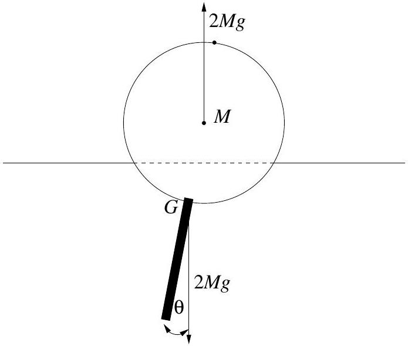
$$
I _ { 0 } = M a ^ { 2 } / 2 \left( = \int _ { 0 } ^ { a } r ^ { 2 } d m = \int _ { 0 } ^ { a } r ^ { 2 } .2 M r d r / a \right)
$$
The next step is to find the moment of inertia of the rod about its middle,
$$
I _ { r o d } = \int _ { - a } ^ { a } ( M d x / 2 a ) \cdot x ^ { 2 } = \left[ M x ^ { 3 } / 6 a \right] _ { - a } ^ { a } = M a ^ { 2 } / 3 .
$$
Finally, use the parallel axis theorem to find the moment of inertia of the buoy (cylinder + rod) about the metacentre $M$,
$$
I _ { M } = M a ^ { 2 } / 2 + \left[ M a ^ { 2 } / 3 + M ( 2 a ) ^ { 2 } \right] = 29 M a ^ { 2 } / 6 .
$$
(In this part we are neglecting the small horizontal motion of the bentre of mass; the water is the only agent which can supply this force!) When the buoy swings by an angle $\theta$ about equilibrium the restoring torque is $2 M g a \sin \theta \simeq 2 M g a \theta$ for small angles, which represents simple harmonic motion (like simple pendulum). Therefore the Newtonian rotational equation of motion is
$$
I _ { M } \ddot { \theta } \simeq - 2 M g a \theta , \text { or } \ddot { \theta } + \frac { 12 g } { 29 a } = 0 .
$$
The solution is a sinusoidal function, $\theta \propto \sin \left( \omega _ { \theta } t \right)$, with angular frequency
$$
\omega _ { \theta } = \sqrt { 12 g / 29 a } .
$$
(d) The accelerometer measurements give
$$
T _ { \theta } / T _ { z } \simeq 1.5 \text { or } \left( \omega _ { z } / \omega _ { \theta } \right) ^ { 2 } \simeq 9 / 4 \simeq 2.25 \text {. Hence }
$$

$$
2.25 = \frac { 3 g \sin \alpha } { 2 a ( \alpha - \sin \alpha \cos \alpha ) } \frac { 29 a } { 12 g } ,
$$

producing the (transcendental) equation

$$
\alpha - \sin \alpha \cos \alpha \simeq 1.61 \sin \alpha .
$$

Since 1.61 is not far from 1.57 we have discovered that a physically acceptable solution is $\alpha \simeq \pi / 2$, which was to be shown. (In fact a more accurate solution to the above transcendental equation can be found numerically to be $\alpha = 1.591$.) Setting alpha $= \pi / 2$ hereafter, to simplify the algebra, $\omega _ { z } ^ { 2 } = 3 g / \pi a$ and $4 d / \rho = 1$ to a good approximation. Since the vertical period is 1.0 sec,

$$
1.0 = \left( 2 \pi / \omega _ { z } \right) ^ { 2 } = 4 \pi ^ { 3 } a / 3 g \quad ,
$$

giving the radius $a = 3 \times 9.8 / 4 \pi ^ { 3 } = .237 \mathrm {~m}$.
We can now work out the mass of the buoy (in SI units),

$$
2 M = 2 \pi a ^ { 2 } l d = 2 \pi a ^ { 2 } \cdot a \cdot \rho / 4 = \pi a ^ { 3 } \rho / 2 = \pi \times 500 \times ( .237 ) ^ { 3 } \simeq 20.9 \mathrm {~kg} .
$$

## Solutions to Original Theoretical Question 3

(a) Choose a frame where $z$ is along the normal to the mirror and the light rays define the $x - z$ plane. For convenience, recording the energy-momentum in the four-vector form, $\left( p _ { x } , p _ { y } , p _ { z } , E / c \right)$, the initial photon has
$$
P _ { i } = \left( p \sin \theta _ { i } , 0 , p \cos \theta _ { i } , p \right)
$$
where $p = E _ { i } / c = h f _ { i } / c$.
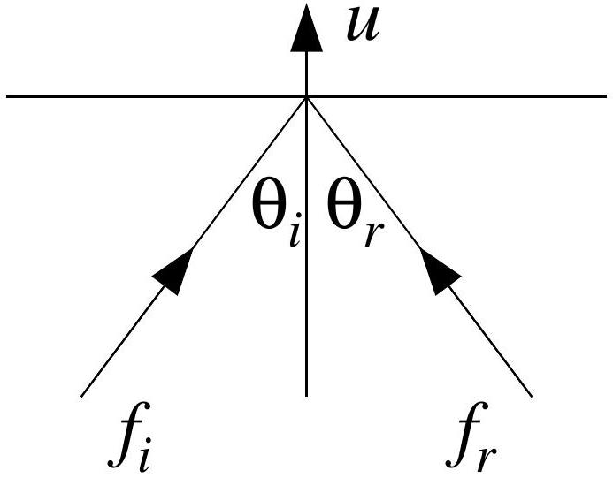
By the given Lorentz transformation rules, in the moving mirror frame the energy-momentum of the incident photon reads
$$
P _ { \text {mirror } } = \left( p \sin \theta _ { i } , 0 , \frac { p \cos \theta _ { i } - u p / c } { \sqrt { 1 - u ^ { 2 } / c ^ { 2 } } } , \frac { p - u p \cos \theta _ { i } / c } { \sqrt { 1 - u ^ { 2 } / c ^ { 2 } } } \right) .
$$
Assuming the collision is elastic in that frame, the reflected photon has energy-momentum,
$$
P _ { \text {mirror } } ^ { \prime } = \left( p \sin \theta _ { i } , 0 , \frac { - p \cos \theta _ { i } + u p / c } { \sqrt { 1 - u ^ { 2 } / c ^ { 2 } } } , \frac { p - u p \cos \theta _ { i } / c } { \sqrt { 1 - u ^ { 2 } / c ^ { 2 } } } \right) .
$$
Tansforming back to the original frame, we find that the reflected photon has
$$
\begin{aligned}
p _ { x r } & = p \sin \theta _ { i } , \quad p _ { y r } = 0 \\
p _ { z r } & = \frac { \left( - p \cos \theta _ { i } + u p / c \right) + u \left( p - u p \cos \theta _ { i } / c \right) / c } { 1 - u ^ { 2 } / c ^ { 2 } } \\
E _ { r } / c & = \frac { \left( p - u p \cos \theta _ { i } / c \right) + u \left( - p \cos \theta _ { i } + u p / c \right) / c } { 1 - u ^ { 2 } / c ^ { 2 } }
\end{aligned}
$$
Simplifying these expressions, the energy-momentum of the reflected photon in the original frame is
$$
P _ { r } = \left( p \sin \theta _ { i } , 0 , \frac { p \left( - \cos \theta _ { i } + 2 u / c - u ^ { 2 } \cos \theta _ { i } / c ^ { 2 } \right) } { 1 - u ^ { 2 } / c ^ { 2 } } , \frac { p \left( 1 - 2 u \cos \theta _ { i } / c + u ^ { 2 } / c ^ { 2 } \right) } { 1 - u ^ { 2 } / c ^ { 2 } } \right) .
$$
Hence the angle of reflection $\theta _ { r }$ is given by
$$
\tan \theta _ { r } = - \frac { p _ { x r } } { p _ { z } r } = \frac { \sin \theta _ { i } \left( 1 - u ^ { 2 } / c ^ { 2 } \right) } { \cos \theta _ { i } - 2 u / c + u ^ { 2 } \cos \theta _ { i } / c ^ { 2 } } = \frac { \tan \theta _ { i } \left( 1 - u ^ { 2 } / c ^ { 2 } \right) } { 1 + u ^ { 2 } / c ^ { 2 } - 2 u \sec \theta _ { i } / c ^ { 2 } } ,
$$
while the ratio of reflected frequency $f _ { r }$ to incident frequency $f _ { i }$ is simply the energy ratio,
$$
\frac { f _ { r } } { f _ { i } } = \frac { E _ { r } } { E _ { i } } = \frac { 1 - 2 u \cos \theta _ { i } / c + u ^ { 2 } / c ^ { 2 } } { 1 - u ^ { 2 } / c ^ { 2 } } .
$$
[For future use we may record the changes to first order in $u / c$ :
$$
\begin{array} { r }
\tan \theta _ { r } \simeq \tan \theta _ { i } \left( 1 + 2 u \sec \theta _ { i } / c \right) \text { so } \\
\tan \left( \theta _ { r } - \theta _ { i } \right) = \frac { \tan \theta _ { r } - \tan \theta _ { i } } { 1 + \tan \theta _ { r } \tan \theta _ { i } } \simeq \frac { 2 u \tan \theta _ { i } \sec \theta _ { i } / c } { 1 + \tan ^ { 2 } \theta _ { i } } \simeq \frac { 2 u \sin \theta _ { i } } { c }
\end{array}
$$
Thus, $\theta _ { r } \simeq \theta _ { i } + 2 u \sin \theta _ { i } / c$ and $f _ { r } = f _ { i } \left( 1 - 2 u \cos \theta _ { i } / c \right)$.]

(b) 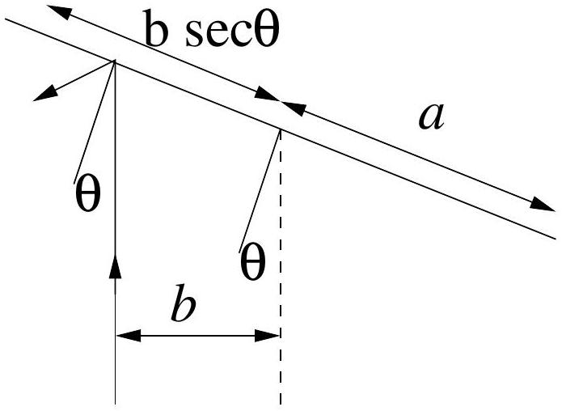
Hereafter define $\theta _ { i } = \theta$. Provided that $b / \cos \theta < a$ the laser light will reflect off the mirror, so $\cos \theta > b / a$ is needed for photon energy-momentum to be imparted to the mirror. Let us then define a critical angle $\alpha$ via $\cos \alpha = b / a$.

The change in the normal component $\Delta p _ { \| }$of the momentum of a single photon is

$$
\begin{gathered}
\Delta L = \frac { \Delta p _ { \| } b } { \cos \theta } = \frac { b } { \cos \theta } \left[ p \cos \theta - \frac { p \left( - \cos \theta + 2 u / c - u ^ { 2 } \cos \theta / c ^ { 2 } \right) } { 1 + u ^ { 2 } / c ^ { 2 } } \right] , \\
\Delta L = \frac { b p ( 2 \cos \theta - 2 u / c ) } { \cos \theta \left( 1 + u ^ { 2 } / c ^ { 2 } \right) } = \frac { 2 b p ( 1 - u \sec \theta / c ) } { \left( 1 + u ^ { 2 } / c ^ { 2 } \right) } \simeq 2 b p ( 1 - u \sec \theta / c ) .
\end{gathered}
$$

Since $u \cos \theta = \omega b , \Delta L \simeq 2 b p \left( 1 - \omega b \sec ^ { 2 } \theta / c \right)$ per photon. Suppose $N$ photons strike every second (and $| \theta |$ is less than the critical angle $\alpha$ ). Then in time $d t$ we have $N d t$ photons. But $d t = d \theta / \omega$, so in this time we have,

$$
d L = N \frac { d \theta } { \omega } \times 2 b p \left( \frac { \omega b } { c } \sec ^ { 2 } \theta \right)
$$

Thus the change in $\Delta L$ per revolution is

$$
\frac { d L } { d n } = 2 \times \frac { 2 b p N } { \omega } \int _ { - a } ^ { a } \left( 1 - \omega b \sec ^ { 2 } \theta / c \right) d \theta
$$

where $n$ refers to the number of revolutions. So

$$
\frac { d L } { d n } \simeq \frac { 8 b p N } { \omega } \left( \alpha - \frac { \omega b } { c } \tan \alpha \right) = \frac { 8 b P } { \omega c } \left( \alpha - \frac { \omega b } { c } \tan \alpha \right) ,
$$

since each photon has energy $p c$ and laser power equals $P = N p c$. Clearly $\omega _ { b } \ll c$ always, so $d L / d n \simeq 8 b P \alpha / \omega c$; thus

$$
\frac { d L } { d t } = \frac { d L } { d n } \frac { d n } { d t } = \frac { \omega } { 2 \pi } \frac { d L } { d n } = \frac { 4 b P \alpha } { \pi c } .
$$

(c) Therefore if $I$ is the moment of inertia of the mirror about its axis of rotation,
$$
I \frac { d \omega } { d t } \simeq \frac { 4 b P \alpha } { \pi c } , \text { or } \omega ( t ) \simeq \frac { 4 b P \alpha t } { \pi c I } .
$$
[Some students may derive the rate of change of angular velocity using energy conservation, rather than considering the increase of angular momentum of the mirror: To first order in $v / c , E _ { r } =$ $E ( 1 - 2 u \cos \theta / c )$, therefore the energy imparted to the mirror is
$$
\Delta E = E - E _ { r } \simeq \frac { 2 u E \cos \theta } { c } = \frac { 2 \omega b E } { c }
$$

In one revolution, the number of photons intersected is

$$
\frac { 4 \alpha } { 2 \pi } \times n \frac { 2 \pi } { \omega } = \frac { 4 \alpha n } { \omega } .
$$

Therefore the rate of increase of rotational energy ( $E _ { \text {rot } } = I \omega ^ { 2 } / 2$ ) is

$$
\frac { d E _ { \mathrm { rot } } } { d t } = \frac { 4 \alpha N } { \omega } \frac { 2 \omega b E } { c } \frac { d n } { d t } = \frac { 8 \alpha b P } { c } \frac { \omega } { 2 \pi } = \frac { 4 \alpha b P \omega } { \pi c }
$$

Thus $I \omega \cdot d \omega / d t = 4 \alpha b P / \pi c$, leading to $\omega ( t ) \simeq 4 \alpha b P t / \pi c I$, again.]

To estimate the deflection of the beam, one first needs to work out the moment of inertia of a rectangle of mass $m$ and side $2 a$ about the central axis. This is just like a rod. From basic principles,

$$
I = \int _ { - a } ^ { a } \frac { m d x } { 2 a } x ^ { 2 } = \left[ \frac { m x ^ { 3 } } { 6 a } \right] _ { - a } ^ { a } = \frac { m a ^ { 2 } } { 3 } = \frac { m b ^ { 2 } \sec ^ { 2 } \alpha } { 3 } .
$$

With the stated geometry, $a = b \sqrt { 2 }$, or $\alpha = 45 ^ { \circ }$, so

$$
\omega \simeq \frac { 12 \alpha P t \cos ^ { 2 } \alpha } { \pi m c b } \rightarrow \frac { 3 P t } { m c a \sqrt { 2 } } .
$$

At the edge, $u = \omega a = 3 P t / m c \sqrt { 2 }$, and the angle of deviation is

$$
\delta = \frac { 2 u \sin \alpha } { c } = \frac { 3 P t } { m c ^ { 2 } }
$$

[Interestingly, it is determined by the ratio of the energy produced by the laser to the rest-mass energy of the mirror.]
Using the given numbers, and in SI units, the deviation is

$$
\xi \simeq 10 ^ { 4 } \delta = \frac { 10 ^ { 4 } \times 3 \times 100 \times 24 \times 3600 } { 10 ^ { - 3 } \times \left( 3 \times 10 ^ { 8 } \right) ^ { 2 } } \simeq 2.9 \mathrm {~mm}
$$

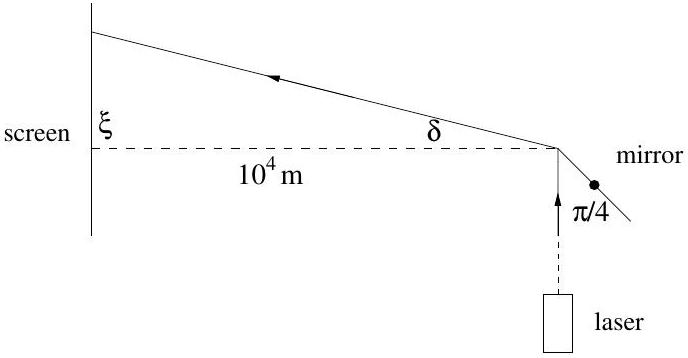
