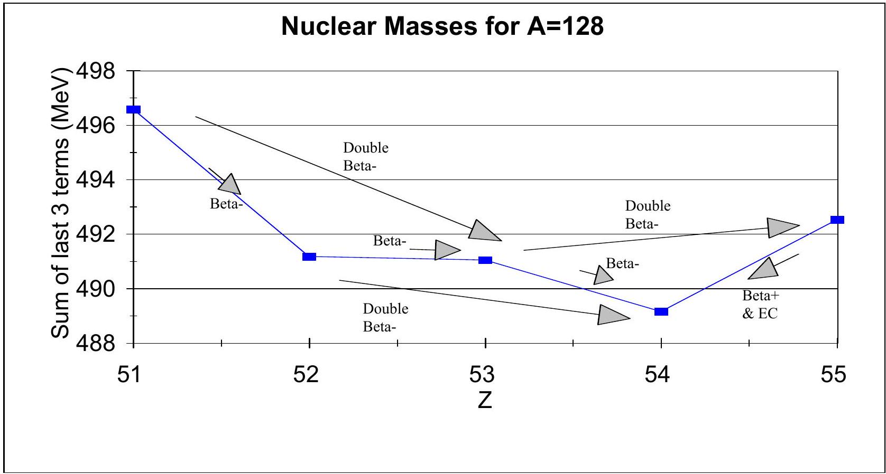
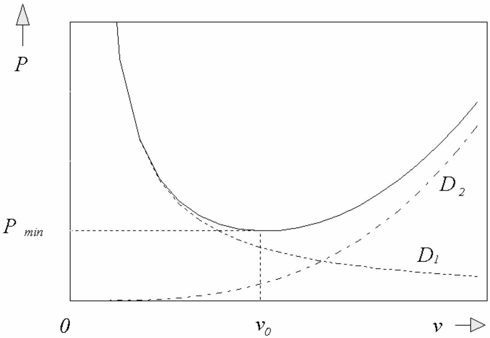

## Theory Question 1: Solutions

Scaling

(a) Let the original spring have length $l$ and spring constant $k$. The frequency $f$ of a mass $m$ oscillating on the end of this spring is given by:
$$
f = \frac { 1 } { 2 \pi } \sqrt { \frac { k } { m } }
$$
The spring constant $k$ means that a force $F$ is required to produce an extension $\Delta x$ :
$$
k = \frac { F } { \Delta x }
$$
Consider the mid-point of the spring during such an extension; it has only moved a distance $\Delta x / 2$, while experiencing the same force $F$. Therefore the spring constant of one half of the spring is given by:
$$
k ^ { \prime } = \frac { F } { \Delta x / 2 } = 2 k
$$
The frequency of the mass on the half-spring is:
$$
f ^ { \prime } = \frac { 1 } { 2 \pi } \sqrt { \frac { 2 k } { m } } = \sqrt { 2 } f
$$

## Method 1 using angular momentum quantization:

The de Broglie wavelength of the particle is:

$$
\lambda = \frac { h } { p } .
$$

By de Broglie principle (ground state):

$$
2 \pi r = \lambda
$$

Thus giving the result

$$
p r = m v r = \hbar
$$

(This can be stated directly as quantization of angular momentum.)
Using the Bohr model, we can consider a centripetal force due to electrostatic attraction:

$$
\begin{aligned}
& \frac { m v ^ { 2 } } { r } = \frac { k e ^ { 2 } } { r ^ { 2 } } , \quad \therefore v = \sqrt { \frac { k e ^ { 2 } } { m r } } \\
& \sqrt { k e ^ { 2 } m r } = \hbar ; \quad \text { i.e. } r \propto \frac { 1 } { m }
\end{aligned}
$$

The radius of the muonic hydrogen atom is given by:

$$
a _ { \mu } = \frac { a _ { 0 } } { 207 } = 0.256 \mathrm { pm }
$$

## Method 2 using Dimensional Analysis:

The radius $r$ of the hydrogen atom in ground state depends on the following quantities:

- Mass $m$ of the orbiting particle. (Since the mass of the nucleus is assumed to be much larger than the orbiting particle's mass, the nucleus can be regarded as stationary, and thus the atomic radius does not depend on the nuclear mass.)
- Electrical force between the orbiting particle and the nucleus. This depends on the charge of the nucleus $q _ { n }$, the charge of the orbiting particle $q$ and the constant $\varepsilon _ { 0 . }$
- $\hbar$. This is because the angular momentum is quantized as demonstrated above.

Thus:

$$
r = A \hbar ^ { \alpha } m ^ { \beta } q _ { n } ^ { \gamma _ { 1 } } q ^ { \gamma _ { 2 } } \varepsilon _ { 0 } ^ { \delta }
$$

where $\mathrm { A } , \alpha , \beta , \gamma _ { 1 } , \gamma _ { 2 }$ and $\delta$ are dimensionless constants. The dimensional equation is:

$$
[ D ] = [ M ] ^ { \alpha + \beta - \delta } [ D ] ^ { 2 \alpha - 3 \delta } [ Q ] ^ { \gamma _ { 1 } + \gamma _ { 2 } + 2 \delta } [ T ] ^ { 2 \delta - \alpha }
$$

where [D] are distance dimensions, [M] are mass dimensions, [Q] are charge dimensions and [T] are time dimensions.

Thus, letting $\gamma = \gamma _ { 1 } + \gamma _ { 2 }$ :

$$
\begin{aligned}
& \alpha + \beta - \delta = 0 \\
& 2 \alpha - 3 \delta = 1 \\
& \gamma + 2 \delta = 0 \\
& 2 \delta - \alpha = 0
\end{aligned}
$$

Solving:

$$
\begin{aligned}
& \alpha = 2 \\
& \beta = - 1 \\
& \gamma = - 2 \\
& \delta = 1
\end{aligned}
$$

This indicates that the radius is inversely proportional to the mass of the orbiting particle:

$$
r \propto \frac { 1 } { m }
$$

The radius of the muonic hydrogen atom is given by:

$$
a _ { \mu } = \frac { a _ { 0 } } { 207 } = 0.256 \mathrm { pm }
$$

(c) If the solar power output is $P$ and the radius of the earth's orbit is $R$, then $T$ is given by equating incoming and outgoing radiation:
$$
( 1 - r ) \frac { P } { 4 \pi R ^ { 2 } } \cdot \pi R _ { E } ^ { 2 } = 4 \pi R _ { E } ^ { 2 } \varepsilon \sigma T ^ { 4 }
$$
Where $r$ is the reflectance of the earth with respect to solar radiation (albedo), $R _ { E }$ is the earth's radius, $\varepsilon$ its emissivity and $\sigma$ Stefan's constant. The solar power output is $P$ and the mean orbital radius of the earth $R$. The emissivity is a function of temperature (not known a priori) but the change in temperature is expected to be small.
Plainly, $T \propto \sqrt { \frac { 1 } { R } }$, therefore a $1 \%$ reduction in $R$ gives a $0.5 \%$ rise in $T$, i.e. 1.4 K
$$
T ^ { \prime } = 288.4 \mathrm {~K}
$$

(d) Ideal gas equation for N molecules: $p V = N k T$. Two identical volumes of gas at the same pressure and temperature contain the same number of molecules; therefore the density of each is proportional to the mean molecular mass of the gas therein.

Here we use subscripts $d , m$ and $w$ to denote "dry", "moist" and "water".
For dry air, with mean molecular mass $m _ { d }$ :

$$
\rho = \rho _ { d } = m _ { d } \frac { N _ { d } } { V } = \frac { m _ { d } p } { k T }
$$

For moist air, with mean molecular mass $m _ { m }$ :

$$
\rho _ { m } = m _ { m } \frac { N _ { m } } { V } = \frac { m _ { m } p } { k T }
$$

For a mass $M$ of dry air:

$$
N _ { d } \propto \frac { M } { 28.8 }
$$

For a mass $M$ of moist air:

$$
\begin{gathered}
N _ { m } \propto 0.02 \frac { M ^ { \prime } } { 18 } + 0.98 \frac { M ^ { \prime } } { 28.8 } \\
N _ { m } = N _ { d } \\
\frac { \rho _ { m } } { \rho _ { d } } = \frac { M ^ { \prime } } { M } = \frac { 1 } { 28.8 \left( \frac { 0.02 } { 18 } + \frac { 0.98 } { 28.8 } \right) } = 0.9881 \\
\rho ^ { \prime } = \rho _ { m } = 0.9925 \rho _ { d } = 1.2352 \mathrm {~kg} / \mathrm { m } ^ { 3 }
\end{gathered}
$$

(e) The mechanical power $P$ required for a helicopter to hover equals the downward thrust $T$ of the rotor blades (equal to its weight $W$ ) times the mean velocity $v$ of the downward moving column of air beneath its rotor blades:

$$
P = T v
$$

The blades impart a velocity $v$ to the air flowing past at a rate of $d m / d t$, and the swept area of the blades is $A$ :

$$
T = v \frac { d m } { d t } ; \quad \frac { d m } { d t } = \rho A v ; \quad \therefore W = T = \rho A v ^ { 2 }
$$

If the size of the helicopter is characterized by a linear dimension $L$ :

$$
\begin{gathered}
W \propto L ^ { 3 } ; A \propto L ^ { 2 } \\
v \propto \sqrt { \frac { W } { A } } \propto \sqrt { L } , \quad \therefore P = W v \propto L ^ { 3.5 }
\end{gathered}
$$

Hence the power required for a half-scale helicopter is $P ^ { \prime } = 0.0884 P$.

## Theory Question No.1: Mark Distribution

Smallest fractional mark allowed: 0.25

Marks allowed for errors consistently propagated only if physically reasonable.

| Section |  | Marks | Subtotal |
| :--- | :--- | :--- | :--- |
| (a) | Relation between $f$ and $k$ | 0.5 |  |
|  | Effect of halving spring | 0.5 |  |
|  | Correct answer | 0.5 |  |
|  |  |  | 1.5 |
| (b) | Quantization | 0.5 |  |
|  | Expression for mvr | 0.5 |  |
|  | Correct answer | 1 |  |
|  |  |  | 2 |
| (c) | Correct proportionalties | 1 |  |
|  | Correct answer | 1 |  |
|  |  |  | 2 |
| (d) | Gas Law | 0.5 |  |
|  | Numbers of molecules | 0.5 |  |
|  | Correct answer | 1 |  |
|  |  |  | 2 |
| (e) | Scaling of $W , A$ | 0.5 |  |
|  | $F = v . d m / d t$ | 0.5 |  |
|  | Right form for force | 0.5 |  |
|  | Eliminate $v$ | 0.5 |  |
|  | Correct answer | 0.5 |  |
|  |  |  | 2.5 |
|  |  |  |  |
|  | Grand Total |  | 10 |
|  |  |  |  |
|  |  |  |  |
|  |  |  |  |
|  |  |  |  |
|  |  |  |  |
|  |  |  |  |

## Theory Question 2: Solution:

## Nuclear Masses and Stability

(a) The alpha-decay process is as follows:

$$
A \rightarrow ( A - 4 ) + \alpha ( A = 4 )
$$

Therefore the energy criterion for decay to happen is:

$$
m _ { A } - m _ { A - 4 } - m _ { 4 } > 0
$$

The number and type of nucleons in the decay is preserved so we only have to consider the binding energies:

$$
- B _ { A } + B _ { A - 4 } + B _ { 4 } > 0
$$

If we write $B / A = a + b A$, where $a$ and $b$ are constants to be found from the graph, then this equation becomes:

$$
\begin{gathered}
- A ( a + b A ) + ( A - 4 ) ( a + b ( A - 4 ) ) + B _ { 4 } > 0 \\
- 8 b A - 4 a + 16 b + B _ { 4 } > 0
\end{gathered}
$$

By inspecting the graph, a good linear approximation to $B / A$ above $A = 100$ is:

$$
B / A = ( 9.6 - 0.0080 \times A ) \mathrm { MeV }
$$

i.e. $a = 9.6 \mathrm { MeV }$ and $b = 0.0080 \mathrm { MeV }$, and the condition becomes:

$$
\begin{gathered}
- 0.064 A - 38.4 - 0.1 + 25.0 > 0 \\
A > 13.5 / 0.064 = 211
\end{gathered}
$$

Part (b).

(i) Because $A$ is fixed we only need to consider the penultimate two terms which depend on $Z$.
$$
\frac { d B } { d Z } = - 2 Z a _ { c } A ^ { - 1 / 3 } - \frac { a _ { a } } { A } ( - 4 A + 8 Z )
$$

$$
Z _ { \max } = \frac { 4 a _ { a } } { 2 a _ { c } A ^ { - 1 / 3 } + 8 a _ { a } / A } = \frac { A } { 2 } \frac { 1 } { \left( 1 + \frac { a _ { c } A ^ { \frac { 2 } { 3 } } } { 4 a _ { a } } \right) }
$$

(ii) $Z _ { \text {max } } = 79.25$

The full expression for the differential equation in (a) is:

$$
\frac { d B } { d Z } = - 2 Z a _ { c } A ^ { - 1 / 3 } - \frac { a _ { a } } { A } ( - 4 A + 8 Z ) \pm 2 a _ { p } A ^ { - 3 / 4 }
$$

The last term is positive if a change in $Z$ of + 1 changes the nucleus from an even-even to an odd-odd, and negative if the reverse is true. Note $A$ is positive in this case.

How do we deal with the last term?
The number $Z _ { \text {max } }$ has to be an integer, and even numbers are favoured over odd so we can guess $Z _ { \text {max } } = 80$. To check, evaluate the last three terms for various values of $Z$ :

77979.241
78975.915
79976.295
80975.341
81978.093
82979.512
83984.637

This confirms that $Z _ { \text {max } } = 80$; this is an even-even nucleus.

(iii) Consider only the last three terms in the equation; the rest are constant if $A$ is

(i) $\beta ^ { - }$- decay; $n \rightarrow p + e ^ { - }$, need $\Delta X > - 1.30 + 0.51 = - 0.79 \mathrm { MeV }$
(ii) $\beta ^ { + }$- decay; $p \rightarrow n + e ^ { + }$, need $\Delta X > 1.30 + 0.51 = 1.81 \mathrm { MeV }$
(iii) $\beta ^ { - } \beta ^ { - }$- decay; $2 n \rightarrow 2 p + 2 e ^ { - }$, need $\Delta X > 2 ( - 1.30 + 0.51 ) = - 1.58 \mathrm { MeV }$
(iv) Electron capture; $e ^ { - } + p \rightarrow n$, need $\Delta X > 1.30 - 0.51 = 0.79 \mathrm { MeV }$

↑ For information: graph not expected from students

| Nucleus/Process | $X ( \mathrm { MeV } )$ |
| :--- | :--- |
| ${ } _ { 51 } ^ { 128 } \mathrm { Sb }$ | 496.59 |
| ${ } _ { 52 } ^ { 128 } \mathrm { Te }$ | 491.19 |
| ${ } _ { 53 } ^ { 128 } \mathrm { I }$ | 491.06 |
| ${ } _ { 54 } ^ { 128 } \mathrm { Xe }$ | 489.16 |
| ${ } _ { 55 } ^ { 128 } \mathrm { Cs }$ | 492.54 |

↑ For information: table not expected from students

| Nucleus/Process | $\beta ^ { - }$- decay | $\beta ^ { + }$- decay | Electron-capture | $\beta ^ { - } \beta ^ { - }$- decay |
| :--- | :--- | :--- | :--- | :--- |
| ${ } _ { 53 } ^ { 128 } \mathrm { I }$ | $\sqrt { }$ | 0 | 0 | $\sqrt { }$ |
| ${ } _ { 54 } ^ { 128 } \mathrm { Xe }$ | 0 | 0 | 0 | 0 |
| ${ } _ { 55 } ^ { 128 } \mathrm { Cs }$ | 0 | $\sqrt { }$ | $\sqrt { }$ | 0 |

Students will fill out this table

## Theory Question No.2: Mark Distribution

Smallest fractional mark allowed: 0.25
Marks allowed for errors consistently propagated only if physically reasonable.

| (a) | Approach | 1.5 |  |
| :--- | :--- | :--- | :--- |
|  | Correct Answer | 1.5 |  |
| (b)(i) | Approach | 1 |  |
|  | Correct Answer | 1 |  |
|  | Approach | 1 | 2 |
| (b)(ii) | Correct Answer | 1 |  |
|  |  |  | 2 |
| (b)(iii) | 0.25 for each of 12 entries | 3 | 3 |
|  | Grand Total |  | 10 |

## Theory Question 3: Solution

## Solar-Powered Aircraft

(a) The force $\vec { F }$ required to change the velocity $\Delta \vec { v }$ of a fluid whose flow rate is $\frac { d m } { d t }$ is given by:
$$
\vec { F } = \Delta \vec { v } \frac { d m } { d t }
$$
In this case the flow rate is:
$$
\frac { d m } { d t } = x l \rho v = \frac { \pi } { 4 } l ^ { 2 } \rho v
$$
The vertical component of $\Delta \vec { v }$ is:
$$
\Delta v _ { V } = v \sin \varepsilon
$$
The horizontal component of $\Delta \vec { v }$ is:
$$
\Delta v _ { H } = v ( 1 - \cos \varepsilon )
$$
We can now write expressions for the lift $L$ and drag $D _ { 1 }$ (called form drag).
$$
\begin{gathered}
L = \frac { \pi } { 4 } \rho v ^ { 2 } l ^ { 2 } \sin \varepsilon \\
D _ { 1 } = \frac { \pi } { 4 } \rho v ^ { 2 } l ^ { 2 } ( 1 - \cos \varepsilon )
\end{gathered}
$$
Approximations using $\varepsilon$ instead of $\sin \varepsilon$ etc. are allowed.

(b) The power required to keep the aircraft flying straight and level is given by:
$$
P = D v = \left( D _ { 1 } + D _ { 2 } \right) v
$$
The horizontal drag force $D _ { 2 }$ (frictional drag) is given by the rate of change of momentum of the air flowing past the wing due to friction:
$$
D _ { 2 } = v _ { 1 } \frac { d m _ { 1 } } { d t } - v _ { 2 } \frac { d m _ { 2 } } { d t }
$$
Since the wing is neither a source nor a sink, the mass flow of air into the wing $\left( \frac { d m _ { 1 } } { d t } \right)$ must be the same as the mass flow from the wing $\left( \frac { d m _ { 2 } } { d t } \right)$ therefore:
$$
\frac { d m _ { 1 } } { d t } = \frac { d m _ { 2 } } { d t } = \frac { d m } { d t } = x l \rho v
$$
Substituting $\mathrm { v } _ { 1 } = \mathrm { v }$ and $\mathrm { v } _ { 2 } = \mathrm { v } - \Delta \mathrm { v }$ :
$$
D _ { 2 } = v x l \rho v - ( v - \Delta v ) x l \rho v = x l \rho v ^ { 2 } - x l \rho v ^ { 2 } + v \Delta v x l \rho = x l \rho v \Delta v = \frac { \pi l } { 4 } l \rho v \Delta v = \frac { \pi f } { 4 A } \rho v ^ { 2 } l ^ { 2 }
$$
(This drag is necessarily along the wing surface; when the wing is at an angle $\varepsilon$, the horizontal component is this value multiplied by $\cos \varepsilon$.:
$$
\frac { \pi f } { 4 A } \rho v ^ { 2 } l ^ { 2 } \cos \varepsilon \approx \frac { \pi f } { 4 A } \rho v ^ { 2 } l ^ { 2 } \left( 1 - \frac { \varepsilon ^ { 2 } } { 2 } \right) \approx \frac { \pi f } { 4 A } \rho v ^ { 2 } l ^ { 2 } + O \left( \varepsilon ^ { 2 } f \right)
$$
so to the order given, our simple answer is correct.)
The total drag force $D = D _ { 1 } + D _ { 2 }$ is dependent on the deflection angle $\varepsilon$ and the drag coefficient $f$ :
$$
D = \frac { \pi } { 4 } \rho v ^ { 2 } l ^ { 2 } \left( ( 1 - \cos \varepsilon ) + \frac { f } { A } \right) \approx \frac { \pi } { 4 } \rho v ^ { 2 } l ^ { 2 } \left( \frac { 1 } { 2 } \sin ^ { 2 } \varepsilon + \frac { f } { A } \right)
$$
In making this approximation $D$ can be expressed in terms of the mass, speed and wing dimensions of the aircraft. Note that for level flight the lift has to be equal to the weight of the craft.
$$
L = M g = \frac { \pi } { 4 } \rho v ^ { 2 } l ^ { 2 } \sin \varepsilon ; \quad \sin \varepsilon = \frac { 4 M g } { \pi \rho v ^ { 2 } l ^ { 2 } }
$$
We can now minimize power with respect to either $v$ or $\varepsilon$; here we choose $v$.

$$
\begin{gathered}
P = D v = \frac { \pi } { 4 } \rho v ^ { 3 } l ^ { 2 } \left( \frac { f } { A } + \frac { 1 } { 2 } \frac { ( 4 M g ) ^ { 2 } } { \left( \pi \rho v ^ { 2 } l ^ { 2 } \right) ^ { 2 } } \right) = \frac { \pi } { 4 } \rho v ^ { 3 } l ^ { 2 } \frac { f } { A } + \frac { 2 ( M g ) ^ { 2 } } { \pi \rho v l ^ { 2 } } \\
\frac { d P } { d v } = \frac { 3 \pi } { 4 } \rho v ^ { 2 } l ^ { 2 } \frac { f } { A } - \frac { 2 ( M g ) ^ { 2 } } { \pi \rho v ^ { 2 } l ^ { 2 } } = 0 , \text { when } v = v _ { 0 }
\end{gathered}
$$

Flight velocity for minimum power:

$$
v _ { 0 } ^ { 4 } = \frac { 8 ( M g ) ^ { 2 } A } { 3 \pi ^ { 2 } \rho ^ { 2 } l ^ { 4 } f } = \frac { 8 } { 3 A f } \left( \frac { M g } { \pi \rho S } \right) ^ { 2 }
$$

(c) The graph of power vs. velocity is as follows:

$$
\begin{aligned}
P _ { \min } & = \frac { \pi } { 4 } \rho v _ { 0 } { } ^ { 3 } l ^ { 2 } \left( \frac { f } { A } + \frac { 1 } { 2 } \frac { ( 4 M g ) ^ { 2 } } { \left( \pi \rho v _ { 0 } ^ { 2 } l ^ { 2 } \right) ^ { 2 } } \right) = \frac { \pi } { 4 } \rho v _ { 0 } { } ^ { 3 } l ^ { 2 } \left( \frac { f } { A } + \frac { ( 4 M g ) ^ { 2 } } { 2 \left( \pi \rho l ^ { 2 } \right) ^ { 2 } } \frac { 3 \pi ^ { 2 } \rho ^ { 2 } l ^ { 4 } f } { 8 ( M g ) ^ { 2 } A } \right) \\
& = \pi \rho v _ { 0 } { } ^ { 3 } l ^ { 2 } \frac { f } { A } = \pi \rho v _ { 0 } { } ^ { 3 } S f
\end{aligned}
$$

Substitute for $v _ { 0 }$ :

$$
P _ { \min } = \pi \rho S f \frac { 8 ^ { \frac { 3 } { 4 } } ( M g ) ^ { \frac { 3 } { 2 } } } { ( 3 A f ) ^ { \frac { 3 } { 4 } } ( \pi \rho S ) ^ { \frac { 3 } { 2 } } } = \left( \frac { 8 } { 3 A } \right) ^ { \frac { 3 } { 4 } } f ^ { \frac { 1 } { 4 } } \frac { ( M g ) ^ { \frac { 3 } { 2 } } } { ( \pi \rho S ) ^ { \frac { 1 } { 2 } } }
$$

(d) Equate this to available power, $P _ { \text {avail } } = I S = P _ { \text {min } }$ :

$$
\begin{gathered}
\left( \frac { M g } { S } \right) ^ { \frac { 3 } { 2 } } = I \left( \frac { 3 A } { 8 } \right) ^ { \frac { 3 } { 4 } } \frac { ( \pi \rho ) ^ { \frac { 1 } { 2 } } } { f ^ { \frac { 1 } { 4 } } } \\
\frac { M g } { S } = I ^ { \frac { 2 } { 3 } } \left( \frac { 3 A } { 8 } \right) ^ { \frac { 1 } { 2 } } \frac { ( \pi \rho ) ^ { \frac { 1 } { 3 } } } { f ^ { \frac { 1 } { 6 } } }
\end{gathered}
$$

The numerical answers are:

$$
\frac { M g } { S } = 35.6 \mathrm {~N} / \mathrm { m } ^ { 2 } , \quad v _ { 0 } = 8.60 \mathrm {~m} / \mathrm { s }
$$

## Theory Question No.3: Mark Distribution

Smallest fractional mark allowed: 0.25

Marks allowed for errors consistently propagated only if physically reasonable.

|  | MAXIMUM | SCORE | SUBTOTAL |
| :--- | :--- | :--- | :--- |
| (a) Formulation of Newton II | 1 |  |  |
| Approach to drag | . 5 |  |  |
| $\mathrm { D } _ { 1 }$ formula: | . 5 |  |  |
| Approach to lift | . 5 |  |  |
| L formula: | . 5 |  |  |
|  |  |  | (a) |
| (b) Correct approach to $\mathrm { D } _ { 2 }$ | . 5 |  |  |
| Correct expression for $\mathrm { D } _ { 2 }$ | . 5 |  |  |
| Correct minimization approach | 1 |  |  |
| Expression for $v _ { 0 }$ | 1 |  |  |
|  |  |  | (b) |
| (c) Correct expression for power | 1 |  |  |
| Graph ( $1 / v , v ^ { 3 }$ forms) | 1 |  |  |
|  |  |  | (c) |
| (d) Correct wing loading | 1 |  |  |
| Correct speed | 1 |  |  |
|  |  |  | (d) |
| TOTAL | 10 |  | Total |

Committee Chair
Chris Waltham, Department of Physics \& Astronomy, University of British Columbia
