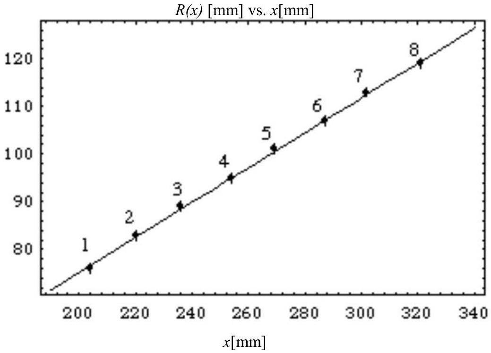
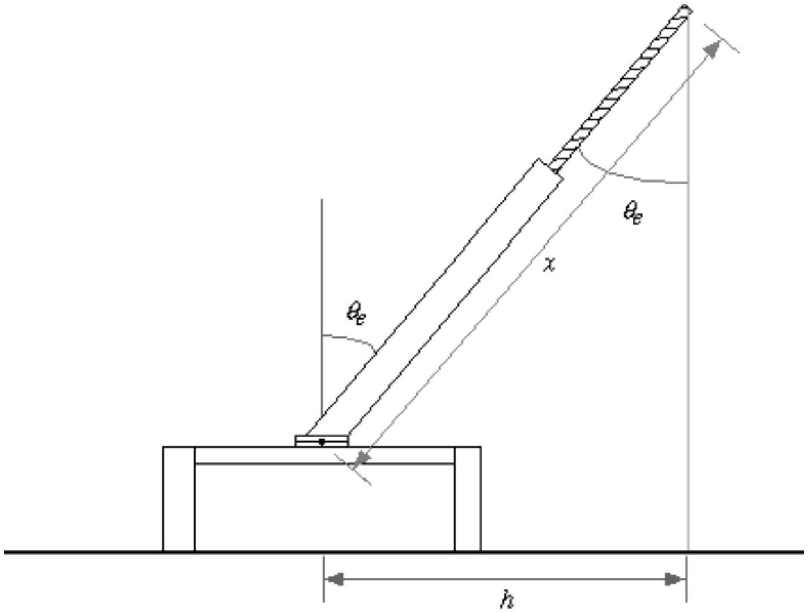
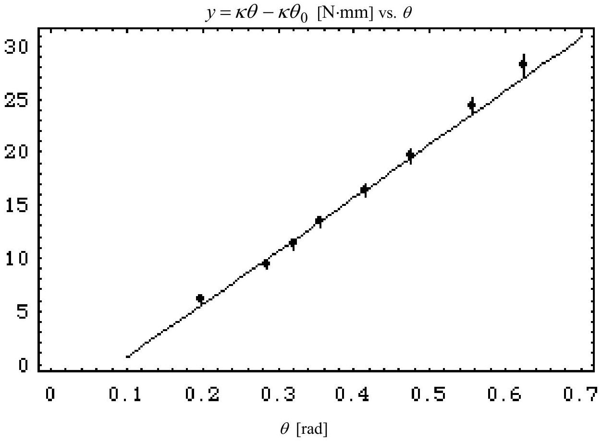
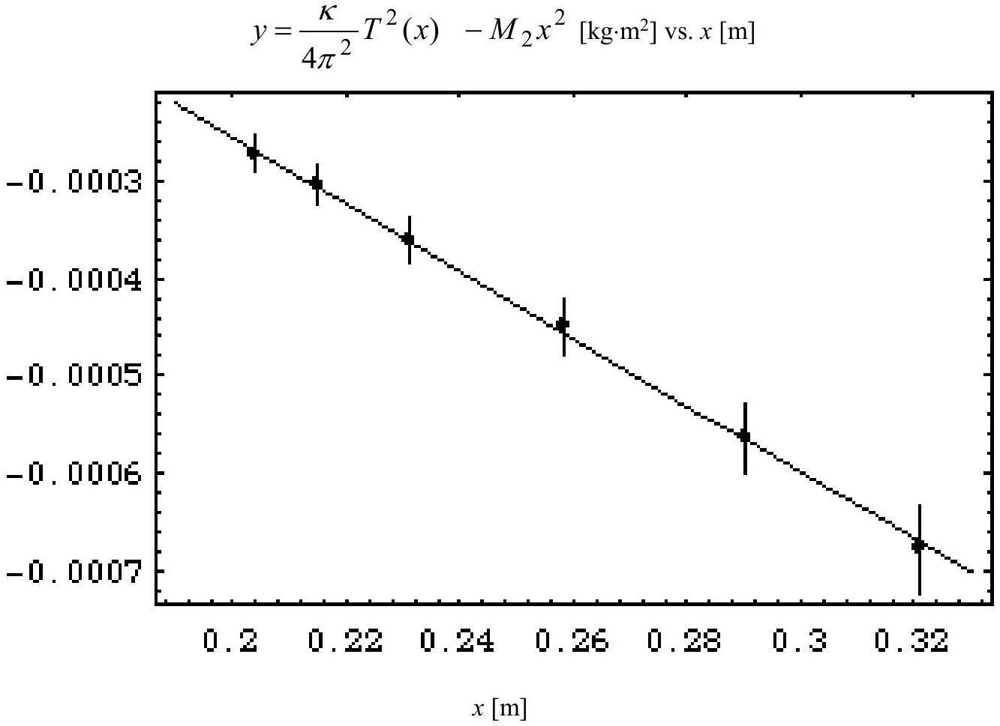
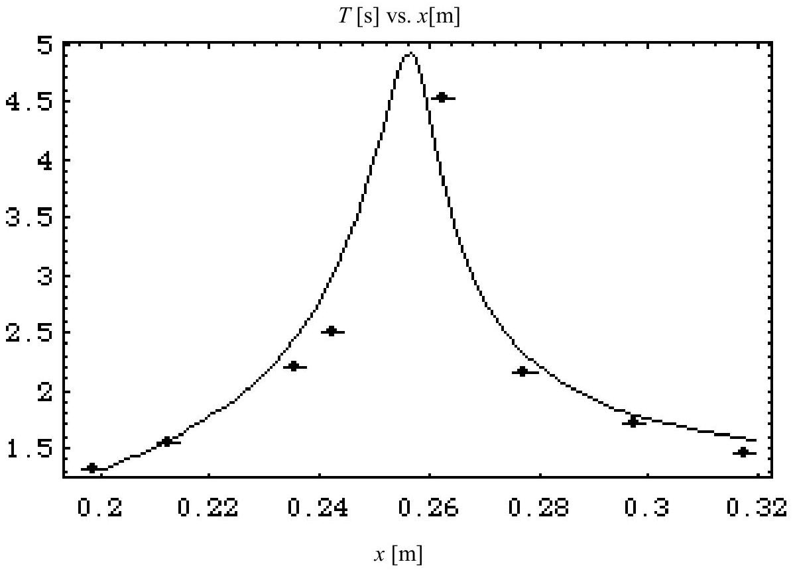

## Solution

The numerical values given in the text are those obtained in a preliminary test performed by a student of the University of Bologna ${ } ^ { 1 }$, and are reported here only as a guide to the evaluation of the student solutions.

1. and 2. The distance from the center of mass to the rotation axis is:

$$
\begin{equation*}
R ( x ) = \frac { M _ { 1 } R _ { 1 } + M _ { 2 } ( x - \ell / 2 ) } { M _ { 1 } + M _ { 2 } } \tag{1}
\end{equation*}
$$

and therefore, if we measure the position of the center of mass ${ } ^ { 2 }$ as a function of $x$ we obtain a relationship between the system parameters, and by a linear fit of eq. (1) we obtain an angular coefficient equal to $M _ { 2 } / \left( M _ { 1 } + M _ { 2 } \right)$, and from these equations, making use of the given total mass $M _ { 1 } + M _ { 2 } = 41.0 \mathrm {~g} \pm 0.1 \mathrm {~g}$, we obtain $M _ { 1 }$ and $M _ { 2 }$. The following table shows some results obtained in the test run.

| $n$ | $x [ \mathrm {~mm} ]$ | $R ( x )$ [mm] |
| :--- | :--- | :--- |
| 1 | 204±1 | $76 \pm 1$ |
| 2 | $220 \pm 1$ | 83±1 |
| 3 | $236 \pm 1$ | 89±1 |
| 4 | 254±1 | 95±1 |
| 5 | $269 \pm 1$ | $101 \pm 1$ |
| 6 | $287 \pm 1$ | 107±1 |
| 7 | $302 \pm 1$ | $113 \pm 1$ |
| 8 | $321 \pm 1$ | 119±1 |

Figure 6 shows the data concerning the position of the pendulum's center of mass together with a best fit straight line: the estimated error on the length measurements is now 1 mm and we treat it as a Gaussian error. Notice that both the dependent variable $R ( x )$ and the independent variable $x$ are affected by the experimental uncertainty, however we decide to neglect the uncertainty on $x$, since it is smaller than $1 \%$. The coefficients $a$ and $b$ in $R ( x ) =$ $a x + b$ are

$$
\begin{aligned}
& a = 0.366 \pm 0.009 \\
& b = 2 \mathrm {~mm} \pm 2 \mathrm {~mm}
\end{aligned}
$$

[^0]
(therefore $b$ is compatible with 0 )

Figure 6: Graph of the position of the pendulum's center of mass (with respect to the rotation axis) as a function of the variable $x$. The numbering of the data points corresponds to that mentioned in the main text. The estimated error is compatible with the fluctuations of the measured data.

For computing the masses only the $a$ value is needed; using the total pendulum mass we find:

$$
\begin{aligned}
& M _ { 1 } = 26.1 \pm 0.4 \mathrm {~g} \\
& M _ { 2 } = 15.0 \mathrm {~g} \pm 0.4 \mathrm {~g}
\end{aligned}
$$

Even though many non-programmable pocket calculators can carry out a linear regression, it is likely that many students will be unable to do such an analysis, and in particular they may be unable to estimate the uncertainty of the fit parameters even if their pocket calculators provide a linear regression mode. It is also acceptable to find $a$ and $b$ using several pairs of measurements and finally computing a weighted average of the results. For each pair of measurements $a$ and $b$ are given by

$$
\begin{align*}
& a = \frac { y _ { 2 } - y _ { 1 } } { x _ { 2 } - x _ { 1 } }  \tag{2}\\
& b = y _ { 2 } - a x _ { 2 }
\end{align*}
$$

and the parameter uncertainties (assuming them gaussian) by

$$
\begin{align*}
& \Delta a = a \sqrt { \frac { \Delta x _ { 1 } ^ { 2 } + \Delta x _ { 2 } ^ { 2 } } { \left( x _ { 1 } - x _ { 2 } \right) ^ { 2 } } + \frac { \Delta y _ { 1 } ^ { 2 } + \Delta y _ { 2 } ^ { 2 } } { \left( y _ { 1 } - y _ { 2 } \right) ^ { 2 } } } \\
& \Delta b = \sqrt { \Delta y _ { 2 } ^ { 2 } + a ^ { 2 } x _ { 2 } ^ { 2 } \left( \frac { \Delta x _ { 2 } ^ { 2 } } { x _ { 2 } ^ { 2 } } + \frac { \Delta a ^ { 2 } } { a ^ { 2 } } \right) } \tag{3}
\end{align*}
$$

In order to calculate (2) and (3) the data can be paired with a scheme like $\{ 1,5 \} , \{ 2,6 \} , \{ 3,7 \} , \{ 4,8 \}$, where "far" points are coupled in order to minimize the error on each pair.
There may be other alternative and equally acceptable approaches: they should all be considered valid if the order of magnitude of the estimated uncertainty is correct.
3. The pendulum's total moment of inertia is the sum of the moments of its two parts, and from figure 3 we see that

$$
\begin{equation*}
I ( x ) = I _ { 1 } + I _ { 2 } ( x ) = M _ { 2 } x ^ { 2 } - M _ { 2 } \ell x + \left( I _ { 1 } + \frac { M _ { 2 } } { 3 } \ell ^ { 2 } \right) \tag{4}
\end{equation*}
$$

4. The pendulum's equation of motion is

$$
\begin{equation*}
I ( x ) \frac { d ^ { 2 } \theta } { d t ^ { 2 } } = - \kappa \left( \theta - \theta _ { 0 } \right) \tag{5}
\end{equation*}
$$

if the rotation axis is vertical, while it's

$$
\begin{equation*}
I ( x ) \frac { d ^ { 2 } \theta } { d t ^ { 2 } } = - \kappa \left( \theta - \theta _ { 0 } \right) + \left( M _ { 1 } + M _ { 2 } \right) g R ( x ) \sin \theta \tag{6}
\end{equation*}
$$

if the rotation axis is horizontal.
5. and 6. When the system is at rest in an equilibrium position, the angular acceleration is zero and therefore the equilibrium positions $\theta _ { e }$ can be found by solving the equation

$$
\begin{equation*}
- \kappa \left( \theta _ { \mathrm { e } } - \theta _ { 0 } \right) + \left( M _ { 1 } + M _ { 2 } \right) g R ( x ) \sin \theta _ { \mathrm { e } } = 0 \tag{7}
\end{equation*}
$$

If the value $x _ { i }$ corresponds to the equilibrium angle $\theta _ { e , i }$, and if we define the quantity (that can be computed from the experimental data) $y _ { i } = \left( M _ { 1 } + M _ { 2 } \right) g R \left( x _ { i } \right) \sin \theta _ { e , i }$, then eq. (7) may be written as

$$
\begin{equation*}
y _ { i } = \kappa \theta _ { e , i } - \kappa \theta _ { 0 } \tag{8}
\end{equation*}
$$

and therefore the quantities $\kappa$ and $\kappa \theta _ { 0 }$ can be found with a linear fit. The following table shows several data collected in a trial run according to the geometry shown in figure 7.

| $n$ | $x [ \mathrm {~mm} ]$ | $h [ \mathrm {~mm} ]$ | $\sin \theta _ { \mathrm { e } } = h / x$ | $\theta _ { \mathrm { e } }$ | $y [ \mathrm {~N} \cdot \mu \mathrm {~m} ]$ |
| :--- | :--- | :--- | :--- | :--- | :--- |
| 1 | $204 \pm 1$ | 40±1 | $0.196 \pm 0.005$ | $0.197 \pm 0.005$ | 6.1±0.3 |
| 2 | $220 \pm 1$ | 62±1 | $0.282 \pm 0.005$ | $0.286 \pm 0.005$ | 9.4±0.4 |
| 3 | $238 \pm 1$ | 75±1 | $0.315 \pm 0.004$ | $0.321 \pm 0.005$ | 11.3±0.5 |
| 4 | $255 \pm 1$ | 89±1 | $0.349 \pm 0.004$ | $0.357 \pm 0.004$ | 13.4±0.5 |
| 5 | $270 \pm 1$ | 109±1 | 0.404±0.004 | $0.416 \pm 0.004$ | 16.4±0.6 |
| 6 | $286 \pm 1$ | 131±1 | $0.458 \pm 0.004$ | $0.476 \pm 0.004$ | 19.7±0.7 |
| 7 | 307±1 | $162 \pm 1$ | $0.528 \pm 0.004$ | $0.556 \pm 0.004$ | 24.3±0.8 |
| 8 | $321 \pm 1$ | 188±1 | $0.586 \pm 0.004$ | $0.626 \pm 0.004$ | 28.2±0.9 |

Figure 7: Geometry of the measurements taken for finding the angle.

We see that not only the dependent but also the independent variable is affected by a measurement uncertainty, but the relative uncertainty on $\theta _ { \mathrm { e } }$ is much smaller than the relative uncertainty on $y$ and we neglect it. We obtain from such data (neglecting the first data point, see figure 8):

$$
\kappa = 0.055 \mathrm {~N} \cdot \mathrm {~m} \cdot \mathrm { rad } ^ { - 1 } \pm 0.001 \mathrm {~N} \cdot \mathrm {~m} \cdot \mathrm { rad } ^ { - 1 }
$$

$$
\kappa \theta _ { 0 } = - 0.0063 \mathrm {~N} \cdot \mathrm {~m} \pm 0.0008 \mathrm {~N} \cdot \mathrm {~m}
$$

Clearly in this case only the determination of the torsion coefficient $\kappa$ is interesting. The fit of the experimental data is shown in figure 8.

Figure 8: Fit of eq. (8) as a function of $\theta$. In this case the estimated error is again compatible with the experimental data fluctuations. However the data points show a visible deviation from straightness which may be due to an error in the first measurement (the one at lowest $\theta$ ).

7. The moment of inertia can be found experimentally using the pendulum with its rotation axis vertical and recalling eq. (5); from this equation we see that the pendulum oscillates with angular frequency $\omega ( x ) = \sqrt { \frac { \kappa } { I ( x ) } }$ and therefore

$$
\begin{equation*}
I ( x ) = \frac { \kappa T ^ { 2 } ( x ) } { 4 \pi ^ { 2 } } \tag{9}
\end{equation*}
$$

where $T$ is the measured oscillation period. Using eq. (9) we see that eq. (4) can be rewritten as

$$
\begin{equation*}
\frac { \kappa } { 4 \pi ^ { 2 } } T ^ { 2 } ( x ) - M _ { 2 } x ^ { 2 } = - M _ { 2 } \ell x + \left( I _ { 1 } + \frac { M _ { 2 } } { 3 } \ell ^ { 2 } \right) \tag{10}
\end{equation*}
$$

The left-hand side in eq. (10) is known experimentally, and therefore with a simple linear fit we can find the coefficients $M _ { 2 } \ell$ and $\left( I _ { 1 } + \frac { M _ { 2 } } { 3 } \ell ^ { 2 } \right)$, as we did before. The experimental data are in this case:

| $n$ | $x [ \mathrm {~mm} ]$ | $T [ \mathrm {~s} ]$ |
| :--- | :--- | :--- |
| 1 | $204 \pm 1$ | $0.502 \pm 0.002$ |
| 2 | $215 \pm 1$ | $0.528 \pm 0.002$ |
| 3 | $231 \pm 1$ | $0.562 \pm 0.002$ |
| 4 | $258 \pm 1$ | $0.628 \pm 0.002$ |
| 5 | $290 \pm 1$ | $0.708 \pm 0.002$ |
| 6 | $321 \pm 1$ | $0.790 \pm 0.002$ |

The low uncertainty on $T$ has been obtained measuring the total time required for 50 full periods.
Using the previous data and another linear fit, we find

$$
\begin{aligned}
& \ell = 230 \mathrm {~mm} \pm 20 \mathrm {~mm} \\
& I _ { 1 } = 1.7 \cdot 10 ^ { - 4 } \mathrm {~kg} \cdot \mathrm {~m} ^ { 2 } \pm 0.7 \cdot 10 ^ { - 4 } \mathrm {~kg} \cdot \mathrm {~m} ^ { 2 }
\end{aligned}
$$

and the fit of the experimental data is shown in figure 9.

Figure 9: Fit of eq. (10) as a function of $x$. In this case the estimated error is again compatible with the experimental data fluctuations.
8. Although in this case the period $T$ is a complicated function of $x$, its graph is simple, and it is shown in figure 10, along with the test experimental data.

The required answer is that there is a single local maximum.

Figure 10: The period $T$ of the pendulum with horizontal axis as a function of $x$. In addition to the experimental points the figure shows the result of a theoretical calculation of the period in which the following values have been assumed: $g = 9.81 \mathrm {~m} / \mathrm { s } ^ { 2 } ; \kappa = 0.056 \mathrm {~N} \cdot \mathrm {~m} / \mathrm { rad } ; M _ { 1 } = 0.0261 \mathrm {~kg} ; M _ { 2 } =$ $0.0150 \mathrm {~kg} ; M _ { 3 } = 0.00664 \mathrm {~kg} ; I _ { 1 } = 1.0 \cdot 10 ^ { - 4 } \mathrm {~kg} \cdot \mathrm {~m} ^ { 2 } ; \ell = 0.21 \mathrm {~m} ; \ell _ { 3 } = 0.025 \mathrm {~m} ; a = 0.365 ; b = 0.0022$ m (so that the position of the center of mass - excluding the final nut of length $\ell _ { 3 }$ - is $R ( x ) = a x + b$ ); these are the central measured values, with the exception of $\kappa , I _ { 1 }$ and $\ell$ which are taken one standard deviation off their central value. Also, the value $\theta _ { 0 } = 0.030 \mathrm { rad } \approx 1.7 ^ { \circ }$ has been assumed. Even though the theoretical curve is the result of just a few trial calculations using the measured values (± one standard deviation) and is not a true fit, it is quite close to the measured data.

[^0]:    ${ } ^ { 1 }$ Mr. Maurizio Recchi.
    ${ } ^ { 2 }$ This can easily be done by balancing the pendulum, e.g. on the T-shaped rod provided.
