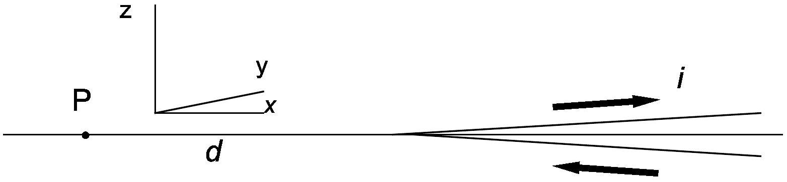
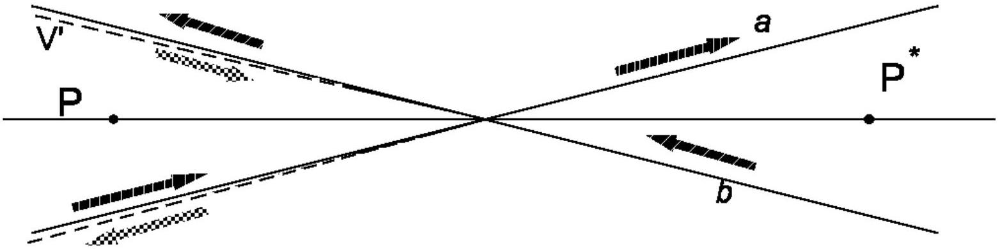

## Solution

1. The contribution to B given by each leg of the "V" has the same direction as that of a corresponding infinite wire and therefore - if the current proceeds as indicated by the arrow - the magnetic field is orthogonal to the wire plane taken as the $x - y$ plane. If we use a right-handed reference frame as indicated in the figure, B(P) is along the positive $z$ axis.

For symmetry reasons, the total field is twice that generated by each leg and has still the same direction.
2A. When $\alpha = \pi / 2$ the "V" becomes a straight infinite wire. In this case the magnitude of the field $B ( \mathrm { P } )$ is known to be $B = \frac { i } { 2 \pi \varepsilon _ { 0 } c ^ { 2 } d } = \frac { i \mu _ { 0 } } { 2 \pi d }$, and since $\tan ( \pi / 4 ) = 1$, the factor $k$ is $\frac { i \mu _ { 0 } } { 2 \pi d }$.
The following solution is equally acceptable:
2B. If the student is aware of the equation $B = \frac { \mu _ { 0 } i } { 4 \pi } \frac { \cos \theta _ { 1 } - \cos \theta _ { 2 } } { h }$ for a finite stretch of wire lying on a straight line at a distance $h$ from point P and whose ends are seen from P under the angles $\theta _ { 1 }$ and $\theta _ { 2 }$, he can find that the two legs of the "V" both produce fields $\frac { \mu _ { 0 } i } { 4 \pi } \frac { 1 - \cos \alpha } { d \sin \alpha }$ and therefore the total field is $B = \frac { i \mu _ { 0 } } { 2 \pi } \frac { 1 - \cos \alpha } { \sin \alpha } = \frac { i \mu _ { 0 } } { 2 \pi d } \tan \left( \frac { \alpha } { 2 } \right)$. This is a more complete solution since it also proves the angular dependence, but it is not required.
3A. In order to compute $\mathbf { B } \left( \mathrm { P } ^ { * } \right)$ we may consider the "V" as equivalent to two crossed infinite wires ( $a$ and $b$ in the following figure) plus another "V", symmetrical to the first one, shown in the figure as V', carrying the same current $i$, in opposite direction.

Then $B \left( \mathrm { P } ^ { * } \right) = B _ { a } \left( \mathrm { P } ^ { * } \right) + B _ { b } \left( \mathrm { P } ^ { * } \right) + B _ { \mathrm { V } ^ { \prime } } \left( \mathrm { P } ^ { * } \right)$. The individual contributions are:
$B _ { a } \left( \mathrm { P } ^ { * } \right) = B _ { b } \left( \mathrm { P } ^ { * } \right) = \frac { i \mu _ { 0 } } { 2 \pi d \sin \alpha }$, along the negative $z$ axis;
$B _ { \mathrm { v } ^ { \prime } } \left( \mathrm { P } ^ { * } \right) = \frac { i \mu _ { 0 } } { 2 \pi d } \tan \left( \frac { \alpha } { 2 } \right)$, along the positive $z$ axis.
Therefore we have $B \left( \mathrm { P } ^ { * } \right) = \frac { i \mu _ { 0 } } { 2 \pi d } \left[ \frac { 2 } { \sin \alpha } - \tan \left( \frac { \alpha } { 2 } \right) \right] = k \left( \frac { 1 + \cos \alpha } { \sin \alpha } \right) = k \cot \left( \frac { \alpha } { 2 } \right)$, and the field is along the negative $z$ axis.

The following solutions are equally acceptable:

3B. The point P* inside a "V" with half-span $\alpha$ can be treated as if it would be on the outside of a "V" with half-span $\pi$ - $\alpha$ carrying the same current but in an opposite way, therefore the field is $B \left( \mathrm { P } ^ { * } \right) = k \tan \left( \frac { \pi - \alpha } { 2 } \right) = k \tan \left( \frac { \pi } { 2 } - \frac { \alpha } { 2 } \right) = k \cot \left( \frac { \alpha } { 2 } \right)$; the direction is still that of the $z$ axis but it is along the negative axis because the current flows in the opposite way as previously discussed.
3C. If the student follows the procedure outlined under 2B., he/she may also find the field value in P* by the same method.
4. The mechanical moment $\mathbf { M }$ acting on the magnetic needle placed in point P is given by $\mathbf { M } = \boldsymbol { \mu } \wedge \mathbf { B }$ (where the symbol $\wedge$ is used for vector product). If the needle is displaced from its equilibrium position by an angle $\beta$ small enough to approximate $\sin \beta$ with $\beta$, the angular momentum theorem gives $M = - \mu B \beta = \frac { d L } { d t } = I \frac { d ^ { 2 } \beta } { d t ^ { 2 } }$, where there is a minus sign because the mechanical momentum is always opposite to the displacement from equilibrium. The period $T$ of the small oscillations is therefore given by $T = \frac { 2 \pi } { \omega } = 2 \pi \sqrt { \frac { I } { \mu B } }$.
Writing the differential equation, however, is not required: the student should recognise the same situation as with a harmonic oscillator.
5. If we label with subscript A the computations based on Ampère's interpretation, and with subscript BS those based on the other hypothesis by Biot and Savart, we have

$$
\begin{array} { l l }
B _ { \mathrm { A } } = \frac { i \mu _ { 0 } } { 2 \pi d } \tan \left( \frac { \alpha } { 2 } \right) & B _ { \mathrm { BS } } = \frac { i \mu _ { 0 } } { \pi ^ { 2 } d } \alpha \\
T _ { \mathrm { A } } = 2 \pi \sqrt { \frac { 2 \pi I d } { \mu _ { 0 } \mu i \tan \left( \frac { \alpha } { 2 } \right) } } & T _ { \mathrm { BS } } = 2 \pi \sqrt { \frac { \pi ^ { 2 } I d } { \mu _ { 0 } \mu i \alpha } } \\
\frac { T _ { \mathrm { A } } } { T _ { \mathrm { BS } } } = \sqrt { \frac { 2 \alpha } { \pi \tan \left( \frac { \alpha } { 2 } \right) } } &
\end{array}
$$

For $\alpha = \pi / 2$ (maximum possible value) $T _ { \mathrm { A } } = T _ { \mathrm { BS } }$; and for $\alpha \rightarrow 0 T _ { \mathrm { A } } \rightarrow \frac { 2 } { \sqrt { \pi } } T _ { \mathrm { BS } } \approx 1.128 T _ { \mathrm { BS } }$. Since within this range $\frac { \tan ( \alpha / 2 ) } { \alpha / 2 }$ is a monotonically growing function of $\alpha , \frac { T _ { \mathrm { A } } } { T _ { \mathrm { BS } } }$ is a monotonically decreasing function of $\alpha$; in an experiment it is therefore not possible to distinguish between the two interpretations if the value of $\alpha$ is larger than the value for which $T _ { \mathrm { A } } = 1.10 T _ { \mathrm { BS } }$ (10\% difference), namely when $\tan \left( \frac { \alpha } { 2 } \right) = \frac { 4 } { 1.21 \pi } \frac { \alpha } { 2 } = 1.05 \frac { \alpha } { 2 }$. By looking into the trigonometry tables or using a calculator we see that this condition is well approximated when $\alpha / 2 = 0.38 \mathrm { rad }$; $\alpha$ must therefore be smaller than 0.77 rad $\approx 44 ^ { \circ }$.
A graphical solution of the equation for $\alpha$ is acceptable but somewhat lengthy. A series development, on the contrary, is not acceptable.

## Grading guidelines

1. 1 for recognising that each leg gives the same contribution
    0.5 for a correct sketch
2. 0.5 for recognising that $\alpha = \pi / 2$ for a straight wire, or for knowledge of the equation given in 2B.
    0.25 for correct field equation (infinite or finite)
    0.25 for value of $k$
3. 0.7 for recognising that the V is equivalent to two infinite wires plus another V
    0.3 for correct field equation for an infinite wire
    0.5 for correct result for the intensity of the required field
    0.5 for correct field direction

alternatively

0.8 for describing the point as outside a V with $\pi$ - $\alpha$ half-amplitude and opposite current
0.7 for correct analytic result
0.5 for correct field direction

alternatively

0.5 for correctly using equation under 2B
1 for correct analytic result
0.5 for correct field direction
4. 0.5 for correct equation for mechanical moment $\mathbf { M }$
    0.5 for doing small angle approximation $\sin \beta \approx \beta$
    1 for correct equation of motion, including sign, or for recognizing analogy with harmonic oscillator
    0.5 for correct analytic result for $T$
5. 0.3 for correct formulas of the two periods
    0.3 for recognising the limiting values for $\alpha$
    0.4 for correct ratio between the periods
    1 for finding the relationship between $\alpha$ and tangent
    0.5 for suitable approximate value of $\alpha$
    0.5 for final explicit limiting value of $\alpha$

For the numerical values a full score cannot be given if the number of digits is incorrect (more than one digit more or less than those given in the solution) or if the units are incorrect or missing
