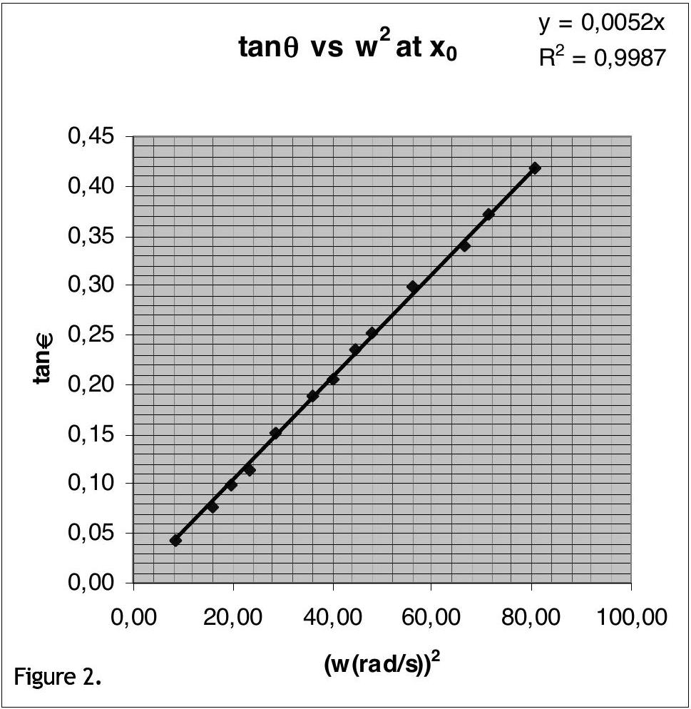
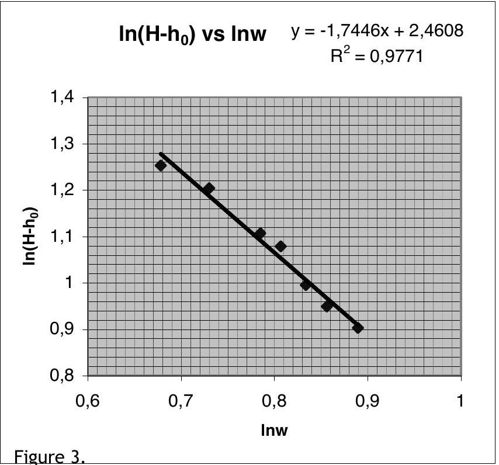

## Solution

Part 1
Theory:
Consider a small mass m of the liquid at the surface (Figure 4). At dynamic equilibrium

$$
N \cos \theta = m g
$$

and

$$
N \sin \theta = m w ^ { 2 } x
$$

Therefore:

$$
\tan \theta = \frac { w ^ { 2 } x } { g } .
$$

The profile of the liquid surface can be found as follows:

$$
\tan \theta = \frac { d y } { d x } , \quad \frac { d y } { d x } = \frac { w ^ { 2 } x } { g }
$$

so that

$$
y = \frac { w ^ { 2 } x ^ { 2 } } { 2 g } + y _ { 0 }
$$

where $\mathrm { y } _ { 0 }$ is the height at $\mathrm { x } = 0$.
At a certain point $x = x _ { 0 }$, height of the liquid $\mathrm { h } _ { 0 }$ would be the same as if it not rotating. In this case,

$$
\begin{equation*}
h _ { 0 } = y _ { 0 } + \frac { w ^ { 2 } x _ { 0 } ^ { 2 } } { 2 g } \tag{1}
\end{equation*}
$$

and,

$$
x _ { 0 } ^ { 2 } = \frac { 2 g \left( h _ { 0 } - y _ { 0 } \right) } { w ^ { 2 } } .
$$

Since the volume of the liquid is constant,

$$
\begin{align*}
& \pi R ^ { 2 } h _ { 0 } = \int y ( 2 \pi x d x ) = 2 \pi \int \left( y _ { 0 } + \frac { w ^ { 2 } x ^ { 2 } } { 2 g } \right) x d x , \\
& y _ { 0 } = h _ { 0 } - \frac { w ^ { 2 } R ^ { 2 } } { 4 g } \tag{2}
\end{align*}
$$

From Eq. 1 and Eq. 2 one obtains

$$
x _ { 0 } = \frac { R } { \sqrt { 2 } } .
$$

## Experiment:

| $2 R ( m m )$ | $x _ { 0 } ( m m )$ | $h _ { 0 } ( \mathrm {~mm} )$ | H(mm) |
| :--- | :--- | :--- | :--- |
| 145 | 51 | 30 | 160 |

$\mathrm { H } - \mathrm { h } _ { 0 } = 130 \mathrm {~mm}$
Measure 10T at small speeds and measure 15T-20T at high speeds.
Use $\quad \tan ( 2 \theta ) = \frac { x } { H - h _ { 0 } } \quad$ and $\quad w = \frac { 2 \pi } { T }$.

| 2R(mm) | $\mathrm { x } _ { 0 } ( \mathrm {~mm} )$ |
| :--- | :--- |
| 145 | 51 |

| $\mathrm { h } _ { 0 } ( \mathrm {~mm} )$ | H(mm) | $\mathrm { H } - \mathrm { h } _ { 0 } ( \mathrm {~mm} )$ |
| :--- | :--- | :--- |
| 30 | 160 | 130 |

| x(mm) | 10T(s) | w(rad/s) | $\tan ( 2 \theta )$ | $\theta ( \mathrm { rad } )$ | $\theta$ (deg) | $\tan ( \theta )$ | $\mathrm { w } ^ { 2 } ( \mathrm { rad } / \mathrm { s } ) ^ { 2 }$ |  |
| :--- | :--- | :--- | :--- | :--- | :--- | :--- | :--- | :--- |
| 11 | 21.34 | 2.94 | 0.08 | 0.04 | 2.4 | 0.04 | 8.67 |  |
| 20 | 15.80 | 3.98 | 0.15 | 0.08 | 4.4 | 0.08 | 15.81 |  |
| 26 | 14.22 | 4.42 | 0.20 | 0.10 | 5.7 | 0.10 | 19.52 |  |
| 30 | 12.99 | 4.84 | 0.23 | 0.11 | 6.5 | 0.11 | 23.40 |  |
| 40 | 11.74 | 5.35 | 0.31 | 0.15 | 8.6 | 0.15 | 28.64 |  |
| 51 | 10.45 | 6.01 | 0.39 | 0.19 | 10.7 | 0.19 | 36.15 |  |
| 56 | 9.90 | 6.35 | 0.43 | 0.20 | 11.7 | 0.21 | 40.28 |  |
| 65 | 9.40 | 6.68 | 0.50 | 0.23 | 13.3 | 0.24 | 44.68 |  |
| 70 | 9.08 | 6.92 | 0.54 | 0.25 | 14.2 | 0.25 | 47.88 |  |
| 85 | 8.39 | 7.49 | 0.65 | 0.29 | 16.6 | 0.30 | 56.08 |  |
| 100 | 7.71 | 8.15 | 0.77 | 0.33 | 18.8 | 0.34 | 66.41 |  |
| 112 | 7.43 | 8.46 | 0.86 | 0.36 | 20.4 | 0.37 | 71.51 |  |
| 132 | 7.00 | 8.98 | 1.02 | 0.40 | 22.7 | 0.42 | 80.57 |  |
| 61.4 | 11.19 | 6.20 | 0.47 | 0.21 | 11.98 | 0.21 | 41.51 | Ave. |

The last line is for error calculation only.
The slope of the Figure 5 is $0.0052 ( \mathrm {~s} / \mathrm { rad } ) ^ { 2 }$ which gives

$$
g = \frac { x _ { 0 } } { \text { slope } } = \frac { 5.1 } { 0.0052 } = 980 \mathrm {~cm} / \mathrm { s } ^ { 2 } .
$$

## Error Calculation (possible methods):

$$
\begin{aligned}
& g = \frac { w ^ { 2 } x _ { 0 } } { \tan \theta } \\
& \frac { \Delta g } { g } = \sqrt { 4 \left( \frac { \Delta w } { w } \right) ^ { 2 } + \left( \frac { \Delta x _ { 0 } } { x _ { 0 } } \right) ^ { 2 } + \left( \frac { \Delta ( \tan \theta ) } { \tan \theta } \right) ^ { 2 } } \frac { \Delta w } { w } = \frac { \Delta T } { T } \\
& \frac { \Delta ( \tan \theta ) } { \tan \theta } \approx \frac { \Delta \theta } { \theta }
\end{aligned}
$$

(since from the table $\tan \theta \cong \theta$ )

$$
\begin{aligned}
& \theta \approx \frac { x } { H - h _ { 0 } } , \frac { \Delta \theta } { \theta } = \sqrt { \left( \frac { \Delta x } { x } \right) ^ { 2 } + \left( \frac { \Delta H + \Delta h _ { 0 } } { H - h _ { 0 } } \right) ^ { 2 } } \\
& \frac { \Delta g } { g } = \sqrt { 4 \left( \frac { \Delta T } { T } \right) ^ { 2 } + \left( \frac { \Delta x _ { 0 } } { x _ { 0 } } \right) ^ { 2 } + \left( \frac { \Delta x } { x } \right) ^ { 2 } + \left( \frac { \Delta H + \Delta h _ { 0 } } { H - h _ { 0 } } \right) ^ { 2 } }
\end{aligned}
$$

Using the values $\mathrm { H } = 160 \mathrm {~mm} , \Delta \mathrm { H } = 1 \mathrm {~mm} , \mathrm {~h} _ { 0 } = 30 \mathrm {~mm} , \Delta \mathrm {~h} _ { 0 } = 1 \mathrm {~mm} , \mathrm { x } _ { \mathrm { av } } = 61.4 \mathrm {~mm} , \Delta \mathrm { x } _ { \mathrm { av } } = 1 \mathrm {~mm}$, $\mathrm { T } _ { \mathrm { av } } = 1.1 \mathrm {~s} , \Delta \mathrm {~T} = 0.01 \mathrm {~s} , \mathrm { x } _ { 0 } = 51 \mathrm {~mm} , \Delta \mathrm { x } _ { 0 } = 1 \mathrm {~mm}$ one obtains

$$
g = 980 \pm 34 \mathrm {~cm} / \mathrm { s } ^ { 2 }
$$

- Note that from the method of least squares one obtains the following results:
$$
\mathbf { g } = \mathbf { 9 8 2 } \mathbf { ~ c m } \boldsymbol { / } \mathbf { s } ^ { \mathbf { 2 } } \text { with a standard deviation of } \mathbf { \sigma } = \mathbf { 3 3 ~ c m } \boldsymbol { / } \mathbf { s } ^ { \mathbf { 2 } }
$$
- From the linear regression of the data slope $\tan \theta$ vs $\mathrm { w } ^ { 2 }$ is found to be 0.052 with a standard error of $5.14 \times 10 ^ { - 5 }$, therefore:
$$
\begin{aligned}
& \frac { \Delta g } { g } = \sqrt { \left( \frac { \Delta ( \text { slope } ) } { \text { slope } } \right) ^ { 2 } + \left( \frac { \Delta x _ { 0 } } { x _ { 0 } } \right) ^ { 2 } } = 0.02 \\
& \mathbf { g } = \mathbf { 9 8 0 } \pm \mathbf { 2 0 ~ c m } / \mathbf { s } ^ { 2 }
\end{aligned}
$$

## Part 2a

| H(mm) | 10T(s) | w(rad/s) | lnw | $\mathrm { H } - \mathrm { h } _ { 0 } ( \mathrm {~mm} )$ | $\ln \left( \mathrm { H } - \mathrm { h } _ { 0 } \right)$ |
| :--- | :--- | :--- | :--- | :--- | :--- |
| 158 | 10.31 | 6.09 | 0.784921 | 128 | 2.107 |
| 209 | 13.19 | 4.76 | 0.677935 | 179 | 2.253 |
| 190 | 11.70 | 5.37 | 0.729994 | 160 | 2.204 |
| 150 | 9.80 | 6.41 | 0.806954 | 120 | 2.079 |
| 129 | 9.21 | 6.82 | 0.83392 | 99 | 1.996 |
| 119 | 8.75 | 7.18 | 0.856172 | 89 | 1.949 |
| 110 | 8.10 | 7.76 | 0.889695 | 80 | 1.903 |

Thus the focal length depends on w as

$$
f = A w ^ { n } ,
$$

and
n ~ -1.7.
The plot of $\mathrm { H } - \mathrm { h } _ { 0 }$ vs. $1 / \mathrm { w } ^ { 2 }$ is also acceptable as a correct plot.

## Part 2b

| $\omega$ Range(rad/s) | Orientation | Variation of the size | Image |
| :--- | :--- | :--- | :--- |
| $\omega = 0$ | ER |  | V |
| $\begin{aligned} & 0 < \omega < 8.2 ^ { * } \\ & 0 < \omega < 6.3 ^ { * * } \end{aligned}$ | ER | D | V |
| $\begin{aligned} & 8.2 < \omega < 14.6 ^ { * } \\ & 6.3 < \omega < 14.0 ^ { * * } \end{aligned}$ | INV | I | R |
| $\begin{aligned} & 14.6 < \omega < \omega _ { \max } * \\ & 14.0 < \omega < \omega _ { \max } * \end{aligned}$ | ER | NC | V |

* for $\mathrm { H } = 110 \mathrm {~mm}$
** for H=240 mm
$\omega$ values depend on the initial values of $\mathrm { H } , \mathrm { h } _ { 0 }$, etc.
Note that measurements only at one H value are required from the students.

## Part 3

## Measurement of wavelength

Both the grating and the screen are in air. Normal incidence.

| Screen to grating distance | : L |
| :--- | :--- |
| Distance between the diffraction spots seen on the screen | : x |
| Order of diffraction | :m |

- $\mathrm { L } = 225 \mathrm {~mm} , \quad \mathrm { x } _ { \mathrm { av } } = 77 \mathrm {~mm} \quad$ for $\mathrm { m } = \pm 1 \quad \mathrm {~d} = 1 / 500 \mathrm {~mm}$
$$
\begin{aligned}
& \tan \alpha = \frac { x _ { a v } } { L } = \frac { 77 } { 225 } \\
& \lambda = \frac { 1 } { 500 } \sin \alpha = 647 \mathrm {~nm}
\end{aligned}
$$
- $\mathrm { L } = 128 \mathrm {~mm} , \quad \mathrm { x } _ { \mathrm { av } } = 44 \mathrm {~mm} \quad$ for $\mathrm { m } = \pm 1 , \quad \mathrm {~d} = 1 / 500 \mathrm {~mm}$
$$
\begin{aligned}
& \tan \alpha = \frac { 44 } { 128 } \\
& \lambda = \frac { 1 } { 500 } \sin \alpha = 650 \mathrm {~nm}
\end{aligned}
$$
- $\mathrm { L } = 128 \mathrm {~mm} , \quad \mathrm { x } _ { \mathrm { av } } = 111 \mathrm {~mm} \quad$ for $\mathrm { m } = \pm 2 , \quad \mathrm {~d} = 1 / 500 \mathrm {~mm}$
$$
\begin{aligned}
& \tan \alpha = \frac { 111 } { 128 } \\
& \lambda = \frac { 1 } { 2 \times 500 } \sin \alpha = 655 \mathrm {~nm}
\end{aligned}
$$

The average value of $\lambda$ is $\lambda _ { \mathrm { av } } = 651 \mathrm {~nm}$.

## Measurement of refractive index

$$
2 \mathrm { R } = 145 \mathrm {~mm}
$$

Distance between the spots measured on the curved screen $= \mathrm { R } \alpha$

$$
\begin{array} { l l l }
\mathrm { R } \alpha _ { \mathrm { av } } = 17 \mathrm {~mm} & \text { for } \mathrm { m } = \pm 1 & \alpha _ { \mathrm { av } } = 0.234 \mathrm { rad } \\
n = \frac { m \lambda } { d \sin ( \alpha ) } , & \text { one obtains } & \mathrm { n } = 1.40
\end{array}
$$

If the curvature of the screen is neglected:

$$
\begin{aligned}
& \tan \alpha = \frac { 17 } { 72.5 } \\
& \alpha = 13.20 ^ { \circ } \\
& n = \frac { \lambda } { d \sin ( \alpha ) } = \frac { 651 ( \mathrm {~nm} ) } { \frac { 1 } { 500 } ( \mathrm {~mm} ) \times 10 ^ { 6 } \sin ( \alpha ) } = 1.43
\end{aligned}
$$

## Grading Scheme for Experimental Competition

| Part 1 | 7.5 pts |
| :--- | :--- |
| - Derivation of Equation 1 | 1.0 pts |
| - Calculation of $\omega$ using period measurements | 1.0 pts |
| At low speeds 10T is OK |  |
| At high speeds 20T is expected | -0.2 pts |
| Missing units | -0.2 pts |
| - Calculation of $\tan 2 \theta$, $\tan \theta$ at each $\omega$ | 1.0 pts |
| Calculation of $\tan 2 \theta$ | 0.5 pts |
| Calculation of $\tan \theta$ | 0.5 pts |
| - Plot of $\tan \theta$ vs $\omega ^ { 2 }$ | 1.5 pts |
| Axes with labels and units | 0.4 pts |
| Drawing best fit line | 0.5 pts |
| At least 6 different data in a wide range of $\omega$ | 0.6 pts |
| No. of measurements 5: | -0.2 pts |
| No of measurements 4: | -0.4 pts |
| No of measurements 3 or less: | -0.6 pts |
| - Calculations | 2.0 pts |
| calculation of slope with unit | 1.0 pts |
| calculation of g | 1.0 pts |
| FULL credit for |  |
| $9.3 < \mathrm { g } < 10.3 \mathrm {~m} / \mathrm { s } ^ { 2 } ( \pm 5 \%$ error $)$ |  |
| For $g$ values credits to be subtracted from the total credit of 7.5: |  |
| $10.3 < \mathrm { g } < 10.5 \mathrm {~m} / \mathrm { s } ^ { 2 } , 9.1 < \mathrm { g } < 9.3 \mathrm {~m} / \mathrm { s } ^ { 2 }$ | -0.5 pts |
| $8.8 < \mathrm { g } < 9.1 \mathrm {~m} / \mathrm { s } ^ { 2 } , 10.3 < \mathrm { g } < 10.8 \mathrm {~m} / \mathrm { s } ^ { 2 }$ | -1.0 pts |
| outside the above ranges | -1.5 pts |
| - Error Calculation | 1.0 pts |

| Part 2a | 5.5 pts |
| :--- | :--- |
| - Measurements of H vs $\omega$ | 0.6 pts |
| Calculation of $\omega$ using period measurements | 0.4 pts |
| At low speeds 10T is OK |  |
| At high speeds 20T is expected | -0.2 pts |
| H- $\omega$ table | 0.2 pts |
| - Plot of F vs $\omega$ | 2.4 pts |
| Calculation of $\mathrm { F } = \mathrm { H } - \mathrm { h } _ { 0 }$ | 0.5 pts |
| Plot with axis labels | 0.8 pts |
| Drawing best fit line | 0.5 pts |
| At least 6 different data in a wide range of $\omega$ | 0.6 pts |
| No. of measurements 5: | -0.2 pts |
| No of measurements 4: | -0.4 pts |
| No of measurements 3 or less: | -0.6 pts |
| - Calculations | 2.5 pts |
| Calculation of slope with unit | 1.0 pts |
| Dependence $\mathrm { F } \alpha 1 / \omega ^ { 2 }$ | 1.5 pts |
| Part 2b | 3.5 pts |
| - Every correct item in the table | 0.25 pts |
| Part 3 (At least 3 measurements at different orders are required) | 3.5 pts |
| - Wavelength measurement | 1.2 pts |
| Distance measurements and calculation of angle | 0.6 pts |
| Calculation of $\lambda$ | 0.6 pts |
| Credits to be subtracted from the total credit of 1.2: |  |
| If $\lambda$ is outside the range 600-700 nm | -0.4 pts |
| If less then 3 measurements | -0.4 pts |
| - Measurement of n | 2.3 pts |
| Distance measurements and calculation of angle | 0.6 pts |
| Realizing $\lambda / \mathrm { n }$ | 0.8 pts |
| Calculation of n | 0.9 pts |
| credits to be subtracted from the total credit of 2.3: |  |
| If $n$ is outside range 1.3-1.6 | -0.4 pts |
| If less then 3 measurements | -0.4 pts |
