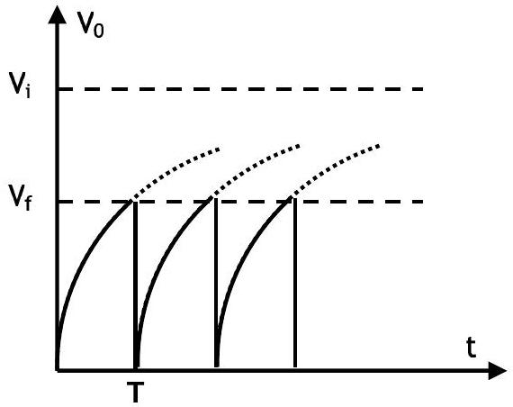
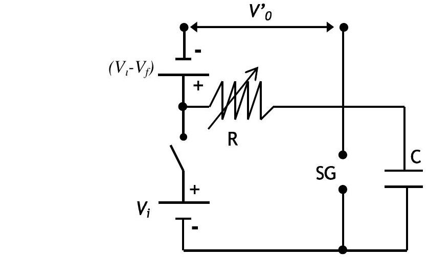
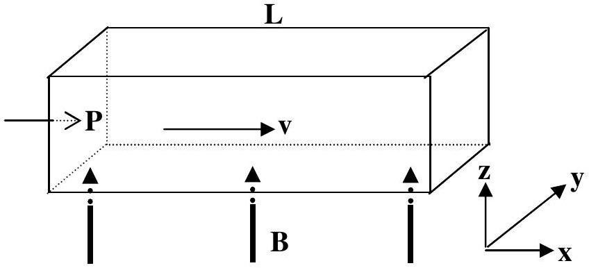

## Solution

Part 1a

a. $$
\begin{equation*}
v _ { r e t } = \sqrt { v _ { 0 } ^ { 2 } - 2 ( e / m ) v } = 1.956 \times 10 ^ { 6 } \mathrm {~m} / \mathrm { s } \tag{0.5pts}
\end{equation*}
$$
$$
\begin{align*}
& v _ { a c c } = \sqrt { v _ { 0 } ^ { 2 } + 2 ( e / m ) V } = 2.044 \times 10 ^ { 6 } \mathrm {~m} / \mathrm { s } \\
& x _ { r e t } = v _ { r e t } t , \quad \mathrm { x } _ { \mathrm { acc } } = v _ { a c c } ( t - T / 2 ) \tag{0.5pts}
\end{align*}
$$
b. The phase difference:
$$
\begin{equation*}
\Delta \varphi = \pm \left( \frac { t _ { \text {bunch } } } { T } - n \right) 2 \pi = \pm 0.61 \times 2 \pi = \pm 220 ^ { \circ } . \tag{1.0pts}
\end{equation*}
$$
OR
$$
\Delta \varphi = \pm 140 ^ { \circ }
$$

Part 1b

$$
\begin{equation*}
\rho _ { L } = n _ { L } \frac { M } { N _ { A } } \tag{0.3pts}
\end{equation*}
$$

where $\mathrm { n } _ { \mathrm { L } }$ is the number of molecules per cubic meter in the liquid phase Average distance between the molecules of water in the liquid phase:

$$
\begin{equation*}
d _ { L } = \left( n _ { L } \right) ^ { - 1 / 3 } = \left( \frac { M } { \rho _ { L } N _ { A } } \right) ^ { \frac { 1 } { 3 } } \tag{0.2pts}
\end{equation*}
$$

$$
\begin{equation*}
P _ { a } V = n R T , \tag{0.6pts}
\end{equation*}
$$

where n is the number of moles

$$
\begin{equation*}
P _ { a } = \frac { n M } { V } \frac { R T } { M } = \rho _ { V } \frac { R T } { M } = \frac { n _ { V } M } { N _ { A } } \frac { R T } { M } \tag{0.9pts}
\end{equation*}
$$

where $\mathrm { n } _ { \mathrm { V } }$ is the number of molecules per cubic meter in the vapor phase.

$$
\begin{align*}
& d _ { V } = \left( n _ { V } \right) ^ { - 1 / 3 } = \left( \frac { R T } { P _ { a } N _ { A } } \right) ^ { \frac { 1 } { 3 } }  \tag{0.2pts}\\
& \frac { d _ { V } } { d _ { L } } = \left( \frac { R T \rho _ { L } } { P _ { a } M } \right) ^ { \frac { 1 } { 3 } } = 12 \tag{0.3pts}
\end{align*}
$$

## Part 1c

a. (0.5 pts.)

b. $\mathrm { V } _ { \mathrm { i } } \gg \mathrm { V } _ { \mathrm { f } } ( 0.2 \mathrm { pts } )$
c. $\mathrm { V } _ { \mathrm { f } } = \mathrm { V } _ { \mathrm { i } } \left( 1 - \mathrm { e } ^ { - \mathrm { T } / \mathrm { RC } } \right)$ (0.2 pts) If
$$
\mathrm { V } _ { \mathrm { i } } \gg \mathrm {~V} _ { \mathrm { f } } , \quad \mathrm {~T} / \mathrm { RC } \ll 1 , \quad e ^ { - T / R C } \approx 1 - ( T / R C )
$$
then
$$
T = \left( V _ { f } / V _ { i } \right) R C
$$
(0.2 pts)
d. R (0.2 pts)
e. SG and R (0.2 pts)
f. Correct circuit (0.4 pts)

$V _ { 0 } ^ { \prime }$ (0.3 pts)
$V _ { i } ^ { \prime } - V _ { f }$ with the correct polarity (0.3 pts)
Total (1.0 pts)

## Part 1d

As the beam passes through a hole of diameter D the resulting uncertainty in the y-component of the momentum;

$$
\begin{equation*}
\Delta p _ { y } \approx \frac { \hbar } { D } \tag{0.6pts}
\end{equation*}
$$

and the corresponding velocity component;

$$
\begin{equation*}
\Delta v _ { y } \approx \frac { \hbar } { M D } \tag{0.4pts}
\end{equation*}
$$

Diameter of the beam grows larger than the diameter of the hole by an amount

$$
\begin{equation*}
\Delta \mathrm { D } = \Delta \mathrm { v } _ { \mathrm { y } } \cdot \mathrm { t } , \tag{0.2pts}
\end{equation*}
$$

where $t$ is the time of travel.
If the oven temperature is T, a typical atom leaves the hole with kinetic energy

$$
\begin{align*}
& K E = \frac { 1 } { 2 } M v ^ { 2 } = \frac { 3 } { 2 } k T  \tag{0.4pts}\\
& v = \sqrt { \frac { 3 k T } { M } } \tag{0.2pts}
\end{align*}
$$

Beam travels the horizontal distance L at speed v in time

$$
\begin{align*}
& t = \frac { L } { v } , \text { so }  \tag{0.2pts}\\
& \Delta D = t \Delta v _ { y } \approx \frac { L } { v } \frac { \hbar } { M D } = \frac { L \hbar } { M D \sqrt { \frac { 3 k T } { M } } } = \frac { L \hbar } { D \sqrt { 3 M k T } } \tag{0.4pts}
\end{align*}
$$

Hence the new diameter after a distance L will be;

$$
\begin{equation*}
\mathrm { D } _ { \text {new } } = \mathrm { D } + \frac { L \hbar } { D \sqrt { 3 M k T } } \tag{0.1pts}
\end{equation*}
$$

## Part 2a

The total energy radiated per second $= 4 \pi \mathrm { R } ^ { 2 } \sigma \mathrm {~T} ^ { 4 }$, where $\sigma$ is the Stephan-Boltzmann constant. The energy incident on a unit area on earth per second is;

$$
\begin{equation*}
P = \frac { 4 \pi R ^ { 2 } \sigma T ^ { 4 } } { 4 \pi \ell ^ { 2 } } \text { yielding, } R = \left( P / \sigma T ^ { 4 } \right) ^ { 1 / 2 } \ell \tag{1}
\end{equation*}
$$

The energy of a photon is $\mathrm { hf } = \mathrm { hc } / \lambda$. The equivalent mass of a photon is $\mathrm { h } / \mathrm { c } \lambda$. Conservation of photon energy:

$$
\begin{equation*}
\frac { h c } { \lambda _ { 0 } } - \frac { G m _ { 0 } } { R } \cdot \frac { h } { c \lambda _ { 0 } } = \frac { h c } { \lambda } \tag{0.8pts}
\end{equation*}
$$

yielding

$$
\begin{equation*}
R = \frac { G m _ { 0 } \left( \lambda _ { 0 } + \Delta \lambda \right) } { c ^ { 2 } \Delta \lambda } \tag{2}
\end{equation*}
$$

and (2) yields,

$$
\begin{equation*}
m _ { 0 } = \frac { c ^ { 2 } \Delta \lambda \left( P / \sigma T ^ { 4 } \right) ^ { 1 / 2 } } { G \left( \lambda _ { 0 } + \Delta \lambda \right) } \ell \tag{3}
\end{equation*}
$$

The stars are rotating around the center of mass with equal angular speeds:

$$
\begin{equation*}
\omega = ( 2 \pi / 2 \tau ) = \pi / \tau ( 4 ) \tag{0.2pts}
\end{equation*}
$$

The equilibrium conditions for the stars are;

$$
\begin{equation*}
\frac { G M m _ { 0 } } { \left( r _ { 1 } + r _ { 2 } \right) ^ { 2 } } = m _ { 0 } r _ { 1 } \omega ^ { 2 } = M r _ { 2 } \omega ^ { 2 } \tag{5}
\end{equation*}
$$

with

$$
\begin{equation*}
r _ { 1 } = \ell \frac { \Delta \theta } { 2 } , r _ { 2 } = \ell \frac { \Delta \phi } { 2 } \tag{6}
\end{equation*}
$$

Substituting (3), (4) and (6) into (5) yields

$$
\begin{equation*}
\ell = \left( \frac { 8 c ^ { 2 } \Delta \lambda \left( P / \sigma T ^ { 4 } \right) ^ { 1 / 2 } } { \Delta \phi ( \pi / \tau ) ^ { 2 } \left( \lambda _ { 0 } + \Delta \lambda \right) ( \Delta \theta + \Delta \phi ) ^ { 2 } } \right) ^ { 1 / 2 } . \tag{0.8pts}
\end{equation*}
$$

## Part 2b

Conservation of angular momentum for the ordinary star;

$$
\begin{equation*}
m r ^ { 2 } \omega = m _ { 0 } r _ { 0 } ^ { 2 } \omega _ { 0 } \quad \text { (7) } \tag{0.6pts.}
\end{equation*}
$$

Conservation of angular momentum for dm:

$$
\begin{equation*}
r ^ { 2 } \omega d m = r _ { f } ^ { 2 } \omega _ { f } d m \tag{8}
\end{equation*}
$$

where $\omega _ { \mathrm { f } }$ is the angular velocity of the ring. Equilibrium in the original state yields,

$$
\begin{equation*}
\omega _ { 0 } = \left( \frac { G M } { r _ { 0 } ^ { 3 } } \right) ^ { 1 / 2 } \tag{9}
\end{equation*}
$$

and (7), (8) and (9) give,

$$
\begin{equation*}
\omega = \frac { m _ { 0 } r _ { 0 } } { m r ^ { 2 } } \left( \frac { G M } { r _ { 0 } } \right) ^ { 1 / 2 } , \omega _ { f } = \frac { m _ { 0 } r _ { 0 } } { m r _ { f } ^ { 2 } } \left( \frac { G M } { r _ { 0 } } \right) ^ { 1 / 2 } \tag{10}
\end{equation*}
$$

Conservation of energy for dm;

$$
\begin{equation*}
\frac { 1 } { 2 } d m \left( v _ { 0 } ^ { 2 } + r ^ { 2 } \omega ^ { 2 } \right) - \frac { G M \mathrm { dm } } { \mathrm { r } } = \frac { 1 } { 2 } d m r _ { f } ^ { 2 } \omega _ { f } ^ { 2 } - \frac { G M \mathrm { dm } } { \mathrm { r } _ { \mathrm { f } } } \tag{11}
\end{equation*}
$$

Substituting (10);

$$
\begin{equation*}
v _ { 0 } ^ { 2 } + \frac { m _ { 0 } ^ { 2 } r _ { 0 } G M } { m ^ { 2 } } \left( \frac { 1 } { r ^ { 2 } } - \frac { 1 } { r _ { f } ^ { 2 } } \right) - 2 G M \left( \frac { 1 } { r } - \frac { 1 } { r _ { f } } \right) = 0 \tag{12}
\end{equation*}
$$

Since $r _ { 0 } \gg r _ { f }$, if $r > r _ { 0 } , r ^ { - 1 }$ and $r ^ { - 2 }$ terms can be neglected. Hence,

$$
\begin{equation*}
r _ { f } = \frac { G M } { v _ { 0 } ^ { 2 } } \left( \left( 1 + \frac { m _ { 0 } ^ { 2 } r _ { 0 } v _ { 0 } ^ { 2 } } { G M m ^ { 2 } } \right) ^ { 1 / 2 } - 1 \right) . \tag{0.8pts}
\end{equation*}
$$

To show that $\mathrm { r } > \mathrm { r } _ { 0 }$ change in the linear momentum of the ordinary star in its reference frame:

$$
\begin{equation*}
- \frac { G M m } { r ^ { 2 } } + m r \omega ^ { 2 } - m \frac { d v _ { r } } { d t } = - v _ { 0 } \frac { d m _ { g a s } } { d t } \tag{13}
\end{equation*}
$$

and (13) implies the existence of an outward force initially and hence r starts growing. Using (7) one can write

$$
\begin{equation*}
m r \omega ^ { 2 } = \frac { m _ { 0 } ^ { 2 } r _ { 0 } ^ { 4 } \omega _ { 0 } ^ { 2 } } { m r ^ { 3 } } . \tag{0.4pts}
\end{equation*}
$$

Hence, $\frac { \text { Gravitational force } } { \text { Centrifugal force } } \alpha \mathrm { m } ^ { 2 } r$.
where m is definitely decreasing. If r starts decreasing at some time also, this ratio starts decreasing, which is a contradiction.

So $\mathrm { r } > \mathrm { r } _ { 0 }$.

## Part 3a

The net force on a charged particle must be zero in the steady state

$$
\begin{align*}
& \vec { F } = 0 = q \vec { E } + q \vec { v } x \vec { B } \\
& \vec { E } = - \vec { v } x \vec { B } = v B \hat { y }  \tag{0.4pts}\\
& V _ { H } = v B w \\
& I = \frac { V _ { H } } { R } = \frac { V _ { H } } { \frac { \rho w } { L h } } = \frac { v B w L h } { \rho w } = \frac { v B L h } { \rho } , \text { direction: } - \hat { y }  \tag{0.6pts}\\
& \vec { F } = I \vec { l } x \vec { B } = \frac { v B ^ { 2 } L h w } { \rho } , \text { direction: } ( - \hat { y } x \hat { z } = - \hat { x } ) \tag{0.8pts}
\end{align*}
$$

Force is in the -x direction
This creates a back pressure $\mathrm { P } _ { \mathrm { b } }$

$$
\begin{align*}
& P _ { b } = \frac { v B ^ { 2 } L h w } { \rho h w } = \frac { v B ^ { 2 } L } { \rho }  \tag{0.6pts}\\
& \mathrm {~F} _ { \text {net } } = \left( \mathrm { P } - \mathrm { P } _ { \mathrm { b } } \right) \mathrm { hw } ,  \tag{0.6pts}\\
& \mathrm { v } = \alpha \mathrm { F } _ { \text {net } } ( 0.4 \mathrm { pts } ) \\
& \mathrm { v } = \alpha \left( \mathrm { P } - \mathrm { P } _ { \mathrm { b } } \right) \mathrm { hw } = \alpha \left( P - \frac { v B ^ { 2 } L } { \rho } \right) \frac { v _ { 0 } } { \alpha P } = v _ { 0 } - \frac { v v _ { 0 } B ^ { 2 } L } { P \rho } \\
& v \left( 1 + \frac { v _ { 0 } B ^ { 2 } L } { P \rho } \right) = v _ { 0 } \\
& v = v _ { 0 } \left( 1 + \frac { v _ { 0 } B ^ { 2 } L } { P \rho } \right) ^ { - 1 } \\
& v = v _ { 0 } \frac { P \rho } { P \rho + v _ { 0 } B ^ { 2 } L } \tag{0.6pts}
\end{align*}
$$

## Part 3b

From conservation of energy:

$$
\Delta \text { Power } = V _ { H } I = \frac { v _ { 0 } ^ { 2 } B ^ { 2 } w h L } { \rho }
$$

or, to recover $\mathrm { v } _ { 0 }$ the pump must supply an additional pressure $\Delta \mathrm { P } = \mathrm { P } _ { \mathrm { b } }$ $\Delta$ Power $= \Delta P h w v _ { 0 } = P _ { b } h w v _ { 0 } = \frac { v _ { 0 } ^ { 2 } B ^ { 2 } w h L } { \rho }$

## Part 3c

1. $$
\begin{equation*}
u = \frac { c } { n } \quad u ^ { \prime } = \frac { \frac { c } { n } + v } { 1 + \frac { c } { n } \frac { v } { c ^ { 2 } } } = \frac { \frac { c } { n } + v } { 1 + \frac { v } { c n } } \tag{0.5pts}
\end{equation*}
$$
For small $\mathrm { v } ( \mathrm { v } \ll \mathrm { c } )$;
neglect the terms containing $\frac { v ^ { 2 } } { c ^ { 2 } }$ in the expansion of $\left( 1 + \frac { v } { c n } \right) ^ { - 1 }$
$$
\begin{align*}
& u ^ { \prime } = \left( \frac { c } { n } + v \right) \frac { 1 } { 1 + \frac { v } { c n } } \approx \left( \frac { c } { n } + v \right) \left( 1 - \frac { v } { c n } \right) \approx \frac { c } { n } + v \left( 1 - \frac { 1 } { n ^ { 2 } } \right) \\
& \Delta u = u ^ { \prime } - u \approx v \left( 1 - \frac { 1 } { n ^ { 2 } } \right)  \tag{0.5pts}\\
& \Delta \phi = 2 \pi f \Delta T , T = \frac { L } { u } , \Delta \mathrm {~T} = \frac { \Delta \mathrm { u } } { \mathrm { u } ^ { 2 } } L \approx \frac { L v } { c ^ { 2 } } \left( n ^ { 2 } - 1 \right)  \tag{0.5pts}\\
& v = v _ { 0 } \text { so that, } \Delta \phi = 2 \pi f \frac { L } { c ^ { 2 } } \left( n ^ { 2 } - 1 \right) v _ { 0 } \tag{0.5pts}
\end{align*}
$$
2. $\Delta \phi = 2 \pi f \frac { L } { c ^ { 2 } } \left( n ^ { 2 } - 1 \right) v _ { 0 }$
a phase of $\pi / 36$ results in (0.4 pts)
$$
\begin{align*}
& v _ { 0 } = \frac { c ^ { 2 } } { 72 L \left( n ^ { 2 } - 1 \right) f }  \tag{0.2pts}\\
& v _ { 0 } = \frac { 9 \times 10 ^ { 16 } } { 72 \times 10 ^ { - 1 } x ( 2.56 - 1 ) \times 25 } = 3.2 \times 10 ^ { 14 } \mathrm {~m} / \mathrm { s } \text { which is not physical. } \tag{0.4pts}
\end{align*}
$$

3. For $\mathrm { v } = 20 \mathrm {~m} / \mathrm { s } , \mathrm { f } \approx 4 \times 10 ^ { 14 } \mathrm {~Hz}$. But for this value of f, skin depth is about 25 nm. This means that amplitude of the signal reaching the end of the tube is practically zero. Therefore mercury should be replaced with water.
(0.6 pts)
On the other hand if water is used instead of mercury, at $25 \mathrm {~Hz} \delta \approx 3 \times 10 ^ { 5 }$ m . Signal reaches to the end but $\mathrm { v } \approx 6 \times 10 ^ { 14 } \mathrm {~m} / \mathrm { s }$, is still nonphysical. Therefore frequency should be readjusted.
(0.6 pts)
For $\mathrm { v } = 20 \mathrm {~m} / \mathrm { s }$ electromagnetic wave of $\mathrm { f } \approx 8 \times 10 ^ { 14 } \mathrm {~Hz}$ has a skin depth of about $\delta \approx 5.6 \mathrm {~cm}$ in water and the emerging wave is out of phase by $\pi / 36$ with respect to the incident wave. (The amplitude of the wave reaching to the end of the section is about 17\% of the incident amplitude).
(0.6 pts)
Therefore mercury should be replaced with water and frequency should be adjusted to $\mathrm { f } \approx 8 \times 10 ^ { 14 } \mathrm {~Hz}$. The correct choice is (iii)
(0.2 pts)
