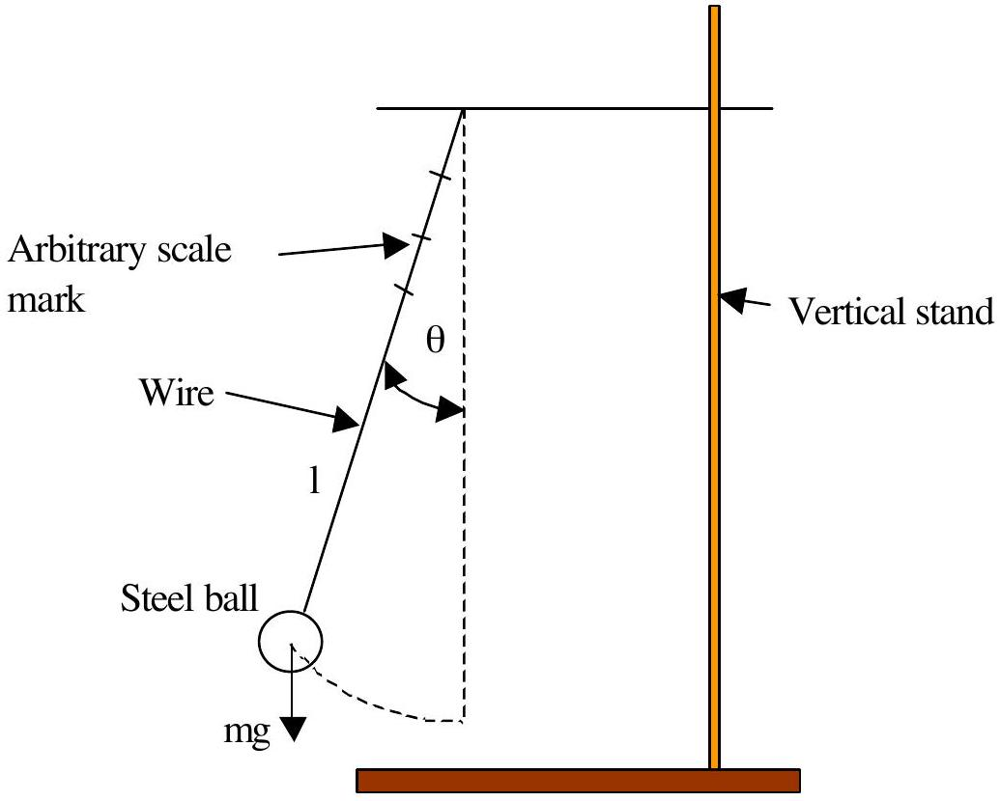
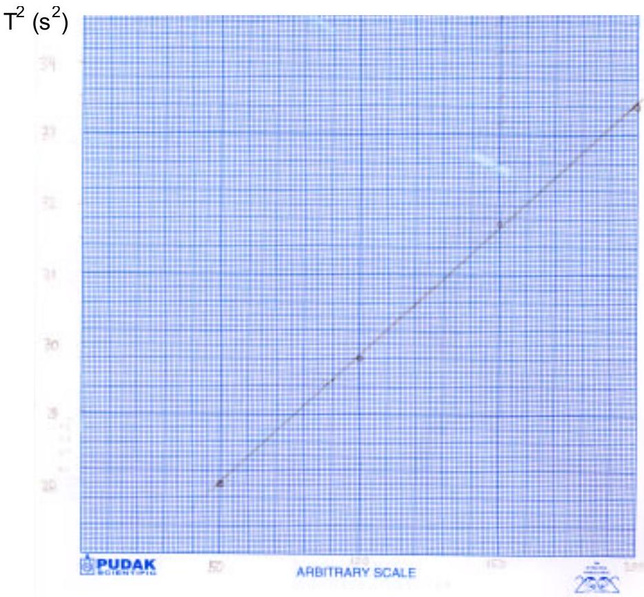
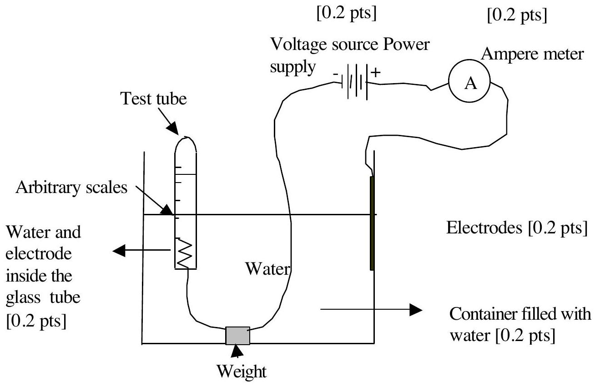
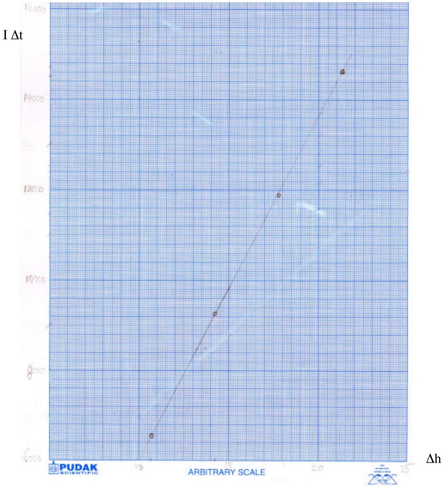

## SOLUTION EXPERIMENT I

PART A

1. [Total 0.5 pts]

The experimental method chosen for the calibration of the arbitrary scale is a simple pendulum method [0.3 pts]

Figure 1. Sketch of the experimental set up [0.2 pts]

2. [Total 1.5 pts]

The expression relating the measurable quantities: [0.5 pts]

$$
T _ { o s c } = 2 \pi \sqrt { \frac { l } { g } } ; T _ { o s c } ^ { 2 } = 4 \pi ^ { 2 } \frac { l } { g }
$$

Approximations :

$$
\sin \theta \approx \theta \quad [ 0.5 \mathrm { pts } ]
$$

mathematical pendulum (mass of the wire << mass of the steel ball, the radius of the steel ball << length of the wire [0.5 pts] flexibility of the wire, air friction, etc [0.1 pts, only when one of the two major points above is not given]

3. [Total 1.0 pts] Data sample from simple pendulum experiment \# of cycle $\geq 20$ [0.2 pts.], difference in $\mathrm { T } \geq 0.01 \mathrm {~s}$ [0.4 pts], \# of data $\geq 4$ [0.4 pts]

| No. | t(s) for 50 cycles | Period, T (s) | Scale marked on the wire (arbitrary scale) |
| :--- | :--- | :--- | :--- |
| 1 | 91.47 | 1.83 | 200 |
| 2 | 89.09 | 1.78 | 150 |
| 3 | 86.45 | 1.73 | 100 |
| 4 | 83.8 | 1.68 | 50 |

4. [Total 0.5 pts]

| No. | Period, T (s) | Scale marked on the wire (arbitrary scale) | $\mathrm { T } ^ { 2 } \left( \mathrm {~s} ^ { 2 } \right)$ |
| :--- | :--- | :--- | :--- |
| 1 | 1.83 | 200 | 3.35 |
| 2 | 1.78 | 150 | 3.17 |
| 3 | 1.73 | 100 | 2.99 |
| 4 | 1.68 | 50 | 2.81 |

The plot of $\mathrm { T } ^ { 2 }$ vs scale marked on the wire:

Scale marked on the wire (arbitrary scale)
5. Determination of the smallest unit of the arbitrary scale in term of mm [Total 1.5 pts]
$$
\begin{aligned}
& T _ { o s c _ { 1 } } ^ { 2 } = \frac { 4 \pi ^ { 2 } } { g } L _ { 1 } , \quad T _ { o s c _ { 2 } } ^ { 2 } = \frac { 4 \pi ^ { 2 } } { g } L _ { 2 } \\
& \left( T _ { o s c _ { 1 } } ^ { 2 } - T _ { o s c _ { 2 } } ^ { 2 } \right) = \frac { 4 \pi ^ { 2 } } { g } L _ { 1 } - L _ { 2 } = \frac { 4 \pi ^ { 2 } } { g } \Delta L
\end{aligned}
$$

$$
\begin{equation*}
\Delta L = \frac { g } { 4 \pi ^ { 2 } } \left( T _ { o s c _ { 1 } } ^ { 2 } - T _ { o s c _ { 2 } } ^ { 2 } \right) \text { or other equivalent expression } \tag{0.5pts}
\end{equation*}
$$

| No. |  | Calculated $\Delta \mathrm { L } ( \mathrm { m } )$ | $\Delta \mathrm { L }$ in arbitrary scale | Values of smallest unit of arbitrary scale (mm) |
| :--- | :--- | :--- | :--- | :--- |
| 1. | $\mathrm { T } _ { 1 } { } ^ { 2 } - \mathrm { T } _ { 2 } { } ^ { 2 } = 0.171893 \mathrm {~s} ^ { 2 }$ | 0.042626 | 50 | 0.85 |
| 2. | $\mathrm { T } _ { 1 } { } ^ { 2 } - \mathrm { T } _ { 3 } { } ^ { 2 } = 0.357263 \mathrm {~s} ^ { 2 }$ | 0.088595 | 100 | 0.89 |
| 3. | $\mathrm { T } _ { 1 } { } ^ { 2 } - \mathrm { T } _ { 4 } { } ^ { 2 } = 0.537728 \mathrm {~s} ^ { 2 }$ | 0.133347 | 150 | 0.89 |
| 4. | $\mathrm { T } _ { 2 } { } ^ { 2 } - \mathrm { T } _ { 3 } { } ^ { 2 } = 0.18537 \mathrm {~s} ^ { 2 }$ | 0.045968 | 50 | 0.92 |
| 5. | $\mathrm { T } _ { 2 } { } ^ { 2 } - \mathrm { T } _ { 4 } { } ^ { 2 } = 0.365835 \mathrm {~s} ^ { 2 }$ | 0.09072 | 100 | 0.91 |
| 6. | $\mathrm { T } _ { 3 } { } ^ { 2 } - \mathrm { T } _ { 4 } { } ^ { 2 } = 0.180465 \mathrm {~s} ^ { 2 }$ | 0.044752 | 50 | 0.90 |

The average value of smallest unit of arbitrary scale, $\bar { l } = 0.89 \mathrm {~mm}$
[0.5 pts]

The estimated error induced by the measurement: [0.5 pts]

| No. | Values of smallest unit of arbitrary scale (mm) | ( $l - \bar { l }$ ) | $( l - \bar { l } ) ^ { 2 }$ |
| :--- | :--- | :--- | :--- |
| 1. | 0.85 | -0.04 | 0.0016 |
| 2. | 0.89 | 0 | 0 |
| 3. | 0.89 | 0 | 0 |
| 4. | 0.92 | 0.03 | 0.0009 |
| 5. | 0.91 | 0.02 | 0.0004 |
| 6. | 0.90 | 0.01 | 0.0001 |

And the standard deviation is:

$$
\Delta l = \sqrt { \frac { \sum _ { i = 1 } ^ { 6 } ( l - \bar { l } ) ^ { 2 } } { N - 1 } } = \sqrt { \frac { 0.003 } { 5 } } = 0.02 \mathrm {~mm}
$$

other legitimate methods may be used

1. The experimental set up:[Total 1.0 pts]

2. Derivation of equation relating the quantities time $t$, current $I$, and water level difference $\Delta h$ : :[Total 1.5 pts]
$$
I = \frac { \Delta Q } { \Delta t }
$$
From the reaction: $2 \mathrm { H } ^ { + } + 2 \mathrm { e } \longrightarrow \mathrm { H } _ { 2 }$, the number of molecules produced in the process $( \Delta \mathrm { N } )$ requires the transfer of electric change is $\Delta \mathrm { Q } = 2 \mathrm { e } \Delta \mathrm { N } : \quad [ 0.2 \mathrm { pts } ]$
$$
\begin{gather*}
I = \frac { \Delta \mathrm { N } 2 \mathrm { e } } { \Delta \mathrm { t } }  \tag{0.5pts}\\
P \Delta \mathrm {~V} = \Delta \mathrm { N } \mathrm { k } _ { \mathrm { B } } \mathrm {~T}  \tag{0.5pts}\\
= \frac { I \Delta t } { 2 \mathrm { e } } \mathrm { k } _ { \mathrm { B } } \mathrm {~T} \\
\mathrm { P } \Delta \mathrm {~h} \left( \pi r ^ { 2 } \right) = \frac { I \Delta t } { 2 } \frac { \mathrm { k } _ { \mathrm { B } } } { e } \mathrm {~T}  \tag{0.2pts}\\
I \Delta t = \frac { \mathrm { e } } { \mathrm { k } _ { \mathrm { B } } } \frac { 2 P \left( \pi r ^ { 2 } \right) } { T } \Delta \mathrm {~h} \tag{0.1pts}
\end{gather*}
$$

3. The experimental data: [ Total 1.0 pts]

| No. | $\Delta \mathrm { h }$ (arbitrary scale) | I (mA) | $\Delta \mathrm { t } ( \mathrm { s } )$ |
| :--- | :--- | :--- | :--- |
| 1 | 12 | 4.00 | 1560.41 |
| 2 | 16 | 4.00 | 2280.61 |
| 3 | 20 | 4.00 | 2940.00 |
| 4 | 24 | 4.00 | 3600.13 |

- The circumference $\phi$, of the test tube = 46 arbitrary scale

[0.3 pts]

- The chosen values for $\Delta h$ ( $\geq 4$ scale unit) for acceptable error due to uncertainty of the water level reading and for $I ( \leq 4 \mathrm {~mA} )$ for acceptable disturbance [ 0.3 pts]
- \# of data $\geq 4$

[0.4 pts]
The surrounding condition $( T , P )$ in which the experimental data given above taken:

$$
\begin{aligned}
& T = 300 \mathrm {~K} \\
& P = 1.0010 ^ { 5 } \mathrm {~Pa}
\end{aligned}
$$

4. Determination the value of e/ $\mathrm { k } _ { \mathrm { B } }$ [Total 1.5 pts]

| No. | $\Delta \mathrm { h }$ (arbitrary scale) | $\Delta \mathrm { h } ( \mathrm { mm } )$ | I (mA) | $\Delta \mathrm { t } ( \mathrm { s } )$ | $\mathrm { I } \Delta \mathrm { t }$ ( C ) |
| :--- | :--- | :--- | :--- | :--- | :--- |
| 1 | 12 | 10.68 | 4.00 | 1560.41 | 6241.64 |
| 2 | 16 | 14.24 | 4.00 | 2280.61 | 9120.48 |
| 3 | 20 | 17.80 | 4.00 | 2940.00 | 11760.00 |
| 4 | 24 | 21.36 | 4.00 | 3600.13 | 14400.52 |

Plot of $\mathrm { I } \Delta \mathrm { t }$ vs $\Delta \mathrm { h }$ from the data listed above

The slope obtained from the plot is 763.94;

$$
\frac { \mathrm { e } } { \mathrm { k } _ { \mathrm { B } } } = \frac { 763.94 \times 300 \times \pi } { 2 \times 10 ^ { 5 } \times \left( 23 \times 0.89 \times 10 ^ { - 3 } \times 0.82 \right) ^ { 2 } } = 1.28 \times 10 ^ { 4 } \text { Coulomb K/J }
$$

Alternatively [the same credit points]

| No. | $\Delta \mathrm { h } ( \mathrm { mm } )$ | $\mathrm { l } \Delta \mathrm { t } ( \mathrm { C } )$ | Slope | $\mathrm { e } / \mathrm { k } _ { \mathrm { b } }$ |
| :--- | :--- | :--- | :--- | :--- |
| 1 | 10.68 | 6241.64 | 584.4232 | 9774.74 |
| 2 | 14.24 | 9120.48 | 640.4831 | 10712.37 |
| 3 | 17.80 | 11760.00 | 660.6742 | 11050.07 |
| 4 | 21.36 | 14400.52 | 674.1816 | 11275.99 |

Average of $\mathrm { e } / \mathrm { k } _ { \mathrm { b } } = 1.07 \times 10 ^ { 4 }$ Coulomb K/J
[1.0 pts]

| No. | $\mathrm { e } / \mathrm { k } _ { \mathrm { b } }$ | difference | Square difference |
| :--- | :--- | :--- | :--- |
| 1 | 9774.74 | -928.55 | 862205.5 |
| 2 | 10712.37 | 9.077117 | 82.39405 |
| 3 | 11050.07 | 346.7808 | 120256.9 |
| 4 | 11275.99 | 572.6996 | 327984.9 |

Estimated error
[0.5 pts]
The standard deviation obtained is $0.66 \times 10 ^ { 3 }$ Coulomb K/J, Other legitimate measures of estimated error may be also used
