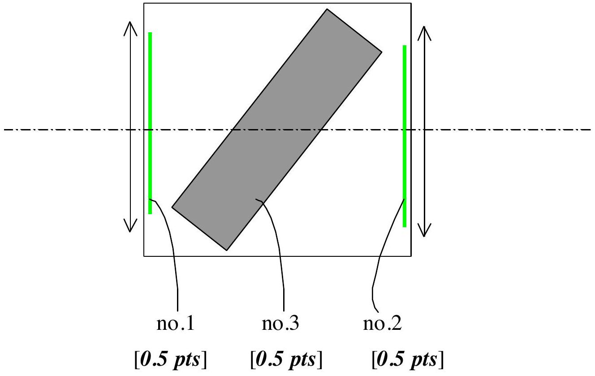
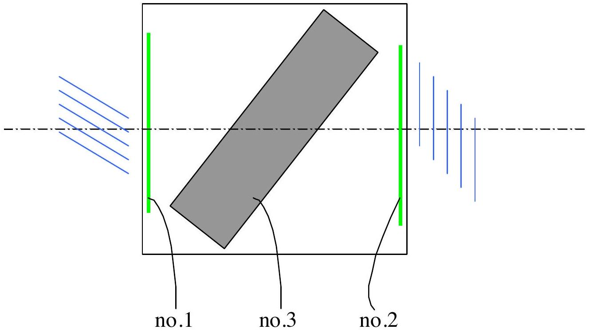
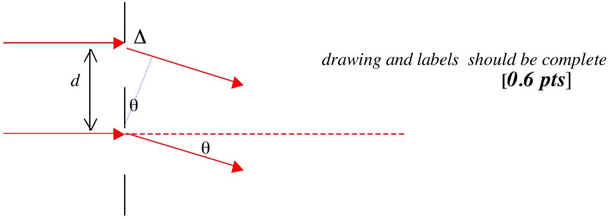
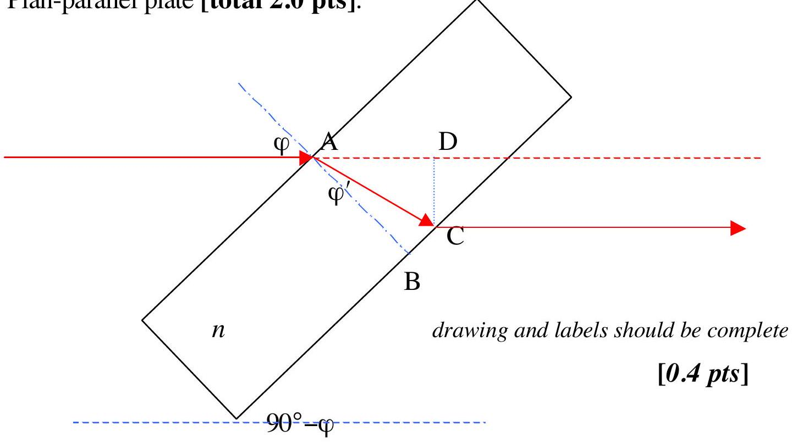

1. The optical components are [total 1.5 pts]:

| no. 1 | Diffraction grating | [0.5 pts] |
| :--- | :--- | :--- |
| no. 2 | Diffraction grating | [0.5 pts] |
| no. 3 | Plan-parallel plate | [0.5 pts] |

2. Cross section of the box [total 1.5 pts]:

3. Additional information [total 1.0 pts]:

Distance of the grating (no.1) to the left wall is practically zero [0.2 pts]

Lines of grating no. 1 is at right angle to the slit [0.3 pts]

Distance of the grating (no.2) to the right wall is practically zero [0.2 pts]

Lines of grating no. 2 is parallel to the slit [0.3 pts]

4. Diffraction grating [total 2.0 pts]:

Path length difference:
$$
\Delta = d \sin \theta , \quad d = \text { spacing of the grating }
$$
Diffraction order:
$$
\Delta = m \lambda , \quad m = \text { order number }
$$
Hence, for the first order $( m = 1 )$ :
$$
\sin \theta = \lambda / d
$$
[0.4 pts]

Observation data:

| $\tan \theta$ | $\theta$ | $\sin \theta$ |  |
| :--- | :--- | :--- | :--- |
| 0.34 | $18.78 ^ { 0 }$ | 0.3219 |  |
| 0.32 | $17.74 ^ { 0 }$ | 0.3048 | number of data $\geq 3$ |
| 0.32 | $17.74 ^ { 0 }$ | 0.3048 | [0.5 pts] |

| Name of component no. 1 | Specification |
| :--- | :--- |
| Diffraction grating | Spacing $= 2.16 \mu \mathrm {~m}$   Lines at right angle to the slit |

[0.4 pts]
[0.1 pts]

5. Diffraction grating [total 2.0 pts]:
For the derivation of the formula, see nr .4 above.
[1.0 pts]

Observation data:
| $\tan \theta$ | $\theta$ | $\sin \theta$ |  |
| :--- | :--- | :--- | :--- |
| 1.04 | $46.12 ^ { 0 }$ | 0.7208 |  |
| 0.96 | $43.83 ^ { 0 }$ | 0.6925 | number of data $\geq 3$ |
| 1.08 | $47.20 ^ { 0 }$ | 0.7330 | [0.5 pts] |

| Name of component no. 2 | Specification |
| :--- | :--- |
| Diffraction grating | Spacing $= 0.936 \mu \mathrm {~m}$   Lines parallel to the slit |

Note: true value of grating spacing is $1.0 \mu \mathrm {~m}$, deviation of the result $\leq 10 \%$

6. Plan-parallel plate [total 2.0 pts]:

Snell's law:

$$
\sin \varphi = n \sin \varphi ^ { \prime } , \quad \varphi ^ { \prime } = \angle \mathrm { BAC }
$$

Path length inside the plate:

$$
\mathrm { AC } = \mathrm { AB } / \cos \varphi ^ { \prime } , \quad \mathrm { AB } = h = \text { plate thickness }
$$

Beam displacement:

$$
\mathrm { CD } = t = \mathrm { AC } \sin \angle \mathrm { CAD } , \quad \angle \mathrm { CAD } = \varphi - \varphi ^ { \prime }
$$

Hence:

$$
\begin{equation*}
t = h \sin \varphi \left[ 1 - \cos \varphi / \left( n ^ { 2 } - \sin ^ { 2 } \varphi \right) ^ { 1 / 2 } \right] \tag{\([ 0.6\) pts \(]\)}
\end{equation*}
$$

Observation data:

| $\varphi$ | $t$ |  |
| :--- | :--- | :--- |
| 0 | 0 | (angle between beam and axis 49°) |
| $49 ^ { 0 }$ | 7.3 arbitrary scale | [0.5 pts] |

| Name of component no. 3 | Specification | [0.2 pts]   [0.3 pts] |
| :--- | :--- | :--- |
| Plane-parallel plate | Thickness $= 17.9 \mathrm {~mm}$   Angle to the axis of the box 49° |  |

Note: - true value of plate thickness is 20 mm

- true value of angle to the axis of the box is 52°
- deviation of the results $\leq 20 \%$.
