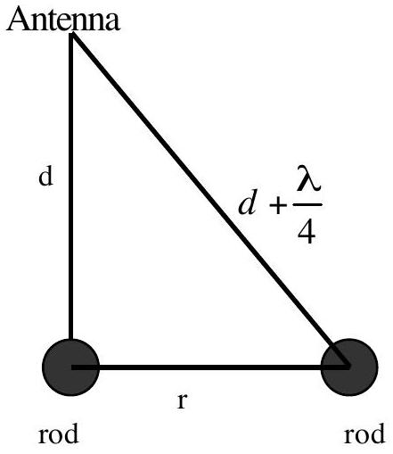
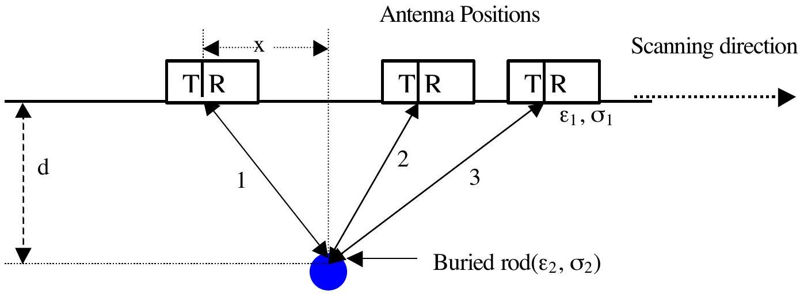
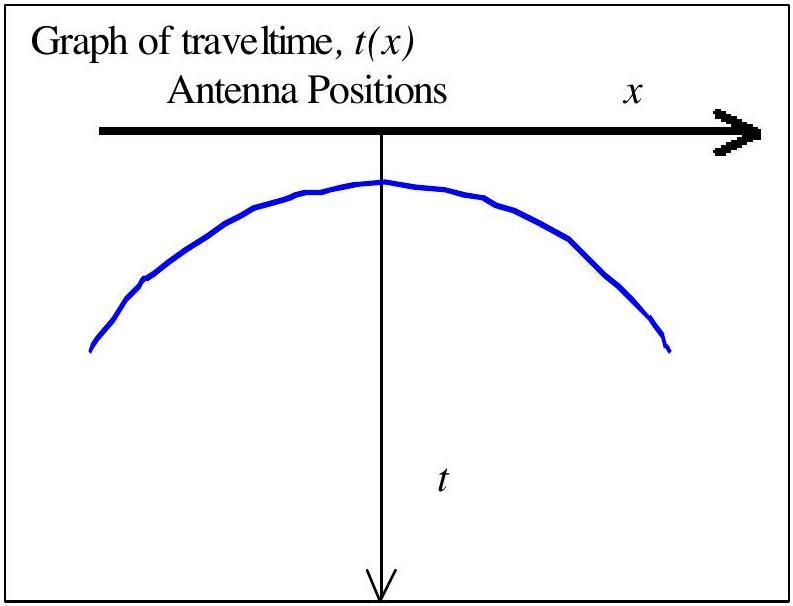

33rd
INTERNATIONAL
PHYSICS OLYMPIAD

THEORETICAL COMPETITION
Tuesday, July $23 ^ { \text {rd } }$, 2002

Solution I: Ground-Penetrating Radar

1. Speed of radar signal in the material $v _ { m }$ :

$$
\begin{align*}
& \omega t - \beta z = \text { constant } \rightarrow \beta z = - \text { constant } + \omega t ( 0.2 \mathrm { pts } )  \tag{0.2pts}\\
& v _ { m } = \frac { \omega } { \beta } \\
& v _ { m } = \frac { 1 } { \omega \left\{ \frac { \mu \varepsilon } { 2 } \left[ \left( 1 + \frac { \sigma ^ { 2 } } { \varepsilon ^ { 2 } \omega ^ { 2 } } \right) ^ { 1 / 2 } + 1 \right] \right\} ^ { 1 / 2 } }  \tag{0.4pts}\\
& v _ { m } = \frac { 1 } { \left\{ \frac { \mu \varepsilon } { 2 } ( 1 + 1 ) \right\} ^ { 1 / 2 } } = \frac { 1 } { \sqrt { \mu \varepsilon } } \tag{0.4pts}
\end{align*}
$$

2. The maximum depth of detection (skin depth, $\delta$ ) of an object in the ground is inversely proportional to the attenuation constant:
(0.5 pts) (0.3 pts) (0.2 pts)

$$
\begin{aligned}
& \delta = \frac { 1 } { a } = \frac { 1 } { \omega \left\{ \frac { \mu \varepsilon } { 2 } \left[ \left( 1 + \frac { \sigma ^ { 2 } } { \varepsilon ^ { 2 } \omega ^ { 2 } } \right) ^ { 1 / 2 } - 1 \right] \right\} ^ { 1 / 2 } } = \frac { 1 } { \omega \left\{ \frac { \mu \varepsilon } { 2 } \left[ \left( 1 + \frac { 1 } { 2 } \frac { \sigma ^ { 2 } } { \varepsilon ^ { 2 } \omega ^ { 2 } } \right) - 1 \right] \right\} ^ { 1 / 2 } } = \frac { 1 } { \omega \left\{ \frac { \mu \varepsilon } { 2 } \cdot \frac { 1 } { 2 } \frac { \sigma ^ { 2 } } { \varepsilon ^ { 2 } \omega ^ { 2 } } \right\} ^ { 1 / 2 } } \\
& \delta = \left( \frac { 2 } { \sigma } \right) \left( \frac { \varepsilon } { \mu } \right) ^ { 1 / 2 } .
\end{aligned}
$$

Numerically $\boldsymbol { \delta } = \frac { \left( 5.31 \sqrt { \varepsilon _ { r } } \right) } { \boldsymbol { \sigma } } \mathrm { m }$, where $\boldsymbol { \sigma }$ is in mS/m. (0.5 pts)

For a medium with conductivity of 1.0 mS/m and relative permittivity of 9, the skin depth

$$
\delta = \frac { ( 5.31 \sqrt { 9 } ) } { 1.0 } = 15.93 \mathrm {~m}
$$

(0.3 pts) + (0.2 pts)

3. Lateral resolution:

$$
\begin{aligned}
& r ^ { 2 } + d ^ { 2 } = \left( d + \frac { \lambda } { 4 } \right) ^ { 2 } \\
& r = \left( \frac { \lambda d } { 2 } + \frac { \lambda ^ { 2 } } { 16 } \right) ^ { 1 / 2 }
\end{aligned}
$$

(1.0 pts)

$$
\begin{equation*}
\mathrm { r } = 0.5 \mathrm {~m} , \mathrm {~d} = 4 \mathrm {~m} : \frac { 1 } { 2 } = \left( \frac { 4 \lambda } { 2 } + \frac { \lambda ^ { 2 } } { 16 } \right) ^ { 1 / 2 } , \lambda ^ { 2 } + 32 \lambda - 4 = 0 \tag{0.5pts}
\end{equation*}
$$

The wavelength is $\lambda = 0.125 \mathrm {~m}$. (0.3 pts) + (0.2 pts) The propagation speed of the signal in medium is

$$
\begin{align*}
& v _ { m } = \frac { 1 } { \sqrt { \mu _ { \varepsilon } } } = \frac { 1 } { \sqrt { \mu _ { o } \mu _ { r } \varepsilon _ { o } \varepsilon _ { r } } } = \frac { 1 } { \sqrt { \mu _ { o } \varepsilon _ { o } } } \frac { 1 } { \sqrt { \mu _ { r } \varepsilon _ { r } } } \\
& v _ { m } = \frac { c } { \sqrt { \mu _ { r } \varepsilon _ { r } } } = \frac { 0.3 } { \sqrt { \varepsilon _ { r } } } \mathrm {~m} / \mathrm { ns } , \text { where } c = \frac { 1 } { \sqrt { \mu _ { o } \varepsilon _ { o } } } \text { and } \mu _ { \mathrm { r } } = 1 \\
& v _ { m } = 0.1 \mathrm {~m} / \mathrm { ns } = 10 ^ { 8 } \mathrm {~m} / \mathrm { s } \tag{0.5pts}
\end{align*}
$$

The minimum frequency need to distinguish the two rods as two separate objects is

$$
\begin{align*}
& f _ { \min } = \frac { v } { \lambda }  \tag{0.5pts}\\
f _ { \min } = & \frac { \frac { 0.3 } { \sqrt { 9 } } } { 0.125 } x 10 ^ { 9 } \mathrm {~Hz} = 800 \mathrm { MHz }
\end{align*}
$$

4. Path of EM waves for some positions on the ground surface

The traveltime as function of $x$ is
$$
\begin{align*}
& \left( \frac { t v } { 2 } \right) ^ { 2 } = d ^ { 2 } + x ^ { 2 } ,  \tag{1.0pts}\\
& t ( x ) = \sqrt { \frac { 4 d ^ { 2 } + 4 x ^ { 2 } } { v } }  \tag{1.0pts}\\
& t ( x ) = \frac { 2 \sqrt { \varepsilon _ { 1 r } } } { 0.3 } \sqrt { d ^ { 2 } + x ^ { 2 } }
\end{align*}
$$

For $x = 0$
$$
\begin{align*}
& 100 = 2 \times ( 3 / 0.3 ) d  \tag{1.0pts}\\
& d = 5 \mathrm {~m} \tag{0.5pts}
\end{align*}
$$
