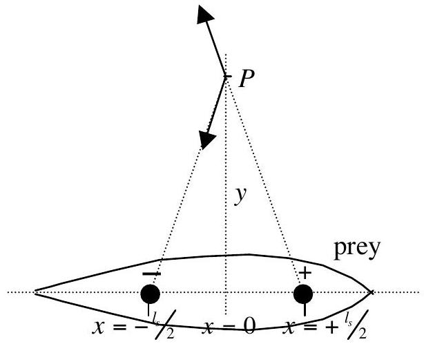
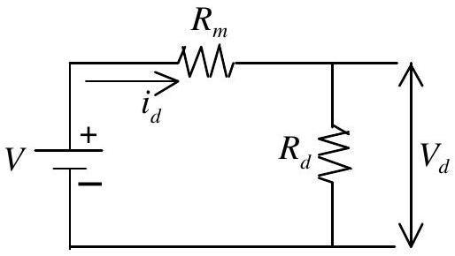

THEORETICAL COMPETITION
Tuesday, July $23 ^ { \text {rd } }$, 2002

## Solution II: Sensing Electrical Signals

1. When a point current source $I _ { s }$ is in infinite isotropic medium, the current density vector at a distance $r$ from the point is

$$
\vec { j } = \frac { I _ { s } } { 4 \pi r ^ { 3 } } \vec { r }
$$

[+15 pts] (without vector notation, -0.5 pts)
2.

Assuming that the resistivities of the prey body and that of the surrounding seawater are the same, implying the elimination of the boundary surrounding the prey, the two spheres seem to be in infinite isotropic medium with the resistivity of $\rho$. When a small sphere produces current at a rate $I _ { s }$, the current flux density at a distance r from the sphere's center is also

$$
\vec { j } = \frac { I _ { s } } { 4 \pi r ^ { 3 } } \vec { r }
$$

The seawater resistivity is $\rho$, therefore the field strength at $r$ is

$$
\vec { E } ( \vec { r } ) = \rho \vec { j } = \frac { \rho I _ { s } } { 4 \pi r ^ { 3 } } \vec { r } \quad [ + 0.2 \mathrm { pts } ]
$$

In the model, we have two small spheres. One is at positive voltage relative to the other therefore current $I _ { s }$ flows from the positively charged sphere to the negatively charged sphere. They are separated by $l _ { s }$. The field strength at $\mathrm { P } ( 0 , \mathrm { y } )$ is:

$$
\begin{aligned}
\vec { E } _ { p } & = \vec { E } _ { + } + \vec { E } _ { - } \quad [ + 0.8 \mathrm { pts } ] \\
& = \frac { \rho I _ { s } } { 4 \pi } \left[ \frac { 1 } { \left( \left( \frac { l _ { s } } { 2 } \right) ^ { 2 } + y ^ { 2 } \right) ^ { \frac { 3 } { 2 } } } \left( - \frac { l _ { s } } { 2 } i + y j \right) + \frac { 1 } { \left( \left( \frac { l _ { s } } { 2 } \right) ^ { 2 } + y ^ { 2 } \right) ^ { \frac { 3 } { 2 } } } \left( - \frac { l _ { s } } { 2 } i - y j \right) \right] \\
& = \frac { \rho I _ { s } } { 4 \pi } \left[ \frac { l _ { s } ( - i ) } { \left( \left( \frac { l _ { s } } { 2 } \right) ^ { 2 } + y ^ { 2 } \right) ^ { \frac { 3 } { 2 } } } \right] \\
\vec { E } _ { p } & \approx \frac { \rho I _ { s } l _ { s } } { 4 \pi y ^ { 3 } } ( - i ) \quad \text { for } \quad \mathrm { ls } \ll \mathrm { y } \quad [ + 1.0 \mathrm { pts } ]
\end{aligned}
$$

3. The field strength along the axis between the two source spheres is:

$$
\vec { E } ( x ) = \frac { \rho I _ { s } } { 4 \pi } \left( \frac { 1 } { \left( x - \frac { l _ { s } } { 2 } \right) ^ { 2 } } + \frac { 1 } { \left( x + \frac { l _ { s } } { 2 } \right) ^ { 2 } } \right) ( - i ) \quad [ + 0.5 \mathrm { pts } ]
$$

The voltage difference to produce the given current $I _ { s }$ is

$$
\begin{aligned}
V _ { s } & = \Delta V = V _ { + } - V _ { - } = - \int _ { \left( - \frac { l _ { s } + r _ { s } } { 2 } \right) } ^ { \left( \frac { l _ { s } } { 2 } - r _ { s } \right) } \vec { E } ( x ) . d \vec { x } = - \frac { \rho I _ { s } } { 4 \pi } \int \left( \frac { 1 } { \left( x - \frac { l _ { s } } { 2 } \right) ^ { 2 } } + \frac { 1 } { \left( x + \frac { l _ { s } } { 2 } \right) ^ { 2 } } \right) ( - i ) . ( i d x ) \quad [ + 0.5 \mathrm { pts } ] \\
& = \frac { \rho I _ { s } } { 4 \pi } \left[ \frac { 1 } { - 2 + 1 } \left( \frac { 1 } { \left( \frac { l _ { s } } { 2 } - r _ { s } - \frac { l _ { s } } { 2 } \right) } - \frac { 1 } { \left( - \frac { l _ { s } } { 2 } + r _ { s } - \frac { l _ { s } } { 2 } \right) } \right) + \frac { 1 } { - 2 + 1 } \left( \frac { 1 } { \left( \frac { l _ { s } } { 2 } - r _ { s } + \frac { l _ { s } } { 2 } \right) } - \frac { 1 } { \left( - \frac { l _ { s } } { 2 } + r _ { s } + \frac { l _ { s } } { 2 } \right) } \right) \right] \\
& = \frac { \rho I _ { s } } { 4 \pi } \left( \frac { 2 } { r _ { s } } - \frac { 2 } { l _ { s } - r _ { s } } \right) = \frac { 2 \rho I _ { s } } { 4 \pi } \left( \frac { l _ { s } - r _ { s } - r _ { s } } { \left( l _ { s } - r _ { s } \right) r _ { s } } \right) = \frac { \rho I _ { s } } { 2 \pi r _ { s } } \left( \frac { l _ { s } - 2 r _ { s } } { l _ { s } - r _ { s } } \right) \\
V _ { s } & = \Delta V \approx \frac { \rho I _ { s } } { 2 \pi r _ { s } } \quad \text { for } l _ { s } \gg r _ { s } . \quad [ + 0.5 \mathrm { pts } ]
\end{aligned}
$$

The resistance between the two source spheres is:

$$
\begin{aligned}
& R _ { s } = \frac { V _ { s } } { I _ { s } } = \frac { \rho } { 2 \pi r _ { s } } \\
& { [ + 0.5 \mathrm { pts } ] }
\end{aligned}
$$

The power produced by the source is:

$$
P = I _ { s } V _ { s } = \frac { \rho I _ { s } ^ { 2 } } { 2 \pi r _ { s } }
$$

[+0.5 pts]
4.

$V$ is the voltage difference between the detector's spheres due to the electric field induced bythe prey, $R _ { m }$ is the inner resistance due to the surrounding sea water. $V _ { d }$ and $R _ { d }$ are respectively the voltage difference between the detecting spheres and the resistance of the detecting element within the predator and $i _ { d }$ is the current flowing in the closed circuit.

Analog to the resistance between the two source spheres, the resistance of the medium with resistivity $\rho$ between the detector spheres, each having a radius of $r _ { d }$ is:

$$
R _ { m } = \frac { \rho } { 2 \pi r _ { d } }
$$

[+0.5 pts]
Since $l _ { d }$ is much smaller than $y$, the electric field strength between the detector spheres can be assumed to be constant, that is:

$$
\begin{equation*}
E = \frac { \rho I _ { s } l _ { s } } { 4 \pi y ^ { 3 } } \tag{+0.2pts}
\end{equation*}
$$

Therefore, the voltage difference present in the medium between the detector spheres is:

$$
\begin{equation*}
V = E l _ { d } = \frac { \rho I _ { s } l _ { s } l _ { d } } { 4 \pi y ^ { 3 } } \tag{+0.3pts}
\end{equation*}
$$

The voltage difference across the detector spheres is:

$$
\begin{aligned}
& V _ { d } = V \frac { R _ { d } } { R _ { d } + R _ { m } } = \frac { \rho I _ { s } l _ { s } l _ { d } } { 4 \pi y ^ { 3 } } \frac { R _ { d } } { R _ { d } + \frac { \rho } { 2 \pi r _ { d } } } \\
& { [ + 0.5 \mathrm { pts } ] }
\end{aligned}
$$

The power transferred from the source to the detector is:

$$
\begin{aligned}
& P _ { d } = i _ { d } V _ { d } = \frac { V } { R _ { d } + R _ { m } } V _ { d } = \left( \frac { \rho I _ { s } l _ { s } l _ { d } } { 4 \pi y ^ { 3 } } \right) ^ { 2 } \frac { R _ { d } } { \left( R _ { d } + \frac { \rho } { 2 \pi r _ { d } } \right) ^ { 2 } } \\
& { [ + 0.5 \mathrm { pts } ] }
\end{aligned}
$$

5. $P _ { d }$ is maximum when

$$
\begin{equation*}
R _ { t } = \frac { R _ { d } } { \left( R _ { d } + \frac { \rho } { 2 \pi r _ { d } } \right) ^ { 2 } } = \frac { R _ { d } } { \left( R _ { d } + R _ { m } \right) ^ { 2 } } \quad \text { is maximum } \tag{+0.5pts}
\end{equation*}
$$

Therefore,

$$
\begin{aligned}
& \frac { d R _ { t } } { d R _ { d } } = \frac { 1 \left( R _ { d } + R _ { m } \right) ^ { 2 } - R _ { d } 2 \left( R _ { d } + R _ { m } \right) } { \left( R _ { d } + R _ { m } \right) ^ { 4 } } = 0 \quad [ + 0.5 \mathrm { pts } ] \\
& \left( R _ { d } + R _ { m } \right) - 2 R _ { d } = 0 \\
& R _ { d } ^ { \text {optimum } } = R _ { m } = \frac { \rho } { 2 \pi r _ { d } } \quad [ + 0.5 \mathrm { pts } ]
\end{aligned}
$$

The maximum power is:

$$
\begin{aligned}
& P _ { d } ^ { \max i m u m } = \left( \frac { \rho I _ { s } l _ { s } l _ { d } } { 4 \pi y ^ { 3 } } \right) ^ { 2 } \frac { \pi r _ { d } } { 2 \rho } = \frac { \rho \left( I _ { s } l _ { s } l _ { d } \right) ^ { 2 } r _ { d } } { 32 \pi y ^ { 6 } } \\
& { [ + 0.5 \mathrm { pts } ] }
\end{aligned}
$$
