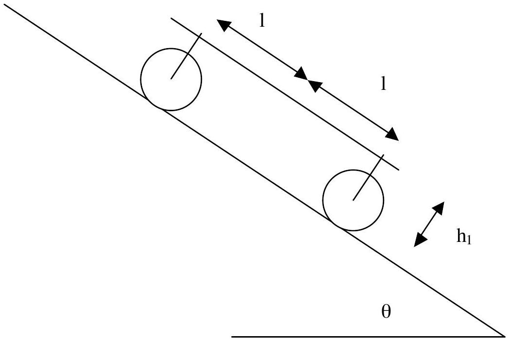
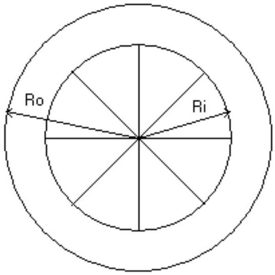
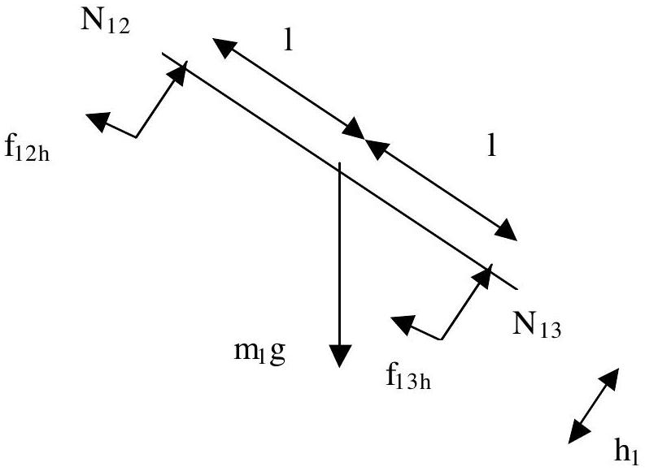
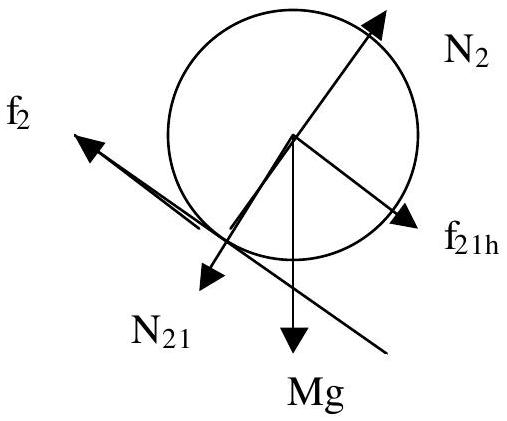
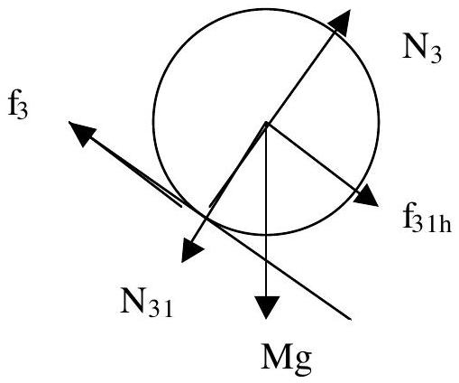

## SOLUTION T3 : . A Heavy Vehicle Moving on An Inclined Road

To simplify the model we use the above figure with $\mathrm { h } _ { 1 } = \mathrm { h } + 0.5 \mathrm { t }$
$\mathrm { R } _ { 0 } = \mathrm { R }$

1. Calculation of the moment inertia of the cylinder
$\mathrm { R } _ { \mathrm { i } } = 0.8 \mathrm { R } _ { \mathrm { o } }$
Mass of cylinder part : $\mathrm { m } _ { \text {cylinder } } = 0.8 \mathrm { M }$
Mass of each rod : $\mathrm { m } _ { \text {rod } } = 0.025 \mathrm { M }$

$$
\begin{align*}
& I = \oint _ { \text {wholepart } } r ^ { 2 } d m = \oint _ { \text {cyl.shell } } r ^ { 2 } d m + \oint _ { \text {rod } 1 } r ^ { 2 } d m + \ldots + \oint _ { \text {rodn } } r ^ { 2 } d m  \tag{0.4 pts}\\
& \begin{aligned}
\oint _ { \text {cyl.shell } } r ^ { 2 } d m & = 2 \pi \sigma \int _ { R i } r ^ { 3 } d r = 0.5 \pi \sigma \left( R _ { o } ^ { 4 } - R _ { i } ^ { 4 } \right) = 0.5 m _ { \text {cylinder } } \left( R _ { o } ^ { 2 } + R _ { i } ^ { 2 } \right) \\
& = 0.5 ( 0.8 M ) R ^ { 2 } ( 1 + 0.64 ) = 0.656 M R ^ { 2 }
\end{aligned} \\
& \begin{aligned}
\oint _ { \text {rod } } r ^ { 2 } d m & = \lambda \int _ { 0 } ^ { \text {Rin } } r ^ { 2 } d r = \frac { 1 } { 3 } \lambda R _ { \text {in } } ^ { 3 } = \frac { 1 } { 3 } m _ { \text {rod } } R _ { \text {in } } ^ { 2 } = \frac { 1 } { 3 } 0.025 M \left( 0.64 R ^ { 2 } \right) = 0.00533 M R ^ { 2 }
\end{aligned} \tag{0.5 pts}
\end{align*}
$$

The moment inertia of each wheel becomes

$$
\begin{equation*}
I = 0.656 M R ^ { 2 } + 8 x 0.00533 M R ^ { 2 } = 0.7 M R ^ { 2 } \tag{0.1 pts}
\end{equation*}
$$

## 2. Force diagram and balance equations:

To simplify the analysis we devide the system into three parts: frame (part1) which mainly can be treated as flat homogeneous plate, rear cylinders (two cylinders are treated collectively as part 2 of the system), and front cylinders (two front cylinders are treated collectively as part 3 of the system).

Part 1 : Frame

The balance equation related to the forces work to this parts are:

Required conditions:
Balance of force in the horizontal axis

$$
\begin{equation*}
m _ { 1 } g \sin \theta - f _ { 12 h } - f _ { 13 h } = m _ { 1 } a \tag{1}
\end{equation*}
$$

Balance of force in the vertical axis

$$
\begin{equation*}
m _ { 1 } g \cos \theta = N _ { 12 } + N _ { 13 } \tag{2}
\end{equation*}
$$

Then torsi on against O is zero, so that

$$
\begin{equation*}
\mathrm { N } _ { 12 } l - \mathrm { N } _ { 13 } l + f _ { 12 h } h _ { 1 } + f _ { 13 h } h _ { 1 } = 0 \tag{3}
\end{equation*}
$$

Part two : Rear cylinder

From balance condition in rear wheel :

$$
\begin{align*}
& \mathrm { f } _ { 21 \mathrm {~h} } - f _ { 2 } + M g \sin \theta = M a  \tag{4}\\
& \mathrm {~N} _ { 2 } - N _ { 21 } - M g \cos \theta = 0 \tag{5}
\end{align*}
$$

For pure rolling:

$$
\begin{align*}
& f _ { 2 } R = I \alpha _ { 2 } = I \frac { a _ { 2 } } { R } \\
& \text { or } \mathrm { f } _ { 2 } = \frac { I } { R ^ { 2 } } \mathrm { a } \tag{6}
\end{align*}
$$

For rolling with sliding:

$$
\begin{equation*}
\mathrm { F } _ { 2 } = \mathrm { u } _ { \mathrm { k } } \mathrm {~N} _ { 2 } \tag{7}
\end{equation*}
$$

0.2 pts

## Part Three : Front Cylinder:

0.25 pts

From balance condition in the front wheel :

$$
\begin{align*}
& \mathrm { f } _ { 31 \mathrm {~h} } - f _ { 3 } + M g \sin \theta = M a  \tag{8}\\
& \mathrm {~N} _ { 3 } - N _ { 31 } - M g \cos \theta = 0 \tag{9}
\end{align*}
$$

For pure rolling:

$$
\begin{align*}
& f _ { 3 } R = I \alpha _ { 3 } = I \frac { a _ { 3 } } { R } \\
& \text { or } \mathrm { f } _ { 3 } = \frac { I } { R ^ { 2 } } \mathrm { a } \tag{10}
\end{align*}
$$

For rolling with sliding:

$$
\begin{equation*}
\mathrm { F } _ { 3 } = \mathrm { u } _ { \mathrm { k } } \mathrm {~N} _ { 3 } \tag{11}
\end{equation*}
$$

0.2 pts
3. From equation (2), (5) and (9) we get

$$
\begin{gather*}
\mathrm { m } _ { 1 } \mathrm {~g} \cos \theta = \mathrm { N } _ { 2 } - \mathrm { m } _ { 2 } \mathrm {~g} \cos \theta + \mathrm { N } _ { 3 } - \mathrm { m } _ { 3 } \mathrm {~g} \cos \theta \\
\mathrm {~N} _ { 2 } + \mathrm { N } _ { 3 } = \left( \mathrm { m } _ { 1 } + \mathrm { m } _ { 2 } + \mathrm { m } _ { 3 } \right) \mathrm { g } \cos \theta = 7 \mathrm { Mg } \cos \theta \tag{12}
\end{gather*}
$$

And from equation (3), (5) and (8) we get

$$
\begin{aligned}
& \left( \mathrm { N } _ { 3 } - \mathrm { Mg } \cos \theta \right) 1 - \left( \mathrm { N } _ { 2 } - \mathrm { Mg } \cos \theta \right) \mathrm { l } = \mathrm { h } _ { 1 } \left( \mathrm { f } _ { 2 } + \mathrm { Ma } - \mathrm { Mg } \sin \theta + \mathrm { f } _ { 3 } + \mathrm { Ma } - \mathrm { Mg } \sin \theta \right) \\
& \left( \mathrm { N } _ { 3 } - \mathrm { N } _ { 2 } \right) = \mathrm { h } _ { 1 } \left( \mathrm { f } _ { 2 } + 2 \mathrm { Ma } - 2 \mathrm { Mg } \sin \theta + \mathrm { f } _ { 3 } \right) / 1
\end{aligned}
$$

Equations 12 and 13 are given 0.25 pts

## CASE ALL CYLINDER IN PURE ROLLING

From equation (4) and (6) we get

$$
\begin{equation*}
\mathrm { f } _ { 21 \mathrm {~h} } = \left( \mathrm { I } / \mathrm { R } ^ { 2 } \right) \mathrm { a } + \mathrm { Ma } - \mathrm { Mg } \sin \theta \tag{14}
\end{equation*}
$$

From equation (8) and (10) we get

$$
\begin{equation*}
\mathrm { f } _ { 31 \mathrm {~h} } = \left( \mathrm { I } / \mathrm { R } ^ { 2 } \right) \mathrm { a } + \mathrm { Ma } - \mathrm { Mg } \sin \theta \tag{15}
\end{equation*}
$$

Then from eq. (1) , (14) and (15) we get

$$
\begin{align*}
& 5 \mathrm { Mg } \sin \theta - \left\{ \left( \mathrm { I } / \mathrm { R } ^ { 2 } \right) \mathrm { a } + \mathrm { Ma } - \mathrm { Mg } \sin \theta \right\} - \left\{ \left( \mathrm { I } / \mathrm { R } ^ { 2 } \right) \mathrm { a } + \mathrm { Ma } - \mathrm { Mg } \sin \theta \right\} = \mathrm { m } _ { 1 } \\
& 7 \mathrm { Mg } \sin \theta = \left( 2 \mathrm { I } / \mathrm { R } ^ { 2 } + 7 \mathrm { M } \right) \mathrm { a } \\
& \qquad a = \frac { 7 M g \sin \theta } { 7 M + 2 \frac { I } { R ^ { 2 } } } = \frac { 7 M g \sin \theta } { 7 M + 2 \frac { 0.7 M R ^ { 2 } } { R ^ { 2 } } } = 0.833 g \sin \theta \tag{16}
\end{align*}
$$

$$
\begin{aligned}
N _ { 3 } & = \frac { 7 M } { 2 } g \cos \theta + \frac { h _ { 1 } } { l } \left[ \left( M + \frac { I } { R ^ { 2 } } \right) \times 0.833 g \sin \theta - M g \sin \theta \right] \\
& = 3.5 \mathrm { Mg } \cos \theta + \frac { h _ { 1 } } { l } [ ( M + 0.7 M ) \times 0.833 g \sin \theta - M g \sin \theta ] \\
& = 3.5 \mathrm { Mg } \cos \theta + 0.41 \frac { h _ { 1 } } { l } M g \sin \theta
\end{aligned}
$$

$$
\begin{align*}
N _ { 2 } & = \frac { 7 M } { 2 } g \cos \theta - \frac { h _ { 1 } } { l } \left[ \left( \frac { I } { R ^ { 2 } } + M \right) \times 0.833 g \sin \theta - M g \sin \theta \right] \\
& = 3.5 \mathrm {~g} \cos \theta - \frac { h _ { 1 } } { l } \left[ ( 0.7 M + M ) \frac { 7 M g \sin \theta } { 0.7 M + 7 M } - 2 M g \sin \theta \right] \\
& = 3.5 \mathrm {~g} \cos \theta - 0.41 \frac { h _ { 1 } } { l } M g \sin \theta \tag{0.2 pts}
\end{align*}
$$

The Conditions for pure rolling:

$$
\begin{array} { l l }
f _ { 2 } \leq \mu _ { s } N _ { 2 } & \text { and } f _ { 3 } \leq \mu _ { s } N _ { 3 } \\
\frac { \mathrm { I } _ { 2 } } { \mathrm { R } _ { 2 } ^ { 2 } } \mathrm { a } \leq \mu _ { s } N _ { 2 } & \text { and } \frac { \mathrm { I } _ { 3 } } { \mathrm { R } _ { 3 } ^ { 2 } } \mathrm { a } \leq \mu _ { s } N _ { 3 } \tag{0.2 pts}
\end{array}
$$

The left equation becomes

$$
\begin{aligned}
& 0.7 M \times 0.833 g \sin \theta \leq \mu _ { s } \left( 3.5 \mathrm { Mg } \cos \theta - 0.41 \frac { h _ { 1 } } { l } M g \sin \theta \right) \\
& \tan \theta \leq \frac { 3.5 \mu _ { s } } { 0.5831 + 0.41 \mu _ { s } \frac { h _ { 1 } } { l } }
\end{aligned}
$$

While the right equation becomes

$$
\begin{align*}
& 0.7 m \times 0.833 g \sin \theta \leq \mu _ { s } \left( 3.5 \mathrm { mg } \cos \theta + 0.41 \frac { h _ { 1 } } { l } m g \sin \theta \right) \\
& \tan \theta \leq \frac { 3.5 \mu _ { s } } { 0.5831 - 0.41 \mu _ { s } \frac { h _ { 1 } } { l } } \tag{17}
\end{align*}
$$

0.1 pts

## CASE ALL CYLINDER SLIDING

From eq. (4) $\mathrm { f } _ { 21 \mathrm {~h} } = \mathrm { Ma } + \mathrm { u } _ { \mathrm { k } } \mathrm { N } _ { 2 } - \mathrm { Mg } \sin \theta$
From eq. (8) $\mathrm { f } _ { 31 \mathrm {~h} } = \mathrm { Ma } + \mathrm { u } _ { \mathrm { k } } \mathrm { N } _ { 3 } - \mathrm { Mg } \sin \theta$
From eq. (18) and 19 :

$$
\begin{align*}
& 5 \mathrm { Mg } \sin \theta - \left( \mathrm { Ma } + \mathrm { u } _ { \mathrm { k } } \mathrm {~N} _ { 2 } - \mathrm { Mg } \sin \theta \right) - \left( \mathrm { Ma } + \mathrm { u } _ { \mathrm { k } } \mathrm {~N} _ { 3 } - \mathrm { Mg } \sin \theta \right) = \mathrm { m } _ { 1 } \mathrm { a } \\
& a = \frac { 7 M g \sin \theta - \mu _ { k } N _ { 2 } - \mu _ { k } N _ { 3 } } { 7 M } = g \sin \theta - \frac { \mu _ { k } \left( N _ { 2 } + N _ { 3 } \right) } { 7 M }  \tag{20}\\
& N _ { 3 } + N _ { 2 } = 7 M g \cos \theta
\end{align*}
$$

From the above two equations we get :

$$
\begin{equation*}
\mathrm { a } = g \sin \Theta - \mu _ { k } g \cos \Theta \tag{0.25 pts}
\end{equation*}
$$

The Conditions for complete sliding: are the opposite of that of pure rolling

$$
\begin{array} { l l }
f _ { 2 } > \mu _ { s } N _ { 2 } ^ { \prime } & \text { and } f _ { 3 } > \mu _ { s } N _ { 3 } ^ { \prime }  \tag{0.2 pts}\\
\frac { \mathrm { I } _ { 2 } } { \mathrm { R } _ { 2 } ^ { 2 } } \mathrm { a } > \mu _ { s } N _ { 2 } ^ { \prime } & \text { and } \frac { \mathrm { I } _ { 3 } } { \mathrm { R } _ { 3 } ^ { 2 } } \mathrm { a } > \mu _ { s } N _ { 3 } ^ { \prime }
\end{array}
$$

Where $\mathrm { N } _ { 2 }$ ' and $\mathrm { N } _ { 3 }$ ' is calculated in case all cylinder in pure rolling. 0.1 pts

Finally weget

$$
\begin{equation*}
\tan \theta > \frac { 3.5 \mu _ { s } } { 0.5831 + 0.41 \mu _ { s } \frac { h _ { 1 } } { l } } \quad \text { and } \quad \tan \theta > \frac { 3.5 \mu _ { s } } { 0.5831 - 0.41 \mu _ { s } \frac { h _ { 1 } } { l } } \tag{0.2 pts}
\end{equation*}
$$

The left inequality finally become decisive.

## CASE ONE CYLINDER IN PURE ROLLING AND ANOTHER IN SLIDING CONDITION

\{ For example $\mathrm { R } _ { 3 }$ (front cylinders) pure rolling while $\mathrm { R } _ { 2 }$ (Rear cylinders) sliding\}

From equation (4) we get

$$
\begin{equation*}
\mathrm { F } _ { 21 \mathrm {~h} } = \mathrm { m } _ { 2 } \mathrm { a } + \mathrm { u } _ { \mathrm { k } } \mathrm {~N} _ { 2 } - \mathrm { m } _ { 2 } \mathrm {~g} \sin \theta \tag{22}
\end{equation*}
$$

From equation (5) we get

$$
\begin{equation*}
\mathrm { f } _ { 31 \mathrm {~h} } = \mathrm { m } _ { 3 } \mathrm { a } + \left( \mathrm { I } / \mathrm { R } ^ { 2 } \right) \mathrm { a } - \mathrm { m } _ { 3 } \mathrm {~g} \sin \theta \tag{23}
\end{equation*}
$$

Then from eq. (1) , (22) and (23) we get

$$
\begin{align*}
& \mathrm { m } _ { 1 } \mathrm {~g} \sin \theta - \left\{ \mathrm { m } _ { 2 } \mathrm { a } + \mathrm { u } _ { \mathrm { k } } \mathrm {~N} _ { 2 } - \mathrm { m } _ { 2 } \mathrm {~g} \sin \theta \right\} - \left\{ \mathrm { m } _ { 3 } \mathrm { a } + \left( \mathrm { I } / \mathrm { R } ^ { 2 } \right) \mathrm { a } - \mathrm { m } _ { 3 } \mathrm {~g} \sin \theta \right\} = \mathrm { m } _ { 1 } \mathrm { a } \\
& \mathrm {~m} _ { 1 } \mathrm {~g} \sin \theta + \mathrm { m } _ { 2 } \mathrm {~g} \sin \theta + \mathrm { m } _ { 3 } \sin \theta - \mathrm { u } _ { \mathrm { k } } \mathrm {~N} _ { 2 } = \left( \mathrm { I } / \mathrm { R } ^ { 2 } + \mathrm { m } _ { 3 } \right) \mathrm { a } + \mathrm { m } _ { 2 } \mathrm { a } + \mathrm { m } _ { 1 } \mathrm { a } \\
& 5 \mathrm { Mg } \sin \theta + \mathrm { Mg } \sin \theta + \mathrm { Mg } \sin \theta - \mathrm { u } _ { \mathrm { k } } \mathrm {~N} _ { 2 } = ( 0.7 \mathrm { M } + \mathrm { M } ) \mathrm { a } + \mathrm { Ma } + 5 \mathrm { Ma } \\
& a = \frac { 7 M g \sin \theta - \mu _ { \mathrm { k } } \mathrm {~N} _ { 2 } } { 7.7 M } = 0.9091 \mathrm {~g} \sin \theta - \frac { \mu _ { \mathrm { k } } \mathrm {~N} _ { 2 } } { 7.7 M } \tag{24}
\end{align*}
$$

$$
\begin{aligned}
& N _ { 3 } - N _ { 2 } = \frac { h _ { 1 } } { l } \left( \mu _ { k } N _ { 2 } + \frac { I } { R ^ { 2 } } a + 2 M a - 2 M g \sin \theta \right) \\
& N _ { 3 } - N _ { 2 } = \frac { h _ { 1 } } { l } \left( \mu _ { k } N _ { 2 } + 2.7 M \times 0.9091 g \sin \theta - 2.7 \mu _ { k } N _ { 2 } / 7.7 - 2 M g \sin \theta \right) \\
& N _ { 3 } - N _ { 2 } \left( 1 + 0.65 \mu _ { k } \frac { h _ { 1 } } { l } \right) = 0.4546 M g \sin \theta \\
& N _ { 3 } + N _ { 2 } = 7 M g \cos \theta
\end{aligned}
$$

Therefore we get

$$
\begin{align*}
& N _ { 2 } = \frac { 7 M g \cos \theta - 0.4546 M g \sin \theta } { 2 + 0.65 \mu _ { k } \frac { h _ { 1 } } { l } }  \tag{25}\\
& N _ { 3 } = 7 M g \cos \theta - \frac { 7 M g \cos \theta - 0.4546 M g \sin \theta } { 2 + 0.65 \mu _ { k } \frac { h _ { 1 } } { l } } \tag{0.3 pts}
\end{align*}
$$

Then we can substitute the results above into equation (16) to get the following result

$$
\begin{equation*}
a = 0.9091 g \sin \theta - \frac { \mu _ { \mathrm { k } } \mathrm {~N} _ { 2 } } { 7.7 M } = 0.9091 g \sin \theta - \frac { \mu _ { \mathrm { k } } } { 7.7 } \frac { 7 g \cos \theta - 0.4546 g \sin \theta } { 2 + 0.65 \mu _ { k } \frac { h _ { 1 } } { l } } \tag{26}
\end{equation*}
$$

0.2 pts

The Conditions for this partial sliding is:

$$
\begin{array} { l l }
f _ { 2 } \leq \mu _ { s } N _ { 2 } ^ { \prime } & \text { and } f _ { 3 } > \mu _ { s } N _ { 3 } ^ { \prime } \\
\frac { \mathrm { I } } { \mathrm { R } ^ { 2 } } \mathrm { a } \leq \mu _ { s } N _ { 2 } ^ { \prime } & \text { and } \frac { \mathrm { I } } { \mathrm { R } ^ { 2 } } \mathrm { a } > \mu _ { s } N _ { 3 } ^ { \prime } \tag{27}
\end{array}
$$

where $N _ { 2 } ^ { \prime }$ and $N _ { 3 } ^ { \prime }$ are normal forces for pure rolling condition
4. Assumed that after rolling d meter all cylinder start to sliding until reaching the end of incline road (total distant is s meter). Assummed that $\eta$ meter is reached in $\mathrm { t } _ { 1 }$ second.

$$
\begin{align*}
& v _ { t 1 } = v _ { o } + a t _ { 1 } = 0 + a _ { 1 } t _ { 1 } = a _ { 1 } t _ { 1 } \\
& d = v _ { o } t _ { 1 } + \frac { 1 } { 2 } a _ { 1 } t _ { 1 } ^ { 2 } = \frac { 1 } { 2 } a _ { 1 } t _ { 1 } ^ { 2 } \\
& t _ { 1 } = \sqrt { \frac { 2 d } { a _ { 1 } } } \tag{0.5 pts}
\end{align*}
$$

$$
\begin{equation*}
v _ { t 1 } = a _ { 1 } \sqrt { \frac { 2 d } { a _ { 1 } } } = \sqrt { 2 d a _ { 1 } } = \sqrt { 2 d 0.833 g \sin \Theta } = \sqrt { 1.666 d g \sin \Theta } \tag{28}
\end{equation*}
$$

The angular velocity after rolling d meters is same for front and rear cylinders:

$$
\begin{equation*}
\omega _ { t 1 } = \frac { v _ { t 1 } } { R } = \frac { 1 } { R } \sqrt { 1.666 d g \sin \theta } \tag{29}
\end{equation*}
$$

0.5 pts

Then the vehicle sliding untill the end of declining road. Assumed that the time needed by vehicle to move from d position to the end of the declining road is $\mathrm { t } _ { 2 }$ second.

$$
\begin{align*}
& v _ { t 2 } = v _ { t 1 } + a _ { 2 } t _ { 2 } = \sqrt { 1.666 d g \sin \theta } + a _ { 2 } t _ { 2 } \\
& s - d = v _ { t 1 } t _ { 2 } + \frac { 1 } { 2 } a _ { 2 } t _ { 2 } ^ { 2 } \\
& t _ { 2 } = \frac { - v _ { t 1 } + \sqrt { v _ { t 1 } ^ { 2 } + 2 a _ { 2 } ( s - d ) } } { a _ { 2 } }  \tag{30}\\
& v _ { t 2 } = \sqrt { 1.666 d g \sin \theta } - v _ { t 1 } + \sqrt { v _ { t 1 } ^ { 2 } + 2 a _ { 2 } ( s - d ) }
\end{align*}
$$

0.4 pts

Inserting $\mathrm { v } _ { \mathrm { t } 1 }$ and $\mathrm { a } _ { 2 }$ from the previous results we get the final results.
For the angular velocity, while sliding they receive torsion:

$$
\begin{align*}
& \tau = \mu _ { k } N R \\
& \alpha = \frac { \tau } { I } = \frac { \mu _ { k } N R } { I }  \tag{31}\\
& \omega _ { t 2 } = \omega _ { t 1 } + \alpha t _ { 2 } = \frac { 1 } { R } \sqrt { 1.666 d g \sin \theta } + \frac { \mu _ { k } N R } { I } \frac { - v _ { t 1 } + \sqrt { v _ { t 1 } ^ { 2 } + 2 a _ { 2 } ( s - d ) } } { a _ { 2 } }
\end{align*}
$$
