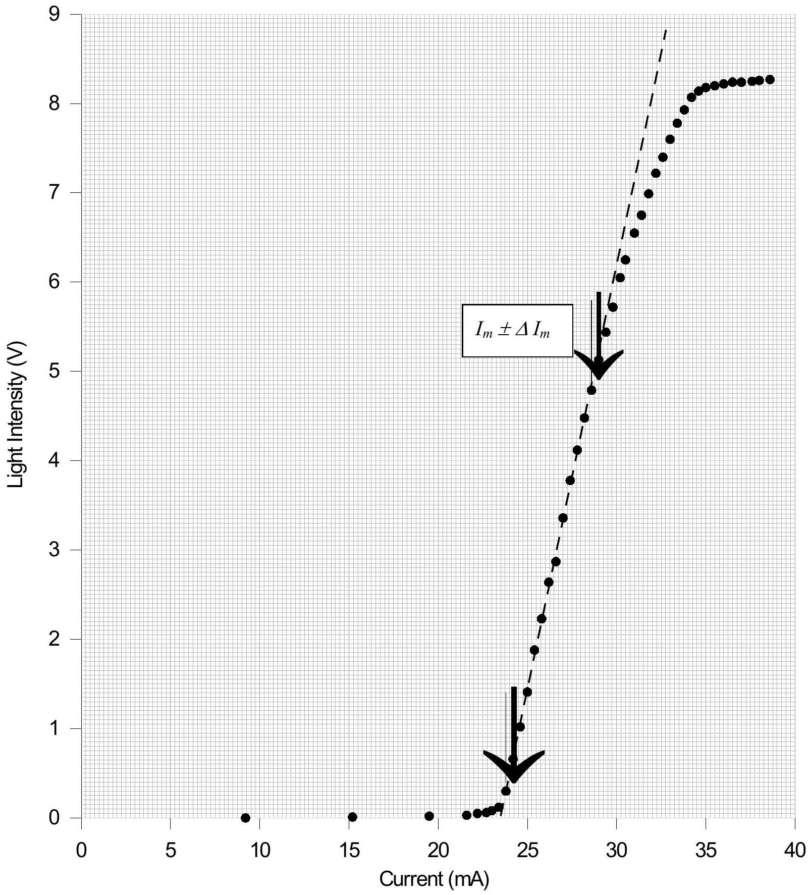
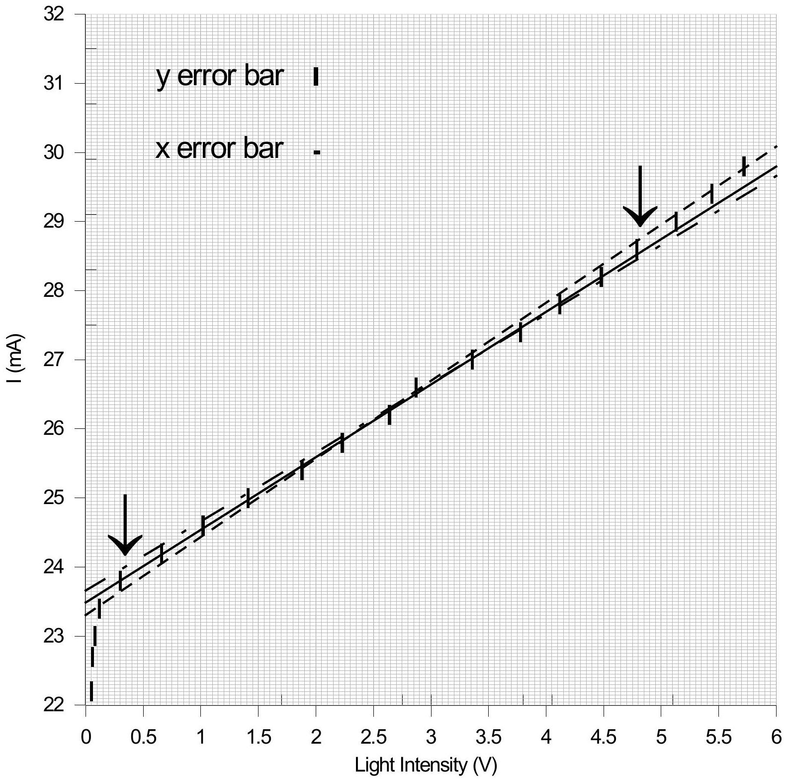
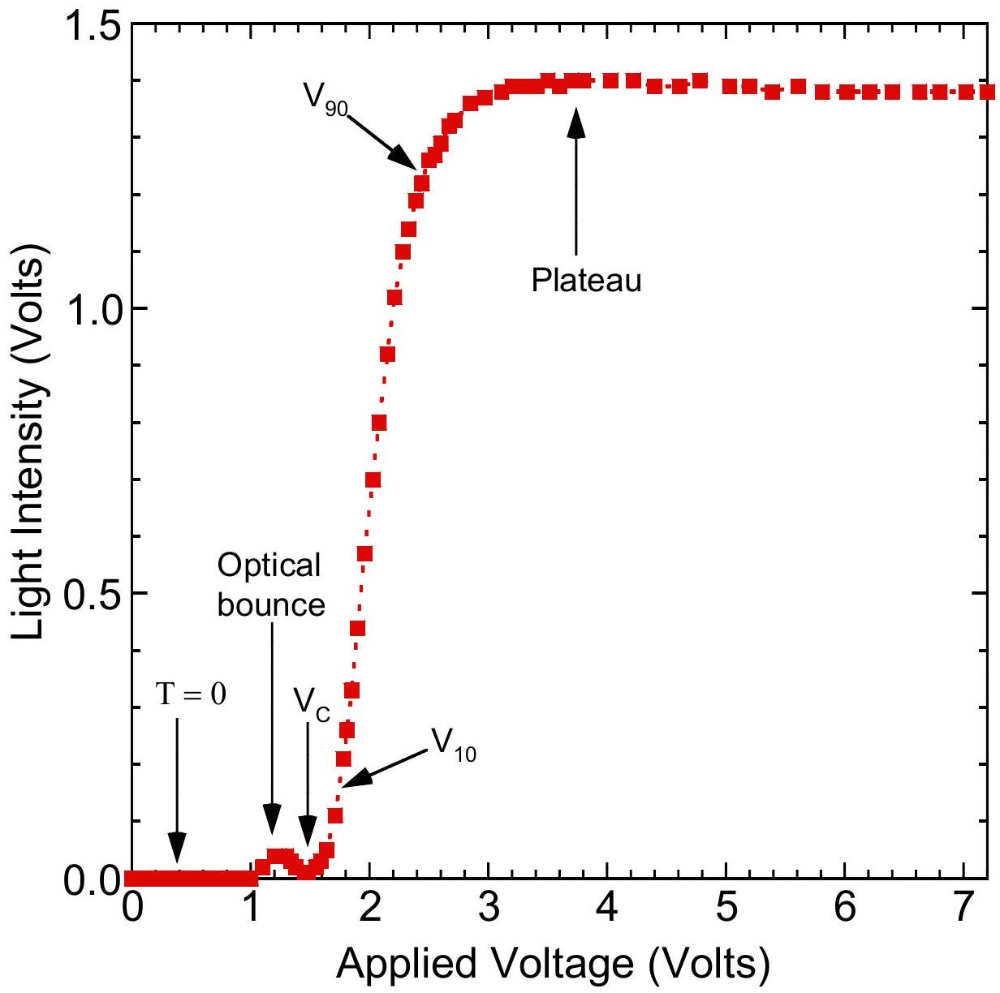
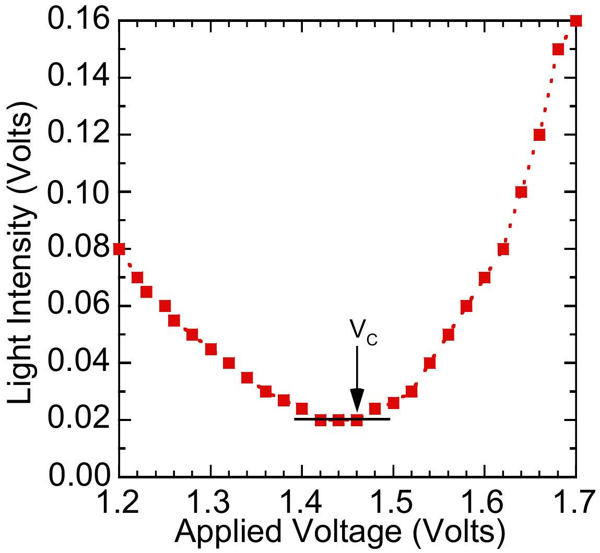
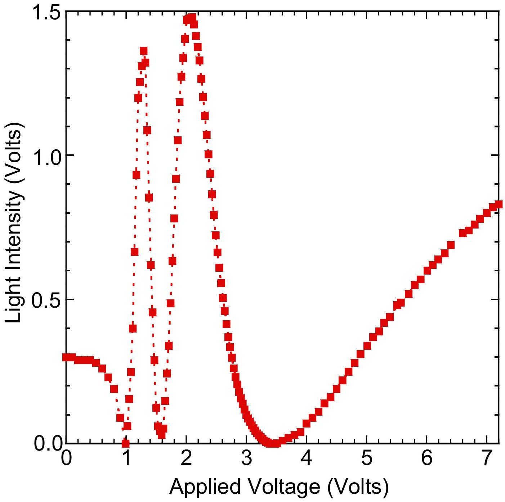
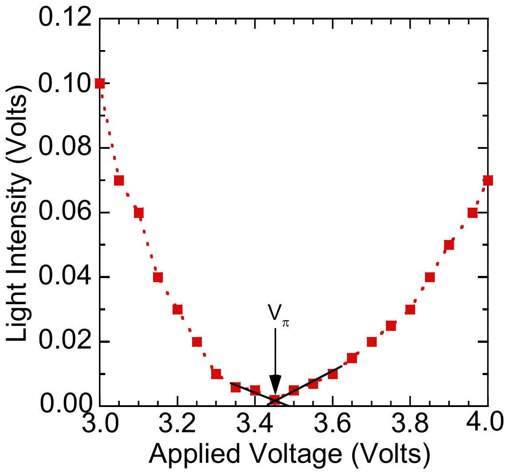

## Solutions to Experimental Problems

Part A: Optical Properties of Laser Diode

Question A-(1) (Total 1.5 point)
Measure, tabulate, and plot the $\mathcal { J }$ vs. $I$ curve.
a. Data (0.3 pts.) : Proper data table marked with variables and units.
Table A-(1): Data for $\mathcal { J }$ vs. $I$.

| $I ( \mathrm {~mA} )$ | 9.2 | 15.2 | 19.5 | 21.6 | 22.2 | 22.7 | 23.0 | 23.4 | 23.8 |
| :--- | :--- | :--- | :--- | :--- | :--- | :--- | :--- | :--- | :--- |
| $f ( \mathrm {~V} )$ | 0.00 | 0.01 | 0.02 | 0.03 | 0.05 | 0.06 | 0.09 | 0.12 | 0.30 |
| $I ( \mathrm {~mA} )$ | 24.2 | 24.6 | 25.0 | 25.4 | 25.8 | 26.2 | 26.6 | 27.0 | 27.4 |
| $f ( \mathrm {~V} )$ | 0.66 | 1.02 | 1.41 | 1.88 | 2.23 | 2.64 | 3.04 | 3.36 | 3.78 |
| $I ( \mathrm {~mA} )$ | 27.8 | 28.2 | 28.6 | 29.0 | 29.4 | 29.8 | 30.2 | 30.5 | 31.0 |
| $f ( \mathrm {~V} )$ | 4.12 | 4.48 | 4.79 | 5.13 | 5.44 | 5.72 | 6.05 | 6.25 | 6.55 |
| $I ( \mathrm {~mA} )$ | 31.4 | 31.8 | 32.2 | 32.6 | 33.0 | 33.4 | 33.8 | 34.2 | 34.6 |
| $f ( \mathrm {~V} )$ | 6.75 | 6.99 | 7.22 | 7.40 | 7.60 | 7.78 | 7.93 | 8.07 | 8.14 |
| $I ( \mathrm {~mA} )$ | 35.0 | 35.5 | 36.0 | 36.5 | 37.0 | 37.6 | 38.0 | 38.6 |  |
| $f ( \mathrm {~V} )$ | 8.18 | 8.20 | 8.22 | 8.24 | 8.24 | 8.25 | 8.26 | 8.27 |  |

Current error : $\pm 0.1 \mathrm {~mA}$; Voltage error : $\pm 0.01 \mathrm {~V}$

b. Plotting (0.3 pts.): Proper sizes of scales, and units for abscissa and ordinate that bear relation to the accuracy and range of the experiment.
c. Curve (0.9 pts.): Proper data and adequate line shape
    - As shown in Fig. A-1. Start ~0 → Threshold → Linear → Saturate.

Fig. A-1 Graph of light intensity $\mathcal { J }$ versus current $I$

Question A-(2) ( Total 3.5 points)
Estimate the maximum current $I _ { m }$ with uncertainty in the linear region of the $\mathcal { J } - I$. Mark the linear region on the $\mathcal { J } - I$ curve figure by using arrows ( ↓ ) and determine the threshold current $I _ { \text {th } }$ with detailed error analysis.

a. Linear region marking (0.5 pts.) in Fig. A-1.
b. Least-square method or eye-balling with ruler and error analysis (1.5 pt.)

| Least-square fitting | Eye-balling with ruler |
| :--- | :--- |
| Error bar in graph 0.0x mA (0.5 pts) | Error bar in graph 0.x mA (0.5 pts) |
| Least-square method (0.5 pts) | Expanded scale graph (0.5 pts) |
| Error analysis (0.5 pts) | draw three lines for error analysis(0.5 pts) |

c. $I _ { m } \pm \Delta I _ { m }$ (0.5 pts.): Adequate value of $\mathrm { I } _ { \mathrm { m } }$ (0.3 pts.) and error( $\pm \Delta I _ { m }$ ) (0.2 pts.) from the linear region of $\mathcal { J }$-I curve.
d. Adequate value of $\mathrm { I } _ { \mathrm { th } }$ with error (1.0 pts.)
$I _ { t h } = ( 21 \sim 26 ) \pm ( 0.01$ or 0.2 for single value) mA
Adequate value of $I _ { \text {th } }$ ( 0.5 pts.) and error ( $\pm \Delta I _ { \text {th } }$ ) (0.5 pts.)

Fig. A-2 Straight lines and extrapolations

Appendix :
©A1-1

- Least-Square Method :

$$
I = m \mathcal { J } + b \quad \rightarrow \quad b = I _ { \mathrm { th } }
$$

For $y = m x + b$

|  | $y : I ( \mathrm {~mA} )$ | $x : \mathcal { J }$ | $x y$ | $x ^ { 2 }$ | $y ( x ) = m x + b$ | $( y - y ( x ) ) ^ { 2 }$ |
| :--- | :--- | :--- | :--- | :--- | :--- | :--- |
| 1 | 23.8 | 0.30 | 7.14 | 0.090 | 23.7937 | $3.969 \mathrm { E } - 05$ |
| 2 | 24.2 | 0.66 | 15.972 | 0.4356 | 24.17134 | 0.000821 |
| 3 | 24.6 | 1.02 | 25.092 | 1.0404 | 24.54898 | 0.00260 |
| 4 | 25.0 | 1.41 | 35.25 | 1.9881 | 24.95809 | 0.00176 |
| 5 | 25.4 | 1.88 | 47.752 | 3.5344 | 25.45112 | 0.00261 |
| 6 | 25.8 | 2.23 | 57.534 | 4.9729 | 25.81827 | 0.000334 |
| 7 | 26.2 | 2.64 | 69.168 | 6.9696 | 26.24836 | 0.00234 |
| 8 | 26.6 | 3.04 | 80.864 | 9.2416 | 26.66796 | 0.00462 |
| 9 | 27.0 | 3.36 | 90.72 | 11.2896 | 27.00364 | $1.325 \mathrm { E } - 05$ |
| 10 | 27.4 | 3.78 | 103.572 | 14.2884 | 27.44422 | 0.00196 |
| 11 | 27.8 | 4.12 | 114.536 | 16.9744 | 27.80088 | $7.744 \mathrm { E } - 07$ |
| 12 | 28.2 | 4.48 | 126.336 | 20.0704 | 28.17852 | 0.000461 |
| 13 | 28.6 | 4.79 | 136.994 | 22.9441 | 28.50371 | 0.00927 |
|  | $\Sigma y =$ 340.6 | $\Sigma x =$ 33.71 | $\Sigma x y =$ 910.93 | $\Sigma x ^ { 2 } =$ 113.840 |  | $\Sigma ( y - y ( x ) ) ^ { 2 } =$ 0.0268 |

$$
\begin{aligned}
& \Delta = N \Sigma x ^ { 2 } - ( \Sigma x ) ^ { 2 } = 13 ( 113.840 ) - ( 33.71 ) ^ { 2 } = 343.556 \\
& m = \frac { 1 } { \Delta } ( N \Sigma x y - \Sigma x \Sigma y ) = \frac { 13 ( 910.93 ) - ( 33.71 ) ( 340.6 ) } { 343.556 } = 1.049 \\
& b = \frac { 1 } { \Delta } \left( \Sigma x ^ { 2 } \Sigma y - \Sigma x \Sigma x y \right) = \frac { ( 113.840 ) ( 340.6 ) - ( 33.71 ) ( 910.93 ) } { 343.556 } = 23.479
\end{aligned}
$$

$$
\begin{aligned}
& \sigma _ { y } = \sqrt { \frac { \Sigma ( y - y ( x ) ) ^ { 2 } } { N - 2 } } = \sqrt { \frac { 0.0268 } { 13 - 2 } } = 0.049 \\
& \sigma = \sqrt { \left( \sigma _ { y } \right) ^ { 2 } + \left( \frac { d y } { d x } \sigma _ { x } \right) ^ { 2 } } = \sqrt { ( 0.049 ) ^ { 2 } + ( 1.049 \times 0.005 ) ^ { 2 } } = 0.049 \\
& \sigma _ { m } = \sqrt { \frac { N \sigma ^ { 2 } } { \Delta } } = \sqrt { \frac { 13 \times 0.049 ^ { 2 } } { 343.556 } } = 0.0095 \\
& \sigma _ { b } = \sqrt { \frac { \sigma ^ { 2 } } { \Delta } \Sigma x ^ { 2 } } = 0.049 \times \sqrt { \frac { 113.840 } { 343.556 } } = 0.028 \\
& I _ { t h } = 23.48 \pm 0.03 \mathrm {~mA}
\end{aligned}
$$

©A1-2

- Eye-balling Method :

$$
I = m \mathcal { J } + b \quad \rightarrow \quad b = I _ { \mathrm { th } }
$$

For $y = m x + b$
Line 1: $y = 1.00 x + 23.66$
Line 2: $y = 1.05 x + 23.48$
Line3: $y = 1.13 x + 23.31$

$$
\begin{aligned}
& I _ { \mathrm { th } } ( \mathrm { av } . ) = 23.48 \\
& I _ { \mathrm { th } } \text { std. } = 0.18 \\
& I _ { t h } = 23.5 \pm 0.2 \mathrm {~mA}
\end{aligned}
$$

## Part B: Optical Properties of Nematic Liquid Crystal   Electro-optical switching characteristic of 90° TN LC cell

Question_B-(1) (5.0 points)
Measure, tabulate, and plot the electro-optical switching curve ( $\mathcal { J }$ vs. $\mathrm { V } _ { \text {rms } }$ curve) of the NB $90 ^ { \mathrm { o } } \mathrm { TN } \mathrm { LC }$, and find its switching slope $\gamma$, where $\gamma$ is defined as $\left( \mathrm { V } _ { 90 } - \mathrm { V } _ { 10 } \right) / \mathrm { V } _ { 10 }$.

a.Proper data table marked with variables and units. (0.3 pts)

| Applied voltage (Volts) | Light intensity (Volts) | Applied voltage (Volts) | Light intensity (Volts) |
| :--- | :--- | :--- | :--- |
| 0.00 | 0.00 | 2.44 | 1.22 |
| 0.10 | 0.00 | 2.50 | 1.26 |
| 0.20 | 0.00 | 2.55 | 1.27 |
| 0.30 | 0.00 | 2.60 | 1.29 |
| 0.40 | 0.00 | 2.67 | 1.32 |
| 0.50 | 0.00 | 2.72 | 1.33 |
| 0.60 | 0.00 | 2.85 | 1.36 |
| 0.70 | 0.00 | 2.97 | 1.37 |
| 0.80 | 0.00 | 3.11 | 1.38 |
| 0.90 | 0.00 | 3.20 | 1.39 |
| 1.00 | 0.00 | 3.32 | 1.39 |
| 1.10 | 0.02 | 3.41 | 1.39 |
| 1.20 | 0.04 | 3.50 | 1.40 |
| 1.24 | 0.04 | 3.60 | 1.39 |
| 1.30 | 0.04 | 3.70 | 1.40 |
| 1.34 | 0.03 | 3.80 | 1.40 |
| 1.38 | 0.02 | 4.03 | 1.40 |
| 1.45 | 0.01 | 4.22 | 1.40 |
| 1.48 | 0.01 | 4.40 | 1.39 |
| 1.55 | 0.02 | 4.61 | 1.39 |
| 1.59 | 0.03 | 4.78 | 1.40 |
| 1.64 | 0.05 | 5.03 | 1.39 |
| 1.71 | 0.11 | 5.20 | 1.39 |
| 1.78 | 0.21 | 5.39 | 1.38 |
| 1.81 | 0.26 | 5.61 | 1.39 |
| 1.85 | 0.33 | 5.81 | 1.38 |
| 1.90 | 0.44 | 6.02 | 1.38 |
| 1.96 | 0.57 | 6.21 | 1.38 |
| 2.03 | 0.70 | 6.40 | 1.38 |
| 2.08 | 0.80 | 6.63 | 1.38 |
| 2.15 | 0.92 | 6.80 | 1.38 |
| 2.21 | 1.02 | 7.02 | 1.38 |
| 2.28 | 1.10 | 7.20 | 1.38 |
| 2.33 | 1.14 |  |  |
| 2.39 | 1.19 |  |  |

b. Properly choose the size of scales and units for abscissa and ordinate that bears the relation to the accuracy and range of the experiment. (0.3 pts)
c. Correct measurement of the light intensity ( $\mathcal { J }$ ) as a function of the applied voltage ( $\mathrm { V } _ { \text {rms } }$ ) and adequate $\mathcal { J } - \mathrm { V } _ { \text {rms } }$ curve plot.
    - The intensity of the transmission light is smaller than 0.05 Volts in the normally black mode. (0.4 pts)
    - There is a small optical bounce before the external applied voltage reaches the critical voltage. (0.8 pts)
    - The intensity of the transmission light increases rapidly and abruptly when the external applied voltage exceeds the critical voltage. (0.4 pts)
    - The intensity of the transmission light displays the plateau behavior as the external applied voltage exceeds 3.0 Volts. (0.4 pts)

d. Adequate value of $\gamma$ with error.
    - Find the maximum value of the light intensity in the region of the applied voltage between 3.0 and 7.2 Volts (0.6 pts)
    - Determine the value of 90 \% of the maximum light intensity. Obtain the value of the applied voltage $\mathrm { V } _ { 90 }$ by interpolation. (0.6 pts)

- Determine the value of 10 \% of the maximum light intensity. Obtain the value of the applied voltage ${ } _ { 10 }$ by interpolation. (0.6 pts)
- Correct $\gamma \pm \Delta \gamma$ value, $( 0.42 \sim 0.44 ) \pm 0.02$. (0.4+0.2 pts)

Question B-(2) (Total 2.5 points)
Determine the critical voltage $\mathrm { V } _ { \mathrm { c } }$ of this NB 90° TN LC cell. Show explicitly with graph how you determine the value $\mathrm { V } _ { \mathrm { c } }$.

a. Adequate value of $\mathrm { V } _ { \mathrm { C } }$ with error, $\mathrm { V } _ { \mathrm { C } } \pm \Delta \mathrm { V } _ { \mathrm { C } }$.
    - Make the expanded scale plot and take more data points in the region of $\mathrm { V } _ { \mathrm { C } }$. (0.8 pts)
    - Determine the value of $\mathrm { V } _ { \mathrm { C } }$ when the intensity of the transmission light increases rapidly and abruptly. (0.7 pts)
    - Correct $\mathrm { V } _ { \mathrm { C } } \pm \Delta \mathrm { V } _ { \mathrm { C } }$ value, $( 1.20 \sim 1.50 ) \pm 0.01$ Volts. (0.8+0.2 pts)

(The data shown in this graph do not correspond to the data shown on the previous page. This graph only shows how to obtain Vc.)

## Part C: Optical Properties of Nematic Liquid Crystal :   Electro-optical switching characteristic of parallel aligned LC cell

Question C-(1) (2.5 points)
Assume that the wavelength of laser light 650 nm, LC layer thickness $7.7 \mu \mathrm {~m}$, and approximate value of $\Delta \mathrm { n } \approx 0.25$ are known. From the experimental data $\mathrm { T } _ { \perp }$ and $\mathrm { T } _ { \| }$ obtained above, calculate the accurate value of the phase retardation $\delta$ and accurate value of birefringence $\Delta \mathrm { n }$ of this LC cell at $\mathrm { V } = 0$.

a. Adequate value of $\delta$ and $\Delta \mathrm { n }$ with error.
    - Take and average the values of $\mathrm { T } _ { \| }$. (0.3 pts)
    - Take and average the values of $\mathrm { T } _ { \perp }$. (0.3 pts)
    - Determine the value of order m. (0.9 pts)
    - Correct $\delta$ value, $15.7 \sim 18.2$. (0.5 pts)
    - Correct $\Delta \mathrm { n }$ value, 0.20 ~ 0.24 (0.5 pts)
$$
\begin{aligned}
& T _ { / / } = \frac { 0.31 + 0.31 + 0.31 } { 3 } = 0.31 \pm 0.01 \text { Volts } \\
& T _ { \perp } = \frac { 1.04 + 1.03 + 1.04 } { 3 } = 1.04 \pm 0.01 \text { Volts } \\
& \tan \frac { \delta } { 2 } = \pm \frac { \sqrt { T _ { \perp } } } { \sqrt { T _ { / / } } } = - 1.83 ^ { * } \quad \therefore \delta = 4.14 + 2 m \pi \quad ( \text { or } - 2.14 + 2 m \pi ) \\
& \delta = \frac { 2 \pi d \Delta n } { \lambda } = \frac { 2 \pi \times 7.7 \times 0.25 } { 0.65 } = 18.61
\end{aligned}
$$
Take $m = 2 ( o r 3 ) \quad \therefore \delta = 16.70 ( 5.32 \pi )$
From $\delta = \frac { 2 \pi d \Delta n } { \lambda } \quad \therefore \Delta n = \frac { \delta \lambda } { 2 \pi d } = 0.22$
Accepted value for $\therefore \Delta n = ( 0.20 \sim 0.24 )$
*If $\tan \frac { \delta } { 2 } = 1.83$, the value for $\delta$ will be either $4.68 \pi$ or $6.68 \pi$, which is not consistent with data figure of problem C-(2).

Question C-(2) (Total 3.0 points)
Measure, tabulate, and plot the electro-optical switching curve for $\mathrm { T } _ { \| }$of this parallel aligned LC cell in the $\theta = 45 ^ { \circ }$ configuration.

a. Proper data table marked with variables and units. (0.3 pts)
| Applied voltage (Volts) | Light intensity (Volts) | Applied voltage (Volts) | Light intensity (Volts) | Applied voltage (Volts) | Light intensity (Volts) |
| :--- | :--- | :--- | :--- | :--- | :--- |
| 0.00 | 0.30 | 2.01 | 1.47 | 3.33 | 0.00 |
| 0.10 | 0.30 | 2.04 | 1.48 | 3.36 | 0.00 |
| 0.20 | 0.29 | 2.07 | 1.48 | 3.39 | 0.00 |
| 0.30 | 0.29 | 2.10 | 1.48 | 3.42 | 0.00 |
| 0.40 | 0.29 | 2.13 | 1.45 | 3.45 | 0.00 |
| 0.50 | 0.28 | 2.16 | 1.42 | 3.48 | 0.00 |
| 0.60 | 0.26 | 2.19 | 1.38 | 3.51 | 0.00 |
| 0.70 | 0.23 | 2.22 | 1.33 | 3.60 | 0.01 |
| 0.80 | 0.19 | 2.25 | 1.27 | 3.70 | 0.02 |
| 0.90 | 0.09 | 2.28 | 1.20 | 3.80 | 0.03 |
| 0.99 | 0.00 | 2.31 | 1.14 | 3.90 | 0.04 |
| 1.02 | 0.06 | 2.34 | 1.07 | 4.00 | 0.07 |
| 1.05 | 0.16 | 2.37 | 1.00 | 4.10 | 0.09 |
| 1.08 | 0.25 | 2.40 | 0.94 | 4.20 | 0.11 |
| 1.11 | 0.40 | 2.43 | 0.87 | 4.30 | 0.14 |
| 1.14 | 0.67 | 2.46 | 0.79 | 4.40 | 0.16 |
| 1.17 | 0.93 | 2.49 | 0.72 | 4.50 | 0.19 |
| 1.20 | 1.25 | 2.52 | 0.66 | 4.60 | 0.22 |
| 1.26 | 1.31 | 2.55 | 0.61 | 4.70 | 0.25 |
| 1.29 | 1.36 | 2.58 | 0.56 | 4.80 | 0.28 |
| 1.32 | 1.32 | 2.61 | 0.51 | 4.90 | 0.31 |
| 1.35 | 1.09 | 2.64 | 0.46 | 5.01 | 0.34 |
| 1.38 | 0.85 | 2.67 | 0.42 | 5.11 | 0.37 |
| 1.41 | 0.62 | 2.70 | 0.37 | 5.21 | 0.39 |
| 1.44 | 0.46 | 2.73 | 0.33 | 5.29 | 0.42 |
| 1.47 | 0.29 | 2.76 | 0.30 | 5.39 | 0.44 |
| 1.50 | 0.13 | 2.79 | 0.26 | 5.51 | 0.48 |
| 1.53 | 0.06 | 2.82 | 0.23 | 5.57 | 0.49 |
| 1.59 | 0.03 | 2.85 | 0.21 | 5.70 | 0.52 |
| 1.62 | 0.05 | 2.88 | 0.18 | 5.80 | 0.55 |
| 1.65 | 0.15 | 2.91 | 0.16 | 5.90 | 0.57 |
| 1.68 | 0.24 | 2.94 | 0.14 | 6.01 | 0.60 |
| 1.71 | 0.34 | 2.97 | 0.12 | 6.10 | 0.62 |
| 1.74 | 0.49 | 3.00 | 0.09 | 6.19 | 0.64 |
| 1.77 | 0.63 | 3.06 | 0.08 | 6.30 | 0.66 |
| 1.80 | 0.78 | 3.09 | 0.06 | 6.40 | 0.69 |
| 1.83 | 0.92 | 3.12 | 0.05 | 6.60 | 0.73 |
| 1.86 | 1.05 | 3.18 | 0.04 | 6.70 | 0.74 |
| 1.89 | 1.19 | 3.21 | 0.03 | 6.80 | 0.76 |
| 1.92 | 1.27 | 3.24 | 0.02 | 7.00 | 0.80 |
| 1.95 | 1.34 | 3.27 | 0.02 | 7.20 | 0.83 |
| 1.98 | 1.40 | 3.30 | 0.01 |  |  |

b. Properly choose the size of scales and units for abscissa and ordinate that bears the relation to the accuracy and range of the experiment. (0.3 pts)
c. Correct measurement of the $\mathrm { T } _ { \| }$as a function of the applied voltage $\left( \mathrm { V } _ { \text {rms } } \right)$ and adequate $\mathrm { T } _ { \| } - \mathrm { V } _ { \text {rms } }$ curve plot.
    - Three minima and two sharp maxima. (1.5 pts)
    - Maxima values within 15\% from each other. (0.5 pts)
    - Minima are less than the values of 0.1 Volts. (0.4 pts)

Question C-(3) (Total 2.0 points)
From the electro-optical switching data, find the value of the external applied voltage $\mathrm { V } _ { \pi }$.

a. Adequate value of $\mathrm { V } _ { \pi }$ with error.
    - Make the expanded scale plot and take more data points in the region of $\mathrm { V } _ { \pi }$. (0.3 pts)
    - Indicate the correct minimum of $\mathrm { V } _ { \pi }$. (0.8 pts)
    - Obtain the value of $\mathrm { V } _ { \pi }$ by interpolation or rounding. (0.5 pts)
    - Correct $\mathrm { V } _ { \pi }$ value : $( 3.2 \sim 3.5 ) \pm 0.01$ Volts. (0.2+0.2 pts)

## Marking Scheme

Part A: Optical Properties of Laser Diode
| No. | Contents | Sub Scores | Total Scores |
| :--- | :--- | :--- | :--- |
| A(1) | Measure, tabulate, and plot the $\mathcal { J }$ vs. $I$ curve. |  | 1.5 pts. |
| a | Proper data table marked with variables and units. | 0.3 |  |
| b | Proper sizes of scales, and units for abscissa and ordinate that bear relation to the accuracy and range of the experiment. | 0.3 |  |
| c | Proper data and adequate curve plotting (Fig. A-1) | 0.9 |  |
| A(2) | Estimate the maximum current $I _ { m }$ with uncertainty in the linear region of the $\mathcal { J }$ vs. $I$ curve. Mark the linear region on the $\mathcal { J } - I$ curve figure by using arrows $( \downarrow )$ and determine the threshold current $I _ { \text {th } }$ with uncertainty. |  | 3.5 pts. |
| a | Mark the linear region. | 0.5 |  |
| b | Least-square fit or eye-balling with ruler and error analysis | 1.5 |  |
| c | Obtain $I _ { m } \pm \Delta I _ { m }$ properly | 0.5 |  |
| d | Adequate value of $I _ { \text {th } } \pm \Delta I _ { \text {th } }$ | 1.0 |  |

Part B: Optical Properties of Nematic Liquid Crystal
Electro-optical switching characteristic of 90° TN LC cell
| No. | Contents | Sub Scores | Total Scores |
| :--- | :--- | :--- | :--- |
| B-(1) | Measure, tabulate, and plot the electro-optical switching curve ( $\mathcal { J }$ vs. $\mathrm { V } _ { \text {rms } }$ curve) of the NB 90° TN LC, and find its switching slope $\gamma$, where $\gamma$ is defined as $\left( \mathrm { V } _ { 90 } - \mathrm { V } _ { 10 } \right) / \mathrm { V } _ { 10 }$. |  | 5.0 pts. |
| a | Proper data table marked with variables and units. | 0.3 |  |
| b | Properly choose the size of scales and units for abscissa and ordinate that bears the relation to the accuracy and range of the experiment. | 0.3 |  |
| c | Correct measurement of the light intensity ( $\mathcal { J }$ ) as a function of the applied voltage $\left( \mathrm { V } _ { \text {rms } } \right)$ and adequate $\mathcal { J } - \mathrm { V } _ { \text {rms } }$ curve plot. |  |  |
|  | - The intensity of the transmission light reaches zero value in the normally black mode. | 0.4 |  |
|  | - There is a small optical bounce before the external applied voltage reaches the critical voltage. | 0.8 |  |
|  | - The intensity of the transmission light increases rapidly and | 0.4 |  |

|  | abruptly when the external applied voltage exceeds the critical voltage. |  |  |
| :--- | :--- | :--- | :--- |
|  | - The intensity of the transmission light displays the plateau behavior as the external applied voltage exceeds 3.0 Volts. | 0.4 |  |
| d | Adequate value of $\gamma$ with error, $\gamma \pm \Delta \gamma$. |  |  |
|  | - Correctly analyzing the maximum light intensity. | 0.6 |  |
|  | - Correctly analyzing the value of $\mathrm { V } _ { 90 }$. | 0.6 |  |
|  | - Correctly analyzing the value of $\mathrm { V } _ { 10 }$. | 0.6 |  |
|  | - Correct $\gamma \pm \Delta \gamma$ value, $( 0.42 \sim 0.44 ) \pm 0.02$. | 0.6 |  |
| B-(2) | Determine the critical voltage $\mathrm { V } _ { \mathrm { c } }$ of this NB 90° TN LC cell. Show explicitly with graph how you determine the value $\mathrm { V } _ { \mathrm { c } }$. |  | 2.5 pts. |
|  | Adequate value of $\mathrm { V } _ { \mathrm { C } }$ with error, $\mathrm { V } _ { \mathrm { C } } \pm \Delta \mathrm { V } _ { \mathrm { C } }$. |  |  |
|  | - Make the expanded scale plot and take more data points in the region of $\mathrm { V } _ { \mathrm { C } }$. | 0.8 |  |
|  | - Correctly analyzing the value of $\mathrm { V } _ { \mathrm { C } }$. | 0.7 |  |
|  | - Correct $\mathrm { V } _ { \mathrm { C } } \pm \Delta \mathrm { V } _ { \mathrm { C } }$ value, $( 1.2 \sim 1.5 ) \pm 0.01$ Volts. | 1.0 |  |

Part C: Optical Properties of Nematic Liquid Crystal :
Electro-optical switching characteristic of parallel aligned LC cell

| No. | Contents | Sub Scores | Total Scores |
| :--- | :--- | :--- | :--- |
| C-(1) | Assume that the wavelength of laser light 650 nm, LC layer thickness $7.7 \mu \mathrm {~m}$, and approximate value of $\Delta \mathrm { n } \approx 0.25$ are known. From the experimental data $\mathrm { T } _ { \perp }$ and $\mathrm { T } _ { \\| }$obtained above, calculate the accurate value of the phase retardation $\delta$ and accurate value of birefringence $\Delta \mathrm { n }$ of this LC cell at $\mathrm { V } = 0$. |  | 2.5 pts. |
|  | Adequate value of $\delta$ and $\Delta \mathrm { n }$ with error. |  |  |
|  | - Correctly analyzing the values of $\mathrm { T } \\|$. | 0.3 |  |
|  | - Correctly analyzing the values of $\mathrm { T } _ { \perp }$. | 0.3 |  |
|  | - Correctly determining the value of order m. | 0.9 |  |
|  | - Correct $\delta$ value, 17.7 ~ 18.2. | 0.5 |  |
|  | - Correct $\Delta \mathrm { n }$ value, 0.23 ~ 0.25. | 0.5 |  |
| C-(2) | Measure, tabulate, and plot the electro-optical switching curve for T of this parallel aligned LC cell in the $\theta = 45 ^ { \circ }$ configuration. |  | 3.0 pts. |
| a | Proper data table marked with variables and units. | 0.3 |  |
| b | Properly choose the size of scales and units for abscissa and ordinate | 0.3 |  |

|  | that bears the relation to the accuracy and range of the experiment. |  |  |
| :--- | :--- | :--- | :--- |
| c | Correct measurement of the $\mathrm { T } _ { \\| }$as a function of the applied voltage $\left( \mathrm { V } _ { \text {rms } } \right)$ and adequate $\mathrm { T } _ { \\| } - \mathrm { V } _ { \text {rms } }$ curve plot. |  |  |
|  | - Three minima and two sharp maxima. | 1.5 |  |
|  | - Maxima values within 15 \% from each other. | 0.5 |  |
|  | - Minima are less than the values of 0.1 Volts. | 0.4 |  |
| C-(3) | From the electro-optical switching data, find the value of the external applied voltage $\mathrm { V } _ { \pi }$ |  | 2.0 pts. |
|  | Adequate value of $\mathrm { V } _ { \pi }$ with error. |  |  |
|  | - Make the expanded scale plot and take more data points in the region of $\mathrm { V } _ { \pi }$. | 0.3 |  |
|  | - Indicate the correct minimum of $\mathrm { V } _ { \pi }$. | 0.8 |  |
|  | - Correctly analyzing the value of $\mathrm { V } _ { \pi }$. | 0.5 |  |
|  | - Correct $\mathrm { V } _ { \pi } \pm \Delta \mathrm { V } _ { \pi }$ value, $( 3.2 \sim 3.5 ) \pm 0.1$ Volts. | 0.4 |  |
