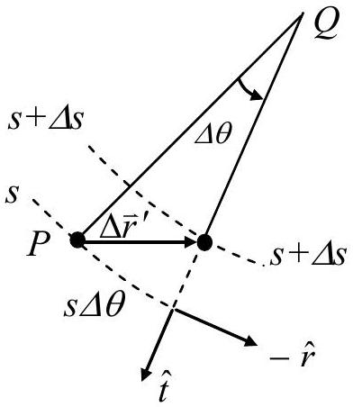
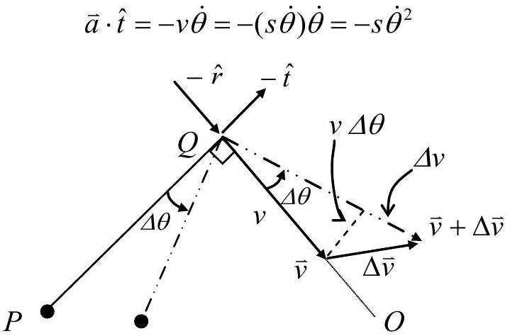
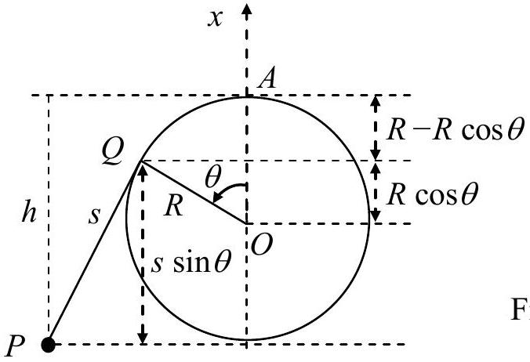
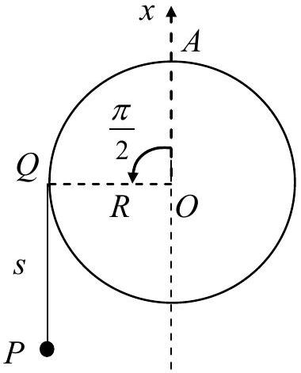
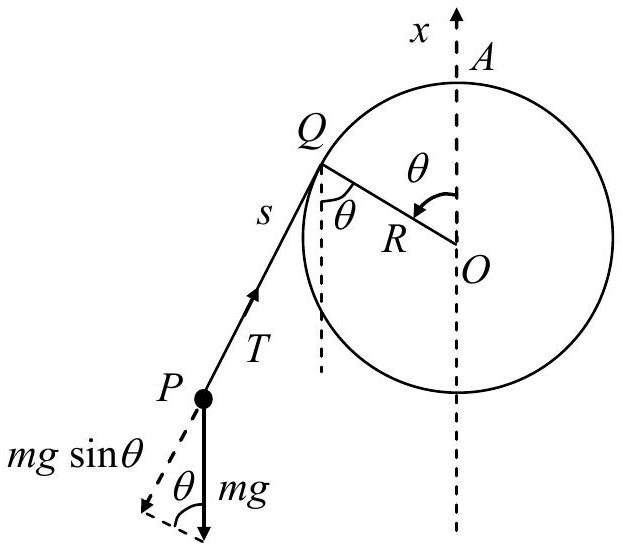
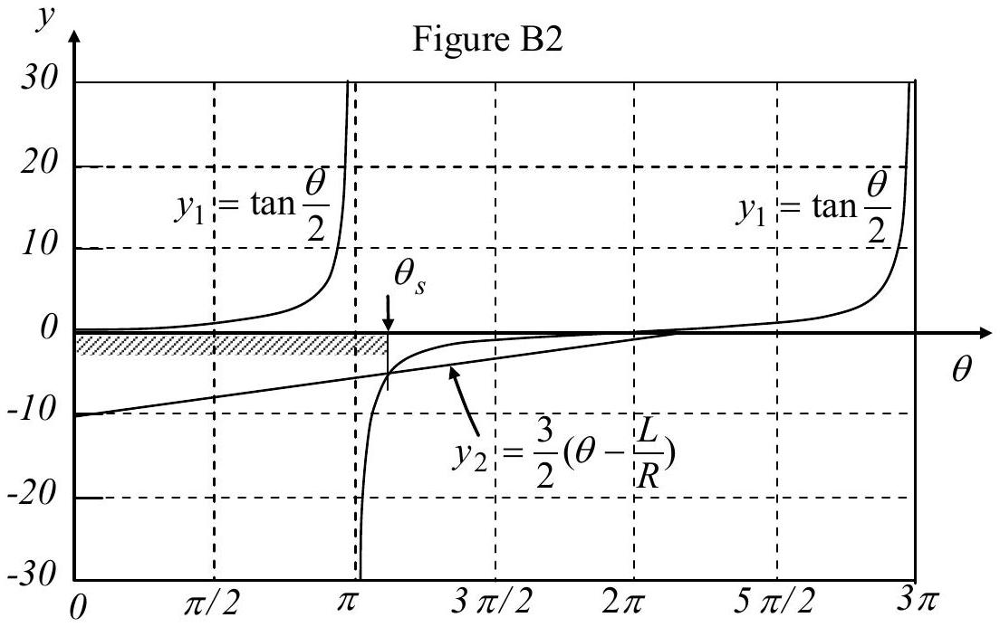
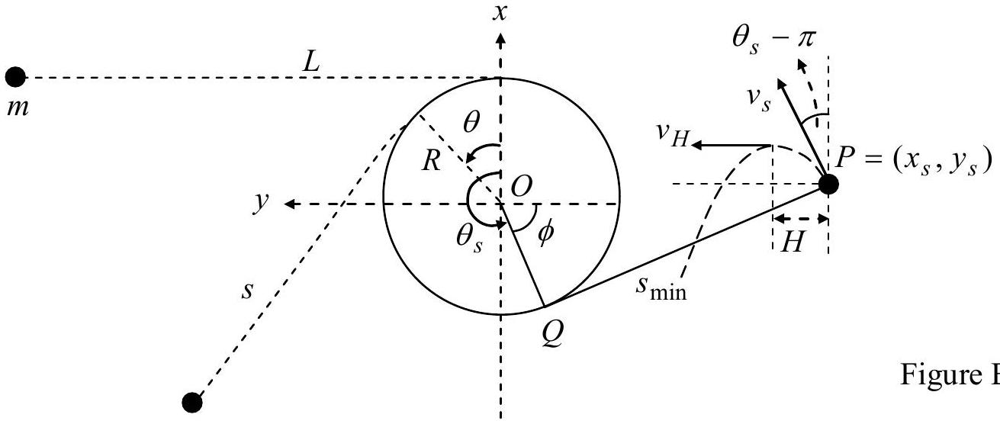
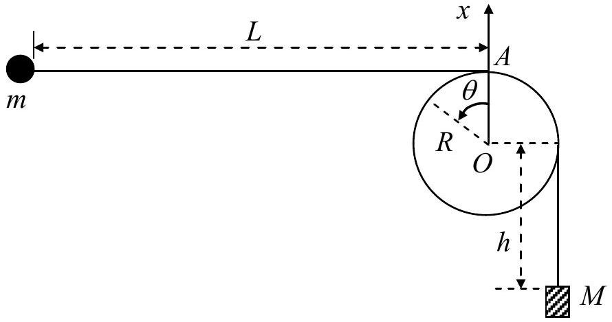

## Solution to Theoretical Question 1   A Swing with a Falling Weight

Part A

(a) Since the length of the string $L = s + R \theta$ is constant, its rate of change must be zero. Hence we have
$$
\begin{equation*}
\dot { s } + R \dot { \theta } = 0 \tag{A1}
\end{equation*}
$$
(b) Relative to $O , Q$ moves on a circle of radius $R$ with angular velocity $\dot { \theta }$, so
$$
\begin{equation*}
\vec { v } _ { Q } = R \dot { \theta } \hat { t } = - \dot { s } \hat { t } \tag{A2}
\end{equation*}
$$
(c)Refer to Fig. A1. Relative to $Q$, the displacement of $P$ in a time interval $\Delta t$ is $\Delta \bar { r } ^ { \prime } = ( s \Delta \theta ) ( - \hat { r } ) + ( \Delta s ) \hat { t } = [ ( s \dot { \theta } ) ( - \hat { r } ) + \dot { s } \hat { t } ] \Delta t$. It follows

$$
\begin{equation*}
\vec { v } ^ { \prime } = - s \dot { \theta } \hat { r } + \dot { s } \hat { t } \tag{A3}
\end{equation*}
$$

Figure A1
(d) The velocity of the particle relative to $O$ is the sum of the two relative velocities given in Eqs. (A2) and (A3) so that
$$
\begin{equation*}
\stackrel { \rightharpoonup } { v } = \stackrel { \rightharpoonup } { v } ^ { \prime } + \stackrel { \rightharpoonup } { v } _ { Q } = ( - s \dot { \theta } \hat { r } + \dot { s } \hat { t } ) + R \dot { \theta } \hat { t } = - s \dot { \theta } \hat { r } \tag{A4}
\end{equation*}
$$
(e)Refer to Fig. A2. The $( - \hat { t } )$-component of the velocity change $\Delta \vec { v }$ is given by $( - \hat { t } ) \cdot \Delta \vec { v } = v \Delta \theta = v \dot { \theta } \Delta t$. Therefore, the $\hat { t }$-component of the acceleration $\vec { a } = \Delta \vec { v } / \Delta t$ is given by $\hat { t } \cdot \hat { a } = - v \dot { \theta }$. Since the speed $v$ of the particle is $s \dot { \theta }$ according to Eq. (A4), we see that the $\hat { t }$-component of the particle's acceleration at $P$ is given by

Figure A2

Note that, from Fig. A2, the radial component of the acceleration may also be obtained as $\vec { a } \cdot \hat { r } = - d v / d t = - d ( s \dot { \theta } ) / d t$.
(f)Refer to Fig. A3. The gravitational potential energy of the particle is given by $U = - m g h$. It may be expressed in terms of $s$ and $\theta$ as

$$
\begin{equation*}
U ( \theta ) = - m g [ R ( 1 - \cos \theta ) + s \sin \theta ] \tag{A6}
\end{equation*}
$$

Figure A3
(g)At the lowest point of its trajectory, the particle's gravitational potential energy $U$ must assume its minimum value $U _ { m }$. By differentiating Eq. (A6) with respect to $\theta$ and using Eq. (A1), the angle $\theta _ { m }$ corresponding to the minimum gravitational energy can be obtained.

$$
\begin{aligned}
\frac { d U } { d \theta } & = - m g \left( R \sin \theta + \frac { d s } { d \theta } \sin \theta + s \cos \theta \right) \\
& = - m g [ R \sin \theta + ( - R ) \sin \theta + s \cos \theta ] \\
& = - m g s \cos \theta
\end{aligned}
$$

At $\theta = \theta _ { m } , \left. \frac { d U } { d \theta } \right| _ { \theta _ { m } } = 0$. We have $\theta _ { m } = \frac { \pi } { 2 }$. The lowest point of the particle's trajectory is shown in Fig. A4 where the length of the string segment of QP is $s = L - \pi R / 2$.

Figure A4

From Fig. A4 or Eq. (A6), the minimum potential energy is then

$$
\begin{equation*}
U _ { m } = U ( \pi / 2 ) = - m g [ R + L - ( \pi R / 2 ) ] \tag{A7}
\end{equation*}
$$

Initially, the total mechanical energy $E$ is 0 . Since $E$ is conserved, the speed $v _ { m }$ of the particle at the lowest point of its trajectory must satisfy

$$
\begin{equation*}
E = 0 = \frac { 1 } { 2 } m v _ { m } ^ { 2 } + U _ { m } \tag{A8}
\end{equation*}
$$

From Eqs. (A7) and (A8), we obtain

$$
\begin{equation*}
v _ { m } = \sqrt { - 2 U _ { m } / m } = \sqrt { 2 g [ R + ( L - \pi R / 2 ) ] } \tag{A9}
\end{equation*}
$$

## Part B

(h)From Eq. (A6), the total mechanical energy of the particle may be written as

$$
\begin{equation*}
E = 0 = \frac { 1 } { 2 } m v ^ { 2 } + U ( \theta ) = \frac { 1 } { 2 } m v ^ { 2 } - m g [ R ( 1 - \cos \theta ) + s \sin \theta ] \tag{B1}
\end{equation*}
$$

From Eq. (A4), the speed $v$ is equal to $s \dot { \theta }$. Therefore, Eq. (B1) implies

$$
\begin{equation*}
v ^ { 2 } = ( s \dot { \theta } ) ^ { 2 } = 2 g [ R ( 1 - \cos \theta ) + s \sin \theta ] \tag{B2}
\end{equation*}
$$

Let $T$ be the tension in the string. Then, as Fig. B1 shows, the $\hat { t }$-component of the net force on the particle is $- T + m g \sin \theta$. From Eq. (A5), the tangential acceleration of the particle is $\left( - s \dot { \theta } ^ { 2 } \right)$. Thus, by Newton's second law, we have

$$
\begin{equation*}
m \left( - s \dot { \theta } ^ { 2 } \right) = - T + m g \sin \theta \tag{B3}
\end{equation*}
$$

Figure B1

According to the last two equations, the tension may be expressed as

$$
\begin{align*}
T & = m \left( s \dot { \theta } ^ { 2 } + g \sin \theta \right) = \frac { m g } { s } [ 2 R ( 1 - \cos \theta ) + 3 s \sin \theta ] \\
& = \frac { 2 m g R } { s } \left[ \tan \frac { \theta } { 2 } - \frac { 3 } { 2 } \left( \theta - \frac { L } { R } \right) \right] ( \sin \theta )  \tag{B4}\\
& = \frac { 2 m g R } { s } \left( y _ { 1 } - y _ { 2 } \right) ( \sin \theta )
\end{align*}
$$

The functions $y _ { 1 } = \tan ( \theta / 2 )$ and $y _ { 2 } = 3 ( \theta - L / R ) / 2$ are plotted in Fig B2.

From Eq. (B4) and Fig. B2, we obtain the result shown in Table B1. The angle at which $. y _ { 2 } = y _ { 1 }$ is called $\theta _ { S } \left( \pi < \theta _ { S } < 2 \pi \right)$ and is given by

$$
\begin{equation*}
\frac { 3 } { 2 } \left( \theta _ { s } - \frac { L } { R } \right) = \tan \frac { \theta _ { s } } { 2 } \tag{B5}
\end{equation*}
$$

or, equivalently, by

$$
\begin{equation*}
\frac { L } { R } = \theta _ { s } - \frac { 2 } { 3 } \tan \frac { \theta _ { s } } { 2 } \tag{B6}
\end{equation*}
$$

Since the ratio $L / R$ is known to be given by

$$
\begin{equation*}
\frac { L } { R } = \frac { 9 \pi } { 8 } + \frac { 2 } { 3 } \cot \frac { \pi } { 16 } = \left( \pi + \frac { \pi } { 8 } \right) - \frac { 2 } { 3 } \tan \frac { 1 } { 2 } \left( \pi + \frac { \pi } { 8 } \right) \tag{B7}
\end{equation*}
$$

one can readily see from the last two equations that $\theta _ { s } = 9 \pi / 8$.

Table B1
|  | ( $y _ { 1 } - y _ { 2 }$ ) | $\sin \theta$ | tension $T$ |
| :--- | :--- | :--- | :--- |
| $0 < \theta < \pi$ | positive | positive | positive |
| $\theta = \pi$ | $+ \infty$ | 0 | positive |
| $\pi < \theta < \theta _ { s }$ | negative | negative | positive |
| $\theta = \theta _ { s }$ | zero | negative | zero |
| $\theta _ { s } < \theta < 2 \pi$ | positive | negative | negative |

Table B1 shows that the tension $T$ must be positive (or the string must be taut and straight) in the angular range $0 < \theta < \theta _ { s }$. Once $\theta$ reaches $\theta _ { s }$, the tension $T$ becomes zero and the part of the string not in contact with the rod will not be straight afterwards. The shortest possible value $s _ { \text {min } }$ for the length $s$ of the line segment $Q P$ therefore occurs at $\theta = \theta _ { s }$ and is given by

$$
\begin{equation*}
s _ { \min } = L - R \theta _ { s } = R \left( \frac { 9 \pi } { 8 } + \frac { 2 } { 3 } \cot \frac { \pi } { 16 } - \frac { 9 \pi } { 8 } \right) = \frac { 2 R } { 3 } \cot \frac { \pi } { 16 } = 3.352 R \tag{B8}
\end{equation*}
$$

When $\theta = \theta _ { s }$, we have $T = 0$ and Eqs. (B2) and (B3) then leads to $v _ { s } ^ { 2 } = - g s _ { \text {min } } \sin \theta _ { s }$. Hence the speed $v _ { s }$ is

$$
\begin{align*}
v _ { s } & = \sqrt { - g s _ { \min } \sin \theta _ { s } } = \sqrt { \frac { 2 g R } { 3 } \cot \frac { \pi } { 16 } \sin \frac { \pi } { 8 } } = \sqrt { \frac { 4 g R } { 3 } } \cos \frac { \pi } { 16 }  \tag{B9}\\
& = 1.133 \sqrt { g R }
\end{align*}
$$

(i) When $\theta \geq \theta _ { s }$, the particle moves like a projectile under gravity. As shown in Fig. B3, it is projected with an initial speed $v _ { s }$ from the position $P = \left( x _ { s } , y _ { s } \right)$ in a direction making an angle $\phi = \left( 3 \pi / 2 - \theta _ { s } \right)$ with the $y$-axis.
The speed $v _ { H }$ of the particle at the highest point of its parabolic trajectory is equal to the $y$-component of its initial velocity when projected. Thus,

$$
\begin{equation*}
v _ { H } = v _ { s } \sin \left( \theta _ { s } - \pi \right) = \sqrt { \frac { 4 g R } { 3 } } \cos \frac { \pi } { 16 } \sin \frac { \pi } { 8 } = 0.4334 \sqrt { g R } \tag{B10}
\end{equation*}
$$

The horizontal distance $H$ traveled by the particle from point $P$ to the point of maximum height is

$$
\begin{equation*}
H = \frac { v _ { s } ^ { 2 } \sin 2 \left( \theta _ { s } - \pi \right) } { 2 g } = \frac { v _ { s } ^ { 2 } } { 2 g } \sin \frac { 9 \pi } { 4 } = 0.4535 R \tag{B11}
\end{equation*}
$$

The coordinates of the particle when $\theta = \theta _ { s }$ are given by

$$
\begin{align*}
& x _ { s } = R \cos \theta _ { s } - s _ { \min } \sin \theta _ { s } = - R \cos \frac { \pi } { 8 } + s _ { \min } \sin \frac { \pi } { 8 } = 0.358 R  \tag{B12}\\
& y _ { s } = R \sin \theta _ { s } + s _ { \min } \cos \theta _ { s } = - R \sin \frac { \pi } { 8 } - s _ { \min } \cos \frac { \pi } { 8 } = - 3.478 R \tag{B13}
\end{align*}
$$

Evidently, we have $\left| y _ { s } \right| > ( R + H )$. Therefore the particle can indeed reach its maximum height without striking the surface of the rod.

## Part C

(j)Assume the weight is initially lower than $O$ by $h$ as shown in Fig. C1.

Figure C1

When the weight has fallen a distance $D$ and stopped, the law of conservation of total mechanical energy as applied to the particle-weight pair as a system leads to

$$
\begin{equation*}
- M g h = E ^ { \prime } - M g ( h + D ) \tag{C1}
\end{equation*}
$$

where $E ^ { \prime }$ is the total mechanical energy of the particle when the weight has stopped. It follows

$$
\begin{equation*}
E ^ { \prime } = M g D \tag{C2}
\end{equation*}
$$

Let $\Lambda$ be the total length of the string. Then, its value at $\theta = 0$ must be the same as at any other angular displacement $\theta$. Thus we must have

$$
\begin{equation*}
\Lambda = L + \frac { \pi } { 2 } R + h = s + R \left( \theta + \frac { \pi } { 2 } \right) + ( h + D ) \tag{C3}
\end{equation*}
$$

Noting that $D = \alpha L$ and introducing $\ell = L - D$, we may write

$$
\begin{equation*}
\ell = L - D = ( 1 - \alpha ) L \tag{C4}
\end{equation*}
$$

From the last two equations, we obtain

$$
\begin{equation*}
s = L - D - R \theta = \ell - R \theta \tag{C5}
\end{equation*}
$$

After the weight has stopped, the total mechanical energy of the particle must be conserved. According to Eq. (C2), we now have, instead of Eq. (B1), the following equation:

$$
\begin{equation*}
E ^ { \prime } = M g D = \frac { 1 } { 2 } m v ^ { 2 } - m g [ R ( 1 - \cos \theta ) + s \sin \theta ] \tag{C6}
\end{equation*}
$$

The square of the particle's speed is accordingly given by

$$
\begin{equation*}
v ^ { 2 } = ( s \dot { \theta } ) ^ { 2 } = \frac { 2 M g D } { m } + 2 g R \left[ ( 1 - \cos \theta ) + \frac { s } { R } \sin \theta \right] \tag{C7}
\end{equation*}
$$

Since Eq. (B3) stills applies, the tension $T$ of the string is given by

$$
\begin{equation*}
- T + m g \sin \theta = m \left( - s \dot { \theta } ^ { 2 } \right) \tag{C8}
\end{equation*}
$$

From the last two equations, it follows

$$
\begin{align*}
T & = m \left( s \dot { \theta } ^ { 2 } + g \sin \theta \right) \\
& = \frac { m g } { s } \left[ \frac { 2 M } { m } D + 2 R ( 1 - \cos \theta ) + 3 s \sin \theta \right]  \tag{C9}\\
& = \frac { 2 m g R } { s } \left[ \frac { M D } { m R } + ( 1 - \cos \theta ) + \frac { 3 } { 2 } \left( \frac { \ell } { R } - \theta \right) \sin \theta \right]
\end{align*}
$$

where Eq. (C5) has been used to obtain the last equality.
We now introduce the function

$$
\begin{equation*}
f ( \theta ) = 1 - \cos \theta + \frac { 3 } { 2 } \left( \frac { \ell } { R } - \theta \right) \sin \theta \tag{C10}
\end{equation*}
$$

From the fact $\ell = ( L - D ) \gg R$, we may write

$$
\begin{equation*}
f ( \theta ) \approx 1 + \frac { 3 } { 2 } \frac { \ell } { R } \sin \theta - \cos \theta = 1 + A \sin ( \theta - \phi ) \tag{C11}
\end{equation*}
$$

where we have introduced

$$
\begin{equation*}
A = \sqrt { 1 + \left( \frac { 3 } { 2 } \frac { \ell } { R } \right) ^ { 2 } } \quad , \quad \phi = \tan ^ { - 1 } \left( \frac { 2 R } { 3 \ell } \right) \tag{C12}
\end{equation*}
$$

From Eq. (C11), the minimum value of $f ( \theta )$ is seen to be given by

$$
\begin{equation*}
f _ { \min } = 1 - A = 1 - \sqrt { 1 + \left( \frac { 3 } { 2 } \frac { \ell } { R } \right) ^ { 2 } } \tag{C13}
\end{equation*}
$$

Since the tension $T$ remains nonnegative as the particle swings around the rod, we have from Eq. (C9) the inequality

$$
\begin{equation*}
\frac { M D } { m R } + f _ { \min } = \frac { M ( L - \ell ) } { m R } + 1 - \sqrt { 1 + \left( \frac { 3 \ell } { 2 R } \right) ^ { 2 } } \geq 0 \tag{C14}
\end{equation*}
$$

or

$$
\begin{equation*}
\left( \frac { M L } { m R } \right) + 1 \geq \left( \frac { M \ell } { m R } \right) + \sqrt { 1 + \left( \frac { 3 \ell } { 2 R } \right) ^ { 2 } } \approx \left( \frac { M \ell } { m R } \right) + \left( \frac { 3 \ell } { 2 R } \right) \tag{C15}
\end{equation*}
$$

From Eq. (C4), Eq. (C15) may be written as

$$
\begin{equation*}
\left( \frac { M L } { m R } \right) + 1 \geq \left( \frac { M L } { m R } + \frac { 3 L } { 2 R } \right) ( 1 - \alpha ) \tag{C16}
\end{equation*}
$$

Neglecting terms of the order $( R / L )$ or higher, the last inequality leads to

$$
\begin{equation*}
\alpha \geq 1 - \frac { \left( \frac { M L } { m R } \right) + 1 } { \left( \frac { M L } { m R } + \frac { 3 L } { 2 R } \right) } = \frac { \frac { 3 L } { 2 R } - 1 } { \frac { M L } { m R } + \frac { 3 L } { 2 R } } = \frac { 1 - \frac { 2 R } { 3 L } } { \frac { 2 M } { 3 m } + 1 } \approx \frac { 1 } { 1 + \frac { 2 M } { 3 m } } \tag{C17}
\end{equation*}
$$

The critical value for the ratio $D / L$ is therefore

$$
\begin{equation*}
\alpha _ { c } = \frac { 1 } { 1 + \frac { 2 M } { 3 m } } \tag{C18}
\end{equation*}
$$

## Marking Scheme

Theoretical Question 1
A Swing with a Falling Weight
| Total Scores | Sub Scores | Marking Scheme for Answers to the Problem |
| :--- | :--- | :--- |
| Part A | (a) | Relation between $\dot { \theta }$ and $\dot { s } . \quad ( \dot { s } = - R \dot { \theta } )$ |
|  | 0.5 | - 0.2 for $\dot { \theta } \propto \dot { s }$. |
|  | (b) | Velocity of $Q$ relative to $O . \quad \left( \vec { v } _ { Q } = R \dot { \theta } \hat { t } \right)$ |
|  | 0.5 | - 0.2 for magnitude $R \dot { \theta }$. |
|  |  | - 0.3 for direction $\hat { t }$. |
|  | (c) | Particle's velocity at $P$ relative to $Q . \left( \vec { v } ^ { \prime } = - s \dot { \theta } \hat { r } + \dot { s } \hat { t } \right)$ |
|  | 0.7 | - 0.2+0.1 for magnitude and direction of $\hat { r }$-component. |
|  |  | - 0.3+0.1 for magnitude and direction of $\hat { t }$-component. |
|  | (d) | Particle's velocity at $P$ relative to $O$. ( $\vec { v } = \vec { v } ^ { \prime } + \vec { v } _ { Q } = - s \dot { \theta } \hat { r }$ ) |
|  | 0.7 | - 0.3 for vector addition of $\vec { v } ^ { \prime }$ and $\vec { v } _ { Q }$. |
|  | (e) | $\hat { t }$-component of particle's acceleration at $P$. |
|  | 0.7 | - 0.3 for relating $\vec { a }$ or $\vec { a } \cdot \hat { t }$ to the velocity in a way that implies $\| \vec { a } \cdot \hat { t } \| = v ^ { 2 } / s$. |
|  | (f) | Potential energy $U$. |
|  |  | - 0.2 for formula $U = - m g h$. |
|  | 0.5 | - 0.3 for $h = R ( 1 - \cos \theta ) + s \sin \theta$ or $U$ as a function of $\theta , s$, and $R$. |
|  | (g) | Speed at lowest point $v _ { m }$. |
|  |  | - 0.2 for lowest point at $\theta = \pi / 2$ or $U$ equals minimum $U _ { m }$. |
|  | 0.7 | - 0.2 for total mechanical energy $E = m v _ { m } ^ { 2 } / 2 + U _ { m } = 0$. |
|  |  | - 0.3 for $v _ { m } = \sqrt { - 2 U _ { m } / m } = \sqrt { 2 g [ R + ( L - \pi R / 2 ) ] }$. |
| Part B | (h) | Particle's speed $v _ { s }$ when $\overline { Q P }$ is shortest. |
| 4.3 pts. | 2.4 | - 0.4 for tension $T$ becomes zero when $\overline { Q P }$ is shortest. |
|  |  | - 0.3 for equation of motion $- T + m g \sin \theta = m \left( - s \dot { \theta } ^ { 2 } \right)$. |
|  |  | - 0.3 for $E = 0 = m ( s \dot { \theta } ) ^ { 2 } / 2 - m g [ R ( 1 - \cos \theta ) + s \sin \theta ]$. |
|  |  | - 0.4 for $\frac { 3 } { 2 } \left( \theta _ { s } - \frac { L } { R } \right) = \tan \frac { \theta _ { s } } { 2 }$. |
|  |  | - 0.5 for $\theta _ { s } = 9 \pi / 8$. |
|  |  | - 0.3+0.2 for $v _ { s } = \sqrt { 4 g R / 3 } \cos \pi / 16 = 1.133 \sqrt { g R }$ |

|  | (i)  1.9   | The speed $v _ { H }$ of the particle at its highest point. - 0.4 for particle undergoes projectile motion when $\theta \geq \theta _ { s }$. - 0.3 for angle of projection $\phi = \left( 3 \pi / 2 - \theta _ { S } \right)$. - 0.3 for $v _ { H }$ is the $y$-component of its velocity at $\theta = \theta _ { s }$. - 0.4 for noting particle does not strike the surface of the rod. - 0.3+0.2 for $v _ { H } = \sqrt { 4 g R / 3 } \cos ( \pi / 16 ) \sin ( \pi / 8 ) = 0.4334 \sqrt { g R } .$ |
| :--- | :--- | :--- |
| Part C 3.4 pts | (j)  3.4   | The critical value $\alpha _ { c }$ of the ratio $D / L$. - 0.4 for particle's energy $E ^ { \prime } = M g D$ when the weight has stopped. - 0.3 for $s = L - D - R \theta$. - 0.3 for $E ^ { \prime } = M g D = m v ^ { 2 } / 2 - m g [ R ( 1 - \cos \theta ) + s \sin \theta ]$. - 0.3 for $- T + m g \sin \theta = m \left( - s \dot { \theta } ^ { 2 } \right)$. - 0.3 for concluding $T$ must not be negative. - 0.6 for an inequality leading to the determination of the range of $D / L$. - 0.6 for solving the inequality to give the range of $\alpha = D / L$. - 0.6 for $\alpha _ { c } = ( 1 + 2 M / 3 m )$.  |
