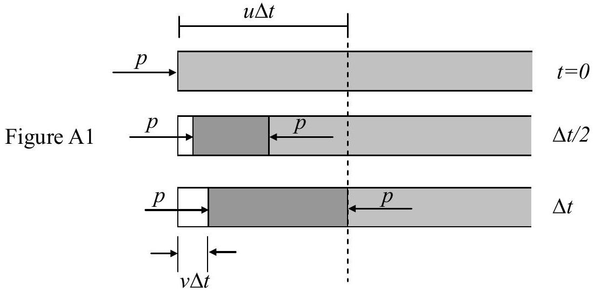
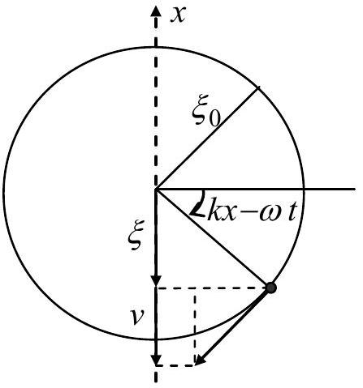

## Solution to Theoretical Question 2

## A Piezoelectric Crystal Resonator under an Alternating Voltage

Part A

(a) Refer to Figure A1. The left face of the rod moves a distance $v \Delta t$ while the pressure wave travels a distance $u \Delta t$ with $u = \sqrt { Y / \rho }$. The strain at the left face is
$$
\begin{equation*}
S = \frac { \Delta \ell } { \ell } = \frac { - v \Delta t } { u \Delta t } = \frac { - v } { u } \tag{Ala}
\end{equation*}
$$
From Hooke's law, the pressure at the left face is
$$
\begin{equation*}
p = - Y S = Y \frac { v } { u } = \rho u v \tag{Alb}
\end{equation*}
$$

(b) The velocity $v$ is related to the displacement $\xi$ as in a simple harmonic motion (or a uniform circular motion, as shown in Figure A2) of angular frequency $\omega = k u$. Therefore, if $\xi ( x , t ) = \xi _ { 0 } \sin k ( x - u t )$, then
$$
\begin{equation*}
v ( x , t ) = - k u \xi _ { 0 } \cos k ( x - u t ) . \tag{A2}
\end{equation*}
$$
The strain and pressure are related to velocity as in Problem (a). Hence,
$$
\begin{equation*}
S ( x , t ) = - v ( x , t ) / u = k \xi _ { 0 } \cos k ( x - u t ) \tag{A3}
\end{equation*}
$$
$$
\begin{align*}
p ( x , t ) & = \rho u v ( x , t ) = - k \rho u ^ { 2 } \xi _ { 0 } \cos k ( x - u t )  \tag{A4}\\
& = - Y S ( x , t ) = - k Y \xi _ { 0 } \cos k ( x - u t )
\end{align*}
$$

Alternatively, the answers may be obtained by differentiations:

$$
\begin{aligned}
& v ( x , t ) = \frac { \Delta \xi } { \Delta t } = - k u \xi _ { 0 } \cos k ( x - u t ) , \\
& S ( x , t ) = \frac { \Delta \xi } { \Delta x } = k \xi _ { 0 } \cos k ( x - u t ) , \\
& p ( x , t ) = - Y \frac { \Delta \xi } { \Delta x } = - k Y \xi _ { 0 } \cos k ( x - u t ) .
\end{aligned}
$$

Figure A2

Part B

(c) Since the angular frequency $\omega$ and speed of propagation $u$ are given, the wavelength is given by $\lambda = 2 \pi / k$ with $k = \omega / u$. The spatial variation of the displacement $\xi$ is therefore described by
$$
\begin{equation*}
g ( x ) = B _ { 1 } \sin k \left( x - \frac { b } { 2 } \right) + B _ { 2 } \cos k \left( x - \frac { b } { 2 } \right) \tag{B1}
\end{equation*}
$$
Since the centers of the electrodes are assumed to be stationary, $g ( b / 2 ) = 0$. This leads to $B _ { 2 } = 0$. Given that the maximum of $g ( x )$ is 1 , we have $B _ { 1 } = \pm 1$ and
$$
\begin{equation*}
g ( x ) = \pm \sin \frac { \omega } { u } \left( x - \frac { b } { 2 } \right) \tag{B2}
\end{equation*}
$$
Thus, the displacement is
$$
\begin{equation*}
\xi ( x , t ) = \pm 2 \xi _ { 0 } \sin \frac { \omega } { u } \left( x - \frac { b } { 2 } \right) \cos \omega t \tag{B3}
\end{equation*}
$$
(d) Since the pressure $p$ (or stress $T$ ) must vanish at the end faces of the quartz slab (i.e., $x = 0$ and $x = b$ ), the answer to this problem can be obtained, by analogy, from the resonant frequencies of sound waves in an open pipe of length $b$. However, given that the centers of the electrodes are stationary, all even harmonics of the fundamental tone must be excluded because they have antinodes, rather than nodes, of displacement at the bisection plane of the slab.
Since the fundamental tone has a wavelength $\lambda = 2 b$, the fundamental frequency is given by $f _ { 1 } = u / ( 2 b )$. The speed of propagation $u$ is given by
$$
\begin{equation*}
u = \sqrt { \frac { Y } { \rho } } = \sqrt { \frac { 7.87 \times 10 ^ { 10 } } { 2.65 \times 10 ^ { 3 } } } = 5.45 \times 10 ^ { 3 } \mathrm {~m} / \mathrm { s } \tag{B4}
\end{equation*}
$$
and, given that $b = 1.00 \times 10 ^ { - 2 } \mathrm {~m}$, the two lowest standing wave frequencies are
$$
\begin{equation*}
f _ { 1 } = \frac { u } { 2 b } = 273 ( \mathrm { kHz } ) , f _ { 3 } = 3 f _ { 1 } = \frac { 3 u } { 2 b } = 818 ( \mathrm { kHz } ) \tag{B5}
\end{equation*}
$$

[Alternative solution to Problems (c) and (d)]:
A longitudinal standing wave in the quartz slab has a displacement node at $x = b / 2$. It may be regarded as consisting of two waves traveling in opposite directions. Thus, its displacement and velocity must have the following form

$$
\begin{align*}
\xi ( x , t ) & = \xi _ { m } \left[ \sin k \left( x - \frac { b } { 2 } - u t \right) + \sin k \left( x - \frac { b } { 2 } + u t \right) \right]  \tag{B6}\\
& = 2 \xi _ { m } \sin k \left( x - \frac { b } { 2 } \right) \cos \omega t \\
v ( x , t ) & = - k u \xi _ { m } \left[ \cos k \left( x - \frac { b } { 2 } - u t \right) - \cos k \left( x - \frac { b } { 2 } + u t \right) \right]  \tag{B7}\\
& = - 2 \omega \xi _ { m } \sin k \left( x - \frac { b } { 2 } \right) \sin \omega t
\end{align*}
$$

where $\omega = k u$ and the first and second factors in the square brackets represent waves

traveling along the $+ x$ and $- x$ directions, respectively. Note that Eq. (B6) is identical to Eq. (B3) if we set $\xi _ { m } = \pm \xi _ { 0 }$.

For a wave traveling along the $- x$ direction, the velocity $v$ must be replaced by $- v$ in Eqs. (A1a) and (A1b) so that we have

$$
\begin{array} { l l }
S = \frac { - v } { u } \text { and } p = \rho u v & ( \text { waves traveling along } + x ) \\
S = \frac { v } { u } \text { and } p = - \rho u v & ( \text { waves traveling along } - x ) \tag{B9}
\end{array}
$$

As in Problem (b), the strain and pressure are therefore given by

$$
\begin{align*}
S ( x , t ) & = - k \xi _ { m } \left[ - \cos k \left( x - \frac { b } { 2 } - u t \right) - \cos k \left( x - \frac { b } { 2 } + u t \right) \right]  \tag{B10}\\
& = 2 k \xi _ { m } \cos k \left( x - \frac { b } { 2 } \right) \cos \omega t \\
p ( x , t ) & = - \rho u \omega \xi _ { m } \left[ \cos k \left( x - \frac { b } { 2 } - u t \right) + \cos k \left( x - \frac { b } { 2 } + u t \right) \right]  \tag{B11}\\
& = - 2 \rho u \omega \xi _ { m } \cos k \left( x - \frac { b } { 2 } \right) \cos \omega t
\end{align*}
$$

Note that $v , S$, and $p$ may also be obtained by differentiating $\xi$ as in Problem (b).
The stress $T$ or pressure $p$ must be zero at both ends $( x = 0$ and $x = b )$ of the slab at all times because they are free. From Eq. (B11), this is possible only if $\cos ( k b / 2 ) = 0$ or

$$
\begin{equation*}
k b = \frac { \omega } { u } b = \frac { 2 \pi f } { \lambda f } b = n \pi , \quad n = 1,3,5 , \cdots \tag{B12}
\end{equation*}
$$

In terms of wavelength $\lambda$, Eq. (B12) may be written as

$$
\begin{equation*}
\lambda = \frac { 2 b } { n } , \quad n = 1,3,5 , \cdots . \tag{B13}
\end{equation*}
$$

The frequency is given by

$$
\begin{equation*}
f = \frac { u } { \lambda } = \frac { n u } { 2 b } = \frac { n } { 2 b } \sqrt { \frac { Y } { \rho } } , \quad n = 1,3,5 , \cdots \tag{B14}
\end{equation*}
$$

This is identical with the results given in Eqs. (B4) and (B5).

(e) From Eqs. (5a) and (5b) in the Question, the piezoelectric effect leads to the equations
$$
\begin{align*}
T & = Y \left( S - d _ { p } E \right)  \tag{B15}\\
\sigma & = Y d _ { p } S + \varepsilon _ { T } \left( 1 - Y \frac { d _ { p } ^ { 2 } } { \varepsilon _ { T } } \right) E \tag{B16}
\end{align*}
$$
Because $x = b / 2$ must be a node of displacement for any longitudinal standing wave in the slab, the displacement $\xi$ and strain $S$ must have the form given in Eqs. (B6) and (B10), i.e., with $\omega = k u$,
$$
\begin{equation*}
\xi ( x , t ) = \xi _ { m } \sin k \left( x - \frac { b } { 2 } \right) \cos ( \omega t + \phi ) \tag{B17}
\end{equation*}
$$

$$
\begin{equation*}
S ( x , t ) = k \xi _ { m } \cos k \left( x - \frac { b } { 2 } \right) \cos ( \omega t + \phi ) \tag{B18}
\end{equation*}
$$

where a phase constant $\phi$ is now included in the time-dependent factors.
By assumption, the electric field $E$ between the electrodes is uniform and depends only on time:

$$
\begin{equation*}
E ( x , t ) = \frac { V ( t ) } { h } = \frac { V _ { m } \cos \omega t } { h } \tag{B19}
\end{equation*}
$$

Substituting Eqs. (B18) and (B19) into Eq. (B15), we have

$$
\begin{equation*}
T = Y \left[ k \xi _ { m } \cos k \left( x - \frac { b } { 2 } \right) \cos ( \omega t + \phi ) - \frac { d _ { p } } { h } V _ { m } \cos \omega t \right] \tag{B20}
\end{equation*}
$$

The stress $T$ must be zero at both ends ( $x = 0$ and $x = b$ ) of the slab at all times because they are free. This is possible only if $\phi = 0$ and

$$
\begin{equation*}
k \xi _ { m } \cos \frac { k b } { 2 } = d _ { p } \frac { V _ { m } } { h } \tag{B21}
\end{equation*}
$$

Since $\phi = 0$, Eqs. (B16), (B18), and (B19) imply that the surface charge density must have the same dependence on time $t$ and may be expressed as

$$
\begin{equation*}
\sigma ( x , t ) = \sigma ( x ) \cos \omega t \tag{B22}
\end{equation*}
$$

with the dependence on $x$ given by

$$
\begin{align*}
\sigma ( x ) & = Y d _ { p } k \xi _ { m } \cos k \left( x - \frac { b } { 2 } \right) + \varepsilon _ { T } \left( 1 - Y \frac { d _ { p } ^ { 2 } } { \varepsilon _ { T } } \right) \frac { V _ { m } } { h } \\
& = \left[ Y \frac { d _ { p } ^ { 2 } } { \cos \frac { k b } { 2 } } \cos k \left( x - \frac { b } { 2 } \right) + \varepsilon _ { T } \left( 1 - Y \frac { d _ { p } ^ { 2 } } { \varepsilon _ { T } } \right) \right] \frac { V _ { m } } { h } \tag{B23}
\end{align*}
$$

(f) At time $t$, the total surface charge $Q ( t )$ on the lower electrode is obtained by integrating $\sigma ( x , t )$ in Eq. (B22) over the surface of the electrode. The result is

$$
\begin{align*}
\frac { Q ( t ) } { V ( t ) } & = \frac { 1 } { V ( t ) } \int _ { 0 } ^ { b } \sigma ( x , t ) w d x = \frac { 1 } { V _ { m } } \int _ { 0 } ^ { b } \sigma ( x ) w d x \\
& = \frac { w } { h } \int _ { 0 } ^ { b } \left[ Y \frac { d _ { p } ^ { 2 } } { \cos \frac { k b } { 2 } } \cos k \left( x - \frac { b } { 2 } \right) + \varepsilon _ { T } \left( 1 - Y \frac { d _ { p } ^ { 2 } } { \varepsilon _ { T } } \right) \right] d x  \tag{B24}\\
& = \left( \varepsilon _ { T } \frac { b w } { h } \right) \left[ Y \frac { d _ { p } ^ { 2 } } { \varepsilon _ { T } } \left( \frac { 2 } { k b } \tan \frac { k b } { 2 } \right) + \left( 1 - Y \frac { d _ { p } ^ { 2 } } { \varepsilon _ { T } } \right) \right] \\
& = C _ { 0 } \left[ \alpha ^ { 2 } \left( \frac { 2 } { k b } \tan \frac { k b } { 2 } \right) + \left( 1 - \alpha ^ { 2 } \right) \right]
\end{align*}
$$

where

$$
\begin{equation*}
C _ { 0 } = \varepsilon _ { T } \frac { b w } { h } , \quad \alpha ^ { 2 } = Y \frac { d _ { p } ^ { 2 } } { \varepsilon _ { T } } = \frac { ( 2.25 ) ^ { 2 } \times 10 ^ { - 2 } } { 1.27 \times 4.06 } = 9.82 \times 10 ^ { - 3 } \tag{B25}
\end{equation*}
$$

(The constant $\alpha$ is called the electromechanical coupling coefficient.)

Note: The result $C _ { 0 } = \varepsilon _ { T } b w / h$ can readily be seen by considering the static limit $k = 0$ of Eq. (5) in the Question. Since $\tan x \approx x$ when $x \ll 1$, we have

$$
\begin{equation*}
\lim _ { k \rightarrow 0 } Q ( t ) / V ( t ) \approx C _ { 0 } \left[ \alpha ^ { 2 } + \left( 1 - \alpha ^ { 2 } \right) \right] = C _ { 0 } \tag{B26}
\end{equation*}
$$

Evidently, the constant $C _ { 0 }$ is the capacitance of the parallel-plate capacitor formed by the electrodes (of area $b w$ ) with the quartz slab (of thickness $h$ and permittivity $\varepsilon _ { T }$ ) serving as the dielectric medium. It is therefore given by $\varepsilon _ { T } b w / h$.

## Marking Scheme

Theoretical Question 2
A Piezoelectric Crystal Resonator under an Alternating Voltage
| Total Scores | Sub Scores | Marking Scheme for Answers to the Problem |
| :--- | :--- | :--- |
| Part A | (a) |  |
| 4.0 pts. | 1.6 | The strain $S$ and pressure $p$ on the left face. - 0.4 for $\| \Delta \ell \| = v \Delta t$ and $\ell = u \Delta t$.  |
|  | (b) | The velocity $v ( x , t )$, strain $S ( x , t )$, and pressure $p ( x , t )$. - $0.3 \times 3$ sinusoidal variation with correct phase constant. (0.2 for phase constant.) - $0.3 \times 3$ for amplitude. - 0.2×3 for dependence on $x$ and $t$ as ( $k x - k u t$ ).  |
| Part B | (c) | The function $g ( x )$ for a standing wave of angular frequency $\omega$. - 0.4 for $g ( b / 2 ) = 0$.  |
| 6.0 pts | 1.2 | - 0.3+0.1 for $B _ { 1 } = \pm 1$ (0.1 for both signs) - 0.4 for $B _ { 2 } = 0$ |
|  | (d) | The two lowest standing wave frequencies. - 0.2 for wavelength of fundamental tone $\lambda = 2 b$. - 0.2 for excluding even harmonics. - (0.3+0.1) for $f _ { 1 } = u / 2 b = 273 \mathrm { kHz }$. (0.1 for value) - (0.3+0.1) for $f _ { 3 } = 3 u / 2 b = 818 \mathrm { kHz }$. (0.1 for value)  |
|  | (e) | The surface charge density $\sigma$ as a function of $x$ and $t$. - $0.1 \times 2$ for $\xi$ and $S$, each a separable function of $x$ and $t$. - $0.1 \times 2$ for $\xi$ and $S$, each depends on time as $\cos \omega t$ with $\phi = 0$. - 0.3 for spatial part $\xi ( x ) = \xi _ { m } \sin k ( x - b / 2 )$. - 0.3 for spatial part $S ( x ) = k \xi _ { m } \cos k ( x - b / 2 )$. - 0.3 for $T ( x ) = \left[ k \xi _ { m } \cos k ( x - b / 2 ) - d _ { p } V _ { m } / h \right] Y$. - 0.3 for $k \xi _ { m } \cos ( k b / 2 ) = d _ { p } V _ { m } / h$. - 0.6 for $D _ { 1 } ( 0.3 )$ and $D _ { 2 } ( 0.3 )$ in $\sigma ( x )$.  |
|  | (f) | The constants $C _ { 0 }$ and $\alpha ^ { 2 }$. - 0.2 for relation between $\sigma$ and $Q$ as $Q ( t ) = \left( \int _ { 0 } ^ { b } \sigma ( x ) w d x \right) \cos \omega t .$ - 0.3 for noting $Q ( t ) / V ( t ) \approx C _ { 0 }$ as $k \rightarrow 0$. - 0.4 for $C _ { 0 } = \varepsilon _ { T } b w / h$. - 0.4+0.1 for $\alpha ^ { 2 } = Y d _ { p } ^ { 2 } / \varepsilon _ { T } = 9.82 \times 10 ^ { - 3 }$. (0.1 for value)  |
