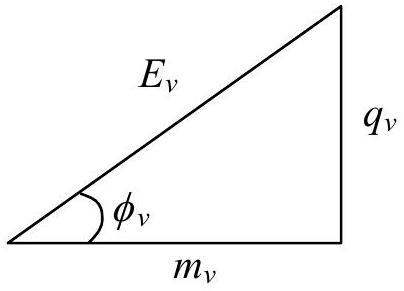
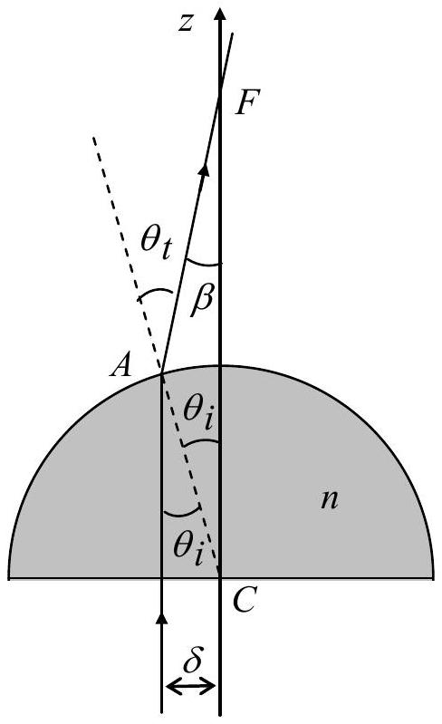

## Solution toTheoretical Question 3

Part A

## Neutrino Mass and Neutron Decay

(a) Let $\left( c ^ { 2 } E _ { e } , c \vec { q } _ { e } \right) , \left( c ^ { 2 } E _ { p } , c \vec { q } _ { p } \right)$, and $\left( c ^ { 2 } E _ { v } , c \vec { q } _ { v } \right)$ be the energy-momentum 4-vectors of the electron, the proton, and the anti-neutrino, respectively, in the rest frame of the neutron. Notice that $E _ { e } , E _ { p } , E _ { v } , \vec { q } _ { e } , \vec { q } _ { p } , \vec { q } _ { v }$ are all in units of mass. The proton and the anti-neutrino may be considered as forming a system of total rest mass $M _ { c }$, total energy $c ^ { 2 } E _ { c }$, and total momentum $c \vec { q } _ { c }$. Thus, we have
$$
\begin{equation*}
E _ { c } = E _ { p } + E _ { v } , \quad \vec { q } _ { c } = \vec { q } _ { p } + \vec { q } _ { v } , \quad M _ { c } ^ { 2 } = E _ { c } ^ { 2 } - q _ { c } ^ { 2 } \tag{A1}
\end{equation*}
$$
Note that the magnitude of the vector $\vec { q } _ { c }$ is denoted as $q _ { c }$. The same convention also applies to all other vectors.
Since energy and momentum are conserved in the neutron decay, we have
$$
\begin{gather*}
E _ { c } + E _ { e } = m _ { n }  \tag{A2}\\
\vec { q } _ { c } = - \vec { q } _ { e } \tag{A3}
\end{gather*}
$$
When squared, the last equation leads to the following equality
$$
\begin{equation*}
q _ { c } ^ { 2 } = q _ { e } ^ { 2 } = E _ { e } ^ { 2 } - m _ { e } ^ { 2 } \tag{A4}
\end{equation*}
$$
From Eq. (A4) and the third equality of Eq. (A1), we obtain
$$
\begin{equation*}
E _ { c } ^ { 2 } - M _ { c } ^ { 2 } = E _ { e } ^ { 2 } - m _ { e } ^ { 2 } \tag{A5}
\end{equation*}
$$
With its second and third terms moved to the other side of the equality, Eq. (A5) may be divided by Eq. (A2) to give
$$
\begin{equation*}
E _ { c } - E _ { e } = \frac { 1 } { m _ { n } } \left( M _ { c } ^ { 2 } - m _ { e } ^ { 2 } \right) \tag{A6}
\end{equation*}
$$
As a system of coupled linear equations, Eqs. (A2) and (A6) may be solved to give
$$
\begin{align*}
& E _ { c } = \frac { 1 } { 2 m _ { n } } \left( m _ { n } ^ { 2 } - m _ { e } ^ { 2 } + M _ { c } ^ { 2 } \right)  \tag{A7}\\
& E _ { e } = \frac { 1 } { 2 m _ { n } } \left( m _ { n } ^ { 2 } + m _ { e } ^ { 2 } - M _ { c } ^ { 2 } \right) \tag{A8}
\end{align*}
$$
Using Eq. (A8), the last equality in Eq. (A4) may be rewritten as
$$
\begin{align*}
q _ { e } & = \frac { 1 } { 2 m _ { n } } \sqrt { \left( m _ { n } ^ { 2 } + m _ { e } ^ { 2 } - M _ { c } ^ { 2 } \right) ^ { 2 } - \left( 2 m _ { n } m _ { e } \right) ^ { 2 } }  \tag{A9}\\
& = \frac { 1 } { 2 m _ { n } } \sqrt { \left( m _ { n } + m _ { e } + M _ { c } \right) \left( m _ { n } + m _ { e } - M _ { c } \right) \left( m _ { n } - m _ { e } + M _ { c } \right) \left( m _ { n } - m _ { e } - M _ { c } \right) }
\end{align*}
$$
Eq. (A8) shows that a maximum of $E _ { e }$ corresponds to a minimum of $M _ { c } ^ { 2 }$. Now the rest mass $M _ { c }$ is the total energy of the proton and anti-neutrino pair in their center of mass (or momentum) frame so that it achieves the minimum

$$
\begin{equation*}
\left( M _ { c } \right) _ { \min } = M = m _ { p } + m _ { v } \tag{A10}
\end{equation*}
$$

when the proton and the anti-neutrino are both at rest in the center of mass frame. Hence, from Eqs. (A8) and (A10), the maximum energy of the electron $E = c ^ { 2 } E _ { e }$ is

$$
\begin{equation*}
E _ { \max } = \frac { c ^ { 2 } } { 2 m _ { n } } \left[ m _ { n } ^ { 2 } + m _ { e } ^ { 2 } - \left( m _ { p } + m _ { v } \right) ^ { 2 } \right] \approx 1.292569 \mathrm { MeV } \approx 1.29 \mathrm { MeV } \tag{A11}
\end{equation*}
$$

When Eq. (A10) holds, the proton and the anti-neutrino move with the same velocity $v _ { m }$ of the center of mass and we have

$$
\begin{equation*}
\frac { v _ { m } } { c } = \left( \frac { q _ { v } } { E _ { v } } \right) _ { E = E _ { \max } } = \left( \frac { q _ { p } } { E _ { p } } \right) _ { E = E _ { \max } } = \left( \frac { q _ { c } } { E _ { c } } \right) _ { E = E _ { \max } } = \left( \frac { q _ { e } } { E _ { c } } \right) _ { M _ { c } = m _ { p } + m _ { v } } \tag{A12}
\end{equation*}
$$

where the last equality follows from Eq. (A3). By Eqs. (A7) and (A9), the last expression in Eq. (A12) may be used to obtain the speed of the anti-neutrino when $E = E _ { \text {max } }$. Thus, with $M = m _ { p } + m _ { v }$, we have

$$
\begin{align*}
\frac { v _ { m } } { c } & = \frac { \sqrt { \left( m _ { n } + m _ { e } + M \right) \left( m _ { n } + m _ { e } - M \right) \left( m _ { n } - m _ { e } + M \right) \left( m _ { n } - m _ { e } - M \right) } } { m _ { n } ^ { 2 } - m _ { e } ^ { 2 } + M ^ { 2 } }  \tag{A13}\\
& \approx 0.00126538 \approx 0.00127
\end{align*}
$$

## [Alternative Solution]

Assume that, in the rest frame of the neutron, the electron comes out with momentum $c \vec { q } _ { e }$ and energy $c ^ { 2 } E _ { e }$, the proton with $c \vec { q } _ { p }$ and $c ^ { 2 } E _ { p }$, and the anti-neutrino with $c \vec { q } _ { v }$ and $c ^ { 2 } E _ { \nu }$. With the magnitude of vector $\vec { q } _ { \alpha }$ denoted by the symbol $q _ { \alpha }$, we have

$$
\begin{equation*}
E _ { p } ^ { 2 } = m _ { p } ^ { 2 } + q _ { p } ^ { 2 } , \quad E _ { v } ^ { 2 } = m _ { v } ^ { 2 } + q _ { v } ^ { 2 } , \quad E _ { e } ^ { 2 } = m _ { e } ^ { 2 } + q _ { e } ^ { 2 } \tag{1A}
\end{equation*}
$$

Conservation of energy and momentum in the neutron decay leads to

$$
\begin{gather*}
E _ { p } + E _ { v } = m _ { n } - E _ { e }  \tag{2A}\\
\vec { q } _ { p } + \vec { q } _ { v } = - \vec { q } _ { e } \tag{3A}
\end{gather*}
$$

When squared, the last two equations lead to

$$
\begin{align*}
& E _ { p } ^ { 2 } + E _ { v } ^ { 2 } + 2 E _ { p } E _ { v } = \left( m _ { n } - E _ { e } \right) ^ { 2 }  \tag{4A}\\
& q _ { p } ^ { 2 } + q _ { v } ^ { 2 } + 2 \vec { q } _ { p } \cdot \vec { q } _ { v } = q _ { e } ^ { 2 } = E _ { e } ^ { 2 } - m _ { e } ^ { 2 } \tag{5A}
\end{align*}
$$

Subtracting Eq. (5A) from Eq. (4A) and making use of Eq. (1A) then gives

$$
\begin{equation*}
m _ { p } ^ { 2 } + m _ { v } ^ { 2 } + 2 \left( E _ { p } E _ { v } - \vec { q } _ { p } \cdot \vec { q } _ { v } \right) = m _ { n } ^ { 2 } + m _ { e } ^ { 2 } - 2 m _ { n } E _ { e } \tag{6A}
\end{equation*}
$$

or, equivalently,

$$
\begin{equation*}
2 m _ { n } E _ { e } = m _ { n } ^ { 2 } + m _ { e } ^ { 2 } - m _ { p } ^ { 2 } - m _ { v } ^ { 2 } - 2 \left( E _ { p } E _ { v } - \vec { q } _ { p } \cdot \vec { q } _ { v } \right) \tag{7A}
\end{equation*}
$$

If $\theta$ is the angle between $\vec { q } _ { p }$ and $\vec { q } _ { v }$, we have $\vec { q } _ { p } \cdot \vec { q } _ { v } = q _ { p } q _ { v } \cos \theta \leq q _ { p } q _ { v }$ so that Eq. (7A) leads to the relation

$$
\begin{equation*}
2 m _ { n } E _ { e } \leq m _ { n } ^ { 2 } + m _ { e } ^ { 2 } - m _ { p } ^ { 2 } - m _ { v } ^ { 2 } - 2 \left( E _ { p } E _ { v } - q _ { p } q _ { v } \right) \tag{8A}
\end{equation*}
$$

Note that the equality in Eq. (8A) holds only if $\theta = 0$, i.e., the energy of the electron $c ^ { 2 } E _ { e }$ takes on its maximum value only when the anti-neutrino and the proton move in the same direction.

Let the speeds of the proton and the anti-neutrino in the rest frame of the neutron be $c \beta _ { p }$ and $c \beta _ { v }$, respectively. We then have $q _ { p } = \beta _ { p } E _ { p }$ and $q _ { v } = \beta _ { v } E _ { v }$. As shown in Fig. A1, we introduce the angle $\phi _ { v } \left( 0 \leq \phi _ { v } < \pi / 2 \right)$ for the antineutrino by

$$
\begin{equation*}
q _ { v } = m _ { v } \tan \phi _ { v } , \quad E _ { v } = \sqrt { m _ { v } ^ { 2 } + q _ { v } ^ { 2 } } = m _ { v } \sec \phi _ { v } , \quad \beta _ { v } = q _ { v } / E _ { v } = \sin \phi _ { v } \tag{9A}
\end{equation*}
$$

Figure A1

Similarly, for the proton, we write, with $0 \leq \phi _ { p } < \pi / 2$,

$$
\begin{equation*}
q _ { p } = m _ { p } \tan \phi _ { p } , \quad E _ { p } = \sqrt { m _ { p } ^ { 2 } + q _ { p } ^ { 2 } } = m _ { p } \sec \phi _ { p } , \quad \beta _ { p } = q _ { p } / E _ { p } = \sin \phi _ { p } \tag{10A}
\end{equation*}
$$

Eq. (8A) may then be expressed as

$$
\begin{equation*}
2 m _ { n } E _ { e } \leq m _ { n } ^ { 2 } + m _ { e } ^ { 2 } - m _ { p } ^ { 2 } - m _ { v } ^ { 2 } - 2 m _ { p } m _ { v } \left( \frac { 1 - \sin \phi _ { p } \sin \phi _ { v } } { \cos \phi _ { p } \cos \phi _ { v } } \right) \tag{11A}
\end{equation*}
$$

The factor in parentheses at the end of the last equation may be expressed as

$$
\begin{equation*}
\frac { 1 - \sin \phi _ { p } \sin \phi _ { v } } { \cos \phi _ { p } \cos \phi _ { v } } = \frac { 1 - \sin \phi _ { p } \sin \phi _ { v } - \cos \phi _ { p } \cos \phi _ { v } } { \cos \phi _ { p } \cos \phi _ { v } } + 1 = \frac { 1 - \cos \left( \phi _ { p } - \phi _ { v } \right) } { \cos \phi _ { p } \cos \phi _ { v } } + 1 \geq 1 \tag{12A}
\end{equation*}
$$

and clearly assumes its minimum possible value of 1 when $\phi _ { p } = \phi _ { v }$, i.e., when the anti-neutrino and the proton move with the same velocity so that $\beta _ { p } = \beta _ { v }$. Thus, it follows from Eq. (11A) that the maximum value of $E _ { e }$ is

$$
\begin{align*}
\left( E _ { e } \right) _ { \max } & = \frac { 1 } { 2 m _ { n } } \left( m _ { n } ^ { 2 } + m _ { e } ^ { 2 } - m _ { p } ^ { 2 } - m _ { v } ^ { 2 } - 2 m _ { p } m _ { v } \right)  \tag{13A}\\
& = \frac { 1 } { 2 m _ { n } } \left[ m _ { n } ^ { 2 } + m _ { e } ^ { 2 } - \left( m _ { p } + m _ { v } \right) ^ { 2 } \right]
\end{align*}
$$

and the maximum energy of the electron $E = c ^ { 2 } E _ { e }$ is

$$
\begin{equation*}
E _ { \max } = c ^ { 2 } \left( E _ { e } \right) _ { \max } \approx 1.292569 \mathrm { MeV } \approx 1.29 \mathrm { MeV } \tag{14A}
\end{equation*}
$$

When the anti-neutrino and the proton move with the same velocity, we have, from Eqs. (9A), (10A), (2A) ,(3A), and (1A), the result

$$
\begin{equation*}
\beta _ { v } = \beta _ { p } = \frac { q _ { p } } { E _ { p } } = \frac { q _ { v } } { E _ { v } } = \frac { q _ { p } + q _ { v } } { E _ { p } + E _ { v } } = \frac { q _ { e } } { m _ { n } - E _ { e } } = \frac { \sqrt { E _ { e } ^ { 2 } - m _ { e } ^ { 2 } } } { m _ { n } - E _ { e } } \tag{15A}
\end{equation*}
$$

Substituting the result of Eq. (13A) into the last equation, the speed $v _ { m }$ of the anti-neutrino when the electron attains its maximum value $E _ { \text {max } }$ is, with $M = m _ { p } + m _ { v }$, given by

$$
\begin{align*}
\frac { v _ { m } } { c } & = \left( \beta _ { v } \right) _ { \max E _ { e } } = \frac { \sqrt { \left( E _ { e } \right) _ { \max } ^ { 2 } - m _ { e } ^ { 2 } } } { m _ { n } - \left( E _ { e } \right) _ { \max } } = \frac { \sqrt { \left( m _ { n } ^ { 2 } + m _ { e } ^ { 2 } - M ^ { 2 } \right) ^ { 2 } - 4 m _ { n } ^ { 2 } m _ { e } ^ { 2 } } } { 2 m _ { n } ^ { 2 } - \left( m _ { n } ^ { 2 } + m _ { e } ^ { 2 } - M ^ { 2 } \right) } \\
& = \frac { \sqrt { \left( m _ { n } + m _ { e } + M \right) \left( m _ { n } + m _ { e } - M \right) \left( m _ { n } - m _ { e } + M \right) \left( m _ { n } - m _ { e } - M \right) } } { m _ { n } ^ { 2 } - m _ { e } ^ { 2 } + M ^ { 2 } }  \tag{16A}\\
& \approx 0.00126538 \approx 0.00127
\end{align*}
$$

## Part B

## Light Levitation

(b) Refer to Fig. B1. Refraction of light at the spherical surface obeys Snell's law and leads to

$$
\begin{equation*}
n \sin \theta _ { i } = \sin \theta _ { t } \tag{B1}
\end{equation*}
$$

Neglecting terms of the order $( \delta / R ) ^ { 3 }$ or higher in sine functions, Eq. (B1) becomes

$$
\begin{equation*}
n \theta _ { i } \approx \theta _ { t } \tag{B2}
\end{equation*}
$$

For the triangle $\triangle F A C$ in Fig. B1, we have

$$
\begin{equation*}
\beta = \theta _ { t } - \theta _ { i } \approx n \theta _ { i } - \theta _ { i } = ( n - 1 ) \theta _ { i } \tag{B3}
\end{equation*}
$$

Let $f _ { 0 }$ be the frequency of the incident light. If $n _ { p }$ is the number of photons incident on the plane surface per unit area per unit time, then the total number of photons incident on the plane surface per unit time is $n _ { p } \pi \delta ^ { 2 }$. The total power $P$ of photons incident on the plane surface is $\left( n _ { p } \pi \delta ^ { 2 } \right) \left( h f _ { 0 } \right)$, with $h$ being Planck's constant. Hence,

$$
\begin{equation*}
n _ { p } = \frac { P } { \pi \delta ^ { 2 } h f _ { 0 } } \tag{B4}
\end{equation*}
$$

The number of photons incident on an annular disk of inner radius $r$ and outer radius $r + d r$ on the plane surface per unit time is $n _ { p } ( 2 \pi r d r )$, where $r = R \tan \theta _ { i } \approx R \theta _ { i }$.

Fig. B1

Therefore,

$$
\begin{equation*}
n _ { p } ( 2 \pi r d r ) \approx n _ { p } \left( 2 \pi R ^ { 2 } \right) \theta _ { i } d \theta _ { i } \tag{B5}
\end{equation*}
$$

The $z$-component of the momentum carried away per unit time by these photons when

refracted at the spherical surface is

$$
\begin{align*}
d F _ { z } & = n _ { p } \frac { h f _ { o } } { c } ( 2 \pi r d r ) \cos \beta \approx n _ { p } \frac { h f _ { 0 } } { c } \left( 2 \pi R ^ { 2 } \right) \left( 1 - \frac { \beta ^ { 2 } } { 2 } \right) \theta _ { i } d \theta _ { i }  \tag{B6}\\
& \approx n _ { p } \frac { h f _ { 0 } } { c } \left( 2 \pi R ^ { 2 } \right) \left[ \theta _ { i } - \frac { ( n - 1 ) ^ { 2 } } { 2 } \theta _ { i } ^ { 3 } \right] d \theta _ { i }
\end{align*}
$$

so that the $z$-component of the total momentum carried away per unit time is

$$
\begin{align*}
F _ { z } & = 2 \pi R ^ { 2 } n _ { p } \left( \frac { h f _ { 0 } } { c } \right) \int _ { 0 } ^ { \theta _ { i m } } \left[ \theta _ { i } - \frac { ( n - 1 ) ^ { 2 } } { 2 } \theta _ { i } ^ { 3 } \right] d \theta _ { i }  \tag{B7}\\
& = \pi R ^ { 2 } n _ { p } \left( \frac { h f _ { 0 } } { c } \right) \theta _ { i m } ^ { 2 } \left[ 1 - \frac { ( n - 1 ) ^ { 2 } } { 4 } \theta _ { i m } ^ { 2 } \right]
\end{align*}
$$

where $\tan \theta _ { i m } = \frac { \delta } { R } \approx \theta _ { i m }$. Therefore, by the result of Eq. (B5), we have

$$
\begin{equation*}
F _ { z } = \frac { \pi R ^ { 2 } P } { \pi \delta ^ { 2 } h f _ { 0 } } \left( \frac { h f _ { 0 } } { c } \right) \frac { \delta ^ { 2 } } { R ^ { 2 } } \left[ 1 - \frac { ( n - 1 ) ^ { 2 } \delta ^ { 2 } } { 4 R ^ { 2 } } \right] = \frac { P } { c } \left[ 1 - \frac { ( n - 1 ) ^ { 2 } \delta ^ { 2 } } { 4 R ^ { 2 } } \right] \tag{B8}
\end{equation*}
$$

The force of optical levitation is equal to the sum of the $z$-components of the forces exerted by the incident and refracted lights on the glass hemisphere and is given by

$$
\begin{equation*}
\frac { P } { c } + \left( - F _ { z } \right) = \frac { P } { c } - \frac { P } { c } \left[ 1 - \frac { ( n - 1 ) ^ { 2 } \delta ^ { 2 } } { 4 R ^ { 2 } } \right] = \frac { ( n - 1 ) ^ { 2 } \delta ^ { 2 } } { 4 R ^ { 2 } } \frac { P } { c } \tag{B9}
\end{equation*}
$$

Equating this to the weight $m g$ of the glass hemisphere, we obtain the minimum laser power required to levitate the hemisphere as

$$
\begin{equation*}
P = \frac { 4 m g c R ^ { 2 } } { ( n - 1 ) ^ { 2 } \delta ^ { 2 } } \tag{B10}
\end{equation*}
$$

## Marking Scheme

Theoretical Question 3
Neutrino Mass and Neutron Decay
| Total Scores | Sub Scores | Marking Scheme for Answers to the Problem |
| :--- | :--- | :--- |
| Part A | (a) | The maximum energy of the electron and the corresponding speed of the anti-neutrino. |
| 4.0 pts. | 4.0 | - 0.5 use energy-momentum conservation and can convert it into equations. - 0.5 obtain an expression for $E _ { e }$ that allows the determination of its maximum value. - (0.5+0.2) for concluding that proton and anti-neutrino must move with the same velocity when $E _ { e }$ is maximum. (0.2 for the same direction) - 0.6 for establishing the minimum value of $\left( E _ { p } E _ { v } - \vec { q } _ { p } \cdot \vec { q } _ { v } \right)$ to be $m _ { p } m _ { v }$ or a conclusion equivalent to it. - (0.5+0.1) for expression and value of $E _ { \text {max } }$. - 0.5 for concluding $\beta _ { v } = \sqrt { E _ { e } ^ { 2 } - m _ { e } ^ { 2 } } / \left( m _ { n } - E _ { e } \right)$. - (0.5+0.1) for expression and value of $v _ { m } / c$.  |

Light Levitation
| Part B | (b) | Laser power needed to balance the weight of the glass hemisphere. - 0.3 for law of refraction $n \sin \theta _ { i } = \sin \theta _ { t }$.  |
| :--- | :--- | :--- |
| 4.0 pts | 4.0 | - 0.3 for making the linear approximation $n \theta _ { i } \approx \theta _ { t }$. - 0.4 for relation between angles of deviation and incidence. - 0.3 for photon energy $\varepsilon = h v$. - 0.3 for photon momentum $p = \varepsilon / c$. - 0.3 for momentum of incident photons per unit time $= P / c$. - 0.6 for momentum of photons refracted per unit time as a function of the angle of incidence. - 0.4 for total momentum of photons refracted per unit time = $\left[ 1 - ( n - 1 ) ^ { 2 } \delta ^ { 2 } / \left( 4 R ^ { 2 } \right) \right] P / c$. - 0.4 for force of levitation = sum of forces exerted by incident and refracted photons. - 0.4 for force of levitation $= ( n - 1 ) ^ { 2 } \delta ^ { 2 } P / \left( 4 c R ^ { 2 } \right)$. - 0.3 for the needed laser power $P = 4 m g c R ^ { 2 } / ( n - 1 ) ^ { 2 } \delta ^ { 2 }$.  |
