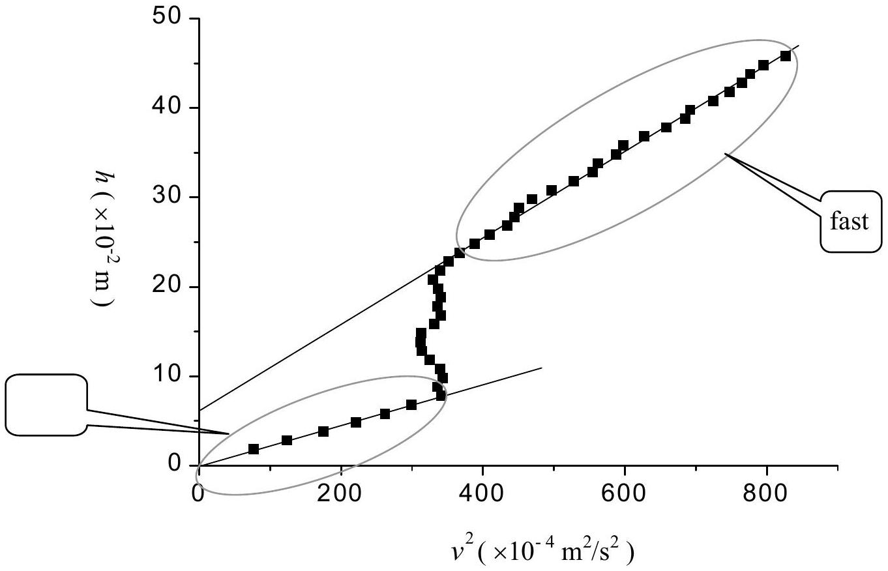
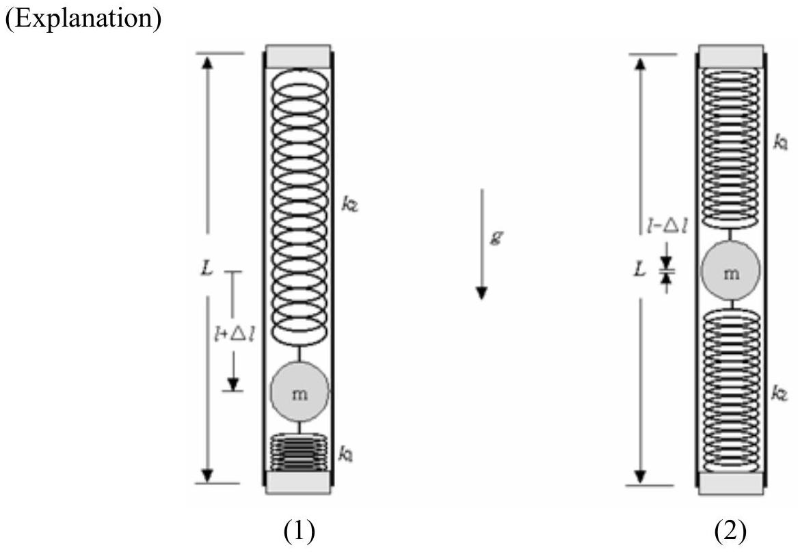

## Solutions

## PART-A Product of the mass and the position of the ball $( m \times l )$ (4.0 points)

1. Suggest and justify, by using equations, a method allowing to obtain $m \times l$. (2.0 points)
$$
m \times l = ( M + m ) \times l _ { \mathrm { cm } }
$$

(Explanation) The lever rule is applied to the Mechanical "Black Box", shown in Fig. A-1, once the position of the center of mass of the whole system is found.

Fig. A-1 Experimental setup

2. Experimentally determine the value of $m \times l$. (2.0 points)
$$
m \times l = 2.96 \times 10 ^ { - 3 } \mathrm {~kg} \cdot \mathrm {~m}
$$
(Explanation) The measured quantities are
$$
M + m = ( 1.411 \pm 0.0005 ) \times 10 ^ { - 1 } \mathrm {~kg}
$$
and
$$
l _ { \mathrm { cm } } = ( 2.1 \pm 0.06 ) \times 10 ^ { - 2 } \mathrm {~m} \quad \text { or } \quad 21 \pm 0.6 \mathrm {~mm} .
$$
Therefore
$$
\begin{aligned}
m \times l & = ( M + m ) \times l _ { \mathrm { cm } } \\
& = ( 1.411 \pm 0.0005 ) \times 10 ^ { - 1 } \mathrm {~kg} \times ( 2.1 \pm 0.06 ) \times 10 ^ { - 2 } \mathrm {~m} \\
& = ( 2.96 \pm 0.08 ) \times 10 ^ { - 3 } \mathrm {~kg} \cdot \mathrm {~m}
\end{aligned}
$$

## PART-B The mass $\boldsymbol { m }$ of the ball ( $\mathbf { 1 0 . 0 }$ points)

1. Measure $v$ for various values of $h$. Plot the data on a graph paper in a form that is suitable to find the value of $m$. Identify the slow rotation region and the fast rotation region on the graph. (4.0 points)
2. Show from your measurements that $h = C v ^ { 2 }$ in the slow rotation region, and $h =$ $A v ^ { 2 } + B$ in the fast rotation region. (1.0 points)

Fig. B-1 Experimental data

(Explanation) The measured data are

|  | $h _ { 1 } \left( \times 10 ^ { - 2 } \mathrm {~m} \right) ^ { \mathrm { a } ) }$ | $\Delta t ( \mathrm {~ms} )$ | $h \left( \times 10 ^ { - 2 } \mathrm {~m} \right) ^ { \mathrm { b } ) }$ | $v \left( \times 10 ^ { - 2 } \mathrm {~m} / \mathrm { s } \right) ^ { \mathrm { c } ) }$ | $v ^ { 2 } \left( \times 10 ^ { - 4 } \mathrm {~m} ^ { 2 } / \mathrm { s } ^ { 2 } \right)$ |
| :--- | :--- | :--- | :--- | :--- | :--- |
| 1 | $25.5 \pm 0.1$ | $269.4 \pm 0.05$ | $1.8 \pm 0.1$ | $8.75 \pm 0.02$ | $76.6 \pm 0.2$ |
| 2 | 26.5±0.1 | $235.7 \pm 0.05$ | $2.8 \pm 0.1$ | $11.12 \pm 0.02$ | $123.7 \pm 0.3$ |
| 3 | $27.5 \pm 0.1$ | $197.9 \pm 0.05$ | $3.8 \pm 0.1$ | $13.24 \pm 0.03$ | $175.3 \pm 0.6$ |
| 4 | $28.5 \pm 0.1$ | $176.0 \pm 0.05$ | $4.8 \pm 0.1$ | $14.89 \pm 0.03$ | 221.7±0.6 |
| 5 | $29.5 \pm 0.1$ | $161.8 \pm 0.05$ | $5.8 \pm 0.1$ | $16.19 \pm 0.03$ | $262.1 \pm 0.7$ |
| 6 | $30.5 \pm 0.1$ | $151.4 \pm 0.05$ | $6.8 \pm 0.1$ | $17.31 \pm 0.03$ | $299.6 \pm 0.7$ |
| 7 | $31.5 \pm 0.1$ | $141.8 \pm 0.05$ | $7.8 \pm 0.1$ | $18.48 \pm 0.04$ | $342 \pm 1$ |
| 8 | $32.5 \pm 0.1$ | $142.9 \pm 0.05$ | 8.8±0.1 | $18.33 \pm 0.04$ | $336 \pm 1$ |

| 9 | $33.5 \pm 0.1$ | $141.4 \pm 0.05$ | $9.8 \pm 0.1$ | $18.53 \pm 0.04$ | $343 \pm 1$ |
| :--- | :--- | :--- | :--- | :--- | :--- |
| 10 | $34.5 \pm 0.1$ | $142.2 \pm 0.05$ | $10.8 \pm 0.1$ | $18.42 \pm 0.04$ | $339 \pm 1$ |
| 11 | $35.5 \pm 0.1$ | $145.4 \pm 0.05$ | $11.8 \pm 0.1$ | $18.02 \pm 0.04$ | $325 \pm 1$ |
| 12 | $36.5 \pm 0.1$ | $147.8 \pm 0.05$ | $12.8 \pm 0.1$ | $17.73 \pm 0.04$ | $314 \pm 1$ |
| 13 | $37.5 \pm 0.1$ | $148.3 \pm 0.05$ | $13.8 \pm 0.1$ | $17.67 \pm 0.04$ | $312 \pm 1$ |
| 14 | $38.5 \pm 0.1$ | $148.0 \pm 0.05$ | $14.8 \pm 0.1$ | $17.70 \pm 0.04$ | $313 \pm 1$ |
| 15 | $39.5 \pm 0.1$ | $143.9 \pm 0.05$ | $15.8 \pm 0.1$ | $18.21 \pm 0.04$ | $332 \pm 1$ |
| 16 | $40.5 \pm 0.1$ | $141.9 \pm 0.05$ | $16.8 \pm 0.1$ | $18.46 \pm 0.04$ | $341 \pm 1$ |
| 17 | $41.5 \pm 0.1$ | $142.9 \pm 0.05$ | $17.8 \pm 0.1$ | $18.33 \pm 0.04$ | $336 \pm 1$ |
| 18 | $42.5 \pm 0.1$ | $141.9 \pm 0.05$ | $18.8 \pm 0.1$ | $18.46 \pm 0.04$ | $341 \pm 1$ |
| 19 | $43.5 \pm 0.1$ | $142.8 \pm 0.05$ | $19.8 \pm 0.1$ | $18.35 \pm 0.04$ | $337 \pm 1$ |
| 20 | $44.5 \pm 0.1$ | $144.3 \pm 0.05$ | $20.8 \pm 0.1$ | $18.16 \pm 0.04$ | $330 \pm 1$ |
| 21 | $45.5 \pm 0.1$ | $142.2 \pm 0.05$ | $21.8 \pm 0.1$ | $18.42 \pm 0.04$ | $339 \pm 1$ |
| 22 | $46.5 \pm 0.1$ | $139.8 \pm 0.05$ | $22.8 \pm 0.1$ | $18.74 \pm 0.04$ | $351 \pm 1$ |
| 23 | $47.5 \pm 0.1$ | $136.7 \pm 0.05$ | $23.8 \pm 0.1$ | $19.17 \pm 0.04$ | $368 \pm 1$ |
| 24 | $48.5 \pm 0.1$ | $133.0 \pm 0.05$ | $24.8 \pm 0.1$ | $19.70 \pm 0.04$ | $388 \pm 1$ |
| 25 | $49.5 \pm 0.1$ | $129.5 \pm 0.05$ | $25.8 \pm 0.1$ | $20.23 \pm 0.04$ | $409 \pm 1$ |
| 26 | $50.5 \pm 0.1$ | $125.7 \pm 0.05$ | $26.8 \pm 0.1$ | $20.84 \pm 0.04$ | $434 \pm 1$ |
| 27 | $51.5 \pm 0.1$ | $124.3 \pm 0.05$ | $27.8 \pm 0.1$ | 21.08±0.04 | $444 \pm 1$ |
| 28 | $52.5 \pm 0.1$ | $123.4 \pm 0.05$ | $28.8 \pm 0.1$ | $21.23 \pm 0.04$ | $451 \pm 1$ |
| 29 | $53.5 \pm 0.1$ | $120.9 \pm 0.05$ | $29.8 \pm 0.1$ | $21.67 \pm 0.04$ | $470 \pm 1$ |
| 30 | $54.5 \pm 0.1$ | $117.5 \pm 0.05$ | $30.8 \pm 0.1$ | $22.30 \pm 0.04$ | $497 \pm 1$ |
| 31 | $55.5 \pm 0.1$ | $114.0 \pm 0.05$ | $31.8 \pm 0.1$ | $22.98 \pm 0.04$ | $528 \pm 1$ |
| 32 | $56.5 \pm 0.1$ | $111.2 \pm 0.05$ | $32.8 \pm 0.1$ | $23.56 \pm 0.05$ | $555 \pm 2$ |
| 33 | $57.5 \pm 0.1$ | $110.5 \pm 0.05$ | $33.8 \pm 0.1$ | $23.71 \pm 0.05$ | $562 \pm 2$ |
| 34 | $58.5 \pm 0.1$ | $108.1 \pm 0.05$ | $34.8 \pm 0.1$ | $24.24 \pm 0.05$ | 588±2 |
| 35 | $59.5 \pm 0.1$ | $107.1 \pm 0.05$ | $35.8 \pm 0.1$ | $24.46 \pm 0.05$ | $598 \pm 2$ |
| 36 | $60.5 \pm 0.1$ | $104.6 \pm 0.05$ | $36.8 \pm 0.1$ | $25.05 \pm 0.05$ | $628 \pm 2$ |
| 37 | $61.5 \pm 0.1$ | $102.1 \pm 0.05$ | $37.8 \pm 0.1$ | $25.66 \pm 0.05$ | $658 \pm 2$ |
| 38 | $62.5 \pm 0.1$ | $100.1 \pm 0.05$ | $38.8 \pm 0.1$ | $26.17 \pm 0.05$ | $685 \pm 2$ |
| 39 | $63.5 \pm 0.1$ | $99.6 \pm 0.05$ | $39.8 \pm 0.1$ | $26.31 \pm 0.05$ | $692 \pm 2$ |
| 40 | $64.5 \pm 0.1$ | $97.3 \pm 0.05$ | $40.8 \pm 0.1$ | $26.93 \pm 0.05$ | $725 \pm 2$ |
| 41 | $65.5 \pm 0.1$ | $95.8 \pm 0.05$ | $41.8 \pm 0.1$ | $27.35 \pm 0.05$ | $748 \pm 2$ |
| 42 | $66.5 \pm 0.1$ | $94.7 \pm 0.05$ | $42.8 \pm 0.1$ | $27.67 \pm 0.05$ | $766 \pm 2$ |
| 43 | $67.5 \pm 0.1$ | 94.0±0.05 | $43.8 \pm 0.1$ | $27.87 \pm 0.06$ | $777 \pm 2$ |
| 44 | $68.5 \pm 0.1$ | $92.9 \pm 0.05$ | $44.8 \pm 0.1$ | $28.20 \pm 0.06$ | $795 \pm 2$ |
| 45 | $69.5 \pm 0.1$ | $91.1 \pm 0.05$ | $45.8 \pm 0.1$ | $28.76 \pm 0.06$ | $827 \pm 2$ |

where $\quad { } ^ { \mathrm { a } ) } h _ { 1 }$ is the reading of the top position of the weight before it starts to fall,

${ } ^ { \text {b) } } h$ is the distance of fall of the weight which is obtained by $h = h _ { 1 } - h _ { 2 } + d / 2$, $h _ { 2 } \left( = ( 25 \pm 0.05 ) \times 10 ^ { - 2 } \mathrm {~m} \right)$ is the top position of the weight at the start of blocking of the photogate, $d \left( = ( 2.62 \pm 0.005 ) \times 10 ^ { - 2 } \mathrm {~m} \right)$ is the length of the weight, and
${ } ^ { \mathrm { c } ) } v$ is obtained from $v = d / \Delta t$.
3. Relate the coefficient $C$ to the parameters of the MBB. (1.0 points)

$$
h = C v ^ { 2 } , \text { where } C = \left\{ m _ { \mathrm { o } } + I / R ^ { 2 } + m \left( l ^ { 2 } + 2 / 5 r ^ { 2 } \right) / R ^ { 2 } \right\} / 2 m _ { \mathrm { o } } g
$$

(Explanation) The ball is at static equilibrium ( $x = l$ ). When the speed of the weight is $v$, the increase in kinetic energy of the whole system is given by

$$
\begin{aligned}
\Delta K & = 1 / 2 m _ { \mathrm { o } } v ^ { 2 } + 1 / 2 I \omega ^ { 2 } + 1 / 2 m \left( l ^ { 2 } + 2 / 5 r ^ { 2 } \right) \omega ^ { 2 } \\
& = 1 / 2 \left\{ m _ { \mathrm { o } } + I / R ^ { 2 } + m \left( l ^ { 2 } + 2 / 5 r ^ { 2 } \right) / R ^ { 2 } \right\} v ^ { 2 } ,
\end{aligned}
$$

where $\omega ( = v / R )$ is the angular velocity of the Mechanical "Black Box" and $I$ is the effective moment of inertia of the whole system except the ball. Since the decrease in gravitational potential energy of the weight is

$$
\Delta U = - m _ { \mathrm { o } } g h ,
$$

the energy conservation ( $\Delta K + \Delta U = 0$ ) gives

$$
\begin{aligned}
h & = 1 / 2 \left\{ m _ { \mathrm { o } } + I / R ^ { 2 } + m \left( l ^ { 2 } + 2 / 5 r ^ { 2 } \right) / \mathrm { R } ^ { 2 } \right\} v ^ { 2 } / m _ { \mathrm { o } } g \\
& = C v ^ { 2 } , \quad \text { where } C = \left\{ m _ { \mathrm { o } } + I / R ^ { 2 } + m \left( l ^ { 2 } + 2 / 5 r ^ { 2 } \right) / \mathrm { R } ^ { 2 } \right\} / 2 m _ { \mathrm { o } } g
\end{aligned}
$$

4. Relate the coefficients $A$ and $B$ to the parameters of the MBB. (1.0 points)

$$
\begin{aligned}
& h = A v ^ { 2 } + B , \text { where } A = \left[ m _ { \mathrm { o } } + I / R ^ { 2 } + m \left\{ ( L / 2 - \delta - r ) ^ { 2 } + 2 / 5 r ^ { 2 } \right\} / R ^ { 2 } \right] / 2 m _ { \mathrm { o } } g \\
& \text { and } B = \left[ - k _ { 1 } ( L / 2 - l - \delta - r ) ^ { 2 } \right. \\
& \left. \quad \quad + k _ { 2 } \left\{ ( L - 2 \delta - 2 r ) ^ { 2 } - ( L / 2 + l - \delta - r ) ^ { 2 } \right\} \right] / 2 m _ { \mathrm { o } } g
\end{aligned}
$$

(Explanation) The ball stays at the end cap of the tube ( $x = L / 2 - \delta - r$ ). When the speed of the weight is $v$, the increase in kinetic energy of the whole system is given by

$$
K = 1 / 2 \left[ m _ { \mathrm { o } } + I / R ^ { 2 } + m \left\{ ( L / 2 - \delta - r ) ^ { 2 } + 2 / 5 r ^ { 2 } \right\} / R ^ { 2 } \right] v ^ { 2 } .
$$

Since the increase in elastic potential energy of the springs is

$$
\begin{aligned}
\Delta U _ { \mathrm { e } } = 1 / 2 [ & - k _ { 1 } ( L / 2 - l - \delta - r ) ^ { 2 } \\
& \left. + k _ { 2 } \left\{ ( L - 2 \delta - 2 r ) ^ { 2 } - ( L / 2 + l - \delta - r ) ^ { 2 } \right\} \right] ,
\end{aligned}
$$

the energy conservation ( $K + \Delta U + \Delta U _ { \mathrm { e } } = 0$ ) gives

$$
\begin{aligned}
& h = 1 / 2 \left[ m _ { \mathrm { o } } + I / R ^ { 2 } + m \left\{ ( L / 2 - \delta - r ) ^ { 2 } + 2 / 5 r ^ { 2 } \right\} / R ^ { 2 } \right] v ^ { 2 } / m _ { \mathrm { o } } g + \Delta U _ { \mathrm { e } } / m _ { \mathrm { o } } g \\
& = A v ^ { 2 } + B
\end{aligned}
$$

where

$$
A = \left[ m _ { \mathrm { o } } + I / R ^ { 2 } + m \left\{ ( L / 2 - \delta - r ) ^ { 2 } + 2 / 5 r ^ { 2 } \right\} / R ^ { 2 } \right] / 2 m _ { \mathrm { o } } g
$$

and

$$
\begin{aligned}
B = & { \left[ - k _ { 1 } ( L / 2 - l - \delta - r ) ^ { 2 } \right.} \\
& \left. + k _ { 2 } \left\{ ( L - 2 \delta - 2 r ) ^ { 2 } - ( L / 2 + l - \delta - r ) ^ { 2 } \right\} \right] / 2 m _ { \circ } g .
\end{aligned}
$$

5. Determine the value of $m$ from your measurements and the results obtained in PART-A. (3.0 points)

$$
m = 6.2 \times 10 ^ { - 2 } \mathrm {~kg}
$$

(Explanation) From the results obtained in PART-B 3 and 4 we get

$$
A - C = \frac { m } { 2 g m _ { o } R ^ { 2 } } \left\{ ( L / 2 - \delta - r ) ^ { 2 } - l ^ { 2 } \right\} .
$$

The measured values are

$$
\begin{aligned}
& L = ( 40.0 \pm 0.05 ) \times 10 ^ { - 2 } \mathrm {~m} \\
& m _ { \mathrm { o } } = ( 100.4 \pm 0.05 ) \times 10 ^ { - 3 } \mathrm {~kg} \\
& 2 R = ( 3.91 \pm 0.005 ) \times 10 ^ { - 2 } \mathrm {~m}
\end{aligned}
$$

Therefore,

$$
( L / 2 - \delta - r ) ^ { 2 } = \{ ( 20.0 \pm 0.03 ) - 0.5 - 1.1 \} ^ { 2 } \times 10 ^ { - 4 } \mathrm {~m} ^ { 2 } = ( 338.6 \pm 0.8 ) \times 10 ^ { - 4 } \mathrm {~m} ^ { 2 }
$$

and

$$
\begin{aligned}
2 g m _ { \mathrm { o } } R ^ { 2 } & = 2 \times 980 \times ( 100.4 \pm 0.05 ) \times ( 1.955 \pm 0.003 ) ^ { 2 } \times 10 ^ { - 6 } \mathrm {~kg} \cdot \mathrm {~m} ^ { 3 } / \mathrm { s } ^ { 2 } \\
& = ( 752 \pm 2 ) \times 10 ^ { - 6 } \mathrm {~kg} \cdot \mathrm {~m} ^ { 3 } / \mathrm { s } ^ { 2 }
\end{aligned}
$$

The slopes of the two straight lines in the graph (Fig. B-1) of PART-B 1 are

$$
A = 5.0 \pm 0.1 \mathrm {~s} ^ { 2 } / \mathrm { m } \quad \text { and } \quad C = 2.4 \pm 0.1 \mathrm {~s} ^ { 2 } / \mathrm { m } \text {, }
$$

respectively, and

$$
A - C = 2.6 \pm 0.1 \mathrm {~s} ^ { 2 } / \mathrm { m } .
$$

Since we already obtained $m \times l = ( M + m ) \times l _ { \mathrm { cm } } = 2.96 \times 10 ^ { - 3 } \mathrm {~kg} \cdot \mathrm {~m}$ from PART-A, the equation

$$
( 338.6 \pm 0.8 ) m ^ { 2 } - ( 752 \pm 2 ) \times 10 ^ { 3 } \times ( 0.026 \pm 0.001 ) m - ( 296 \pm 8 ) ^ { 2 } = 0
$$

or

$$
( 338.6 \pm 0.8 ) m ^ { 2 } - ( 19600 \pm 800 ) m - ( 88000 \pm 3000 ) = 0
$$

is resulted, where $m$ is expressed in the unit of g.
The roots of this equation are

$$
m = \frac { ( 9800 \pm 400 ) \pm \sqrt { ( 9800 \pm 400 ) ^ { 2 } + ( 338.6 \pm 0.8 ) \times ( 88000 \pm 3000 ) } } { ( 338.6 \pm 0.8 ) } .
$$

The physically meaningful positive root is

$$
m = \frac { ( 9800 \pm 400 ) + \sqrt { ( 126000000 \pm 6000000 ) } } { ( 338.6 \pm 0.8 ) } = ( 62 \pm 2 ) \mathrm { g } = ( 6.2 \pm 0.2 ) \times 10 ^ { - 2 } \mathrm {~kg} .
$$

## PART-C The spring constants $\boldsymbol { k } _ { \mathbf { 1 } }$ and $\boldsymbol { k } _ { \mathbf { 2 } }$ (6.0 points)

1. Measure the periods $T _ { 1 }$ and $T _ { 2 }$ of small oscillation shown in Figs. 3 (1) and (2) and write down their values, respectively. (1.0 points)
$$
T _ { 1 } = 1.1090 \mathrm {~s} \quad \text { and } \quad T _ { 2 } = 1.0193 \mathrm {~s}
$$

Fig. C-1 Small oscillation experimental set up

The measured periods are

|  | $T _ { 1 } ( \mathrm {~s} )$ |  | $T _ { 2 } ( \mathrm {~s} )$ |
| :--- | :--- | :--- | :--- |
| 1 | $1.1085 \pm 0.00005$ | 1 | $1.0194 \pm 0.00005$ |
| 2 | $1.1092 \pm 0.00005$ | 2 | $1.0194 \pm 0.00005$ |
| 3 | $1.1089 \pm 0.00005$ | 3 | $1.0193 \pm 0.00005$ |
| 4 | $1.1085 \pm 0.00005$ | 4 | $1.0191 \pm 0.00005$ |
| 5 | $1.1094 \pm 0.00005$ | 5 | $1.0192 \pm 0.00005$ |
| 6 | $1.1090 \pm 0.00005$ | 6 | $1.0194 \pm 0.00005$ |
| 7 | $1.1088 \pm 0.00005$ | 7 | $1.0194 \pm 0.00005$ |
| 8 | $1.1090 \pm 0.00005$ | 8 | $1.0191 \pm 0.00005$ |
| 9 | $1.1092 \pm 0.00005$ | 9 | $1.0192 \pm 0.00005$ |
| 10 | $1.1094 \pm 0.00005$ | 10 | $1.0193 \pm 0.00005$ |

By averaging the 10 measurements for each configuration, respectively, we get

$$
T _ { 1 } = 1.1090 \pm 0.0003 \mathrm {~s} \quad \text { and } \quad T _ { 2 } = 1.0193 \pm 0.0001 \mathrm {~s} .
$$

2. Explain, by using equations, why the angular frequencies $\omega _ { 1 }$ and $\omega _ { 2 }$ of small oscillation of the configurations are different. (1.0 points)

$$
\begin{aligned}
& \omega _ { 1 } = \sqrt { \frac { M g L / 2 + m g ( L / 2 + l + \Delta l ) } { I _ { o } + m \left\{ ( L / 2 + l + \Delta l ) ^ { 2 } + \frac { 2 } { 5 } r ^ { 2 } \right\} } } \\
& \omega _ { 2 } = \sqrt { \frac { M g L / 2 + m g ( L / 2 - l + \Delta l ) } { I _ { o } + m \left\{ ( L / 2 - l + \Delta l ) ^ { 2 } + \frac { 2 } { 5 } r ^ { 2 } \right\} } }
\end{aligned}
$$

(Explanation) The moment of inertia of the Mechanical "Black Box" with respect to the pivot at the top of the tube is

$$
I _ { 1 } = I _ { o } + m \left\{ ( L / 2 + l + \Delta l ) ^ { 2 } + \frac { 2 } { 5 } r ^ { 2 } \right\} \quad \text { or } \quad I _ { 2 } = I _ { o } + m \left\{ ( L / 2 - l + \Delta l ) ^ { 2 } + \frac { 2 } { 5 } r ^ { 2 } \right\}
$$

depending on the orientation of the MBB as shown in Figs. C-1(1) and (2), respectively.
When the MBB is slightly tilted by an angle $\theta$ from vertical, the torque applied by the gravity is

$$
\tau _ { 1 } = M g ( L / 2 ) \sin \theta + m g ( L / 2 + l + \Delta l ) \sin \theta \approx \{ M g ( L / 2 ) + m g ( L / 2 + l + \Delta l ) \} \theta
$$

or

$$
\tau _ { 2 } = M g ( L / 2 ) \sin \theta + m g ( L / 2 - l + \Delta l ) \sin \theta \approx \{ M g ( L / 2 ) + m g ( L / 2 - l + \Delta l ) \}
$$

depending on the orientation.
Therefore, the angular frequencies of oscillation become

$$
\omega _ { 1 } = \sqrt { \frac { \tau _ { 1 } / \theta } { I _ { 1 } } } = \sqrt { \frac { M g L / 2 + m g ( L / 2 + l + \Delta l ) } { I _ { o } + m \left\{ ( L / 2 + l + \Delta l ) ^ { 2 } + \frac { 2 } { 5 } r ^ { 2 } \right\} } }
$$

and

$$
\omega _ { 2 } = \sqrt { \frac { \tau _ { 2 } / \theta } { I _ { 2 } } } = \sqrt { \frac { M g L / 2 + m g ( L / 2 - l + \Delta l ) } { I _ { o } + m \left\{ ( L / 2 - l + \Delta l ) ^ { 2 } + \frac { 2 } { 5 } r ^ { 2 } \right\} } } .
$$

3. Evaluate $\Delta l$ by eliminating $I _ { \mathrm { o } }$ from the previous results. (1.0 points)

$$
\Delta l = ( 7.2 \pm 0.9 ) \mathrm { cm } = ( 7.2 \pm 0.9 ) \times 10 ^ { - 2 } \mathrm {~m}
$$

(Explanation) By rewriting the two expressions for the angular frequencies $\omega _ { 1 }$ and $\omega _ { 2 }$ as

$$
\operatorname { Mg } L / 2 + m g ( L / 2 + l + \Delta l ) = I _ { o } \omega _ { 1 } ^ { 2 } + m \omega _ { 1 } ^ { 2 } \left\{ ( L / 2 + l + \Delta l ) ^ { 2 } + \frac { 2 } { 5 } r ^ { 2 } \right\}
$$

and

$$
\operatorname { Mg } L / 2 + m g ( L / 2 - l + \Delta l ) = I _ { o } \omega _ { 2 } ^ { 2 } + m \omega _ { 2 } ^ { 2 } \left\{ ( L / 2 - l + \Delta l ) ^ { 2 } + \frac { 2 } { 5 } r ^ { 2 } \right\}
$$

one can eliminate the unknown moment of inertia $I _ { \mathrm { o } }$ of the MBB without the ball. By eliminating the $I _ { \mathrm { o } }$ one gets the equation for $\Delta l$

$$
\left( \omega _ { 2 } ^ { 2 } - \omega _ { 1 } ^ { 2 } \right) \left\{ \frac { ( M + m ) g L } { 2 } + m g \Delta l \right\} + \left( \omega _ { 1 } ^ { 2 } + \omega _ { 2 } ^ { 2 } \right) m g l = \omega _ { 1 } ^ { 2 } \omega _ { 2 } ^ { 2 } m ( L + 2 \Delta l ) ( 2 l ) .
$$

From the measured or given values we get,

$$
\begin{aligned}
\left( \omega _ { 2 } ^ { 2 } - \omega _ { 1 } ^ { 2 } \right) & = \left\{ \left( \frac { 2 \pi } { T _ { 2 } } \right) ^ { 2 } - \left( \frac { 2 \pi } { T _ { 1 } } \right) ^ { 2 } \right\} = \left( \frac { 6.2832 } { 1.0193 \pm 0.0001 } \right) ^ { 2 } - \left( \frac { 6.2832 } { 1.1090 \pm 0.0003 } \right) ^ { 2 } \\
& = 5.90 \pm 0.01 \mathrm {~s} ^ { - 2 }
\end{aligned}
$$

$$
\frac { ( M + m ) g L } { 2 } = \frac { ( 141.1 \pm 0.05 ) \times 980 \times ( 40.0 \pm 0.05 ) } { 2 } = ( 27.66 \pm 0.04 ) \times 10 ^ { - 2 } \mathrm {~kg} \cdot \mathrm {~m} ^ { 2 } / \mathrm { s } ^ { 2 }
$$

$$
\begin{aligned}
\left( \omega _ { 1 } ^ { 2 } + \omega _ { 2 } ^ { 2 } \right) m g l & = \left\{ \left( \frac { 2 \pi } { T _ { 1 } } \right) ^ { 2 } + \left( \frac { 2 \pi } { T _ { 2 } } \right) ^ { 2 } \right\} ( M + m ) l _ { c m } g \\
& = \left\{ \left( \frac { 6.2832 } { 1.1090 \pm 0.0003 } \right) ^ { 2 } + \left( \frac { 6.2832 } { 1.0193 \pm 0.0001 } \right) ^ { 2 } \right\} \times ( 296 \pm 8 ) \times 980
\end{aligned}
$$

$$
= ( 203 \pm 5 ) \times 10 ^ { - 2 } \mathrm {~kg} \cdot \mathrm {~m} ^ { 2 } / \mathrm { s } ^ { 4 }
$$

$$
\begin{aligned}
\omega _ { 1 } ^ { 2 } \omega _ { 2 } ^ { 2 } m l & = \left( \frac { 2 \pi } { T _ { 1 } } \right) ^ { 2 } \left( \frac { 2 \pi } { T _ { 2 } } \right) ^ { 2 } ( M + m ) l _ { c m } \\
& = \left( \frac { 6.2832 } { 1.1090 \pm 0.0003 } \right) ^ { 2 } \left( \frac { 6.2832 } { 1.0193 \pm 0.0001 } \right) ^ { 2 } \times ( 296 \pm 8 ) \\
& = ( 3.6 \pm 0.1 ) \mathrm { kg } \cdot \mathrm {~m} / \mathrm { s } ^ { 4 } .
\end{aligned}
$$

Therefore, the equation we obtained in PART-C 3 becomes

$$
\begin{aligned}
& ( 5.90 \pm 0.01 ) \left\{ ( 27.66 \pm 0.04 ) \times 10 ^ { 5 } + ( 62 \pm 2 ) \times 980 \times \Delta l \right\} + ( 203 \pm 5 ) \times 10 ^ { 5 } \\
& \quad = ( 7.2 \pm 0.2 ) \times 10 ^ { 5 } \times \{ ( 40.0 \pm 0.05 ) + 2 \Delta l \} ,
\end{aligned}
$$

where $\Delta l$ is expressed in the unit of cm. By solving the equation we get

$$
\Delta l = ( 7.2 \pm 0.9 ) \mathrm { cm } = ( 7.2 \pm 0.9 ) \times 10 ^ { - 2 } \mathrm {~m}
$$

4. Write down the value of the effective total spring constant $k$ of the two-spring system. (2.0 points)
$$
k = 9 \mathrm {~N} / \mathrm { m }
$$
(Explanation) The effective total spring constant is
$$
k \equiv \frac { m g } { \Delta l } = \frac { ( 62 \pm 2 ) \times 980 } { 7.2 \pm 0.9 } = 9000 \pm 1000 \mathrm { dyne } / \mathrm { cm } \quad \text { or } \quad 9 \pm 1 \mathrm {~N} / \mathrm { m } .
$$
5. Obtain the respective values of $k _ { 1 }$ and $k _ { 2 }$. Write down their values. (1.0 point)
$$
\begin{aligned}
& k _ { 1 } = 5.7 \mathrm {~N} / \mathrm { m } \\
& k _ { 2 } = 3 \mathrm {~N} / \mathrm { m }
\end{aligned}
$$

(Explanation) When the MBB is in equilibrium on a horizontal plane the force balance condition for the ball is that

$$
\frac { L / 2 - l - \delta - r } { L / 2 + l - \delta - r } = \frac { N _ { 1 } } { N _ { 2 } } = \frac { k _ { 2 } } { k _ { 1 } } .
$$

Since $k = k _ { 1 } + k _ { 2 }$, we get

$$
k _ { 1 } = \frac { k } { \frac { L / 2 - l - \delta - r } { L / 2 + l - \delta - r } + 1 } = \frac { L / 2 + l - \delta - r } { L - 2 \delta - 2 r } k
$$

and

$$
k _ { 2 } = k - k _ { 1 } = \frac { L / 2 - l - \delta - r } { L - 2 \delta - 2 r } k .
$$

From the measured or given values

$$
\frac { L / 2 + l - \delta - r } { L - 2 \delta - 2 r } = \frac { ( 20.0 \pm 0.03 ) + \left( \frac { 296 \pm 8 } { 62 \pm 2 } \right) - 0.5 - 1.1 } { ( 40.0 \pm 0.05 ) - 1.0 - 2.2 } = 0.63 \pm 0.005 .
$$

Therefore,

$$
k _ { 1 } = ( 0.63 \pm 0.005 ) \times ( 9000 \pm 1000 ) = 5700 \pm 600 \mathrm { dyne } / \mathrm { cm } \quad \text { or } \quad 5.7 \pm 0.6 \mathrm {~N} / \mathrm { m } ,
$$

and

$$
k _ { 2 } = ( 9000 \pm 1000 ) - ( 5700 \pm 600 ) = 3000 \pm 1000 \text { dyne } / \mathrm { cm } \quad \text { or } \quad 3 \pm 1 \mathrm {~N} / \mathrm { m } .
$$
