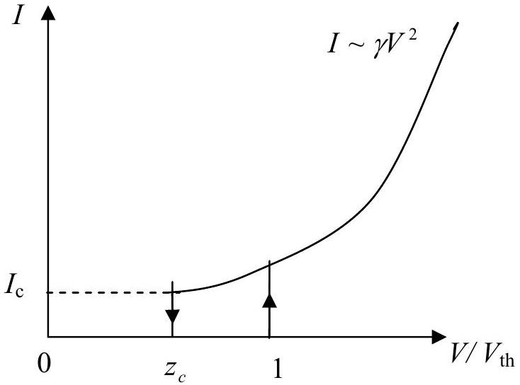
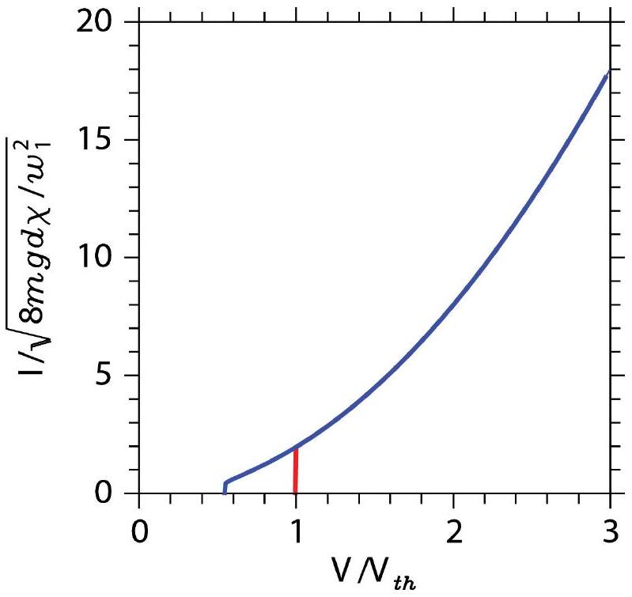

## Theoretical Question 1: Ping-Pong Resistor

1. Answers
(a) $F _ { \mathrm { R } } = - \frac { 1 } { 2 } \pi R ^ { 2 } \varepsilon _ { 0 } \frac { V ^ { 2 } } { d ^ { 2 } }$
(b) $\chi = - \varepsilon _ { 0 } \frac { \pi r ^ { 2 } } { d }$
(c) $V _ { \text {th } } = \sqrt { \frac { 2 m g d } { \chi } }$
(d) $\mathrm { v } _ { \mathrm { s } } = \sqrt { \alpha V ^ { 2 } + \beta }$
$$
\alpha = \left( \frac { \eta ^ { 2 } } { 1 - \eta ^ { 2 } } \right) \left( \frac { 2 \chi } { m } \right) , \quad \beta = \left( \frac { \eta ^ { 2 } } { 1 + \eta ^ { 2 } } \right) ( 2 g d )
$$
(e) $\quad \gamma = \sqrt { \frac { 1 + \eta } { 1 - \eta } } \sqrt { \frac { \chi ^ { 3 } } { 2 m d ^ { 2 } } }$
(f) $V _ { c } = \sqrt { \frac { 1 - \eta ^ { 2 } } { 1 + \eta ^ { 2 } } } \sqrt { \frac { m g d } { \chi } } , \quad I _ { c } = \frac { 2 \eta \sqrt { 1 - \eta ^ { 2 } } } { ( 1 + \eta ) \left( 1 + \eta ^ { 2 } \right) } g \sqrt { m \chi }$

## 2. Solutions

(a) [1.2 points]

The charge $Q$ induced by the external bias voltage $V$ can be obtained by applying the Gauss law:

$$
\begin{gather*}
\varepsilon _ { 0 } \oint \vec { E } \cdot d \vec { s } = Q  \tag{a1}\\
Q = \varepsilon _ { 0 } E \cdot \left( \pi R ^ { 2 } \right) = \varepsilon _ { 0 } \left( \frac { V } { d } \right) \cdot \left( \pi R ^ { 2 } \right) \tag{a2}
\end{gather*}
$$

where $\quad V = E d$.
The energy stored in the capacitor:

$$
\begin{equation*}
U = \int _ { 0 } ^ { V } Q \left( V ^ { \prime } \right) d V ^ { \prime } = \int _ { 0 } ^ { V } \varepsilon _ { 0 } \pi R ^ { 2 } \left( \frac { V ^ { \prime } } { d } \right) d V ^ { \prime } = \frac { 1 } { 2 } \varepsilon _ { 0 } \pi R ^ { 2 } \frac { V ^ { 2 } } { d } . \tag{a3}
\end{equation*}
$$

The force acting on the plate, when the bias voltage $V$ is kept constant:

$$
\begin{equation*}
\therefore F _ { \mathrm { R } } = + \frac { \partial U } { \partial d } = - \frac { 1 } { 2 } \varepsilon _ { 0 } \pi R ^ { 2 } \frac { V ^ { 2 } } { d ^ { 2 } } . \tag{a4}
\end{equation*}
$$

[An alternative solution:]
Since the electric field $E ^ { \prime }$ acting on one plate should be generated by the other plate and its magnitude is

$$
\begin{equation*}
E ^ { \prime } = \frac { 1 } { 2 } E = \frac { V } { 2 d } , \tag{a5}
\end{equation*}
$$

the force acting on the plate can be obtained by

$$
\begin{equation*}
F _ { \mathrm { R } } = Q E ^ { \prime } . \tag{a6}
\end{equation*}
$$

(b) [0.8 points]

The charge $q$ on the small disk can also be calculated by applying the Gauss law:

$$
\begin{equation*}
\varepsilon _ { 0 } \oint \vec { E } \cdot d \vec { s } = q \tag{b1}
\end{equation*}
$$

Since one side of the small disk is in contact with the plate,

$$
\begin{equation*}
q = - \varepsilon _ { 0 } E \cdot \left( \pi r ^ { 2 } \right) = - \varepsilon _ { 0 } \frac { \pi r ^ { 2 } } { d } V = \chi V . \tag{b2}
\end{equation*}
$$

Alternatively, one may use the area ratio for $q = - \left( \frac { \pi r ^ { 2 } } { \pi R ^ { 2 } } \right) Q$.

$$
\begin{equation*}
\therefore \chi = - \varepsilon _ { 0 } \frac { \pi r ^ { 2 } } { d } . \tag{b3}
\end{equation*}
$$

(c) [0.5 points]

The net force, $F _ { \text {net } }$, acting on the small disk should be a sum of the gravitational and electrostatic forces:

$$
\begin{equation*}
F _ { \mathrm { net } } = F _ { \mathrm { g } } + F _ { \mathrm { e } } . \tag{c1}
\end{equation*}
$$

The gravitational force: $F _ { \mathrm { g } } = - m g$.
The electrostatic force can be derived from the result of (a) above:

$$
\begin{equation*}
F _ { \mathrm { e } } = \frac { 1 } { 2 } \varepsilon _ { 0 } \frac { \pi r ^ { 2 } } { d ^ { 2 } } V ^ { 2 } = \frac { \chi } { 2 d } V ^ { 2 } . \tag{c2}
\end{equation*}
$$

In order for the disk to be lifted, one requires $F _ { \text {net } } > 0$ :

$$
\begin{align*}
& \frac { \chi } { 2 d } V ^ { 2 } - m g > 0  \tag{c3}\\
& \therefore V _ { \mathrm { th } } = \sqrt { \frac { 2 m g d } { \chi } } . \tag{c4}
\end{align*}
$$

(d) [2.3 points]

Let $\mathrm { v } _ { \mathrm { s } }$ be the steady velocity of the small disk just after its collision with the bottom plate. Then the steady-state kinetic energy $K _ { \mathrm { s } }$ of the disk just above the bottom plate is given by

$$
\begin{equation*}
K _ { \mathrm { s } } = \frac { 1 } { 2 } m \mathrm { v } _ { \mathrm { s } } ^ { 2 } . \tag{d1}
\end{equation*}
$$

For each round trip, the disk gains electrostatic energy by

$$
\begin{equation*}
\Delta U = 2 q V . \tag{d2}
\end{equation*}
$$

For each inelastic collision, the disk lose its kinetic energy by

$$
\begin{equation*}
\Delta K _ { \mathrm { loss } } = K _ { \mathrm { before } } - K _ { \mathrm { after } } = \left( 1 - \eta ^ { 2 } \right) K _ { \mathrm { before } } = \left( \frac { 1 } { \eta ^ { 2 } } - 1 \right) K _ { \mathrm { after } } . \tag{d3}
\end{equation*}
$$

Since $K _ { \mathrm { s } }$ is the energy after the collision at the bottom plate and $\left( K _ { \mathrm { s } } + q V - m g d \right)$ is

the energy before the collision at the top plate, the total energy loss during the round trip can be written in terms of $K _ { \mathrm { s } }$ :

$$
\begin{equation*}
\Delta K _ { \mathrm { tot } } = \left( \frac { 1 } { \eta ^ { 2 } } - 1 \right) K _ { \mathrm { s } } + \left( 1 - \eta ^ { 2 } \right) \left( K _ { \mathrm { s } } + q V - m g d \right) . \tag{d4}
\end{equation*}
$$

In its steady state, $\Delta U$ should be compensated by $\Delta K _ { \text {tot } }$.

$$
\begin{equation*}
2 q V = \left( \frac { 1 } { \eta ^ { 2 } } - 1 \right) K _ { \mathrm { s } } + \left( 1 - \eta ^ { 2 } \right) \left( K _ { \mathrm { s } } + q V - m g d \right) . \tag{d5}
\end{equation*}
$$

Rearranging Eq. (d5), we have

$$
\begin{align*}
K _ { \mathrm { s } } & = \frac { \eta ^ { 2 } } { 1 - \eta ^ { 4 } } \left[ \left( 1 + \eta ^ { 2 } \right) q V + \left( 1 - \eta ^ { 2 } \right) m g d \right] \\
& = \left( \frac { \eta ^ { 2 } } { 1 - \eta ^ { 2 } } \right) q V + \left( \frac { \eta ^ { 2 } } { 1 + \eta ^ { 2 } } \right) m g d  \tag{d6}\\
& = \frac { 1 } { 2 } m \mathrm { v } _ { \mathrm { s } } ^ { 2 } .
\end{align*}
$$

Therefore,

$$
\begin{equation*}
\mathrm { v } _ { \mathrm { s } } = \sqrt { \left( \frac { \eta ^ { 2 } } { 1 - \eta ^ { 2 } } \right) \left( \frac { 2 \chi V ^ { 2 } } { m } \right) + \left( \frac { \eta ^ { 2 } } { 1 + \eta ^ { 2 } } \right) ( 2 g d ) } . \tag{d7}
\end{equation*}
$$

Comparing with the form:

$$
\begin{align*}
& \mathrm { v } _ { \mathrm { s } } = \sqrt { \alpha V ^ { 2 } + \beta } ,  \tag{d8}\\
\alpha = & \left( \frac { \eta ^ { 2 } } { 1 - \eta ^ { 2 } } \right) \left( \frac { 2 \chi } { m } \right) , \quad \beta = \left( \frac { \eta ^ { 2 } } { 1 + \eta ^ { 2 } } \right) ( 2 g d ) . \tag{d9}
\end{align*}
$$

[An alternative solution:]
Let $\mathrm { v } _ { n }$ be the velocity of the small disk just after $n$-th collision with the bottom plate. Then the kinetic energy of the disk just above the bottom plate is given by

$$
\begin{equation*}
K _ { n } = \frac { 1 } { 2 } m \mathrm { v } _ { n } ^ { 2 } . \tag{d10}
\end{equation*}
$$

When it reaches the top plate, the disk gains energy by the increase of potential energy:

$$
\begin{equation*}
\Delta U _ { \text {up } } = q V - m g d . \tag{d11}
\end{equation*}
$$

Thus, the kinetic energy just before its collision with the top plate becomes

$$
\begin{equation*}
K _ { n - \text { up } } = \frac { 1 } { 2 } m \mathrm { v } _ { \text {up } } ^ { 2 } = K _ { n } + \Delta U _ { \text {up } } . \tag{d12}
\end{equation*}
$$

Since $\eta = \mathrm { v } _ { \text {after } } / \mathrm { v } _ { \text {before } }$, the kinetic energy after the collision with the top plate becomes scaled down by a factor of $\eta ^ { 2 }$ :

$$
\begin{equation*}
K _ { n - \text { up } } ^ { \prime } = \eta ^ { 2 } \cdot K _ { n - \text { up } } . \tag{d13}
\end{equation*}
$$

Now the potential energy gain by the downward motion is:

$$
\begin{equation*}
\Delta U _ { \text {down } } = q V + m g d \tag{d14}
\end{equation*}
$$

so that the kinetic energy just before it collides with the bottom plate becomes:

$$
\begin{equation*}
K _ { n - \text { down } } = K _ { n - \text { up } } ^ { \prime } + \Delta U _ { \text {down } } . \tag{d15}
\end{equation*}
$$

Again, due to the loss of energy by the collision with the bottom plate, the kinetic energy after its $( n + 1 )$-th collision can be obtained by

$$
\begin{align*}
K _ { n + 1 } & = \eta ^ { 2 } \cdot K _ { n - \text { down } } \\
& = \eta ^ { 2 } \left( K _ { n - \text { up } } ^ { \prime } + \Delta U _ { \text {down } } \right) \\
& = \eta ^ { 2 } \left( \eta ^ { 2 } \left( K _ { n } + \Delta U _ { \text {up } } \right) + \Delta U _ { \text {down } } \right)  \tag{d16}\\
& = \eta ^ { 2 } \left( \eta ^ { 2 } \left( K _ { n } + q V - m g d \right) + q V + m g d \right) \\
& = \eta ^ { 4 } K _ { n } + \eta ^ { 2 } \left( 1 + \eta ^ { 2 } \right) q V + \eta ^ { 2 } \left( 1 - \eta ^ { 2 } \right) m g d .
\end{align*}
$$

As $n \rightarrow \infty$, we expect the velocity $\mathrm { v } _ { n } \rightarrow \mathrm { v } _ { \mathrm { s } }$, that is, $K _ { n } \rightarrow K _ { \mathrm { s } } = \frac { 1 } { 2 } m \mathrm { v } _ { \mathrm { s } } ^ { 2 }$ :

$$
\begin{align*}
K _ { \mathrm { s } } & = \frac { 1 } { 1 - \eta ^ { 4 } } \left[ \eta ^ { 2 } \left( 1 + \eta ^ { 2 } \right) q V + \eta ^ { 2 } \left( 1 - \eta ^ { 2 } \right) m g d \right] \\
& = \left( \frac { \eta ^ { 2 } } { 1 - \eta ^ { 2 } } \right) q V + \left( \frac { \eta ^ { 2 } } { 1 + \eta ^ { 2 } } \right) m g d  \tag{d17}\\
& = \frac { 1 } { 2 } m \mathrm { v } _ { \mathrm { s } } ^ { 2 }
\end{align*}
$$

(e) [2.2 points]

The amount of charge carried by the disk during its round trip between the plates is $\Delta Q = 2 q$, and the time interval $\Delta t = t _ { + } + t _ { - }$, where $t _ { + } \left( t _ { - } \right)$is the time spent during the up- (down-) ward motion respectively.
Here $t _ { + } \left( t _ { - } \right)$can be determined by

$$
\begin{align*}
& \mathrm { v } _ { 0 + } t _ { + } + \frac { 1 } { 2 } a _ { + } t _ { + } ^ { 2 } = d  \tag{e1}\\
& \mathrm { v } _ { 0 - } t _ { - } + \frac { 1 } { 2 } a _ { - } t _ { - } ^ { 2 } = d
\end{align*}
$$

where $\mathrm { v } _ { 0 + } \left( \mathrm { v } _ { 0 - } \right)$ is the initial velocity at the bottom (top) plate and $a _ { + } \left( a _ { - } \right)$is the up-

(down-) ward acceleration respectively.
Since the force acting on the disk is given by

$$
\begin{equation*}
F = m a _ { \pm } = q E \mp m g = \frac { q V } { d } \mp m g , \tag{e2}
\end{equation*}
$$

in the limit of $m g d \ll q V , \quad a _ { \pm }$can be approximated by

$$
\begin{equation*}
a _ { 0 } = a _ { + } = a _ { - } \approx \frac { q V } { m d } , \tag{e3}
\end{equation*}
$$

which implies that the upward and down-ward motion should be symmetric. Thus, Eq.(e1) can be described by a single equation with $t _ { 0 } = t _ { + } = t _ { - } , \mathrm { v } _ { \mathrm { s } } = \mathrm { v } _ { 0 + } = \mathrm { v } _ { 0 - }$, and $a _ { 0 } = a _ { + } = a _ { - }$. Moreover, since the speed of the disk just after the collision should be the same for the top- and bottom-plates, one can deduce the relation:

$$
\begin{equation*}
\mathrm { v } _ { \mathrm { s } } = \eta \left( \mathrm { v } _ { \mathrm { s } } + a _ { 0 } t _ { 0 } \right) , \tag{e4}
\end{equation*}
$$

from which we obtain the time interval $\Delta t = 2 t _ { 0 }$,

$$
\begin{equation*}
\Delta t = 2 t _ { 0 } = 2 \left( \frac { 1 - \eta } { \eta } \right) \frac { \mathrm { v } _ { \mathrm { s } } } { a _ { 0 } } . \tag{e5}
\end{equation*}
$$

From Eq. (d6), in the limit of $m g d \ll q V$, we have

$$
\begin{equation*}
K _ { \mathrm { s } } = \frac { 1 } { 2 } m \mathrm { v } _ { \mathrm { s } } ^ { 2 } \approx \left( \frac { \eta ^ { 2 } } { 1 - \eta ^ { 2 } } \right) q V . \tag{e6}
\end{equation*}
$$

By substituting the results of Eqs. (e3) and (e6), we get

$$
\begin{equation*}
\Delta t = 2 \left( \frac { 1 - \eta } { \eta } \right) \sqrt { \frac { 2 \eta ^ { 2 } } { 1 - \eta ^ { 2 } } } \sqrt { \frac { m d ^ { 2 } } { q V } } = 2 \sqrt { \frac { 1 - \eta } { 1 + \eta } } \sqrt { \frac { 2 m d ^ { 2 } } { \chi V ^ { 2 } } } . \tag{e7}
\end{equation*}
$$

Therefore, from $I = \frac { \Delta Q } { \Delta t } = \frac { 2 q } { \Delta t }$,

$$
\begin{align*}
& I = \frac { 2 q } { \Delta t } = \chi V \sqrt { \frac { 1 + \eta } { 1 - \eta } } \sqrt { \frac { \chi V ^ { 2 } } { 2 m d ^ { 2 } } } = \sqrt { \frac { 1 + \eta } { 1 - \eta } } \sqrt { \frac { \chi ^ { 3 } } { 2 m d ^ { 2 } } } V ^ { 2 }  \tag{e8}\\
& \therefore \gamma = \sqrt { \frac { 1 + \eta } { 1 - \eta } } \sqrt { \frac { \chi ^ { 3 } } { 2 m d ^ { 2 } } } \tag{e9}
\end{align*}
$$

[Alternative solution \#1:]
Starting from Eq. (e3), we can solve the quadratic equation of Eq. (e1) so that

$$
\begin{equation*}
t _ { \pm } = \frac { \mathrm { v } _ { 0 \pm } } { a _ { 0 } } \left( \sqrt { 1 + \frac { 2 d a _ { 0 } } { \mathrm { v } _ { 0 \pm } ^ { 2 } } } - 1 \right) . \tag{e10}
\end{equation*}
$$

When it reaches the steady state, the initial velocities $\mathrm { v } _ { 0 \pm }$ are given by

$$
\begin{gather*}
\mathrm { v } _ { 0 + } = \mathrm { v } _ { \mathrm { s } }  \tag{e11}\\
\mathrm { v } _ { 0 - } = \eta \cdot \left( \mathrm { v } _ { \mathrm { s } } + a _ { 0 } t _ { + } \right) = \eta \mathrm { v } _ { \mathrm { s } } \sqrt { 1 + \frac { 2 d a _ { 0 } } { \mathrm { v } _ { \mathrm { s } } ^ { 2 } } } , \tag{e12}
\end{gather*}
$$

where $\mathrm { v } _ { \mathrm { s } }$ can be rewritten by using the result of Eq. (e6),

$$
\begin{equation*}
\mathrm { v } _ { \mathrm { s } } ^ { 2 } \approx \alpha V = \left( \frac { \eta ^ { 2 } } { 1 - \eta ^ { 2 } } \right) \frac { 2 q V } { m } = \left( \frac { \eta ^ { 2 } } { 1 - \eta ^ { 2 } } \right) 2 a _ { 0 } d . \tag{e13}
\end{equation*}
$$

As a result, we get $\mathrm { v } _ { 0 - } \cong \eta \mathrm { v } _ { \mathrm { s } } \cdot \frac { 1 } { \eta } = \mathrm { v } _ { \mathrm { s } }$ and consequently $t _ { \pm } = \frac { \mathrm { v } _ { \mathrm { s } } } { a _ { 0 } } \left( \frac { 1 } { \eta } - 1 \right)$, which is equivalent to Eq. (e4).
[Alternative solution \#2:]
The current $I$ can be obtained from

$$
\begin{equation*}
I = \frac { 2 q } { \Delta t } = \frac { 2 q \overline { \mathrm { v } } } { d } , \tag{e14}
\end{equation*}
$$

where $\overline { \mathrm { v } }$ is an average velocity. Since the up and down motions are symmetric with the same constant acceleration in the limit of $m g d \ll q V$,

$$
\begin{equation*}
\overline { \mathrm { v } } = \frac { 1 } { 2 } \left( \mathrm { v } _ { \mathrm { s } } + \frac { \mathrm { v } _ { \mathrm { s } } } { \eta } \right) . \tag{e15}
\end{equation*}
$$

Thus, we have

$$
\begin{equation*}
I = \frac { q } { 2 d } \left( 1 + \frac { 1 } { \eta } \right) \mathrm { v } _ { \mathrm { s } } . \tag{e16}
\end{equation*}
$$

Inserting the expression (Eq. (e15)) of $\mathrm { v } _ { \mathrm { s } }$ into Eq. (e16), one obtains an expression identical to Eq. (e8).
(f) [3 points]

The disk will lose its kinetic energy and eventually cease to move when the disk can not reach the top plate. In other words, the threshold voltage $V _ { \mathrm { c } }$ can be determined from the condition that the velocity $\mathrm { v } _ { 0 - }$ of the disk at the top plate is zero, i.e., $\mathrm { v } _ { 0 - } = 0$.

In order for the disk to have $\mathrm { v } _ { 0 - } = 0$ at the top plate, the kinetic energy $\bar { K } _ { \mathrm { s } }$ at the

top plate should satisfy the relation:

$$
\begin{equation*}
\bar { K } _ { \mathrm { s } } = K _ { \mathrm { s } } + q V _ { c } - m g d = 0 , \tag{f1}
\end{equation*}
$$

where $K _ { \mathrm { s } }$ is the steady-state kinetic energy at the bottom plate after the collision. Therefore, we have

$$
\begin{equation*}
\left( \frac { \eta ^ { 2 } } { 1 - \eta ^ { 2 } } \right) q V _ { c } + \left( \frac { \eta ^ { 2 } } { 1 + \eta ^ { 2 } } \right) m g d + q V _ { c } - m g d = 0 , \tag{f2}
\end{equation*}
$$

or equivalently,

$$
\begin{align*}
& \left( 1 + \eta ^ { 2 } \right) q V _ { c } - \left( 1 - \eta ^ { 2 } \right) m g d = 0 .  \tag{f3}\\
& \therefore \quad q V _ { \mathrm { c } } = \frac { 1 - \eta ^ { 2 } } { 1 + \eta ^ { 2 } } m g d \tag{f4}
\end{align*}
$$

From the relation $q = \chi V _ { \mathrm { c } }$,

$$
\begin{equation*}
\therefore V _ { \mathrm { c } } = \sqrt { \frac { 1 - \eta ^ { 2 } } { 1 + \eta ^ { 2 } } } \sqrt { \frac { m g d } { \chi } } . \tag{f5}
\end{equation*}
$$

In comparison with the threshold voltage $V _ { \text {th } }$ of Eq. (c4), we can rewrite Eq. (f5) by

$$
\begin{equation*}
V _ { c } = z _ { c } V _ { \mathrm { th } } \tag{f6}
\end{equation*}
$$

where $z _ { c }$ should be used in the plot of $I$ vs. ( $V / V _ { \text {th } }$ ) and

$$
\begin{equation*}
z _ { c } = \sqrt { \frac { 1 - \eta ^ { 2 } } { 2 \left( 1 + \eta ^ { 2 } \right) } } . \tag{f7}
\end{equation*}
$$

[Note that an alternative derivation of Eq. (f1) is possible if one applies the energy compensation condition of Eq. (d5) or the recursion relation of Eq. (d17) at the top plate instead of the bottom plate.]

Now we can setup equations to determine the time interval $\Delta t = t _ { - } + t _ { + }$:

$$
\begin{align*}
& \mathrm { v } _ { 0 - } t _ { - } + \frac { 1 } { 2 } a _ { - } t _ { - } ^ { 2 } = d  \tag{f8}\\
& \mathrm { v } _ { 0 + } t _ { + } + \frac { 1 } { 2 } a _ { + } t _ { + } ^ { 2 } = d \tag{f9}
\end{align*}
$$

where the accelerations are given by

$$
\begin{equation*}
a _ { + } = \frac { q V _ { \mathrm { c } } } { m d } - g = \left[ \frac { 1 - \eta ^ { 2 } } { 1 + \eta ^ { 2 } } - 1 \right] g = \left( \frac { - 2 \eta ^ { 2 } } { 1 + \eta ^ { 2 } } \right) g \tag{f10}
\end{equation*}
$$

$$
\begin{align*}
a _ { - } = \frac { q V _ { \mathrm { c } } } { m d } + g & = \left[ \frac { 1 - \eta ^ { 2 } } { 1 + \eta ^ { 2 } } + 1 \right] g = \left( \frac { 2 } { 1 + \eta ^ { 2 } } \right) g  \tag{f11}\\
\frac { a _ { + } } { a _ { - } } & = - \eta ^ { 2 } \tag{f12}
\end{align*}
$$

Since $\mathrm { v } _ { 0 - } = 0$, we have $\mathrm { v } _ { 0 + } = \eta \left( a _ { - } t _ { - } \right)$and $t _ { - } ^ { 2 } = 2 d / a _ { - }$.

$$
\begin{equation*}
t _ { - } = \sqrt { \frac { 2 d } { a _ { - } } } = \sqrt { \left( 1 + \eta ^ { 2 } \right) \left( \frac { d } { g } \right) } , \tag{f13}
\end{equation*}
$$

By using $\mathrm { v } _ { 0 + } ^ { 2 } = \eta ^ { 2 } \left( 2 d a _ { - } \right) = - 2 d a _ { + }$, we can solve the quadratic equation of Eq. (f9):

$$
\begin{gather*}
t _ { + } = \frac { \mathrm { v } _ { 0 + } } { a _ { + } } \left( \sqrt { 1 + \frac { 2 d a _ { + } } { \mathrm { v } _ { 0 + } ^ { 2 } } } - 1 \right) = - \frac { \mathrm { v } _ { 0 + } } { a _ { + } } = \sqrt { \frac { 2 d } { \left| a _ { + } \right| } } = \sqrt { \left( \frac { 1 + \eta ^ { 2 } } { \eta ^ { 2 } } \right) \left( \frac { d } { g } \right) } = \frac { t _ { - } } { \eta } .  \tag{f14}\\
\therefore \Delta t = t _ { - } + t _ { + } = \left( 1 + \frac { 1 } { \eta } \right) \sqrt { \left( 1 + \eta ^ { 2 } \right) \left( \frac { d } { g } \right) }  \tag{f15}\\
I _ { \mathrm { c } } = \frac { \Delta Q _ { \mathrm { c } } } { \Delta t } = \frac { 2 q } { \Delta t } = \frac { 2 \chi V _ { \mathrm { c } } } { \Delta t } = \frac { 2 \eta \sqrt { 1 - \eta ^ { 2 } } } { ( 1 + \eta ) \left( 1 + \eta ^ { 2 } \right) } g \sqrt { m \chi } . \tag{f16}
\end{gather*}
$$

[A more elaborate Solution:]

One may find a general solution for an arbitrary value of $V$. By solving the quadratic equations of Eqs. (f8) and (f9), we have

$$
\begin{equation*}
t _ { \pm } = \frac { \mathrm { v } _ { 0 \pm } } { a _ { \pm } } \left[ - 1 + \sqrt { 1 + \frac { 2 d a _ { \pm } } { \mathrm { v } _ { 0 \pm } ^ { 2 } } } \right] . \tag{f17}
\end{equation*}
$$

(It is noted that one has to keep the smaller positive root.)

To simplify the notation, we introduce a few variables:

(i) $y = \frac { V } { V _ { \text {th } } }$ where $V _ { \text {th } } = \sqrt { \frac { 2 m g d } { \chi } }$,
(ii) $z _ { c } = \sqrt { \frac { 1 - \eta ^ { 2 } } { 2 \left( 1 + \eta ^ { 2 } \right) } }$, which is defined in Eq. (f7),
(iii) $w _ { 0 } = 2 \eta \sqrt { \frac { g d } { 1 - \eta ^ { 2 } } }$ and $w _ { 1 } = 2 \sqrt { \frac { d } { \left( 1 - \eta ^ { 2 } \right) g } }$,

In terms of $y , w$, and $z _ { c }$,

$$
\begin{align*}
& a _ { + } = \frac { q V } { m d } - g = g \left( 2 y ^ { 2 } - 1 \right)  \tag{f18}\\
& a _ { - } = \frac { q V } { m d } + g = g \left( 2 y ^ { 2 } + 1 \right)  \tag{f19}\\
& \mathrm { v } _ { 0 + } = \mathrm { v } _ { \mathrm { s } } = w _ { 0 } \sqrt { y ^ { 2 } + z _ { c } ^ { 2 } }  \tag{f20}\\
& \mathrm { v } _ { 0 - } = \eta \left( \mathrm { v } _ { \mathrm { s } } + a _ { + } t _ { + } \right) = w _ { 0 } \sqrt { y ^ { 2 } - z _ { c } ^ { 2 } }  \tag{f21}\\
& t _ { + } = w _ { 1 } \frac { \sqrt { y ^ { 2 } - z _ { c } ^ { 2 } } - \eta \sqrt { y ^ { 2 } + z _ { c } ^ { 2 } } } { 2 y ^ { 2 } - 1 }  \tag{f22}\\
& t _ { - } = w _ { 1 } \frac { \sqrt { y ^ { 2 } + z _ { c } ^ { 2 } } - \eta \sqrt { y ^ { 2 } - z _ { c } ^ { 2 } } } { 2 y ^ { 2 } + 1 } \tag{f21}
\end{align*}
$$

$$
\begin{equation*}
I = \frac { \Delta Q } { \Delta t } = \frac { 2 q } { t _ { + } + t _ { - } } = \left( 2 \chi V _ { \mathrm { th } } \right) \frac { y } { \Delta t } = \frac { \sqrt { 8 m g d \chi } } { w _ { 1 } } F ( y ) \tag{f22}
\end{equation*}
$$

where

$$
\begin{equation*}
F ( y ) = y \left\{ \frac { \sqrt { y ^ { 2 } - z _ { c } ^ { 2 } } - \eta \sqrt { y ^ { 2 } + z _ { c } ^ { 2 } } } { 2 y ^ { 2 } - 1 } + \frac { \sqrt { y ^ { 2 } + z _ { c } ^ { 2 } } - \eta \sqrt { y ^ { 2 } - z _ { c } ^ { 2 } } } { 2 y ^ { 2 } + 1 } \right\} ^ { - 1 } \tag{f23}
\end{equation*}
$$

## 3. Mark Distribution

| No. | Total Pt. | Partial Pt. | Contents |  |
| :--- | :--- | :--- | :--- | :--- |
| (a) | 1.2 | 0.3 | Gauss law, or a formula for the capacitance of a parallel plate |  |
|  |  | 0.5 | Total energy of a capacitor at $V$ | $E ^ { \prime } =$ electrical field by the other plate |
|  |  | 0.4 | Force from the energy expression | $F = Q E ^ { \prime }$ |
| (b) | 0.8 | 0.3 | Gauss law | Use of area ratio and result of (a) |
|  |  | 0.5 | Correct answer |  |
| (c) | 0.5 | 0.1 | Correct lift-up condition with force balance |  |
|  |  | 0.2 | Use of area ratio and result of (a) |  |
|  |  | 0.2 | Correct answer |  |
| (d) | 2.3 | 0.5 | Energy conservation and the work done by the field |  |
|  |  | 0.5 | Loss of energy due to collisions |  |
|  |  | 0.8 | Condition for the steady state: energy balance equation (loss = gain) | Condition for the steady state: recursion relation |
|  |  | 0.5 | Correct answer |  |
| (e) | 2.2 | 0.2 | $\Delta Q = 2 q$ per trip |  |
|  |  | 0.5 |  | Acceleration $a _ { \pm }$in the limit of $q V \gg m g d ; a _ { + } = a _ { - }$by symmetry |
|  |  | 0.3 | Kinetic equations for $d , \mathrm { v }$, $a$, and $t$, solutions for $t _ { + }$ | By using the symmetry, derive the relation (e4) |
|  |  | 0.4 | Expression of $\mathrm { v } _ { 0 \pm }$ and $t _ { \pm }$in its steady state |  |
|  |  | 0.4 | Solutions of $t _ { \pm }$in approximation |  |
|  |  | 0.4 | Correct answer |  |
| (f) | 3.0 | 0.5 | Condition for $V _ { c } ; K _ { \text {up } } = 0$ or $\mathrm { v } _ { \text {s,up } } = 0$ | Using (d8), Recursion relations |
|  |  | 0.3 | energy balance equation |  |
|  |  | 0.3 | Correct answer of $V _ { c }$ |  |
|  |  | 0.7 | Kinetic equations for $\Delta t$ |  |
|  |  | 0.3 | Correct answer of $I _ { c }$ |  |
|  |  | 0.9 | Distinction between $V _ { \text {th } }$ and $V _ { c }$ the asymptotic behavior $I = \gamma V ^ { 2 }$ in plots |  |
| Total | 10 |  |  |  |
