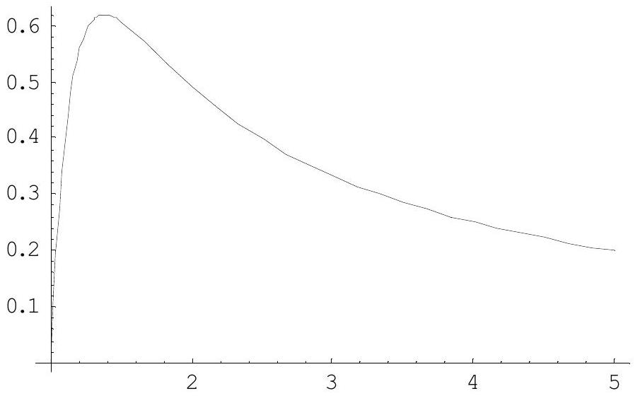

## Theoretical Question 2: Rising Balloon

1. Answers
(a) $F _ { B } = M _ { A } n g \frac { P } { P + \Delta P }$
(b) $\gamma = \frac { \rho _ { 0 } z _ { 0 } g } { P _ { 0 } } = 5.5$
(c) $\Delta P = \frac { 4 \kappa R T } { r _ { 0 } } \left( \frac { 1 } { \lambda } - \frac { 1 } { \lambda ^ { 7 } } \right)$

(d) $a = 0.110$
(e) $z _ { f } = 11 \mathrm {~km} , \quad \lambda _ { f } = 2.1$.

## 2. Solutions

[Part A]
(a) [1.5 points]

Using the ideal gas equation of state, the volume of the helium gas of $n$ moles at pressure $P + \Delta P$ and temperature $T$ is

$$
\begin{equation*}
V = n R T / ( P + \Delta P ) \tag{a1}
\end{equation*}
$$

while the volume of $n ^ { \prime }$ moles of air gas at pressure $P$ and temperature $T$ is

$$
\begin{equation*}
V = n ^ { \prime } R T / P . \tag{a2}
\end{equation*}
$$

Thus the balloon displaces $n ^ { \prime } = n \frac { P } { P + \Delta P }$ moles of air whose weight is $\quad M _ { A } n ^ { \prime } g$.
This displaced air weight is the buoyant force, i.e.,

$$
\begin{equation*}
F _ { B } = M _ { A } n g \frac { P } { P + \Delta P } . \tag{a3}
\end{equation*}
$$

(Partial credits for subtracting the gas weight.)
(b) [2 points]

The pressure difference arising from a height difference of $z$ is $- \rho g z$ when the air density $\rho$ is a constant. When it varies as a function of the height, we have

$$
\begin{equation*}
\frac { d P } { d z } = - \rho g = - \frac { \rho _ { 0 } T _ { 0 } } { P _ { 0 } } \frac { P } { T } g \tag{b1}
\end{equation*}
$$

where the ideal gas law $\rho T / P =$ constant is used. Inserting Eq. (2.1) and $T / T _ { 0 } = 1 - z / z _ { 0 }$ on both sides of Eq. (b1), and comparing the two, one gets

$$
\begin{equation*}
\gamma = \frac { \rho _ { 0 } z _ { 0 } g } { P _ { 0 } } = \frac { 1.16 \times 4.9 \times 10 ^ { 4 } \times 9.8 } { 1.01 \times 10 ^ { 5 } } = 5.52 . \tag{b2}
\end{equation*}
$$

The required numerical value is 5.5.
[Part B]
(c) [2 points]

The work needed to increase the radius from $r$ to $r + d r$ under the pressure difference $\Delta P$ is

$$
\begin{equation*}
d W = 4 \pi r ^ { 2 } \Delta P d r , \tag{c1}
\end{equation*}
$$

while the increase of the elastic energy for the same change of $r$ is

$$
\begin{equation*}
d W = \left( \frac { d U } { d r } \right) d r = 4 \pi \kappa R T \left( 4 r - 4 \frac { r _ { 0 } ^ { 6 } } { r ^ { 5 } } \right) d r . \tag{c2}
\end{equation*}
$$

Equating the two expressions of $d W$, one gets

$$
\begin{equation*}
\Delta P = 4 \kappa R T \left( \frac { 1 } { r } - \frac { r _ { 0 } ^ { 6 } } { r ^ { 7 } } \right) = \frac { 4 \kappa R T } { r _ { 0 } } \left( \frac { 1 } { \lambda } - \frac { 1 } { \lambda ^ { 7 } } \right) . \tag{c3}
\end{equation*}
$$

This is the required answer.
The graph as a function of $\lambda ( > 1 )$ increases sharply initially, has a maximum at $\lambda = 7 ^ { 1 / 6 }$ =1.38, and decreases as $\lambda ^ { - 1 }$ for large $\lambda$. The plot of $\Delta P / \left( 4 \kappa R T / r _ { 0 } \right)$ is given below.

(d) [1.5 points]

From the ideal gas law,

$$
\begin{equation*}
P _ { 0 } V _ { 0 } = n _ { 0 } R T _ { 0 } \tag{d1}
\end{equation*}
$$

where $V _ { 0 }$ is the unstretched volume.
At volume $V = \lambda ^ { 3 } V _ { 0 }$ containing $n$ moles, the ideal gas law applied to the gas inside at $T = T _ { 0 }$ gives the inside pressure $P _ { \text {in } }$ as

$$
\begin{equation*}
P _ { \text {in } } = n R T _ { 0 } / V = \frac { n } { n _ { 0 } \lambda ^ { 3 } } P _ { 0 } . \tag{d2}
\end{equation*}
$$

On the other hand, the result of (c) at $T = T _ { 0 }$ gives

$$
\begin{equation*}
P _ { \text {in } } = P _ { 0 } + \Delta P = P _ { 0 } + \frac { 4 \kappa R T _ { 0 } } { r _ { 0 } } \left( \frac { 1 } { \lambda } - \frac { 1 } { \lambda ^ { 7 } } \right) = \left( 1 + a \left( \frac { 1 } { \lambda } - \frac { 1 } { \lambda ^ { 7 } } \right) \right) P _ { 0 } . \tag{d3}
\end{equation*}
$$

Equating (d2) and (d3) to solve for $a$,

$$
\begin{equation*}
a = \frac { n / \left( n _ { 0 } \lambda ^ { 3 } \right) - 1 } { \lambda ^ { - 1 } - \lambda ^ { - 7 } } . \tag{d5}
\end{equation*}
$$

Inserting $n / n _ { 0 } = 3.6$ and $\lambda = 1.5$ here, $a = 0.110$.
[Part C]
(e) [3 points]
The buoyant force derived in problem (a) should balance the total mass of $M _ { \mathrm { T } } = 1.12 \mathrm {~kg}$. Thus, from Eq. (a3), at the weight balance,

$$
\begin{equation*}
\frac { P } { P + \Delta P } = \frac { M _ { \mathrm { T } } } { M _ { A } n } . \tag{e1}
\end{equation*}
$$

On the other hand, applying again the ideal gas law to the helium gas inside of volume $V = \frac { 4 } { 3 } \pi r ^ { 3 } = \lambda ^ { 3 } \frac { 4 } { 3 } \pi r _ { 0 } { } ^ { 3 } = \lambda ^ { 3 } V _ { 0 }$, for arbitrary ambient $P$ and $T$, one has

$$
\begin{equation*}
( P + \Delta P ) \lambda ^ { 3 } = \frac { n R T } { V _ { 0 } } = P _ { 0 } \frac { T } { T _ { 0 } } \frac { n } { n _ { 0 } } \tag{e2}
\end{equation*}
$$

for $n$ moles of helium. Eqs. (c3), (e1), and (e2) determine the three unknowns $P$, $\Delta P$, and $\lambda$ as a function of $T$ and other parameters. Using Eq. (e2) in Eq. (e1), one has an alternative condition for the weight balance as

$$
\begin{equation*}
\frac { P } { P _ { 0 } } \frac { T _ { 0 } } { T } \lambda ^ { 3 } = \frac { M _ { \mathrm { T } } } { M _ { A } n _ { 0 } } . \tag{e3}
\end{equation*}
$$

Next using (c3) for $\Delta P$ in (e2), one has

$$
P \lambda ^ { 3 } + \frac { 4 \kappa R T } { r _ { 0 } } \lambda ^ { 2 } \left( 1 - \lambda ^ { - 6 } \right) = P _ { 0 } \frac { T } { T _ { 0 } } \frac { n } { n _ { 0 } }
$$

or, rearranging it,

$$
\begin{equation*}
\frac { P } { P _ { 0 } } \frac { T _ { 0 } } { T } \lambda ^ { 3 } = \frac { n } { n _ { 0 } } - a \lambda ^ { 2 } \left( 1 - \lambda ^ { - 6 } \right) , \tag{e4}
\end{equation*}
$$

where the definition of $a$ has been used again.
Equating the right hand sides of Eqs. (e3) and (e4), one has the equation for $\lambda$ as

$$
\begin{equation*}
\lambda ^ { 2 } \left( 1 - \lambda ^ { - 6 } \right) = \frac { 1 } { a n _ { 0 } } \left( n - \frac { M _ { \mathrm { T } } } { M _ { A } } \right) = 4.54 . \tag{e5}
\end{equation*}
$$

The solution for $\lambda$ can be obtained by

$$
\begin{equation*}
\lambda ^ { 2 } \approx 4.54 / \left( 1 - 4.54 ^ { - 3 } \right) \approx 4.54 : \lambda _ { f } \cong 2.13 . \tag{e6}
\end{equation*}
$$

To find the height, replace $\left( P / P _ { 0 } \right) / \left( T / T _ { 0 } \right)$ on the left hand side of Eq. (e3) as a function of the height given in (b) as

$$
\begin{equation*}
\frac { P } { P _ { 0 } } \frac { T _ { 0 } } { T } \lambda ^ { 3 } = \left( 1 - z _ { f } / z _ { 0 } \right) ^ { \gamma - 1 } \lambda _ { f } ^ { 3 } = \frac { M _ { \mathrm { T } } } { M _ { A } n _ { 0 } } = 3.10 . \tag{e7}
\end{equation*}
$$

Solution of Eq. (e7) for $z _ { f }$ with $\lambda _ { f } = 2.13$ and $\gamma - 1 = 4.5$ is

$$
\begin{equation*}
z _ { f } = 49 \times \left( 1 - \left( 3.10 / 2.13 ^ { 3 } \right) ^ { 1 / 4.5 } \right) = 10.9 ( \mathrm {~km} ) . \tag{e8}
\end{equation*}
$$

The required answers are $\lambda _ { f } = 2.1$, and $z _ { f } = 11 \mathrm {~km}$.

## 3. Mark Distribution

| No. | Total Pt. | Partial Pt. | Contents |
| :--- | :--- | :--- | :--- |
| (a) | 1.5 | 0.5 | Archimedes' principle |
|  |  | 0.5 | Ideal gas law applied correctly |
|  |  | 0.5 | Correct answer (partial credits 0.3 for subtracting He weight) |
| (b) | 2.0 | 0.8 | Relation of pressure difference to air density |
|  |  | 0.5 | Application of ideal gas law to convert the density into pressure |
|  |  | 0.5 | Correct formula for $\gamma$ |
|  |  | 0.2 | Correct number in answer |
| (c) | 2.0 | 0.7 | Relation of mechanical work to elastic energy change |
|  |  | 0.3 | Relation of pressure to force |
|  |  | 0.5 | Correct answer in formula |
|  |  | 0.5 | Correct sketch of the curve |
| (d) | 1.5 | 0.3 | Use of ideal gas law for the increased pressure inside |
|  |  | 0.4 | Expression of inside pressure in terms of $a$ at the given conditions |
|  |  | 0.5 | Formula or correct expression for $a$ |
|  |  | 0.3 | Correct answer |
| (e) | 3.0 | 0.3 | Use of force balance as one condition to determine unknowns |
|  |  | 0.3 | Ideal gas law applied to the gas as an independent condition to determine unknowns |
|  |  | 0.5 | The condition to determine $\lambda _ { f }$ numerically |
|  |  | 0.7 | Correct answer for $\lambda _ { f }$ |
|  |  | 0.5 | The relation of $z _ { f }$ versus $\lambda _ { f }$ |
|  |  | 0.7 | Correct answer for $z _ { f }$ |
| Total | 10 |  |  |
