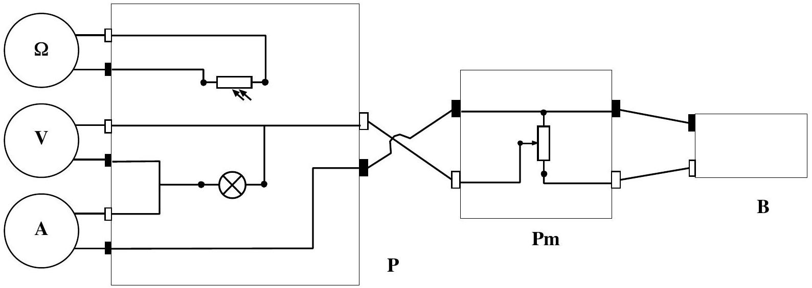
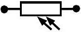
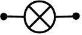
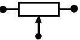
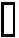
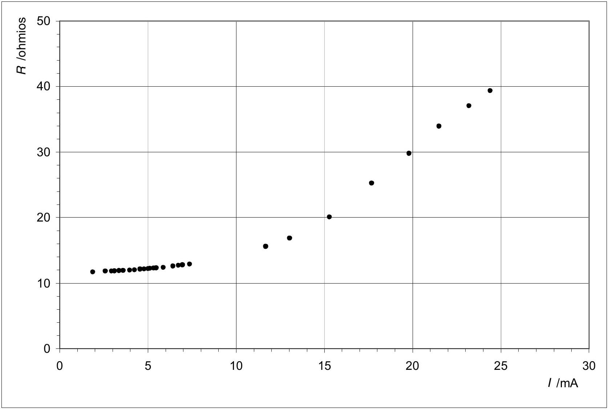
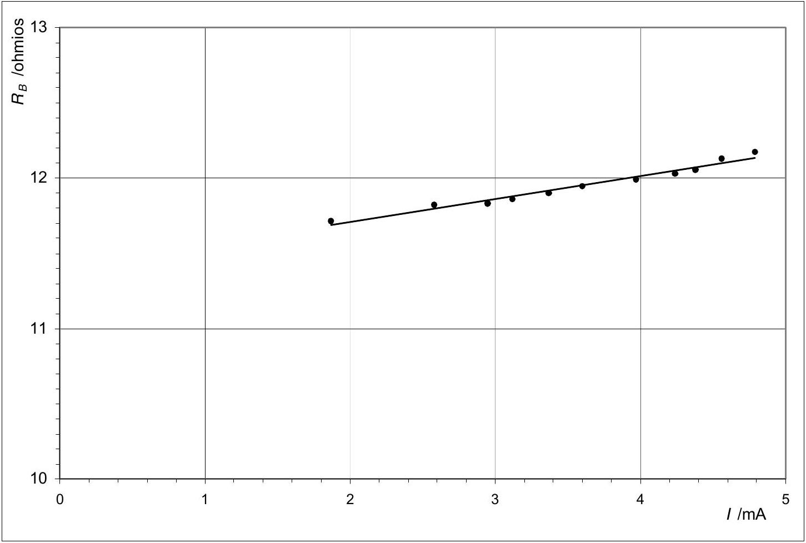
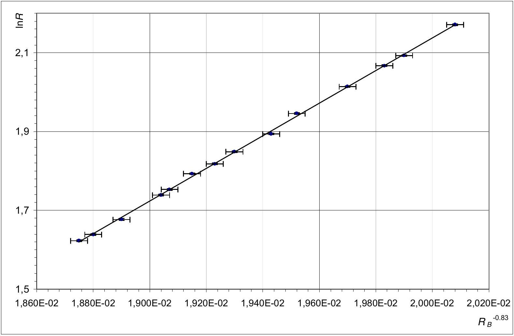

## PLANCK'S CONSTANT IN THE LIGHT OF AN INCANDESCENT LAMP SOLUTION

TASK 1

Draw the electric connections in the boxes and between boxes below.

| Photoresistor |  |
| :--- | :--- |
| Incandescent Bulb |  |
| Potentiometer |  |
| Red socket |  |
| Black socket |  |

| $\Omega$ | Ohmmeter |
| :--- | :--- |
| V | Voltmeter |
| A | Ammeter |
| P | Platform |
| Pm | Potentiometer |
| B | Battery |

a)

TASK 2
| $t _ { 0 } = 24 ^ { \circ } \mathrm { C }$ | $T _ { 0 } = 297 \mathrm {~K}$ | $\Delta T _ { 0 } = 1 \mathrm {~K}$ |
| :--- | :--- | :--- |

b)
| $V / \mathrm { mV }$ | $I / \mathrm { mA }$ | $R _ { B } / \Omega$ |
| :--- | :--- | :--- |
| 21.9 | 1.87 | 11.7 |
| 30.5 | 2.58 | 11.8 |
| 34.9 | 2.95 | 11.8 |
| 37.0 | 3.12 | 11.9 |
| 40.1 | 3.37 | 11.9 |
| 43.0 | 3.60 | 11.9 |
| 47.6 | 3.97 | 12.0 |
| 51.1 | 4.24 | 12.1 |
| 55.3 | 4.56 | 12.1 |
| 58.3 | 4.79 | 12.2 |
| 61.3 | 5.02 | 12.2 |
| 65.5 | 5.33 | 12.3 |
| 67.5 | 5.47 | 12.3 |
| 73.0 | 5.88 | 12.4 |
| 80.9 | 6.42 | 12.6 |
| 85.6 | 6.73 | 12.7 |
| 89.0 | 6.96 | 12.8 |
| 95.1 | 7.36 | 12.9 |
| 111.9 | 8.38 | 13.4 |
| 130.2 | 9.37 | 13.9 |
| 181.8 | 11.67 | 15.6 |
| 220 | 13.04 | 16.9 |
| 307 | 15.29 | 20.1 |
| 447 | 17.68 | 25.1 |
| 590 | 19.8 | 29.8 |
| 730 | 21.5 | 33.9 |
| 860 | 23.2 | 37.1 |
| 960 | 24.4 | 39.3 |

| $V _ { \text {min } } = 9.2 \mathrm { mV }$ |
| :--- |
| * This is a characteristic of your apparatus. You can't go below it. |

We represent $R _ { B }$ in the vertical axis against $I$.

In order to work out $R _ { B 0 }$, we choose the first ten readings.

TASK 2

c)
| $V / \mathrm { mV }$ | $I / \mathrm { mA }$ | $R _ { B } / \Omega$ |
| :--- | :--- | :--- |
| $21.9 \pm 0.1$ | 1.87 ± 0.01 | $11.7 \pm 0.1$ |
| $30.5 \pm 0.1$ | $2.58 \pm 0.01$ | $11.8 \pm 0.1$ |
| $34.9 \pm 0.1$ | $2.95 \pm 0.01$ | 11.8 ± 0.1 |
| $37.0 \pm 0.1$ | $3.12 \pm 0.01$ | $11.9 \pm 0.1$ |
| $40.1 \pm 0.1$ | 3.37 ± 0.01 | $11.9 \pm 0.1$ |
| $43.0 \pm 0.1$ | $3.60 \pm 0.01$ | $11.9 \pm 0.1$ |
| $47.6 \pm 0.1$ | $3.97 \pm 0.01$ | 12.0 ± 0.1 |
| $51.1 \pm 0.1$ | $4.24 \pm 0.01$ | $12.1 \pm 0.1$ |
| $55.3 \pm 0.1$ | $4.56 \pm 0.01$ | $12.1 \pm 0.1$ |
| $58.3 \pm 0.1$ | $4.79 \pm 0.01$ | $12.2 \pm 0.1$ |

Error for $R _ { B }$ (We work out the error for first value, as example).

$$
\Delta R _ { B } = R _ { B } \sqrt { \left( \frac { \Delta V } { V } \right) ^ { 2 } + \left( \frac { \Delta I } { I } \right) ^ { 2 } } = 11.71 \sqrt { \left( \frac { 0.1 } { 21.9 } \right) ^ { 2 } + \left( \frac { 0.01 } { 1.87 } \right) ^ { 2 } } = 0.1
$$

We have worked out $R _ { B 0 }$ by the least squares.

$$
\begin{aligned}
& R _ { B 0 } = 11.4 \\
& \text { slope } = m = 0.167 \\
& \sum I ^ { 2 } = 130.38 \\
& \sum I = 35.05 \\
& n = 10
\end{aligned}
$$

For axis $X : \sigma _ { I } = \sqrt { \frac { \sum \Delta I ^ { 2 } } { n } } = 0.01$
For axis $Y : \sigma _ { R _ { B } } = \sqrt { \frac { \sum \Delta R _ { B } ^ { 2 } } { n } } = 0.047$

$$
\begin{aligned}
& \sigma = \sqrt { \sigma _ { R _ { B } } ^ { 2 } + m ^ { 2 } \sigma _ { I } ^ { 2 } } = \sqrt { 0.1 ^ { 2 } } + 0.167 ^ { 2 } \cdot 0.01 ^ { 2 } = 0.1 \\
& \Delta R _ { B 0 } = \sqrt { \frac { \sigma ^ { 2 } \sum I ^ { 2 } } { n \sum I ^ { 2 } - \left( \sum I \right) ^ { 2 } } } = \sqrt { \frac { 0.1 ^ { 2 } \times 130.38 } { 10 \cdot 130.38 - 35.05 ^ { 2 } } } = 0.13
\end{aligned}
$$

| $R _ { B 0 } = 11,4 \Omega$ | $\Delta R _ { B 0 } = 0.1 \Omega$ |
| :--- | :--- |

d) $T = a R ^ { 0.83 } ; \quad a = \frac { T _ { 0 } } { R _ { 0 } ^ { 0.83 } } ; \quad a = \frac { 297 } { 11.4 ^ { 0.83 } } = 39.40$

Working out the error for two methods:
Method A

$$
\ln a = \ln T _ { 0 } - 0.83 \ln R _ { B 0 } ; \quad \Delta a = a \left( \frac { \Delta T _ { 0 } } { T _ { 0 } } + 0.83 \frac { \Delta R _ { B 0 } } { R _ { B 0 } } \right) ; \quad \Delta a = 39.40 \left( \frac { 1 } { 297 } + 0.83 \frac { 0.1 } { 11.40 } \right) = 0.419 = 0.4
$$

Method B

Higher value of $a : \quad a _ { \text {max } } = \frac { T _ { 0 } + \Delta T _ { 0 } } { \left( R _ { 0 } - \Delta R _ { 0 } \right) ^ { 0.83 } } = \frac { 297 + 1 } { ( 11.4 - 0.1 ) ^ { 0.83 } } = 39.8255$
Smaller value of $a : \quad a _ { \text {min } } = \frac { T _ { 0 } - \Delta T _ { 0 } } { \left( R _ { 0 } + \Delta R _ { 0 } \right) ^ { 0.83 } } = \frac { 297 - 1 } { ( 11.4 + 0.1 ) ^ { 0.83 } } = 38.9863$

$$
\Delta a = \frac { a _ { \max } - a _ { \min } } { 2 } = \frac { 39.8255 - 38.9863 } { 2 } = 0.419 = 0.4
$$

$$
\begin{equation*}
a = 39.4 \tag{\(\Delta a = 0.4\)}
\end{equation*}
$$
TASK 3

Because of $2 \Delta \lambda = 620 - 565 ; \Delta \lambda = 28 \mathrm {~nm}$

| $\lambda _ { 0 } = 590 \mathrm {~nm}$ | $\Delta \lambda = 28 \mathrm {~nm}$ |
| :--- | :--- |

TASK 4

a)
| $V / \mathrm { V }$ | $I / \mathrm { mA }$ | R /k $\Omega$ |
| :--- | :--- | :--- |
| 9.48 | 85.5 | 8.77 |
| 9.73 | 86.8 | 8.11 |
| 9.83 | 87.3 | 7.90 |
| 100.1 | 88.2 | 7.49 |
| 10.25 | 89.4 | 7.00 |
| 10.41 | 90.2 | 6.67 |
| 10.61 | 91.2 | 6.35 |
| 10.72 | 91.8 | 6.16 |
| 10.82 | 92.2 | 6.01 |
| 10.97 | 93.0 | 5.77 |
| 11.03 | 93.3 | 5.69 |
| 11.27 | 94.5 | 5.35 |
| 11.42 | 95.1 | 5.17 |
| 11.50 | 95.5 | 5.07 |

b) Because of $\ln \frac { R } { R ^ { \prime } } = \gamma \ln 0.512 ; \quad \gamma = \ln \frac { R } { R ^ { \prime } } / \ln 0.512 = \ln \frac { 5.07 } { 8.11 } / \ln 0.512 = 0.702$

For working out $\Delta \gamma$ we know that:

$$
\begin{aligned}
& R \pm \Delta R = 5.07 \pm 0.01 \mathrm { k } \Omega \\
& R ^ { \prime } \pm \Delta R ^ { \prime } = 8.11 \pm 0.01 \mathrm { k } \Omega \\
& \text { Transmittance, } t = 51.2 \%
\end{aligned}
$$

Working out the error for two methods:
Method A

$$
\gamma = \frac { \ln R / R ^ { \prime } } { \ln t } ; \quad \Delta \gamma = \frac { 1 } { \ln t } \left( \frac { \Delta R } { R } + \frac { \Delta R ^ { \prime } } { R ^ { \prime } } \right) = \frac { 1 } { \ln 0.512 } \left( \frac { 0.01 } { 5.07 } + \frac { 0.01 } { 8.11 } \right) = 0.00479 ; \Delta \gamma = 0.005
$$

Method B
Higher value of $\gamma : \quad \gamma _ { \text {max } } = \ln \frac { R - \Delta R } { R ^ { \prime } + \Delta R ^ { \prime } } / \ln \gamma = \ln \frac { 5.07 - 0.01 } { 8.11 + 0.01 } / \ln 0.512 = 0.70654$

Smaller value of $\gamma . \quad \gamma _ { \text {max } } = \ln \frac { R + \Delta R } { R ^ { \prime } - \Delta R ^ { \prime } } / \ln \gamma = \ln \frac { 5.07 + 0.01 } { 8.11 - 0.01 } / \ln 0.512 = 0.69696$

$$
\Delta \gamma = \frac { \gamma _ { \max } - \gamma _ { \min } } { 2 } = \frac { 0.70654 - 0.69696 } { 2 } = 0.00479 ; \quad \Delta \gamma = 0.005
$$

| $R = 5.07 \mathrm { k } \Omega$ | $\gamma = 0.702$ |
| :--- | :--- |
| $R ^ { \prime } = 8.11 \mathrm { k } \Omega$ | $\Delta \gamma = 0.005$ |

c)
| We know that | $R = c _ { 3 } e ^ { \frac { c _ { 2 } \gamma } { \lambda _ { 0 } T } } \quad$ (3) |
| :--- | :--- |
| then | $\ln R = \ln c _ { 3 } + \frac { c _ { 2 } \gamma } { \lambda _ { 0 } T }$ |
| Because of | $T = a R _ { B } ^ { 0.83 } \quad$ (6) |
| consequently | $\ln R = \ln c _ { 3 } + \frac { c _ { 2 } \gamma } { \lambda _ { 0 } a } R _ { B } ^ { - 0.83 }$ |

$$
\ln R = \ln c _ { 3 } + \frac { c _ { 2 } \gamma } { \lambda _ { 0 } a } R _ { B } ^ { - 0.83 } \quad \text { Eq.(9) }
$$

d)
| $V / \mathrm { V }$ | $I / \mathrm { mA }$ | $R _ { B } / \Omega$ | T / K | $R _ { B } { } ^ { - 0.83 }$ (S.I.) | $R / \mathrm { k } \Omega$ | $\ln R$ |
| :--- | :--- | :--- | :--- | :--- | :--- | :--- |
| $9.48 \pm 0.01$ | $85.5 \pm 0.1$ | 110.9 ± 0.2 | $1962 \pm 18$ | $( 2.008 \pm 0.004 ) 10 ^ { - 2 }$ | 8.77 ± 0.01 | $2.171 \pm 0.001$ |
| 9.73 ± 0.01 | $86.8 \pm 0.1$ | 112.1 ± 0.2 | 1980 ± 18 | $( 1.990 \pm 0.004 ) 10 ^ { - 2 }$ | 8.11 ± 0.01 | 2.093 ± 0.001 |
| 9.83 ± 0.01 | 87.3 ± 0.1 | 112.6 ± 0.2 | 1987 ± 18 | $( 1.983 \pm 0.004 ) 10 ^ { - 2 }$ | 7.90 ± 0.01 | 2.067 ± 0.001 |
| $10.01 \pm 0.01$ | 88.2 ± 0.1 | 113.5 ± 0.2 | $2000 \pm 18$ | $( 1.970 \pm 0.004 ) 10 ^ { - 2 }$ | 7.49 ± 0.01 | 2.014 ± 0.001 |
| $10.25 \pm 0.01$ | 89.4 ± 0.1 | 114.7 ± 0.2 | $2018 \pm 18$ | $( 1.952 \pm 0.003 ) 10 ^ { - 2 }$ | 7.00 ± 0.01 | 1.946 ± 0.001 |
| $10.41 \pm 0.01$ | 90.2 ± 0.1 | 115.4 ± 0.2 | $2028 \pm 18$ | $( 1.943 \pm 0.003 ) 10 ^ { - 2 }$ | 6.67 ± 0.01 | 1.894 ± 0.002 |
| $10.61 \pm 0.01$ | 91.2 ± 0.1 | 116.3 ± 0.2 | $2041 \pm 18$ | $( 1.930 \pm 0.003 ) 10 ^ { - 2 }$ | 6.35 ± 0.01 | 1.849 ± 0.002 |
| $10.72 \pm 0.01$ | 91.8 ± 0.1 | 116.8 ± 0.2 | $2049 \pm 19$ | $( 1.923 \pm 0.003 ) 10 ^ { - 2 }$ | 6.16 ± 0.01 | 1.818 ± 0.002 |
| 10.82 ± 0.01 | 92.2 ± 0.1 | 117.4 ± 0.2 | 2057 ± 19 | $( 1.915 \pm 0.003 ) 10 ^ { - 2 }$ | 6.01 ± 0.01 | 1.793 ± 0.002 |
| 10.97 ± 0.01 | 93.0 ± 0.1 | 118.0 ± 0.2 | $2066 \pm 19$ | $( 1.907 \pm 0.003 ) 10 ^ { - 2 }$ | 5.77 ± 0.01 | 1.753 ± 0.002 |
| 11.03 ± 0.01 | 93.3 ± 0.1 | 118.2 ± 0.2 | $2069 \pm 19$ | $( 1.904 \pm 0.003 ) 10 ^ { - 2 }$ | 5.69 ± 0.01 | 1.739 ± 0.002 |
| $11.27 \pm 0.01$ | $94.5 \pm 0.1$ | 119.3 ± 0.2 | $2085 \pm 19$ | $( 1.890 \pm 0.003 ) 10 ^ { - 2 }$ | 5.35 ± 0.01 | 1.677 ± 0.002 |
| $11.42 \pm 0.01$ | $95.1 \pm 0.1$ | 120.1 ± 0.2 | $2096 \pm 19$ | $( 1.880 \pm 0.003 ) 10 ^ { - 2 }$ | 5.15 ± 0.01 | 1.639 ± 0.002 |
| 11.50 ± 0.01 | $95.5 \pm 0.1$ | 120.4 ± 0.2 | $2101 \pm 19$ | $( 1.875 \pm 0.003 ) 10 ^ { - 2 }$ | 5.07 ± 0.01 | 1.623 ± 0.002 |
|  |  |  | unnecessary |  |  |  |

We work out the errors for all the first row, as example.
Error for $R _ { B } : \quad \Delta R _ { B } = R _ { B } \sqrt { \left( \frac { \Delta V } { V } \right) ^ { 2 } + \left( \frac { \Delta I } { I } \right) ^ { 2 } } = 110.9 \sqrt { \left( \frac { 0.01 } { 9.48 } \right) ^ { 2 } + \left( \frac { 0.1 } { 85.5 } \right) ^ { 2 } } = 0.2 \Omega$

Error for $T : \quad \Delta T = T \left( \frac { \Delta a } { a } + 0.83 \frac { \Delta R _ { B } } { R _ { B } } \right) ; \Delta T = 1962 \left( \frac { 0.3 } { 39.4 } + 0.83 \frac { 0.2 } { 110.9 } \right) = 18 \mathrm {~K}$
Error for $R _ { B } { } ^ { - 0.83 }$ :

$$
\begin{aligned}
& x = R _ { B } ^ { - 0.83 } ; \ln x = - 0.83 \ln R _ { B } ; \Delta x = x \cdot 0.83 \frac { \Delta R _ { B } } { R _ { B } } ; \Delta \left( R _ { B } ^ { - 0.83 } \right) = R _ { B } ^ { - 0.83 } \frac { \Delta R _ { B } } { R _ { B } } \\
& \Delta \left( R _ { B } ^ { - 0.83 } \right) = 0.020077 \frac { 0.2 } { 110.9 } \approx 0.004 \times 10 ^ { - 2 }
\end{aligned}
$$

Error for $\ln R : \quad \Delta \ln R = \frac { \Delta R } { R } ; \quad \Delta \ln R = \frac { 0.01 } { 8.77 } = 0.001$

e) We plot $\ln R$ versus $R _ { B } { } ^ { - 0.83 }$.

By the least squares
Slope $= m = 414,6717$
$\sum \left( R _ { B } ^ { - 0.83 } \right) ^ { 2 } = 5.23559 \times 10 ^ { - 3 }$
$\sum \left( R _ { B } ^ { - 0.83 } \right) = 0.27068$
$n = 14$
For axis $X : \sigma _ { R _ { B } ^ { - 0.83 } } = \sqrt { \frac { \sum \Delta \left( R _ { B } ^ { - 0.83 } \right) ^ { 2 } } { n } } = 0.003 \times 10 ^ { - 2 }$
For axis $Y : \sigma _ { \ln R } = \sqrt { \frac { \sum \Delta ( \ln R ) ^ { 2 } } { n } } = 0.002$
$\sigma = \sqrt { \sigma _ { \ln R } ^ { 2 } + m ^ { 2 } \sigma _ { R _ { B } ^ { - 0.83 } } ^ { 2 } } = \sqrt { 0.002 ^ { 2 } + 414.672 ^ { 2 } \cdot \left( 0.003 \times 10 ^ { - 2 } \right) ^ { 2 } } = 0.0126$
$\Delta m = \sqrt { \frac { n \sigma ^ { 2 } } { n \sum \left( R _ { B } ^ { - 0.83 } \right) ^ { 2 } - \left( \sum R _ { B } ^ { - 0.83 } \right) ^ { 2 } } } = \sqrt { \frac { 14 \cdot 0,0126 ^ { 2 } } { 14 \cdot 5.23559 \times 10 ^ { - 3 } - ( 0.27068 ) ^ { 2 } } } = 8.295$
Because of

$$
m = \frac { c _ { 2 } \gamma } { \lambda _ { 0 } a }
$$

and

$$
c _ { 2 } = \frac { h c } { k }
$$

then

$$
h = \frac { m k \lambda _ { 0 } a } { c \gamma }
$$

$$
\begin{aligned}
h & = \frac { 414.67 \cdot 1.381 \times 10 ^ { - 23 } \cdot 590 \times 10 ^ { - 9 } \cdot 39.4 } { 2.998 \times 10 ^ { 8 } \cdot 0.702 } = 6.33 \times 10 ^ { - 34 } \\
\Delta h & = h \sqrt { \left( \frac { \Delta m } { m } \right) ^ { 2 } + \left( \frac { \Delta k } { k } \right) ^ { 2 } + \left( \frac { \Delta \lambda _ { 0 } } { \lambda _ { 0 } } \right) ^ { 2 } + \left( \frac { \Delta a } { a } \right) ^ { 2 } + \left( \frac { \Delta \gamma } { \gamma } \right) ^ { 2 } } \\
\Delta h & = 6.34 \times 10 ^ { - 34 } \sqrt { \left( \frac { 8.3 } { 415 } \right) ^ { 2 } + 0 + \left( \frac { 28 } { 590 } \right) ^ { 2 } + \left( \frac { 0.3 } { 39.4 } \right) ^ { 2 } + 0 + \left( \frac { 0.01 } { 0.70 } \right) ^ { 2 } } = 0.34 \times 10 ^ { - 34 }
\end{aligned}
$$

| $h = 6.3 \times 10 ^ { - 34 } \mathrm {~J} \cdot \mathrm {~s}$ | $\Delta h = 0.3 \times 10 ^ { - 34 } \mathrm {~J} \cdot \mathrm {~s}$ |
| :--- | :--- |
