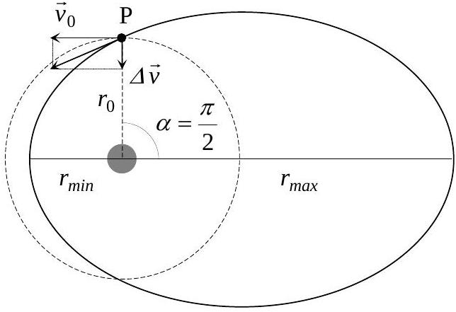
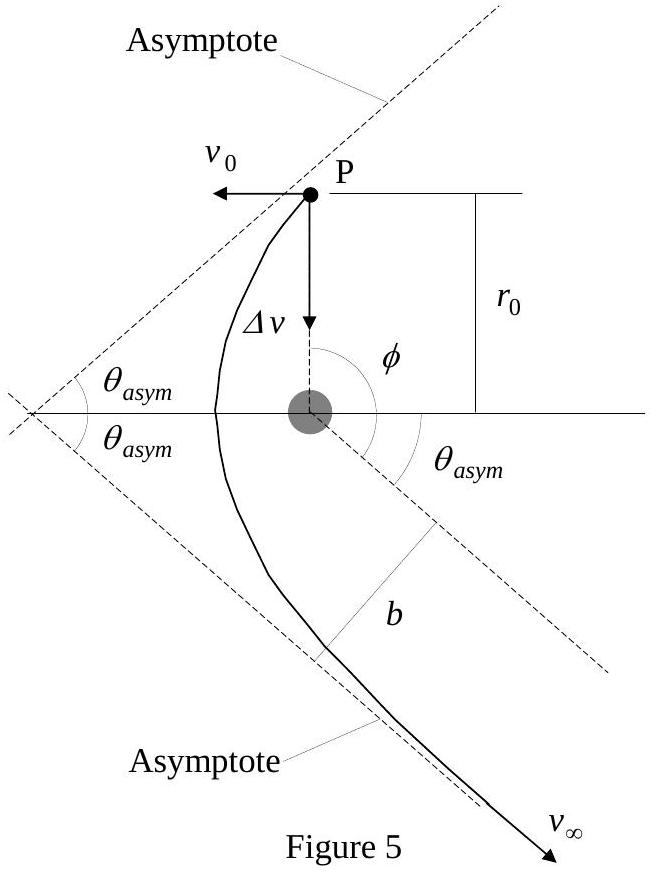

## Th1 AN ILL FATED SATELLITE SOLUTION

1.1 and 1.2

$$
\left. \begin{array} { l }
G \frac { M _ { T } m } { r _ { 0 } ^ { 2 } } = m \frac { v _ { 0 } ^ { 2 } } { r _ { 0 } } \\
v _ { 0 } = \frac { 2 \pi r _ { 0 } } { T _ { 0 } } \\
g = \frac { G M _ { T } } { R _ { T } ^ { 2 } }
\end{array} \right\} \Rightarrow \left\{ \begin{array} { c c }
r _ { 0 } = \left( \frac { g R _ { T } ^ { 2 } T _ { 0 } ^ { 2 } } { 4 \pi ^ { 2 } } \right) ^ { 1 / 3 } & \Rightarrow r _ { 0 } = 4.22 \cdot 10 ^ { 7 } \mathrm {~m} \\
v _ { 0 } = R _ { T } \sqrt { \frac { g } { r _ { 0 } } } & \Rightarrow v _ { 0 } = 3.07 \cdot 10 ^ { 3 } \mathrm {~m} / \mathrm { s }
\end{array} \right.
$$

1.3

$$
\begin{aligned}
& L _ { 0 } = r _ { 0 } m v _ { 0 } = \frac { g R _ { T } ^ { 2 } } { v _ { 0 } ^ { 2 } } m v _ { 0 } \Rightarrow L _ { 0 } = \frac { m g R _ { T } ^ { 2 } } { v _ { 0 } } \\
& E _ { 0 } = \frac { 1 } { 2 } m v _ { 0 } ^ { 2 } - G \frac { M _ { T } m } { r _ { 0 } } = \frac { 1 } { 2 } m v _ { 0 } ^ { 2 } - \frac { g R _ { T } ^ { 2 } m } { r _ { 0 } } = \frac { 1 } { 2 } m v _ { 0 } ^ { 2 } - m v _ { 0 } ^ { 2 } \Rightarrow E _ { 0 } = - \frac { 1 } { 2 } m v _ { 0 } ^ { 2 }
\end{aligned}
$$

2.1

The value of the semi-latus-rectum $l$ is obtained taking into account that the orbital angular momentum is the same in both orbits. That is

$$
l = \frac { L _ { 0 } ^ { 2 } } { G M _ { T } m ^ { 2 } } = \frac { m ^ { 2 } g ^ { 2 } R _ { T } ^ { 4 } } { v _ { 0 } ^ { 2 } } \frac { 1 } { g R _ { T } ^ { 2 } m ^ { 2 } } = \frac { g R _ { T } ^ { 2 } } { v _ { 0 } ^ { 2 } } = r _ { 0 } \Rightarrow l = r _ { 0 }
$$

The eccentricity value is

$$
\varepsilon ^ { 2 } = 1 + \frac { 2 E L _ { 0 } ^ { 2 } } { G ^ { 2 } M _ { T } ^ { 2 } m ^ { 3 } }
$$

where $E$ is the new satellite mechanical energy

$$
E = \frac { 1 } { 2 } m \left( v _ { 0 } ^ { 2 } + \Delta v ^ { 2 } \right) - G \frac { M _ { T } m } { r _ { 0 } } = \frac { 1 } { 2 } m \Delta v ^ { 2 } + E _ { 0 } = \frac { 1 } { 2 } m \Delta v ^ { 2 } - \frac { 1 } { 2 } m v _ { 0 } ^ { 2 }
$$

that is

$$
E = \frac { 1 } { 2 } m v _ { 0 } ^ { 2 } \left( \frac { \Delta v ^ { 2 } } { v _ { 0 } ^ { 2 } } - 1 \right) = \frac { 1 } { 2 } m v _ { 0 } ^ { 2 } \left( \beta ^ { 2 } - 1 \right)
$$

Combining both, one gets $\varepsilon = \beta$

This is an elliptical trajectory because $\varepsilon = \beta < 1$.

2.2

The initial and final orbits cross at P, where the satellite engine fired instantaneously (see Figure 4). At this point

$$
r ( \theta = \alpha ) = r _ { 0 } = \frac { r _ { 0 } } { 1 - \beta \cos \alpha } \Rightarrow \alpha = \frac { \pi } { 2 }
$$

2.3

From the trajectory expression one immediately obtains that the maximum and minimum values of $r$ correspond to $\theta = 0$ and $\theta = \pi$ respectively (see Figure 4). Hence, they are given by

$$
r _ { \max } = \frac { l } { 1 - \varepsilon } \quad r _ { \min } = \frac { l } { 1 + \varepsilon }
$$

that is

$$
r _ { \max } = \frac { r _ { 0 } } { 1 - \beta } \quad \text { and } \quad r _ { \min } = \frac { r _ { 0 } } { 1 + \beta }
$$

Figure 4

For $\beta = 1 / 4$, one gets

$$
r _ { \max } = 5.63 \cdot 10 ^ { 7 } \mathrm {~m} ; \quad r _ { \min } = 3.38 \cdot 10 ^ { 7 } \mathrm {~m}
$$

The distances $r _ { \text {max } }$ and $r _ { \text {min } }$ can also be obtained from mechanical energy and angular momentum conservation, taking into account that $\vec { r }$ and $\vec { v }$ are orthogonal at apogee and at perigee

$$
\begin{aligned}
E & = \frac { 1 } { 2 } m v _ { 0 } ^ { 2 } \left( \beta ^ { 2 } - 1 \right) = \frac { 1 } { 2 } m v ^ { 2 } - \frac { g R _ { T } ^ { 2 } m } { r } \\
L _ { 0 } & = \frac { m g R _ { T } ^ { 2 } } { v _ { 0 } } = m v r
\end{aligned}
$$

What remains of them, after eliminating $v$, is a second-degree equation whose solutions are $r _ { \text {max } }$ and $r _ { \text {min } }$.
2.4

By the Third Kepler Law, the period $T$ in the new orbit satisfies that

$$
\frac { T ^ { 2 } } { a ^ { 3 } } = \frac { T _ { 0 } ^ { 2 } } { r _ { 0 } ^ { 3 } }
$$

where $a$, the semi-major axis of the ellipse, is given by

$$
a = \frac { r _ { \max } + r _ { \min } } { 2 } = \frac { r _ { 0 } } { 1 - \beta ^ { 2 } }
$$

Therefore

$$
T = T _ { 0 } \left( 1 - \beta ^ { 2 } \right) ^ { - 3 / 2 }
$$

For $\beta = 1 / 4$

$$
T = T _ { 0 } \left( \frac { 15 } { 16 } \right) ^ { - 3 / 2 } = 26.4 \mathrm {~h}
$$

3.1

Only if the satellite follows an open trajectory it can escape from the Earth gravity attraction. Then, the orbit eccentricity has to be equal or larger than one. The minimum boost corresponds to a parabolic trajectory, with $\varepsilon = 1$

$$
\varepsilon = \beta \quad \Rightarrow \quad \beta _ { \text {esc } } = 1
$$

This can also be obtained by using that the total satellite energy has to be zero to reach infinity ( $E _ { p } = 0$ ) without residual velocity ( $E _ { k } = 0$ )

$$
E = \frac { 1 } { 2 } m v _ { 0 } ^ { 2 } \left( \beta _ { e s c } ^ { 2 } - 1 \right) = 0 \quad \Rightarrow \quad \beta _ { e s c } = 1
$$

This also arises from $T = \infty$ or from $r _ { \text {max } } = \infty$.
3.2

Due to $\varepsilon = \beta _ { e s c } = 1$, the polar parabola equation is

$$
r = \frac { l } { 1 - \cos \theta }
$$

where the semi-latus-rectum continues to be $l = r _ { 0 }$. The minimum Earth - satellite distance corresponds to $\theta = \pi$, where

$$
r _ { \min } ^ { \prime } = \frac { r _ { 0 } } { 2 }
$$

This also arises from energy conservation (for $E = 0$ ) and from the equality between the angular momenta ( $L _ { 0 }$ ) at the initial point P and at maximum approximation, where $\vec { r }$ and $\vec { v }$ are orthogonal.
4.1

If the satellite escapes to infinity with residual velocity $v _ { \infty }$, by energy conservation

$$
\begin{aligned}
& E = \frac { 1 } { 2 } m v _ { 0 } ^ { 2 } \left( \beta ^ { 2 } - 1 \right) = \frac { 1 } { 2 } m v _ { \infty } ^ { 2 } \Rightarrow \\
& v _ { \infty } = v _ { 0 } \left( \beta ^ { 2 } - 1 \right) ^ { 1 / 2 }
\end{aligned}
$$

4.2

As $\varepsilon = \beta > \beta _ { e s c } = 1$ the satellite trajectory will be a hyperbola.

The satellite angular momentum is the same at P than at the point where its residual velocity is $v _ { \infty }$ (Figure 5), thus

$$
m v _ { 0 } r _ { 0 } = m v _ { \infty } b
$$

So

$$
b = r _ { 0 } \frac { v _ { 0 } } { v _ { \infty } } \Rightarrow b = r _ { 0 } \left( \beta ^ { 2 } - 1 \right) ^ { - 1 / 2 }
$$

4.3

The angle between each asymptote and the hyperbola axis is that appearing in its polar equation in the limit $r \rightarrow \infty$. This is the angle for which the equation denominator vanishes

$$
1 - \beta \cos \theta _ { \text {asym } } = 0 \quad \Rightarrow \quad \theta _ { \text {asym } } = \cos ^ { - 1 } \left( \frac { 1 } { \beta } \right)
$$

According to Figure 5

$$
\phi = \frac { \pi } { 2 } + \theta _ { \text {asym } } \quad \Rightarrow \quad \phi = \frac { \pi } { 2 } + \cos ^ { - 1 } \left( \frac { 1 } { \beta } \right)
$$

For $\beta = \frac { 3 } { 2 } \beta _ { \text {esc } } = \frac { 3 } { 2 }$, one gets $\phi = 138 ^ { \circ } = 2.41$ rad

## Th 1 ANSWER SHEET

| Question | Basic formulas and ideas used | Analytical results | Numerical results | Marking guideline |
| :--- | :--- | :--- | :--- | :--- |
| 1.1 | $\begin{aligned} & G \frac { M _ { T } m } { r _ { 0 } ^ { 2 } } = \\ & v _ { 0 } = \frac { 2 \pi r _ { 0 } } { T _ { 0 } } \\ & g = \frac { G M _ { T } } { R _ { T } ^ { 2 } } \end{aligned}$ |  | $r _ { 0 } = 4.22 \cdot 10 ^ { 7 } \mathrm {~m}$ | 0.3 |
| 1.2 |  | $v _ { 0 } = R _ { T } \sqrt { \frac { g } { r _ { 0 } } }$ | $v _ { 0 } = 3.07 \cdot 10 ^ { 3 } \mathrm {~m} / \mathrm { s }$ | 0.3 + 0.1 |
| 1.3 | $\begin{aligned} \vec { L } & = m \vec { r } \times \vec { v } \\ E & = \frac { 1 } { 2 } m v ^ { 2 } - G \frac { M m } { r } \end{aligned}$ | $\begin{aligned} L _ { 0 } & = \frac { m g R _ { T } ^ { 2 } } { v _ { 0 } } \\ E _ { 0 } & = - \frac { 1 } { 2 } m v _ { 0 } ^ { 2 } \end{aligned}$ |  | 0.4 |
| 2.1 | Hint on the conical curves | $\begin{aligned} & l = r _ { 0 } \\ & \varepsilon = \beta \end{aligned}$ |  | $\begin{aligned} & 0.4 \\ & 0.5 \end{aligned}$ |
| 2.2 |  |  | $\alpha = \frac { \pi } { 2 }$ | 1.0 |
| 2.3 | $\begin{aligned} & \text { Results of } 2.1 \text {, or } \\ & \text { conservation of } E \text { and } L \end{aligned}$ | $\begin{aligned} & r _ { \max } = \frac { r _ { 0 } } { 1 - \beta } \\ & r _ { \min } = \frac { r _ { 0 } } { 1 + \beta } \end{aligned}$ | $\begin{aligned} & r _ { \max } = 5.63 \cdot 10 ^ { 7 } \mathrm {~m} \\ & r _ { \min } = 3.38 \cdot 10 ^ { 7 } \mathrm {~m} \end{aligned}$ | 1.0 + 0.2 |
| 2.4 | Third Kepler's Law | $T = T _ { 0 } \left( 1 - \beta ^ { 2 } \right) ^ { - 3 / 2 }$ | $T = 26.4 \mathrm {~h}$ | 0.5 + 0.2 |
| 3.1 | $\begin{aligned} & \varepsilon = 1 , E = 0 , T = \infty \text { or } \\ & r _ { \max } = \infty \end{aligned}$ |  | $\beta _ { \text {esc } } = 1$ | 0.5 |
| 3.2 | $\varepsilon = 1$ and results of 2.1 | $r _ { \text {min } } ^ { \prime } = \frac { r _ { 0 } } { 2 }$ |  | 1.0 |
| 4.1 | Conservation of $E$ | $v _ { \infty } = v _ { 0 } \left( \beta ^ { 2 } - 1 \right) ^ { 1 / 2 }$ |  | 1.0 |
| 4.2 | Conservation of $L$ | $b = r _ { 0 } \left( \beta ^ { 2 } - 1 \right) ^ { - 1 / 2 }$ |  | 1.0 |
| 4.3 | Hint on the conical curves | $\phi = \frac { \pi } { 2 } + \cos ^ { - 1 } \left( \frac { 1 } { \beta } \right)$ | $\phi = 138 ^ { \circ } = 2.41 \mathrm { rad }$ | 1.0 + 0.2 |
