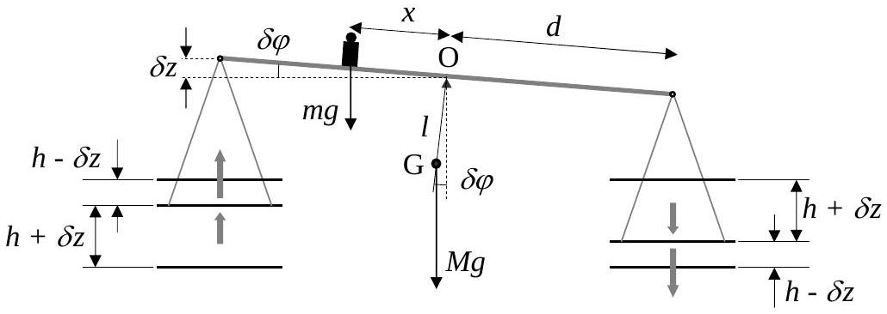

## Th 2 ABSOLUTE MEASUREMENTS OF ELECTRICAL QUANTITIES SOLUTION

1. After some time $t$, the normal to the coil plane makes an angle $\omega t$ with the magnetic field $\vec { B } _ { 0 } = B _ { 0 } \vec { i }$. Then, the magnetic flux through the coil is
$$
\phi = N \vec { B } _ { 0 } \cdot \vec { S }
$$
where the vector surface $\vec { S }$ is given by $\vec { S } = \pi a ^ { 2 } ( \cos \omega t \vec { i } + \sin \omega t \vec { j } )$
Therefore $\quad \phi = N \pi a ^ { 2 } B _ { 0 } \cos \omega t$
The induced electromotive force is
$$
\varepsilon = - \frac { d \phi } { d t } \quad \Rightarrow \quad \varepsilon = N \pi a ^ { 2 } B _ { 0 } \omega \sin \omega t
$$
The instantaneous power is $P = \varepsilon ^ { 2 } / \mathrm { R }$, therefore
$$
\langle P \rangle = \frac { \left( N \pi a ^ { 2 } B _ { 0 } \omega \right) ^ { 2 } } { 2 R }
$$
where we used $\left\langle \sin ^ { 2 } \omega t \right\rangle = \frac { 1 } { T } \int _ { 0 } ^ { T } \sin ^ { 2 } \omega t d t = \frac { 1 } { 2 }$
2. The total field at the center the coil at the instant $t$ is
$$
\vec { B } _ { t } = \vec { B } _ { 0 } + \vec { B } _ { i }
$$
where $\vec { B } _ { i }$ is the magnetic field due to the induced current $\vec { B } _ { i } = B _ { i } ( \cos \omega t \vec { i } + \sin \omega t \vec { j } )$
with
$$
B _ { i } = \frac { \mu _ { 0 } N I } { 2 a } \quad \text { and } \quad I = \varepsilon / R
$$
Therefore $\quad B _ { i } = \frac { \mu _ { 0 } N ^ { 2 } \pi a B _ { 0 } \omega } { 2 R } \sin \omega t$
The mean values of its components are
$$
\begin{aligned}
& \left\langle B _ { i x } \right\rangle = \frac { \mu _ { 0 } N ^ { 2 } \pi a B _ { 0 } \omega } { 2 R } \langle \sin \omega t \cos \omega t \rangle = 0 \\
& \left\langle B _ { i y } \right\rangle = \frac { \mu _ { 0 } N ^ { 2 } \pi a B _ { 0 } \omega } { 2 R } \left\langle \sin ^ { 2 } \omega t \right\rangle = \frac { \mu _ { 0 } N ^ { 2 } \pi a B _ { 0 } \omega } { 4 R }
\end{aligned}
$$
And the mean value of the total magnetic field is
$$
\left\langle \vec { B } _ { t } \right\rangle = B _ { 0 } \vec { i } + \frac { \mu _ { 0 } N ^ { 2 } \pi a B _ { 0 } \omega } { 4 R } \vec { j }
$$
The needle orients along the mean field, therefore
$$
\tan \theta = \frac { \mu _ { 0 } N ^ { 2 } \pi a \omega } { 4 R }
$$

Finally, the resistance of the coil measured by this procedure, in terms of $\theta$, is

$$
R = \frac { \mu _ { 0 } N ^ { 2 } \pi a \omega } { 4 \tan \theta }
$$

3. The force on a unit positive charge in a disk is radial and its modulus is
$$
| \vec { v } \times \vec { B } | = v B = \omega r B
$$
where $B$ is the magnetic field at the center of the coil
$$
B = N \frac { \mu _ { 0 } I } { 2 a }
$$
Then, the electromotive force (e.m.f.) induced on each disk by the magnetic field $B$ is
$$
\varepsilon _ { D } = \varepsilon _ { D ^ { \prime } } = B \omega \int _ { 0 } ^ { b } r d r = \frac { 1 } { 2 } B \omega b ^ { 2 }
$$
Finally, the induced e.m.f. between 1 and 4 is $\varepsilon = \varepsilon _ { D } + \varepsilon _ { D ^ { \prime } }$
$$
\varepsilon = N \frac { \mu _ { 0 } b ^ { 2 } \omega I } { 2 a }
$$
4. When the reading of G vanishes, $I _ { G } = 0$ and Kirchoff laws give an immediate answer. Then we have
$$
\mathcal { E } = I R \quad \Rightarrow \quad R = N \frac { \mu _ { 0 } b ^ { 2 } \omega } { 2 a }
$$
5. The force per unit length $f$ between two indefinite parallel straight wires separated by a distance $h$ is.
$$
f = \frac { \mu _ { 0 } } { 2 \pi } \frac { I _ { 1 } I _ { 2 } } { h }
$$
for $I _ { 1 } = I _ { 2 } = I$ and length $2 \pi a$, the force $F$ induced on $\mathrm { C } _ { 2 }$ by the neighbor coils $\mathrm { C } _ { 1 }$ is
$$
F = \frac { \mu _ { 0 } a } { h } I ^ { 2 }
$$
6. In equilibrium
$$
m g x = 4 F d
$$
Then
$$
\begin{equation*}
m g x = \frac { 4 \mu _ { 0 } a d } { h } I ^ { 2 } \tag{1}
\end{equation*}
$$
so that
$$
I = \left( \frac { m g h x } { 4 \mu _ { 0 } a d } \right) ^ { 1 / 2 }
$$

7. The balance comes back towards the equilibrium position for a little angular deviation $\delta \varphi$ if the gravity torques with respect to the fulcrum O are greater than the magnetic torques.
$$
M g l \sin \delta \varphi + m g x \cos \delta \varphi > 2 \mu _ { 0 } a I ^ { 2 } \left( \frac { 1 } { h - \delta z } + \frac { 1 } { h + \delta z } \right) d \cos \delta \varphi
$$

Therefore, using the suggested approximation
$$
M g l \sin \delta \varphi + m g x \cos \delta \varphi > \frac { 4 \mu _ { 0 } a d I ^ { 2 } } { h } \left( 1 + \frac { \delta z ^ { 2 } } { h ^ { 2 } } \right) \cos \delta \varphi
$$
Taking into account the equilibrium condition (1), one obtains
$$
M g l \sin \delta \varphi > m g x \frac { \delta z ^ { 2 } } { h ^ { 2 } } \cos \delta \varphi
$$
Finally, for $\tan \delta \varphi \approx \sin \delta \varphi = \frac { \delta z } { d }$
$$
\begin{array} { l | l }
\delta z < \frac { M I h ^ { 2 } } { m x d } \quad \Rightarrow & \delta z _ { \max } = \frac { M I h ^ { 2 } } { m x d }
\end{array}
$$

Th 2 ANSWER SHEET
| Question | Basic formulas and ideas used | Analytical results | Marking guideline |
| :--- | :--- | :--- | :--- |
| 1 | $\begin{aligned} & \Phi = N \vec { B } _ { 0 } \cdot \vec { S } \\ & \varepsilon = - \frac { d \Phi } { d t } \\ & P = \frac { \varepsilon ^ { 2 } } { R } \end{aligned}$ | $\begin{aligned} & \varepsilon = N \pi a ^ { 2 } B _ { 0 } \omega \sin \omega t \\ & \langle P \rangle = \frac { \left( N \pi a ^ { 2 } B _ { 0 } \omega \right) ^ { 2 } } { 2 R } \end{aligned}$ | $0.5$ |
| 2 | $\begin{aligned} & \vec { B } = \vec { B } _ { 0 } + \vec { B } _ { i } \\ & B _ { i } = \frac { \mu _ { 0 } N } { 2 a } I \\ & \tan \theta = \frac { \left\langle B _ { y } \right\rangle } { \left\langle B _ { x } \right\rangle } \end{aligned}$ | $R = \frac { \mu _ { 0 } N ^ { 2 } \pi a \omega } { 4 \tan \theta }$ | 2.0 |
| 3 | $\begin{aligned} \vec { E } & = \vec { v } \times \vec { B } \\ v & = \omega r \\ B & = N \frac { \mu _ { 0 } I } { 2 a } \\ \varepsilon & = \int _ { 0 } ^ { b } \vec { E } d \vec { r } \end{aligned}$ | $\varepsilon = N \frac { \mu _ { 0 } b ^ { 2 } \omega I } { 2 a }$ | 2.0 |
| 4 | $\varepsilon = R I$ | $R = N \frac { \mu _ { 0 } b ^ { 2 } \omega } { 2 a }$ | 0,5 |
| 5 | $f = \frac { \mu _ { 0 } } { 2 \pi } \frac { I I ^ { \prime } } { h }$ | $F = \frac { \mu _ { 0 } a } { h } I ^ { 2 }$ | 1.0 |
| 6 | $m g x = 4 F d$ | $I = \left( \frac { m g h x } { 4 \mu _ { 0 } a d } \right) ^ { 1 / 2 }$ | 1.0 |
| 7 | $\Gamma _ { \text {grav } } > \Gamma _ { \text {mag } }$ | $\delta z _ { \text {max } } = \frac { M l h ^ { 2 } } { m x d }$ | 2.0 |
