The 37th International Physics Olympiad Singapore

## Experimental Competition

Wednesday, 12 July, 2006

## Sample Solution

Part 1
a. A sketch of the experimental setup (not required)
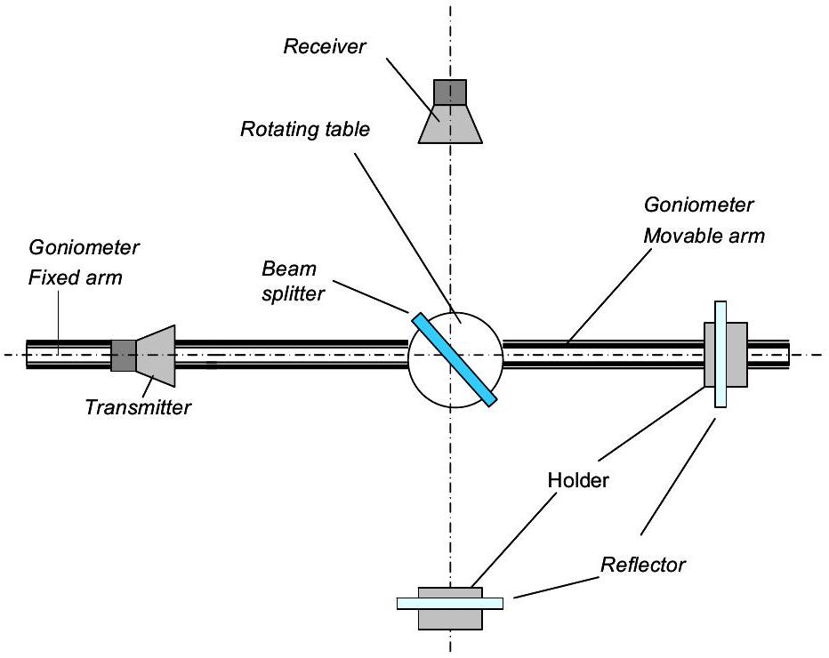

b. Data sheet (not required)
| Position (cm) | Meter reading (mA) | Position (cm) | Meter reading (mA) | Position (cm) | Meter reading (mA) | Position (cm) | Meter reading (mA) |
| :--- | :--- | :--- | :--- | :--- | :--- | :--- | :--- |
| 104.0 | 0.609 | 100.9 | 1.016 | 96.0 | 0.514 | 91.0 | 0.925 |
| 103.9 | 0.817 | 100.85 | 1.060 | 95.8 | 0.098 | 90.9 | 1.094 |
| 103.8 | 0.933 | 100.8 | 1.090 | 95.6 | 0.192 | 90.8 | 1.245 |
| 103.7 | 1.016 | 100.7 | 0.994 | 95.4 | 0.669 | 90.7 | 1.291 |
| 103.6 | 1.030 | 100.6 | 0.940 | 95.3 | 0.870 | 90.6 | 1.253 |
| 103.5 | 0.977 | 100.4 | 0.673 | 95.2 | 1.009 | 90.4 | 0.978 |
| 103.4 | 0.890 | 100.2 | 0.249 | 95.1 | 1.119 | 90.2 | 0.462 |
| 103.3 | 0.738 | 100.0 | 0.074 | 95.0 | 1.138 | 90.0 | 0.045 |
| 103.2 | 0.548 | 99.8 | 0.457 | 94.9 | 1.080 | 89.8 | 0.278 |
| 103.1 | 0.310 | 99.6 | 0.883 | 94.7 | 0.781 | 89.6 | 0.809 |
| 103.0 | 0.145 | 99.4 | 1.095 | 94.5 | 0.403 | 89.5 | 1.031 |
| 102.9 | 0.076 | 99.3 | 1.111 | 94.3 | 0.044 | 89.4 | 1.235 |
| 102.8 | 0.179 | 99.2 | 1.022 | 94.1 | 0.364 | 89.3 | 1.277 |
| 102.7 | 0.392 | 99.0 | 0.787 | 93.9 | 0.860 | 89.2 | 1.298 |
| 102.6 | 0.623 | 98.8 | 0.359 | 93.7 | 1.103 | 89.1 | 1.252 |
| 102.5 | 0.786 | 98.6 | 0.079 | 93.6 | 1.160 | 89.0 | 1.133 |
| 102.4 | 0.918 | 98.4 | 0.414 | 93.5 | 1.159 | 88.8 | 0.684 |
| 102.3 | 0.988 | 98.2 | 0.864 | 93.4 | 1.083 | 88.6 | 0.123 |
| 102.2 | 1.026 | 98.. 0 | 1.128 | 93.2 | 0.753 | 88.5 | -0.020 |
| 102.1 | 1.006 | 97.9 | 1.183 | 93.0 | 0.331 | 88.4 | 0.123 |
| 102.0 | 0.945 | 97.8 | 1.132 | 92.8 | 0.073 | 88.2 | 0.679 |
| 101.9 | 0.747 | 97.7 | 1.015 | 92.6 | 0.515 | 88.0 | 1.116 |
| 101.8 | 0.597 | 97.5 | 0.713 | 92.4 | 0.968 | 87.9 | 1.265 |
| 101.7 | 0.363 | 97.2 | 0.090 | 92.2 | 1.217 | 87.8 | 1.339 |
| 101.6 | 0.161 | 97.0 | 0.342 | 92.15 | 1.234 | 87.7 | 1.313 |
| 101.5 | 0.055 | 96.8 | 0.714 | 92.1 | 1.230 | 87.6 | 1.190 |
| 101.4 | 0.139 | 96.6 | 1.007 | 92.0 | 1.165 | 87.4 | 0.867 |
| 101.3 | 0.357 | 96.5 | 1.087 | 91.8 | 0.871 | 87.2 | 0.316 |

| 101.2 | 0.589 | 96.4 | 1.070 | 91.6 | 0.353 | 87.1 | 0.034 |
| :--- | :--- | :--- | :--- | :--- | :--- | :--- | :--- |
| 101.1 | 0.781 | 96.3 | 1.018 | 91.4 | 0.018 | 87.0 | -0.018 |
| 101.0 | 0.954 | 96.2 | 0.865 | 91.2 | 0.394 | 86.9 | 0.178 |
| 104.0 | 0.609 | 100.9 | 1.016 | 96.0 | 0.514 | 91.0 | 0.925 |
| 103.9 | 0.817 | 100.8 | 1.060 | 95.8 | 0.098 | 90.9 | 1.094 |
| 103.8 | 0.933 | 100.8 | 1.090 | 95.6 | 0.192 | 90.8 | 1.245 |
| 103.7 | 1.016 | 100.7 | 0.994 | 95.4 | 0.669 | 90.7 | 1.291 |
| 103.6 | 1.030 | 100.6 | 0.940 | 95.3 | 0.870 | 90.6 | 1.253 |
| 103.5 | 0.977 | 100.4 | 0.673 | 95.2 | 1.009 | 90.4 | 0.978 |
| 103.4 | 0.890 | 100.2 | 0.249 | 95.1 | 1.119 | 90.2 | 0.462 |
| 103.3 | 0.738 | 100.0 | 0.074 | 95.0 | 1.138 | 90.0 | 0.045 |
| 103.2 | 0.548 | 99.8 | 0.457 | 94.9 | 1.080 | 89.8 | 0.278 |
| 103.1 | 0.310 | 99.6 | 0.883 | 94.7 | 0.781 | 89.6 | 0.809 |
| 103.0 | 0.145 | 99.4 | 1.095 | 94.5 | 0.403 | 89.5 | 1.031 |
| 102.9 | 0.076 | 99.3 | 1.111 | 94.3 | 0.044 | 89.4 | 1.235 |
| 102.8 | 0.179 | 99.2 | 1.022 | 94.1 | 0.364 | 89.3 | 1.277 |
| 102.7 | 0.392 | 99.0 | 0.787 | 93.9 | 0.860 | 89.2 | 1.298 |
| 102.6 | 0.623 | 98.8 | 0.359 | 93.7 | 1.103 | 89.1 | 1.252 |
| 102.5 | 0.786 | 98.6 | 0.079 | 93.6 | 1.160 | 89.0 | 1.133 |
| 102.4 | 0.918 | 98.4 | 0.414 | 93.5 | 1.159 | 88.8 | 0.684 |
| 102.3 | 0.988 | 98.2 | 0.864 | 93.4 | 1.083 | 88.6 | 0.123 |
| 102.2 | 1.026 | 98.0 | 1.128 | 93.2 | 0.753 | 88.5 | -0.020 |
| 102.1 | 1.006 | 97.9 | 1.183 | 93.0 | 0.331 | 88.4 | 0.123 |
| 102.0 | 0.945 | 97.8 | 1.132 | 92.8 | 0.073 | 88.2 | 0.679 |
| 101.9 | 0.747 | 97.7 | 1.015 | 92.6 | 0.515 | 88.0 | 1.116 |
| 101.8 | 0.597 | 97.5 | 0.713 | 92.4 | 0.968 | 87.9 | 1.265 |
| 101.7 | 0.363 | 97.2 | 0.090 | 92.2 | 1.217 | 87.8 | 1.339 |
| 101.6 | 0.161 | 97.0 | 0.342 | 92.15 | 1.234 | 87.7 | 1.313 |
| 101.5 | 0.055 | 96.8 | 0.714 | 92.1 | 1.230 | 87.6 | 1.190 |
| 101.4 | 0.139 | 96.6 | 1.007 | 92.0 | 1.165 | 87.4 | 0.867 |
| 101.3 | 0.357 | 96.5 | 1.087 | 91.8 | 0.871 | 87.2 | 0.316 |
| 101.2 | 0.589 | 96.4 | 1.070 | 91.6 | 0.353 | 87.1 | 0.034 |
| 101.1 | 0.781 | 96.3 | 1.018 | 91.4 | 0.018 | 87.0 | -0.018 |
| 101.0 | 0.954 | 96.2 | 0.865 | 91.2 | 0.394 | 86.9 | 0.178 |

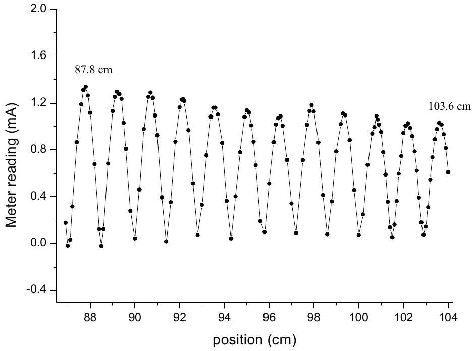

From the graph (not required) or otherwise, the positions of the first maximum point and $12 ^ { \text {th } }$ maximum point are measured at 87.8 cm and 103.6 cm.

The wavelength is calculated by

$$
\frac { \lambda } { 2 } = \frac { 103.6 - 87.8 } { 11 } \mathrm {~cm}
$$

1.8 marks
Thus, $\quad \lambda = 2.87 \mathrm {~cm}$.

Error analysis

$$
\begin{aligned}
& \lambda = \frac { 2 } { 11 } d , \quad \Delta d = 0.05 \times 2 \mathrm {~cm} = 0.1 \mathrm {~cm} . \\
& | \Delta \lambda | = \left| \frac { 2 } { 11 } \Delta d \right| = \frac { 2 } { 11 } \times 0.10 = 0.018 \mathrm {~cm} < 0.02 \mathrm {~cm} \quad 0.2 \text { marks }
\end{aligned}
$$

## Part 2

(a) Deduction of interference conditions
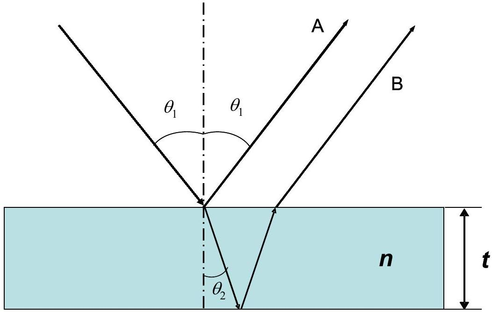
Assume that the thickness of the film is $t$ and refractive index $n$. Let $\theta _ { 1 }$ be the incident angle and $\theta _ { 2 }$ the refracted angle. The difference of the optical paths $\Delta L$ is:
$$
\Delta L = 2 \left( n t / \cos \theta _ { 2 } - t \tan \theta _ { 2 } \sin \theta _ { 1 } \right)
$$
Law of refraction:
$$
\sin \theta _ { 1 } = n \sin \theta _ { 2 }
$$
Thus
$$
\Delta L = 2 t \sqrt { n ^ { 2 } - \sin ^ { 2 } \theta _ { 1 } }
$$
Considering the $180 \operatorname { deg } ( \pi )$ phase shift at the air- thin film interface for the reflected beam, we have interference conditions:
$$
2 t \sqrt { n ^ { 2 } - \sin ^ { 2 } \theta } \min = m \lambda \quad ( m = 1,2,3 , \ldots ) \quad \text { for the destructive peak }
$$
and
$$
2 t \sqrt { n ^ { 2 } - \sin ^ { 2 } \theta } \max = \left( m \pm \frac { 1 } { 2 } \right) \lambda \quad \text { for the constructive peak }
$$
□ 1 mark If thickness $t$ and wave length $\lambda$ are known, one can determine the refractive index of the thin film from $I - \theta _ { 1 }$ spectrum ( $I$ is the intensity of the interfered beam).

(b)A sketch of the experimental setup

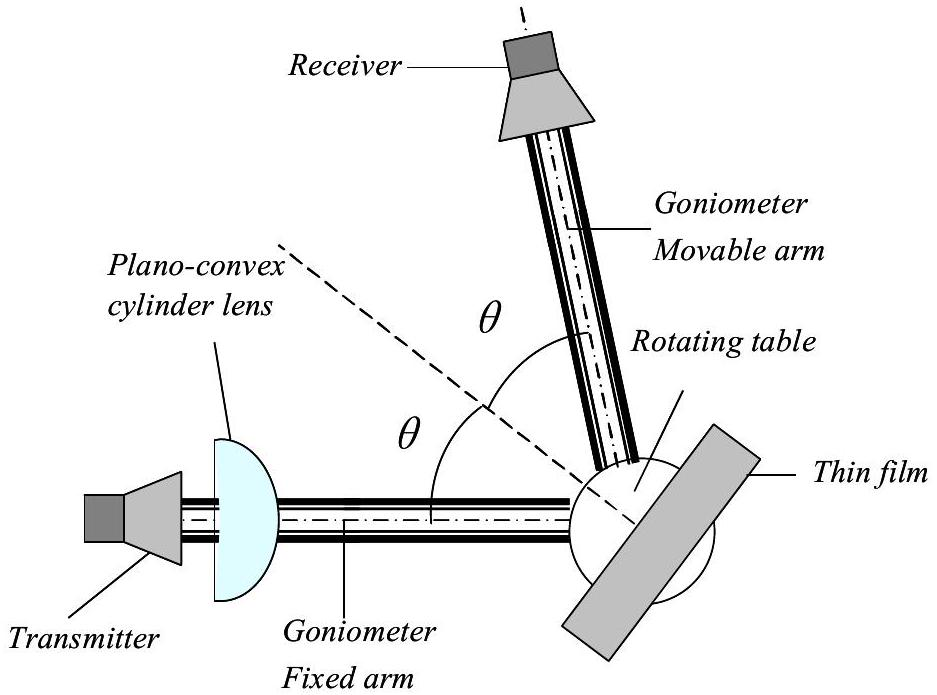
Students should use the labeling on Page 2.

1 mark
(c)Data Set

| X: $\theta _ { l } /$ degree | Y: Meter reading S/mA |
| :--- | :--- |
| 40.0 | 0.309 |
| 41.0 | 0.270 |
| 42.0 | 0.226 |
| 43.0 | 0.196 |
| 44.0 | 0.164 |
| 45.0 | 0.114 |
| 46.0 | 0.063 |
| 47.0 | 0.036 |
| 48.0 | 0.022 |
| 49.0 | 0.039 |
| 50.0 | 0.066 |
| 51.0 | 0.135 |
| 52.0 | 0.215 |
| 53.0 | 0.262 |
| 54.0 | 0.321 |
| 55.0 | 0.391 |
| 56.0 | 0.454 |
| 57.0 | 0.511 |

| 58.0 | 0.566 |
| :--- | :--- |
| 59.0 | 0.622 |
| 60.0 | 0.664 |
| 61.0 | 0.691 |
| 62.0 | 0.722 |
| 63.0 | 0.754 |
| 64.0 | 0.796 |
| 65.0 | 0.831 |
| 66.0 | 0.836 |
| 67.0 | 0.860 |
| 68.0 | 0.904 |
| 69.0 | 0.970 |
| 70.0 | 1.022 |
| 71.0 | 1.018 |
| 72.0 | 0.926 |
| 73.0 | 0.800 |
| 74.0 | 0.770 |
| 75.0 | 0.915 |

0.5 marks

Uncertainty: angle $\Delta \theta _ { 1 } = \pm 0.5 ^ { \circ }$, current: $\pm 0.001 \mathrm {~mA}$
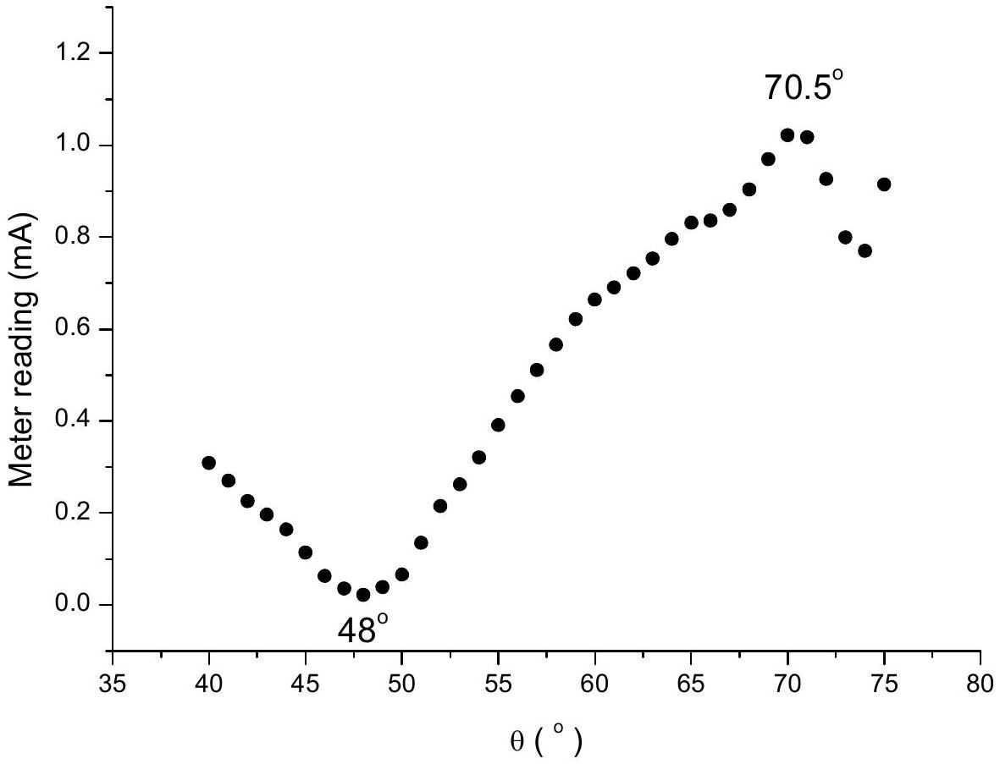

From the data, $\theta _ { \text {min } }$ and $\theta _ { \text {max } }$ can be found at $48 ^ { \circ }$ and $70.5 ^ { \circ }$ respectively.
To calculate the refractive index, the following equations are used:
0.9 marks
0.6 marks

$$
\begin{equation*}
2 t \sqrt { n ^ { 2 } - \sin ^ { 2 } 48 ^ { \circ } } = m \lambda \quad ( m = 1,2,3 , \ldots ) \tag{1}
\end{equation*}
$$

and

$$
\begin{equation*}
2 t \sqrt { n ^ { 2 } - \sin ^ { 2 } 70.5 ^ { \circ } } = \left( m - \frac { 1 } { 2 } \right) \lambda \tag{2}
\end{equation*}
$$

In this experiment, $t = 5.28 \mathrm {~cm} , \lambda = 2.85 \mathrm {~cm}$ (measured using other method).
Solving the simultaneous equations (1) and (2), we get

$$
\begin{aligned}
& m = \frac { \sin ^ { 2 } 70.5 ^ { \circ } - \sin ^ { 2 } 48 ^ { \circ } } { \left( \frac { \lambda } { 2 t } \right) ^ { 2 } } + 0.25 \\
& m = 4.83 \xrightarrow { } m = 5
\end{aligned}
$$

1 mark
Substituting $m = 5$ in (1), we get $n = 1.54$
Substituting $m = 5$ in (2), we also get $n = 1.54$
0.5 marks

Error analysis:

$$
\begin{aligned}
& \quad n = \sqrt { \sin ^ { 2 } \theta + \left( \frac { m \lambda } { 2 t } \right) ^ { 2 } } \\
& \Delta n = \frac { 1 } { \sqrt { \sin ^ { 2 } \theta + \left( \frac { m \lambda } { 2 t } \right) ^ { 2 } } } \left( \sin 2 \theta \bullet \Delta \theta + \frac { m ^ { 2 } \lambda } { 2 t ^ { 2 } } \Delta \lambda - \frac { m ^ { 2 } \lambda ^ { 2 } } { 2 t ^ { 3 } } \Delta t \right) \\
& = \frac { 1 } { n } \left( \sin 2 \theta \bullet \Delta \theta + \frac { m ^ { 2 } \lambda } { 2 t ^ { 2 } } \Delta \lambda - \frac { m ^ { 2 } \lambda ^ { 2 } } { 2 t ^ { 3 } } \Delta t \right)
\end{aligned}
$$

If we take $\Delta \theta = \pm 0.5 ^ { \circ } = \pm 0.0087 \mathrm { rad } , \Delta t = \pm 0.05 \mathrm {~cm} , \Delta \lambda = \pm 0.02 \mathrm {~cm}$, and $\theta = 48 ^ { \circ }$

$$
\Delta n = \frac { 1 } { 1.54 } \left( 0.0087 \sin 96 ^ { o } + \frac { 5 ^ { 2 } \times 2.85 } { 2 \times 5.28 ^ { 2 } } \times 0.01 + \frac { 5 ^ { 2 } \times 2.85 ^ { 2 } } { 2 \times 5.28 ^ { 3 } } \times 0.05 \right) \approx 0.02
$$

Thus,

$$
n + \Delta n = 1.54 \pm 0.02
$$

0.5 marks

## Part 3

## Sample Solution

Task 1
Sketch your final experimental setup and mark all components using the labels given at page 2. In your sketch, write down the distance z (see Figure 3.2), where z is the distance from the tip of the prism to the central axis of the transmitter.

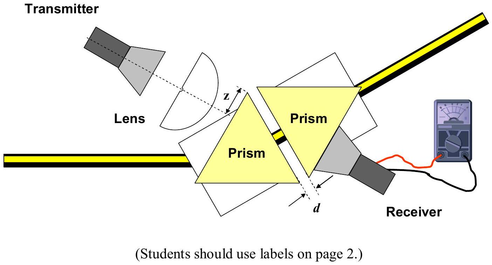
Task 2
Tabulate your data. Perform the experiment twice.

Data Set
| X: $d ( \mathrm {~cm} )$ | $\Delta \mathrm { X } ( \mathrm { cm } )$ | Set 1 $S _ { 1 } ( \mathrm {~mA} )$ | Set 2 $S _ { 2 } ( \mathrm {~mA} )$ | $S _ { \text {average } }$ (mA) | $\Delta S ( \mathrm {~mA} ) ^ { \# }$ | $I _ { t } ( \mathrm {~mA} ) ^ { 2 * }$ | $\Delta \left( I _ { \mathrm { t } } \right) ^ { \mathrm { S } }$ | $\mathrm { Y } : \ln \left( I _ { \mathrm { t } } ( \mathrm { mA } ) ^ { 2 } \right)$ | $\Delta \mathrm { Y } ^ { \& }$ |
| :--- | :--- | :--- | :--- | :--- | :--- | :--- | :--- | :--- | :--- |
| 0.60 | 0.05 | 0.78 | 0.78 | 0.780 | 0.01 | 0.6080 | 0.016 | -0.50 | 0.03 |
| 0.70 | 0.05 | 0.68 | 0.69 | 0.685 | 0.01 | 0.4690 | 0.014 | -0.76 | 0.03 |
| 0.80 | 0.05 | 0.58 | 0.59 | 0.585 | 0.01 | 0.3420 | 0.012 | -1.07 | 0.03 |
| 0.90 | 0.05 | 0.50 | 0.51 | 0.505 | 0.01 | 0.2550 | 0.010 | -1.37 | 0.04 |
| 1.00 | 0.05 | 0.42 | 0.42 | 0.420 | 0.01 | 0.1760 | 0.008 | -1.74 | 0.05 |
| 1.10 | 0.05 | 0.36 | 0.35 | 0.355 | 0.01 | 0.1260 | 0.007 | -2.07 | 0.06 |
| 1.20 | 0.05 | 0.31 | 0.31 | 0.310 | 0.01 | 0.0961 | 0.006 | -2.34 | 0.06 |
| 1.30 | 0.05 | 0.26 | 0.25 | 0.255 | 0.01 | 0.0650 | 0.005 | -2.73 | 0.08 |
| 1.40 | 0.05 | 0.21 | 0.22 | 0.215 | 0.01 | 0.0462 | 0.004 | -3.07 | 0.09 |

[^0]

## Task 3

By plotting appropriate graphs, determine the refractive index, $n _ { 1 }$, of the prism with error analysis. Write the refractive index $n _ { 1 }$, and its uncertainty $\Delta n _ { 1 }$, of the prism in the answer sheet provided.
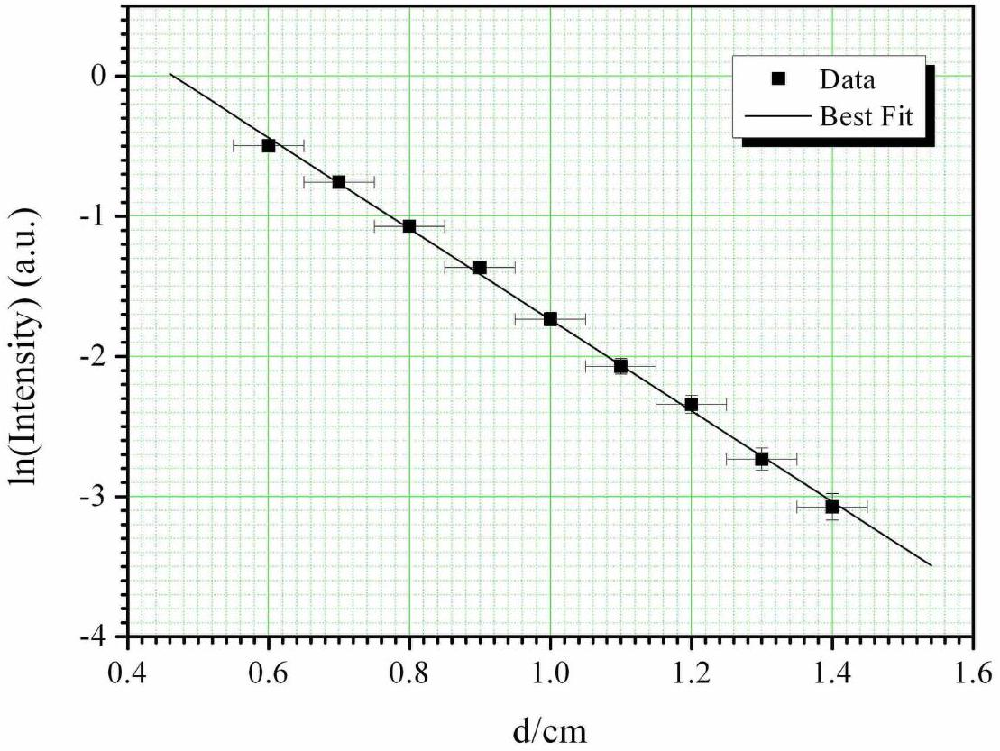

## Least Square Fitting

| $\mathrm { X } = d ( \mathrm {~cm} )$ | $\Delta \mathrm { X } ( \mathrm { cm } )$ | $\mathrm { Y } = \ln \left( I _ { \mathrm { t } } \right)$ | $\Delta \mathrm { Y }$ | $\Delta \mathrm { Y } ^ { 2 }$ | XY | $\mathrm { X } ^ { 2 }$ | $\mathrm { Y } ^ { 2 }$ |
| :--- | :--- | :--- | :--- | :--- | :--- | :--- | :--- |
| 0.60 | 0.05 | -0.50 | 0.03 | 0.001 | -0.298 | 0.360 | 0.247 |
| 0.70 | 0.05 | -0.76 | 0.03 | 0.001 | -0.530 | 0.490 | 0.573 |
| 0.80 | 0.05 | -1.07 | 0.03 | 0.001 | -0.858 | 0.640 | 1.150 |
| 0.90 | 0.05 | -1.37 | 0.04 | 0.002 | -1.230 | 0.810 | 1.867 |
| 1.00 | 0.05 | -1.74 | 0.05 | 0.002 | -1.735 | 1.000 | 3.010 |
| 1.10 | 0.05 | -2.07 | 0.06 | 0.003 | -2.278 | 1.210 | 4.290 |
| 1.20 | 0.05 | -2.34 | 0.06 | 0.004 | -2.811 | 1.440 | 5.487 |
| 1.30 | 0.05 | -2.73 | 0.08 | 0.006 | -3.553 | 1.690 | 7.469 |
| 1.40 | 0.05 | -3.07 | 0.09 | 0.009 | -4.304 | 1.960 | 9.451 |
|  |  |  |  |  |  |  |  |
| $\Sigma \mathrm { X } =$ |  | $\Sigma \mathrm { Y } =$ | $\Sigma \Delta \mathrm { Y } =$ | $\Sigma ( \Delta \mathrm { Y } ) ^ { 2 } =$ | $\Sigma \mathrm { XY } =$ | $\Sigma \mathrm { X } ^ { 2 } =$ | $\Sigma \mathrm { Y } ^ { 2 } =$ |
| 9.00 |  | -15.648 | 0.469 | 0.029 | -17.596 | 9.600 | 33.544 |

From $I _ { t } = I _ { 0 } \exp ( - 2 \gamma d )$, taking natural log on both sides, we obtain:

$$
\ln \left( I _ { t } \right) = - 2 \gamma d + \ln \left( I _ { 0 } \right)
$$

which is of the form $y = m x + c$.

To calculate the gradient, the following equation was used, where $N$ is the number of data points:

$$
m = \frac { N \sum ( X Y ) - \left( \sum X \right) \left( \sum Y \right) } { N \sum X ^ { 2 } - \left( \sum X \right) ^ { 2 } } = - 3.247
$$

To calculate the standard deviation $\sigma _ { \mathrm { Y } }$ of the individual Y data values, the following equation was used:

$$
\sigma _ { Y } = \sqrt { \frac { \sum ( \Delta Y ) ^ { 2 } } { N - 2 } } = 0.064
$$

Hence the standard deviation in the slope can be calculated:

$$
\sigma _ { m } = \sigma _ { Y } \sqrt { \frac { N } { N \sum X ^ { 2 } - \left( \sum X \right) ^ { 2 } } } = 0.082
$$

From the gradient:

$$
\begin{aligned}
2 \gamma & = 3.247 \pm 0.082 \\
& \approx 3.25 \pm 0.08
\end{aligned}
$$

Using:

$$
n _ { 1 } = \frac { \sqrt { k _ { 2 } ^ { 2 } + \gamma ^ { 2 } } } { k _ { 2 } \sin \theta _ { 1 } }
$$

where $\theta _ { 1 } = 60 ^ { \circ } , k _ { 2 } = 2 \pi / \lambda \approx 2.20$ (using the wavelength determined from earlier part (using $\lambda = ( 2.85 \pm 0.02 ) \mathrm { cm }$ ), we obtain:

$$
\begin{aligned}
n _ { 1 } \pm \Delta n _ { 1 } & = 1.434 \pm 0.016 \\
& \approx 1.43 \pm 0.02
\end{aligned}
$$

Error Analysis for refractive index of $n _ { 1 }$

$$
\begin{aligned}
\Delta n _ { 1 } & = \frac { d } { d k _ { 2 } } \left[ \frac { \left( k _ { 2 } ^ { 2 } + \gamma ^ { 2 } \right) ^ { 1 / 2 } } { k _ { 2 } \sin \theta _ { 1 } } \right] \Delta k _ { 2 } + \frac { d } { d \gamma } \left[ \frac { \left( k _ { 2 } ^ { 2 } + \gamma ^ { 2 } \right) ^ { 1 / 2 } } { k _ { 2 } \sin \theta _ { 1 } } \right] \Delta \gamma \\
\Delta n _ { 1 } & = \left[ \frac { \left( k _ { 2 } ^ { 2 } + \gamma ^ { 2 } \right) ^ { - 1 / 2 } } { \sin \theta _ { 1 } } - \frac { \left( k _ { 2 } ^ { 2 } + \gamma ^ { 2 } \right) ^ { 1 / 2 } } { k _ { 2 } ^ { 2 } \sin \theta _ { 1 } } \right] \Delta k _ { 2 } + \left[ \frac { \gamma \left( k _ { 2 } ^ { 2 } + \gamma ^ { 2 } \right) ^ { - 1 / 2 } } { k _ { 2 } \sin \theta _ { 1 } } \right] \Delta \gamma \\
& = 0.016 \\
& \approx 0.02
\end{aligned}
$$

where:

$$
\Delta k _ { 2 } = - \frac { 2 \pi } { \lambda ^ { 2 } } \Delta \lambda = - 0.015
$$

Note: Other methods of error analysis are also accepted.

## Part 4

Task 1
Top-view of a simple square lattice.

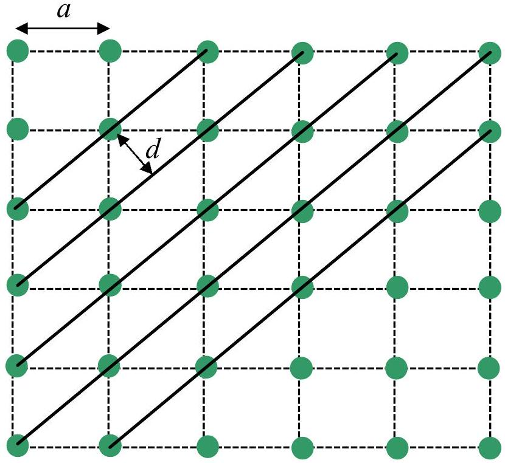
Figure 4.1: Schematic diagram of a simple square lattice with lattice constant a and interplaner $d$ of the diagonal planes indicated.

0.5 marks

Deriving Bragg's Law
Conditions necessary for the observation of diffraction peaks:

1. The angle of incidence = angle of scattering.
2. The pathlength difference is equal to an integer number of wavelengths.

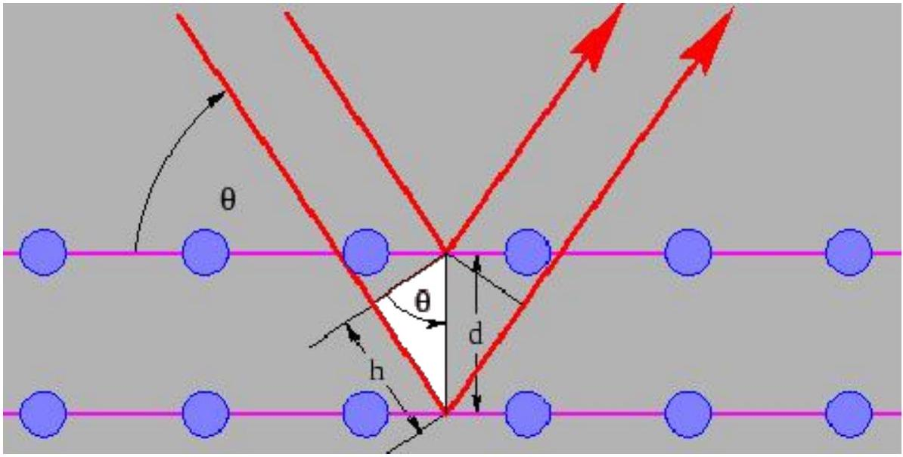
Figure 4.2: Schematic diagram for deriving Bragg's law.

$$
\begin{equation*}
h = d \sin \theta \tag{1}
\end{equation*}
$$

The path length difference is given by,

$$
\begin{equation*}
2 h = 2 d \sin \theta \tag{2}
\end{equation*}
$$

For diffraction to occur, the path difference must satisfy,

$$
\begin{equation*}
2 d \sin \theta = m \lambda , \tag{3}
\end{equation*}
$$

$$
m = 1,2,3 \ldots
$$
Figure 4.3 Illustration of the lattice used in the experiment (this Figure is not required)

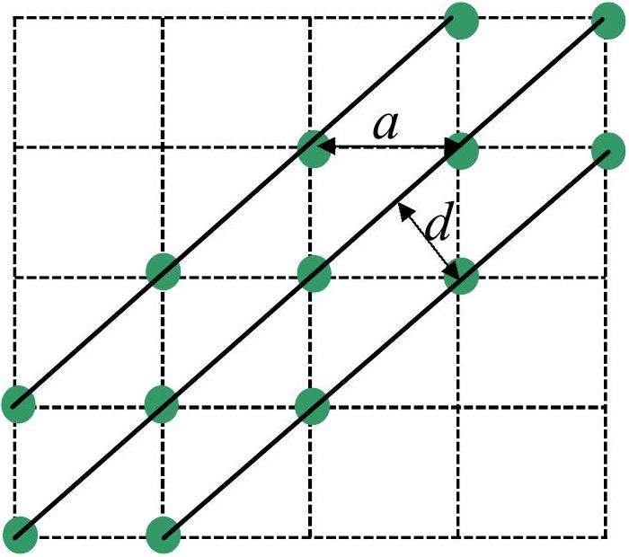
Figure 4.3 Illustration of the lattice used in the experiment (this Figure is not required)

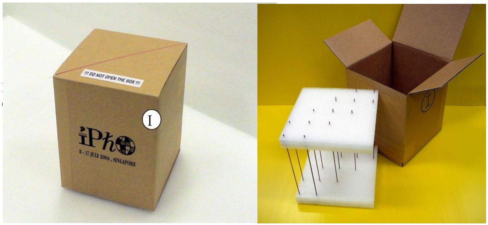
Fig. 4.4 The actual lattice used in the experiment (not required)

Task 2 (a)

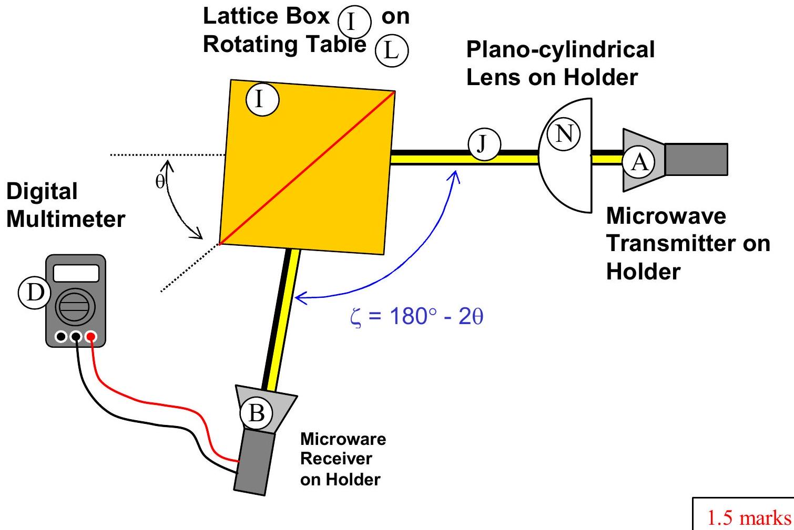
Fig. 4.5 Sketch of the experimental set up

Data Set

Task 2(b) \& 2(c)
| 0/° | $\zeta ^ { / 0 }$ | Output current S (mA) | Intensity $I = S ^ { 2 }$ (mA) ${ } ^ { 2 }$ |
| :--- | :--- | :--- | :--- |
| 20.0 | 140.0 | 0.023 | 0.000529 |
| 21.0 | 138.0 | 0.038 | 0.001444 |
| 22.0 | 136.0 | 0.070 | 0.0049 |
| 23.0 | 134.0 | 0.109 | 0.011881 |
| 24.0 | 132.0 | 0.163 | 0.026569 |
| 25.0 | 130.0 | 0.201 | 0.040401 |
| 26.0 | 128.0 | 0.233 | 0.054289 |
| 27.0 | 126.0 | 0.275 | 0.075625 |
| 28.0 | 124.0 | 0.320 | 0.1024 |
| 29.0 | 122.0 | 0.350 | 0.1225 |
| 30.0 | 120.0 | 0.353 | 0.124609 |
| 31.0 | 118.0 | 0.358 | 0.128164 |
| 32.0 | 116.0 | 0.354 | 0.125316 |
| 33.0 | 114.0 | 0.342 | 0.116964 |
| 34.0 | 112.0 | 0.321 | 0.103041 |
| 35.0 | 110.0 | 0.303 | 0.091809 |
| 36.0 | 108.0 | 0.280 | 0.0784 |
| 37.0 | 106.0 | 0.241 | 0.058081 |
| 38.0 | 104.0 | 0.200 | 0.04 |
| 39.0 | 102.0 | 0.183 | 0.033489 |
| 40.0 | 100.0 | 0.162 | 0.026244 |
| 41.0 | 98.0 | 0.139 | 0.019321 |
| 42.0 | 96.0 | 0.120 | 0.0144 |
| 43.0 | 94.0 | 0.109 | 0.011881 |
| 44.0 | 92.0 | 0.086 | 0.007396 |
| 45.0 | 90.0 | 0.066 | 0.004356 |
| 46.0 | 88.0 | 0.067 | 0.004489 |
| 47.0 | 86.0 | 0.066 | 0.004356 |
| 48.0 | 84.0 | 0.070 | 0.0049 |
| 49.0 | 82.0 | 0.084 | 0.007056 |
| 50.0 | 80.0 | 0.080 | 0.0064 |

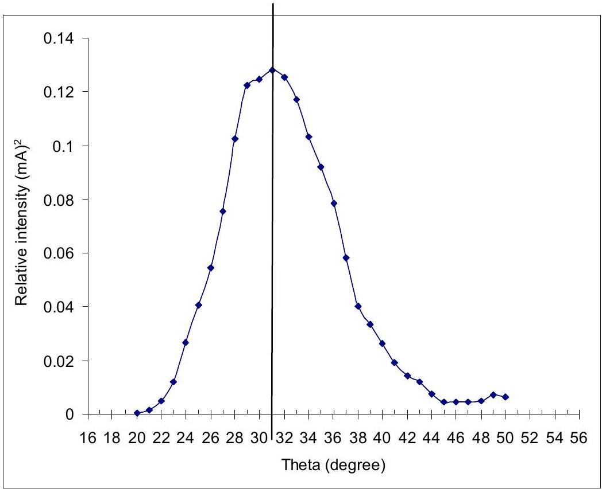
2.7 marks

Task 2(d)
From eq 3 and let $m = 1$,

$$
\begin{equation*}
2 d \sin \theta _ { \max } = \lambda \tag{4}
\end{equation*}
$$

From Fig. 4.3,

$$
\begin{equation*}
a = \sqrt { 2 } d \tag{5}
\end{equation*}
$$

Combine eqs (4) and (5), we obtain,

$$
a = \frac { \lambda } { \sqrt { 2 } \sin \theta _ { \max } }
$$

From the symmetry of the data, the peak position is determined to be:
$\theta _ { \text {max } } = 31 ^ { \circ }$ (The theoretical value is $\theta _ { \text {max } } = 329$

$$
a = \frac { \lambda } { \sqrt { 2 } \sin \theta _ { \max } } = \frac { 2.85 \mathrm {~cm} } { \sqrt { 2 } \sin 31 ^ { \circ } } = 3.913 \mathrm {~cm}
$$

(Actual value $\mathrm { a } = 3.80 \mathrm {~cm}$ )
[The value 3.55 in the marking scheme is derived from:

$$
a = \frac { \lambda } { \sqrt { 2 } \sin \theta _ { \max } } = \frac { 2.83 \mathrm {~cm} } { \sqrt { 2 } \sin 34 ^ { \circ } } = 3.58 \mathrm {~cm}
$$

where 2.83 cm and 34 deg are the min and max allowed values for wavelength and peak position.

Similarly:
The value 4.10 is derived from: $a = \frac { \lambda } { \sqrt { 2 } \sin \theta _ { \max } } = \frac { 2.87 c m } { \sqrt { 2 } \sin 30 ^ { \circ } } = 4.06 c m$
The value 3.55 is derived from: $a = \frac { \lambda } { \sqrt { 2 } \sin \theta _ { \max } } = \frac { 2.83 \mathrm {~cm} } { \sqrt { 2 } \sin 34 ^ { \circ } } = 3.58 \mathrm {~cm}$
The value 3.40 is derived from: $a = \frac { \lambda } { \sqrt { 2 } \sin \theta _ { \max } } = \frac { 2.83 \mathrm {~cm} } { \sqrt { 2 } \sin 35 ^ { \circ } } = 3.49 \mathrm {~cm}$
The value 4.20 is derived from: $a = \frac { \lambda } { \sqrt { 2 } \sin \theta _ { \max } } = \frac { 2.87 c m } { \sqrt { 2 } \sin 29 ^ { \circ } } = 4.18 c m$ ]
Error analysis:
Known uncertainties:

$$
\begin{aligned}
& \Delta \lambda = 0.02 \mathrm {~cm} ; \\
& \Delta \theta = 0.5 \mathrm { deg } = 0.014 \mathrm { rad } . \quad \text { (uncertainty in determining } \theta \text { from graph). }
\end{aligned}
$$

From: $\quad a = \frac { \lambda } { \sqrt { 2 } \sin \theta _ { \text {max } } }$

$$
\begin{aligned}
& \Delta a = \frac { \Delta \lambda } { \sqrt { 2 } \sin \theta _ { \max } } - \frac { \lambda } { \sqrt { 2 } \left( \sin \theta _ { \max } \right) ^ { 2 } } \frac { d } { d \theta } \left( \sin \theta _ { \max } \right) \Delta \theta \\
& = a \left( \frac { \Delta \lambda } { \lambda } - \frac { 1 } { \sin \theta _ { \max } } \frac { d } { d \theta } \left( \sin \theta _ { \max } \right) \Delta \theta \right) \\
& = a \left( \frac { \Delta \lambda } { \lambda } - \cot \theta _ { \max } \Delta \theta \right) \\
& = 3.80 \left( \frac { 0.02 } { 2.85 } - \cot \left( 32 ^ { \circ } \right) \times ( - 0.014 ) \right) \mathrm { cm } \\
& = 0.112 \mathrm {~cm} \approx 0.1
\end{aligned}
$$

Hence:

$$
\begin{aligned}
a \pm \Delta a & = 3.913 \pm 0.112 \\
& \approx 3.9 \pm 0.1 \mathrm {~cm}
\end{aligned}
$$

[^0]:    ${ } ^ { \# } \Delta S = 0.01 \mathrm {~mA}$ (for each set of current measurements)

    * $S ^ { 2 }$ proportional to the intensity, $I _ { \mathrm { t } }$
    ${ } ^ { \mathrm { s } } \Delta \left( S ^ { 2 } \right) = \Delta I _ { \mathrm { t } } = 2 S \times \Delta S$
    ${ } ^ { \& } \Delta \mathrm { Y } = \Delta \left( \ln I _ { \mathrm { t } } \right) = \Delta \left( I _ { t } \right) / I _ { \mathrm { t } }$
