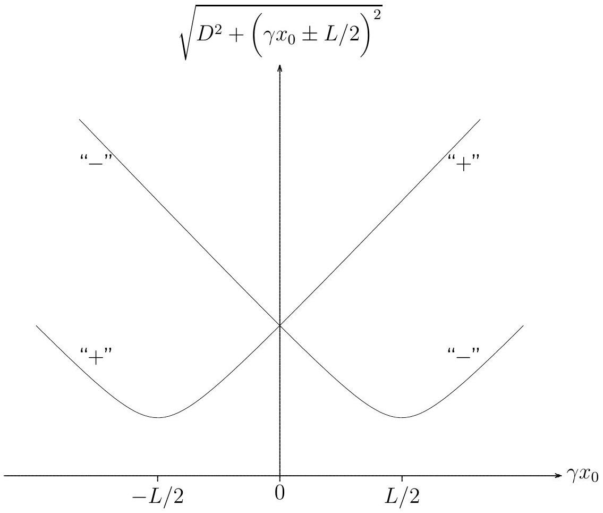

## SOLUTIONS to Theory Question 2

Basic relations Position $\tilde { x }$ shows up on the picture if light was emitted from there at an instant that is earlier than the instant of the picture taking by the light travel time $T$ that is given by

$$
T = \sqrt { D ^ { 2 } + \tilde { x } ^ { 2 } } / c .
$$

During the lapse of $T$ the respective segment of the rod has moved the distance $v T$, so that its actual position $x$ at the time of the picture taking is
2.1

$$
x = \tilde { x } + \beta \sqrt { D ^ { 2 } + \tilde { x } ^ { 2 } } .
$$

Upon solving for $\tilde { x }$ we find
2.2

$$
\tilde { x } = \gamma ^ { 2 } x - \beta \gamma \sqrt { D ^ { 2 } + ( \gamma x ) ^ { 2 } } .
$$

Apparent length of the rod Owing to the Lorentz contraction, the actual length of the moving rod is $L / \gamma$, so that the actual positions of the two ends of the rod are

$$
x _ { \pm } = x _ { 0 } \pm \frac { L } { 2 \gamma } \text { for the } \left\{ \begin{array} { c }
\text { front end } \\
\text { rear end }
\end{array} \right\} \text { of the rod. }
$$

The picture taken by the pinhole camera shows the images of the rod ends at

$$
\tilde { x } _ { \pm } = \gamma \left( \gamma x _ { 0 } \pm \frac { L } { 2 } \right) - \beta \gamma \sqrt { D ^ { 2 } + \left( \gamma x _ { 0 } \pm \frac { L } { 2 } \right) ^ { 2 } } .
$$

The apparent length $\tilde { L } \left( x _ { 0 } \right) = \tilde { x } _ { + } - \tilde { x } _ { - }$is therefore
$2.3 \quad \tilde { L } \left( x _ { 0 } \right) = \gamma L + \beta \gamma \sqrt { D ^ { 2 } + \left( \gamma x _ { 0 } - \frac { L } { 2 } \right) ^ { 2 } } - \beta \gamma \sqrt { D ^ { 2 } + \left( \gamma x _ { 0 } + \frac { L } { 2 } \right) ^ { 2 } }$.
Since the rod moves with the constant speed $v$, we have $\frac { \mathrm { d } x _ { 0 } } { \mathrm {~d} t } = v$ and therefore the question is whether $\tilde { L } \left( x _ { 0 } \right)$ increases or decreases when $x _ { 0 }$ increases. We sketch the two square root terms:

The difference of the square roots with "-" and "+" appears in the expression for $\tilde { L } \left( x _ { 0 } \right)$, and this difference clearly decreases when $x _ { 0 }$ increases.
2.4 The apparent length decreases all the time.

Symmetric picture For symmetry reasons, the apparent length on the symmetric picture is the actual length of the moving rod, because the light from the two ends was emitted simultaneously to reach the pinhole at the same time, that is:
2.5

$$
\tilde { L } = \frac { L } { \gamma } .
$$

The apparent endpoint positions are such that $\tilde { x } _ { - } = - \tilde { x } _ { + }$, or

$$
0 = \tilde { x } _ { + } + \tilde { x } _ { - } = 2 \gamma ^ { 2 } x _ { 0 } - \beta \gamma \sqrt { D ^ { 2 } + \left( \gamma x _ { 0 } + \frac { L } { 2 } \right) ^ { 2 } } - \beta \gamma \sqrt { D ^ { 2 } + \left( \gamma x _ { 0 } - \frac { L } { 2 } \right) ^ { 2 } } .
$$

In conjunction with

$$
\frac { L } { \gamma } = \tilde { x } _ { + } - \tilde { x } _ { - } = \gamma L - \beta \gamma \sqrt { D ^ { 2 } + \left( \gamma x _ { 0 } + \frac { L } { 2 } \right) ^ { 2 } } + \beta \gamma \sqrt { D ^ { 2 } + \left( \gamma x _ { 0 } - \frac { L } { 2 } \right) ^ { 2 } }
$$

this tells us that

$$
\sqrt { D ^ { 2 } + \left( \gamma x _ { 0 } \pm \frac { L } { 2 } \right) ^ { 2 } } = \frac { 2 \gamma ^ { 2 } x _ { 0 } \pm ( \gamma L - L / \gamma ) } { 2 \beta \gamma } = \frac { \gamma x _ { 0 } } { \beta } \pm \frac { \beta L } { 2 } .
$$

As they should, both the version with the upper signs and the version with the lower signs give the same answer for $x _ { 0 }$, namely
2.6

$$
x _ { 0 } = \beta \sqrt { D ^ { 2 } + \left( \frac { L } { 2 \gamma } \right) ^ { 2 } } .
$$

The image of the middle of the rod on the symmetric picture is, therefore, located at

$$
\begin{aligned}
\tilde { x } _ { 0 } & = \gamma ^ { 2 } x _ { 0 } - \beta \gamma \sqrt { D ^ { 2 } + \left( \gamma x _ { 0 } \right) ^ { 2 } } \\
& = \beta \gamma \left( \sqrt { ( \gamma D ) ^ { 2 } + \left( \frac { L } { 2 } \right) ^ { 2 } } - \sqrt { ( \gamma D ) ^ { 2 } + \left( \frac { \beta L } { 2 } \right) ^ { 2 } } \right) ,
\end{aligned}
$$

which is at a distance $\ell = \tilde { x } _ { + } - \tilde { x } _ { 0 } = \frac { L } { 2 \gamma } - \tilde { x } _ { 0 }$ from the image of the front end, that is

$$
\ell = \frac { L } { 2 \gamma } - \beta \gamma \sqrt { ( \gamma D ) ^ { 2 } + \left( \frac { L } { 2 } \right) ^ { 2 } } + \beta \gamma \sqrt { ( \gamma D ) ^ { 2 } + \left( \frac { \beta L } { 2 } \right) ^ { 2 } }
$$

27 or

$$
\ell = \frac { L } { 2 \gamma } \left[ 1 - \frac { \frac { \beta L } { 2 } } { \sqrt { ( \gamma D ) ^ { 2 } + \left( \frac { L } { 2 } \right) ^ { 2 } } + \sqrt { ( \gamma D ) ^ { 2 } + \left( \frac { \beta L } { 2 } \right) ^ { 2 } } } \right] .
$$

Very early and very late pictures At the very early time, we have a very large negative value for $x _ { 0 }$, so that the apparent length on the very early picture is

$$
\tilde { L } _ { \mathrm { early } } = \tilde { L } \left( x _ { 0 } \rightarrow - \infty \right) = ( 1 + \beta ) \gamma L = \sqrt { \frac { 1 + \beta } { 1 - \beta } } L .
$$

Likewise, at the very late time, we have a very large positive value for $x _ { 0 }$, so that the apparent length on the very late picture is

$$
\tilde { L } _ { \mathrm { late } } = \tilde { L } \left( x _ { 0 } \rightarrow \infty \right) = ( 1 - \beta ) \gamma L = \sqrt { \frac { 1 - \beta } { 1 + \beta } } L .
$$

It follows that $\tilde { L } _ { \text {early } } > \tilde { L } _ { \text {late } }$, that is:
2.8

The apparent length is 3 m on the early picture and 1 m on the late picture.

Further, we have

$$
\beta = \frac { \tilde { L } _ { \text {early } } - \tilde { L } _ { \text {late } } } { \tilde { L } _ { \text {early } } + \tilde { L } _ { \text {late } } } ,
$$

so that $\beta = \frac { 1 } { 2 }$ and the velocity is
2.9

$$
v = \frac { c } { 2 } .
$$

It follows that $\gamma = \frac { \tilde { L } _ { \text {early } } + \tilde { L } _ { \text {late } } } { 2 \sqrt { \tilde { L } _ { \text {early } } \tilde { L } _ { \text {late } } } } = \frac { 2 } { \sqrt { 3 } } = 1.1547$. Combined with
2.10

$$
L = \sqrt { \tilde { L } _ { \text {early } } \tilde { L } _ { \text {late } } } = 1.73 \mathrm {~m} ,
$$

this gives the length on the symmetric picture as
2.11

$$
\tilde { L } = \frac { 2 \tilde { L } _ { \text {early } } \tilde { L } _ { \text {late } } } { \tilde { L } _ { \text {early } } + \tilde { L } _ { \text {late } } } = 1.50 \mathrm {~m} .
$$
