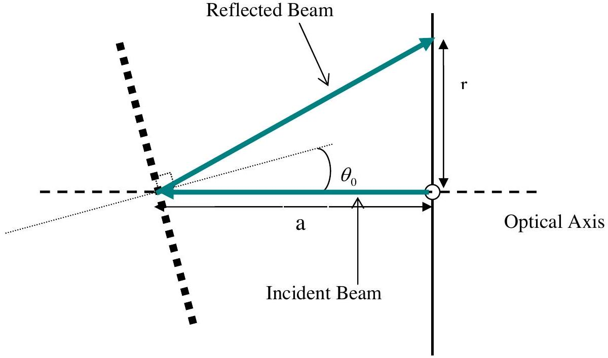
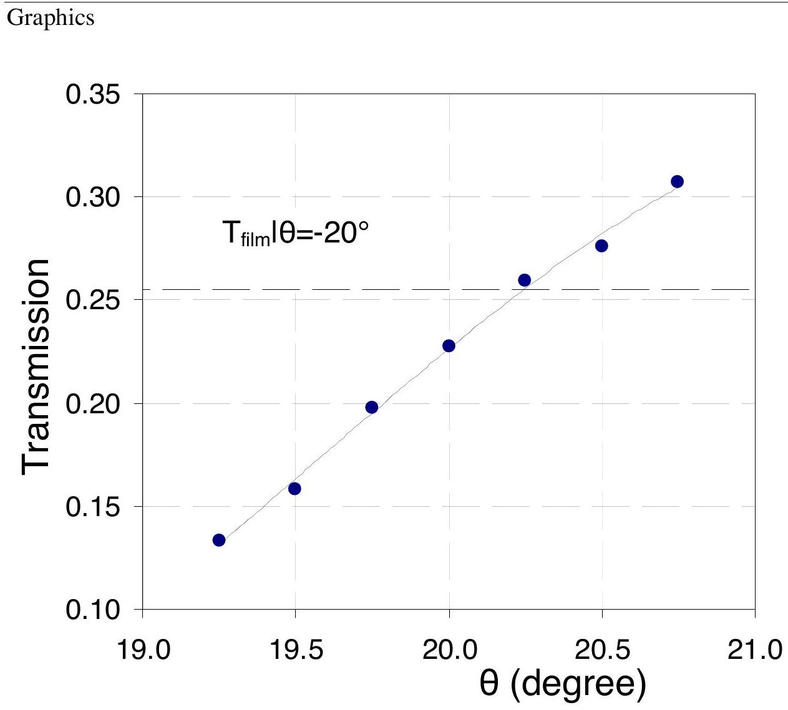
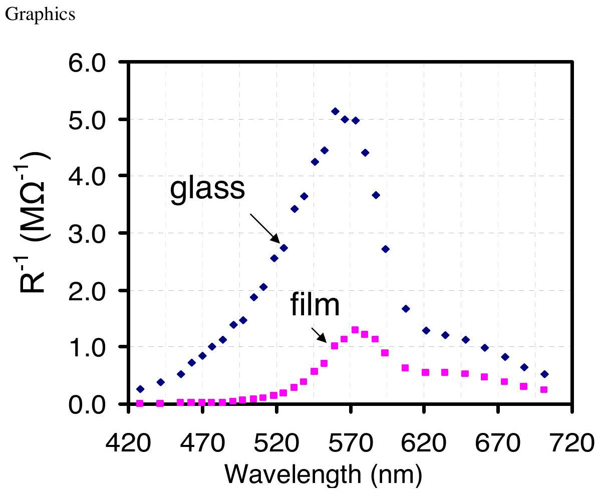
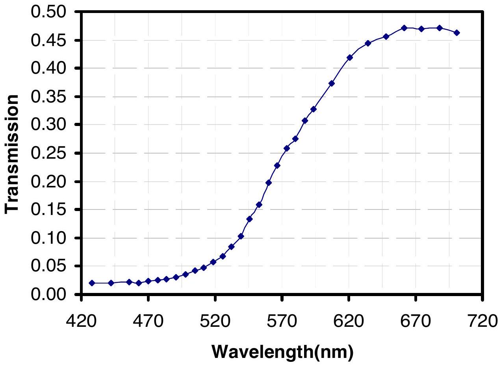
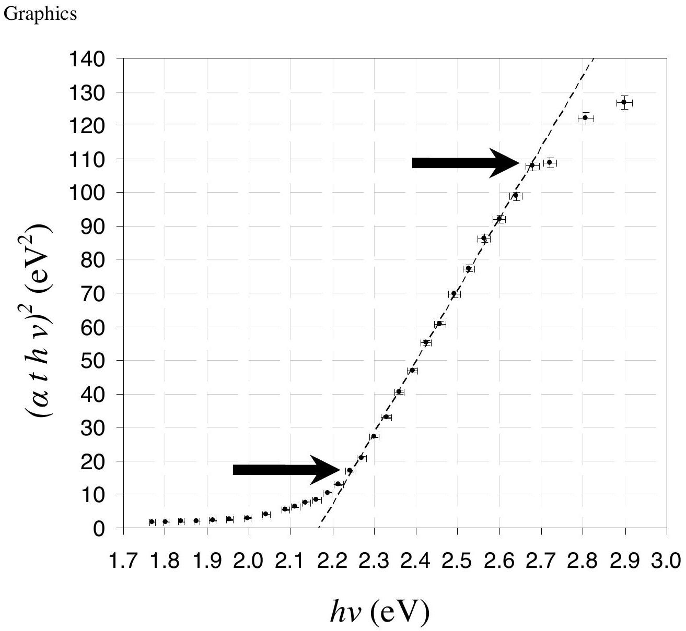

## Task 1

1a.
$\Delta \theta _ { \text {nominal } } = 5 ^ { \prime } = 0.08 ^ { \circ }$

| $\Delta \theta _ { \text {nominal } }$ (degree) | 0.08 |
| :--- | :--- |

1b.

If "a" is the distance between card and the grating and " r " is the distance between the hole and the light spot so we have

$$
\begin{aligned}
& \Delta f \left( x _ { 1 } , x _ { 2 } , \ldots \right) = \sqrt { \left( \frac { \partial f } { \partial x _ { 1 } } \Delta x _ { 1 } \right) ^ { 2 } + \left( \frac { \partial f } { \partial x _ { 2 } } \Delta x _ { 2 } \right) ^ { 2 } + \ldots } \\
& \tan \left( 2 \theta _ { 0 } \right) = \frac { r } { a } , \text { If } \theta _ { 0 } \ll 1 \Rightarrow \theta _ { 0 } = \frac { r } { 2 a } \Rightarrow \Delta \theta _ { 0 } = \sqrt { \left( \frac { \Delta r } { 2 a } \right) ^ { 2 } + \left( \frac { r \Delta \mathrm { a } } { 2 a ^ { 2 } } \right) ^ { 2 } }
\end{aligned}
$$

We want $\theta _ { 0 }$ to be zero i.e. $r = 0 \Rightarrow \Delta \theta _ { 0 } = \frac { \Delta r } { 2 a }$

$$
\Delta r = 1 \mathrm {~mm} , a = ( 70 \pm 1 ) \mathrm { mm } \Rightarrow \theta _ { 0 } = \frac { \Delta r } { 2 a } \mathrm { rad } = 0.007 \mathrm { rad } = 0.4 ^ { \circ }
$$

| $\Delta \theta _ { 0 }$ | 0.4° |
| :--- | :--- |
| $\theta$ range of visible light (degree) | $13 ^ { \circ } \leq \theta \leq 26 ^ { \circ }$ |

1c.

| $R _ { \text {min } } ^ { ( 0 ) }$ | $( 21.6 \pm 0.1 ) \mathrm { k } \Omega$ |
| :--- | :--- |
| $\Delta \varphi _ { 0 }$ | $5 ^ { \prime } = 0.08 ^ { \circ }$ |
| $R _ { \text {min } } ^ { ( 1 ) }$ | $\mathrm { R } = ( 192 \pm 1 ) \mathrm { k } \Omega$ |

$\Delta \varphi _ { 0 } = 5 ^ { \prime }$ because

$$
\begin{aligned}
& \theta = 5 ^ { \prime } \Rightarrow \mathrm { R } = ( 21.9 \pm 0.1 ) \mathrm { k } \Omega \\
& \theta = - 5 ^ { \prime } \Rightarrow \mathrm { R } = ( 21.9 \pm 0.1 ) \mathrm { k } \Omega
\end{aligned}
$$
1d.

Table 1d. The measured parameters
| $\theta$ (degree) | $\mathrm { R } _ { \text {glass } } ( \mathrm { M } \Omega )$ | $\Delta \mathrm { R } _ { \text {glass } } ( \mathrm { M } \Omega )$ | $\mathrm { R } _ { \text {film } } ( \mathrm { M } \Omega )$ | $\Delta \mathrm { R } _ { \text {film } } ( \mathrm { M } \Omega )$ |
| :--- | :--- | :--- | :--- | :--- |
| 15.00 | 3.77 | 0.03 | 183 | 3 |
| 15.50 | 2.58 | 0.02 | 132 | 2 |
| 16.00 | 1.88 | 0.01 | 87 | 1 |
| 16.50 | 1.19 | 0.01 | 51.5 | 0.5 |
| 17.00 | 0.89 | 0.01 | 33.4 | 0.3 |
| 17.50 | 0.68 | 0.01 | 19.4 | 0.1 |
| 18.00 | 0.486 | 0.005 | 10.4 | 0.1 |
| 18.50 | 0.365 | 0.005 | 5.40 | 0.03 |
| 19.00 | 0.274 | 0.003 | 2.66 | 0.02 |
| 19.50 | 0.225 | 0.002 | 1.42 | 0.01 |
| 20.00 | 0.200 | 0.002 | 0.880 | 0.005 |
| 20.50 | 0.227 | 0.002 | 0.822 | 0.005 |
| 21.00 | 0.368 | 0.003 | 1.123 | 0.007 |
| 21.50 | 0.600 | 0.005 | 1.61 | 0.01 |
| 22.00 | 0.775 | 0.005 | 1.85 | 0.01 |
| 22.50 | 0.83 | 0.01 | 1.87 | 0.01 |
| 23.00 | 0.88 | 0.01 | 1.93 | 0.02 |
| 23.50 | 1.01 | 0.01 | 2.14 | 0.02 |
| 24.00 | 1.21 | 0.01 | 2.58 | 0.02 |
| 24.50 | 1.54 | 0.01 | 3.27 | 0.02 |
| 25.00 | 1.91 | 0.01 | 4.13 | 0.02 |
| 16.25 | 1.38 | 0.01 | 66.5 | 0.5 |
| 16.75 | 1.00 | 0.01 | 40.0 | 0.3 |
| 17.25 | 0.72 | 0.01 | 23.4 | 0.2 |
| 17.75 | 0.535 | 0.005 | 12.8 | 0.1 |
| 18.25 | 0.391 | 0.003 | 6.83 | 0.05 |
| 18.75 | 0.293 | 0.003 | 3.46 | 0.02 |
| 19.25 | 0.235 | 0.003 | 1.76 | 0.01 |
| 19.75 | 0.195 | 0.002 | 0.988 | 0.005 |
| 20.25 | 0.201 | 0.002 | 0.776 | 0.005 |
| 20.75 | 0.273 | 0.003 | 0.89 | 0.01 |

1e.

In $\theta = - 20 ^ { \circ } \Rightarrow \mathrm { R } _ { \text {glass } } = ( 132 \pm 2 ) \mathrm { k } \Omega , \mathrm { R } _ { \text {film } } = ( 518 \pm 5 ) \mathrm { k } \Omega$

| $\theta$ | $T _ { \text {film } }$ | $\theta$ | $T _ { \text {film } }$ |
| :--- | :--- | :--- | :--- |
| $\theta = - 20 ^ { \circ }$ | 0.255 | 19.25 | 0.134 |
|  |  | 19.50 | 0.158 |
|  |  | 19.75 | 0.197 |
|  |  | 20.00 | 0.227 |
|  |  | 20.25 | 0.259 |
|  |  | 20.50 | 0.276 |
|  |  | 20.75 | 0.307 |

We see that: $\mathrm { T } \left( \theta = 20.25 ^ { \circ } \right) = \mathrm { T } \left( \theta = - 20 ^ { \circ } \right)$

| $\delta$ (degree) | $0.25 \pm 0.08$ |
| :--- | :--- |

## Task 2.

2a.

$$
\lambda = d \sin \left( \theta - \frac { \delta } { 2 } \right) \Rightarrow \Delta \lambda = \lambda \sqrt { \left( \frac { \Delta d } { d } \right) ^ { 2 } + \cot ^ { 2 } \left( \theta - \frac { \delta } { 2 } \right) \left( \Delta \theta ^ { 2 } + \frac { \Delta \delta ^ { 2 } } { 4 } \right) } \approx d \cos ( \theta ) \left( \frac { 0.1 \pi } { 180 } \right)
$$

where $\Delta \theta = \Delta \delta = 5 ^ { \prime } = 0.08$ degree

$$
\text { and } \mathrm { d } = \frac { 1 } { 600 } \mathrm {~mm}
$$

$$
\Delta \lambda = 2.9 \cos ( \theta ) ( \mathrm { nm } )
$$

$$
\begin{gathered}
T _ { \text {film } } = \frac { R _ { \text {glass } } } { R _ { \text {film } } } \Rightarrow \Delta T = T _ { \text {film } } \sqrt { \left( \frac { \Delta R _ { \text {film } } } { R _ { \text {film } } } \right) ^ { 2 } + \left( \frac { \Delta R _ { \text {glass } } } { R _ { \text {glass } } } \right) ^ { 2 } } \\
\Delta T = \frac { R _ { \text {glass } } } { R _ { \text {film } } } \sqrt { \left( \frac { \Delta R _ { \text {film } } } { R _ { \text {film } } } \right) ^ { 2 } + \left( \frac { \Delta R _ { \text {glass } } } { R _ { \text {glass } } } \right) ^ { 2 } }
\end{gathered}
$$

2b.

$$
13 \leq \theta \leq 26
$$

$$
2.6 \leq \Delta \lambda \leq 2.8 \mathrm {~nm}
$$

2c.

Table 2c. The calculated parameters using the measured parameters
| $\theta$ (degree) | $\lambda ( \mathrm { nm } )$ | $\mathrm { I } _ { \mathrm { g } } / \mathrm { C } ( \lambda ) \left( \mathrm { M } \Omega ^ { - 1 } \right)$ | $\mathrm { I } _ { \mathrm { s } } / \mathrm { C } ( \lambda ) \left( \mathrm { M } \Omega ^ { - 1 } \right)$ | $\mathrm { T } _ { \text {film } }$ | $\alpha \mathrm { t }$ |
| :--- | :--- | :--- | :--- | :--- | :--- |
| 15.0 | 428 | 0.265 | 0.00546 | 0.0206 | 3.88 |
| 15.5 | 442 | 0.388 | 0.00758 | 0.0195 | 3.94 |
| 16.0 | 456 | 0.532 | 0.0115 | 0.0216 | 3.83 |
| 16.25 | 463 | 0.725 | 0.0150 | 0.0208 | 3.88 |
| 16.5 | 470 | 0.840 | 0.0194 | 0.0231 | 3.77 |
| 16.75 | 477 | 1.00 | 0.0250 | 0.0250 | 3.69 |
| 17.0 | 484 | 1.12 | 0.0299 | 0.0266 | 3.63 |
| 17.25 | 491 | 1.39 | 0.0427 | 0.0308 | 3.48 |
| 17.5 | 498 | 1.47 | 0.0515 | 0.0351 | 3.35 |
| 17.75 | 505 | 1.87 | 0.0781 | 0.0418 | 3.17 |
| 18.0 | 512 | 2.06 | 0.096 | 0.0467 | 3.06 |
| 18.25 | 518 | 2.56 | 0.146 | 0.0572 | 2.86 |
| 18.5 | 525 | 2.74 | 0.185 | 0.0676 | 2.69 |
| 18.75 | 532 | 3.41 | 0.289 | 0.0847 | 2.47 |
| 19.0 | 539 | 3.65 | 0.376 | 0.103 | 2.27 |
| 19.25 | 546 | 4.26 | 0.568 | 0.134 | 2.01 |
| 19.5 | 553 | 4.44 | 0.704 | 0.158 | 1.84 |
| 19.75 | 560 | 5.13 | 1.01 | 0.197 | 1.62 |
| 20.0 | 567 | 5.00 | 1.14 | 0.227 | 1.48 |
| 20.25 | 573 | 4.98 | 1.29 | 0.259 | 1.35 |
| 20.5 | 580 | 4.41 | 1.22 | 0.276 | 1.29 |
| 20.75 | 587 | 3.66 | 1.12 | 0.307 | 1.18 |
| 21.0 | 594 | 2.72 | 0.890 | 0.328 | 1.12 |
| 21.5 | 607 | 1.67 | 0.621 | 0.373 | 0.99 |
| 22.0 | 621 | 1.29 | 0.541 | 0.419 | 0.87 |
| 22.5 | 634 | 1.20 | 0.535 | 0.444 | 0.81 |
| 23.0 | 648 | 1.14 | 0.518 | 0.456 | 0.79 |
| 23.5 | 661 | 0.99 | 0.467 | 0.472 | 0.75 |
| 24.0 | 675 | 0.826 | 0.388 | 0.469 | 0.76 |
| 24.5 | 688 | 0.649 | 0.306 | 0.471 | 0.75 |
| 25.0 | 701 | 0.524 | 0.242 | 0.462 | 0.77 |

| $\lambda _ { \text {max } } \left( \mathrm { I } _ { \text {glass } } \right)$ | $564 \pm 5 ( \mathrm {~nm} )$ |
| :--- | :--- |
| $\lambda _ { \text {max } } \left( \mathrm { I } _ { \text {film } } \right)$ | $573 \pm 5 ( \mathrm {~nm} )$ |

2e. Graphics

## Task 3.

3а.

Table 3a. The calculated parameters for each measured data point
| $\theta$ (degree) | $x ( \mathrm { eV } )$ | $y \left( \mathrm { eV } ^ { 2 } \right)$ |
| :--- | :--- | :--- |
| 15.00 | 2.898 | 126.6 |
| 15.50 | 2.806 | 121.9 |
| 16.00 | 2.720 | 108.8 |
| 16.25 | 2.679 | 107.8 |
| 16.50 | 2.639 | 98.9 |
| 16.75 | 2.600 | 92.0 |
| 17.00 | 2.563 | 86.3 |
| 17.25 | 2.527 | 77.4 |
| 17.50 | 2.491 | 69.7 |
| 17.75 | 2.457 | 60.9 |
| 18.00 | 2.424 | 55.1 |
| 18.25 | 2.392 | 46.8 |
| 18.50 | 2.360 | 40.4 |
| 18.75 | 2.330 | 33.1 |
| 19.00 | 2.300 | 27.3 |
| 19.25 | 2.271 | 20.91 |
| 19.50 | 2.243 | 17.07 |
| 19.75 | 2.215 | 12.92 |
| 20.00 | 2.188 | 10.51 |
| 20.25 | 2.162 | 8.53 |
| 20.50 | 2.137 | 7.56 |
| 20.75 | 2.112 | 6.23 |
| 21.00 | 2.088 | 5.43 |
| 21.50 | 2.041 | 4.06 |
| 22.00 | 1.997 | 3.02 |
| 22.50 | 1.954 | 2.52 |
| 23.00 | 1.914 | 2.26 |
| 23.50 | 1.875 | 1.98 |
| 24.00 | 1.838 | 1.94 |
| 24.50 | 1.803 | 1.84 |
| 25.00 | 1.769 | 1.86 |

3b.

| $\mathrm { x } _ { \text {min } } = 2.24 ( \mathrm { eV } )$ | $\mathrm { x } _ { \text {max } } = 2.68 ( \mathrm { eV } )$ |
| :--- | :--- |
3c.
$$
\begin{aligned}
& \alpha h v = A \left( h v - E _ { g } \right) ^ { \frac { 1 } { 2 } } \Rightarrow ( \alpha t h v ) ^ { 2 } = ( A t ) ^ { 2 } \left( h v - E _ { g } \right) \\
& \Rightarrow y = ( A t ) ^ { 2 } \left( x - E _ { g } \right) \Rightarrow m = ( A t ) ^ { 2 } \Rightarrow t = \frac { \sqrt { m } } { A } \\
& \Rightarrow \frac { \Delta t } { t } = \frac { \Delta m } { 2 m }
\end{aligned}
$$
$$
\begin{aligned}
t & = \frac { \sqrt { m } } { A } \\
\Delta t & = \frac { \Delta m } { 2 A \sqrt { m } }
\end{aligned}
$$

In linear range we have, $\mathrm { m } = 213 ( \mathrm { eV } ) , \mathrm { r } ^ { 2 } = 0.9986 , \mathrm { E } _ { \mathrm { g } } = 2.17 ( \mathrm { eV } )$ and we have $\mathrm { A } = 0.071 \left( \mathrm { eV } ^ { 1 / 2 } / \mathrm { nm } \right)$ so we find $\mathrm { t } = 206 ( \mathrm {~nm} )$

$$
\Delta m = \sqrt { \frac { ( \delta y ) ^ { 2 } + \frac { m ^ { 2 } } { R ^ { 2 } } ( \delta x ) ^ { 2 } } { \sum _ { i } x _ { i } ^ { 2 } - N \bar { x } ^ { 2 } } } \approx \sqrt { \frac { ( \delta y ) ^ { 2 } + ( m \delta x ) ^ { 2 } } { \sum _ { i } x _ { i } ^ { 2 } - N \bar { x } ^ { 2 } } } = \sqrt { \frac { ( \delta x y ) ^ { 2 } } { \sum _ { i } x _ { i } ^ { 2 } - N \bar { x } ^ { 2 } } } , ( \delta x y ) ^ { 2 } = ( \delta y ) ^ { 2 } + ( m \delta x ) ^ { 2 }
$$

where $\delta \mathrm { x } \& \delta \mathrm { y }$ are the mean of error range of $\mathrm { x } \& \mathrm { y }$

$$
\begin{aligned}
& \delta x \approx \sqrt { \frac { \sum _ { i } \delta x _ { i } ^ { 2 } } { N } } \& \delta y = \sqrt { \frac { \sum _ { i } \delta y _ { i } ^ { 2 } } { N } } \text { So } \quad \delta x \approx 0.014 ( \mathrm { eV } ) , \delta y \approx 0.9 ( \mathrm { eV } ) ^ { 2 } \\
& \rightarrow \Delta \mathrm {~m} \approx 10 ( \mathrm { eV } ) \rightarrow \Delta \mathrm { t } = \mathrm { t } \times \Delta \mathrm { m } / ( 2 \mathrm {~m} ) \approx 5 ( \mathrm {~nm} ) \\
& \Delta E _ { g } = \frac { 1 } { m } \sqrt { \left( \left( \frac { m ^ { 2 } \delta x ^ { 2 } + \delta y ^ { 2 } } { N } \right) + \left( \frac { \bar { y } } { m } \right) ^ { 2 } \Delta m ^ { 2 } \right) } = \frac { 1 } { m } \sqrt { \left( \left( \frac { \delta x y ^ { 2 } } { N } \right) + \left( \frac { \bar { y } } { m } \right) ^ { 2 } \Delta m ^ { 2 } \right) } \\
& \Delta E _ { g } \approx 0.02 ( \mathrm { eV } )
\end{aligned}
$$

Table 3d. The calculated values of $E _ { \mathrm { g } }$ and $t$ using Fig. 3
| $E _ { \mathrm { g } } ( \mathrm { eV } )$ | $\Delta E _ { \mathrm { g } } ( \mathrm { eV } )$ | $t ( \mathrm {~nm} )$ | $\Delta t ( \mathrm {~nm} )$ |
| :--- | :--- | :--- | :--- |
| 2.17 | 0.02 | 206 | 5 |

This document was created with Win2PDF available at http://www.daneprairie.com. The unregistered version of Win2PDF is for evaluation or non-commercial use only.
