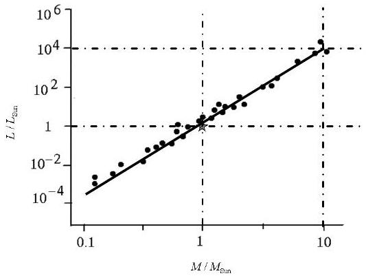

## Question "Pink"

1.1
Period $= 3.0$ days $= 2.6 \times 10 ^ { 5 } \mathrm {~s}$.
Period $= \frac { 2 \pi } { \omega } \quad ( 0.2 ) \Rightarrow \quad \omega = 2.4 \times 10 ^ { - 5 } \mathrm { rad } \mathrm { s } ^ { - 1 }$.
1.2
Calling the minima in the diagram $1 , I _ { 1 } / I _ { 0 } = \alpha = 0.90$ and $I _ { 2 } / I _ { 0 } = \beta = 0.63$, we have:

$$
\begin{align*}
& \frac { I _ { 0 } } { I _ { 1 } } = 1 + \left( \frac { R _ { 2 } } { R _ { 1 } } \right) ^ { 2 } \left( \frac { T _ { 2 } } { T _ { 1 } } \right) ^ { 4 } = \frac { 1 } { \alpha }  \tag{0.4}\\
& \frac { I _ { 2 } } { I _ { 1 } } = 1 - \left( \frac { R _ { 2 } } { R _ { 1 } } \right) ^ { 2 } \left( 1 - \left( \frac { T _ { 2 } } { T _ { 1 } } \right) ^ { 4 } \right) = \frac { \beta } { \alpha } \tag{0.4}
\end{align*}
$$

From above, one finds:

$$
\begin{equation*}
\frac { R _ { 1 } } { R _ { 2 } } = \sqrt { \frac { \alpha } { 1 - \beta } } \Rightarrow \frac { R _ { 1 } } { R _ { 2 } } = 1.6 \tag{0.2+0.2}
\end{equation*}
$$

$$
\begin{equation*}
\frac { T _ { 1 } } { T _ { 2 } } = \sqrt [ 4 ] { \frac { 1 - \beta } { 1 - \alpha } } \Rightarrow \frac { T _ { 1 } } { T _ { 2 } } = 1.4 \tag{0.2+0.2}
\end{equation*}
$$

2.1)
Doppler-Shift formula:

$$
\begin{equation*}
\frac { \Delta \lambda } { \lambda _ { 0 } } \cong \frac { v } { c } \text { (or equivalent relation) } \tag{0.4}
\end{equation*}
$$

Maximum and minimum wavelengths:

$$
\begin{aligned}
& \lambda _ { 1 , \max } = 5897.7 \AA , \lambda _ { 1 , \min } = 5894.1 \AA \\
& \lambda _ { 2 , \max } = 5899.0 \AA , \lambda _ { 2 , \min } = 5892.8 \AA
\end{aligned}
$$

Difference between maximum and minimum wavelengths:

$$
\begin{equation*}
\Delta \lambda _ { 1 } = 3.6 \AA , \quad \Delta \lambda _ { 2 } = 6.2 \AA \tag{All0.6}
\end{equation*}
$$

Using the Doppler relation and noting that the shift is due to twice the orbital speed: (Factor of two 0.4)

$$
\begin{align*}
& v _ { 1 } = c \frac { \Delta \lambda _ { 1 } } { 2 \lambda _ { 0 } } = 9.2 \times 10 ^ { 4 } \mathrm {~m} / \mathrm { s }  \tag{0.2}\\
& v _ { 2 } = c \frac { \Delta \lambda _ { 2 } } { 2 \lambda _ { 0 } } = 1.6 \times 10 ^ { 5 } \mathrm {~m} / \mathrm { s } \tag{0.2}
\end{align*}
$$

The student can use the wavelength of central line and maximum (or minimum) wavelengths. Marking scheme is given in the Excel file.
2.2) As the center of mass is not moving with respect to us: (0.5)

$$
\begin{equation*}
\frac { m _ { 1 } } { m _ { 2 } } = \frac { v _ { 2 } } { v _ { 1 } } = 1.7 \tag{0.2}
\end{equation*}
$$

2.3)

Writing $r _ { i } = \frac { v _ { i } } { \omega }$ for $i = 1,2$, we have (0.4)

$$
r _ { 1 } = 3.8 \times 10 ^ { 9 } \mathrm {~m} , ( 0.2 )
$$

$$
r _ { 2 } = 6.5 \times 10 ^ { 9 } \mathrm {~m} ( 0.2 )
$$

2.4)

$$
r = r _ { 1 } + r _ { 2 } = 1.0 \times 10 ^ { 10 } \mathrm {~m} ( 0.2 )
$$

3.1)

The gravitational force is equal to mass times the centrifugal acceleration

$$
\begin{equation*}
G \frac { m _ { 1 } m _ { 2 } } { r ^ { 2 } } = m _ { 1 } \frac { v _ { 1 } ^ { 2 } } { r _ { 1 } } = m _ { 2 } \frac { v _ { 2 } ^ { 2 } } { r _ { 2 } } \tag{0.7}
\end{equation*}
$$

Therefore,

$$
\left\{ \begin{array} { l }
{ m _ { 1 } = \frac { r ^ { 2 } v _ { 2 } { } ^ { 2 } } { G r _ { 2 } } }  \tag{0.2+0.2}\\
{ m _ { 2 } = \frac { r ^ { 2 } v _ { 1 } { } ^ { 2 } } { G r _ { 1 } } }
\end{array} \quad ( 0 . 1 ) \quad \Rightarrow \quad \left\{ \begin{array} { l }
m _ { 1 } = 6 \times 10 ^ { 30 } \mathrm {~kg} \\
m _ { 2 } = 3 \times 10 ^ { 30 } \mathrm {~kg}
\end{array} \right. \right.
$$

4.1) As it is clear from the diagram, with one significant digit, $\alpha = 4$. (0.6)

4.2)
As we have found in the previous section: $L _ { i } = L _ { \text {Sun } } \left( \frac { M _ { i } } { M _ { \text {Sun } } } \right) ^ { 4 } ( 0.2 )$
So,

$$
\begin{aligned}
& L _ { 1 } = 3 \times 10 ^ { 28 } \mathrm { Watt } ( 0.2 ) \\
& L _ { 2 } = 4 \times 10 ^ { 27 } \mathrm { Watt } ( 0.2 )
\end{aligned}
$$

4.3) The total power of the system is distributed on a sphere with radius $d$ to produce $I _ { 0 }$, that is:

$$
\begin{align*}
I _ { 0 } = \frac { L _ { 1 } + L _ { 2 } } { 4 \pi d ^ { 2 } } & \Rightarrow d = \sqrt { \frac { L _ { 1 } + L _ { 2 } } { 4 \pi I _ { 0 } } } = 1 \times 10 ^ { 18 } \mathrm {~m}  \tag{0.2}\\
& = 100 \mathrm { ly } . ( 0.2 )
\end{align*}
$$

4.4)

$$
\theta \cong \tan \theta = \frac { r } { d } = 1 \times 10 ^ { - 8 } \mathrm { rad } . \quad ( 0.2 + 0.2 )
$$

4.5)
A typical optical wavelength is $\lambda _ { 0 }$. Using uncertainty relation:

$$
D = \frac { d \lambda _ { 0 } } { r } \cong 50 \mathrm {~m} . \quad ( 0.2 + 0.2 )
$$
