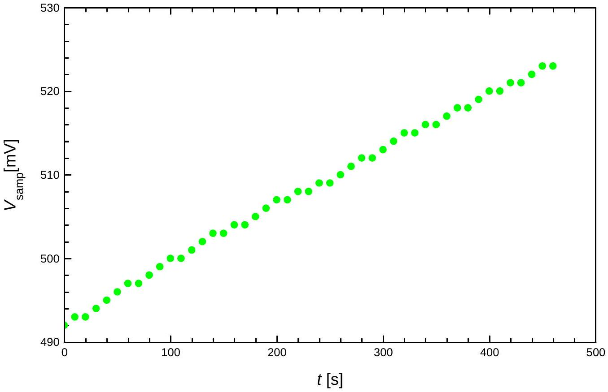
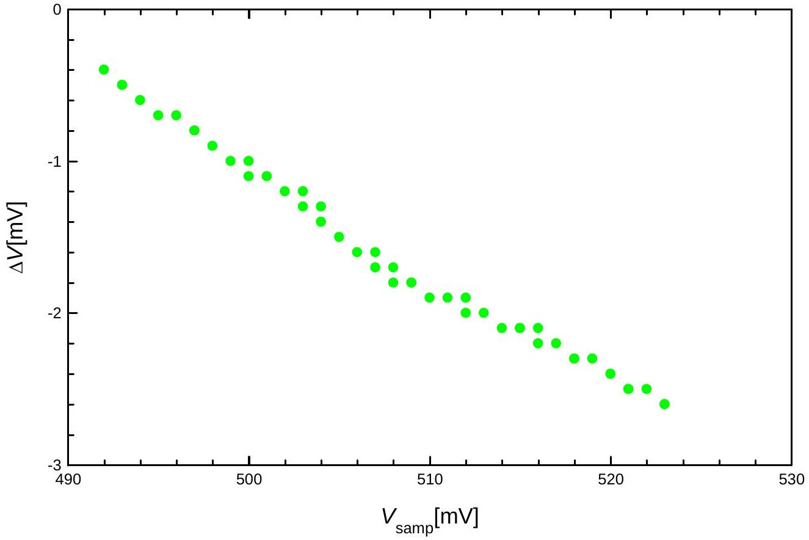
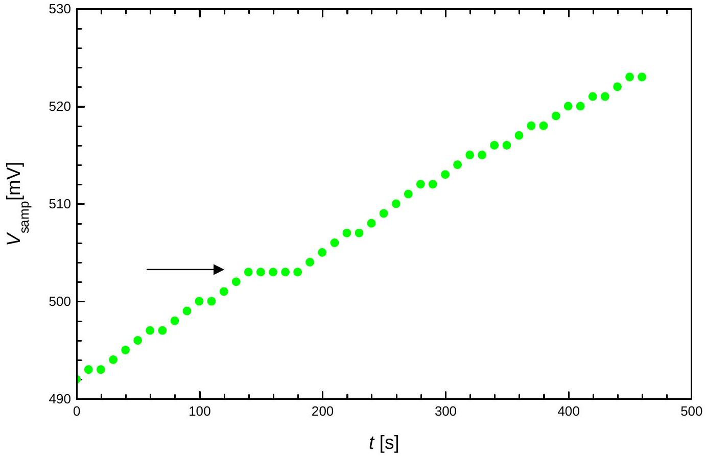
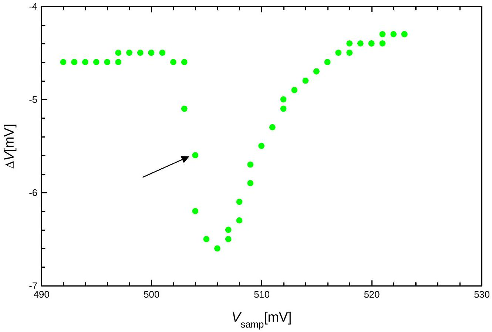
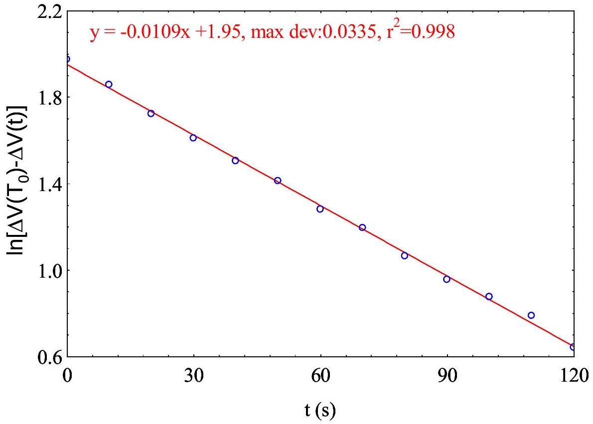
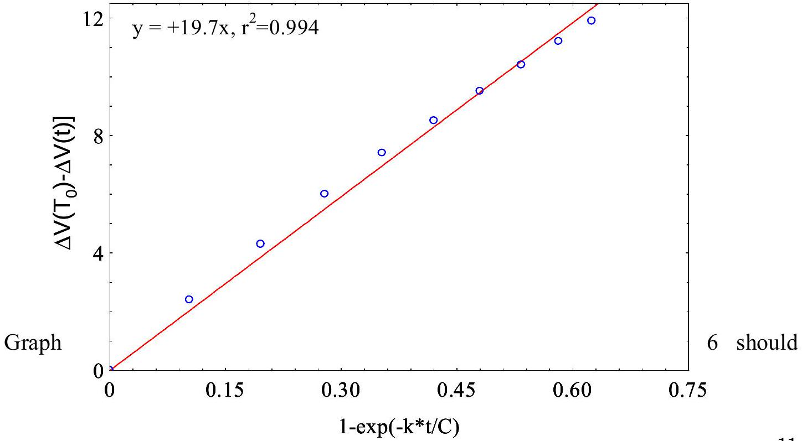
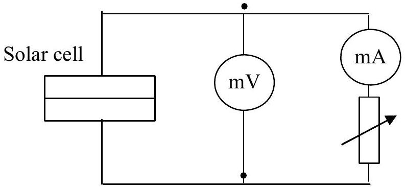
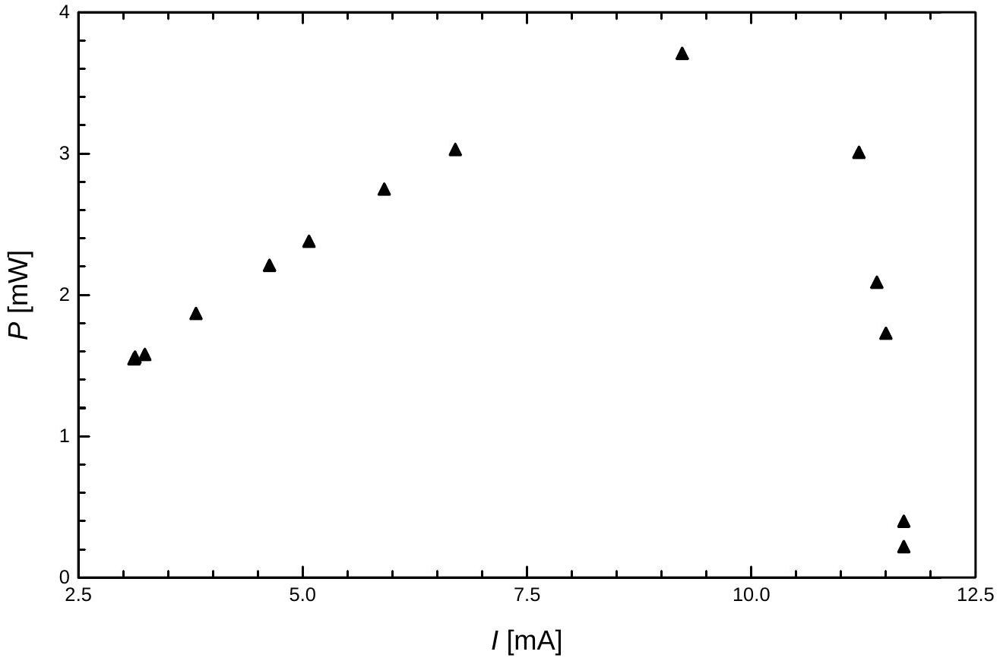

## Solution

## Task 1

1.
1.1. $T _ { 0 } = 25 \pm 1 { } ^ { \circ } \mathrm { C }$
$$
V _ { \text {samp } } \left( T _ { 0 } \right) = 573.9 \mathrm { mV }
$$

With different experiment sets, $V _ { \text {samp } }$ may differ from the above value within ±40 mV.
Note for error estimation:
$\delta V$ and $\delta V$ are calculated using the specs of the multimeter: $\pm 0.5 \%$ reading digit + 2 on the last digit. Example: if $V = 500 \mathrm { mV }$, the error $\delta V = 500 \times 0.5 \% + 0.2 = 2.7 \mathrm { mV } \approx 3$ mV.

Thus, $V _ { \text {samp } } \left( T _ { 0 } \right) = 574 \pm 3 \mathrm { mV }$.

All values of $V _ { \text {samp } } \left( T _ { 0 } \right)$ within $505 \div 585 \mathrm { mV }$ are acceptable.
1.2. Formula for temperature calculation:

From Eq (1): $V _ { \text {samp } } = V _ { \text {samp } } \left( T _ { 0 } \right) - \alpha \left( T - T _ { 0 } \right)$

$$
\begin{aligned}
& V _ { \text {samp } } \left( 50 ^ { \circ } \mathrm { C } \right) = 523.9 \mathrm { mV } \\
& V _ { \text {samp } } \left( 70 ^ { \circ } \mathrm { C } \right) = 483.9 \mathrm { mV } \\
& V _ { \text {samp } } \left( 80 ^ { \circ } \mathrm { C } \right) = 463.9 \mathrm { mV }
\end{aligned}
$$

Error calculation: $\delta V _ { \text {samp } } = \delta V _ { \text {samp } } \left( T _ { 0 } \right) + \left( T - T _ { 0 } \right) \delta \alpha$

Example: $V _ { \text {samp } } = 495.2 \mathrm { mV }$, then $\delta V _ { \text {samp } } = 2.7 + 0.03 \times ( 50 - 25 ) = 3.45 \mathrm { mV } \approx 3.5 \mathrm { mV }$
Thus:

$$
\begin{aligned}
& V _ { \text {samp } } \left( 50 ^ { \circ } \mathrm { C } \right) = 524 \pm 4 \mathrm { mV } \\
& V _ { \text {samp } } \left( 70 ^ { \circ } \mathrm { C } \right) = 484 \pm 4 \mathrm { mV }
\end{aligned}
$$

$$
V _ { \text {samp } } \left( 80 ^ { \circ } \mathrm { C } \right) = 464 \pm 5 \mathrm { mV }
$$

The same rule for acceptable range of $V _ { \text {samp } }$ as in 1.1 is applied.
2.
2.1. Data of cooling-down process without sample:

| $t ( \mathrm {~s} )$ | $V _ { \text {samp } } ( \mathrm { mV } ) ( \pm 3 \mathrm { mV } )$ | $\Delta V ( \mathrm { mV } ) ( \pm 0.2 \mathrm { mV } )$ |
| :--- | :--- | :--- |
| 0 | 492 | -0.4 |
| 10 | 493 | -0.5 |
| 20 | 493 | -0.5 |
| 30 | 494 | -0.6 |
| 40 | 495 | -0.7 |
| 50 | 496 | -0.7 |
| 60 | 497 | -0.8 |
| 70 | 497 | -0.8 |
| 80 | 498 | -0.9 |
| 90 | 499 | -1.0 |
| 100 | 500 | -1.0 |
| 110 | 500 | -1.1 |
| 120 | 501 | -1.1 |
| 130 | 502 | -1.2 |
| 140 | 503 | -1.2 |
| 150 | 503 | -1.3 |
| 160 | 504 | -1.3 |
| 170 | 504 | -1.4 |
| 180 | 505 | -1.5 |
| 190 | 506 | -1.6 |
| 200 | 507 | -1.6 |
| 210 | 507 | -1.7 |
| 220 | 508 | -1.7 |
| 230 | 508 | -1.8 |
| 240 | 509 | -1.8 |
| 250 | 509 | -1.8 |
| 260 | 510 | -1.9 |
| 270 | 511 | -1.9 |

| 280 | 512 | -1.9 |
| :--- | :--- | :--- |
| 290 | 512 | -2.0 |
| 300 | 513 | -2.0 |
| 310 | 514 | -2.1 |
| 320 | 515 | -2.1 |
| 330 | 515 | -2.1 |
| 340 | 516 | -2.1 |
| 350 | 516 | -2.2 |
| 360 | 517 | -2.2 |
| 370 | 518 | -2.3 |
| 380 | 518 | -2.3 |
| 390 | 519 | -2.3 |
| 400 | 520 | -2.4 |
| 410 | 520 | -2.4 |
| 420 | 521 | -2.5 |
| 430 | 521 | -2.5 |
| 440 | 522 | -2.5 |
| 450 | 523 | -2.6 |
| 460 | 523 | -2.6 |

The acceptable range of $\Delta V$ is $\pm 40 \mathrm { mV }$. There is no fixed rule for the change in $\Delta V$ with $T$ (this depends on the positions of the dishes on the plate, etc.)
2.2.

Graph 1

The correct graph should not have any abrupt changes of the slope.
2.3.

Graph 2

The correct graph should not have any abrupt changes of the slope.
3.

3.1. Dish with substance
| $t ( \mathrm {~s} )$ | $V _ { \text {samp } } ( \mathrm { mV } ) ( \pm 3 \mathrm { mV } )$ | $\Delta V ( \mathrm { mV } ) ( \pm 0.2 \mathrm { mV } )$ |
| :--- | :--- | :--- |
| 0 | 492 | -4.6 |
| 10 | 493 | -4.6 |
| 20 | 493 | -4.6 |
| 30 | 494 | -4.6 |
| 40 | 495 | -4.6 |
| 50 | 496 | -4.6 |
| 60 | 497 | -4.6 |
| 70 | 497 | -4.5 |
| 80 | 498 | -4.5 |
| 90 | 499 | -4.5 |
| 100 | 500 | -4.5 |
| 110 | 500 | -4.5 |
| 120 | 501 | -4.5 |

| 130 | 502 | -4.6 |
| :--- | :--- | :--- |
| 140 | 503 | -4.6 |
| 150 | 503 | -5.1 |
| 160 | 503 | -5.6 |
| 170 | 503 | -6.2 |
| 180 | 503 | -6.5 |
| 190 | 504 | -6.6 |
| 200 | 505 | -6.5 |
| 210 | 506 | -6.4 |
| 220 | 507 | -6.3 |
| 230 | 507 | -6.1 |
| 240 | 508 | -5.9 |
| 250 | 509 | -5.7 |
| 260 | 510 | -5.5 |
| 270 | 511 | -5.3 |
| 280 | 512 | -5.1 |
| 290 | 512 | -5.0 |
| 300 | 513 | -4.9 |
| 310 | 514 | -4.8 |
| 320 | 515 | -4.7 |
| 330 | 515 | -4.7 |
| 340 | 516 | -4.6 |
| 350 | 516 | -4.6 |
| 360 | 517 | -4.5 |
| 370 | 518 | -4.5 |
| 380 | 518 | -4.4 |
| 390 | 519 | -4.4 |
| 400 | 520 | -4.4 |
| 410 | 520 | -4.4 |
| 420 | 521 | -4.4 |
| 430 | 521 | -4.3 |
| 440 | 522 | -4.3 |
| 450 | 523 | -4.3 |
| 460 | 523 | -4.3 |

3.2.

Graph 3

The correct Graph 3 should contain a short plateau as marked by the arrow in the above figure.
3.3.

Graph 4

The correct Graph 4 should have an abrupt change in $\Delta V$, as shown by the arrow in the above figure.
Note: when the dish contains the substance, values of $\Delta V$ may change compared to those without the substance.
4.
4.1. $V _ { \mathrm { s } }$ is shown in Graph 3. Value $V _ { \mathrm { s } } = ( 503 \pm 3 ) \mathrm { mV }$. From that, $T _ { \mathrm { s } } = 60.5 ^ { \circ } \mathrm { C }$ can be deduced.
4.2. $V _ { \mathrm { s } }$ is shown in Graph 4. Value $V _ { \mathrm { s } } = ( 503 \pm 3 ) \mathrm { mV }$. From that, $T _ { \mathrm { s } } = 60.5 { } ^ { \circ } \mathrm { C }$ can be deduced.
4.3. Error calculations, using root mean square method:

Error of $T _ { \mathrm { s } } : T _ { \mathrm { s } } = T _ { 0 } + \frac { V \left( T _ { 0 } \right) - V \left( T _ { \mathrm { s } } \right) } { \alpha } = T _ { 0 } + A$, in which A is an intermediate variable.

Therefore error of $T _ { \mathrm { s } }$ can be written as $\delta T _ { s } = \sqrt { \left( \delta T _ { 0 } \right) ^ { 2 } + ( \delta A ) ^ { 2 } }$, in which $\delta \ldots$ is the error.

Error for $A$ is calculated separately:

$$
\delta A = \frac { V \left( T _ { 0 } \right) - V \left( T _ { s } \right) } { \alpha } \sqrt { \left\{ \frac { \delta \left[ V \left( T _ { 0 } \right) - V \left( T _ { s } \right) \right] } { V \left( T _ { 0 } \right) - V \left( T _ { s } \right) } \right\} ^ { 2 } + \left( \frac { \delta \alpha } { \alpha } \right) ^ { 2 } }
$$

in which we have:

$$
\delta \left[ V \left( T _ { 0 } \right) - V \left( T _ { s } \right) \right] = \sqrt { \left[ \delta V \left( T _ { 0 } \right) \right] ^ { 2 } + \left[ \delta V \left( T _ { s } \right) \right] ^ { 2 } }
$$

Errors of other variables in this experiment:

$$
\begin{aligned}
& \delta T _ { 0 } = 1 ^ { \circ } \mathrm { C } \\
& \delta V \left( T _ { 0 } \right) = 3 \mathrm { mV } , \text { read on the multimeter. } \\
& \delta \alpha = 0.03 \mathrm { mV } / { } ^ { \circ } \mathrm { C } \\
& \delta V \left( T _ { \mathrm { s } } \right) \approx 3 \mathrm { mV }
\end{aligned}
$$

From the above constituent errors we have:

$$
\delta \left[ V \left( T _ { 0 } \right) - V \left( T _ { s } \right) \right] \approx 4.24 m V
$$

$$
\delta A \approx 2.1 ^ { \circ } \mathrm { C }
$$

Finally, the error of $T _ { \mathrm { s } }$ is: $\delta T _ { s } \approx 2.5 ^ { \circ } \mathrm { C }$

Hence, the final result is: $T _ { \mathrm { s } } = 60 \pm 2.5 { } ^ { \circ } \mathrm { C }$

Note: if the student uses any other reasonable error calculation method that leads to approximately the same result, it is also accepted.

## Task 2

1.

1.1. $T _ { 0 } = 26 \pm 1 ^ { \circ } \mathrm { C }$
2.
2.1. Measured data with the lamp off

| $t ( \mathrm {~s} )$ | $\Delta V \left( \mathrm {~T} _ { 0 } \right) ( \mathrm { mV } ) ( \pm 0.2 \mathrm { mV } )$ |
| :--- | :--- |
| 0 | 19.0 |
| 10 | 19.0 |
| 20 | 19.0 |
| 30 | 19.0 |
| 40 | 19.0 |
| 50 | 18.9 |
| 60 | 18.9 |
| 70 | 18.9 |
| 80 | 18.9 |
| 90 | 18.9 |
| 100 | 19.0 |
| 110 | 19.0 |
| 120 | 19.0 |

Values of $\Delta V \left( T _ { 0 } \right)$ can be different from one experiment set to another. The acceptable values lie in between $- 40 \div + 40 \mathrm { mV }$.

2.2. Measured data with the lamp on
| $t ( \mathrm {~s} )$ | $\Delta V ( \mathrm { mV } ) ( \pm 0.2 \mathrm { mV } )$ |
| :--- | :--- |
| 0 | 19.5 |
| 10 | 21.9 |
| 20 | 23.8 |
| 30 | 25.5 |
| 40 | 26.9 |
| 50 | 28.0 |
| 60 | 29.0 |
| 70 | 29.9 |
| 80 | 30.7 |
| 90 | 31.4 |

| 100 | 32.0 |
| :--- | :--- |
| 110 | 32.4 |
| 120 | 32.9 |

When illuminated (by the lamp) values of $\Delta V$ may change $10 \div 20 \mathrm { mV }$ compared to the initial situation (lamp off).
2.3. Measured data after turning the lamp off

| $t ( \mathrm {~s} )$ | $\Delta V ( \mathrm { mV } ) ( \pm 0.2 \mathrm { mV } )$ |
| :--- | :--- |
| 0 | 23.2 |
| 10 | 22.4 |
| 20 | 21.6 |
| 30 | 21.0 |
| 40 | 20.5 |
| 50 | 20.1 |
| 60 | 19.6 |
| 70 | 19.3 |
| 80 | 18.9 |
| 90 | 18.6 |
| 100 | 18.4 |
| 110 | 18.2 |
| 120 | 17.9 |

3. Plotting graph 5 and calculating $k$
3.1. $x = t ; \quad y = \mathbf { n } \left[ \Delta V \left( T _ { 0 } \right) - \Delta V ( t ) \right]$

Note: other reasonable ways of writing expressions for $x$ and $y$ that also leads to a linear relationship using ln are also accepted.
3.2. Graph 5

Graph 5

3.3. Calculating $k : \frac { k } { C } = 0.0109 \mathrm {~s} ^ { - 1 }$ and $C = 0.69 \mathrm {~J} / \mathrm { K }$, thus: $k = 7.52 \times 10 ^ { - 3 } \mathrm {~W} / \mathrm { K }$

Note: Error of $k$ will be calculated in 5.5. Students are not asked to give error of $k$ in this step. The acceptable value of $k$ lies in between $6 \times 10 ^ { - 3 } \div 9 \times 10 ^ { - 3 } \mathrm {~W} / \mathrm { K }$ depending on the experiment set.
4. Plotting Graph 6 and calculating $E$

4.1. $x = \left[ 1 - \exp \left( \frac { - k t } { C } \right) \right] ; y = \left| \Delta V \left( T _ { 0 } \right) - \Delta V ( t ) \right|$

4.2.

Graph 6

be substantially linear, with the slope in between $15 \div 25 \mathrm { mV }$, depending on the experiment set.
4.3. From the slope of Graph 6 and the area of the detector orifice we obtain $E = 140 \mathrm {~W} / \mathrm { m } ^ { 2 }$. The area of the detector orifice is $S _ { \text {det } } = \pi R _ { \text {det } } { } ^ { 2 } = \pi \times \left( 13 \times 10 ^ { - 3 } \right) ^ { 2 } = 5.30 \times 10 ^ { - 4 } \mathrm {~m} ^ { 2 }$ with error: $\frac { \delta R _ { \text {det } } } { R _ { \text {det } } } = 5 \%$

Error of $E$ will be calculated in 5.5. Students are not asked to give error of $E$ in this step. The acceptable value of $E$ lies in between $120 \div 160 \mathrm {~W} / \mathrm { m } ^ { 2 }$, depending on the experiment set.
5.
5.1. Circuit diagram:

5.2. Measurements of $V$ and $I$
| $V ( \mathrm { mV } ) ( \pm 0.3 \div 3 \mathrm { mV } )$ | $I ( \mathrm {~mA} ) ( \pm 0.05 \div 0.1 \mathrm {~mA} )$ | $P ( \mathrm {~mW} )$ |
| :--- | :--- | :--- |
| $18.6 \pm 0.3$ | 11.7 | 0.21 |
| 33.5 | 11.7 | 0.39 |
| 150 | 11.5 | 1.72 |
| 157 | 11.6 | 1.82 |
| $182 \pm 1$ | 11.4 | 2.08 |
| 267 | 11.2 | 3.00 |
| $402 \pm 2$ | 9.23 | 3.70 |
| 448 | 6.70 | 3.02 |
| 459 | 5.91 | 2.74 |
| 468 | 5.07 | 2.37 |
| $473 \pm 3$ | 4.63 | 2.20 |
| 480 | 3.81 | 1.86 |
| 485 | 3.24 | 1.57 |

| 487 | 3.12 | 1.54 |
| :--- | :--- | :--- |
| 489 | 3.13 | 1.55 |

5.3.

Graph 7

5.4. $P _ { \text {max } } = 3.7 \pm 0.2 \mathrm {~mW}$

The acceptable value of $P _ { \text {max } }$ lies in between $3 \div 4.5 \mathrm {~mW}$, depending on the experiment set.
5.5. Expression for the efficiency

$$
S _ { \text {cell } } = 19 \times 24 \mathrm {~mm} ^ { 2 } = 450 \times 10 ^ { - 6 } \mathrm {~m} ^ { 2 }
$$

Then $\eta _ { \text {max } } = \frac { P _ { \text {max } } } { E \times S _ { \text {cell } } } = 0.058$
Error calculation:

$$
\delta \eta _ { \max } = \eta _ { \max } \sqrt { \left( \frac { \delta P _ { \max } } { P _ { \max } } \right) ^ { 2 } + \left( \frac { \delta E } { E } \right) ^ { 2 } + \left( \frac { \delta S _ { \mathrm { cell } } } { S _ { \mathrm { cell } } } \right) ^ { 2 } } \text {, in which } S _ { \text {cell } } \text { is the area of the }
$$

solar cell.
$\frac { \delta P _ { \text {max } } } { P _ { \text {max } } }$ is estimated from Graph 7, typical value $\approx 6 \%$

$$
\frac { \delta S _ { \text {cell } } } { S _ { \text {cell } } } \text { : error from the millimeter measurement (with the ruler), typical value } \approx 5 \%
$$

$E$ is calculated from averaging the ratio (using Graph 6):

$$
B = \frac { \Delta V \left( T _ { 0 } \right) - \Delta V ( t ) } { 1 - \exp \left( - \frac { k } { C } t \right) } = \frac { E \pi R _ { \mathrm { det } } ^ { 2 } \alpha } { k }
$$

in which $B$ is an intermediate variable, $R _ { \text {det } }$ is the radius of the detector orifice.

$$
E = \frac { k B } { \pi R _ { \mathrm { det } } ^ { 2 } \alpha }
$$

Calculation of error of $E$ :

$$
\overline { \left( \frac { \delta E } { E } \right) } = \sqrt { \left( \frac { \delta k } { k } \right) ^ { 2 } + \left( \frac { \delta B } { B } \right) ^ { 2 } + 4 \left( \frac { \delta R _ { \mathrm { det } } } { R _ { \mathrm { det } } } \right) ^ { 2 } + \left( \frac { \delta \alpha } { \alpha } \right) ^ { 2 } }
$$

$k$ is calculated from the regression of:

$$
\Delta T = \Delta T ( 0 ) \exp \left( - \frac { k } { C } t \right) , \text { hence } \ln \Delta T = \ln \Delta T ( 0 ) - \frac { k } { C } t
$$

We set $k / C = m$ then $k = m C$
From the regression, we can calculate the error of $m$ :

$$
\begin{aligned}
& \frac { \delta m } { m } \approx 2 ( 1 - r ) \approx 0.2 \% \\
& \frac { \delta k } { k } = \sqrt { \left( \frac { \delta m } { m } \right) ^ { 2 } + \left( \frac { \delta C } { C } \right) ^ { 2 } }
\end{aligned}
$$

We derive the expression for the error of $\eta _ { \text {max } }$ :

$$
\delta \eta _ { \max } = \eta _ { \max } \sqrt { \left( \frac { \delta P _ { \max } } { P _ { \max } } \right) ^ { 2 } + \left( \frac { \delta S _ { \mathrm { cell } } } { S _ { \mathrm { cell } } } \right) ^ { 2 } + \left( \frac { \delta B } { B } \right) ^ { 2 } + 4 \left( \frac { \delta R _ { \mathrm { det } } } { R _ { \mathrm { det } } } \right) ^ { 2 } + \left( \frac { \delta m } { m } \right) ^ { 2 } + \left( \frac { \delta C } { C } \right) ^ { 2 } + \left( \frac { \delta \alpha } { \alpha } \right) ^ { 2 } }
$$

Typical values for $\eta _ { \text {max } }$ and other constituent errors:

$$
\begin{aligned}
& \eta _ { \max } \approx 0.058 \\
& \frac { \delta P _ { \max } } { P _ { \max } } = 5 \% ; \quad \frac { \delta B } { B } \approx 0.6 \% ; \quad \frac { \delta m } { m } \approx 0.2 \% ; \quad \frac { \delta S _ { \mathrm { cell } } } { S _ { \mathrm { cell } } } \approx 5 \% ; \quad \frac { \delta R _ { \mathrm { det } } } { R _ { \mathrm { det } } } \approx 5 \% ;
\end{aligned}
$$

$$
\frac { \delta C } { C } \approx 3 \% ; \frac { \delta k } { k } \approx 3 \% ; \frac { \delta E } { E } \approx 10.5 \% ; \frac { \delta \alpha } { \alpha } \approx 1.5 \%
$$

Finally:

$$
\frac { \delta \eta _ { \max } } { \eta _ { \max } } = 12.7 \% ; \delta \eta _ { \max } \approx 0.0074
$$

and

$$
\eta _ { \max } = ( 5.8 \pm 0.8 ) \%
$$

Note: if the student uses any other reasonable error method that leads to approximately the same result, it is also accepted.
