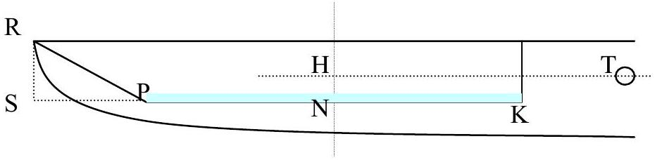
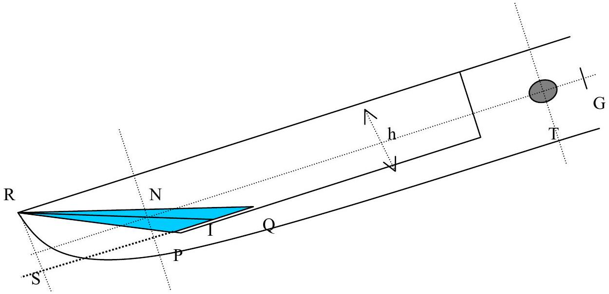
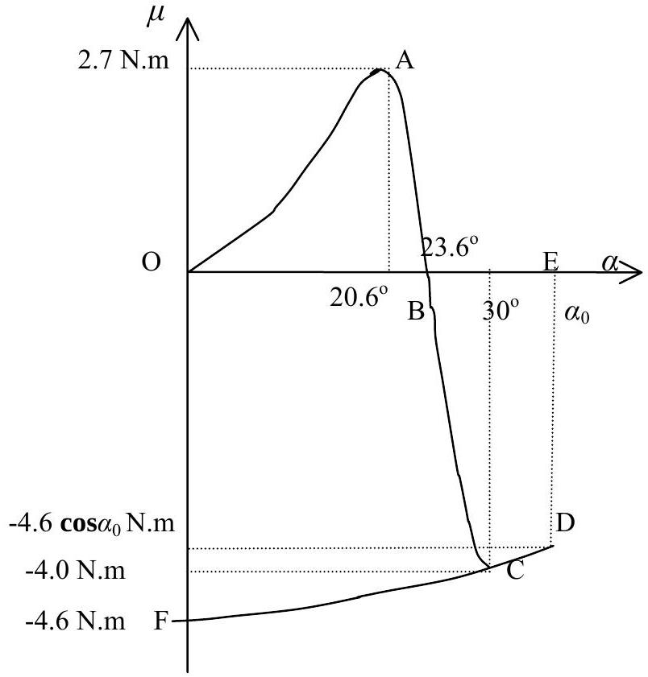
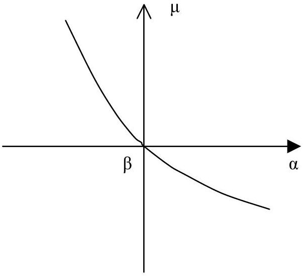

## Solution

## 1. The structure of the mortar

1.1. Calculating the distance TG

The volume of water in the bucket is $V = 1000 \mathrm {~cm} ^ { 3 } = 10 ^ { - 3 } \mathrm {~m} ^ { 3 }$. The length of the bottom of the bucket is $d = L - h \boldsymbol { \operatorname { t a n } } 60 ^ { \circ } = \left( 0.74 - 0.12 \boldsymbol { \operatorname { t a n } } 60 ^ { \circ } \right) \mathrm { m } = 0.5322 \mathrm {~m}$. (as the initial data are given with two significant digits, we shall keep only two significant digits in the final answer, but we keep more digits in the intermediate steps). The height $c$ of the water layer in the bucket is calculated from the formula:

$$
V = b c d + b \frac { c } { 2 } c \tan 60 ^ { 0 } \Rightarrow c = \frac { \left( d ^ { 2 } + 2 \sqrt { 3 } V / b \right) ^ { 1 / 2 } - d } { \sqrt { 3 } }
$$

Inserting numerical values for $V , b$ and $d$, we find $c = 0.01228 \mathrm {~m}$. When the lever lies horizontally, the distance, on the horizontal axis, between the rotation axis and the center of mass of water N, is $\mathrm { TH } \approx a + \frac { d } { 2 } + \frac { c } { 4 } \boldsymbol { \operatorname { t a n } } 60 ^ { \circ } = 0.4714 \mathrm {~m}$, and $\mathrm { TG } = ( m / M ) \mathrm { TH } = 0.01571 \mathrm {~m}$ (see the figure below).

Answer: $\mathrm { TG } = 0.016 \mathrm {~m}$.
1.2. Calculating the values of $\alpha _ { 1 }$ and $\alpha _ { 2 }$.

When the lever tilts with angle $\alpha _ { 1 }$, water level is at the edge of the bucket. At that point the water volume is $10 ^ { - 3 } \mathrm {~m} ^ { 3 }$. Assume $\mathrm { PQ } < d$. From geometry $V = h b \times \mathrm { PQ } / 2$, from which $\mathrm { PQ } = 0.1111 \mathrm {~m}$. The assumption $\mathrm { PQ } < d$ is obviously satisfied $( d = 0.5322 \mathrm {~m} )$.

To compute the angle $\alpha _ { 1 }$, we note that $\boldsymbol { \operatorname { t a n } } \alpha _ { 1 } = h / \mathrm { QS } = h / ( \mathrm { PQ } + \sqrt { 3 } h )$. From this we find $\alpha _ { 1 } = 20.6 ^ { \circ }$.

When the tilt angle is $30 ^ { \circ }$, the bucket is empty: $\alpha _ { 2 } = 30 ^ { \circ }$.

1.3. Determining the tilt angle $\beta$ of the lever and the amount of water in the bucket $m$ when the total torque $\mu$ on the lever is equal to zero

Denote $\mathrm { PQ } = x ( \mathrm {~m} )$. The amount of water in the bucket is $m = \rho _ { \text {water } } \frac { x h b } { 2 } = 9 x ( \mathrm {~kg} )$.
$\mu = 0$ when the torque coming from the water in the bucket cancels out the torque coming from the weight of the lever. The cross section of the water in the bucket is the triangle PQR in the figure. The center of mass N of water is located at 2/3 of the meridian RI, therefore NTG lies on a straight line. Then: $m g \times \mathrm { TN } = M g \times \mathrm { TG }$ or

$$
\begin{equation*}
m \times \mathrm { TN } = M \times \mathrm { TG } = 30 \times 0.1571 = 0.4714 \tag{1}
\end{equation*}
$$

Calculating TN from $x$ then substitute (1) :

$$
\begin{equation*}
\mathrm { TN } = L + a - \frac { 2 } { 3 } \left( h \sqrt { 3 } + \frac { x } { 2 } \right) = 0.94 - 0.08 \sqrt { 3 } - \frac { x } { 3 } = 0.8014 - \frac { x } { 3 } \tag{2}
\end{equation*}
$$

which implies $m \times \mathrm { TN } = 9 x ( 0.8014 - x / 3 ) = - 3 x ^ { 2 } + 7.213 x$
So we find an equation for $x$ :

$$
\begin{equation*}
- 3 x ^ { 2 } + 7.213 x = 0.4714 \tag{3}
\end{equation*}
$$

The solutions to (3) are $x = 2.337$ and $x = 0.06723$. Since $x$ has to be smaller than 0.5322, we have to take $x = x _ { 0 } = 0.06723$ and $m = 9 x _ { 0 } = 0.6051 \mathrm {~kg}$.

$$
\tan \beta = \frac { h } { x + h \sqrt { 3 } } = 0.4362 , \text { or } \quad \beta = 23.57 ^ { \circ } .
$$

Answer: $m = 0.61 \mathrm {~kg}$ and $\beta = 23.6 ^ { \circ }$.

## 2. Parameters of the working mode

2.1.Graphs of $\mu ( \alpha ) , \alpha ( t )$, and $\mu ( t )$ during one operation cycle.

Initially when there is no water in the bucket, $\alpha = 0 , \mu$ has the largest magnitude equal to $g M \times \mathrm { TG } = 30 \times 9.81 \times 0.01571 = 4.624 \mathrm {~N} \cdot \mathrm {~m}$. Our convention will be that the sign of this torque is negative as it tends to decrease $\alpha$.

As water flows into the bucket, the torque coming from the water (which carries positive sign) makes $\mu$ increase until $\mu$ is slightly positive, when the lever starts to lift up. From that moment, by assumption, the amount of water in the bucket is constant.

The lever tilts so the center of mass of water moves away from the rotation axis, leading to an increase of $\mu$, which reaches maximum when water is just about to overflow the edge of the bucket. At this moment $\alpha = \alpha _ { 1 } = 20.6 ^ { \circ }$.

A simple calculation shows that

$$
\begin{aligned}
& \mathrm { SI } = \mathrm { SP } + \mathrm { PQ } / 2 = 0.12 \times 1.732 + 0.1111 / 2 = 0.2634 \mathrm {~m} . \\
& \mathrm { TN } = 0.20 + 0.74 - \frac { 2 } { 3 } \mathrm { SI } = 0.7644 \mathrm {~m} .
\end{aligned}
$$

$$
\begin{aligned}
\mu _ { \max } & = ( 1.0 \times \mathrm { TN } - 30 \times \mathrm { TG } ) g \boldsymbol { \operatorname { c o s } } 20.6 ^ { \circ } \\
& = ( 1.0 \times 0.7644 - 30 \times 0.01571 ) \times 9.81 \times \boldsymbol { \operatorname { c o s } } 20.6 ^ { \circ } = 2.690 \mathrm {~N} \cdot \mathrm {~m} .
\end{aligned}
$$

Therefore $\mu _ { \max } = 2.7 \mathrm {~N} \cdot \mathrm {~m}$.
As the bucket tilts further, the amount of water in the bucket decreases, and when $\alpha = \beta , \mu = 0$. Due to inertia, $\alpha$ keeps increasing and $\mu$ keeps decreasing. The bucket is empty when $\alpha = 30 ^ { \circ }$, when $\mu$ equals $- 30 \times g \times \mathrm { TG } \times \boldsymbol { \operatorname { c o s } } 30 ^ { \circ } = - 4.0 \mathrm {~N} \cdot \mathrm {~m}$. After that $\alpha$ keeps increasing due to inertia to $\alpha _ { 0 } \quad \left( \mu = - g M \mathrm { TG } \boldsymbol { \operatorname { c o s } } \alpha _ { 0 } = - 4.62 \boldsymbol { \operatorname { c o s } } \alpha _ { 0 } \mathrm {~N} \cdot \mathrm {~m} \right)$, then quickly decreases to 0 $( \mu = - 4.62 \mathrm {~N} \cdot \mathrm {~m} )$.

On this basis we can sketch the graphs of $\alpha ( t ) , \mu ( t )$, and $\mu ( \alpha )$ as in the figure below

2.2. The infinitesimal work produced by the torque $\mu ( \alpha )$ is $d W = \mu ( \alpha ) d \alpha$. The energy obtained by the lever during one cycle due to the action of $\mu ( \alpha )$ is $W = \oint \mu ( \alpha ) d \alpha$, which is the area limited by the line $\mu ( \alpha )$. Therefore $W _ { \text {total } }$ is equal to the area enclosed by the curve(OABCDFO) on the graph $\mu ( \alpha )$.

The work that the lever transfers to the mortar is the energy the lever receives as it moves from the position $\alpha = \alpha _ { \mathrm { o } }$ to the horizontal position $\alpha = 0$. We have $W _ { \text {pounding } }$ equals to the area of (OEDFO) on the graph $\mu ( \alpha )$. It is equal to $g M \times \mathrm { TG } \times \boldsymbol { \operatorname { s i n } } \alpha _ { 0 } = 4.6 \boldsymbol { \operatorname { s i n } } \alpha _ { 0 }$
2.3. The magnitudes of $\alpha _ { 0 }$ can be estimated from the fact that at point D the energy of the lever is zero. We have
area (OABO) = area (BEDCB)
Approximating OABO by a triangle, and BEDCB by a trapezoid, we obtain:

$$
23.6 \times 2.7 \times ( 1 / 2 ) = 4.0 \times \left[ \left( \alpha _ { 0 } - 23.6 \right) + \left( \alpha _ { 0 } - 30 \right) \right] \times ( 1 / 2 ) ,
$$

which implies $\alpha _ { 0 } = 34.7 ^ { \circ }$. From this we find

$$
W _ { \text {pounding } } = \text { area } ( \mathrm { OEDFO } ) = \int _ { 34.76 } ^ { 0 } - M g \times \mathrm { TG } \times \boldsymbol { \operatorname { c o s } } \alpha d \alpha = 4.62 \times \boldsymbol { \operatorname { s i n } } 34.7 ^ { \circ } = 2.63
$$

Thus we find $W _ { \text {pounding } } \approx 2.6 \mathrm {~J}$.

## 3. The rest mode

3.1.
3.1.1. The bucket is always overflown with water. The two branches of $\mu ( \alpha )$ in the vicinity of $\alpha = \beta$ corresponding to increasing and decreasing $\alpha$ coincide with each other.

The graph implies that $\alpha = \beta$ is a stable
 equilibrium of the mortar.
3.1.2. Find the expression for the torque $\mu$ when the tilt angle is $\alpha = \beta + \Delta \alpha$ ( $\Delta \alpha$ is small).

The mass of water in bucket when the lever tilts with angle $\alpha$ is $m = ( 1 / 2 ) \rho b h \mathrm { PQ }$, where $\mathrm { PQ } = h \left( \frac { 1 } { \boldsymbol { \operatorname { t a n } } \alpha } - \frac { 1 } { \boldsymbol { \operatorname { t a n } } 30 ^ { \circ } } \right)$. A simple calculation shows that when $\alpha$ increases from $\beta$ to $\beta + \Delta \alpha$, the mass of water increases by $\Delta m = - \frac { b h ^ { 2 } \rho } { 2 \sin ^ { 2 } \alpha } \Delta \alpha \approx - \frac { b h ^ { 2 } \rho } { 2 \sin ^ { 2 } \beta } \Delta \alpha$. The torque $\mu$ acting on the lever when the tilt is $\beta + \Delta \alpha$ equals the torque due to $\Delta m$.

We have $\mu = \Delta m \times g \times \mathrm { TN } \times \boldsymbol { \operatorname { c o s } } ( \beta + \Delta \alpha )$. TN is found from the equilibrium condition of the lever at tilting angle $\beta$ :

$$
\mathrm { TN } = M \times \mathrm { TG } / m = 30 \times 0.01571 / 0.605 = 0.779 \mathrm {~m} .
$$

We find at the end $\mu = - 47.2 \times \Delta \alpha \mathrm { N } \cdot \mathrm { m } \approx - 47 \times \Delta \alpha \mathrm { N } \cdot \mathrm { m }$.
3.1.3. Equation of motion of the lever

$$
\mu = I \frac { d ^ { 2 } \alpha } { d t ^ { 2 } } \text { where } \mu = - 47 \times \Delta \alpha , \alpha = \beta + \Delta \alpha , \text { and } I \text { is the sum of moments }
$$

of inertia of the lever and of the water in bucket relative to the axis T. Here $I$ is not constant the amount of water in the bucket depends on $\alpha$. When $\Delta \alpha$ is small, one can consider the amount and the shape of water in the bucket to be constant, so $I$ is approximatey a constant. Consider water in bucket as a material point with mass 0.6 kg, a simple calculation gives $I = 12 + 0.6 \times 0.78 ^ { 2 } = 12.36 \approx 12.4 \mathrm {~kg} \mathrm {~m} ^ { 2 }$. We have $- 47 \times \Delta \alpha = 12.4 \times \frac { d ^ { 2 } \Delta \alpha } { d t ^ { 2 } }$. That is the equation for a harmonic oscillator with period

$\tau = 2 \pi \sqrt { \frac { 12.4 } { 47 } } = 3.227$. The answer is therefore $\tau = 3.2 \mathrm {~s}$.
3.2. Harmonic oscillation of lever (around $\alpha = \beta$ ) when bucket is always overflown. Assume the lever oscillate harmonically with amplitude $\Delta \alpha _ { 0 }$ around $\alpha = \beta$. At time $t = 0 , \Delta \alpha = 0$, the bucket is overflown. At time $d t$ the tilt changes by $d \alpha$. We are interested in the case $d \alpha < 0$, i.e., the motion of lever is in the direction of decreasing $\alpha$, and one needs to add more water to overflow the bucket. The equation of motion is: $\Delta \alpha = - \Delta \alpha _ { 0 } \sin ( 2 \pi t / \tau )$, therefore $d ( \Delta \alpha ) = d \alpha = - \Delta \alpha _ { 0 } ( 2 \pi / \tau ) \cos ( 2 \pi t / \tau ) d t$.

For the bucket to be overflown, during this time the amount of water falling to the bucket should be at least $\quad d m = - \frac { b h ^ { 2 } \rho } { 2 \boldsymbol { \operatorname { s i n } } ^ { 2 } \beta } d \alpha = \frac { 2 \Delta \alpha _ { 0 } \pi b h ^ { 2 } \rho d t } { 2 \tau \boldsymbol { \operatorname { s i n } } ^ { 2 } \beta } \boldsymbol { \operatorname { c o s } } \left( \frac { 2 \pi t } { \tau } \right) \quad ; \quad d m$ is maximum at $t = 0 , \quad d m _ { 0 } = \frac { \pi b h ^ { 2 } \rho \Delta \alpha _ { 0 } } { \tau \sin ^ { 2 } \beta } d t$.

The amount of water falling to the bucket is related to flow rate $\Phi ; d m _ { 0 } = \Phi d t$, therefore $\Phi = \frac { \pi b h ^ { 2 } \rho \Delta \alpha _ { 0 } } { \tau \sin ^ { 2 } \beta }$.

An overflown bucket is the necessary condition for harmonic oscillations of the lever, therefore the condition for the lever to have harmonic oscillations with ampltude 1° or $2 \pi / 360 \mathrm { rad }$ is $\Phi \geq \Phi _ { 1 }$ with

$$
\Phi _ { 1 } = \frac { \pi b h ^ { 2 } \rho 2 \pi } { 360 \tau \sin ^ { 2 } \beta } = 0.2309 \mathrm {~kg} / \mathrm { s }
$$

So $\Phi _ { 1 } = 0.23 \mathrm {~kg} / \mathrm { s }$.

### 3.3 Determination of $\Phi _ { 2 }$

If the bucket remains overflown when the tilt decreases to 20.6°, then the amount of water in bucket should reach 1 kg at this time, and the lever oscillate harmonically with amplitude equal $23.6 ^ { 0 } - 20.6 ^ { 0 } = 3 ^ { 0 }$. The flow should exceed $3 \Phi _ { 1 }$, therefore

$$
\Phi _ { 2 } = 3 \times 0.23 \approx 0.7 \mathrm {~kg} / \mathrm { s } .
$$

This is the minimal flow rate for the rice-pounding mortar not to work.
