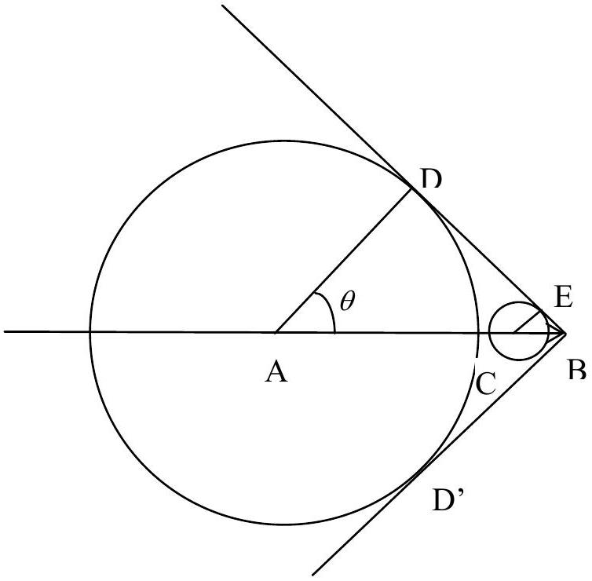
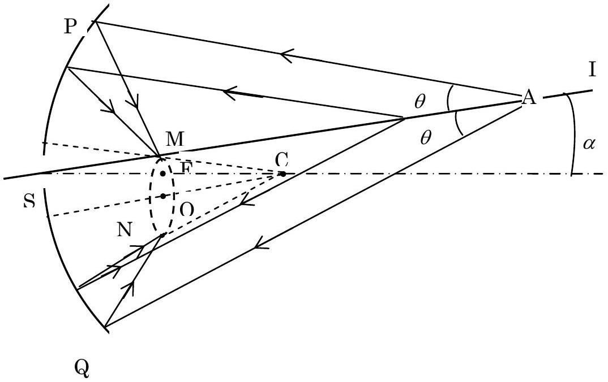

## Solution

1.

Figure 1

Let us consider a plane containing the particle trajectory. At $t = 0$, the particle position is at point A . It reaches point B at $t = t _ { 1 }$. According to the Huygens principle, at moment $0 < t < t _ { 1 }$, the radiation emitted at A reaches the circle with a radius equal to AD and the one emitted at C reaches the circle of radius CE . The radii of the spheres are proportional to the distance of their centre to B:

$$
\frac { \mathrm { CE } } { \mathrm { CB } } = \frac { c \left( t _ { 1 } - t \right) / n } { v \left( t _ { 1 } - t \right) } = \frac { 1 } { \beta n } = \mathrm { const }
$$

The spheres are therefore transformed into each other by homothety of vertex B and their envelope is the cone of summit B and half aperture $\varphi = \boldsymbol { \operatorname { A r c s i n } } \frac { 1 } { \beta n } = \frac { \pi } { 2 } - \theta$, where $\theta$ is the angle made by the light ray CE with the particle trajectory.
1.1. The intersection of the wave front with the plane is two straight lines, BD and BD'.
1.2. They make an angle $\varphi = \boldsymbol { \operatorname { A r c s i n } } \frac { 1 } { \beta n }$ with the particle trajectory.

2. The construction for finding the ring image of the particles beam is taken in the plane containing the trajectory of the particle and the optical axis of the mirror.

We adopt the notations:
S - the point where the beam crosses the spherical mirror
F - the focus of the spherical mirror
C - the center of the spherical mirror
IS - the straight-line trajectory of the charged particle making a small angle $\alpha$ with the optical axis of the mirror.

Figure 2

$$
\begin{aligned}
& \mathrm { CF } = \mathrm { FS } = f \\
& \mathrm { CO } / / \mathrm { IS } \\
& \mathrm { CM } / / \mathrm { AP } \\
& \mathrm { CN } / / \mathrm { AQ } \\
& \widehat { \mathrm { FCO } } = \alpha \Rightarrow \mathrm { FO } = f \times \alpha \\
& \widehat { \mathrm { MCO } } = \widehat { \mathrm { OCN } } = \theta \Rightarrow \mathrm { MO } = f \times \theta
\end{aligned}
$$

We draw a straight line parallel to IS passing through the center C. The line intersects the focal plane at O . We have $\mathrm { FO } \approx f \times \alpha$.

Starting from C, we draw two lines in both sides of the line CO making with it an angle $\theta$. These two lines intersect the focal plane at M and N, respectively. All the rays of Cherenkov radiation in the plane of the sketch, striking the mirror and being reflected,

intersect at M or N.
In three-dimension case, the Cherenkov radiation gives a ring in the focal plane with the center at $\mathrm { O } ( \mathrm { FO } \approx f \times \alpha )$ and with the radius $\mathrm { MO } \approx f \times \theta$.

In the construction, all the lines are in the plane of the sketch. Exceptionally, the ring is illustrated spatially by a dash line.
3.
3.1. For the Cherenkov effect to occur it is necessary that $n > \frac { c } { v }$, that is $n _ { \text {min } } = \frac { c } { v }$.
Putting $\zeta = n - 1 = 2.7 \times 10 ^ { - 4 } P$, we get

$$
\begin{equation*}
\zeta _ { \min } = 2.7 \times 10 ^ { - 4 } P _ { \min } = \frac { c } { v } - 1 = \frac { 1 } { \beta } - 1 \tag{1}
\end{equation*}
$$

Because

$$
\begin{equation*}
\frac { M c ^ { 2 } } { p c } = \frac { M c } { p } = \frac { M c } { \frac { M v } { \sqrt { 1 - \beta ^ { 2 } } } } = \frac { \sqrt { 1 - \beta ^ { 2 } } } { \beta } = K \tag{2}
\end{equation*}
$$

then $K = 0.094 ; 0.05 ; 0.014$ for proton, kaon and pion, respectively.
From (2) we can express $\beta$ through $K$ as

$$
\begin{equation*}
\beta = \frac { 1 } { \sqrt { 1 + K ^ { 2 } } } \tag{3}
\end{equation*}
$$

Since $K ^ { 2 } \ll 1$ for all three kinds of particles we can neglect the terms of order higher than 2 in $K$. We get

$$
\begin{align*}
& 1 - \beta = 1 - \frac { 1 } { \sqrt { 1 + K ^ { 2 } } } \approx \frac { 1 } { 2 } K ^ { 2 } = \frac { 1 } { 2 } \left( \frac { M c } { p } \right) ^ { 2 }  \tag{3a}\\
& \frac { 1 } { \beta } - 1 = \sqrt { 1 + K ^ { 2 } } - 1 \approx \frac { 1 } { 2 } K ^ { 2 } = \frac { 1 } { 2 } \left( \frac { M c } { p } \right) ^ { 2 } \tag{3b}
\end{align*}
$$

Putting (3b) into (1), we obtain

$$
\begin{equation*}
P _ { \min } = \frac { 1 } { 2.7 \times 10 ^ { - 4 } } \times \frac { 1 } { 2 } K ^ { 2 } \tag{4}
\end{equation*}
$$

We get the following numerical values of the minimal pressure:

$$
\begin{array} { l l }
P _ { \min } = 16 \mathrm {~atm} & \text { for protons, } \\
P _ { \min } = 4.6 \mathrm {~atm} & \text { for kaons, } \\
P _ { \min } = 0.36 \mathrm {~atm} & \text { for pions. }
\end{array}
$$

3.2. For $\theta _ { \pi } = 2 \theta _ { \kappa } \quad$ we have

$$
\begin{equation*}
\cos \theta _ { \pi } = \cos 2 \theta _ { \kappa } = 2 \cos ^ { 2 } \theta _ { \kappa } - 1 \tag{5}
\end{equation*}
$$

We denote

$$
\begin{equation*}
\varepsilon = 1 - \beta = 1 - \frac { 1 } { \sqrt { 1 + K ^ { 2 } } } \approx \frac { 1 } { 2 } K ^ { 2 } \tag{6}
\end{equation*}
$$

From (5) we obtain

$$
\begin{equation*}
\frac { 1 } { \beta _ { \pi } n } = \frac { 2 } { \beta _ { \kappa } ^ { 2 } n ^ { 2 } } - 1 \tag{7}
\end{equation*}
$$

Substituting $\beta = 1 - \varepsilon$ and $n = 1 + \zeta$ into (7), we get approximately:

$$
\begin{aligned}
& \zeta _ { \frac { 1 } { 2 } } = \frac { 4 \varepsilon _ { \kappa } - \varepsilon _ { \pi } } { 3 } = \frac { 1 } { 6 } \left( 4 K _ { \kappa } ^ { 2 } - K _ { \pi } ^ { 2 } \right) = \frac { 1 } { 6 } \left[ 4 . ( 0.05 ) ^ { 2 } - ( 0.014 ) ^ { 2 } \right] \\
& P _ { \frac { 1 } { 2 } } = \frac { 1 } { 2.7 \times 10 ^ { - 4 } } \zeta _ { \frac { 1 } { 2 } } = 6 \mathrm {~atm}
\end{aligned}
$$

The corresponding value of refraction index is $n = 1.00162$. We get:

$$
\theta _ { \kappa } = 1.6 ^ { \circ } ; \quad \theta _ { \pi } = 2 \theta _ { \kappa } = 3.2 ^ { \circ } .
$$

We do not observe the ring image of protons since

$$
P _ { \frac { 1 } { 2 } } = 6 \mathrm {~atm} < 16 \mathrm {~atm} = P _ { \min } \text { for protons. }
$$

4.

4.1. Taking logarithmic differentiation of both sides of the equation $\boldsymbol { \operatorname { c o s } } \theta = \frac { 1 } { \beta n }$, we obtain

$$
\begin{equation*}
\frac { \boldsymbol { \operatorname { s i n } } \theta \times \Delta \theta } { \boldsymbol { \operatorname { c o s } } \theta } = \frac { \Delta \beta } { \beta } \tag{8}
\end{equation*}
$$

Logarithmically differentiating equation (3a) gives

$$
\begin{equation*}
\frac { \Delta \beta } { 1 - \beta } = 2 \frac { \Delta p } { p } \tag{9}
\end{equation*}
$$

Combining (8) and (9), taking into account (3b) and putting approximately $\boldsymbol { \operatorname { t a n } } \theta = \theta$, we derive

$$
\begin{equation*}
\frac { \Delta \theta } { \Delta p } = \frac { 2 } { \theta } \times \frac { 1 - \beta } { p \beta } = \frac { K ^ { 2 } } { \theta p } \tag{10}
\end{equation*}
$$

We obtain
-for kaons $K _ { \kappa } = 0.05 , \quad \theta _ { \kappa } = 1.6 ^ { 0 } = 1.6 \frac { \pi } { 180 } \mathrm { rad }$, and so, $\quad \frac { \Delta \theta _ { \kappa } } { \Delta p } = 0.51 \frac { 1 ^ { 0 } } { \mathrm { GeV } / c }$,
-for pions $K _ { \pi } = 0.014 \quad , \quad \theta _ { \pi } = 3.2 ^ { \circ } \quad , \quad$ and

$$
\frac { \Delta \theta _ { \pi } } { \Delta p } = 0.02 \frac { 1 ^ { \mathrm { o } } } { \mathrm { GeV } / c } .
$$

4.2. $\frac { \Delta \theta _ { \kappa } + \Delta \theta _ { \pi } } { \Delta p } \equiv \frac { \Delta \theta } { \Delta p } = ( 0.51 + 0.02 ) \frac { 1 ^ { o } } { \mathrm { GeV } / c } = 0.53 \frac { 1 ^ { o } } { \mathrm { GeV } / c }$.

The condition for two ring images to be distinguishable is $\Delta \theta < 0.1 \left( \theta _ { \pi } - \theta _ { \kappa } \right) = 0.16 ^ { o }$.

It follows $\quad \Delta p < \frac { 1 } { 10 } \times \frac { 1.6 } { 0.53 } = 0.3 \mathrm { GeV } / c$.

5.

5.1. The lower limit of $\beta$ giving rise to Cherenkov effect is

$$
\begin{equation*}
\beta = \frac { 1 } { n } = \frac { 1 } { 1.33 } . \tag{11}
\end{equation*}
$$

The kinetic energy of a particle having rest mass $M$ and energy $E$ is given by the expression

$$
\begin{equation*}
T = E - M c ^ { 2 } = \frac { M c ^ { 2 } } { \sqrt { 1 - \beta ^ { 2 } } } - M c ^ { 2 } = M c ^ { 2 } \left[ \frac { 1 } { \sqrt { 1 - \beta ^ { 2 } } } - 1 \right] . \tag{12}
\end{equation*}
$$

Substituting the limiting value (11) of $\beta$ into (12), we get the minimal kinetic energy of the particle for Cherenkov effect to occur:

$$
\begin{equation*}
T _ { \min } = M c ^ { 2 } \left[ \frac { 1 } { \sqrt { 1 - \left( \frac { 1 } { 1.33 } \right) ^ { 2 } } } - 1 \right] = 0.517 M c ^ { 2 } \tag{13}
\end{equation*}
$$

5.2.

For $\alpha$ particles, $T _ { \text {min } } = 0.517 \times 3.8 \mathrm { GeV } = 1.96 \mathrm { GeV }$.

For electrons, $\quad T _ { \text {min } } = 0.517 \times 0.51 \mathrm { MeV } = 0.264 \mathrm { MeV }$.
Since the kinetic energy of the particles emitted by radioactive source does not exceed a few MeV, these are electrons which give rise to Cherenkov radiation in the considered experiment.
6. For a beam of particles having a definite momentum the dependence of the angle $\theta$ on the refraction index $n$ of the medium is given by the expression

$$
\begin{equation*}
\cos \theta = \frac { 1 } { n \beta } \tag{14}
\end{equation*}
$$

6.1. Let $\delta \theta$ be the difference of $\theta$ between two rings corresponding to two wavelengths limiting the visible range, i.e. to wavelengths of $0.4 \mu \mathrm {~m}$ (violet) and $0.8 \mu \mathrm {~m}$ (red), respectively. The difference in the refraction indexes at these wavelengths is $n _ { \mathrm { v } } - n _ { \mathrm { r } } = \delta n = 0.02 ( n - 1 )$.

Logarithmically differentiating both sides of equation (14) gives

$$
\begin{equation*}
\frac { \boldsymbol { \operatorname { s i n } } \theta \times \delta \theta } { \boldsymbol { \operatorname { c o s } } \theta } = \frac { \delta n } { n } \tag{15}
\end{equation*}
$$

Corresponding to the pressure of the radiator $P = 6 \mathrm {~atm}$ we have from 4.2. the values $\theta _ { \pi } = 3.2 ^ { \circ } , \quad n = 1.00162$.

Putting approximately $\boldsymbol { \operatorname { t a n } } \theta = \theta$ and $n = 1$, we get $\delta \theta = \frac { \delta n } { \theta } = 0.033 ^ { \circ }$. 6.2.
6.2.1. The broadening due to dispersion in terms of half width at half height is, according to (6.1), $\frac { 1 } { 2 } \delta \theta = 0.017 ^ { \circ }$.
6.2.2. The broadening due to achromaticity is, from 4.1., $0.02 \frac { 1 ^ { \mathrm { o } } } { \mathrm { GeV } / \mathrm { c } } \times 0.3 \mathrm { GeV } / \mathrm { c } = 0.006 ^ { \mathrm { o } }$, that is three times smaller than above.
6.2.3. The color of the ring changes from red to white then blue from the inner edge to the outer one.
