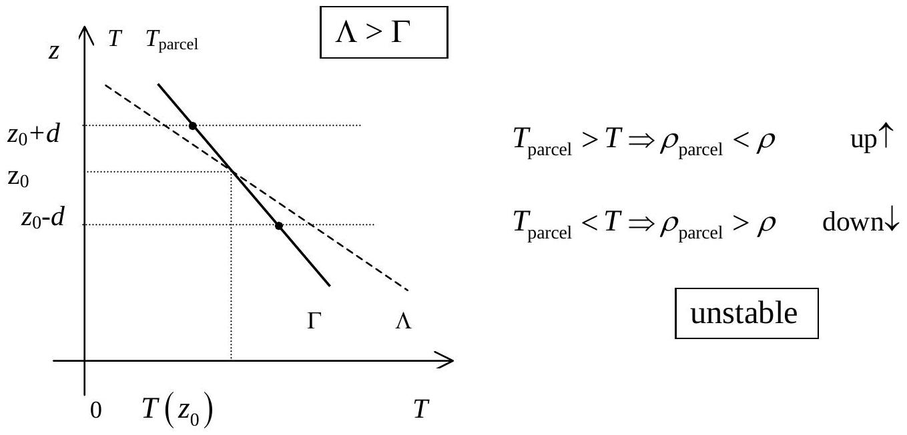
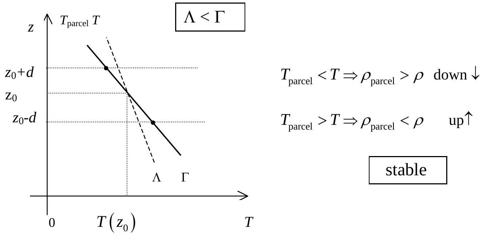
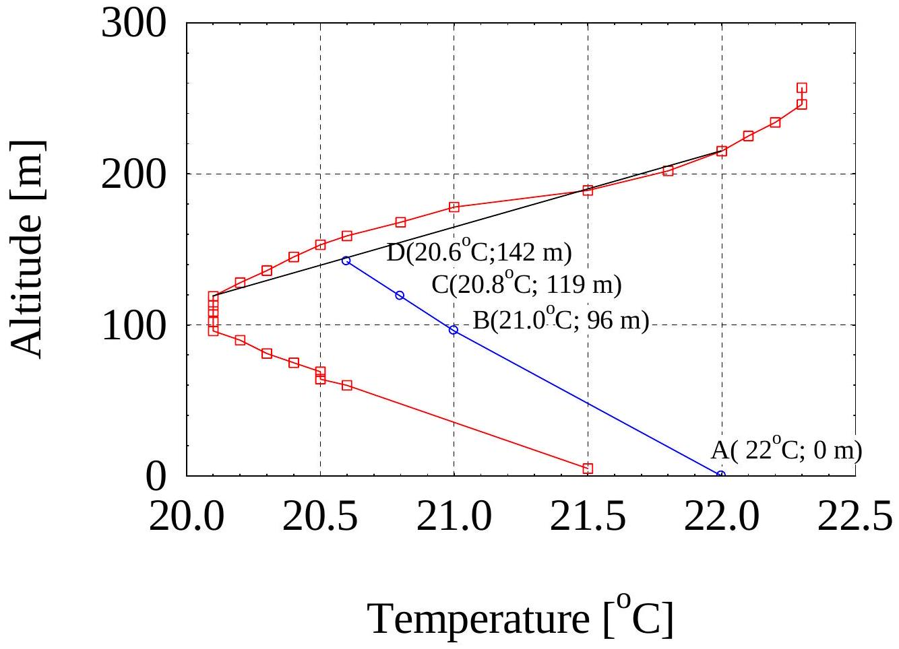

## Solution

1. For an altitude change $d z$, the atmospheric pressure change is :

$$
\begin{equation*}
d p = - \rho g d z \tag{1}
\end{equation*}
$$

where $g$ is the acceleration of gravity, considered constant, $\rho$ is the specific mass of air, which is considered as an ideal gas:

$$
\rho = \frac { m } { V } = \frac { p \mu } { R T }
$$

Put this expression in (1) :

$$
\frac { d p } { p } = - \frac { \mu g } { R T } d z
$$

1.1. If the air temperature is uniform and equals $T _ { 0 }$, then

$$
\frac { d p } { p } = - \frac { \mu g } { R T _ { 0 } } d z
$$

After integration, we have :

$$
\begin{equation*}
p ( z ) = p ( 0 ) \mathbf { e } ^ { - \frac { \mu g } { R T _ { 0 } } z } \tag{2}
\end{equation*}
$$

1.2. If

$$
\begin{equation*}
T ( z ) = T ( 0 ) - \Lambda z \tag{3}
\end{equation*}
$$

then

$$
\begin{equation*}
\frac { d p } { p } = - \frac { \mu g } { R [ T ( 0 ) - \Lambda z ] } d z \tag{4}
\end{equation*}
$$

1.2.1. Knowing that :

$$
\int \frac { d z } { T ( 0 ) - \Lambda z } = - \frac { 1 } { \Lambda } \int \frac { d [ T ( 0 ) - \Lambda z ] } { T ( 0 ) - \Lambda z } = - \frac { 1 } { \Lambda } \ln ( T ( 0 ) - \Lambda z )
$$

by integrating both members of (4), we obtain :

$$
\begin{align*}
& \ln \frac { p ( z ) } { p ( 0 ) } = \frac { \mu g } { R \Lambda } \ln \frac { T ( 0 ) - \Lambda z } { T ( 0 ) } = \frac { \mu g } { R \Lambda } \ln \left( 1 - \frac { \Lambda z } { T ( 0 ) } \right) \\
& p ( z ) = p ( 0 ) \left( 1 - \frac { \Lambda z } { T ( 0 ) } \right) ^ { \frac { \mu g } { R \Lambda } } \tag{5}
\end{align*}
$$

1.2.2. The free convection occurs if:

$$
\frac { \rho ( z ) } { \rho ( 0 ) } > 1
$$

The ratio of specific masses can be expressed as follows:

$$
\frac { \rho ( z ) } { \rho ( 0 ) } = \frac { p ( z ) } { p ( 0 ) } \frac { T ( 0 ) } { T ( z ) } = \left( 1 - \frac { \Lambda z } { T ( 0 ) } \right) ^ { \frac { \mu g } { R \Lambda } - 1 }
$$

The last term is larger than unity if its exponent is negative:

$$
\frac { \mu g } { R \Lambda } - 1 < 0
$$

Then :

$$
\Lambda > \frac { \mu g } { R } = \frac { 0.029 \times 9.81 } { 8.31 } = 0.034 \frac { \mathrm {~K} } { \mathrm {~m} }
$$

2. In vertical motion, the pressure of the parcel always equals that of the surrounding air, the latter depends on the altitude. The parcel temperature $T _ { \text {parcel } }$ depends on the pressure.
2.1. We can write:

$$
\frac { d T _ { \text {parcel } } } { d z } = \frac { d T _ { \text {parcel } } } { d p } \frac { d p } { d z }
$$

$p$ is simultaneously the pressure of air in the parcel and that of the surrounding air.
Expression for $\frac { d T _ { \text {parcel } } } { d p }$

By using the equation for adiabatic processes $p V ^ { \gamma } =$ const and equation of state, we can deduce the equation giving the change of pressure and temperature in a quasi-equilibrium adiabatic process of an air parcel:

$$
\begin{equation*}
T _ { \text {parcel } } p ^ { \frac { 1 - \gamma } { \gamma } } = \mathrm { const } \tag{6}
\end{equation*}
$$

where $\gamma = \frac { c _ { p } } { c _ { V } }$ is the ratio of isobaric and isochoric thermal capacities of air. By logarithmic differentiation of the two members of (6), we have:

$$
\frac { d T _ { \text {parcel } } } { T _ { \text {parcel } } } + \frac { 1 - \gamma } { \gamma } \frac { d p } { p } = 0
$$

Or

$$
\begin{equation*}
\frac { d T _ { \text {parcel } } } { d p } = \frac { T _ { \text {parcel } } } { p } \frac { \gamma - 1 } { \gamma } \tag{7}
\end{equation*}
$$

Note: we can use the first law of thermodynamic to calculate the heat received by the parcel in an elementary process: $d Q = \frac { m } { \mu } c _ { V } d T _ { \text {parcel } } + p d V$, this heat equals zero in an adiabatic process. Furthermore, using the equation of state for air in the parcel $p V = \frac { m } { \mu } R T _ { \text {parcel } }$ we can derive (6)
Expression for $\frac { d p } { d z }$
From (1) we can deduce:

$$
\frac { d p } { d z } = - \rho g = - \frac { p g \mu } { R T }
$$

where $T$ is the temperature of the surrounding air.
On the basis of these two expressions, we derive the expression for $d T _ { \text {parcel } } / d z :$

$$
\begin{equation*}
\frac { d T _ { \text {parcel } } } { d z } = - \frac { \gamma - 1 } { \gamma } \frac { \mu g } { R } \frac { T _ { \text {parcel } } } { T } = - G \tag{8}
\end{equation*}
$$

In general, $G$ is not a constant.
2.2.
2.2.1. If at any altitude, $T = T _ { \text {parcel } }$, then instead of $G$ in (8), we have :

$$
\begin{equation*}
\Gamma = \frac { \gamma - 1 } { \gamma } \frac { \mu g } { R } = \mathrm { const } \tag{9}
\end{equation*}
$$

or

$$
\begin{equation*}
\Gamma = \frac { \mu g } { c _ { p } } \tag{9'}
\end{equation*}
$$

2.2.2. Numerical value:

$$
\Gamma = \frac { 1.4 - 1 } { 1.4 } \frac { 0.029 \times 9.81 } { 8.31 } = 0.00978 \frac { \mathrm {~K} } { \mathrm {~m} } \approx 10 ^ { - 2 } \frac { \mathrm {~K} } { \mathrm {~m} }
$$

2.2.3. Thus, the expression for the temperature at the altitude $z$ in this special atmosphere (called adiabatic atmosphere) is :

$$
\begin{equation*}
T ( z ) = T ( 0 ) - \Gamma z \tag{10}
\end{equation*}
$$

2.3. Search for the expression of $T _ { \text {parcel } } ( z )$

Substitute $T$ in (7) by its expression given in (3), we have:

$$
\frac { d T _ { \text {parcel } } } { T _ { \text {parcel } } } = - \frac { \gamma - 1 } { \gamma } \frac { \mu g } { R } \frac { d z } { T ( 0 ) - \Lambda z }
$$

Integration gives:

$$
\ln \frac { T _ { \text {parcel } } ( z ) } { T _ { \text {parcel } } ( 0 ) } = - \frac { \gamma - 1 } { \gamma } \frac { \mu g } { R } \left( - \frac { 1 } { \Lambda } \right) \ln \frac { T ( 0 ) - \Lambda z } { T ( 0 ) }
$$

Finally, we obtain:

$$
\begin{equation*}
T _ { \text {parcel } } ( z ) = T _ { \text {parcel } } ( 0 ) \left( \frac { T ( 0 ) - \Lambda z } { T ( 0 ) } \right) ^ { \frac { \Gamma } { \Lambda } } \tag{11}
\end{equation*}
$$

2.4.

From (11) we obtain

$$
T _ { \text {parcel } } ( z ) = T _ { \text {parcel } } ( 0 ) \left( 1 - \frac { \Lambda z } { T ( 0 ) } \right) ^ { \frac { \Gamma } { \Lambda } }
$$

If $\Lambda z \ll T ( 0 )$, then by putting $x = \frac { - T ( 0 ) } { \Lambda z }$, we obtain

$$
\begin{aligned}
T _ { \text {parcel } } ( z ) & = T _ { \text {parcel } } ( 0 ) \left( \left( 1 + \frac { 1 } { x } \right) ^ { x } \right) ^ { - \frac { \Gamma z } { T ( 0 ) } } \\
& \approx T _ { \text {parcel } } ( 0 ) \mathbf { e } ^ { - \frac { \Gamma z } { T ( 0 ) } } \approx T _ { \text {parcel } } ( 0 ) \left( 1 - \frac { \Gamma z } { T ( 0 ) } \right) \approx T _ { \text {parcel } } ( 0 ) - \Gamma z
\end{aligned}
$$

hence,

$$
\begin{equation*}
T _ { \text {parcel } } ( z ) \approx T _ { \text {parcel } } ( 0 ) - \Gamma z \tag{12}
\end{equation*}
$$

## 3. Atmospheric stability

In order to know the stability of atmosphere, we can study the stability of the equilibrium of an air parcel in this atmosphere.

At the altitude $z _ { 0 }$, where $T _ { \text {parcel } } \left( z _ { 0 } \right) = T \left( z _ { 0 } \right)$, the air parcel is in equilibrium. Indeed, in this case the specific mass $\rho$ of air in the parcel equals $\rho ^ { \prime }$ - that of the surrounding air in the atmosphere. Therefore, the buoyant force of the surrounding air on the parcel equals the weight of the parcel. The resultant of these two forces is zero.

Remember that the temperature of the air parcel $T _ { \text {parcel } } ( z )$ is given by (7), in which we can assume approximately $G = \Gamma$ at any altitude $z$ near $z = z _ { 0 }$.

Now, consider the stability of the air parcel equilibrium:
Suppose that the air parcel is lifted into a higher position, at the altitude $z _ { 0 } + d$ (with $d > 0$ ), $\quad T _ { \text {parcel } } \left( z _ { 0 } + d \right) = T _ { \text {parcel } } \left( z _ { 0 } \right) - \Gamma d$ and $T \left( z _ { 0 } + d \right) = T \left( z _ { 0 } \right) - \Lambda d$.

- In the case the atmosphere has temperature lapse rate $\Lambda > \Gamma$, we have $T _ { \text {parcel } } \left( z _ { 0 } + d \right) > T \left( z _ { 0 } + d \right)$, then $\rho < \rho ^ { \prime }$. The buoyant force is then larger than the air parcel weight, their resultant is oriented upward and tends to push the parcel away from the equilibrium position.

Conversely, if the air parcel is lowered to the altitude $z _ { 0 } - d ( d > 0 )$, $T _ { \text {parcel } } \left( z _ { 0 } - d \right) < T \left( z _ { 0 } - d \right)$ and then $\rho > \rho ^ { \prime }$.

The buoyant force is then smaller than the air parcel weight; their resultant is oriented downward and tends to push the parcel away from the equilibrium position (see Figure 1)
So the equilibrium of the parcel is unstable, and we found that: An atmosphere with a temperature lapse rate $\Lambda > \Gamma$ is unstable.

- In an atmosphere with temperature lapse rate $\Lambda < \Gamma$, if the air parcel is lifted to a higher position, at altitude $z _ { 0 } + d$ (with $d > 0$ ), $T _ { \text {parcel } } \left( z _ { 0 } + d \right) < T \left( z _ { 0 } + d \right)$, then

$\rho > \rho ^ { \prime }$. The buoyant force is then smaller than the air parcel weight, their resultant is oriented downward and tends to push the parcel back to the equilibrium position.

Conversely, if the air parcel is lowered to altitude $z _ { 0 } - d ( d > 0 )$, $T _ { \text {parcel } } \left( z _ { 0 } - d \right) > T \left( z _ { 0 } - d \right)$ and then $\rho < \rho ^ { \prime }$. The buoyant force is then larger than the air parcel weight, their resultant is oriented upward and tends to push the parcel also back to the equilibrium position (see Figure 2).

So the equilibrium of the parcel is stable, and we found that: An atmosphere with a temperature lapse rate $\Lambda < \Gamma$ is stable.

Figure 1

Figure 2

- In an atmosphere with lapse rate $\Lambda = \Gamma$, if the parcel is brought from equilibrium position and put in any other position, it will stay there, the equilibrium is indifferent. An atmosphere with a temperature lapse rate $\Lambda = \Gamma$ is neutral
3.2. In a stable atmosphere, with $\Lambda < \Gamma$, a parcel, which on ground has temperature $T _ { \text {parcel } } ( 0 ) > T ( 0 )$ and pressure $p ( 0 )$ equal to that of the atmosphere, can rise and reach a maximal altitude $h$, where $T _ { \text {parcel } } ( h ) = T ( h )$.

In vertical motion from the ground to the altitude $h$, the air parcel realizes an adiabatic quasi-static process, in which its temperature changes from $T _ { \text {parcel } } ( 0 )$ to $T _ { \text {parcel } } ( h ) = T ( h )$. Using (11), we can write:

$$
\begin{aligned}
& \left( 1 - \frac { \Lambda h } { T ( 0 ) } \right) ^ { - \frac { \Gamma } { \Lambda } } = \frac { T _ { \text {parcel } } ( 0 ) } { T ( h ) } = \frac { T _ { \text {parcel } } ( 0 ) } { T ( 0 ) \left( 1 - \frac { \Lambda h } { T ( 0 ) } \right) } \\
& \left( 1 - \frac { \Lambda h } { T ( 0 ) } \right) ^ { 1 - \frac { \Gamma } { \Lambda } } = T _ { \text {parcel } } ( 0 ) \times T ^ { - 1 } ( 0 ) \\
& 1 - \frac { \Lambda h } { T ( 0 ) } = T _ { \text {parcel } } ^ { \frac { \Lambda } { \Lambda - \Gamma } } ( 0 ) \times T ^ { - \frac { \Lambda } { \Lambda - \Gamma } } ( 0 ) \\
& h = \frac { 1 } { \Lambda } T ( 0 ) \left[ 1 - T _ { \text {parcel } } ^ { \frac { \Lambda } { \Lambda - \Gamma } } ( 0 ) \times T ^ { - \frac { \Lambda } { \Lambda - \Gamma } } ( 0 ) \right] \\
& = \frac { 1 } { \Lambda } \left[ T ( 0 ) - T _ { \text {parcel } } ^ { - \frac { \Lambda } { \Lambda - \Gamma } } ( 0 ) T ^ { \frac { \Gamma } { \Gamma - \Lambda } } ( 0 ) \right]
\end{aligned}
$$

So that the maximal altitude $h$ has the following expression:

$$
\begin{equation*}
h = \frac { 1 } { \Lambda } \left[ T ( 0 ) - \left( \frac { ( T ( 0 ) ) ^ { \Gamma } } { \left( T _ { \text {parcel } } ( 0 ) \right) ^ { \Lambda } } \right) ^ { \frac { 1 } { \Gamma - \Lambda } } \right] \tag{13}
\end{equation*}
$$

4. Using data from the Table, we obtain the plot of $z$ versus $T$ shown in Figure 3.

Figure 3

4.1. We can divide the atmosphere under 200m into three layers, corresponding to the following altitudes:

1) $0 < z < 96 \mathrm {~m} , \quad \Lambda _ { 1 } = \frac { 21.5 - 20.1 } { 91 } = 15.4 \times 10 ^ { - 3 } \frac { \mathrm {~K} } { \mathrm {~m} }$.
2) $96 \mathrm {~m} < z < 119 \mathrm {~m} , \Lambda _ { 2 } = 0$, isothermal layer.
3) $119 \mathrm {~m} < z < 215 \mathrm {~m} , \Lambda _ { 3 } = - \frac { 22 - 20.1 } { 215 - 119 } = - 0.02 \frac { \mathrm {~K} } { \mathrm {~m} }$.

In the layer 1), the parcel temperature can be calculated by using (11)

$$
T _ { \text {parcel } } ( 96 \mathrm {~m} ) = 294.04 \mathrm {~K} \approx 294.0 \mathrm {~K} \text { that is } 21.0 ^ { \circ } \mathrm { C }
$$

In the layer 2), the parcel temperature can be calculated by using its expression in isothermal atmosphere $T _ { \text {parcel } } ( z ) = T _ { \text {parcel } } ( 0 ) \exp \left[ - \frac { \Gamma z } { T ( 0 ) } \right]$.

The altitude 96 m is used as origin, corresponding to 0 m. The altitude 119 m corresponds to 23 m. We obtain the following value for parcel temperature:

$$
T _ { \text {parcel } } ( 119 \mathrm {~m} ) = 293.81 \mathrm {~K} \text { that is } 20.8 ^ { \circ } \mathrm { C }
$$

4.2. In the layer 3), starting from 119 m, by using (13) we find the maximal elevation $h = 23 \mathrm {~m}$, and the corresponding temperature 293.6 K (or 20.6 °C).

Finally, the mixing height is

$$
H = 119 + 23 = 142 \mathrm {~m} .
$$

And

$$
T _ { \text {parcel } } ( 142 \mathrm {~m} ) = 293.6 \mathrm {~K} \quad \text { that is } \quad 20.6 ^ { \circ } \mathrm { C }
$$

From this relation, we can find $T _ { \text {parcel } } ( 119 \mathrm {~m} ) \approx 293.82 \mathrm {~K}$ and $h = 23 \mathrm {~m}$.
Note: By using approximate expression (12) we can easily find $T _ { \text {parcel } } ( z ) = 294 \mathrm {~K}$ and 293.8 K at elevations 96 m and 119 m, respectively. At 119 m elevation, the difference between parcel and surrounding air temperatures is $0.7 \mathrm {~K} ( = 293.8 - 293.1 )$, so that the maximal distance the parcel will travel in the third layer is $0.7 / \left( \Gamma - \Lambda _ { 3 } \right) = 0.7 / 0.03 = 23 \mathrm {~m}$.

## 5.

Consider a volume of atmosphere of Hanoi metropolitan area being a parallelepiped with height $H$, base sides $L$ and $W$. The emission rate of CO gas by motorbikes from 7:00 am to 8:00 am

$$
M = 800000 \times 5 \times 12 / 3600 = 13300 \mathrm {~g} / \mathrm { s }
$$

The CO concentration in air is uniform at all points in the parallelepiped and denoted by $C ( t )$.
5.1. After an elementary interval of time $d t$, due to the emission of the motorbikes, the mass of CO gas in the box increases by $M d t$. The wind blows parallel to the short sides $W$, bringing away an amount of CO gas with mass $L H C ( t ) u d t$. The remaining part raises the CO concentration by a quantity $d C$ in all over the box. Therefore:

$$
M d t - L H C ( t ) u d t = L W H d C
$$

or

$$
\begin{equation*}
\frac { d C } { d t } + \frac { u } { W } C ( t ) = \frac { M } { L W H } \tag{14}
\end{equation*}
$$

5.2. The general solution of (14) is :

$$
\begin{equation*}
C ( t ) = K \exp \left( - \frac { u t } { W } \right) + \frac { M } { L H u } \tag{15}
\end{equation*}
$$

From the initial condition $C ( 0 ) = 0$, we can deduce :

$$
\begin{equation*}
C ( t ) = \frac { M } { L H u } \left[ 1 - \exp \left( - \frac { u t } { W } \right) \right] \tag{16}
\end{equation*}
$$

5.3. Taking as origin of time the moment 7:00 am, then 8:00 am corresponds to $t = 3600 \mathrm {~s}$. Putting the given data in (15), we obtain :

$$
C ( 3600 \mathrm {~s} ) = 6.35 \times ( 1 - 0.64 ) = 2.3 \mathrm { mg } / \mathrm { m } ^ { 3 }
$$
