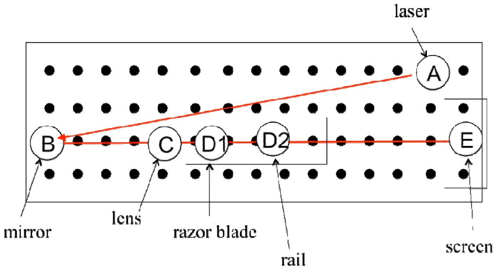
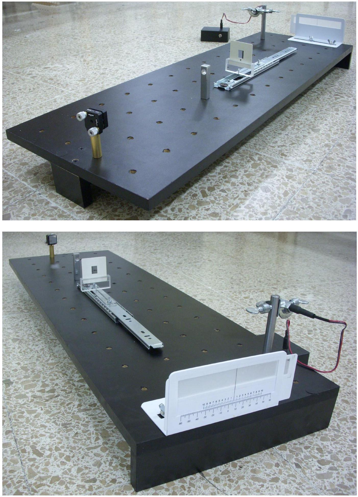
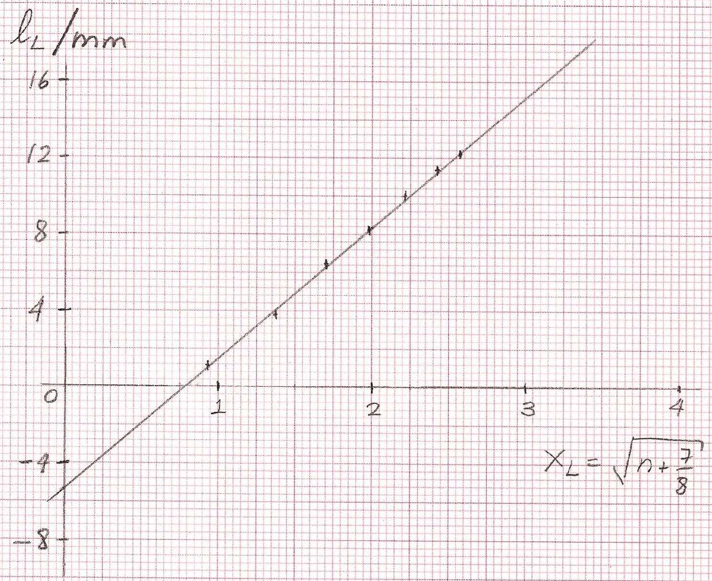

Answer Form
Experimental Problem No. 1
Diode laser wavelength

Task 1.1 Experimental setup.

| 1.1 | Sketch the laser path in drawing of Task 1.1 and Write down the height $h$ of the beam as measured from the table $h \pm \Delta h = ( 5.0 \pm 0.05 ) \times 10 ^ { - 2 } \mathrm {~m} \quad ( 0.25 )$ | 1.0 |
| :--- | :--- | :--- |

Experimental setup for measurement of diode laser wavelength Task 1.2 Expressions for optical path differences.

| 1.2 | The path differences are   Case I: (0.25) $\begin{aligned} \Delta _ { \mathrm { I } } ( n ) & = ( B F + F P ) - B P = \left( L _ { b } - L _ { 0 } \right) + \sqrt { L _ { 0 } ^ { 2 } + L _ { R } ^ { 2 } ( n ) } - \sqrt { L _ { b } ^ { 2 } + L _ { R } ^ { 2 } ( n ) } \\ & = \left( L _ { b } - L _ { 0 } \right) + L _ { 0 } \sqrt { 1 + \frac { L _ { R } ^ { 2 } ( n ) } { L _ { 0 } ^ { 2 } } } - L _ { b } \sqrt { 1 + \frac { L _ { R } ^ { 2 } ( n ) } { L _ { b } ^ { 2 } } } \end{aligned}$   using $\sqrt { 1 + x } \approx 1 + \frac { 1 } { 2 } x$ $\begin{aligned} & \approx \left( L _ { b } - L _ { 0 } \right) + L _ { 0 } \left( 1 + \frac { 1 } { 2 } \frac { L _ { R } ^ { 2 } ( n ) } { L _ { 0 } ^ { 2 } } \right) - L _ { b } \left( 1 + \frac { 1 } { 2 } \frac { L _ { R } ^ { 2 } ( n ) } { L _ { b } ^ { 2 } } \right) \\ & \Delta _ { \mathrm { I } } ( n ) \approx \frac { 1 } { 2 } L _ { R } ^ { 2 } ( n ) \left( \frac { 1 } { L _ { 0 } } - \frac { 1 } { L _ { b } } \right) \end{aligned}$   Case II: (0.25) $\begin{aligned} \Delta _ { \mathrm { II } } ( n ) & = ( F B + B P ) - F P = \left( L _ { 0 } - L _ { a } \right) + \sqrt { L _ { a } ^ { 2 } + L _ { L } ^ { 2 } ( n ) } - \sqrt { L _ { 0 } ^ { 2 } + L _ { L } ^ { 2 } ( n ) } \\ & \approx \left( L _ { 0 } - L _ { a } \right) + L _ { a } \sqrt { 1 + \frac { L _ { L } ^ { 2 } ( n ) } { L _ { a } ^ { 2 } } } - L _ { 0 } \sqrt { 1 + \frac { L _ { L } ^ { 2 } ( n ) } { L _ { 0 } ^ { 2 } } } \end{aligned}$   using $\sqrt { 1 + x } \approx 1 + \frac { 1 } { 2 } x$ $\approx \left( L _ { 0 } - L _ { a } \right) + L _ { a } \left( 1 + \frac { 1 } { 2 } \frac { L _ { L } ^ { 2 } ( n ) } { L _ { a } ^ { 2 } } \right) - L _ { 0 } \left( 1 + \frac { 1 } { 2 } \frac { L _ { L } ^ { 2 } ( n ) } { L _ { 0 } ^ { 2 } } \right)$   $\Rightarrow \quad \Delta _ { \mathrm { II } } ( n ) \approx \frac { 1 } { 2 } L _ { L } ^ { 2 } ( n ) \left( \frac { 1 } { L _ { a } } - \frac { 1 } { L _ { 0 } } \right)$ | 0.5 |
| :--- | :--- | :--- |

Task 1.3 Measuring the dark fringe positions and locations of the blade. Use additional sheets if necessary.

TABLE I
| $n$ | $\left( l _ { \mathrm { R } } ( n ) \pm 0.1 \right) \times 10 ^ { - 3 } \mathrm {~m}$ | $\left( l _ { L } ( n ) \pm 0.1 \right) \times 10 ^ { - 3 } \mathrm {~m}$ | $x _ { R }$ | $x _ { L }$ |
| :--- | :--- | :--- | :--- | :--- |
| 0 | -7.5 | 1.1 | 0.791 | 0.935 |
| 1 | -10.1 | 3.7 | 1.275 | 1.369 |
| 2 | -12.4 | 6.4 | 1.620 | 1.696 |
| 3 | -14.0 | 8.2 | 1.903 | 1.968 |
| 4 | -15.6 | 10.0 | 2.151 | 2.208 |
| 5 | -17.2 | 11.4 | 2.372 | 2.424 |
| 6 | -18.4 | 12.2 | 2.574 | 2.622 |
| 7 | -19.7 |  | 2.761 |  |
| 8 | -20.7 |  | 2.937 |  |
| 9 | -22.0 |  | 3.102 |  |
| 10 | -23.0 |  | 3.260 |  |
| 11 | -24.1 |  | 3.410 |  |
|  |  |  |  |  |
|  |  |  |  |  |
|  |  |  |  |  |

| 1.3 | Report positions of the blade and their difference with higher precision: $\begin{aligned} & L _ { b } \pm \Delta L _ { b } = ( 653 \pm 1 ) \times 10 ^ { - 3 } \mathrm {~m} ( 0.25 ) \text { LABEL (I) (measuring tape) } \\ & L _ { a } \pm \Delta L _ { a } = ( 628 \pm 1 ) \times 10 ^ { - 3 } \mathrm {~m} ( 0.25 ) \text { LABEL (I) (measuring tape) } \\ & d = L _ { b } - L _ { a } = ( 24.6 \pm 0.1 ) \times 10 ^ { - 3 } \mathrm {~m} ( 0.25 ) \mathrm { LABEL } ( \mathrm { H } ) \text { (caliper) } \end{aligned}$ | 3.25 |
| :--- | :--- | :--- |

| Student code | Page No. | Total No. of pages |
| :--- | :--- | :--- |
|  |  |  |
|  |  | $x _ { R } = \sqrt { n + \frac { 3 } { 8 } }$ |
| $\frac { 1 } { 1 }$ | 2 | 3 |
|  |  |  |

$$
\begin{aligned}
& f _ { i } t P _ { R } = m _ { R } x _ { R } + C _ { O R } \\
& m _ { R } = ( - 6.39 \pm 0.07 ) \times 10 ^ { - 3 } m \\
& f _ { O R } = ( - 2.06 \pm 0.17 ) \times 10 ^ { - 3 } m
\end{aligned}
$$

|  | Student code | Page No. | Total No. of pages |
| :--- | :--- | :--- | :--- |
| Student code MIT III - 4 • T   Z |  |  | Page No. Total No. of pages |

$$
\begin{aligned}
& f _ { i } t \quad l _ { L } = m _ { L } x _ { L } + l _ { 0 L } \\
& m _ { L } = ( 6.83 \pm 0.19 ) \times 10 ^ { - 3 } \mathrm {~m} \\
& l _ { 0 L } = ( - 5.33 \pm 0.36 ) \times 10 ^ { - 3 } \mathrm {~m}
\end{aligned}
$$

Task 1.4 Performing a statistical and graphical analysis.

| 1.4 | A procedure:   From the condition of dark fringes and Task 1.2, we have $\frac { 1 } { 2 } L _ { R } ^ { 2 } ( n ) \left( \frac { 1 } { L _ { 0 } } - \frac { 1 } { L _ { b } } \right) = \left( n + \frac { 5 } { 8 } \right) \lambda$   and $\frac { 1 } { 2 } L _ { L } ^ { 2 } ( n ) \left( \frac { 1 } { L _ { a } } - \frac { 1 } { L _ { 0 } } \right) = \left( n + \frac { 7 } { 8 } \right) \lambda$   Using (1.5), $L _ { R } ( n ) = l _ { R } ( n ) - l _ { 0 R }$ and $L _ { L } ( n ) = l _ { L } ( n ) - l _ { 0 L }$ we can rewrite $\begin{aligned} & \frac { 1 } { 2 } \left( l _ { R } ( n ) - l _ { 0 R } \right) ^ { 2 } \left( \frac { 1 } { L _ { 0 } } - \frac { 1 } { L _ { b } } \right) = \left( n + \frac { 5 } { 8 } \right) \lambda \\ & \Rightarrow l _ { R } ( n ) = \sqrt { \frac { 2 L _ { b } L _ { 0 } } { L _ { b } - L _ { 0 } } } \lambda \sqrt { n + \frac { 5 } { 8 } } + l _ { 0 R } \end{aligned}$   and $\begin{aligned} & \frac { 1 } { 2 } \left( l _ { L } ( n ) - l _ { 0 L } \right) ^ { 2 } \left( \frac { 1 } { L _ { a } } - \frac { 1 } { L _ { 0 } } \right) = \left( n + \frac { 7 } { 8 } \right) \lambda \\ & \Rightarrow l _ { L } ( n ) = \sqrt { \frac { 2 L _ { a } L _ { 0 } } { L _ { 0 } - L _ { a } } } \lambda \sqrt { n + \frac { 7 } { 8 } } + l _ { 0 L } \end{aligned}$   These can be cast as equations of a straight line, $y = m x + b$.   Case I: $y _ { R } = l _ { R } \quad x _ { R } = \sqrt { n + \frac { 5 } { 8 } } \quad m _ { R } = \sqrt { \frac { 2 L _ { b } L _ { 0 } } { L _ { b } - L _ { 0 } } \lambda } \quad b _ { R } = l _ { 0 R }$   Case II: $y _ { L } = l _ { L } \quad x _ { L } = \sqrt { n + \frac { 7 } { 8 } } \quad m _ { L } = \sqrt { \frac { 2 L _ { a } L _ { 0 } } { L _ { 0 } - L _ { a } } \lambda } \quad b _ { L } = l _ { 0 L }$   Perform least squares analysis of above equations. In Table I, we write down the values $x _ { R }$ and $x _ { L }$.   One finds: $m _ { R } \pm \Delta m _ { R } = ( - 6.39 \pm 0.07 ) \times 10 ^ { - 3 } \mathrm {~m}$ | 3.25 |
| :--- | :--- | :--- |

|  | $\begin{aligned} & m _ { L } \pm \Delta m _ { L } = ( 6.83 \pm 0.19 ) \times 10 ^ { - 3 } \mathrm {~m} \\ & \text { and (values of } \left. l _ { 0 R } \text { and } l _ { 0 L } \right) \\ & l _ { 0 R } \pm \Delta l _ { 0 R } = b _ { R } \pm \Delta b _ { R } = ( - 2.06 \pm 0.17 ) \times 10 ^ { - 3 } \mathrm {~m} \\ & l _ { 0 L } \pm \Delta l _ { 0 L } = b _ { L } \pm \Delta b _ { L } = ( - 5.33 \pm 0.36 ) \times 10 ^ { - 3 } \mathrm {~m} \end{aligned}$   The equations used in the least squares analysis: $\begin{aligned} & m = \frac { N \sum _ { n = 1 } ^ { N } x _ { n } y _ { n } - \sum _ { n = 1 } ^ { N } x _ { n } \sum _ { n ^ { \prime } = 1 } ^ { N } y _ { n ^ { \prime } } } { \Delta } \\ & b = \frac { \sum _ { n = 1 } ^ { N } x _ { n } ^ { 2 } \sum _ { n ^ { \prime } = 1 } ^ { N } y _ { n ^ { \prime } } - \sum _ { n = 1 } ^ { N } x _ { n } \sum _ { n ^ { \prime } = 1 } ^ { N } x _ { n ^ { \prime } } y _ { n ^ { \prime } } } { \Delta } \end{aligned}$   where $\Delta = N \sum _ { n = 1 } ^ { N } x _ { n } ^ { 2 } - \left( \sum _ { n = 1 } ^ { N } x _ { n } \right) ^ { 2 }$   with $N$ the number of data points.   The uncertainty is calculated as $\begin{aligned} & ( \Delta m ) ^ { 2 } = N \frac { \sigma ^ { 2 } } { \Delta } , \quad ( \Delta b ) ^ { 2 } = \frac { \sigma ^ { 2 } } { \Delta } \sum _ { n = 1 } ^ { N } x _ { n } ^ { 2 } \quad \text { with } , \\ & \sigma ^ { 2 } = \frac { 1 } { N - 2 } \sum _ { n = 1 } ^ { N } \left( y _ { n } - b - m x _ { n } \right) ^ { 2 } \end{aligned}$   REFERENCE: P.R. Bevington, Data Reduction and Error Analysis for the Physical Sciences, McGraw-Hill, 1969. |  |
| :--- | :--- | :--- |

Task 1.5 Calculating $\lambda$.
| 1.5 | From any slope and the value of $L _ { 0 }$ one finds, $\lambda = \frac { L _ { b } - L _ { a } } { 2 L _ { a } L _ { b } } \frac { m _ { R } ^ { 2 } m _ { L } ^ { 2 } } { m _ { R } ^ { 2 } + m _ { L } ^ { 2 } }$   Using the suggestion to replace $d = L _ { b } - L _ { a }$, we can write | 2.0 |
| :--- | :--- | :--- |

|  | $\begin{aligned} & \lambda = \frac { d } { 2 L _ { a } L _ { b } } \frac { m _ { R } ^ { 2 } m _ { L } ^ { 2 } } { m _ { R } ^ { 2 } + m _ { L } ^ { 2 } } \\ & \lambda \pm \Delta \lambda = ( 663 \pm 25 ) \times 10 ^ { - 9 } \mathrm {~m} \end{aligned}$   The uncertainty may range from 15 to 30 nanometers.   A precise measurement of the wavelength is $\lambda \pm \Delta \lambda = ( 655 \pm 1 ) \times 10 ^ { - 9 } \mathrm {~m}$. The formula for the uncertainty, $\Delta \lambda = \sqrt { \left( \frac { \partial \lambda } { \partial d } \right) ^ { 2 } \Delta d ^ { 2 } + \left( \frac { \partial \lambda } { \partial L _ { a } } \right) ^ { 2 } \Delta L _ { a } ^ { 2 } + \left( \frac { \partial \lambda } { \partial L _ { b } } \right) ^ { 2 } \Delta L _ { b } ^ { 2 } + \left( \frac { \partial \lambda } { \partial m _ { R } } \right) ^ { 2 } \Delta m _ { R } ^ { 2 } + \left( \frac { \partial \lambda } { \partial m _ { L } } \right) ^ { 2 } \Delta m _ { L } ^ { 2 } }$   one finds, $\frac { \partial \lambda } { \partial d } = \frac { \lambda } { d } , \frac { \partial \lambda } { \partial L _ { b } } = \frac { \lambda } { L _ { b } } , \frac { \partial \lambda } { \partial L _ { a } } = \frac { \lambda } { L _ { a } } \text { and } \frac { \partial \lambda } { \partial m _ { R } } = \frac { 2 m _ { L } ^ { 2 } } { m _ { R } } \frac { \lambda } { m _ { L } ^ { 2 } + m _ { R } ^ { 2 } }$   and analogously for the other slope.   One can calculate directly these quantities. However, one may note that the errors due to $L _ { a } , L _ { b }$ and $d$ are negligible. Moreover, $m _ { R } ^ { 2 } \approx m _ { L } ^ { 2 }$ and $L _ { a } \approx L _ { b }$. This implies, $\begin{aligned} & \frac { \partial \lambda } { \partial m _ { R } } \approx \frac { \lambda } { m _ { R } } \approx \frac { \partial \lambda } { \partial m _ { L } } . \text { Thus, } \\ & \Delta \lambda \approx \sqrt { 2 } \frac { \lambda } { m _ { L } } \Delta m _ { L } \approx \left( 25 \times 10 ^ { - 9 } \right) \mathrm { m } \end{aligned}$ |  |
| :--- | :--- | :--- |
