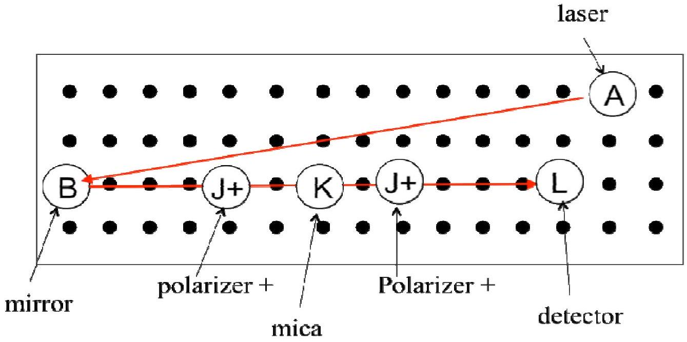
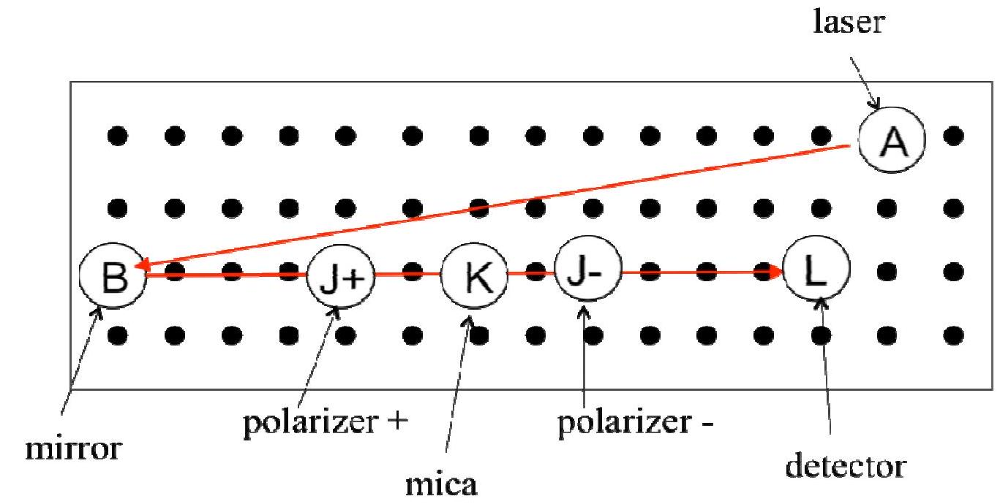
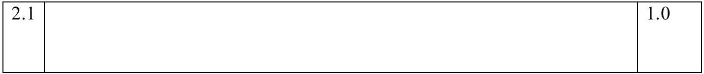
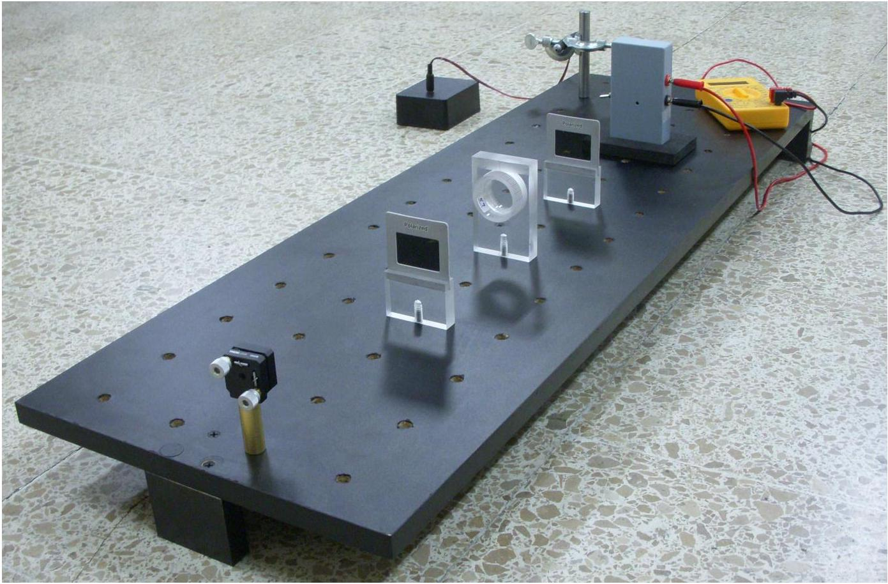
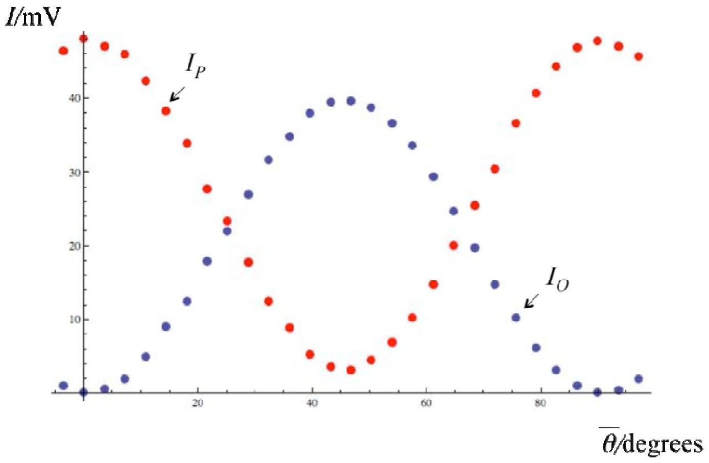
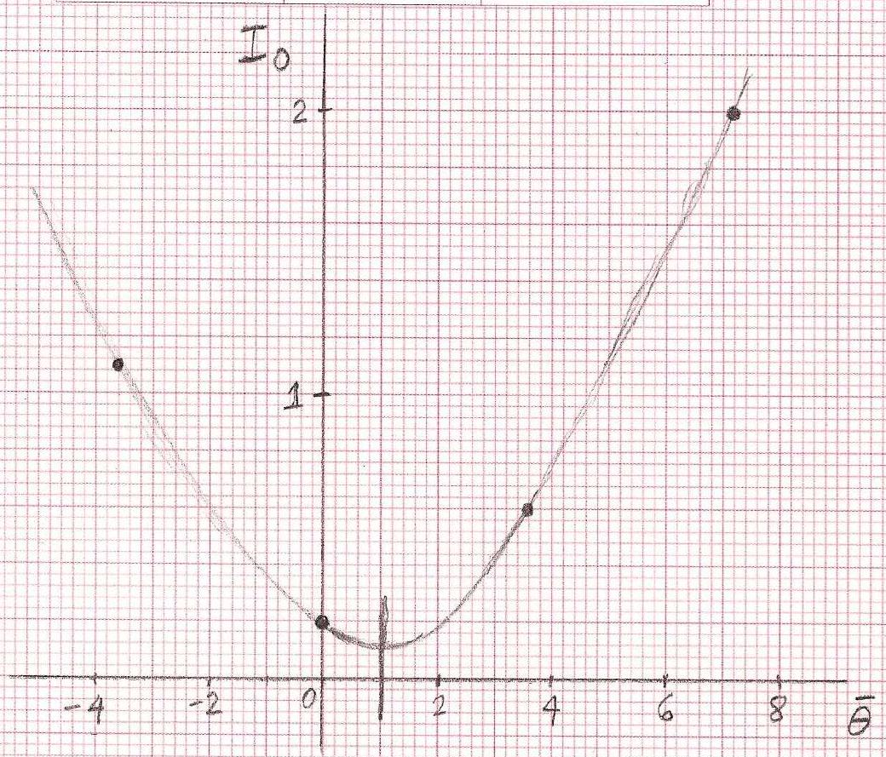
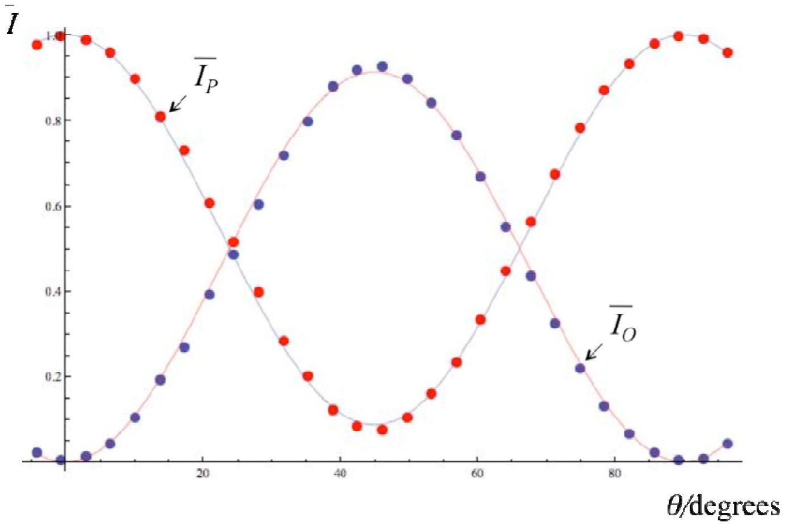

Answer Form
Experimental Problem No. 2
Birefringence of mica

Task 2.1 a) Experimental setup for $I _ { P }$. (0.5 points)

Task 2.1 b) Experimental setup for $I _ { O }$. (0.5 points)

## Experimental setup for measurement of mica birefringence

Task 2.2 The scale for angles.
| 2.2 | The angle between two consecutive black lines is $\theta _ { \text {int } } = 3.6$ degrees because there are 100 lines. | 0.25 |
| :--- | :--- | :--- |

TABLE I (3 points)

Tasks 2.3 Measuring $I _ { P }$ and $I _ { O }$.Use additional sheets if necessary.
| $\bar { \theta }$ (degrees) | $\left( I _ { P } \pm 1 \right) \times 10 ^ { - 3 } \mathrm {~V}$ | $\left( I _ { O } \pm 1 \right) \times 10 ^ { - 3 } \mathrm {~V}$ |
| :--- | :--- | :--- |
| -3.6 | 46.4 | 1.1 |
| 0 | 48.1 | 0.2 |
| 3.6 | 47.0 | 0.6 |
| 7.2 | 46.0 | 2.0 |
| 10.8 | 42.3 | 4.9 |
| 14.4 | 38.2 | 9.0 |
| 18.0 | 33.9 | 12.5 |

| 21.6 | 27.7 | 17.9 |
| :--- | :--- | :--- |
| 25.2 | 23.4 | 22.0 |
| 28.8 | 17.8 | 27.0 |
| 32.4 | 12.5 | 31.7 |
| 36.0 | 8.8 | 34.8 |
| 39.6 | 5.2 | 38.0 |
| 43.2 | 3.6 | 39.4 |
| 46.8 | 3.2 | 39.6 |
| 50.4 | 4.5 | 38.7 |
| 54.0 | 6.9 | 36.6 |
| 57.6 | 10.3 | 33.6 |
| 61.2 | 14.7 | 29.4 |
| 64.8 | 20.1 | 24.7 |
| 68.4 | 25.4 | 19.7 |
| 72.0 | 30.5 | 14.7 |
| 75.6 | 36.6 | 10.2 |
| 79.2 | 40.7 | 6.1 |
| 82.8 | 44.3 | 3.2 |
| 86.4 | 46.9 | 1.0 |
| 90.0 | 47.8 | 0.2 |
| 93.6 | 47.0 | 0.4 |
| 97.2 | 45.7 | 2.0 |

Parallel $I _ { P }$ and perpendicular $I _ { O }$ intensities vs angle $\bar { \theta }$.

## GRAPH NOT REQUIRED!

Task 2.4 Finding an appropriate zero for $\boldsymbol { \theta }$.

| 2.4 | a) Graphical analysis   The value for the shift is $\delta \bar { \theta } = - 1.0$ degrees.   Add the graph paper with the analysis of this Task.   b) Numerical analysis   From Table I choose the first three points of $\bar { \theta }$ and $I _ { o } ( \bar { \theta } )$ : (intensities in millivolts) $\left( x _ { 1 } , y _ { 1 } \right) = ( - 3.6,1.1 ) \quad \left( x _ { 2 } , y _ { 2 } \right) = ( 0,0.2 ) \quad \left( x _ { 3 } , y _ { 3 } \right) = ( 3.6,0.6 )$   We want to fit $y = a x ^ { 2 } + b x + c$. This gives three equations: $\begin{aligned} & 1.1 = a ( 3.6 ) ^ { 2 } - b ( 3.6 ) + c \\ & 0.2 = c \\ & 0.6 = a ( 3.6 ) ^ { 2 } + b ( 3.6 ) + c \end{aligned}$   second in first $\Rightarrow \quad b = \frac { - 0.9 + a ( 3.6 ) ^ { 2 } } { 3.6 }$   in third $\Rightarrow \quad 0.6 = a \left( ( 3.6 ) ^ { 2 } + ( 3.6 ) ^ { 2 } \right) - 0.9 + 0.2$ $\Rightarrow a = 0.050 \quad b = - 0.069$   The minimum of the parabola is at: $\bar { \theta } _ { \min } = - \frac { b } { 2 a } \approx 0.7 \text { degrees }$   Therefore, $\delta \bar { \theta } = - 0.7$ degrees. | 1.0 |
| :--- | :--- | :--- |

|  |  |  |  | Student code | Page No. | Total No. of pages |
| :--- | :--- | :--- | :--- | :--- | :--- | :--- |
| □ |  |  |  |  |  |  |
|  |  |  |  |  |  |  |

$\bar { \theta } _ { \text {min } } \approx 1.0$ degrees
4 points

$$
\begin{array} { c | l }
\bar { \theta } & \left( I _ { 0 } / m v \right) \\
- 3.6 & 1.1 \\
0.0 & 0.2 \\
3.6 & 0.6 \\
7.2 & 2.0
\end{array}
$$

Task 2.5 Choosing the appropriate variables.

| 2.5 | Equation (2.4) for the perpendicular intensity is $\bar { I } _ { O } ( \theta ) = \frac { 1 } { 2 } ( 1 - \cos \Delta \varphi ) \sin ^ { 2 } ( 2 \theta )$   This can be cast as a straight line $y = m x + b$, with $y = \bar { I } _ { o } ( \theta ) \quad , \quad x = \sin ^ { 2 } ( 2 \theta ) \quad$ and $m = \frac { 1 } { 2 } ( 1 - \cos \Delta \varphi )$ from which the phase may be obtained.   NOTE: This is not the only way to obtain the phase difference. One may, for instance, analyze the 4 maxima of either $\bar { I } _ { P } ( \theta )$ or $\bar { I } _ { O } ( \theta )$. | 0.5 |
| :--- | :--- | :--- |

Task 2.6 Statistical analysis and the phase difference.
| 2.6 | To perform the statistical analysis, we shall then use $y = \bar { I } _ { O } ( \theta )$ and $x = \sin ^ { 2 } ( 2 \theta )$. | 1.0 |
| :--- | :--- | :--- |

|  | Since for $\theta : 0 \rightarrow \frac { \pi } { 4 } , \quad x : 0 \rightarrow 1$, we use only 12 pairs of data points to cover this range, as given in Table II.   $x$ may be left without uncertainty since it is a setting. The uncertainty in $y$ may be calculated as $\begin{aligned} & \Delta \bar { I } _ { O } = \sqrt { \left( \frac { \partial \bar { I } _ { O } } { \partial I _ { O } } \right) ^ { 2 } \Delta I _ { O } ^ { 2 } + \left( \frac { \partial \bar { I } _ { P } } { \partial I _ { P } } \right) ^ { 2 } \Delta I _ { P } ^ { 2 } } \text { and one gets } \\ & \Delta \bar { I } _ { O } = \frac { \sqrt { I _ { O } ^ { 2 } + I _ { P } ^ { 2 } } } { \left( I _ { O } + I _ { P } \right) ^ { 2 } } \Delta I _ { O } \approx 0.018 , \text { approximately the same for all values. } \end{aligned}$ |  |
| :--- | :--- | :--- |

TABLE II
| $\bar { \theta }$ (degrees) | $x = \sin ^ { 2 } ( 2 \theta )$ | $y = \bar { I } _ { o } \pm 0.018$ |
| :--- | :--- | :--- |
| 2.9 | 0.010 | 0.013 |
| 6.5 | 0.051 | 0.042 |
| 10.1 | 0.119 | 0.104 |
| 13.7 | 0.212 | 0.191 |
| 17.3 | 0.322 | 0.269 |
| 20.9 | 0.444 | 0.392 |
| 24.5 | 0.569 | 0.484 |
| 28.1 | 0.690 | 0.603 |
| 31.7 | 0.799 | 0.717 |
| 35.3 | 0.890 | 0.798 |
| 38.9 | 0.955 | 0.880 |
| 42.5 | 0.992 | 0.916 |

| 2.6 | We now perform a least square analysis for the variables $y$ vs $x$ in Table II. The slope and $y$-intercept are: $\begin{aligned} & m \pm \Delta m = 0.913 \pm 0.012 \\ & b \pm \Delta b = - 0.010 \pm 0.008 \end{aligned}$   The formulas for this analysis are: | 1.75 |
| :--- | :--- | :--- |

|  | $\begin{aligned} & m = \frac { N \sum _ { n = 1 } ^ { N } x _ { n } y _ { n } - \sum _ { n = 1 } ^ { N } x _ { n } \sum _ { n ^ { \prime } = 1 } ^ { N } y _ { n ^ { \prime } } } { \Delta } \\ & b = \frac { \sum _ { n = 1 } ^ { N } x _ { n } ^ { 2 } \sum _ { n ^ { \prime } = 1 } ^ { N } y _ { n ^ { \prime } } - \sum _ { n = 1 } ^ { N } x _ { n } \sum _ { n ^ { \prime } = 1 } ^ { N } x _ { n ^ { \prime } } y _ { n ^ { \prime } } } { \Delta } \end{aligned}$   where $\Delta = N \sum _ { n = 1 } ^ { N } x _ { n } ^ { 2 } - \left( \sum _ { n = 1 } ^ { N } x _ { n } \right) ^ { 2 }$   with $N$ the number of data points.   The uncertainty is calculated as $\begin{aligned} & ( \Delta m ) ^ { 2 } = N \frac { \sigma ^ { 2 } } { \Delta } , \quad ( \Delta b ) ^ { 2 } = \frac { \sigma ^ { 2 } } { \Delta } \sum _ { n = 1 } ^ { N } x _ { n } ^ { 2 } \quad \text { with } , \\ & \sigma ^ { 2 } = \frac { 1 } { N - 2 } \sum _ { n = 1 } ^ { N } \left( y _ { n } - b - m x _ { n } \right) ^ { 2 } \end{aligned}$   with $N = 12$ in this example.   Include the accompanying plot or plots. |  |
| :--- | :--- | :--- |

|  |  | Student code | Page No. | Total No. of pages |  |
| :--- | :--- | :--- | :--- | :--- | :--- |
|  |  |  |  |  |  |  |
|  | $\text { fit } y = m x + b$ $b = - 0.010 \pm 0.008$ |  |  |  |  |
| 2.6 | Calculate the value of the phase $\Delta \varphi$ in radians in the interval $[ 0 , \pi ]$. From the slope $m = \frac { 1 } { 2 } ( 1 - \cos \Delta \varphi )$, one finds $\Delta \varphi \pm \Delta ( \Delta \varphi ) = 2.54 \pm 0.04$   Write down the formulas for the calculation of the uncertainty.   We see that, |  |  |  | 0.5 |

|  | $\Delta m = \frac { \partial m } { \partial \Delta \varphi } \Delta ( \Delta \varphi ) = \frac { 1 } { 2 } \sin ( \Delta \varphi ) \Delta ( \Delta \varphi )$, therefore, $\Delta ( \Delta \varphi ) = \frac { 2 \Delta m } { \sin ( \Delta \varphi ) }$. |  |
| :--- | :--- | :--- |

Task 2.7 Calculating the birefringence $\left| n _ { 1 } - n _ { 2 } \right|$.
| 2.7 | Write down the width of the slab of mica you used, $L \pm \Delta L = ( 100 \pm 1 ) \times 10 ^ { - 6 } \mathrm {~m}$   Write down the wavelength you use, $\lambda \pm \Delta \lambda = ( 663 \pm 25 ) \times 10 ^ { - 9 } \mathrm {~m} \text { (from Problem 1) }$   Calculate the birefringence $\left\| n _ { 1 } - n _ { 2 } \right\| \pm \Delta \left\| n _ { 1 } - n _ { 2 } \right\| = ( 3.94 \pm 0.16 ) \times 10 ^ { - 3 }$   The birefringence is between 0.003 and 0.005. Nominal value 0.004   Write down the formulas you used for the calculation of the uncertainty of the birefringence.   Since the width $L > 82$ micrometers, we use $2 \pi - \Delta \varphi = \frac { 2 \pi L } { \lambda } \left\| n _ { 1 } - n _ { 2 } \right\|$   The error is $\Delta \left\| n _ { 1 } - n _ { 2 } \right\| = \sqrt { \left( \frac { d n _ { 1 } - n _ { 2 } \mid } { d \lambda } \right) ^ { 2 } \Delta \lambda ^ { 2 } + \left( \frac { d n _ { 1 } - n _ { 2 } \mid } { d L } \right) ^ { 2 } \Delta L ^ { 2 } + \left( \frac { d n _ { 1 } - n _ { 2 } \mid } { d \Delta \varphi } \right) ^ { 2 } \Delta ( \Delta \varphi ) ^ { 2 } }$ $\Delta \left\| n _ { 1 } - n _ { 2 } \right\| = \sqrt { \left( \frac { \left\| n _ { 1 } - n _ { 2 } \right\| } { \lambda } \right) ^ { 2 } \Delta \lambda ^ { 2 } + \left( \frac { \left\| n _ { 1 } - n _ { 2 } \right\| } { L } \right) ^ { 2 } \Delta L ^ { 2 } + \left( \frac { \lambda } { 2 \pi L } \right) ^ { 2 } \Delta ( \Delta \varphi ) ^ { 2 } }$ | 1.0 |
| :--- | :--- | :--- |

|  | Since the data may appear somewhat disperse and/or the errors in the intensities may be large, a graphical analysis may be performed.   In the accompanying plot, it is exemplified a simple graphical analysis: first the main slope is found, then, using the largest deviations one can find two extreme slopes.   The final result is, $m = 0.91 \pm 0.08 \quad \text { and } \quad b = - 0.01 \pm 0.04$   The calculation of the birefringence and its uncertainty follows as before. One now finds, $\left\| n _ { 1 } - n _ { 2 } \right\| \pm \Delta \left\| n _ { 1 } - n _ { 2 } \right\| = ( 3.94 \pm 0.45 ) \times 10 ^ { - 3 } .$   A larger (more realistic) error. |  |
| :--- | :--- | :--- |

|  | student code Page No. | Page No. | Total No. of pages |  |
| :--- | :--- | :--- | :--- | :--- |
| $\bar { I } _ { 0 }$ |  |  |  |  |
|  |  |  |  |  |

Comparison of experimental data (normalized intensities $\bar { I } _ { P }$ and $\bar { I } _ { O }$ ) with fitting (equations (2.3) and (2.4)) using the calculated value of the phase difference $\Delta \psi$.

## GRAPH NOT REQUIRED!
