## Solution - Exp. Problem 2

| Task 1 |  | Points |
| :--- | :--- | :--- |
|  | 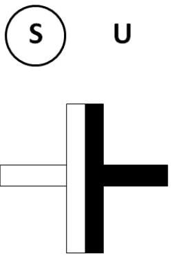 | 0.25 |
|  | 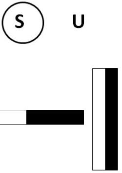 | 0.45 |
|  | 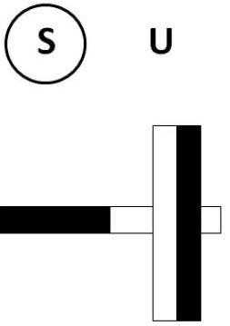 | 0.45 |
|  | 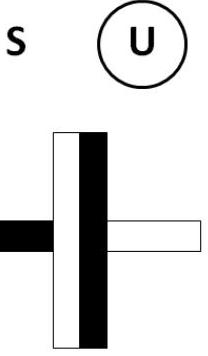 | 0.45 |

|  | 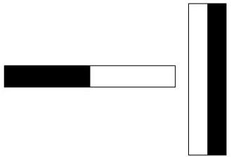 | 0.45 |
| :--- | :--- | :--- |
|  | 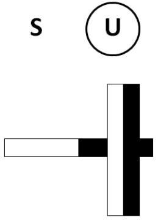 | 0.45 |
| Task 2   Points |  |  |
| Symmetries that should be utilized in the measurements: $\begin{array} { \| l \| }  \hline F _ { \uparrow \downarrow } ( z ) = - F _ { \uparrow \downarrow } ( - z ) \\ F _ { \uparrow \downarrow } ( z ) = - F _ { \uparrow \uparrow } ( z ) \\ \hline \text { From the two above one gets also } F _ { \uparrow \uparrow } ( z ) = - F _ { \uparrow \uparrow } ( - z ) \\ \hline \end{array}$   By using the setup as it is, the whole curve can be measured by starting the measurements from three stable equilibrium points; the equilibrium point (z0) can be measured also by using the setup.   Configuration: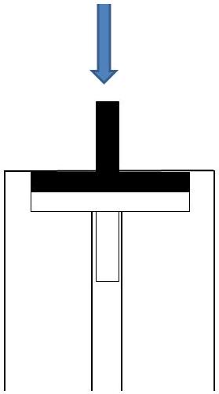   Measurements:$\mathrm { z } 0 = 0 \mathrm {~mm}$ m [g] $\Delta \mathrm { z } [ \mathrm { mm } ]$    0 0    31 1    55 2    75 3    97 4 |  | 0,6 |
|  |  | 0,8 |

|  | 119 5   140 6   158 7   171 8   170 9   118 10   85 10,25   50 10,5   10 10,75 |  |
| :--- | :--- | :--- |
|  | Configuration:   0,8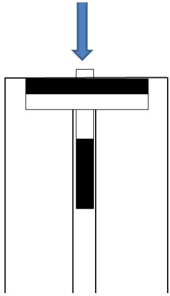   Measurements:$\mathrm { z } 0 = 10.8 \mathrm {~mm}$ m [g] $\Delta \mathrm { z } [ \mathrm { mm } ]$    0 0    233 1    538 2    927 3    996 3,5    1124 4    1154 4,5    1213 5    1212 5,5    1120 6    873 6,5    284 7    36 7,5 |  |

|  | Configuration: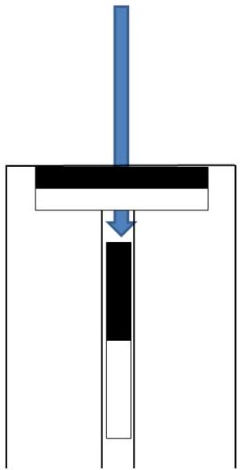   Measurements:$\mathrm { zO } = 18.6 \mathrm {~mm}$ m [g] $\Delta \mathrm { z } [ \mathrm { mm } ]$     0  0    116  1    170  2    186  3    184  4    169  5    150  6    116  8    89  10    67  12    53  14    36  16    27  18    23  20    14  22    9  24    5  26    3  28 | 0,8 |
| :--- | :--- | :--- |
| Task 3 |  | Points |
|  | Due to symmetry, it is sufficient to plot e.g., the following graph in detail: | 2 |

|  | $z [ \mathrm {~mm} ]$ |  |
| :--- | :--- | :--- |
|  | 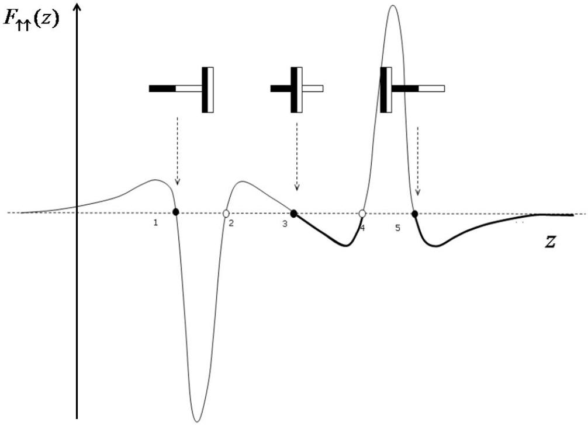 | 1 |
|  | 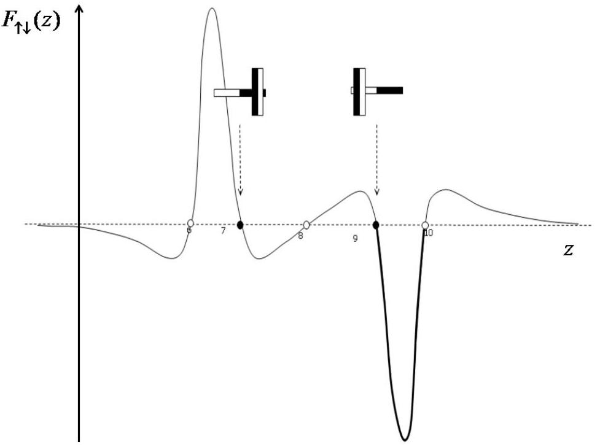 | 1 |
| Task 4 |  | Points |

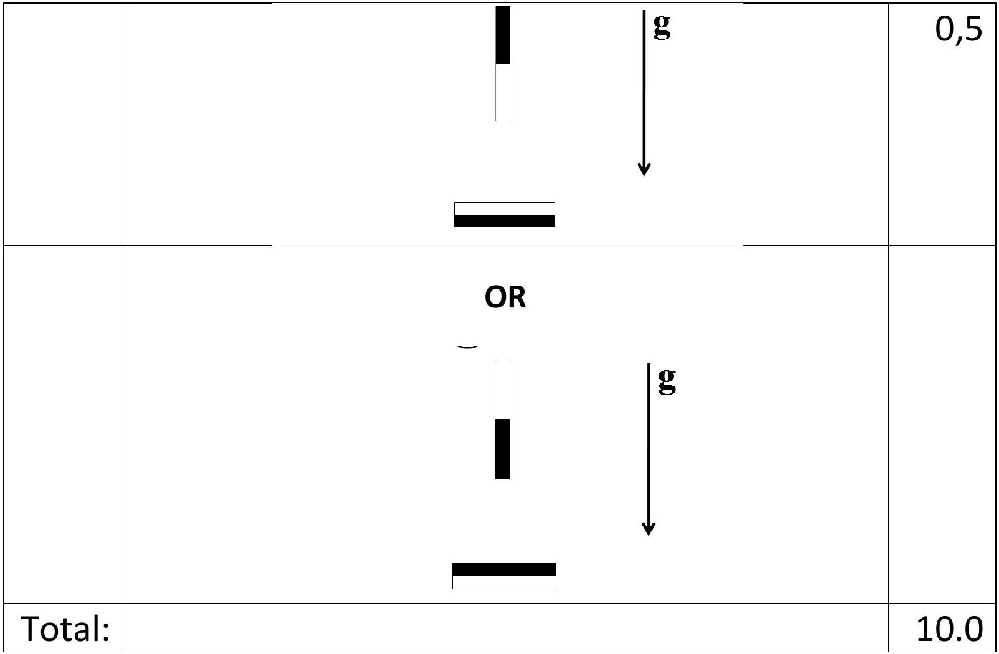
