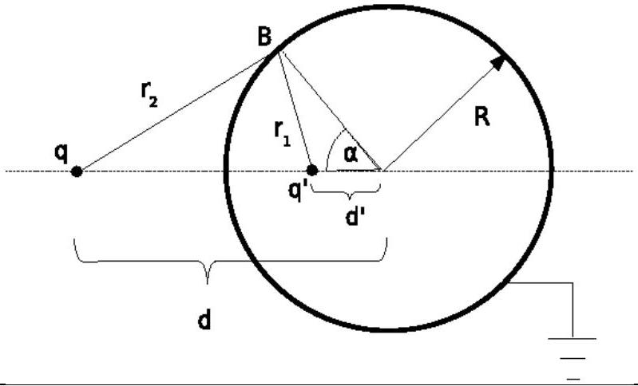
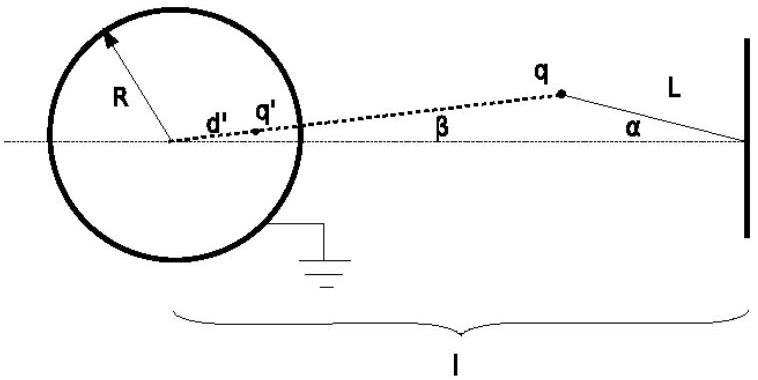
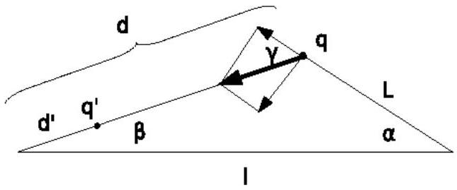

## Solution - Image of a charge

Solution of Task 1
Task 1a)
As the metallic sphere is grounded, its potential vanishes, $\mathrm { V } = 0$.
Task1b)
Let us consider an arbitrary point B on the surface of the sphere as depicted in Fig. 1.

Fig 1. The potential at point $B$ is zero.

The distance of point $B$ from the charge q' is

$$
\begin{equation*}
r _ { 1 } = \sqrt { R ^ { 2 } + d ^ { \prime 2 } - 2 R d ^ { \prime } \cos \alpha } \tag{1}
\end{equation*}
$$

whereas the distance of the point B from the charge q is given with the expression

$$
\begin{equation*}
r _ { 2 } = \sqrt { R ^ { 2 } + d ^ { 2 } - 2 R d \cos \alpha } \tag{2}
\end{equation*}
$$

The electric potential at the point B is

$$
\begin{equation*}
V = \frac { 1 } { 4 \pi \varepsilon _ { 0 } } \left( \frac { q } { r _ { 2 } } + \frac { q ^ { \prime } } { r _ { 1 } } \right) \tag{3}
\end{equation*}
$$

This potential must vanish,

$$
\begin{equation*}
\frac { q } { r _ { 2 } } + \frac { q ^ { \prime } } { r _ { 1 } } = 0 \tag{4}
\end{equation*}
$$

i.e. its numerical value is 0 V.

Combining (1), (2) and (3) we obtain

$$
\begin{equation*}
R ^ { 2 } + d ^ { 2 } - 2 R d \cos \alpha = \left( \frac { q } { q ^ { \prime } } \right) ^ { 2 } \left( R ^ { 2 } + d ^ { \prime 2 } - 2 R d ^ { \prime } \cos \alpha \right) \tag{5}
\end{equation*}
$$

As the surface of the sphere must be equipotential, the condition (5) must be satisfied for every angle $\alpha$ what leads to the following results

$$
\begin{equation*}
d ^ { 2 } + R ^ { 2 } = \left( \frac { q } { q ^ { \prime } } \right) ^ { 2 } \left( R ^ { 2 } + d ^ { \prime 2 } \right) \tag{6}
\end{equation*}
$$

and

$$
\begin{equation*}
d R = \left( \frac { q } { q ^ { \prime } } \right) ^ { 2 } \left( d ^ { \prime } R \right) \tag{7}
\end{equation*}
$$

By solving of (6) and (7) we obtain the expression for the distance d' of the charge q' from the center of the sphere

$$
\begin{equation*}
d ^ { \prime } = \frac { R ^ { 2 } } { d } \tag{8}
\end{equation*}
$$

and the size of the charge q'

$$
\begin{equation*}
q ^ { \prime } = - q \frac { R } { d } \tag{9}
\end{equation*}
$$

Task 1c)
Finally, the magnitude of force acting on the charge q is

| $F = \frac { 1 } { 4 \pi \varepsilon _ { 0 } } \frac { q ^ { 2 } R d } { \left( d ^ { 2 } - R ^ { 2 } \right) ^ { 2 } }$ |
| :--- |

The force is apparently attractive.
Solution of Task 2
Task 2a)
The electric field at the point A amounts to

$$
\begin{equation*}
\vec { E } _ { A } = \left( \frac { 1 } { 4 \pi \varepsilon _ { 0 } } \frac { q } { r ^ { 2 } } - \frac { 1 } { 4 \pi \varepsilon _ { 0 } } \frac { q \frac { R } { d } } { \left( r - d + \frac { R ^ { 2 } } { d } \right) ^ { 2 } } \right) \hat { r } \tag{11}
\end{equation*}
$$

Task 2b)
For very large distances r we can apply approximate formula $( 1 + \mathrm { a } ) ^ { - 2 } \approx 1 - 2 \mathrm { a }$ to the expression (11) what leads us to

$$
\begin{equation*}
\vec { E } _ { A } = \frac { 1 } { 4 \pi \varepsilon _ { 0 } } \frac { \left( 1 - \frac { R } { d } \right) q } { r ^ { 2 } } \hat { r } - \frac { 1 } { 4 \pi \varepsilon _ { 0 } } \frac { 2 q \frac { R } { d } \left( d - \frac { R ^ { 2 } } { d } \right) } { r ^ { 3 } } \hat { r } \tag{12}
\end{equation*}
$$

In general a grounded metallic sphere cannot completely screen a point charge $q$ at a distance $d$ (even in the sense that its electric field would decrease with distance faster than $1 / r ^ { 2 }$ ) and the dominant dependence of the electric field on the distance $r$ is as in standard Coulomb law.

Task 2c)
In the limit $d \rightarrow R$ the electric field at the point $A$ vanishes and the grounded metallic sphere screens the point charge completely.

Solution of Task 3

Task 3a)
Let us consider a configuration as in Fig. 2.

Fig 2. The pendulum formed by a charge near a grounded metallic sphere.

The distance of the charge q from the center of the sphere is

| $d = \sqrt { l ^ { 2 } + L ^ { 2 } - 2 l L \cos \alpha }$ | (13) |
| :--- | :--- |

The magnitude of the electric force acting on the charge q is

$$
\begin{equation*}
F = \frac { 1 } { 4 \pi \varepsilon _ { 0 } } \frac { q q ^ { \prime } } { \left( d - d ^ { \prime } \right) ^ { 2 } } = \frac { 1 } { 4 \pi \varepsilon _ { 0 } } \frac { q ^ { 2 } R d } { \left( d ^ { 2 } - R ^ { 2 } \right) ^ { 2 } } \tag{14}
\end{equation*}
$$

From which we have

| $F = \frac { 1 } { 4 \pi \varepsilon _ { 0 } } \frac { q ^ { 2 } R \sqrt { l ^ { 2 } + L ^ { 2 } - 2 l L \cos \alpha } } { \left( l ^ { 2 } + L ^ { 2 } - 2 l L \cos \alpha - R ^ { 2 } \right) ^ { 2 } }$ | (15) |
| :--- | :--- |

Task 3b)
The direction of the vector of the electric force (17) is described in Fig. 3.

Fig 3. The direction of the force $F$.

The angles $\alpha$ and $\beta$ are related as

| $L \sin \alpha = d \sin \beta$ | (16) |
| :--- | :--- |

whereas for the angle $\gamma$ the relation $\gamma = \alpha + \beta$ is valid. The component of the force perpendicular to the thread is F sin $\gamma$, that is ,

| $F _ { \perp } = \frac { 1 } { 4 \pi \varepsilon _ { 0 } } \frac { q ^ { 2 } R \sqrt { l ^ { 2 } + L ^ { 2 } - 2 l L \cos \alpha } } { \left( l ^ { 2 } + L ^ { 2 } - 2 l L \cos \alpha - R ^ { 2 } \right) ^ { 2 } } \sin ( \alpha + \beta )$   where $\beta = \arcsin \left( \frac { L } { \sqrt { L ^ { 2 } + l ^ { 2 } - 2 L l \cos \alpha } } \sin \alpha \right)$ | (17) |
| :--- | :--- |

Task 3c)
The equation of motion of the mathematical pendulum is

$$
\begin{equation*}
m L \ddot { \alpha } = - F _ { \perp } \tag{18}
\end{equation*}
$$

As we are interested in small oscillations, the angle $\alpha$ is small, i.e. for its value in radians we have $\alpha$ much smaller than 1. For a small value of argument of trigonometric functions we have approximate relations $\sin \mathrm { x } \approx \mathrm { x }$ and $\cos \mathrm { x } \approx 1 - \mathrm { x } ^ { 2 } / 2$. So for small oscillations of the pendulum we have $\beta \approx \alpha L / ( l - L )$ and $\gamma \approx l \alpha / ( l - L )$.

Combining these relations with (13) we obtain

$$
\begin{equation*}
m L \frac { d ^ { 2 } \alpha } { d t ^ { 2 } } + \frac { 1 } { 4 \pi \varepsilon _ { 0 } } \frac { q ^ { 2 } R d } { \left( d ^ { 2 } - R ^ { 2 } \right) ^ { 2 } } \left( 1 + \frac { L } { d } \right) \alpha = 0 \tag{19}
\end{equation*}
$$

Where $d = l - L$ what leads to

$$
\begin{align*}
& \omega = \frac { q } { d ^ { 2 } - R ^ { 2 } } \sqrt { \frac { R d } { 4 \pi \varepsilon _ { 0 } } \frac { 1 } { m L } \left( 1 + \frac { L } { d } \right) } =  \tag{20}\\
& = \frac { q } { ( l - L ) ^ { 2 } - R ^ { 2 } } \sqrt { \frac { R l } { 4 \pi \varepsilon _ { 0 } } \frac { 1 } { m L } }
\end{align*}
$$

Solution of Task 4
First we present a solution based on the definition of the electrostatic energy of a collection of charges.

Task 4a)
The total energy of the system can be separated into the electrostatic energy of interaction of the external charge with the induced charges on the sphere, $\mathrm { E } _ { \mathrm { el } , 1 }$, and the electrostatic energy of mutual interaction of charges on the sphere, $\mathrm { E } _ { \mathrm { el } , 2 }$, i.e.

$$
\begin{equation*}
E _ { e l } = E _ { e l , 1 } + E _ { e l , 2 } \tag{21}
\end{equation*}
$$

Let there be $N$ charges induced on the sphere. These charges $q _ { j }$ are located at points $\vec { r } _ { j } , j = 1 , \ldots , N$ on the sphere. We use the definition of the image charge, i.e., the potential on the surface of the sphere from the image charge is identical to the potential arising from the induced charges:

$$
\begin{equation*}
\frac { q ^ { \prime } } { \left| \vec { r } - \vec { d } ^ { \prime } \right| } = \sum _ { j = 1 } ^ { N } \frac { q _ { j } } { \left| \vec { r } _ { j } - \vec { r } \right| } , \tag{22}
\end{equation*}
$$

where $\vec { r }$ is a vector on the sphere and $\vec { d } ^ { \prime }$ denotes the vector position of the image charge. When $\vec { r }$ coincides with some $\vec { r } _ { i }$, then we just have

$$
\begin{equation*}
\frac { q ^ { \prime } } { \left| \vec { r } _ { i } - \vec { d } ^ { \prime } \right| } = \sum _ { \substack { j = 1 \\ j \neq i } } ^ { N } \frac { q _ { j } } { \left| \vec { r } _ { j } - \vec { r } _ { i } \right| } . \tag{23}
\end{equation*}
$$

From the requirement that the potential on the surface of the sphere vanishes we have

$$
\begin{equation*}
\frac { q ^ { \prime } } { \left| \vec { r } - \vec { d } ^ { \prime } \right| } + \frac { q } { | \vec { r } - \vec { d } | } = 0 , \tag{24}
\end{equation*}
$$

where $\vec { d }$ denotes the vector position of the charge $\vec { q }$ ( $\vec { r }$ is on the sphere).

For the interaction of the external charge with the induced charges on the sphere we have

$$
\begin{equation*}
E _ { e l , 1 } = \frac { q } { 4 \pi \varepsilon _ { 0 } } \sum _ { i = 1 } ^ { N } \frac { q _ { i } } { \left| \vec { r } _ { i } - \vec { d } \right| } = \frac { 1 } { 4 \pi \varepsilon _ { 0 } } \frac { q q ^ { \prime } } { \left| \vec { d } ^ { \prime } - \vec { d } \right| } = \frac { 1 } { 4 \pi \varepsilon _ { 0 } } \frac { q q ^ { \prime } } { d - d ^ { \prime } } = - \frac { 1 } { 4 \pi \varepsilon _ { 0 } } \frac { q ^ { 2 } R } { d ^ { 2 } - R ^ { 2 } } \tag{25}
\end{equation*}
$$

Here the first equality is the definition of this energy as the sum of interactions of the charge $q$ with each of the induced charges on the surface of the sphere. The second equality follows from (21).

In fact, the interaction energy $E _ { e l , 1 }$ follows directly from the definition of an image charge.

Task 4b)
The energy of mutual interactions of induced charges on the surface of the sphere is given with

$$
\begin{align*}
& E _ { e l , 2 } = \frac { 1 } { 2 } \frac { 1 } { 4 \pi \varepsilon _ { 0 } } \sum _ { i = 1 } ^ { N } \sum _ { \substack { j = 1 \\
j \neq i } } ^ { N } \frac { q _ { i } q _ { j } } { \left| \vec { r } _ { i } - \vec { r } _ { j } \right| } \\
& = \frac { 1 } { 2 } \frac { 1 } { 4 \pi \varepsilon _ { 0 } } \sum _ { i = 1 } ^ { N } q _ { i } \frac { q ^ { \prime } } { \left| \vec { r } _ { i } - \vec { d } ^ { \prime } \right| } =  \tag{26}\\
& = - \frac { 1 } { 2 } \frac { 1 } { 4 \pi \varepsilon _ { 0 } } \sum _ { i = 1 } ^ { N } q _ { i } \frac { q } { \left| \vec { r } _ { i } - \vec { d } \right| } = \\
& = - \frac { 1 } { 2 } \frac { 1 } { 4 \pi \varepsilon _ { 0 } } \frac { q q ^ { \prime } } { \left| \vec { d } ^ { \prime } - \vec { d } \right| } = - \frac { 1 } { 2 } \frac { 1 } { 4 \pi \varepsilon _ { 0 } } \frac { q q ^ { \prime } } { d - d ^ { \prime } } = \frac { 1 } { 2 } \frac { 1 } { 4 \pi \varepsilon _ { 0 } } \frac { q ^ { 2 } R } { d ^ { 2 } - R ^ { 2 } }
\end{align*}
$$

Here the second line is obtained using (22). From the second line we obtain the third line applying (23), whereas from the third line we obtain the fourth using (22) again.

Task 4c)
Combining expressions (19) and (20) with the quantitative results for the image charge we finally obtain the total energy of electrostatic interaction

$$
\begin{equation*}
E _ { e l } ( d ) = - \frac { 1 } { 2 } \frac { 1 } { 4 \pi \varepsilon _ { 0 } } \frac { q ^ { 2 } R } { d ^ { 2 } - R ^ { 2 } } \tag{27}
\end{equation*}
$$

An alternative solution follows from the definition of work. By knowing the integral

$$
\begin{equation*}
\int _ { d } ^ { \infty } \frac { x d x } { \left( x ^ { 2 } - R ^ { 2 } \right) ^ { 2 } } = \frac { 1 } { 2 } \frac { 1 } { d ^ { 2 } - R ^ { 2 } } \tag{28}
\end{equation*}
$$

We can obtain the total energy in the system by calculating the work needed to bring the charge $q$ from infinity to the distance $d$ from the center of the sphere:

$$
\begin{align*}
& E _ { e l } ( d ) = - \int _ { \infty } ^ { d } F ( \vec { x } ) d \vec { x } = \int _ { d } ^ { \infty } F ( \vec { x } ) d \vec { x } =  \tag{29}\\
& = \int _ { d } ^ { \infty } ( - ) \frac { 1 } { 4 \pi \varepsilon _ { 0 } } \frac { q ^ { 2 } R x } { \left( x ^ { 2 } - R ^ { 2 } \right) ^ { 2 } } d x = \\
& = - \frac { 1 } { 2 } \frac { 1 } { 4 \pi \varepsilon _ { 0 } } \frac { q ^ { 2 } R } { d ^ { 2 } - R ^ { 2 } }
\end{align*}
$$

This solves Task 4c).
The electrostatic energy between the charge $q$ and the sphere must be equal to the energy between the charges $q$ and $q ^ { \prime }$ according to the definition of the image charge:

$$
\begin{equation*}
E _ { e l , 1 } = \frac { 1 } { 4 \pi \varepsilon _ { 0 } } \frac { q q ^ { \prime } } { \left( d - d ^ { \prime } \right) } = - \frac { 1 } { 4 \pi \varepsilon _ { 0 } } \frac { q ^ { 2 } R } { d ^ { 2 } - R ^ { 2 } } \tag{30}
\end{equation*}
$$

This solves Task 4a).
From this we immediately have that the electrostatic energy among the charges on the sphere is:

$$
\begin{equation*}
E _ { e l , 2 } = \frac { 1 } { 2 } \frac { 1 } { 4 \pi \varepsilon _ { 0 } } \frac { q ^ { 2 } R } { d ^ { 2 } - R ^ { 2 } } . \tag{31}
\end{equation*}
$$

This solves Task 4b).
