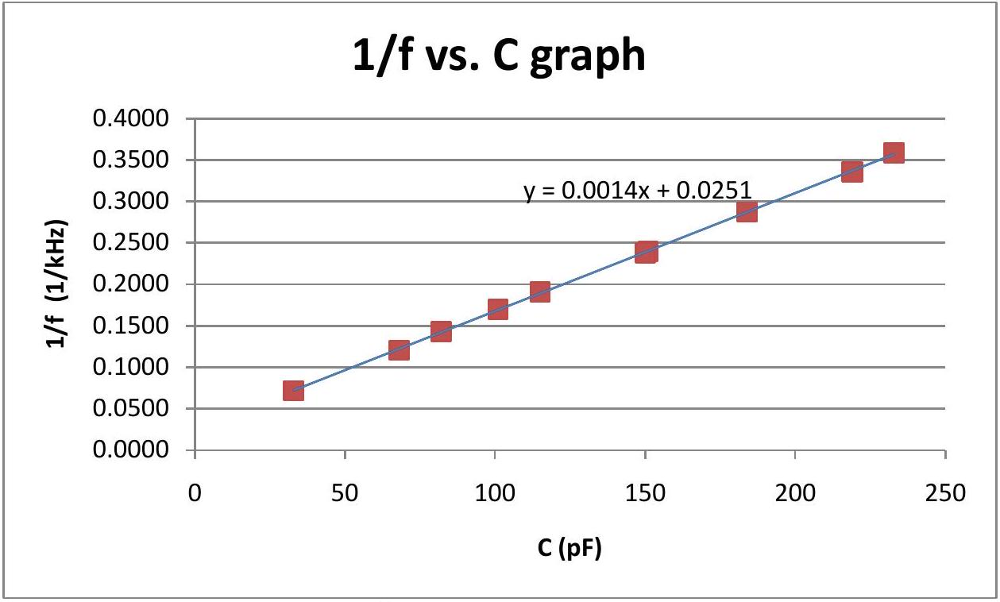
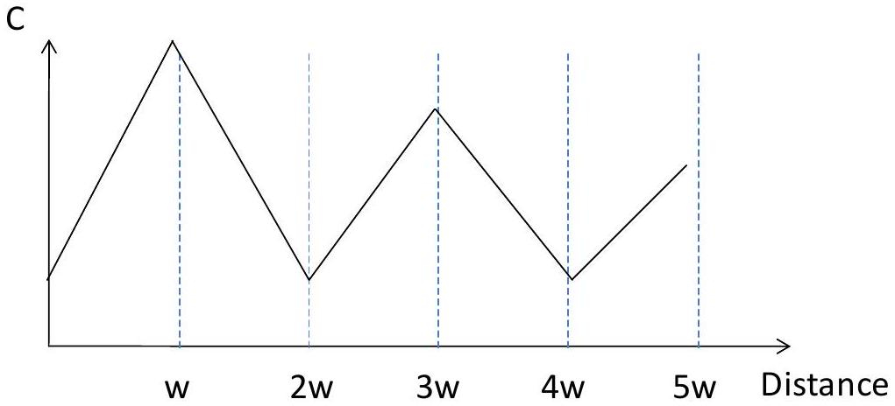
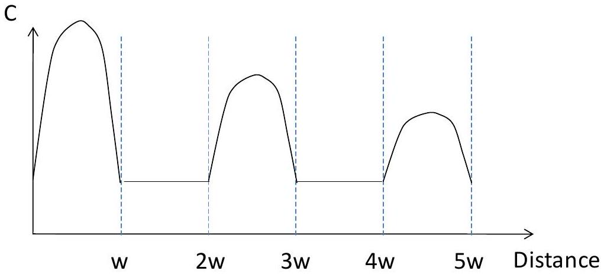
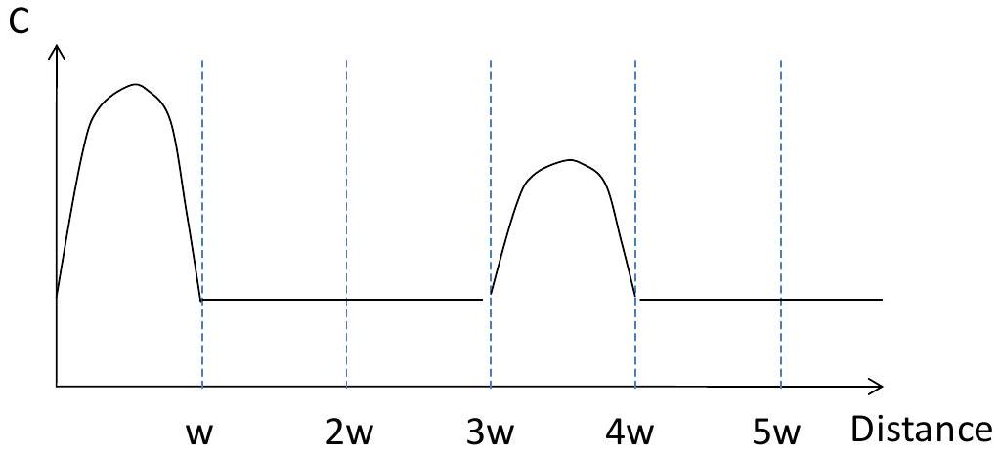
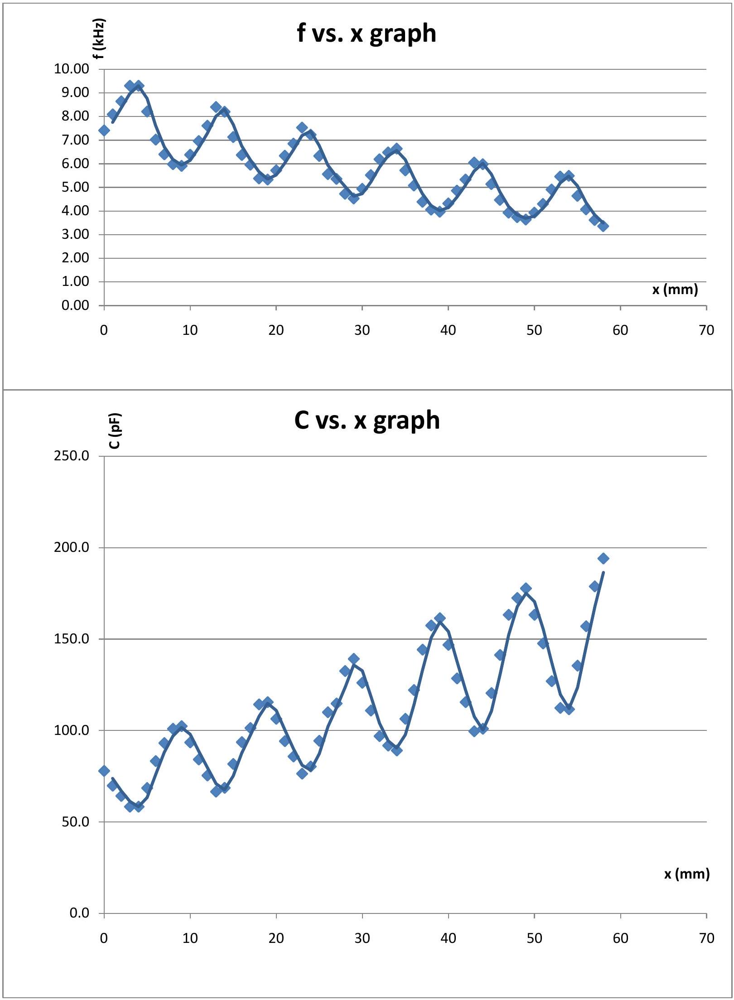
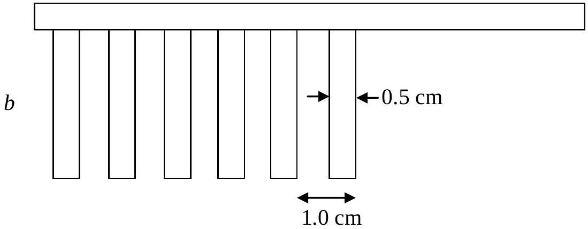
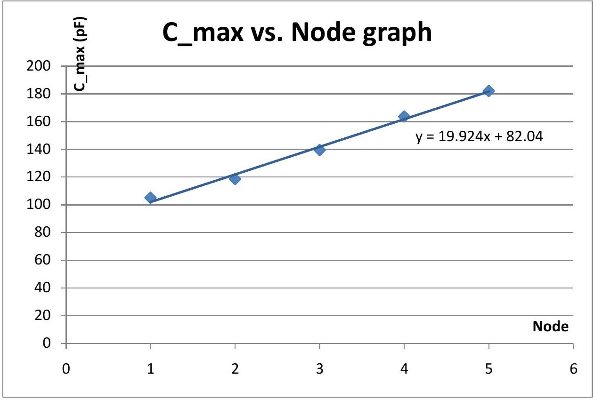
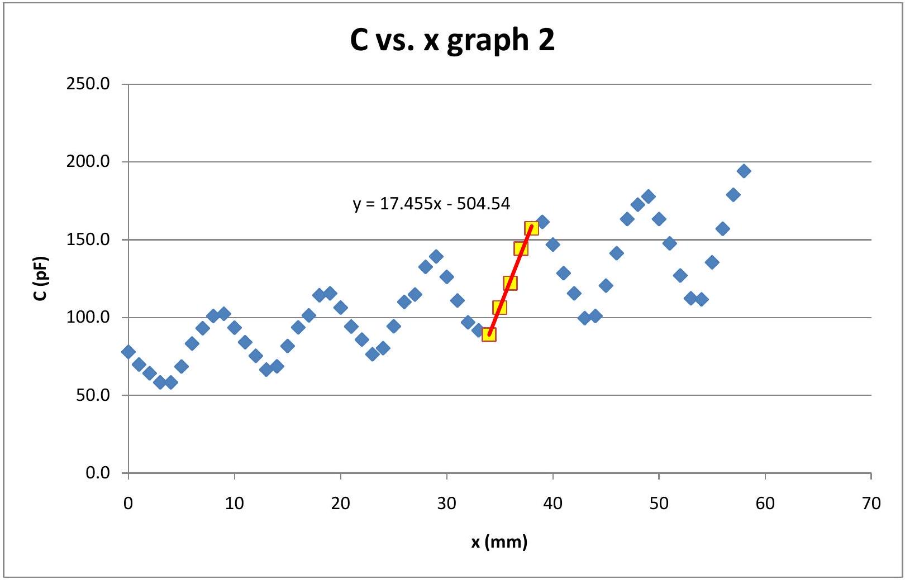

Part 1. Calibration
From the relationship between $f$ and $C$ given,

$$
f = \frac { \alpha } { C + C _ { S } } \quad \Leftrightarrow \quad \frac { 1 } { f } = \frac { 1 } { \alpha } C + \frac { C _ { S } } { \alpha }
$$

That is, theoretically, the graph of $\frac { 1 } { f }$ on the Y-axis versus C on the X-axis should be linear of which the slope and the Y-intercept is $\frac { 1 } { \alpha }$ and $\frac { C _ { S } } { \alpha }$ respectively.
The table below shows the measured values of $C$ (plotted on the X-axis,) $f$ and, additionally, $\frac { 1 } { f }$, which is plotted on the Y-axis.

| C (pF) | f (kHz) | 1/f (ms) |
| :--- | :--- | :--- |
| 33 | 13.94 | 0.0717 |
| 68 | 8.30 | 0.1205 |
| 82 | 6.99 | 0.1431 |
| 151 | 4.17 | 0.2398 |
| 233 | 2.79 | 0.3584 |
| 219 | 2.98 | 0.3356 |
| 184 | 3.48 | 0.2874 |
| 150 | 4.20 | 0.2381 |
| 115 | 5.24 | 0.1908 |
| 101 | 5.89 | 0.1698 |

From this graph, the slope ( $\frac { 1 } { \alpha }$ ) and the Y-intercept ( $\frac { C _ { S } } { \alpha }$ ) is equal to 0.0014 s/nF and 0.0251 ms respectively.

Hence,

$$
\alpha = \frac { 1 } { \text { slope } } = \frac { 1 } { 0.0014 \mathrm {~s} / \mathrm { nF } } = 714 \mathrm { nF } / \mathrm { s }
$$

and

$$
C _ { S } = \frac { \mathrm { Y } - \text { intercept } } { \text { slope } } = \frac { 0.0251 \mathrm {~ms} } { 0.0014 \mathrm {~s} / \mathrm { nF } } = 17.9 \mathrm { pF } \quad \text { as required. }
$$

## Part II. Determination of geometrical shape of parallel-plates capacitor

PATTERN I: The expected graph of $C$ versus the position

PATTERN II: The expected graph of $C$ versus the position

PATTERN III: The expected graph of $C$ versus the position

By measuring $f$ and $C$ versus $x$ (the distance moved between the two plates,) the data and the graphs are shown below.

| x (mm) | f (kHz) | C (pF) | x (mm) | f (kHz) | C (pF) |
| :--- | :--- | :--- | :--- | :--- | :--- |
| 0 | 7.41 | 77.9 | 30 | 4.94 | 126.1 |
| 1 | 8.09 | 69.8 | 31 | 5.52 | 110.9 |
| 2 | 8.64 | 64.2 | 32 | 6.19 | 96.9 |
| 3 | 9.30 | 58.3 | 33 | 6.48 | 91.7 |
| 4 | 9.30 | 58.3 | 34 | 6.64 | 89.1 |
| 5 | 8.21 | 68.5 | 35 | 5.72 | 106.4 |
| 6 | 7.02 | 83.3 | 36 | 5.08 | 122.1 |
| 7 | 6.40 | 93.1 | 37 | 4.39 | 144.2 |
| 8 | 5.98 | 100.9 | 38 | 4.06 | 157.4 |
| 9 | 5.91 | 102.4 | 39 | 3.97 | 161.4 |
| 10 | 6.38 | 93.5 | 40 | 4.32 | 146.8 |
| 11 | 6.96 | 84.1 | 41 | 4.86 | 128.5 |
| 12 | 7.61 | 75.4 | 42 | 5.33 | 115.5 |
| 13 | 8.40 | 66.5 | 43 | 6.05 | 99.6 |
| 14 | 8.20 | 68.6 | 44 | 5.98 | 100.9 |
| 15 | 7.13 | 81.7 | 45 | 5.14 | 120.5 |
| 16 | 6.37 | 93.6 | 46 | 4.47 | 141.3 |
| 17 | 5.96 | 101.3 | 47 | 3.93 | 163.3 |
| 18 | 5.38 | 114.3 | 48 | 3.74 | 172.5 |
| 19 | 5.33 | 115.5 | 49 | 3.64 | 177.7 |
| 20 | 5.72 | 106.4 | 50 | 3.93 | 163.3 |
| 21 | 6.34 | 94.2 | 51 | 4.30 | 147.6 |
| 22 | 6.85 | 85.8 | 52 | 4.91 | 127.0 |
| 23 | 7.53 | 76.4 | 53 | 5.46 | 112.3 |
| 24 | 7.23 | 80.3 | 54 | 5.49 | 111.6 |
| 25 | 6.33 | 94.3 | 55 | 4.64 | 135.4 |
| 26 | 5.56 | 110.0 | 56 | 4.07 | 157.0 |
| 27 | 5.36 | 114.8 | 57 | 3.62 | 178.8 |
| 28 | 4.73 | 132.5 | 58 | 3.36 | 194.1 |
| 29 | 4.53 | 139.2 |  |  |  |

| Experimental Competition: | 14 July 2011 |
| :--- | :--- |
| Question 1 | Page 4 of 7 |

From periodicity of the graph, period $= 1.0 \mathrm {~cm}$
Simple possible configuration is:

The peaks of $C$ values obtained from the $C$ vs. $x$ graph are provided in the table below. These maximum $C$ are plotted (on the Y-axis) vs. nodes (on the X-axis.)

| node | C_max |
| :--- | :--- |
| 1 | 105.1 |
| 2 | 118.6 |
| 3 | 139.5 |
| 4 | 163.7 |
| 5 | 182.1 |

This graph is linear of which the slope is the dropped off capacitance $\Delta C = 19.9 \mathrm { pF } /$ section . Given that the distance between the plates $d = 0.20 \mathrm {~mm} , K = 1.5$,

$$
\Delta C \approx \frac { K \varepsilon _ { 0 } A } { d } ,
$$

and $A = 5 \times 10 ^ { - 3 } \mathrm {~m} \times b \mathrm {~mm} \times 10 ^ { - 3 } \mathrm {~m} ^ { 2 }$

Then, $b \mathrm {~mm} \approx \frac { \Delta C d } { K \varepsilon _ { 0 } \times 10 ^ { - 3 } \times 5 \times 10 ^ { - 3 } } \approx 60 \mathrm {~mm} \quad$ if medium between plates is the dielectric of which $K = 1.5$.

## Part III. Resolution of digital micrometer

From the given relationship between f and $\mathrm { C } , f = \frac { \alpha } { C + C _ { S } }$,

$$
\begin{aligned}
\Delta f \simeq \left| \frac { d f } { d C } \right| \Delta C & = \left| \frac { - \alpha } { \left( C + C _ { S } \right) ^ { 2 } } \right| \Delta C \\
& = \frac { f ^ { 2 } } { \alpha } \Delta C \\
\Leftrightarrow \quad \Delta C & = \frac { \alpha } { f ^ { 2 } } \Delta f
\end{aligned}
$$

And since C linearly depends on $\mathrm { x } , C = m x + \beta \quad \Rightarrow \quad \Delta C = m \Delta x$.
Hence,

$$
\Delta x = \frac { \alpha } { m f ^ { 2 } } \Delta f ,
$$

where $\Delta f$ is the smallest change of the frequency f which can be detected by the multimeter, $x _ { 0 }$ is the operated distance at $f = 5 \mathrm { kHz }$, and m is the gradient of the $C$ vs. $x$ graph at $x = x _ { 0 }$.

From the f vs. $x$ graph, at $f = 5 \mathrm { kHz }$, The gradient is then measured on the $C$ vs. $x$ graph around this range.

From this graph, $m = 17.5 \mathrm { pF } / \mathrm { mm } = 1.75 \times 10 ^ { - 8 } \mathrm {~F} / \mathrm { m }$.
Using this value of $\mathrm { m } , f = 5 \mathrm { kHz } , \alpha = 714 \mathrm { nF } / \mathrm { s }$, and $\Delta f = 0.01 \mathrm { kHz }$,

$$
\Delta x = \frac { 714 \times 10 ^ { - 9 } } { \left( 1.75 \times 10 ^ { - 8 } \right) \left( 5 \times 10 ^ { 3 } \right) ^ { 2 } } \times \left( 0.01 \times 10 ^ { 3 } \right) = 0.016 \mathrm {~mm}
$$

NB. The $C$ vs. $x$ graph is used since C (but not f) is linearly related to $x$.

Alternative method for finding the resolution
(not strictly correct)
Using the $f$ vs. $x$ graph and the data in the table around $f = 5 \mathrm { kHz }$, it is found that when f is changed by 1 kHz ( $\Delta f = 1 \mathrm { kHz }$,) x is roughly changed by 1.5 mm ( $\Delta x \simeq 1.5 \mathrm {~mm}$.) Hence, when f is changed by $\Delta f = 0.01 \mathrm { kHz }$ (the smallest detectable of the change,) the distance moved is $\Delta x \simeq 0.015 \mathrm {~mm}$.
