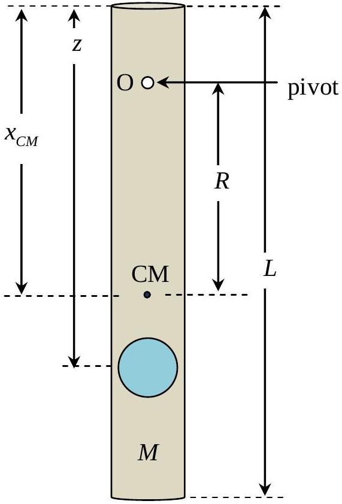
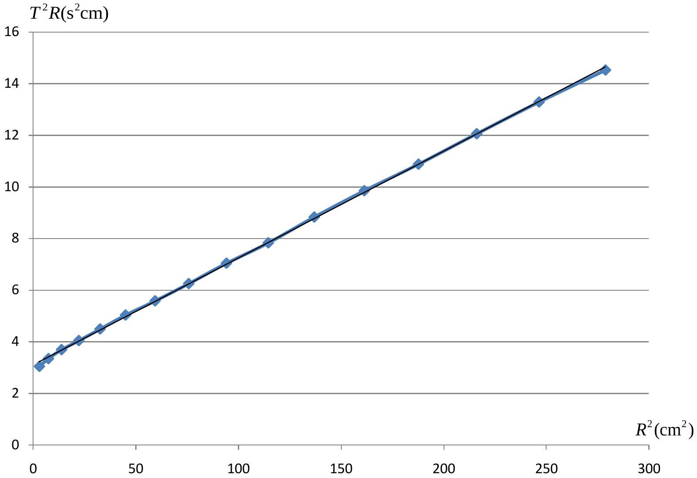
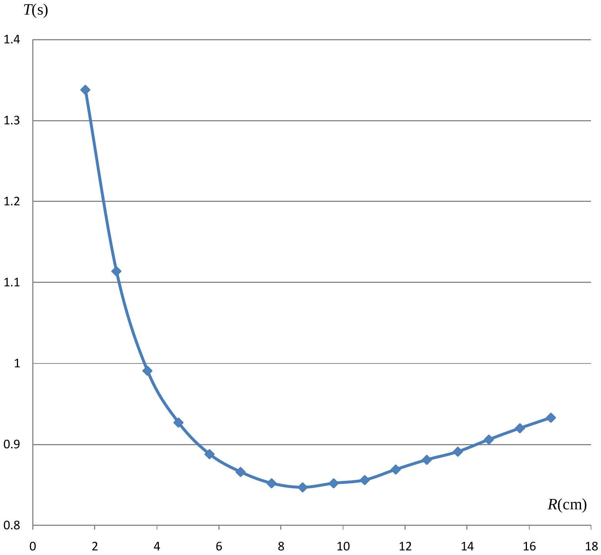

## Solution: 2 . Mechanical Blackbox: a cylinder with a ball inside

In order to be able to calculate the required values in i, ii, iii, we need to know:

a. the position of the centre of mass of the tubing plus particle (object) which depends on $z , m , M$
b. the moment of inertia of the above.

The position of the CM may be found by balancing. The $I _ { C M }$ can be calculated from the period of oscillation of the tubing plus object.

Analytical steps to select parameters for plotting
I.

$$
\begin{equation*}
x _ { C M } = \frac { m z + M \frac { L } { 2 } } { m + M } \tag{1}
\end{equation*}
$$

$L$ is readily obtainable with a ruler.
$x _ { C M }$ is determined by balancing the tubing and object.

II. For small-amplitude oscillation about any point O the period $T$ is given by considering the equation:

$$
\begin{align*}
\left\{ ( M + m ) R ^ { 2 } + I _ { C M } \right\} \ddot { \theta } & = - g ( M + m ) R \sin \theta \approx - g ( M + m ) R \theta  \tag{2}\\
T & = 2 \pi \sqrt { \frac { I _ { C M } + ( M + m ) R ^ { 2 } } { g ( M + m ) R } } \tag{3}
\end{align*}
$$

where

$$
\begin{align*}
I _ { C M } & = \frac { 1 } { 3 } M \left( \frac { L } { 2 } \right) ^ { 2 } + M \left( x _ { C M } - \frac { L } { 2 } \right) ^ { 2 } + m \left( z - x _ { C M } \right) ^ { 2 } \\
& = \frac { 1 } { 3 } M L ^ { 2 } + M x _ { C M } ^ { 2 } - M L x _ { C M } + m \left( z - x _ { C M } \right) ^ { 2 } \tag{4}
\end{align*}
$$

Note that

$$
\begin{equation*}
T ^ { 2 } \frac { g ( M + m ) } { 4 \pi ^ { 2 } } = \frac { I _ { C M } } { R } + ( M + m ) R \tag{5}
\end{equation*}
$$

## Method (a): (linear graph method)

The equation (5) may be put in the form:

$$
\begin{equation*}
T ^ { 2 } R = \left( \frac { 4 \pi ^ { 2 } } { g } \right) R ^ { 2 } + \frac { 4 \pi ^ { 2 } I _ { C M } } { ( M + m ) g } \tag{6}
\end{equation*}
$$

Hence the plot of $T ^ { 2 } R$ v.s. $R ^ { 2 }$ will yield the straight line whose

$$
\begin{align*}
& \qquad \text { Slope } \alpha = \frac { 4 \pi ^ { 2 } } { g }  \tag{7}\\
& \text { and y-intercept } \beta = \frac { 4 \pi ^ { 2 } I _ { C M } } { ( M + m ) g }  \tag{8}\\
& \text { Hence, }  \tag{9}\\
& \qquad I _ { C M } = ( M + m ) \frac { \beta } { \alpha }  \tag{10}\\
& \text { is from equation (7): } g = \frac { 4 \pi ^ { 2 } } { \alpha }
\end{align*}
$$

Method (b): minimum point curve method
The equation (5) implies that $T$ has a minimum value at

$$
\begin{equation*}
R = R _ { \min } \equiv \sqrt { \frac { I _ { C M } } { M + m } } \tag{11}
\end{equation*}
$$

Hence $R _ { \text {min } }$ can be obtained from the graph $T$ v.s.R.
And therefore

$$
\begin{equation*}
I _ { C M } = ( M + m ) R _ { \min } ^ { 2 } \tag{12}
\end{equation*}
$$

This equation (12) together with equation (1) will allow us to calculate the required values $z$ and $\frac { M } { m }$.

At the value $R = R _ { \text {min } }$ equation (5) becomes $T _ { \text {min } } ^ { 2 } \frac { g ( M + m ) } { 4 \pi ^ { 2 } } = ( M + m ) R _ { \text {min } } + ( M + m ) R _ { \text {min } }$

$$
\begin{equation*}
g = \frac { 2 R _ { \min } } { T _ { \min } ^ { 2 } } \times 4 \pi ^ { 2 } = \frac { 8 \pi ^ { 2 } R _ { \min } } { T _ { \min } ^ { 2 } } \tag{13}
\end{equation*}
$$

from which $g$ can be calculated.

Results

$$
\begin{aligned}
L & = 30.0 \mathrm {~cm} \pm 0.1 \mathrm {~cm} \\
x _ { C M } & = 17.8 \mathrm {~cm} \pm 0.1 \mathrm {~cm} \text { (from top) }
\end{aligned}
$$

| $x _ { C M } - R$ (cm) | time (s) for 20 cycles |  |  | $T ( \mathrm {~s} )$ | $R ( \mathrm {~cm} )$ | $R ^ { 2 } \left( \mathrm {~cm} ^ { 2 } \right)$ | $T ^ { 2 } R \left( \mathrm {~s} ^ { 2 } \mathrm {~cm} \right)$ |
| :--- | :--- | :--- | :--- | :--- | :--- | :--- | :--- |
| 1.1 | 18.59 | 18.78 | 18.59 | 0.933 | 16.7 | 278.9 | 14.53 |
| 2.1 | 18.44 | 18.25 | 18.53 | 0.920 | 15.7 | 246.5 | 13.29 |
| 3.1 | 18.10 | 18.09 | 18.15 | 0.906 | 14.7 | 216.1 | 12.06 |
| 4.1 | 17.88 | 17.78 | 17.81 | 0.891 | 13.7 | 187.7 | 10.88 |
| 5.1 | 17.69 | 17.50 | 17.65 | 0.881 | 12.7 | 161.3 | 9.85 |
| 6.1 | 17.47 | 17.38 | 17.28 | 0.869 | 11.7 | 136.9 | 8.83 |
| 7.1 | 17.06 | 17.06 | 17.22 | 0.856 | 10.7 | 114.5 | 7.83 |
| 8.1 | 17.06 | 17.00 | 17.06 | 0.852 | 9.7 | 94.1 | 7.04 |
| 9.1 | 16.97 | 16.91 | 16.96 | 0.847 | 8.7 | 75.7 | 6.25 |
| 10.1 | 17.00 | 17.03 | 17.06 | 0.852 | 7.7 | 59.3 | 5.58 |
| 11.1 | 17.22 | 17.37 | 17.38 | 0.866 | 6.7 | 44.9 | 5.03 |
| 12.1 | 17.78 | 17.72 | 17.75 | 0.888 | 5.7 | 32.5 | 4.49 |
| 13.1 | 18.57 | 18.59 | 18.47 | 0.927 | 4.7 | 22.1 | 4.04 |
| 14.1 | 19.78 | 19.90 | 19.75 | 0.991 | 3.7 | 13.7 | 3.69 |
| 15.1 | 11.16 | 11.13 | 11.13 | 1.114 | 2.7 | 7.3 | 3.34 |
| 16.1 | 13.25 | 13.40 | 13.50 | 1.338 | 1.7 | 2.9 | 3.04 |

Notes: at $x _ { C M } - R = 15.1,16.1 \mathrm {~cm}$, times for 10 cycles.

Method (a)

Calculation from straight line graph: slope $\alpha = 0.04108 \pm 0.0007 \mathrm {~s} ^ { 2 } / \mathrm { cm }$, y-intercept $\beta = 3.10 \pm 0.05 \mathrm {~s} ^ { 2 } \mathrm {~cm}$

$$
\begin{aligned}
g & = \frac { 4 \pi ^ { 2 } } { \alpha } \text { giving } g = ( 961 \pm 20 ) \mathrm { cm } / \mathrm { s } ^ { 2 } \\
\frac { \beta } { \alpha } & = \frac { 3.10 } { 0.04108 } = 75.46 \mathrm {~cm} ^ { 2 } \left( \pm 2.5 \mathrm {~cm} ^ { 2 } \right) \\
I _ { C M } & = ( M + m ) \frac { \beta } { \alpha } = ( 75.46 ) ( M + m )
\end{aligned}
$$

From equation (4): $\quad I _ { C M } = \frac { 1 } { 3 } M \left( \frac { L } { 2 } \right) ^ { 2 } + M \left( x _ { C M } - \frac { L } { 2 } \right) ^ { 2 } + m \left( z - x _ { C M } \right) ^ { 2 }$

Then

$$
\begin{align*}
& ( 75.46 ) ( M + m ) = 75.0 M + 7.84 M + m ( z - 17.8 ) ^ { 2 } \\
& \quad - 7.38 \frac { M } { m } + 75.46 = ( z - 17.8 ) ^ { 2 } \tag{14}
\end{align*}
$$

The centre of mass position gives:

$$
\begin{align*}
17.8 ( M + m ) & = 15.0 M + m z \\
\frac { M } { m } & = \frac { z - 17.8 } { 2.8 } \tag{15}
\end{align*}
$$

From equations (14) and (15):

$$
\begin{aligned}
- \frac { 7.38 } { 2.8 } ( z - 17.8 ) + 75.46 & = ( z - 17.8 ) ^ { 2 } \\
( z - 17.8 ) & = 7.47
\end{aligned}
$$

And

$$
\begin{aligned}
z = 25.27 & = 25.3 \pm 0.1 \mathrm {~cm} \\
\frac { M } { m } & = 2.68 = 2.7
\end{aligned}
$$

Error Estimation
Find error for $g$ :
From (10),

$$
\begin{aligned}
& g = \frac { 4 \pi ^ { 2 } } { \alpha } \\
& \Delta g = \frac { \Delta \alpha } { \alpha } g = 16.3 \mathrm {~cm} / \mathrm { s } ^ { 2 } \approx 20 \mathrm {~cm} / \mathrm { s } ^ { 2 }
\end{aligned}
$$

i) Find error for $z$ :
First, find error for $r = \frac { \beta } { \alpha } = \frac { 3.10 } { 0.04108 } = 75.46 \mathrm {~cm} ^ { 2 }$.
$$
\Delta r = \left( \frac { \Delta \alpha } { \alpha } + \frac { \Delta \beta } { \beta } \right) r = 2.5 \mathrm {~cm} ^ { 2 }
$$
Since error from $r$ contributes most $\left( \frac { \Delta r } { r } \sim 0.03 \right.$ while $\left. \frac { \Delta L } { L } , \frac { \Delta x _ { c m } } { x _ { c m } } \sim 0.005 \right)$, we estimate error propagation from $r$ only to simplify the analysis by substituting the min and max values into equation (4).

Now, we use $r _ { \text {max } } = r + \Delta r = 75.46 + 2.5 = 77.96$. The corresponding quadratic equation is $( z - 17.8 ) ^ { 2 } + 1.743 ( z - 17.8 ) - 77.96 = 0$ The corresponding solution is $( z - 17.8 ) _ { \text {max } } = 7.55 \mathrm {~cm}$

If we use $r _ { \text {min } } = r - \Delta r = 75.46 - 2.5 = 72.96$, the corresponding quadratic equation is

$$
( z - 17.8 ) ^ { 2 } + 3.529 ( z - 17.8 ) - 72.96 = 0
$$

The corresponding solution is $( z - 17.8 ) _ { \text {min } } = 6.96 \mathrm {~cm}$

$$
\text { So } \Delta ( z - 17.8 ) = \frac { 7.55 - 6.96 } { 2 } = 0.3 \mathrm {~cm}
$$

Note that $\frac { \Delta ( z - 17.8 ) } { z - 17.8 } \sim 0.04$. So, we still ignore the error propagation due to $\Delta L , \Delta x _ { c m }$
The error $\Delta z$ can be estimated from $\Delta z \approx \Delta ( z - 17.8 ) = 0.3 \mathrm {~cm}$

ii) Find error for $\frac { M } { m }$ :
We know that $\frac { M } { m } = \frac { z - 17.8 } { 2.8 }$
$$
\Delta \left( \frac { M } { m } \right) = \frac { \Delta ( z - 17.8 ) } { 2.8 } = 0.11
$$

Method (b)
Calculation from $T - R$ plot:

Using the minimum position: $T = T _ { \text {min } }$ at $I _ { C M } = ( M + m ) R _ { \text {min } } ^ { 2 }$ and $g = \frac { 8 \pi ^ { 2 } R _ { \text {min } } } { T _ { \text {min } } ^ { 2 } }$
From graph: $R _ { \text {min } } = 8.9 \pm 0.2 \mathrm {~cm}$ and $T _ { \text {min } } = 0.846 \pm 0.005 \mathrm {~s}$

$$
\begin{gather*}
\therefore \quad g = 982 \pm 40 \mathrm {~cm} / \mathrm { s } ^ { 2 } \\
I _ { C M } = ( M + m ) ( 8.9 ) ^ { 2 } = ( 79.21 ) ( M + m ) \tag{16}
\end{gather*}
$$

From equations (14), (15), (16):

$$
\begin{gathered}
( 79.21 ) ( M + m ) = 75.0 M + 7.84 M + m ( z - 17.8 ) ^ { 2 } \\
- 3.63 M + 79.21 m = m ( z - 17.8 ) ^ { 2 } \\
( x - 17.8 ) ^ { 2 } + \frac { 3.63 } { 2.8 } ( x - 17.8 ) - 79.21 = 0 \\
( z - 17.8 ) = 8.28
\end{gathered}
$$

And

$$
\begin{aligned}
z = 26.08 & = 26.1 \pm 0.7 \mathrm {~cm} \\
\frac { M } { m } & = 2.95 = 3.0 \pm 0.3
\end{aligned}
$$

Error estimation

i) Find error for $g$ :
Using the minimum position: $g = \frac { 8 \pi ^ { 2 } R _ { \text {min } } } { T _ { \text {min } } ^ { 2 } }$, we have
$$
\Delta g = \left( \frac { \Delta R _ { \min } } { R _ { \min } } + 2 \frac { \Delta T _ { \min } } { T _ { \min } } \right) g = 34 \approx 30 \mathrm {~cm} / \mathrm { s } ^ { 2 }
$$
ii) Find error for $z$ :
First, find error for $r = R _ { \text {min } } ^ { 2 } = 79.21 \mathrm {~cm} ^ { 2 }$.
$$
\Delta r = 2 R _ { \min } \Delta R _ { \min } = 3.56 \mathrm {~cm} ^ { 2 }
$$
This $r$ is equivalent to $r$ in part 1. So, one can follow the same error analysis.
As a result, we have
$$
\begin{aligned}
& z = 26.08 \approx 26.1 \mathrm {~cm} \\
& \Delta z = 0.8 \mathrm {~cm}
\end{aligned}
$$
i) Find error for $\frac { M } { m }$ :
Following the same analysis as in part I, we found that
$$
\frac { M } { m } = 2.96 ; \Delta \left( \frac { M } { m } \right) = 0.15
$$
NOTE: This minimum curve method is not as accurate as the usual straight line graph.
