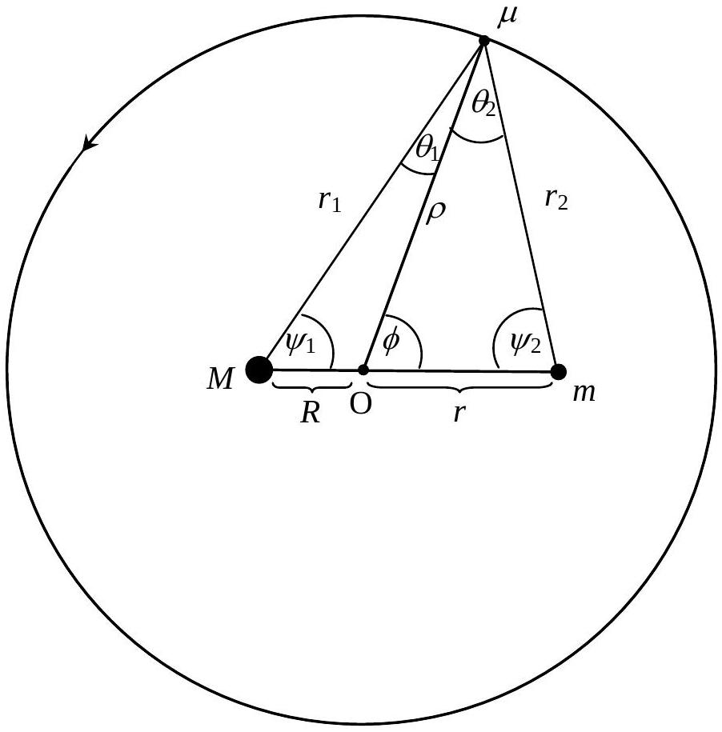
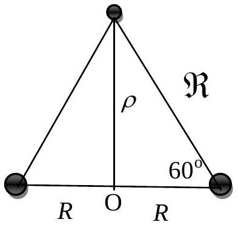
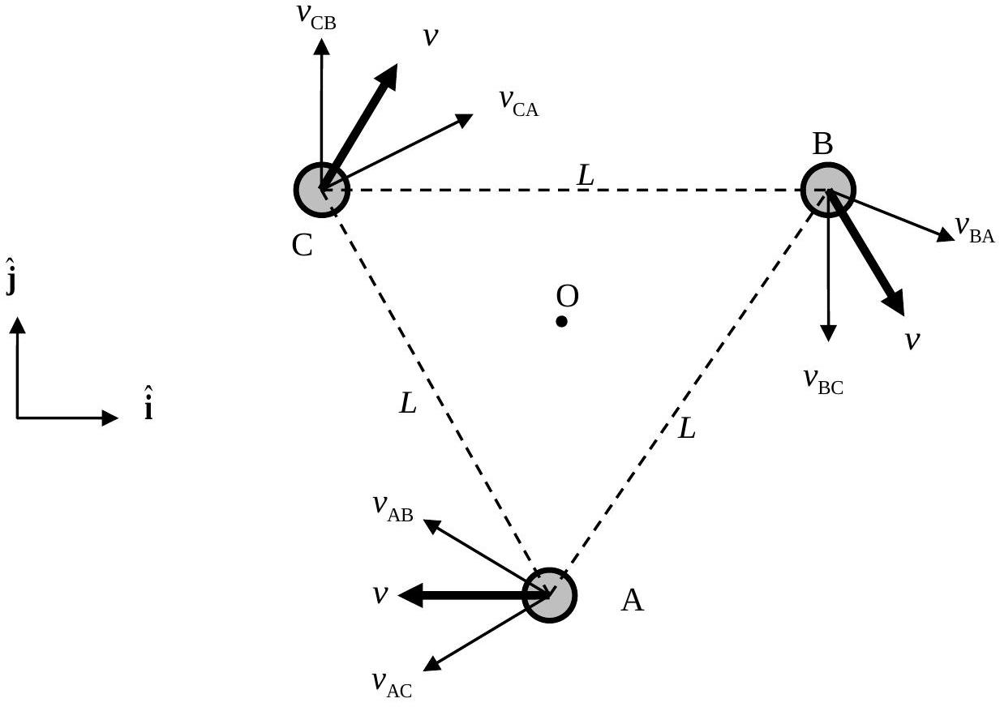

## I. Solution

1.1 Let O be their centre of mass. Hence
$$
\begin{equation*}
M R - m r = 0 \tag{1}
\end{equation*}
$$
$$
\begin{align*}
& m \omega _ { 0 } ^ { 2 } r = \frac { G M m } { ( R + r ) ^ { 2 } }  \tag{2}\\
& M \omega _ { 0 } ^ { 2 } R = \frac { G M m } { ( R + r ) ^ { 2 } }
\end{align*}
$$
From Eq. (2), or using reduced mass, $\omega _ { 0 } ^ { 2 } = \frac { G ( M + m ) } { ( R + r ) ^ { 3 } }$
Hence, $\omega _ { 0 } ^ { 2 } = \frac { G ( M + m ) } { ( R + r ) ^ { 3 } } = \frac { G M } { r ( R + r ) ^ { 2 } } = \frac { G m } { R ( R + r ) ^ { 2 } }$.

1.2 Since $\mu$ is infinitesimal, it has no gravitational influences on the motion of neither $M$ nor $m$. For $\mu$ to remain stationary relative to both $M$ and $m$ we must have:

$$
\begin{align*}
\frac { G M \mu } { r _ { 1 } ^ { 2 } } \cos \theta _ { 1 } + \frac { G m \mu } { r _ { 2 } ^ { 2 } } \cos \theta _ { 2 } & = \mu \omega _ { 0 } ^ { 2 } \rho = \frac { G ( M + m ) \mu } { ( R + r ) ^ { 3 } } \rho  \tag{4}\\
\frac { G M \mu } { r _ { 1 } ^ { 2 } } \sin \theta _ { 1 } & = \frac { G m \mu } { r _ { 2 } ^ { 2 } } \sin \theta _ { 2 } \tag{5}
\end{align*}
$$

Substituting $\frac { G M } { r _ { 1 } ^ { 2 } }$ from Eq. (5) into Eq. (4), and using the identity $\sin \theta _ { 1 } \cos \theta _ { 2 } + \cos \theta _ { 1 } \sin \theta _ { 2 } = \sin \left( \theta _ { 1 } + \theta _ { 2 } \right)$, we get

$$
\begin{equation*}
m \frac { \sin \left( \theta _ { 1 } + \theta _ { 2 } \right) } { r _ { 2 } ^ { 2 } } = \frac { ( M + m ) } { ( R + r ) ^ { 3 } } \rho \sin \theta _ { 1 } \tag{6}
\end{equation*}
$$

The distances $r _ { 2 }$ and $\rho$, the angles $\theta _ { 1 }$ and $\theta _ { 2 }$ are related by two Sine Rule equations

$$
\begin{align*}
\frac { \sin \psi _ { 1 } } { \rho } & = \frac { \sin \theta _ { 1 } } { R } \\
\frac { \sin \psi _ { 1 } } { r _ { 2 } } & = \frac { \sin \left( \theta _ { 1 } + \theta _ { 2 } \right) } { R + r } \tag{7}
\end{align*}
$$

Substitute (7) into (6)

$$
\begin{equation*}
\frac { 1 } { r _ { 2 } ^ { 3 } } = \frac { R } { ( R + r ) ^ { 4 } } \frac { ( M + m ) } { m } \tag{10}
\end{equation*}
$$

Since $\frac { m } { M + m } = \frac { R } { R + r }$, Eq. (10) gives

$$
\begin{equation*}
r _ { 2 } = R + r \tag{11}
\end{equation*}
$$

By substituting $\frac { G m } { r _ { 2 } ^ { 2 } }$ from Eq. (5) into Eq. (4), and repeat a similar procedure, we get

$$
\begin{equation*}
r _ { 1 } = R + r \tag{12}
\end{equation*}
$$

Alternatively,

$$
\begin{aligned}
& \frac { r _ { 1 } } { \sin \left( 180 ^ { \circ } - \phi \right) } = \frac { R } { \sin \theta _ { 1 } } \text { and } \frac { r _ { 2 } } { \sin \phi } = \frac { r } { \sin \theta _ { 2 } } \\
& \frac { \sin \theta _ { 1 } } { \sin \theta _ { 2 } } = \frac { R } { r } \times \frac { r _ { 2 } } { r _ { 1 } } = \frac { m } { M } \times \frac { r _ { 2 } } { r _ { 1 } }
\end{aligned}
$$

Combining with Eq. (5) gives $r _ { 1 } = r _ { 2 }$

Hence, it is an equilateral triangle with

$$
\begin{align*}
& \psi _ { 1 } = 60 ^ { \circ }  \tag{13}\\
& \psi _ { 2 } = 60 ^ { \circ }
\end{align*}
$$

The distance $\rho$ is calculated from the Cosine Rule.

$$
\begin{align*}
& \rho ^ { 2 } = r ^ { 2 } + ( R + r ) ^ { 2 } - 2 r ( R + r ) \cos 60 ^ { \circ } \\
& \rho = \sqrt { r ^ { 2 } + r R + R ^ { 2 } } \tag{14}
\end{align*}
$$

Alternative Solution to 1.2

Since $\mu$ is infinitesimal, it has no gravitational influences on the motion of neither $M$ nor $m$.For $\mu$ to remain stationary relative to both $M$ and $m$ we must have:

$$
\begin{align*}
\frac { G M \mu } { r _ { 1 } ^ { 2 } } \cos \theta _ { 1 } + \frac { G m \mu } { r _ { 2 } ^ { 2 } } \cos \theta _ { 2 } & = \mu \omega ^ { 2 } \rho = \frac { G ( M + m ) \mu } { ( R + r ) ^ { 3 } } \rho  \tag{4}\\
\frac { G M \mu } { r _ { 1 } ^ { 2 } } \sin \theta _ { 1 } & = \frac { G m \mu } { r _ { 2 } ^ { 2 } } \sin \theta _ { 2 } \tag{5}
\end{align*}
$$

Note that

$$
\begin{align*}
& \frac { r _ { 1 } } { \sin \left( 180 ^ { \circ } - \phi \right) } = \frac { R } { \sin \theta _ { 1 } } \\
& \frac { r _ { 2 } } { \sin \phi } = \frac { r } { \sin \theta _ { 2 } } \quad \text { (see figure) } \\
& \frac { \sin \theta _ { 1 } } { \sin \theta _ { 2 } } = \frac { R } { r } \times \frac { r _ { 2 } } { r _ { 1 } } = \frac { m } { M } \times \frac { r _ { 2 } } { r _ { 1 } } \tag{6}
\end{align*}
$$

Equations (5) and (6):

$$
\begin{align*}
& r _ { 1 } = r _ { 2 }  \tag{7}\\
& \frac { \sin \theta _ { 1 } } { \sin \theta _ { 2 } } = \frac { m } { M }  \tag{8}\\
& \psi _ { 1 } = \psi _ { 2 } \tag{9}
\end{align*}
$$

The equation (4) then becomes:

$$
\begin{equation*}
M \cos \theta _ { 1 } + m \cos \theta _ { 2 } = \frac { ( M + m ) } { ( R + r ) ^ { 3 } } r _ { 1 } ^ { 2 } \rho \tag{10}
\end{equation*}
$$

Equations (8) and (10): $\sin \left( \theta _ { 1 } + \theta _ { 2 } \right) = \frac { M + m } { M } \frac { r _ { 1 } ^ { 2 } \rho } { ( R + r ) ^ { 3 } } \sin \theta _ { 2 }$
Note that from figure,

$$
\begin{equation*}
\frac { \rho } { \sin \psi _ { 2 } } = \frac { r } { \sin \theta _ { 2 } } \tag{12}
\end{equation*}
$$

Equations (11) and (12): $\sin \left( \theta _ { 1 } + \theta _ { 2 } \right) = \frac { M + m } { M } \frac { r _ { 1 } ^ { 2 } r } { ( R + r ) ^ { 3 } } \sin \psi _ { 2 }$ $\_\_\_\_$ (13)
Also from figure,

$$
\begin{equation*}
( R + r ) ^ { 2 } = r _ { 2 } ^ { 2 } - 2 r _ { 1 } r _ { 2 } \cos \left( \theta _ { 1 } + \theta _ { 2 } \right) + r _ { 1 } ^ { 2 } = 2 r _ { 1 } ^ { 2 } \left[ 1 - \cos \left( \theta _ { 1 } + \theta _ { 2 } \right) \right] \tag{14}
\end{equation*}
$$

Equations (13) and (14): $\sin \left( \theta _ { 1 } + \theta _ { 2 } \right) = \frac { \sin \psi _ { 2 } } { 2 \left[ 1 - \cos \left( \theta _ { 1 } + \theta _ { 2 } \right) \right] }$

$$
\begin{aligned}
& \theta _ { 1 } + \theta _ { 2 } = 180 ^ { \circ } - \psi _ { 1 } - \psi _ { 2 } = 180 ^ { \circ } - 2 \psi _ { 2 } \quad \text { (see figure) } \\
\therefore \quad & \cos \psi _ { 2 } = \frac { 1 } { 2 } , \psi _ { 2 } = 60 ^ { \circ } , \psi _ { 1 } = 60 ^ { \circ }
\end{aligned}
$$

Hence $M$ and $m$ from an equilateral triangle of sides $( R + r )$
Distance $\mu$ to $M$ is $R + r$
Distance $\mu$ to $m$ is $R + r$
Distance $\mu$ to O is $\rho = \sqrt { \left( \frac { R + r } { 2 } - R \right) ^ { 2 } + \left\{ ( R + r ) \frac { \sqrt { 3 } } { 2 } \right\} ^ { 2 } } = \sqrt { R ^ { 2 } + R r + r ^ { 2 } }$
1.3 The energy of the mass $\mu$ is given by

$$
\begin{equation*}
E = - \frac { G M \mu } { r _ { 1 } } - \frac { G m \mu } { r _ { 2 } } + \frac { 1 } { 2 } \mu \left( \left( \frac { d \rho } { d t } \right) ^ { 2 } + \rho ^ { 2 } \omega ^ { 2 } \right) \tag{15}
\end{equation*}
$$

Since the perturbation is in the radial direction, angular momentum is conserved ( $r _ { 1 } = r _ { 2 } = \Re$ and $m = M$ ),

$$
\begin{equation*}
E = - \frac { 2 G M \mu } { \Re } + \frac { 1 } { 2 } \mu \left( \left( \frac { d \rho } { d t } \right) ^ { 2 } + \frac { \rho _ { 0 } ^ { 4 } \omega _ { 0 } ^ { 2 } } { \rho ^ { 2 } } \right) \tag{16}
\end{equation*}
$$

Since the energy is conserved,

$$
\begin{align*}
& \frac { d E } { d t } = 0 \\
& \frac { d E } { d t } = \frac { 2 G M \mu } { \Re ^ { 2 } } \frac { d \Re } { d t } + \mu \frac { d \rho } { d t } \frac { d ^ { 2 } \rho } { d t ^ { 2 } } - \mu \frac { \rho _ { 0 } ^ { 4 } \omega _ { 0 } ^ { 2 } } { \rho ^ { 3 } } \frac { d \rho } { d t } = 0 \ldots  \tag{17}\\
& \frac { d \Re } { d t } = \frac { d \Re } { d \rho } \frac { d \rho } { d t } = \frac { d \rho } { d t } \frac { \rho } { \Re }  \tag{18}\\
& \frac { d E } { d t } = \frac { 2 G M \mu } { \Re ^ { 3 } } \rho \frac { d \rho } { d t } + \mu \frac { d \rho } { d t } \frac { d ^ { 2 } \rho } { d t ^ { 2 } } - \mu \frac { \rho _ { 0 } ^ { 4 } \omega _ { 0 } ^ { 2 } } { \rho ^ { 3 } } \frac { d \rho } { d t } = 0 \tag{19}
\end{align*}
$$

Since $\frac { d \rho } { d t } \neq 0$, we have

$$
\begin{align*}
& \frac { 2 G M } { \Re ^ { 3 } } \rho + \frac { d ^ { 2 } \rho } { d t ^ { 2 } } - \frac { \rho _ { 0 } ^ { 4 } \omega _ { 0 } ^ { 2 } } { \rho ^ { 3 } } = 0 \text { or } \\
& \frac { d ^ { 2 } \rho } { d t ^ { 2 } } = - \frac { 2 G M } { \Re ^ { 3 } } \rho + \frac { \rho _ { 0 } ^ { 4 } \omega _ { 0 } ^ { 2 } } { \rho ^ { 3 } } \tag{20}
\end{align*}
$$

The perturbation from $\Re _ { 0 }$ and $\rho _ { 0 }$ gives $\Re = \Re _ { 0 } \left( 1 + \frac { \Delta \Re } { \Re _ { 0 } } \right)$ and $\rho = \rho _ { 0 } \left( 1 + \frac { \Delta \rho } { \rho _ { 0 } } \right)$.
Then

$$
\begin{equation*}
\frac { d ^ { 2 } \rho } { d t ^ { 2 } } = \frac { d ^ { 2 } } { d t ^ { 2 } } \left( \rho _ { 0 } + \Delta \rho \right) = - \frac { 2 G M } { \Re _ { 0 } ^ { 3 } \left( 1 + \frac { \Delta \Re } { \Re _ { 0 } } \right) ^ { 3 } } \rho _ { 0 } \left( 1 + \frac { \Delta \rho } { \rho _ { 0 } } \right) + \frac { \rho _ { 0 } ^ { 4 } \omega _ { 0 } ^ { 2 } } { \rho _ { 0 } ^ { 3 } \left( 1 + \frac { \Delta \rho } { \rho _ { 0 } } \right) ^ { 3 } } \tag{21}
\end{equation*}
$$

Using binomial expansion $( 1 + \varepsilon ) ^ { n } \approx 1 + n \varepsilon$,

$$
\begin{equation*}
\frac { d ^ { 2 } \Delta \rho } { d t ^ { 2 } } = - \frac { 2 G M } { \Re _ { 0 } ^ { 3 } } \rho _ { 0 } \left( 1 + \frac { \Delta \rho } { \rho _ { 0 } } \right) \left( 1 - \frac { 3 \Delta \Re } { \Re _ { 0 } } \right) + \rho _ { 0 } \omega _ { 0 } ^ { 2 } \left( 1 - \frac { 3 \Delta \rho } { \rho _ { 0 } } \right) . \tag{22}
\end{equation*}
$$

Using $\Delta \rho = \frac { \Re } { \rho } \Delta \Re$,

$$
\begin{equation*}
\frac { d ^ { 2 } \Delta \rho } { d t ^ { 2 } } = - \frac { 2 G M } { \Re _ { 0 } ^ { 3 } } \rho _ { 0 } \left( 1 + \frac { \Delta \rho } { \rho _ { 0 } } - \frac { 3 \rho _ { 0 } \Delta \rho } { \Re _ { 0 } ^ { 2 } } \right) + \rho _ { 0 } \omega _ { 0 } ^ { 2 } \left( 1 - \frac { 3 \Delta \rho } { \rho _ { 0 } } \right) . \tag{23}
\end{equation*}
$$

Since $\omega _ { 0 } ^ { 2 } = \frac { 2 G M } { \Re _ { 0 } ^ { 3 } }$,

$$
\begin{align*}
\frac { d ^ { 2 } \Delta \rho } { d t ^ { 2 } } & = - \omega _ { 0 } ^ { 2 } \rho _ { 0 } \left( 1 + \frac { \Delta \rho } { \rho _ { 0 } } - \frac { 3 \rho _ { 0 } \Delta \rho } { \Re _ { 0 } ^ { 2 } } \right) + \omega _ { 0 } ^ { 2 } \rho _ { 0 } \left( 1 - \frac { 3 \Delta \rho } { \rho _ { 0 } } \right)  \tag{24}\\
\frac { d ^ { 2 } \Delta \rho } { d t ^ { 2 } } & = - \omega _ { 0 } ^ { 2 } \rho _ { 0 } \left( \frac { 4 \Delta \rho } { \rho _ { 0 } } - \frac { 3 \rho _ { 0 } \Delta \rho } { \Re _ { 0 } ^ { 2 } } \right)  \tag{25}\\
\frac { d ^ { 2 } \Delta \rho } { d t ^ { 2 } } & = - \omega _ { 0 } ^ { 2 } \Delta \rho \left( 4 - \frac { 3 \rho _ { 0 } ^ { 2 } } { \Re _ { 0 } ^ { 2 } } \right) \tag{26}
\end{align*}
$$

From the figure, $\rho _ { 0 } = \Re _ { 0 } \cos 30 ^ { \circ }$ or $\frac { \rho _ { 0 } { } ^ { 2 } } { \Re _ { 0 } { } ^ { 2 } } = \frac { 3 } { 4 }$,

$$
\begin{equation*}
\frac { d ^ { 2 } \Delta \rho } { d t ^ { 2 } } = - \omega _ { 0 } ^ { 2 } \Delta \rho \left( 4 - \frac { 9 } { 4 } \right) = - \frac { 7 } { 4 } \omega _ { 0 } ^ { 2 } \Delta \rho . \tag{27}
\end{equation*}
$$

Angular frequency of oscillation is $\frac { \sqrt { 7 } } { 2 } \omega _ { 0 }$.

Alternative solution:
$M = m$ gives $R = r$ and $\omega _ { 0 } { } ^ { 2 } = \frac { G ( M + M ) } { ( R + R ) ^ { 3 } } = \frac { G M } { 4 R ^ { 3 } }$. The unperturbed radial distance of $\mu$ is $\sqrt { 3 } R$, so the perturbed radial distance can be represented by $\sqrt { 3 } R + \zeta$ where $\zeta \ll \sqrt { 3 } R$ as shown in the following figure.
Using Newton's $2 ^ { \mathrm { nd } }$ law, $- \frac { 2 G M \mu } { \left\{ R ^ { 2 } + ( \sqrt { 3 } R + \zeta ) ^ { 2 } \right\} ^ { 3 / 2 } } ( \sqrt { 3 } R + \zeta ) = \mu \frac { d ^ { 2 } } { d t ^ { 2 } } ( \sqrt { 3 } R + \zeta ) - \mu \omega ^ { 2 } ( \sqrt { 3 } R + \zeta )$.
The conservation of angular momentum gives $\mu \omega _ { 0 } ( \sqrt { 3 } R ) ^ { 2 } = \mu \omega ( \sqrt { 3 } R + \zeta ) ^ { 2 }$.
Manipulate (1) and (2) algebraically, applying $\zeta ^ { 2 } \approx 0$ and binomial approximation.

$$
\begin{aligned}
& - \frac { 2 G M } { \left\{ R ^ { 2 } + ( \sqrt { 3 } R + \zeta ) ^ { 2 } \right\} ^ { 3 / 2 } } ( \sqrt { 3 } R + \zeta ) = \frac { d ^ { 2 } \zeta } { d t ^ { 2 } } - \frac { \omega _ { 0 } ^ { 2 } \sqrt { 3 } R } { ( 1 + \zeta / \sqrt { 3 } R ) ^ { 3 } } \\
& - \frac { 2 G M } { \left\{ 4 R ^ { 2 } + 2 \sqrt { 3 } \zeta R \right\} ^ { 3 / 2 } } ( \sqrt { 3 } R + \zeta ) \approx \frac { d ^ { 2 } \zeta } { d t ^ { 2 } } - \frac { \omega _ { 0 } ^ { 2 } \sqrt { 3 } R } { ( 1 + \zeta / \sqrt { 3 } R ) ^ { 3 } } \\
& - \frac { G M } { 4 R ^ { 3 } } \sqrt { 3 } R \frac { ( 1 + \zeta / \sqrt { 3 } R ) } { ( 1 + \sqrt { 3 } \zeta / 2 R ) ^ { 3 / 2 } } = \frac { d ^ { 2 } \zeta } { d t ^ { 2 } } - \frac { \omega _ { 0 } ^ { 2 } \sqrt { 3 } R } { ( 1 + \zeta / \sqrt { 3 } R ) ^ { 3 } } \\
& - \omega _ { 0 } ^ { 2 } \sqrt { 3 } R \left( 1 - \frac { 3 \sqrt { 3 } \zeta } { 4 R } \right) \left( 1 + \frac { \zeta } { \sqrt { 3 } R } \right) \approx \frac { d ^ { 2 } \zeta } { d t ^ { 2 } } - \omega _ { 0 } ^ { 2 } \sqrt { 3 } R \left( 1 - \frac { 3 \zeta } { \sqrt { 3 } R } \right) \\
& \frac { d ^ { 2 } } { d t ^ { 2 } } \zeta = - \left( \frac { 7 } { 4 } \omega _ { 0 } ^ { 2 } \right) \zeta
\end{aligned}
$$

1.4 Relative velocity

Let $v =$ speed of each spacecraft as it moves in circle around the centre O.
The relative velocities are denoted by the subscripts A, B and C.
For example, $v _ { \mathrm { BA } }$ is the velocity of B as observed by A.

The period of circular motion is 1 year $T = 365 \times 24 \times 60 \times 60 \mathrm {~s}$.
The angular frequency $\omega = \frac { 2 \pi } { T }$
The speed $v = \omega \frac { L } { 2 \cos 30 ^ { \circ } } = 575 \mathrm {~m} / \mathrm { s }$

The speed is much less than the speed light → Galilean transformation.
In Cartesian coordinates, the velocities of B and C (as observed by O) are

For $\mathrm { B } , \vec { v } _ { B } = v \cos 60 ^ { \circ } \hat { \mathbf { i } } - v \sin 60 ^ { \circ } \hat { \mathbf { j } }$

For $\mathrm { C } , \vec { v } _ { C } = v \cos 60 ^ { \circ } \hat { \mathbf { i } } + v \sin 60 ^ { \circ } \hat { \mathbf { j } }$
Hence $\vec { v } _ { \mathrm { BC } } = - 2 v \sin 60 ^ { \circ } \hat { \mathbf { j } } = - \sqrt { 3 } v \hat { \mathbf { j } }$
The speed of B as observed by C is $\sqrt { 3 } v \approx 996 \mathrm {~m} / \mathrm { s }$

Notice that the relative velocities for each pair are anti-parallel.

Alternative solution for 1.4

One can obtain $v _ { \mathrm { BC } }$ by considering the rotation about the axis at one of the spacecrafts.

$$
v _ { \mathrm { BC } } = \omega L = \frac { 2 \pi } { 365 \times 24 \times 60 \times 60 \mathrm {~s} } \left( 5 \times 10 ^ { 6 } \mathrm {~km} \right) \approx 996 \mathrm {~m} / \mathrm { s }
$$
