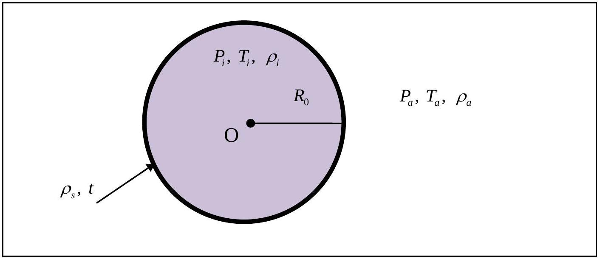
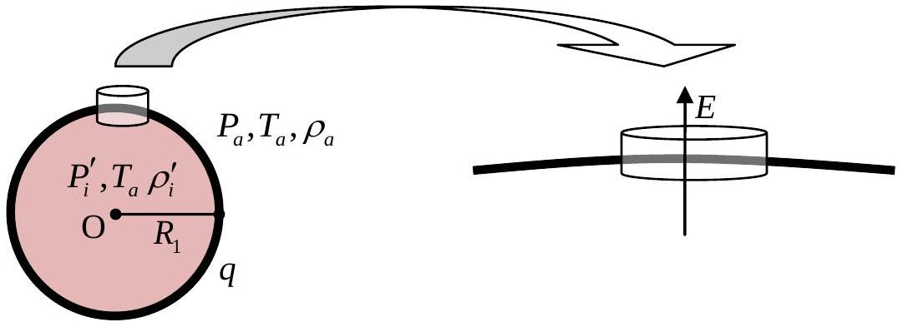
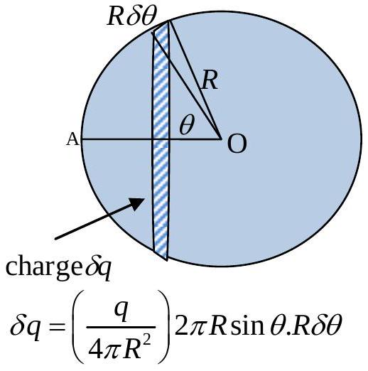

## 2. SOLUTION

2.1. The bubble is surrounded by air.

Cutting the sphere in half and using the projected area to balance the forces give

$$
\begin{align*}
P _ { i } \pi R _ { 0 } ^ { 2 } & = P _ { a } \pi R _ { 0 } ^ { 2 } + 2 \left( 2 \pi R _ { 0 } \gamma \right) \\
P _ { i } & = P _ { a } + \frac { 4 \gamma } { R _ { 0 } } \tag{1}
\end{align*}
$$

The pressure and density are related by the ideal gas law:

$$
\begin{equation*}
P V = n R T \quad \text { or } P = \frac { \rho R T } { M } \text {, where } M = \text { the molar mass of air. } \tag{2}
\end{equation*}
$$

Apply the ideal gas law to the air inside and outside the bubble, we get

$$
\begin{align*}
\rho _ { i } T _ { i } & = P _ { i } \frac { M } { R } \\
\rho _ { a } T _ { a } & = P _ { a } \frac { M } { R } , \\
\frac { \rho _ { i } T _ { i } } { \rho _ { a } T _ { a } } & = \frac { P _ { i } } { P _ { a } } = \left[ 1 + \frac { 4 \gamma } { R _ { 0 } P _ { a } } \right] \tag{3}
\end{align*}
$$

2.2. Using $\gamma = 0.025 \mathrm { Nm } ^ { - 1 } , R _ { 0 } = 1.0 \mathrm {~cm}$ and $P _ { a } = 1.013 \times 10 ^ { 5 } \mathrm { Nm } ^ { - 2 }$, the numerical value of the ratio is
$$
\begin{equation*}
\frac { \rho _ { i } T _ { i } } { \rho _ { a } T _ { a } } = 1 + \frac { 4 \gamma } { R _ { 0 } P _ { a } } = 1 + 0.0001 \tag{4}
\end{equation*}
$$
(The effect of the surface tension is very small.)
2.3. Let $W =$ total weight of the bubble, $F =$ buoyant force due to air around the bubble
$$
\begin{align*}
W & = ( \text { mass of film } + \text { mass of air } ) g \\
& = \left( 4 \pi R _ { 0 } ^ { 2 } \rho _ { s } t + \frac { 4 } { 3 } \pi R _ { 0 } ^ { 3 } \rho _ { i } \right) g  \tag{5}\\
& = 4 \pi R _ { 0 } ^ { 2 } \rho _ { s } t g + \frac { 4 } { 3 } \pi R _ { 0 } ^ { 3 } \frac { \rho _ { a } T _ { a } } { T _ { i } } \left[ 1 + \frac { 4 \gamma } { R _ { 0 } P _ { a } } \right] g
\end{align*}
$$
The buoyant force due to air around the bubble is
$$
\begin{equation*}
B = \frac { 4 } { 3 } \pi R _ { 0 } ^ { 3 } \rho _ { a } g \tag{6}
\end{equation*}
$$
If the bubble floats in still air,
$$
\begin{align*}
B & \geq W \\
\frac { 4 } { 3 } \pi R _ { 0 } ^ { 3 } \rho _ { a } g & \geq 4 \pi R _ { 0 } ^ { 2 } \rho _ { s } t g + \frac { 4 } { 3 } \pi R _ { 0 } ^ { 3 } \frac { \rho _ { a } T _ { a } } { T _ { i } } \left[ 1 + \frac { 4 \gamma } { R _ { 0 } P _ { a } } \right] g \tag{7}
\end{align*}
$$
Rearranging to give
$$
\begin{align*}
T _ { i } & \geq \frac { R _ { 0 } \rho _ { a } T _ { a } } { R _ { 0 } \rho _ { a } - 3 \rho _ { s } t } \left[ 1 + \frac { 4 \gamma } { R _ { 0 } P _ { a } } \right]  \tag{8}\\
& \geq 307.1 \mathrm {~K}
\end{align*}
$$
The air inside must be about 7.1°C warmer.

2.4. Ignore the radius change → Radius remains $R _ { 0 } = 1.0 \mathrm {~cm}$
(The radius actually decreases by $\mathbf { 0 . 8 \% }$ when the temperature decreases from 307.1 K to 300 K. The film itself also becomes slightly thicker.)
The drag force from Stokes' Law is $F = 6 \pi \eta R _ { 0 } u$
If the bubble floats in the updraught,
$$
\begin{align*}
F & \geq W - B \\
6 \pi \eta R _ { 0 } u & \geq \left( 4 \pi R _ { 0 } ^ { 2 } \rho _ { s } t + \frac { 4 } { 3 } \pi R _ { 0 } ^ { 3 } \rho _ { i } \right) g - \frac { 4 } { 3 } \pi R _ { 0 } ^ { 3 } \rho _ { a } g \tag{10}
\end{align*}
$$
When the bubble is in thermal equilibrium $T _ { i } = T _ { a }$.
$$
6 \pi \eta R _ { 0 } u \geq \left( 4 \pi R _ { 0 } ^ { 2 } \rho _ { s } t + \frac { 4 } { 3 } \pi R _ { 0 } ^ { 3 } \rho _ { a } \left[ 1 + \frac { 4 \gamma } { R _ { 0 } P _ { a } } \right] \right) g - \frac { 4 } { 3 } \pi R _ { 0 } ^ { 3 } \rho _ { a } g
$$
Rearranging to give
$$
\begin{equation*}
u \geq \frac { 4 R _ { 0 } \rho _ { s } t g } { 6 \eta } + \frac { \frac { 4 } { 3 } R _ { 0 } ^ { 2 } \rho _ { a } g \left( \frac { 4 \gamma } { R _ { 0 } P _ { a } } \right) } { 6 \eta } \tag{11}
\end{equation*}
$$
2.5. The numerical value is $u \geq 0.36 \mathrm {~m} / \mathrm { s }$.
The $2 ^ { \text {nd } }$ term is about 3 orders of magnitude lower than the $1 ^ { \text {st } }$ term.

## From now on, ignore the surface tension terms.

2.6 When the bubble is electrified, the electrical repulsion will cause the bubble to expand in size and thereby raise the buoyant force.
The force/area is (e-field on the surface × charge/area)
There are two alternatives to calculate the electric field ON the surface of the soap film.

A. From Gauss's Law

Consider a very thin pill box on the soap surface.

$E =$ electric field on the film surface that results from all other parts of the soap film, excluding the surface inside the pill box itself.

$$
\begin{aligned}
E _ { q } & = \text { total field just outside the pill box } = \frac { q } { 4 \pi \varepsilon _ { 0 } R _ { 1 } ^ { 2 } } = \frac { \sigma } { \varepsilon _ { 0 } } \\
& = E + \text { electric field from surface charge } \sigma \\
& = E + E _ { \sigma }
\end{aligned}
$$

Using Gauss's Law on the pill box, we have $E _ { \sigma } = \frac { \sigma } { 2 \varepsilon _ { 0 } }$ perpendicular to the film as a result of symmetry.

$$
\begin{equation*}
\text { Therefore, } E = E _ { q } - E _ { \sigma } = \frac { \sigma } { \varepsilon _ { 0 } } - \frac { \sigma } { 2 \varepsilon _ { 0 } } = \frac { \sigma } { 2 \varepsilon _ { 0 } } = \frac { 1 } { 2 \varepsilon _ { 0 } } \frac { q } { 4 \pi R _ { 1 } ^ { 2 } } \tag{12}
\end{equation*}
$$

B. From direct integration

To find the magnitude of the electrical repulsion we must first find the electric field intensity $E$ at a point on (not outside) the surface itself.

Field at A in the direction $\overrightarrow { \mathrm { OA } }$ is

$$
\begin{align*}
& \delta E _ { A } = \frac { 1 } { 4 \pi \varepsilon _ { 0 } } \frac { \left( q / 4 \pi R _ { 1 } ^ { 2 } \right) 2 \pi R _ { 1 } ^ { 2 } \sin \theta \delta \theta } { \left( 2 R _ { 1 } \sin \frac { \theta } { 2 } \right) ^ { 2 } } \sin \frac { \theta } { 2 } = \frac { \left( q / 4 \pi R _ { 1 } ^ { 2 } \right) } { 2 \varepsilon _ { 0 } } \cos \frac { \theta } { 2 } \delta \left( \frac { \theta } { 2 } \right) \\
& E _ { A } = \frac { \left( q / 4 \pi R _ { 1 } ^ { 2 } \right) } { 2 \varepsilon _ { 0 } } \int _ { \theta = 0 } ^ { \theta = 180 ^ { \circ } } \cos \frac { \theta } { 2 } d \left( \frac { \theta } { 2 } \right) = \frac { \left( q / 4 \pi R _ { 1 } ^ { 2 } \right) } { 2 \varepsilon _ { 0 } } \ldots ( 13 ) \tag{13}
\end{align*}
$$

The repulsive force per unit area of the surface of bubble is

$$
\begin{equation*}
\left( \frac { q } { 4 \pi R _ { 1 } ^ { 2 } } \right) E = \frac { \left( q / 4 \pi R _ { 1 } ^ { 2 } \right) ^ { 2 } } { 2 \varepsilon _ { 0 } } \tag{14}
\end{equation*}
$$

Let $P _ { i } ^ { \prime }$ and $\rho _ { i } ^ { \prime }$ be the new pressure and density when the bubble is electrified.

This electric repulsive force will augment the gaseous pressure $P _ { i } ^ { \prime }$.
$P _ { i } ^ { \prime }$ is related to the original $P _ { i }$ through the gas law.

$$
\begin{align*}
& P _ { i } ^ { \prime } \frac { 4 } { 3 } \pi R _ { 1 } ^ { 3 } = P _ { i } \frac { 4 } { 3 } \pi R _ { 0 } ^ { 3 } \\
& P _ { i } ^ { \prime } = \left( \frac { R _ { 0 } } { R _ { 1 } } \right) ^ { 3 } P _ { i } = \left( \frac { R _ { 0 } } { R _ { 1 } } \right) ^ { 3 } P _ { a } \tag{15}
\end{align*}
$$

In the last equation, the surface tension term has been ignored.
From balancing the forces on the half-sphere projected area, we have (again ignoring the surface tension term)

$$
\begin{gather*}
P _ { i } ^ { \prime } + \frac { \left( q / 4 \pi R _ { 1 } ^ { 2 } \right) ^ { 2 } } { 2 \varepsilon _ { 0 } } = P _ { a }  \tag{16}\\
P _ { a } \left( \frac { R _ { 0 } } { R _ { 1 } } \right) ^ { 3 } + \frac { \left( q / 4 \pi R _ { 1 } ^ { 2 } \right) ^ { 2 } } { 2 \varepsilon _ { 0 } } = P _ { a }
\end{gather*}
$$

Rearranging to get

$$
\begin{equation*}
\left( \frac { R _ { 1 } } { R _ { 0 } } \right) ^ { 4 } - \left( \frac { R _ { 1 } } { R _ { 0 } } \right) - \frac { q ^ { 2 } } { 32 \pi ^ { 2 } \varepsilon _ { 0 } R _ { 0 } ^ { 4 } P _ { a } } = 0 \tag{17}
\end{equation*}
$$

Note that (17) yields $\frac { R _ { 1 } } { R _ { 0 } } = 1$ when $q = 0$, as expected.
2.7. Approximate solution for $R _ { 1 }$ when $\frac { q ^ { 2 } } { 32 \pi ^ { 2 } \varepsilon _ { 0 } R _ { 0 } ^ { 4 } P _ { a } } \ll 1$

$$
\begin{align*}
& \text { Write } R _ { 1 } = R _ { 0 } + \Delta R , \Delta R \ll R _ { 0 } \\
& \text { Therefore, } \frac { R _ { 1 } } { R _ { 0 } } = 1 + \frac { \Delta R } { R _ { 0 } } , \left( \frac { R _ { 1 } } { R _ { 0 } } \right) ^ { 4 } \approx 1 + 4 \frac { \Delta R } { R _ { 0 } } \tag{18}
\end{align*}
$$

Eq. (17) gives:

$$
\begin{align*}
& \Delta R \approx \frac { q ^ { 2 } } { 96 \pi ^ { 2 } \varepsilon _ { 0 } R _ { 0 } ^ { 3 } P _ { a } }  \tag{19}\\
& R _ { 1 } \approx R _ { 0 } + \frac { q ^ { 2 } } { 96 \pi ^ { 2 } \varepsilon _ { 0 } R _ { 0 } ^ { 3 } P _ { a } } \approx R _ { 0 } \left( 1 + \frac { q ^ { 2 } } { 96 \pi ^ { 2 } \varepsilon _ { 0 } R _ { 0 } ^ { 4 } P _ { a } } \right) \tag{20}
\end{align*}
$$

2.8. The bubble will float if

$$
\begin{align*}
B & \geq W \\
\frac { 4 } { 3 } \pi R _ { 1 } ^ { 3 } \rho _ { a } g & \geq 4 \pi R _ { 0 } ^ { 2 } \rho _ { s } t g + \frac { 4 } { 3 } \pi R _ { 0 } ^ { 3 } \rho _ { i } g \tag{21}
\end{align*}
$$

Initially, $T _ { i } = T _ { a } \Rightarrow \rho _ { i } = \rho _ { a }$ for $\gamma \rightarrow 0$ and $R _ { 1 } = R _ { 0 } \left( 1 + \frac { \Delta R } { R _ { 0 } } \right)$

$$
\begin{gather*}
\frac { 4 } { 3 } \pi R _ { 0 } ^ { 3 } \left( 1 + \frac { \Delta R } { R _ { 0 } } \right) ^ { 3 } \rho _ { a } g \geq 4 \pi R _ { 0 } ^ { 2 } \rho _ { s } t g + \frac { 4 } { 3 } \pi R _ { 0 } ^ { 3 } \rho _ { a } g \\
\frac { 4 } { 3 } \pi ( 3 \Delta R ) \rho _ { a } g \geq 4 \pi R _ { 0 } ^ { 2 } \rho _ { s } t g  \tag{22}\\
\frac { 4 } { 3 } \pi \frac { 3 q ^ { 2 } } { 96 \pi ^ { 2 } \varepsilon _ { 0 } R _ { 0 } P _ { a } } \rho _ { a } g \geq 4 \pi R _ { 0 } ^ { 2 } \rho _ { s } t g \\
q ^ { 2 } \geq \frac { 96 \pi ^ { 2 } R _ { 0 } ^ { 3 } \rho _ { s } t \varepsilon _ { 0 } P _ { a } } { \rho _ { a } } \\
q \approx 256 \times 10 ^ { - 9 } \mathrm { C } \approx 256 \mathrm { nC }
\end{gather*}
$$

Note that if the surface tension term is retained, we get

$$
R _ { 1 } \approx \left( 1 + \frac { q ^ { 2 } / 96 \pi ^ { 2 } \varepsilon _ { 0 } R _ { 0 } ^ { 4 } P _ { a } } { \left[ 1 + \frac { 2 } { 3 } \left( \frac { 4 \gamma } { R _ { 0 } P _ { a } } \right) \right] } \right) R _ { 0 }
$$
