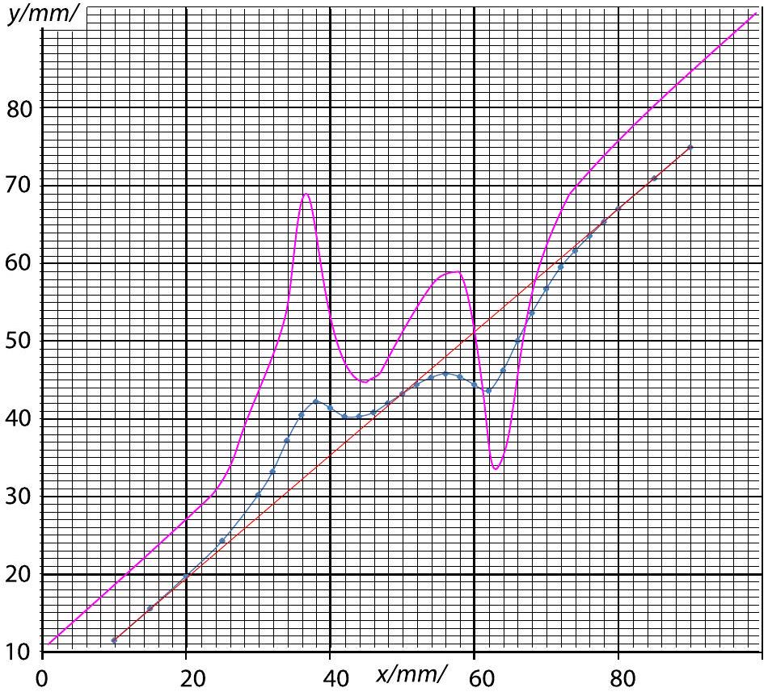
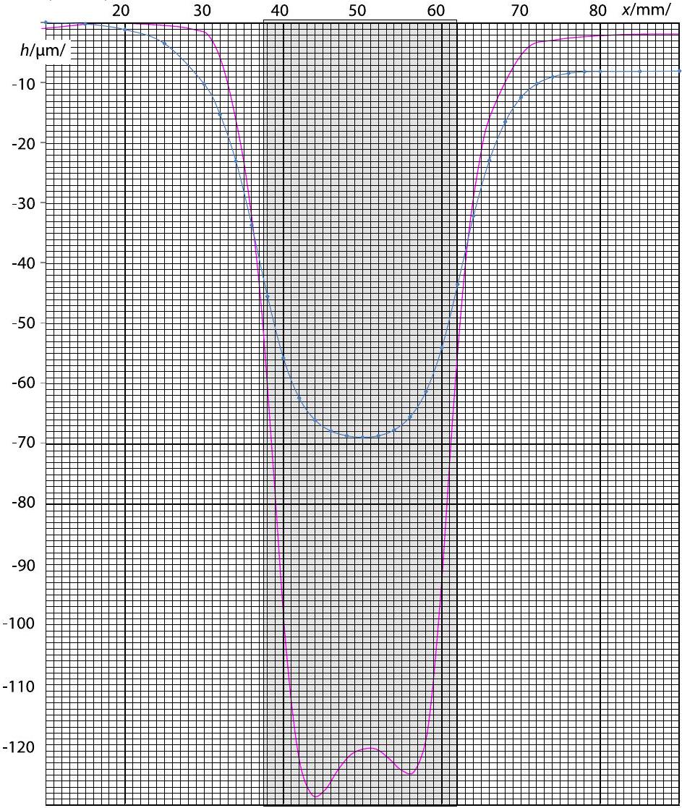
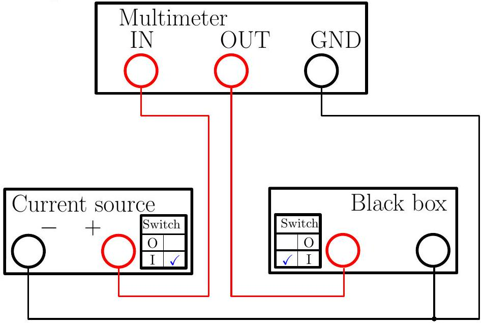
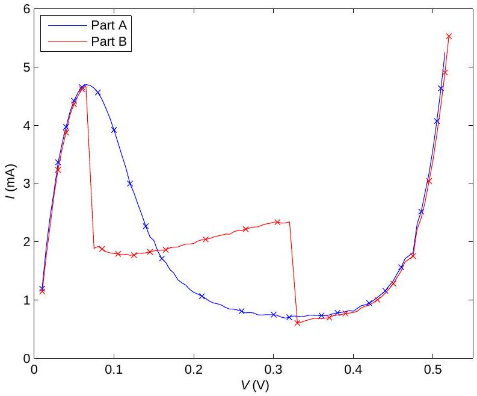

## Problem E1. The magnetic permeability of water (10 points)

Part A. Qualitative shape of the water surface (1 points)
Observing reflections from the water surface (in particular, those of straight lines, such as the edge of a sheet of paper), it is easy to see that the profile has one minimum and has a relatively flat bottom, ie. the correct answer is "Option D" (full marks are given also for Option B). This profile implies that water is pushed away from the magnet, which means $\mu < 1$ (recall that ferromagnets with $\mu > 1$ are pulled).
Part B. Exact shape of the water surface (7 points)
i. (1.6 pts) The height of the spot on the screen $y$ is tabulated below as a function of the horizontal position $x$ of the caliper. Note that the values of $y$ in millimetres can be rounded to integers (this series of measurements aimed as high as possible precision).

| x (mm) | 10 | 15 | 20 | 25 | 30 | 32 | 34 | 36 |
| :--- | :--- | :--- | :--- | :--- | :--- | :--- | :--- | :--- |
| y (mm) | 11.5 | 15.6 | 19.8 | 24.3 | 30.2 | 33.2 | 37.2 | 40.5 |
| x (mm) | 38 | 40 | 42 | 44 | 46 | 48 | 50 | 52 |
| y (mm) | 42.2 | 41.4 | 40.3 | 40.3 | 40.8 | 42 | 43.2 | 44.4 |
| x (mm) | 54 | 56 | 58 | 60 | 62 | 64 | 66 | 68 |
| y (mm) | 45.3 | 45.8 | 45.4 | 44.4 | 43.6 | 46.2 | 50 | 53.6 |
| x (mm) | 70 | 72 | 74 | 76 | 78 | 80 | 85 | 90 |
| y (mm) | 56.7 | 59.5 | 61.6 | 63.5 | 65.3 | 67 | 70.9 | 74.9 |

ii. (0.7 pts)

On this graph, the data of to two different water levels are depicted; blue curve corresponds to a water depth of ca 2 mm (data given in the table above); the violet one - to 1 mm.
iii. (0.5 pts) If the water surface were flat, the dependence of $x$ on $y$ would be linear, and the tangent of the angle $\alpha _ { 0 }$ would be given by $\tan \alpha _ { 0 } = \frac { \Delta y } { \Delta x }$, where $\Delta x$ is a horizontal displacement of the pointer, and $\Delta y$ - the respective displacement of the spot height. For the extreme positions of the pointer, the beam hits the water surface so far from the magnet that there, the surface is essentially unperturbed; connecting the respective points on the graph, we obtain a line corresponding to a flat water surface - the red line. Using these two extreme data points we can also easily calculate the angle $\alpha _ { 0 } = \arctan \frac { 74.9 - 11.5 } { 90 - 10 } \approx 38 ^ { \circ }$.
iv. (1.4 pts) For faster calculations, $y - y _ { 0 } - \left( x - x _ { 0 } \right) \tan \alpha _ { 0 }$ (appearing in the formula given) can be read from the previous graph as the distance between red and blue line; the red line is given by equation $y _ { r } = y _ { 0 } + \left( x - x _ { 0 } \right) \tan \alpha _ { 0 }$. One can also precalculate $\frac { 1 } { 2 } \cos ^ { 2 } \alpha _ { 0 } \approx 0.31$. The calculations lead to the following table (with $z = \tan \beta \cdot 10 ^ { 5 }$; as mentioned above, during the competition, lesser precision with two significant numbers is sufficient).

| x (mm) z | 10 | 15 | 20 | 25 | 30 | 32 | 34 | 36 |
| :--- | :--- | :--- | :--- | :--- | :--- | :--- | :--- | :--- |
|  | 0 | 10 | 27 | 66 | 204 | 303 | 473 | 591 |
| x (mm) z | 38 | 40 | 42 | 44 | 46 | 48 | 50 | 52 |
|  | 597 | 428 | 239 | 128 | 53 | 26 | 0 | -26 |
| x (mm) z | 54 | 56 | 58 | 60 | 62 | 64 | 66 | 68 |
|  | -72 | -145 | -278 | -449 | -606 | -536 | -388 | -254 |
| x (mm) z | 70 | 72 | 74 | 76 | 78 | 80 | 85 | 90 |
|  | -154 | -74 | -40 | -20 | -6 | 2 | -2 | 0 |

## Problem E1

v. (1.6 pts) The water height can be obtained as the integral $h = \int \tan \beta d x$. Thus, we calculate the water height row-byrow, by adding to the height in the previous row the product of the horizontal displacement $x _ { i + 1 } - x _ { i }$ with the average slope $\frac { 1 } { 2 } \left( \tan \beta _ { i + 1 } + \tan \beta _ { i } \right)$.

| $x ( \mathrm {~mm} )$ | 10 | 15 | 20 | 25 | 30 | 32 | 34 | 36 |
| :--- | :--- | :--- | :--- | :--- | :--- | :--- | :--- | :--- |
| $- h ( \mu \mathrm {~m} )$ | 0 | 0 | 1 | 4 | 10 | 15 | 23 | 34 |
| $x ( \mathrm {~mm} )$ | 38 | 40 | 42 | 44 | 46 | 48 | 50 | 52 |
| $- h ( \mu \mathrm {~m} )$ | 46 | 56 | 63 | 66 | 68 | 69 | 69 | 69 |
| $x ( \mathrm {~mm} )$ | 54 | 56 | 58 | 60 | 62 | 64 | 66 | 68 |
| $- h ( \mu \mathrm {~m} )$ | 68 | 66 | 61 | 54 | 44 | 32 | 23 | 17 |
| $x ( \mathrm {~mm} )$ | 70 | 72 | 74 | 76 | 78 | 80 | 85 | 90 |
| $- h ( \mu \mathrm {~m} )$ | 12 | 10 | 9 | 8 | 8 | 8 | 8 | 8 |

Note that the water level height at the end of the table should be also 0 (this corresponds also to an unperturbed region); the non-zero result is explained by the measurement uncertainties. One can improve the result by subtracting from $h$ a linear trend $8 \mu \mathrm {~m} \cdot \frac { x - 10 \mathrm {~mm} } { 80 \mathrm {~mm} }$.

If the water level above the magnet is 1 mm, the water level descends below its unperturbed level at the axis of the magnet by ca $120 \mu \mathrm {~m}$.
vi. (1 pt)

Similarly to the previous figure, blue curve corresponds to a water depth of ca 2 mm, (data given in the table above), and the violet one - to 1 mm.

The position of the magnet can be found by measuring the caliper (find the positions when the laser beam hits the edges of the magnet and determine the distance between these positions - the result is ca 24 mm), and using the symmetry: magnet is placed symmetrically with respect to the surface elevation curve.

## Part C. Magnetic permeability (2 points)

Water surface takes an equipotential shape; for a unit volume of water, the potential energy associated with the magnetic interaction is $\frac { B ^ { 2 } } { 2 \mu _ { 0 } } \left( \mu ^ { - 1 } - 1 \right) \approx B ^ { 2 } \frac { 1 - \mu } { 2 \mu _ { 0 } }$; the potential energy associated with the Earth's gravity is $\rho g h$. At the water surface, the sum of those two needs to be constant; for a point at unperturbed surface, this expression equals to zero, so $B ^ { 2 } \frac { \mu - 1 } { 2 \mu _ { 0 } } + \rho g h = 0$ and hence, $\mu - 1 = 2 \mu _ { 0 } \rho g h / B ^ { 2 }$. Here, $h = 120 \mu \mathrm {~m}$ stands for the depth of the water surface at the axis of the magnet; note that we have compensated the cumulative error as described at the end of the previous task and obtained $h$ as the difference between the depth at the magnet's axis $( 121 \mu \mathrm {~m} )$ and the halfdepth at the right-hand-side of the graph $( 1 \mu \mathrm {~m} )$. Putting in the numbers, we obtain $\mu - 1 = - 1.2 \times 10 ^ { - 5 }$.

Problem E2. Nonlinear Black Box (10 points) Part A. Circuit without inductance (7 points)
It is possible to make all the measurements needed for this problem with a single circuit as shown in the figure. While the current source is switched on, we are charging the capacitor in the black box, until the current $I \left( V _ { \text {max } } \right)$ through the nonlinear element equals to the output current $I _ { 0 }$ of the current source. $V _ { \text {max } } = 540 \pm 40 \mathrm { mVs }$ varies from one experimental setup to another. When the current source is switched off or disconnected, the capacitor will discharge through the nonlinear element.

i. (1 pt) During charging of the capacitor from $V = 0$ to $V = V _ { \text {max } }$ we note that the output of the current source is constant $\left( I _ { 0 } = 6.0 \mathrm {~mA} \right)$ close to the precision of the multimeter. ii. (1.2 pts) Using the definition of differential capacitance, we can calculate the current through the capacitor in the black box from the time derivative of the voltage on the black box.

$$
I _ { c } = \frac { d Q } { d t } = \frac { d Q } { d V } \frac { d V } { d t } = C ( V ) \dot { V }
$$

There are several ways to determine the capacitance used in the black box based on chosen voltage.

- When the voltage on the black box is close to zero, the current through the nonlinear element is also close to zero, because $I ( V = 0 ) = 0$. After switching the current source on, most of the input current $I _ { 0 }$ will at first go through the capacitor.

$$
C _ { 0 } = I _ { 0 } / \dot { V } _ { \uparrow } ( V = 0 )
$$

This can be measured more precisely after first reversing the polarity of the current source and charging the capacitor backwards, because the multimeter does not display derivatives when they change sharply (as in few moments after switching the current source on).
Example measurements taken this way follow.

| $V _ { \uparrow } ( 0 ) ( \mathrm { mV } / \mathrm { s } )$ | 3.51 | 3.32 | 3.55 |
| :--- | :--- | :--- | :--- |
| $C _ { 0 } ( \mathrm {~F} )$ | 1.71 | 1.81 | 1.69 |

$$
C _ { 0 } = 1.74 \mathrm {~F}
$$
- When the voltage on the black box is $V _ { \text {max } }$, the current through the nonlinear element is $I _ { 0 }$. Switching the current source off, we will have the capacitor discharging with the same current.
$$
C _ { 0 } = - I _ { 0 } / \dot { V } _ { \downarrow } \left( V = V _ { \max } \right)
$$
- We can also measure the capacitance for any intermediate voltage as in A-iv.

iii. ( $\mathbf { 2 . 2 }$ pts) If we neglect the nonlinearity of the capacitor, there are (at least) two ways to obtain the current-voltage characteristic of the nonlinear element in the black box.

- Applying Kirchhoff's I law to the charging capacitor,
$$
I ( V ) = I _ { c } - C _ { 0 } \dot { V } _ { \uparrow } ( V ) .
$$
An $I ( V )$ characteristic obtained by charging the capacitor is shown on the following figure.
- Applying Kirchhoff I law to the discharging capacitor,
$$
I ( V ) = - C _ { 0 } \dot { V } _ { \downarrow } ( V ) .
$$

iv. ( $\mathbf { 2 . 6 }$ pts) In order to obtain the differential capacitance, we solve a system of linear equations by eliminating $I ( V )$ :

$$
\left\{ \begin{array} { l }
I _ { 0 } = \dot { V } _ { \uparrow } C ( V ) + I ( V ) \\
I ( V ) = - \dot { V } _ { \downarrow } C ( V ) ;
\end{array} \quad \Longrightarrow C ( V ) = \frac { I _ { 0 } } { \dot { V } _ { \uparrow } - \dot { V } _ { \downarrow } } . \right.
$$

Therefore we need to take measurements during both charging and discharging the capacitor in the black box at the same voltages. A graph of measurement results follows.

## Problem E2

Part B. Circuit with inductance (3 points)
Measuring and plotting the current-voltage characteristic of the nonlinear element in the same way as in part A-iii, we obtain a graph that differs only in the negative differential resistance $\left( I ^ { \prime } ( V ) < 0 \right)$ region, in our case $70 \mathrm { mV } < V < 330 \mathrm { mV }$. This is the region where, when we look at small-signal oscillations, the nonlinear element behaves as a negative-valued Ohmic resistance. After enabling the inductance we have a LC circuit whose oscillations are amplified (instead of being dampened) by the negative differential resistance. Because the resonant frequency $\omega = \sqrt { \frac { 1 } { L C _ { p } } } \sim 30 \mathrm { MHz }$ (with $C _ { p }$ being the capacitance of the nonlinear element) is high, we actually measure the average current through the nonlinear element, while the real current oscillates all over the region of negative differential resistance.
