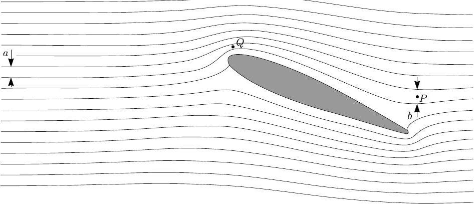

Problem T1. Focus on sketches (13 points)
Part A. Ballistics (4.5 points)
i. (0.8 pts) When the stone is thrown vertically upwards, it can reach the point $x = 0 , z = v _ { 0 } ^ { 2 } / 2 g$ (as it follows from the energy conservation law). Comparing this with the inequality $z \leq z _ { 0 } - k x ^ { 2 }$ we conclude that

$$
\begin{equation*}
z _ { 0 } = v _ { 0 } ^ { 2 } / 2 g . \tag{0.3pts}
\end{equation*}
$$

Let us consider the asymptotics $z \rightarrow - \infty$; the trajectory of the stone is a parabola, and at this limit, the horizontal displacement (for the given $z$ ) is very sensitive with respect to the curvature of the parabola: the flatter the parabola, the larger the displacement. The parabola has the flattest shape when the stone is thrown horizontally, $x = v _ { 0 } t$ and $z = - g t ^ { 2 } / 2$, i.e. its trajectory is given by $z = - g x ^ { 2 } / 2 v _ { 0 } ^ { 2 }$. Now, let us recall that $z \leq z _ { 0 } - k x ^ { 2 }$, i.e. $- g x ^ { 2 } / 2 v _ { 0 } ^ { 2 } \leq z _ { 0 } - k x ^ { 2 } \Rightarrow k \leq g / 2 v _ { 0 } ^ { 2 }$. Note that $k < g / 2 v _ { 0 } ^ { 2 }$ would imply that there is a gap between the parabolic region $z \leq z _ { 0 } - k x ^ { 2 }$ and the given trajectory $z = - g x ^ { 2 } / 2 v _ { 0 } ^ { 2 }$. This trajectory is supposed to be optimal for hitting targets far below $( z \rightarrow - \infty )$, so there should be no such a gap, and hence, we can exclude the option $k < g / 2 v _ { 0 } ^ { 2 }$. This leaves us with

$$
\begin{equation*}
k = g / 2 v _ { 0 } ^ { 2 } . \tag{0.5pts}
\end{equation*}
$$

ii. (1.2 pts) Let us note that the stone trajectory is reversible and due to the energy conservation law, one can equivalently ask, what is the minimal initial speed needed for a stone to be thrown from the topmost point of the spherical building down to the ground without hitting the roof, and what is the respective trajectory. It is easy to understand that the trajectory either needs to touch the roof, or start horizontally from the topmost point with the curvature radius equal to $R$. Indeed, if neither were the case, it would be possible to keep the same throwing angle and just reduce the speed a little bit - the stone would still reach the ground without hitting the roof. Further, if it were tangent at the topmost point, the trajectory wouldn't touch nor intersect the roof anywhere else, because the curvature of the parabola has maximum at its topmost point. Then, it would be possible to keep the initial speed constant, and increase slightly the throwing angle (from horizontal to slightly upwards): the new trajectory wouldn't be neither tangent at the top nor touch the roof at any other point; now we can reduce the initial speed as we argued previously. So we conclude that the optimal trajectory needs to touch the roof somewhere, as shown in Fig.
iii. (2.5 pts) The brute force approach would be writing down the condition that the optimal trajectory intersects with the building at two points and touches at one. This would be described by a fourth order algebraic equation and therefore, it is not realistic to accomplish such a solution within a reasonable time frame.

Note that the interior of the building needs to lie inside the region where the targets can be hit with a stone thrown from the top with initial speed $v _ { \text {min } }$. Indeed, if we can throw over the building, we can hit anything inside by lowering the throwing angle. On the other hand, the boundary of the targetable region needs to touch the building. Indeed, if there were a gap, it would be possible to hit a target just above the point where the optimal trajectory touches the building; the trajectory through that target wouldn't touch the building anywhere, hence we arrive at a contradiction.

So, with $v _ { 0 }$ corresponding to the optimal trajectory, the targetable region touches the building; due to symmetry, overall there are two touching points (for smaller speeds, there would be four, and for larger speeds, there would be none). With the origin at the top of the building, the intersection points are defined by the following system of equations:

$$
x ^ { 2 } + z ^ { 2 } + 2 z R = 0 , \quad z = \frac { v _ { 0 } ^ { 2 } } { 2 g } - \frac { g x ^ { 2 } } { 2 v _ { 0 } ^ { 2 } } .
$$

Upon eliminating $z$, this becomes a biquadratic equation for $x$ :

$$
x ^ { 4 } \left( \frac { g } { 2 v _ { 0 } ^ { 2 } } \right) ^ { 2 } + x ^ { 2 } \left( \frac { 1 } { 2 } - \frac { g R } { v _ { 0 } ^ { 2 } } \right) + \left( \frac { v _ { 0 } ^ { 2 } } { 4 g } + R \right) \frac { v _ { 0 } ^ { 2 } } { g } = 0 .
$$

Hence the speed by which the real-valued solutions disappear can be found from the condition that the discriminant vanishes:

$$
\left( \frac { 1 } { 2 } - \frac { g R } { v _ { 0 } ^ { 2 } } \right) ^ { 2 } = \frac { 1 } { 4 } + \frac { g R } { v _ { 0 } ^ { 2 } } \Longrightarrow \frac { g R } { v _ { 0 } ^ { 2 } } = 2 .
$$

Bearing in mind that due to the energy conservation law, at the ground level the squared speed is increased by $4 g R$. Thus we finally obtain

$$
v _ { \min } = \sqrt { v _ { 0 } ^ { 2 } + 4 g R } = 3 \sqrt { \frac { g R } { 2 } } .
$$

Part B. Mist (4 points)
i. (0.8 pts) In the plane's reference frame, along the channel between two streamlines the volume flux of air (volume flow rate) is constant due to continuity. The volume flux is the product of speed and channel's cross-section area, which, due to the two-dimensional geometry, is proportional to the channel width and can be measured from the Fig. Due to the absence of wind, the unperturbed air's speed in the plane's frame is just $v _ { 0 }$. So, upon measuring the dimensions $a = 10 \mathrm {~mm}$ and $b = 13 \mathrm {~mm}$ (see Fig), we can write $v _ { 0 } a = u b$ and hence $u = v _ { 0 } \frac { a } { b }$. Since at point $P$, the streamlines are horizontal where all the velocities are parallel, the vector addition is reduced to the scalar addition: the air's ground speed $v _ { P } = v _ { 0 } - u = v _ { 0 } \left( 1 - \frac { a } { b } \right) = 23 \mathrm {~m} / \mathrm { s }$. ii. (1.2 pts) Although the dynamic pressure $\frac { 1 } { 2 } \rho v ^ { 2 }$ is relatively small, it gives rise to some adiabatic expansion and compression. In expanding regions the temperature will drop and hence, the pressure of saturated vapours will also drop. If the dew point is reached, a stream of droplets will appear. This process will start in a point where the adiabatic expansion is maximal, i.e. where the hydrostatic pressure is minimal and consequently, as it follows from the Bernoulli's law $p + \frac { 1 } { 2 } \rho v ^ { 2 } =$ const, the dynamic pressure is maximal: in the place where the air speed in

wing's frame is maximal and the streamline distance minimal. Such a point $Q$ is marked in Fig.

iii. (2 pts) First we need to calculate the dew point for the air of given water content (since the relative pressure change will be small, we can ignore the dependence of the dew point on pressure). The water vapour pressure is $p _ { w } = p _ { s a } r = 2.08 \mathrm { kPa }$. The relative change of the pressure of the saturated vapour is small, so we can linearize its temperature dependence:

$$
\frac { p _ { s a } - p _ { w } } { T _ { a } - T } = \frac { p _ { s b } - p _ { s a } } { T _ { b } - T _ { a } } \Longrightarrow T _ { a } - T = \left( T _ { b } - T _ { a } \right) \frac { ( 1 - r ) p _ { s a } } { p _ { s b } - p _ { s a } } ;
$$

numerically $T \approx 291.5 \mathrm {~K}$. Further we need to relate the air speed to the temperature. To this end we need to use the energy conservation law. A convenient ready-to-use form of it is provided by the Bernoulli's law. Applying this law will give a good approximation of the reality, but strictly speaking, it needs to be modified to take into account the compressibility of air and the associated expansion/contraction work. Consider one mole of air, which has the mass $\mu$ and the volume $V = R T / p$. Apparently the process is fast and the air parcels are large, so that heat transfer across the air parcels is negligible. Additionally, the process is subsonic; all together we can conclude that the process is adiabatic. Consider a segment of a tube formed by the streamlines. Let us denote the physical quantities at its one end by index 1, and at the other end - by index 2. Then, while one mole of gas flows into the tube at one end, as much flows out at the other end. The inflow carries in kinetic energy $\frac { 1 } { 2 } \mu v _ { 1 } ^ { 2 }$, and the outflow carries out $\frac { 1 } { 2 } \mu v _ { 2 } ^ { 2 }$. The inflowing gas receives work due to the pushing gas equal to $p _ { 1 } V _ { 1 } = R T _ { 1 }$, the outflowing gas performs work $p _ { 2 } V _ { 2 } = R T _ { 2 }$. Let's define molar heat capacities $C _ { V } = \mu c _ { V }$ and $C _ { p } = \mu c _ { p }$. The inflow carries in heat energy $C _ { V } R T _ { 1 }$, and the outflow carries out $C _ { V } R T _ { 2 }$. All together, the energy balance can be written as $\frac { 1 } { 2 } \mu v ^ { 2 } + C _ { p } T =$ const . From this we can easily express $\Delta \frac { v ^ { 2 } } { 2 } = \frac { 1 } { C } v _ { \text {crit } } ^ { 2 } \left( \frac { a ^ { 2 } } { c ^ { 2 } } - 1 \right) = c _ { p } \Delta T$, where $c$ is the streamline distance at the point $Q$, and further

$$
v _ { \text {crit } } = c \sqrt { \frac { 2 c _ { p } \Delta T } { a ^ { 2 } - c ^ { 2 } } } \approx 23 \mathrm {~m} / \mathrm { s } ,
$$

where we have used $c \approx 4.5 \mathrm {~mm}$ and $\Delta T = 1.5 \mathrm {~K}$. Note that in reality, the required speed is probably somewhat higher, because for a fast condensation, a considerable over-saturation is needed. However, within an order of magnitude, this estimate remains valid.

Part C. Magnetic straws (4.5 points)
i. (0.8 pts) Due to the superconducting walls, the magnetic field lines cannot cross the walls, so the flux is constant along the tube. For a closed contour inside the tube, there should be no circulation of the magnetic field, hence the field lines cannot be curved, and the field needs to be homogeneous. The field lines close from outside the tube, similarly to a solenoid.
ii. (1.2 pts) Let us consider the change of the magnetic energy when the tube is stretched (virtually) by a small amount $\Delta l$. Note that the magnetic flux trough the tube is conserved: any change of flux would imply a non-zero electromotive force $\frac { d \Phi } { d t }$, and for a zero resistivity, an infinite current. So, the induction $B = \frac { \Phi } { \pi r ^ { 2 } }$. The energy density of the magnetic field is $\frac { B ^ { 2 } } { 2 \mu _ { 0 } }$. Thus, the change of the magnetic energy is calculated as

$$
\Delta W = \frac { B ^ { 2 } } { 2 \mu _ { 0 } } \pi r ^ { 2 } \Delta l = \frac { \Phi ^ { 2 } } { 2 \mu _ { 0 } \pi r ^ { 2 } } \Delta l .
$$

This energy increase is achieved owing to the work done by the stretching force, $\Delta W = T \Delta l$. Hence, the force

$$
T = \frac { \Phi ^ { 2 } } { 2 \mu _ { 0 } \pi r ^ { 2 } } .
$$

iii. (2.5 pts) Let us analyse, what would be the change of the magnetic energy when one of the straws is displaced to a small distance. The magnetic field inside the tubes will remain constant due to the conservation of magnetic flux, but outside, the magnetic field will be changed. The magnetic field outside the straws is defined by the following condition: there is no circulation of $\vec { B }$ (because there are no currents outside the straws); there are no sources of the field lines, other than the endpoints of the straws; each of the endpoints of the straws is a source of streamlines with a fixed magnetic flux $\pm \Phi$. These are exactly the same condition as those which define the electric field of four charges $\pm Q$. We know that if the distance between charges is much larger than the geometrical size of a charge, the charges can be considered as point charges (the electric field near the charges remains almost constant, so that the respective contribution to the change of the overall electric field energy is negligible). Therefore we can conclude that the endpoints of the straws can be considered as magnetic point charges. In order to calculate the force between two magnetic charges (magnetic monopoles), we need to establish the correspondence between magnetic and electric quantities.

For two electric charges $Q$ separated by a distance $a$, the force is $F = \frac { 1 } { 4 \pi \varepsilon _ { 0 } } \frac { Q ^ { 2 } } { a ^ { 2 } }$, and at the position of one charge, the electric field of the other charge has energy density $w = \frac { 1 } { 32 \pi ^ { 2 } \varepsilon _ { 0 } } \frac { Q ^ { 2 } } { a ^ { 4 } }$; hence we can write $F = 8 \pi w a ^ { 2 }$. This is a universal expression for the force (for the case when the field lines have the same shape as in the case of two opposite and equal by modulus electric charges) relying only on the energy density, and not related to the nature of the field; so we can apply it to the magnetic

## Problem 1

field. Indeed, the force can be calculated as a derivative of the full field energy with respect to a virtual displacement of a field line source (electric or magnetic charge); if the energy densities of two fields are respectively equal at one point, they are equal everywhere, and so are equal the full field energies. As it follows from the Gauss law, for a point source of a fixed magnetic flux $\Phi$ at a distance $a$, the induction $B = \frac { 1 } { 4 \pi } \frac { \Phi } { a ^ { 2 } }$. So, the energy density $w = \frac { B ^ { 2 } } { 2 \mu _ { 0 } } = \frac { 1 } { 32 \pi ^ { 2 } \mu _ { 0 } } \frac { \Phi ^ { 2 } } { a ^ { 4 } }$, hence

$$
F = \frac { 1 } { 4 \pi \mu _ { 0 } } \frac { \Phi ^ { 2 } } { a ^ { 2 } } .
$$

For the two straws, we have four magnetic charges. The longitudinal (along a straw axis) forces cancel out (the diagonally positioned pairs of same-sign-charges push in opposite directions). The normal force is a superposition of the attraction due to the two pairs of opposite charges, $F _ { 1 } = \frac { 1 } { 4 \pi \mu _ { 0 } } \frac { \Phi ^ { 2 } } { l ^ { 2 } }$, and the repulsive forces of diagonal pairs, $F _ { 2 } = \frac { \sqrt { 2 } } { 8 \pi \mu _ { 0 } } \frac { \Phi ^ { 2 } } { 2 l ^ { 2 } }$. The net attractive force will be

$$
F = 2 \left( F _ { 1 } - F _ { 2 } \right) = \frac { 4 - \sqrt { 2 } } { 8 \pi \mu _ { 0 } } \frac { \Phi ^ { 2 } } { l ^ { 2 } } .
$$

## Problem 2

Problem T2. Kelvin water dropper (8 points)
Part A. Single pipe (4 points)
i. (1.2 pts) Let us write the force balance for the droplet. Since $d \ll r$, we can neglect the force $\frac { \pi } { 4 } \Delta p d ^ { 2 }$ due to the excess pressure $\Delta p$ inside the tube. So, the gravity force $\frac { 4 } { 3 } \pi r _ { \max } ^ { 3 } \rho g$ is balanced by the capillary force. When the droplet separates from the tube, the water surface forms in the vicinity of the nozzle a "neck", which has vertical tangent. In the horizontal cross-section of that "neck", the capillary force is vertical and can be calculated as $\pi \sigma d$. So,

$$
r _ { \max } = \sqrt [ 3 ] { \frac { 3 \sigma d } { 4 \rho g } } .
$$

ii. (1.2 pts) Since $d \ll r$, we can neglect the change of the droplet's capacitance due to the tube. On the one hand, the droplet's potential is $\varphi$; on the other hand, it is $\frac { 1 } { 4 \pi \varepsilon _ { 0 } } \frac { Q } { r }$. So,

$$
Q = 4 \pi \varepsilon _ { 0 } \varphi r .
$$

iii. (1.6 pts) Excess pressure inside the droplet is caused by the capillary pressure $2 \sigma / r$ (increases the inside pressure), and by the electrostatic pressure $\frac { 1 } { 2 } \varepsilon _ { 0 } E ^ { 2 } = \frac { 1 } { 2 } \varepsilon _ { 0 } \varphi ^ { 2 } / r ^ { 2 }$ (decreases the pressure). So, the sign of the excess pressure will change, if $\frac { 1 } { 2 } \varepsilon _ { 0 } \varphi _ { \text {max } } ^ { 2 } / r ^ { 2 } = 2 \sigma / r$, hence

$$
\varphi _ { \max } = 2 \sqrt { \sigma r / \varepsilon _ { 0 } } .
$$

The expression for the electrostatic pressure used above can be derived as follows. The electrostatic force acting on a surface charge of density $\sigma$ and surface area $S$ is given by $F = \sigma S \cdot \bar { E }$, where $\bar { E }$ is the field at the site without the field created by the surface charge element itself. Note that this force is perpendicular to the surface, so $F / S$ can be interpreted as a pressure. The surface charge gives rise to a field drop on the surface equal to $\Delta E = \sigma / \varepsilon _ { 0 }$ (which follows from the Gauss law); inside the droplet, there is no field due to the conductivity of the droplet: $\bar { E } - \frac { 1 } { 2 } \Delta E = 0$; outside the droplet, there is field $E = \bar { E } + \frac { 1 } { 2 } \Delta E$, therefore $\bar { E } = \frac { 1 } { 2 } E = \frac { 1 } { 2 } \Delta E$. Bringing everything together, we obtain the expression used above.

Note that alternatively, this expression can be derived by considering a virtual displacement of a capacitor's surface and comparing the pressure work $p \Delta V$ with the change of the electrostatic field energy $\frac { 1 } { 2 } \varepsilon _ { 0 } E ^ { 2 } \Delta V$.

Finally, the answer to the question can be also derived from the requirement that the mechanical work $d A$ done for an infinitesimal droplet inflation needs to be zero. From the energy conservation law, $d W + d W _ { \text {el } } = \sigma d \left( 4 \pi r ^ { 2 } \right) + \frac { 1 } { 2 } \varphi _ { \text {max } } ^ { 2 } d C _ { d }$, where the droplet's capacitance $C _ { d } = 4 \pi \varepsilon _ { 0 } r$; the electrical work $d W _ { \text {el } } = \varphi _ { \text {max } } d q = 4 \pi \varepsilon _ { 0 } \varphi _ { \text {max } } ^ { 2 } d r$. Putting $d W = 0$ we obtain an equation for $\varphi _ { \text {max } }$, which recovers the earlier result.
Part B. Two pipes (4 points)
i. (1.2 pts) This is basically the same as Part A-ii, except that the surroundings' potential is that of the surrounding electrode, $- U / 2$ (where $U = q / C$ is the capacitor's voltage) and droplet has the ground potential (0). As it is not defined which electrode is the positive one, opposite sign of the potential may be chosen, if done consistently. Note that since the cylindrical electrode is long, it shields effectively the environment's (ground, wall, etc) potential. So, relative to its surroundings, the droplet's potential is $U / 2$. Using the result of Part A we obtain

$$
Q = 2 \pi \varepsilon _ { 0 } U r _ { \max } = 2 \pi \varepsilon _ { 0 } q r _ { \max } / C .
$$

ii. (1.5 pts) The sign of the droplet's charge is the same as that of the capacitor's opposite plate (which is connected to the farther electrode). So, when the droplet falls into the bowl, it will increase the capacitor's charge by $Q$ :

$$
d q = 2 \pi \varepsilon _ { 0 } U r _ { \max } d N = 2 \pi \varepsilon _ { 0 } r _ { \max } n d t \frac { q } { C } ,
$$

where $d N = n d t$ is the number of droplets which fall during the time $d t$ This is a simple linear differential equation which is solved easily to obtain

$$
q = q _ { 0 } e ^ { \gamma t } , \quad \gamma = \frac { 2 \pi \varepsilon _ { 0 } r _ { \max } n } { C } = \frac { \pi \varepsilon _ { 0 } n } { C } \sqrt [ 3 ] { \frac { 6 \sigma d } { \rho g } } .
$$

iii. (1.3 pts) The droplets can reach the bowls if their mechanical energy $m g H$ (where $m$ is the droplet's mass) is large enough to overcome the electrostatic push: The droplet starts at the point where the electric potential is 0, which is the sum of the potential $U / 2$, due to the electrode, and of its self-generated potential $- U / 2$. Its motion is not affected by the self-generated field, so it needs to fall from the potential $U / 2$ down to the potential $- U / 2$, resulting in the change of the electrostatic energy equal to $U Q \leq m g H$, where $Q = 2 \pi \varepsilon _ { 0 } U r _ { \max }$ (see above). So,

$$
\begin{gathered}
U _ { \max } = \frac { m g H } { 2 \pi \varepsilon _ { 0 } U _ { \max } r _ { \max } } , \\
\therefore U _ { \max } = \sqrt { \frac { H \sigma d } { 2 \varepsilon _ { 0 } r _ { \max } } } = \sqrt [ 6 ] { \frac { H ^ { 3 } g \sigma ^ { 2 } \rho d ^ { 2 } } { 6 \varepsilon _ { 0 } ^ { 3 } } } .
\end{gathered}
$$

Problem T3. Protostar formation (9 points) i. (0.8 pts)

$$
\begin{aligned}
& T = \text { const } \Longrightarrow p V = \text { const } \\
& V \propto r ^ { 3 } \\
& \therefore p \propto r ^ { - 3 } \Longrightarrow \frac { p \left( r _ { 1 } \right) } { p \left( r _ { 0 } \right) } = 2 ^ { 3 } = 8 .
\end{aligned}
$$

ii. (1 pt) During the period considered the pressure is negligible. Therefore the gas is in free fall. By Gauss' theorem and symmetry, the gravitational field at any point in the ball is equivalent to the one generated when all the mass closer to the center is compressed into the center. Moreover, while the ball has not yet shrunk much, the field strength on its surface does not change much either. The acceleration of the outermost layer stays approximately constant. Thus,

$$
t \approx \sqrt { \frac { 2 \left( r _ { 0 } - r _ { 2 } \right) } { g } }
$$

where

$$
\begin{aligned}
g & \approx \frac { G m } { r _ { 0 } ^ { 2 } } , \\
\therefore t & \approx \sqrt { \frac { 2 r _ { 0 } ^ { 2 } \left( r _ { 0 } - r _ { 2 } \right) } { G m } } = \sqrt { \frac { 0.1 r _ { 0 } ^ { 3 } } { G m } } .
\end{aligned}
$$

iii. (2.5 pts) Gravitationally the outer layer of the ball is influenced by the rest just as the rest were compressed into a point mass. Therefore we have Keplerian motion: the fall of any part of the outer layer consists in a halfperiod of an ultraelliptical orbit. The ellipse is degenerate into a line; its foci are at the ends of the line; one focus is at the center of the ball (by Kepler's $1 ^ { \text {st } }$ law) and the other one is at $r _ { 0 }$, see figure (instead of a degenerate ellipse, a strongly elliptical ellipse is depicted). The period of the orbit is determined by the longer semiaxis of the ellipse (by Kepler's $3 ^ { \text {rd } }$ law). The longer semiaxis is $r _ { 0 } / 2$ and we are interested in half a period. Thus, the answer is equal to the halfperiod of a circular orbit of radius $r _ { 0 } / 2$ :

$$
\left( \frac { 2 \pi } { 2 t _ { r \rightarrow 0 } } \right) ^ { 2 } \frac { r _ { 0 } } { 2 } = \frac { G m } { \left( r _ { 0 } / 2 \right) ^ { 2 } } \Longrightarrow t _ { r \rightarrow 0 } = \pi \sqrt { \frac { r _ { 0 } ^ { 3 } } { 8 G m } } .
$$

centre of the cloud initial position of a certain parcel strongly elliptical orbit of the gas parcel of gas
area covered by the radius vector
Alternatively, one may write the energy conservation law $\frac { \dot { r } ^ { 2 } } { 2 } - \frac { G m } { r } = E$ (that in turn is obtainable from Newton's II law $\ddot { r } = - \frac { G m } { r ^ { 2 } }$ ) with $E = - \frac { G m } { r _ { 0 } }$, separate the variables $\left( \frac { d r } { d t } = - \sqrt { 2 E + \frac { 2 G m } { r } } \right)$ and write the integral $t = - \int \frac { d r } { \sqrt { 2 E + \frac { 2 G m } { r } } }$. This integral is probably not calculable during the limitted time given during the Olympiad, but a possible approach can be sketched as follows. Substituting $\sqrt { 2 E + \frac { 2 G m } { r } } = \xi$ and $\sqrt { 2 E } = v$, one gets

$$
\begin{aligned}
\frac { t _ { \infty } } { 4 G m } & = \int _ { 0 } ^ { \infty } \frac { d \xi } { \left( v ^ { 2 } - \xi ^ { 2 } \right) ^ { 2 } } \\
& = \frac { 1 } { 4 v ^ { 3 } } \int _ { 0 } ^ { \infty } \left[ \frac { v } { ( v - \xi ) ^ { 2 } } + \frac { v } { ( v + \xi ) ^ { 2 } } + \frac { 1 } { v - \xi } + \frac { 1 } { v + \xi } \right] d \xi
\end{aligned}
$$

Here (after shifting the variable) one can use $\int \frac { d \xi } { \xi } = \ln \xi$ and $\int \frac { d \xi } { \xi ^ { 2 } } = - \frac { 1 } { \xi }$, finally getting the same answer as by Kepler's laws.
iv. (1.7 pts) By Clapeyron-Mendeleyev law,

$$
p = \frac { m R T _ { 0 } } { \mu V } .
$$

Work done by gravity to compress the ball is

$$
W = - \int p d V = - \frac { m R T _ { 0 } } { \mu } \int _ { \frac { 4 } { 3 } \pi r _ { 0 } ^ { 3 } } ^ { \frac { 4 } { 3 } \pi r _ { 3 } ^ { 3 } } \frac { d V } { V } = \frac { 3 m R T _ { 0 } } { \mu } \ln \frac { r _ { 0 } } { r _ { 3 } } .
$$

The temperature stays constant, so the internal energy does not change; hence, according to the $1 ^ { \text {st } }$ law of thermodynamics, the compression work $W$ is the heat radiated.
v. (1 pt) The collapse continues adiabatically.

$$
\begin{aligned}
& p V ^ { \gamma } = \mathrm { const } \Longrightarrow T V ^ { \gamma - 1 } = \mathrm { const } . \\
& \therefore T \propto V ^ { 1 - \gamma } \propto r ^ { 3 - 3 \gamma } \\
& \therefore T = T _ { 0 } \left( \frac { r _ { 3 } } { r } \right) ^ { 3 \gamma - 3 } .
\end{aligned}
$$

vi. (2 pts) During the collapse, the gravitational energy is converted into heat. Since $r _ { 3 } \gg r _ { 4 }$, The released gravitational energy can be estimated as $\Delta \Pi = - G m ^ { 2 } \left( r _ { 4 } ^ { - 1 } - r _ { 3 } ^ { - 1 } \right) \approx - G m ^ { 2 } / r _ { 4 }$ (exact calculation by integration adds a prefactor $\frac { 3 } { 5 }$ ); the terminal heat energy is estimated as $\Delta Q = c _ { V } \frac { m } { \mu } \left( T _ { 4 } - T _ { 0 } \right) \approx$ $c _ { V } \frac { m } { \mu } T _ { 4 }$ (the approximation $T _ { 4 } \gg T _ { 0 }$ follows from the result of the previous question, when combined with $r _ { 3 } \gg r _ { 4 }$ ). So, $\Delta Q = \frac { R } { \gamma - 1 } \frac { m } { \mu } T _ { 4 } \approx \frac { m } { \mu } R T _ { 4 }$. For the temperature $T _ { 4 }$, we can use the result of the previous question, $T _ { 4 } = T _ { 0 } \left( \frac { r _ { 3 } } { r _ { 4 } } \right) ^ { 3 \gamma - 3 }$. Since initial full energy was approximately zero, $\Delta Q + \Delta \Pi \approx 0$, we obtain

$$
\frac { G m ^ { 2 } } { r _ { 4 } } \approx \frac { m } { \mu } R T _ { 0 } \left( \frac { r _ { 3 } } { r _ { 4 } } \right) ^ { 3 \gamma - 3 } \Longrightarrow r _ { 4 } \approx r _ { 3 } \left( \frac { R T _ { 0 } r _ { 3 } } { \mu m G } \right) ^ { \frac { 1 } { 3 \gamma - 4 } } .
$$

Therefore,

$$
T _ { 4 } \approx T _ { 0 } \left( \frac { R T _ { 0 } r _ { 3 } } { \mu m G } \right) ^ { \frac { 3 \gamma - 3 } { 4 - 3 \gamma } } .
$$

Alternatively, one can obtain the result by approximately equating the hydrostatic pressure $\rho r _ { 4 } \frac { G m } { r _ { 4 } ^ { 2 } }$ to the gas pressure $p _ { 4 } = \frac { \rho } { \mu } R T _ { 4 }$; the result will be exactly the same as given above.

## ANSWER SHEET

## Problem 1

Problem T1. Focus on sketches (13 points)
Part A. Ballistics (4.5 points)

i. (0.8 pts)
$$
z _ { 0 } = v _ { 0 } ^ { 2 } / 2 g
$$
$$
k = g / 2 v _ { 0 } ^ { 2 }
$$
ii. (1.2 pts) The sketch of the trajectory:
iii. (2.5 pts)
$$
v _ { \min } = 3 \sqrt { \frac { g R } { 2 } }
$$

## ANSWER SHEET

## Problem 1

Part B. Air flow around a wing (4 points)

i. (0.8 pts)
$$
v _ { P } = 23 \mathrm {~m} / \mathrm { s }
$$
ii. (1.2 pts) Mark on this fig. the point Q. Use it also for taking measurements (questions i and iii).

Formulae motivating
$$
\begin{aligned}
& a v = \mathrm { const } \\
& p + \frac { 1 } { 2 } \rho v ^ { 2 } = \mathrm { const } \\
& p ^ { 1 - \gamma } T ^ { \gamma } = \mathrm { const }
\end{aligned}
$$
iii. (2.0 pts)
Formula: $v _ { \text {crit } } = c \sqrt { \frac { 2 c _ { p } \Delta T } { a ^ { 2 } - c ^ { 2 } } }$
Numerical: $v _ { \text {crit } } \approx 23 \mathrm {~m} / \mathrm { s }$

i. (0.8 pts)
Sketch here five magnetic field lines.

ii. (1.2 pts)

$$
T = \frac { \Phi ^ { 2 } } { 2 \mu _ { 0 } \pi r ^ { 2 } }
$$

iii. (2.5 pts)

$$
F = \frac { 4 - \sqrt { 2 } } { 8 \pi \mu _ { 0 } } \frac { \Phi ^ { 2 } } { l ^ { 2 } }
$$

## ANSWER SHEET

## Problem 2

Problem T2. Kelvin water dropper (8 points)
Part A. Single pipe (4 points)

i. (1.2 pts)
$$
r _ { \max } = \sqrt [ 3 ] { \frac { 3 \sigma d } { 4 \rho g } }
$$
ii. (1.2 pts)
$$
Q = 4 \pi \varepsilon _ { 0 } \varphi r
$$
iii. (1.6 pts)
$$
\varphi _ { \max } = 2 \sqrt { \sigma r / \varepsilon _ { 0 } }
$$

Part B. Two pipes (4 points)

i. (1.2 pts)
$$
Q _ { 0 } = 2 \pi \varepsilon _ { 0 } q r _ { \max } / C
$$
ii. (1.5 pts)
$$
q ( t ) = q _ { 0 } e ^ { \gamma t } , \quad \gamma = \frac { \pi \varepsilon _ { 0 } n } { C } \sqrt [ 3 ] { \frac { 6 \sigma d } { \rho g } } .
$$
iii. (1.3 pts)
$$
U _ { \max } = \sqrt [ 6 ] { \frac { H ^ { 3 } g \sigma ^ { 2 } \rho d ^ { 2 } } { 6 \varepsilon _ { 0 } ^ { 3 } } }
$$

## ANSWER SHEET

Problem 3
Problem T3. Protostar formation (9 points)

i. (0.8 pts)
$$
n = 8
$$
ii. (1 pt)
$$
t _ { 2 } \approx \sqrt { \frac { 0.1 r _ { 0 } ^ { 3 } } { G m } }
$$
iii. (2.5 pts)
$$
t _ { r \rightarrow 0 } = \pi \sqrt { \frac { r _ { 0 } ^ { 3 } } { 8 G m } }
$$
iv. (1.7 pts)
$$
Q = \frac { 3 m R T _ { 0 } } { \mu } \ln \frac { r _ { 0 } } { r _ { 3 } }
$$
v. (1 pt)
$$
T ( r ) = T _ { 0 } \left( \frac { r _ { 3 } } { r } \right) ^ { 3 \gamma - 3 }
$$
vi. (2 pts)
$$
r _ { 4 } \approx r _ { 3 } \left( \frac { R T _ { 0 } r _ { 3 } } { \mu m G } \right) ^ { \frac { 1 } { 3 \gamma - 4 } }
$$
$$
T _ { 4 } \approx T _ { 0 } \left( \frac { R T _ { 0 } r _ { 3 } } { \mu m G } \right) ^ { \frac { 3 \gamma - 3 } { 4 - 3 \gamma } }
$$
