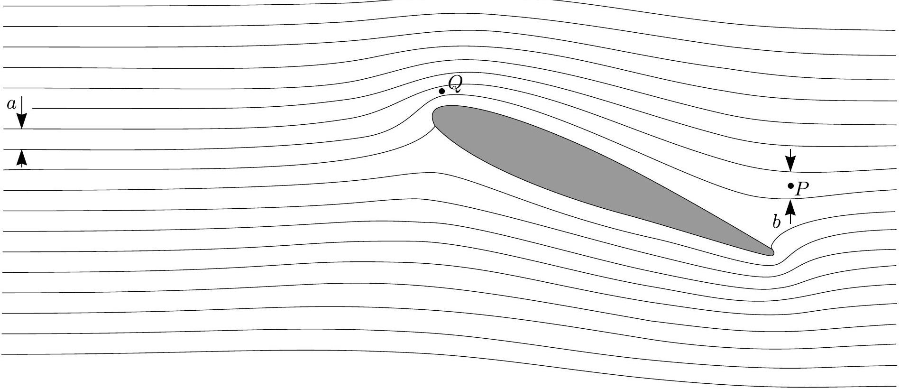
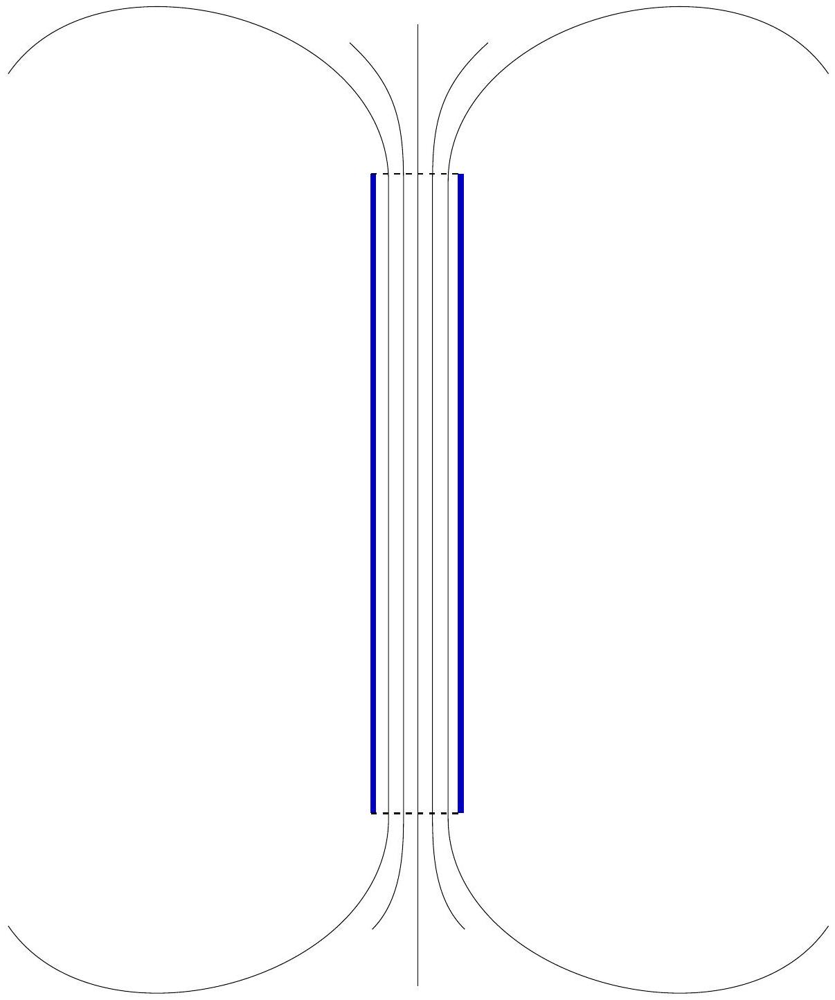

## Problem 2

Problem T2. Kelvin water dropper (8 points)
Part A. Single pipe (4 points)
i. (1.2 pts) Let us write the force balance for the droplet. Since $d \ll r$, we can neglect the force $\frac { \pi } { 4 } \Delta p d ^ { 2 }$ due to the excess pressure $\Delta p$ inside the tube. So, the gravity force $\frac { 4 } { 3 } \pi r _ { \max } ^ { 3 } \rho g$ is balanced by the capillary force. When the droplet separates from the tube, the water surface forms in the vicinity of the nozzle a "neck", which has vertical tangent. In the horizontal cross-section of that "neck", the capillary force is vertical and can be calculated as $\pi \sigma d$. So,

$$
r _ { \max } = \sqrt [ 3 ] { \frac { 3 \sigma d } { 4 \rho g } } .
$$

ii. (1.2 pts) Since $d \ll r$, we can neglect the change of the droplet's capacitance due to the tube. On the one hand, the droplet's potential is $\varphi$; on the other hand, it is $\frac { 1 } { 4 \pi \varepsilon _ { 0 } } \frac { Q } { r }$. So,

$$
Q = 4 \pi \varepsilon _ { 0 } \varphi r .
$$

iii. (1.6 pts) Excess pressure inside the droplet is caused by the capillary pressure $2 \sigma / r$ (increases the inside pressure), and by the electrostatic pressure $\frac { 1 } { 2 } \varepsilon _ { 0 } E ^ { 2 } = \frac { 1 } { 2 } \varepsilon _ { 0 } \varphi ^ { 2 } / r ^ { 2 }$ (decreases the pressure). So, the sign of the excess pressure will change, if $\frac { 1 } { 2 } \varepsilon _ { 0 } \varphi _ { \text {max } } ^ { 2 } / r ^ { 2 } = 2 \sigma / r$, hence

$$
\varphi _ { \max } = 2 \sqrt { \sigma r / \varepsilon _ { 0 } } .
$$

The expression for the electrostatic pressure used above can be derived as follows. The electrostatic force acting on a surface charge of density $\sigma$ and surface area $S$ is given by $F = \sigma S \cdot \bar { E }$, where $\bar { E }$ is the field at the site without the field created by the surface charge element itself. Note that this force is perpendicular to the surface, so $F / S$ can be interpreted as a pressure. The surface charge gives rise to a field drop on the surface equal to $\Delta E = \sigma / \varepsilon _ { 0 }$ (which follows from the Gauss law); inside the droplet, there is no field due to the conductivity of the droplet: $\bar { E } - \frac { 1 } { 2 } \Delta E = 0$; outside the droplet, there is field $E = \bar { E } + \frac { 1 } { 2 } \Delta E$, therefore $\bar { E } = \frac { 1 } { 2 } E = \frac { 1 } { 2 } \Delta E$. Bringing everything together, we obtain the expression used above.

Note that alternatively, this expression can be derived by considering a virtual displacement of a capacitor's surface and comparing the pressure work $p \Delta V$ with the change of the electrostatic field energy $\frac { 1 } { 2 } \varepsilon _ { 0 } E ^ { 2 } \Delta V$.

Finally, the answer to the question can be also derived from the requirement that the mechanical work $d A$ done for an infinitesimal droplet inflation needs to be zero. From the energy conservation law, $d W + d W _ { \text {el } } = \sigma d \left( 4 \pi r ^ { 2 } \right) + \frac { 1 } { 2 } \varphi _ { \text {max } } ^ { 2 } d C _ { d }$, where the droplet's capacitance $C _ { d } = 4 \pi \varepsilon _ { 0 } r$; the electrical work $d W _ { \text {el } } = \varphi _ { \text {max } } d q = 4 \pi \varepsilon _ { 0 } \varphi _ { \text {max } } ^ { 2 } d r$. Putting $d W = 0$ we obtain an equation for $\varphi _ { \text {max } }$, which recovers the earlier result.
Part B. Two pipes (4 points)
i. (1.2 pts) This is basically the same as Part A-ii, except that the surroundings' potential is that of the surrounding electrode, $- U / 2$ (where $U = q / C$ is the capacitor's voltage) and droplet has the ground potential (0). As it is not defined which electrode is the positive one, opposite sign of the potential may be chosen, if done consistently. Note that since the cylindrical electrode is long, it shields effectively the environment's (ground, wall, etc) potential. So, relative to its surroundings, the droplet's potential is $U / 2$. Using the result of Part A we obtain

$$
Q = 2 \pi \varepsilon _ { 0 } U r _ { \max } = 2 \pi \varepsilon _ { 0 } q r _ { \max } / C .
$$

ii. (1.5 pts) The sign of the droplet's charge is the same as that of the capacitor's opposite plate (which is connected to the farther electrode). So, when the droplet falls into the bowl, it will increase the capacitor's charge by $Q$ :

$$
d q = 2 \pi \varepsilon _ { 0 } U r _ { \max } d N = 2 \pi \varepsilon _ { 0 } r _ { \max } n d t \frac { q } { C } ,
$$

where $d N = n d t$ is the number of droplets which fall during the time $d t$ This is a simple linear differential equation which is solved easily to obtain

$$
q = q _ { 0 } e ^ { \gamma t } , \quad \gamma = \frac { 2 \pi \varepsilon _ { 0 } r _ { \max } n } { C } = \frac { \pi \varepsilon _ { 0 } n } { C } \sqrt [ 3 ] { \frac { 6 \sigma d } { \rho g } } .
$$

iii. (1.3 pts) The droplets can reach the bowls if their mechanical energy $m g H$ (where $m$ is the droplet's mass) is large enough to overcome the electrostatic push: The droplet starts at the point where the electric potential is 0, which is the sum of the potential $U / 2$, due to the electrode, and of its self-generated potential $- U / 2$. Its motion is not affected by the self-generated field, so it needs to fall from the potential $U / 2$ down to the potential $- U / 2$, resulting in the change of the electrostatic energy equal to $U Q \leq m g H$, where $Q = 2 \pi \varepsilon _ { 0 } U r _ { \max }$ (see above). So,

$$
\begin{gathered}
U _ { \max } = \frac { m g H } { 2 \pi \varepsilon _ { 0 } U _ { \max } r _ { \max } } , \\
\therefore U _ { \max } = \sqrt { \frac { H \sigma d } { 2 \varepsilon _ { 0 } r _ { \max } } } = \sqrt [ 6 ] { \frac { H ^ { 3 } g \sigma ^ { 2 } \rho d ^ { 2 } } { 6 \varepsilon _ { 0 } ^ { 3 } } } .
\end{gathered}
$$

Problem T3. Protostar formation (9 points) i. (0.8 pts)

$$
\begin{aligned}
& T = \text { const } \Longrightarrow p V = \text { const } \\
& V \propto r ^ { 3 } \\
& \therefore p \propto r ^ { - 3 } \Longrightarrow \frac { p \left( r _ { 1 } \right) } { p \left( r _ { 0 } \right) } = 2 ^ { 3 } = 8 .
\end{aligned}
$$

ii. (1 pt) During the period considered the pressure is negligible. Therefore the gas is in free fall. By Gauss' theorem and symmetry, the gravitational field at any point in the ball is equivalent to the one generated when all the mass closer to the center is compressed into the center. Moreover, while the ball has not yet shrunk much, the field strength on its surface does not change much either. The acceleration of the outermost layer stays approximately constant. Thus,

$$
t \approx \sqrt { \frac { 2 \left( r _ { 0 } - r _ { 2 } \right) } { g } }
$$

where

$$
\begin{aligned}
g & \approx \frac { G m } { r _ { 0 } ^ { 2 } } , \\
\therefore t & \approx \sqrt { \frac { 2 r _ { 0 } ^ { 2 } \left( r _ { 0 } - r _ { 2 } \right) } { G m } } = \sqrt { \frac { 0.1 r _ { 0 } ^ { 3 } } { G m } } .
\end{aligned}
$$

iii. (2.5 pts) Gravitationally the outer layer of the ball is influenced by the rest just as the rest were compressed into a point mass. Therefore we have Keplerian motion: the fall of any part of the outer layer consists in a halfperiod of an ultraelliptical orbit. The ellipse is degenerate into a line; its foci are at the ends of the line; one focus is at the center of the ball (by Kepler's $1 ^ { \text {st } }$ law) and the other one is at $r _ { 0 }$, see figure (instead of a degenerate ellipse, a strongly elliptical ellipse is depicted). The period of the orbit is determined by the longer semiaxis of the ellipse (by Kepler's $3 ^ { \text {rd } }$ law). The longer semiaxis is $r _ { 0 } / 2$ and we are interested in half a period. Thus, the answer is equal to the halfperiod of a circular orbit of radius $r _ { 0 } / 2$ :

$$
\left( \frac { 2 \pi } { 2 t _ { r \rightarrow 0 } } \right) ^ { 2 } \frac { r _ { 0 } } { 2 } = \frac { G m } { \left( r _ { 0 } / 2 \right) ^ { 2 } } \Longrightarrow t _ { r \rightarrow 0 } = \pi \sqrt { \frac { r _ { 0 } ^ { 3 } } { 8 G m } } .
$$

centre of the cloud initial position of a certain parcel strongly elliptical orbit of the gas parcel of gas
area covered by the radius vector
Alternatively, one may write the energy conservation law $\frac { \dot { r } ^ { 2 } } { 2 } - \frac { G m } { r } = E$ (that in turn is obtainable from Newton's II law $\ddot { r } = - \frac { G m } { r ^ { 2 } }$ ) with $E = - \frac { G m } { r _ { 0 } }$, separate the variables $\left( \frac { d r } { d t } = - \sqrt { 2 E + \frac { 2 G m } { r } } \right)$ and write the integral $t = - \int \frac { d r } { \sqrt { 2 E + \frac { 2 G m } { r } } }$. This integral is probably not calculable during the limitted time given during the Olympiad, but a possible approach can be sketched as follows. Substituting $\sqrt { 2 E + \frac { 2 G m } { r } } = \xi$ and $\sqrt { 2 E } = v$, one gets

$$
\begin{aligned}
\frac { t _ { \infty } } { 4 G m } & = \int _ { 0 } ^ { \infty } \frac { d \xi } { \left( v ^ { 2 } - \xi ^ { 2 } \right) ^ { 2 } } \\
& = \frac { 1 } { 4 v ^ { 3 } } \int _ { 0 } ^ { \infty } \left[ \frac { v } { ( v - \xi ) ^ { 2 } } + \frac { v } { ( v + \xi ) ^ { 2 } } + \frac { 1 } { v - \xi } + \frac { 1 } { v + \xi } \right] d \xi
\end{aligned}
$$

Here (after shifting the variable) one can use $\int \frac { d \xi } { \xi } = \ln \xi$ and $\int \frac { d \xi } { \xi ^ { 2 } } = - \frac { 1 } { \xi }$, finally getting the same answer as by Kepler's laws.
iv. (1.7 pts) By Clapeyron-Mendeleyev law,

$$
p = \frac { m R T _ { 0 } } { \mu V } .
$$

Work done by gravity to compress the ball is

$$
W = - \int p d V = - \frac { m R T _ { 0 } } { \mu } \int _ { \frac { 4 } { 3 } \pi r _ { 0 } ^ { 3 } } ^ { \frac { 4 } { 3 } \pi r _ { 3 } ^ { 3 } } \frac { d V } { V } = \frac { 3 m R T _ { 0 } } { \mu } \ln \frac { r _ { 0 } } { r _ { 3 } } .
$$

The temperature stays constant, so the internal energy does not change; hence, according to the $1 ^ { \text {st } }$ law of thermodynamics, the compression work $W$ is the heat radiated.
v. (1 pt) The collapse continues adiabatically.

$$
\begin{aligned}
& p V ^ { \gamma } = \mathrm { const } \Longrightarrow T V ^ { \gamma - 1 } = \mathrm { const } . \\
& \therefore T \propto V ^ { 1 - \gamma } \propto r ^ { 3 - 3 \gamma } \\
& \therefore T = T _ { 0 } \left( \frac { r _ { 3 } } { r } \right) ^ { 3 \gamma - 3 } .
\end{aligned}
$$

vi. (2 pts) During the collapse, the gravitational energy is converted into heat. Since $r _ { 3 } \gg r _ { 4 }$, The released gravitational energy can be estimated as $\Delta \Pi = - G m ^ { 2 } \left( r _ { 4 } ^ { - 1 } - r _ { 3 } ^ { - 1 } \right) \approx - G m ^ { 2 } / r _ { 4 }$ (exact calculation by integration adds a prefactor $\frac { 3 } { 5 }$ ); the terminal heat energy is estimated as $\Delta Q = c _ { V } \frac { m } { \mu } \left( T _ { 4 } - T _ { 0 } \right) \approx$ $c _ { V } \frac { m } { \mu } T _ { 4 }$ (the approximation $T _ { 4 } \gg T _ { 0 }$ follows from the result of the previous question, when combined with $r _ { 3 } \gg r _ { 4 }$ ). So, $\Delta Q = \frac { R } { \gamma - 1 } \frac { m } { \mu } T _ { 4 } \approx \frac { m } { \mu } R T _ { 4 }$. For the temperature $T _ { 4 }$, we can use the result of the previous question, $T _ { 4 } = T _ { 0 } \left( \frac { r _ { 3 } } { r _ { 4 } } \right) ^ { 3 \gamma - 3 }$. Since initial full energy was approximately zero, $\Delta Q + \Delta \Pi \approx 0$, we obtain

$$
\frac { G m ^ { 2 } } { r _ { 4 } } \approx \frac { m } { \mu } R T _ { 0 } \left( \frac { r _ { 3 } } { r _ { 4 } } \right) ^ { 3 \gamma - 3 } \Longrightarrow r _ { 4 } \approx r _ { 3 } \left( \frac { R T _ { 0 } r _ { 3 } } { \mu m G } \right) ^ { \frac { 1 } { 3 \gamma - 4 } } .
$$

Therefore,

$$
T _ { 4 } \approx T _ { 0 } \left( \frac { R T _ { 0 } r _ { 3 } } { \mu m G } \right) ^ { \frac { 3 \gamma - 3 } { 4 - 3 \gamma } } .
$$

Alternatively, one can obtain the result by approximately equating the hydrostatic pressure $\rho r _ { 4 } \frac { G m } { r _ { 4 } ^ { 2 } }$ to the gas pressure $p _ { 4 } = \frac { \rho } { \mu } R T _ { 4 }$; the result will be exactly the same as given above.

## ANSWER SHEET

## Problem 1

Problem T1. Focus on sketches (13 points)
Part A. Ballistics (4.5 points)

i. (0.8 pts)
$$
z _ { 0 } = v _ { 0 } ^ { 2 } / 2 g
$$
$$
k = g / 2 v _ { 0 } ^ { 2 }
$$
ii. (1.2 pts) The sketch of the trajectory:
iii. (2.5 pts)
$$
v _ { \min } = 3 \sqrt { \frac { g R } { 2 } }
$$

## ANSWER SHEET

## Problem 1

Part B. Air flow around a wing (4 points)

i. (0.8 pts)
$$
v _ { P } = 23 \mathrm {~m} / \mathrm { s }
$$
ii. (1.2 pts) Mark on this fig. the point Q. Use it also for taking measurements (questions i and iii).

Formulae motivating
$$
\begin{aligned}
& a v = \mathrm { const } \\
& p + \frac { 1 } { 2 } \rho v ^ { 2 } = \mathrm { const } \\
& p ^ { 1 - \gamma } T ^ { \gamma } = \mathrm { const }
\end{aligned}
$$
iii. (2.0 pts)
Formula: $v _ { \text {crit } } = c \sqrt { \frac { 2 c _ { p } \Delta T } { a ^ { 2 } - c ^ { 2 } } }$
Numerical: $v _ { \text {crit } } \approx 23 \mathrm {~m} / \mathrm { s }$

i. (0.8 pts)
Sketch here five magnetic field lines.

ii. (1.2 pts)

$$
T = \frac { \Phi ^ { 2 } } { 2 \mu _ { 0 } \pi r ^ { 2 } }
$$

iii. (2.5 pts)

$$
F = \frac { 4 - \sqrt { 2 } } { 8 \pi \mu _ { 0 } } \frac { \Phi ^ { 2 } } { l ^ { 2 } }
$$

## ANSWER SHEET

## Problem 2

Problem T2. Kelvin water dropper (8 points)
Part A. Single pipe (4 points)

i. (1.2 pts)
$$
r _ { \max } = \sqrt [ 3 ] { \frac { 3 \sigma d } { 4 \rho g } }
$$
ii. (1.2 pts)
$$
Q = 4 \pi \varepsilon _ { 0 } \varphi r
$$
iii. (1.6 pts)
$$
\varphi _ { \max } = 2 \sqrt { \sigma r / \varepsilon _ { 0 } }
$$

Part B. Two pipes (4 points)

i. (1.2 pts)
$$
Q _ { 0 } = 2 \pi \varepsilon _ { 0 } q r _ { \max } / C
$$
ii. (1.5 pts)
$$
q ( t ) = q _ { 0 } e ^ { \gamma t } , \quad \gamma = \frac { \pi \varepsilon _ { 0 } n } { C } \sqrt [ 3 ] { \frac { 6 \sigma d } { \rho g } } .
$$
iii. (1.3 pts)
$$
U _ { \max } = \sqrt [ 6 ] { \frac { H ^ { 3 } g \sigma ^ { 2 } \rho d ^ { 2 } } { 6 \varepsilon _ { 0 } ^ { 3 } } }
$$

## ANSWER SHEET
