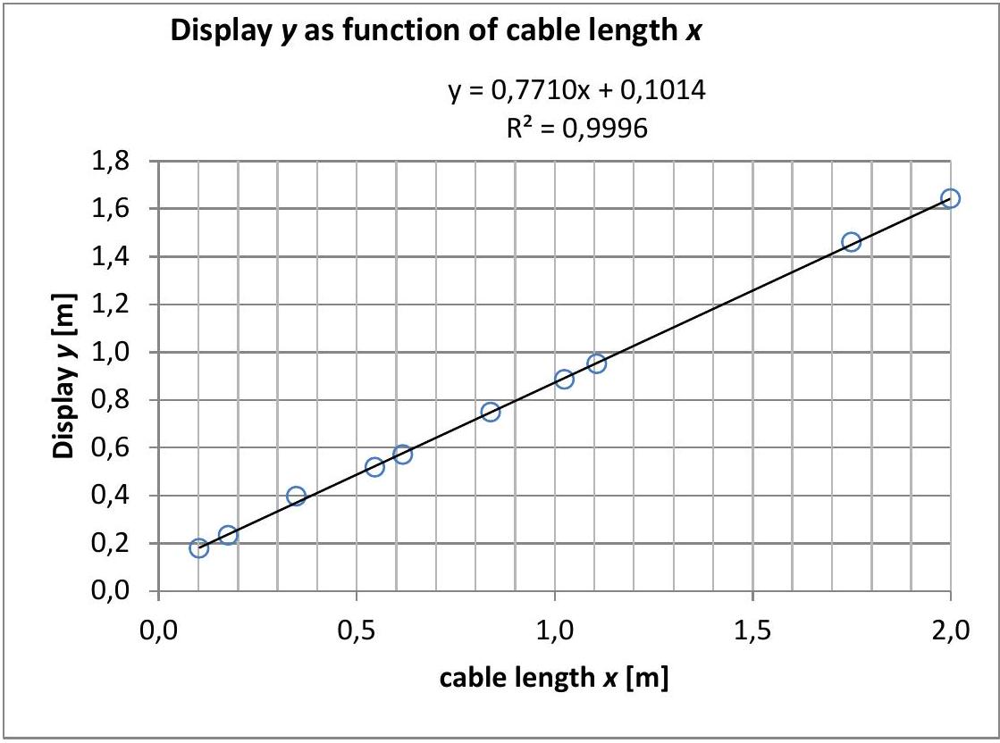
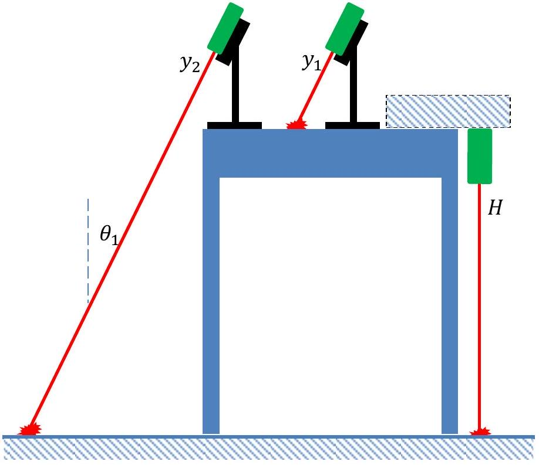
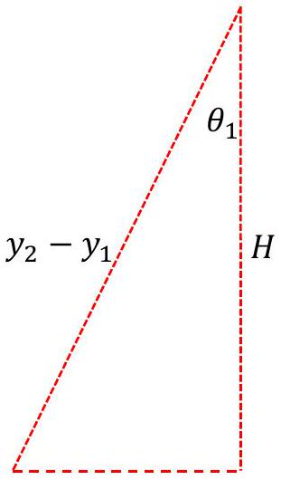
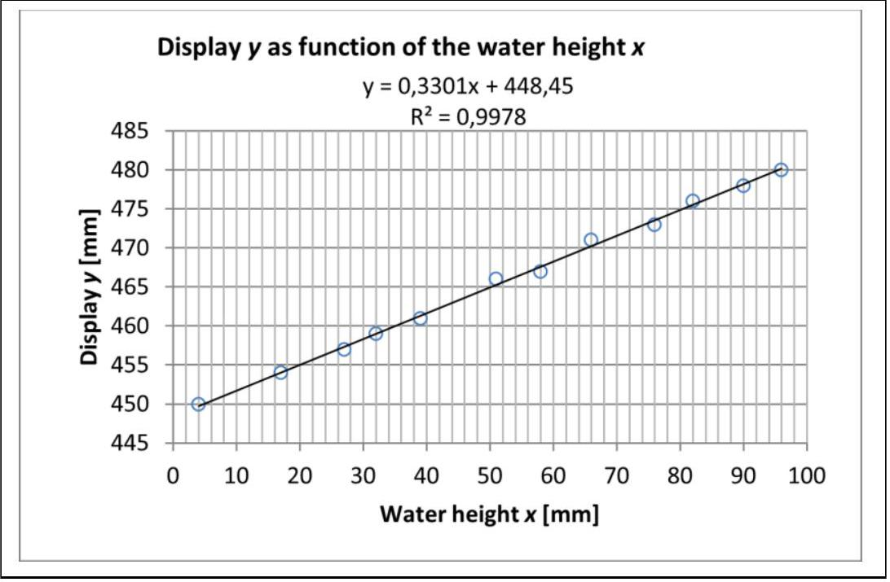

In this document decimal comma is used instead of decimal point in graphs and tables

| 1.1 | Use the LDM to measure the distance $H$ from the top of the table to the floor. Write down the uncertainty $\Delta H$. Show with a sketch how you perform this measurement. | 0.4 |
| :--- | :--- | :--- |

$H = 907 \mathrm {~mm} \pm 2 \mathrm {~mm}$. See the sketch in the figure corresponding to 1.3b. It must appear how the height is measured with the LDM in the rear mode.

| 1.2a | Measure corresponding values of $x$ and $y$. Set up a table with your measurements. Draw a graph showing $y$ as a function of $x$. | 1.8 |
| :--- | :--- | :--- |

Here, a 2 m cable is used, but 1 m is sufficient. There should be about 8 lengths evenly distributed in the interval from 0 m to 1 m..

| $\boldsymbol { x }$ | $y$ |
| :--- | :--- |
| m | m |
| 0,103 | 0,177 |
| 0,176 | 0,232 |
| 0,348 | 0,396 |
| 0,546 | 0,517 |
| 0,617 | 0,570 |
| 0,839 | 0,748 |
| 1,025 | 0,885 |
| 1,107 | 0,950 |
| 1,750 | 1,459 |
| 2,000 | 1,642 |

| 1.2b | Use the graph to find the refractive index $n _ { \mathrm { co } }$ for the material from which the core of the fiber optic cable is made. Calculate the speed of light $v _ { \mathrm { co } }$ in the core of the fiber optic cable. | 1.2 |
| :--- | :--- | :--- |

The refractive index is twice the gradient of the linear graph, $n _ { \mathrm { co } } = 2 \cdot 0.7710 \approx 1.54$.
The reason for that is that the travel time for a light pulse

$$
t = \frac { x } { v _ { \mathrm { co } } } = \frac { x n _ { \mathrm { co } } } { c }
$$

The display will therefore show $y = \frac { 1 } { 2 } c t + k \Leftrightarrow y = \frac { 1 } { 2 } n _ { \mathrm { co } } x + k$.
The speed of light in the core of the cable is $v _ { \text {co } } = \frac { c } { n _ { \text {co } } } = \frac { 2,998 \cdot 10 ^ { 8 } \frac { \mathrm {~m} } { \mathrm {~s} } } { 2 \cdot 0.7710 } \approx 1.95 \cdot 10 ^ { 8 } \frac { \mathrm {~m} } { \mathrm {~s} }$

| 1.3a | Measure with the LDM the distance $y _ { 1 }$ to the laser dot where the laser beam hits the table top. Then move the box with the LDM horizontally until the laser beam hits the floor. Measure the distance $y _ { 2 }$ to the laser dot where the laser beam hits the floor. State the uncertainties. | 0.2 |
| :--- | :--- | :--- |

$$
y _ { 1 } = 312 \mathrm {~mm} \pm 2 \mathrm {~mm} , y _ { 2 } = 1273 \mathrm {~mm} \pm 2 \mathrm {~mm}
$$

| 1.3b | Calculate the angle $\theta _ { 1 }$ using only these measurements $y _ { 1 } , y _ { 2 }$ and $H$ (from problem 1.1). Determine the uncertainty $\Delta \theta _ { 1 }$. | 0.4 |
| :--- | :--- | :--- |

$$
\begin{aligned}
\theta _ { 1 } & = \cos ^ { - 1 } \left( \frac { H } { y _ { 2 } - y _ { 1 } } \right) \\
& = \cos ^ { - 1 } \left( \frac { 907 \mathrm {~mm} } { 961 \mathrm {~mm} } \right) \\
& = 19.30 ^ { \circ }
\end{aligned}
$$

(see the figure)

Measuring the horizontal part of some triangle is very inaccurate because of the size of the laser dot. No marks will be awarded for that. Using $\delta = 2 \mathrm {~mm}$ as the uncertainty of $y _ { 1 } , y _ { 2 }$ and $H$, the uncertainty of $\theta _ { 1 }$ can be calculated as follows:

$$
\Delta \cos \theta _ { 1 } = \Delta \left( \frac { H } { y _ { 2 } - y _ { 1 } } \right)
$$

Using simple derivatives yields

$$
\begin{gathered}
\tan \theta _ { 1 } \cdot \Delta \theta _ { 1 } = \frac { \delta } { H } + \frac { 2 \delta } { y _ { 2 } - y _ { 1 } } \\
\Delta \theta _ { 1 } = \frac { \left( \frac { \delta } { H } + \frac { 2 \delta } { y _ { 2 } - y _ { 1 } } \right) } { \tan \theta _ { 1 } } \cdot \frac { 180 ^ { \circ } } { \pi } = \frac { \left( \frac { 2 } { 907 } + \frac { 4 } { 961 } \right) } { \tan 19,30 ^ { \circ } } \cdot \frac { 180 ^ { \circ } } { \pi } \approx 1 ^ { \circ }
\end{gathered}
$$

Otherwise, using min/max method

$$
\Delta \theta _ { 1 } = \theta _ { 1 \max } - \theta _ { 1 } = \cos ^ { - 1 } \left( \frac { H _ { \min } } { y _ { 2 \max } - y _ { 1 \min } } \right) = \cos ^ { - 1 } \left( \frac { 905 \mathrm {~mm} } { 965 \mathrm {~mm} } \right) - \cos ^ { - 1 } \left( \frac { 907 \mathrm {~mm} } { 961 \mathrm {~mm} } \right) = 1.0 ^ { \circ }
$$

Alternatively, calculate $\Delta \theta _ { 1 }$ using $\Delta \left( y _ { 2 } - y _ { 1 } \right) = \sqrt { \left( \Delta y _ { 1 } \right) ^ { 2 } + \left( \Delta y _ { 2 } \right) ^ { 2 } } = \sqrt { 2 } \delta$ and then

$$
\tan \theta _ { 1 } \cdot \Delta \theta _ { 1 } = \sqrt { \left( \frac { \delta } { H } \right) ^ { 2 } + \frac { 2 \delta ^ { 2 } } { \left( y _ { 2 } - y _ { 1 } \right) ^ { 2 } } }
$$

Also, accept $\delta = 1 \mathrm {~mm}$ and $\Delta \theta _ { 1 } = 0.5 ^ { \circ }$.

| 1.4a | Measure corresponding values of $x$ and $y$. Set up a table with your measurements. Draw a graph of $y$ as a function of $x$. | 1.6 |
| :--- | :--- | :--- |

| $x [ \mathrm {~mm} ]$ | $y [ \mathrm {~mm} ]$ |
| :--- | :--- |
| 4 | 450 |
| 17 | 454 |
| 27 | 457 |
| 32 | 459 |
| 39 | 461 |
| 51 | 466 |
| 58 | 467 |
| 66 | 471 |
| 76 | 473 |
| 82 | 476 |
| 90 | 478 |
| 96 | 480 |

| 1.4b | Use equations to explain theoretically what the graph is expected to look like. | 1.2 |
| :--- | :--- | :--- |

The time it takes the light to reach the water surface is

$$
t _ { 1 } = \frac { ( h - x ) / \cos \theta _ { 1 } } { c }
$$

From the water surface to the bottom the light uses the time

$$
t _ { 2 } = \frac { x / \cos \theta _ { 2 } } { v }
$$

Total travel time forth and back

$$
t = 2 t _ { 1 } + 2 t _ { 2 } = 2 \frac { ( h - x ) / \cos \theta _ { 1 } } { c } + 2 \frac { x / \cos \theta _ { 2 } } { v } = 2 \frac { h - x } { c \cos \theta _ { 1 } } + 2 \frac { n x } { c \cos \theta _ { 2 } }
$$

Hence, the display will show (we simply write $n = n _ { \mathrm { w } }$ )

$$
y = 1 / 2 c t + k = \left( \frac { n } { \cos \theta _ { 2 } } - \frac { 1 } { \cos \theta _ { 1 } } \right) x + \frac { h } { \cos \theta _ { 1 } } + k
$$

which is a linear function of $x$. Then, using a trigonometric identity and Snell's law,

$$
\cos \theta _ { 2 } = \sqrt { 1 - \sin ^ { 2 } \theta _ { 2 } } = \sqrt { 1 - \frac { \sin ^ { 2 } \theta _ { 1 } } { n ^ { 2 } } } .
$$

From this the gradient $\alpha$ is found to be

$$
\alpha = \frac { n } { \sqrt { 1 - \frac { \sin ^ { 2 } \theta _ { 1 } } { n ^ { 2 } } } } - \frac { 1 } { \cos \theta _ { 1 } } = \frac { n ^ { 2 } } { \sqrt { n ^ { 2 } - \sin ^ { 2 } \theta _ { 1 } } } - \frac { 1 } { \cos \theta _ { 1 } }
$$

1.4c Use the graph to determine the refractive index $n _ { \mathrm { w } }$ for water.

Knowing the gradient $\alpha$ from the graph, the index of refraction $n$ is found by solving this equation. Introducing a practical parameter,

$$
p = \alpha + \frac { 1 } { \cos \theta _ { 1 } }
$$

the above equation becomes

$$
p = \frac { n _ { \mathrm { w } } ^ { 2 } } { \sqrt { n _ { \mathrm { w } } ^ { 2 } - \sin ^ { 2 } \theta _ { 1 } } } \Leftrightarrow n _ { \mathrm { w } } ^ { 4 } - p ^ { 2 } n _ { \mathrm { w } } ^ { 2 } + p ^ { 2 } \sin ^ { 2 } \theta _ { 1 } = 0
$$

with the solution

$$
n _ { \mathrm { w } } = \sqrt { \frac { p ^ { 2 } \pm \sqrt { p ^ { 4 } - 4 p ^ { 2 } \sin ^ { 2 } \theta _ { 1 } } } { 2 } } = \frac { \sqrt { 2 } } { 2 } p \sqrt { 1 \pm \sqrt { 1 - \left( \frac { 2 \sin \theta _ { 1 } } { p } \right) ^ { 2 } } }
$$

From the graph is found $\alpha = 0.3301$, which leads to $p = 1.388356$ and hence

$$
n _ { \mathrm { w } } = 1.34676 \approx 1.347 .
$$

All solutions with $n _ { \mathrm { w } } < 1$ are omitted.

Another and more elegant way of finding $n _ { \mathrm { w } }$ is to use Snell's law in the equation

$$
\alpha = \frac { n _ { \mathrm { w } } } { \cos \theta _ { 2 } } - \frac { 1 } { \cos \theta _ { 1 } } = \frac { \sin \theta _ { 1 } } { \sin \theta _ { 2 } \cos \theta _ { 2 } } - \frac { 1 } { \cos \theta _ { 1 } } = \frac { 2 \sin \theta _ { 1 } } { \sin 2 \theta _ { 2 } } - \frac { 1 } { \cos \theta _ { 1 } }
$$

This yields

$$
\sin 2 \theta _ { 2 } = \frac { 2 \sin \theta _ { 1 } } { \alpha + \frac { 1 } { \cos \theta _ { 1 } } }
$$

From here $\theta _ { 2 }$ can be calculated leading to $n _ { \mathrm { w } } = \frac { \sin \theta _ { 1 } } { \sin \theta _ { 2 } }$. This method also only uses the graph and the angle $\theta _ { 1 }$, and measurement of $\theta _ { 2 }$ is not involved).

The table value for pure water at normal conditions is $n _ { \mathrm { w } } = 1.331$ at the wavelength $\lambda = 635 \mathrm {~nm}$.

The following approximations can be used: For small angles

$$
n _ { \mathrm { w } } \approx \frac { \sqrt { 2 } } { 2 } p \sqrt { 1 + 1 - \frac { 1 } { 2 } \left( \frac { 2 \sin \theta _ { 1 } } { p } \right) ^ { 2 } } \approx p \sqrt { 1 - \left( \frac { \sin \theta _ { 1 } } { p } \right) ^ { 2 } } \approx p \left( 1 - \frac { 1 } { 2 } \left( \frac { \sin \theta _ { 1 } } { p } \right) ^ { 2 } \right)
$$

For very small angles, we get

$$
n _ { \mathrm { w } } \approx p \approx \alpha + 1
$$

It is much simpler, but not recommendable, to do the experiment with very small $\theta _ { 1 } \approx 0$. Reflections in the water surface will ruin the signal from the bottom.
