2.1 The dependence of the solar cell current on the distance to the light source

$$
I ( r ) = \frac { I _ { a } } { 1 + \frac { r ^ { 2 } } { a ^ { 2 } } }
$$

| 2.1a | Measure $I$ as a function of $r$, and set up a table of your measurements. | 1.0 |
| :--- | :--- | :--- |
| 2.1b | Determine the values of $I _ { a }$ and $a$ by the use of a suitable graphical method. | 1.0 |

| slot \# | $r$ | $I$ | $1 / I$ | $r ^ { \wedge 2 }$ |
| :--- | :--- | :--- | :--- | :--- |
|  | mm | mA | $1 / \mathrm { mA }$ | mm^2 |
| 3 | 9.0 | 5.440 | 0.184 | 81 |
| 4 | 14.5 | 5.290 | 0.189 | 210 |
| 5 | 20.0 | 5.010 | 0.200 | 400 |
| 6 | 25.5 | 4.540 | 0.220 | 650 |
| 7 | 31.0 | 3.840 | 0.260 | 961 |
| 8 | 36.5 | 3.230 | 0.310 | 1332 |
| 9 | 42.0 | 2.730 | 0.366 | 1764 |
| 10 | 47.5 | 2.305 | 0.434 | 2256 |
| 11 | 53.0 | 1.985 | 0.504 | 2809 |
| 12 | 58.5 | 1.730 | 0.578 | 3422 |
| 13 | 64.0 | 1.485 | 0.673 | 4096 |
| 14 | 69.5 | 1.305 | 0.766 | 4830 |
| 15 | 75.0 | 1.140 | 0.877 | 5625 |
| 16 | 80.5 | 1.045 | 0.957 | 6480 |
| 17 | 86.0 | 0.930 | 1.075 | 7396 |
| 18 | 91.5 | 0.840 | 1.190 | 8372 |
| 19 | 97.0 | 0.755 | 1.325 | 9409 |
| 20 | 102.5 | 0.690 | 1.449 | 10506 |

$$
\begin{aligned}
& I \left( 1 + \frac { r ^ { 2 } } { a ^ { 2 } } \right) = I _ { a } \\
& r ^ { 2 } = I _ { a } a ^ { 2 } \cdot \frac { 1 } { I } - a ^ { 2 }
\end{aligned}
$$

$$
\begin{aligned}
& a ^ { 2 } = 1200 \mathrm {~mm} ^ { 2 } \pm 100 \mathrm {~mm} ^ { 2 } , \\
& a = 35 \mathrm {~mm} \pm \pm 2 \mathrm {~mm} \\
& I _ { a } a ^ { 2 } = \frac { 10870 - 0 } { 1.50 - 0.15 } \cdot \frac { \mathrm {~mm} ^ { 2 } } { \mathrm {~mA} ^ { - 1 } } = 8051.85 \ldots \mathrm {~mm} ^ { 2 } \mathrm {~mA} \\
& I _ { a } = \frac { 8051.85 \frac { \mathrm {~mm} ^ { 2 } } { \mathrm {~mA} ^ { - 1 } } } { 1200 \mathrm {~mm} ^ { 2 } } = 6.7 \mathrm {~mA} \pm 0.5 \mathrm {~mA} \\
& \left( I _ { a } a ^ { 2 } \right) _ { \min } = \frac { 10700 - 0 } { 1.50 - 0.14 } \cdot \frac { \mathrm {~mm} ^ { 2 } } { \mathrm {~mA} ^ { - 1 } } = 7867.6 \ldots \mathrm {~mm} ^ { 2 } \mathrm {~mA} \\
& \rightarrow I _ { a , \max } = \frac { \left( I _ { a } a ^ { 2 } \right) _ { \min } } { a ^ { 2 } \min } = \frac { 7867.6 \mathrm {~mm} ^ { 2 } \mathrm {~mA} } { 1100 \mathrm {~mm} ^ { 2 } } = 7.2 \mathrm {~mA}
\end{aligned}
$$

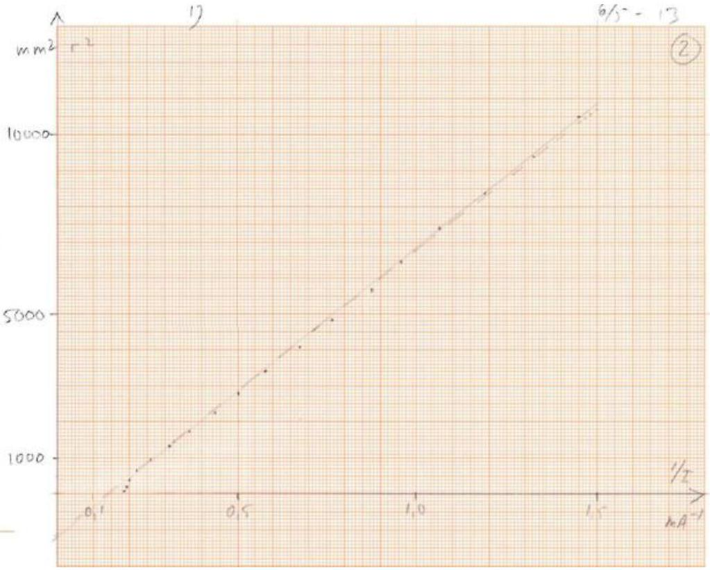

### 2.2 Characteristic of the solar cell

| 2.2 a | Make a table of corresponding measurements of $U$ and $I$. | 0.6 |
| :--- | :--- | :--- |
| 2.2b | Graph voltage as a function of current | 0.8 |

| $I$ | $U$ |  |  |
| :--- | :--- | :--- | :--- |
| mA | V |  |  |
| 0.496 | 0.532 |  |  |
| 1.451 | 0.531 |  |  |
| 5.05 | 0.526 |  |  |
| 8.88 | 0.52 |  |  |
| 14.05 | 0.509 |  |  |
| 31.1 | 0.395 |  |  |
| 25.3 | 0.471 |  |  |
| 21.6 | 0.488 |  |  |
| 30.6 | 0.41 |  |  |
| 31.9 | 0.364 |  |  |
| 32.6 | 0.299 |  |  |
| 32.6 | 0.313 |  |  |
| 33.1 | 0.239 |  |  |
| 33.4 | 0.085 |  |  |
| 33.3 | 0.138 |  |  |
| 33.4 | 0.096 |  |  |
| 33.4 | 0.058 |  |  |
| 33.5 | 0.046 |  |  |
| 33.5 | 0.045 |  |  |
| 1.05 | 0.529 |  |  |
| 27.8 | 0.454 |  |  |
| 15.9 | 0.503 |  |  |
| 22.3 | 0.483 |  |  |
| 26.8 | 0.458 |  |  |
| 29.2 | 0.435 |  |  |

### 2.3 Theoretical characteristic for the solar cell

| 2.3a | Use the graph from question 2.2b to determine $I _ { \text {max } }$. | 0.4 |
| :--- | :--- | :--- |
| 2.3b | Estimate the range of values of $U$ for which the mentioned approximation is good. Determine graphically the values of $I _ { 0 }$ and $\eta$ for your solar cell. | 1.2 |

$$
\begin{aligned}
& I = I _ { \max } \text { for } U = 0 \rightarrow I _ { \max } = 33.5 \mathrm {~mA} \\
& \eta k _ { B } T < 4 \cdot 1.381 \cdot 10 ^ { - 23 } \mathrm {~J} / \mathrm { K } \cdot 300 \mathrm {~K} = 0.103 \mathrm { eV } \\
& I = I _ { \max } - I _ { 0 } \left( \exp \left( \frac { e U } { \eta k _ { B } T } \right) - 1 \right) \approx I _ { \max } - I _ { 0 } \exp \left( \frac { e U } { \eta k _ { B } T } \right)
\end{aligned}
$$

for $U > 0.4 V$ where $\exp \left( \frac { e U } { \eta k _ { B } T } \right) > \exp ( 4 ) \gg 1$

$$
\ln \left( \frac { I _ { \max } - I } { \mathrm {~mA} } \right) = \frac { e } { \eta k _ { B } T } U + \ln \left( \frac { I _ { 0 } } { \mathrm {~mA} } \right)
$$

$$
\frac { e } { \eta k _ { B } T } = \frac { 4.03 - ( - 7.7 ) } { 0.56 \mathrm {~V} } = 20.95 \mathrm {~V} ^ { - 1 }
$$

$$
I _ { 0 } = e ^ { - 7.7 } \mathrm {~mA} = 0.45 \mu A
$$

$$
\rightarrow \boldsymbol { \eta } = \frac { e / \left( k _ { B } T \right) } { 20.95 \mathrm {~V} ^ { - 1 } } = 1.85
$$

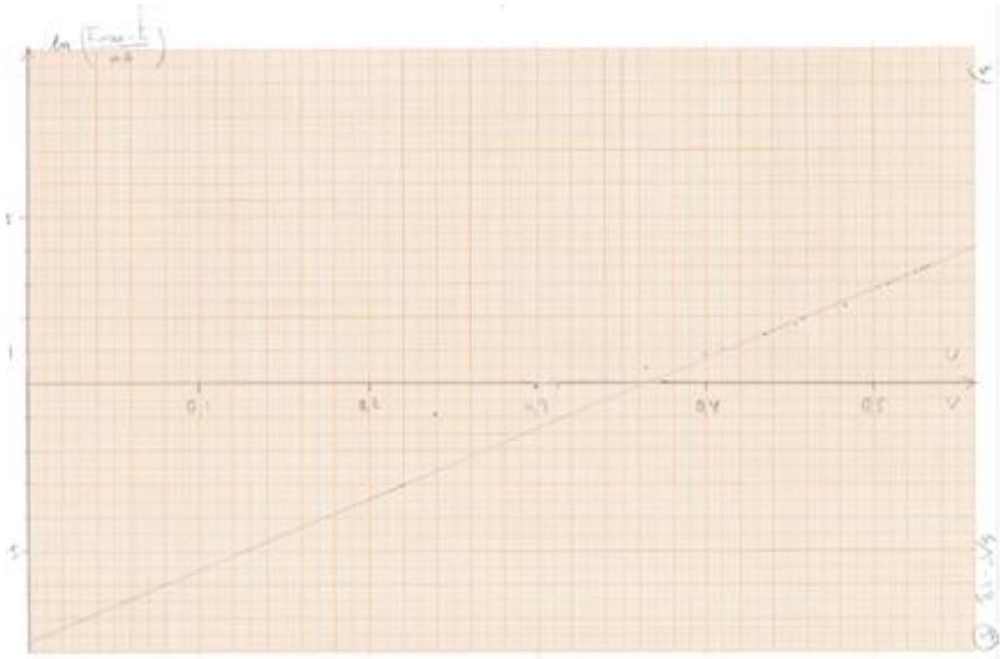

### 2.4 Maximum power for a solar cell

| 2.4a | The maximum power that the solar cell can deliver to the external circuit is denoted $P _ { \text {max } }$. Determine $P _ { \text {max } }$ for your solar cell through a few, suitable measurements. (You may use some of your previous measurements from question 2.2) | 0.5 |
| :--- | :--- | :--- |
| 2.4b | Estimate the optimal load resistance $R _ { \text {opt } }$, i.e. the total external resistance when the solar cell delivers its maximum power to $R _ { \text {opt } }$. State your result with uncertainty and illustrate your method with suitable calculations. | 0.5 |

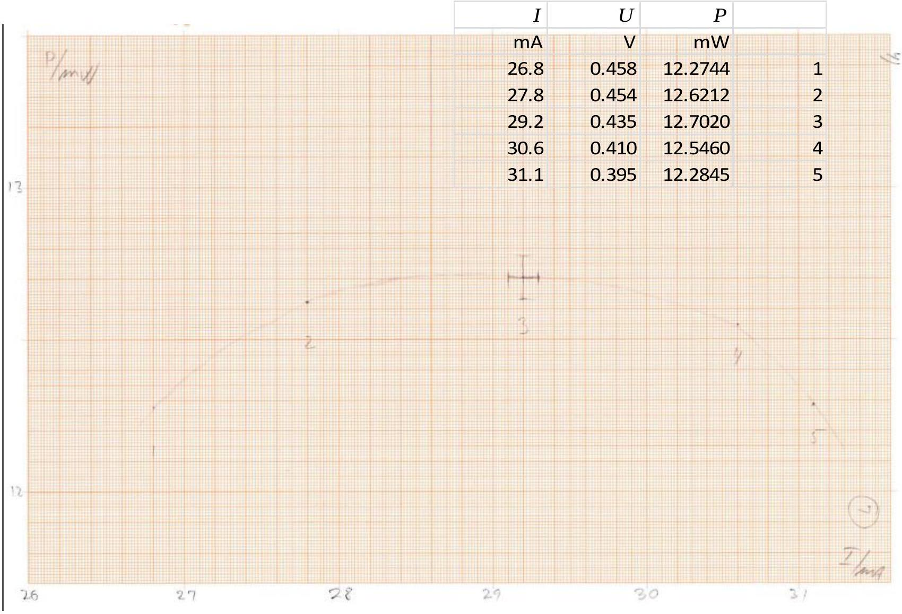

$$
\begin{gathered}
P _ { \max } = ( 12.7 \pm 0.1 ) \mathrm { mW } \text { at } I = ( 2 \\
R _ { \mathrm { opt } } = \frac { P _ { \max } } { I _ { \mathrm { opt } } ^ { 2 } } = \frac { 12.71 \mathrm {~mW} } { ( 28.8 \mathrm {~mA} ) ^ { 2 } } = ( 15.3 \pm 0.3 ) \Omega
\end{gathered}
$$

2.5 Comparing the solar cells

| 2.5a | Measure, for the given illumination: - The maximum potential difference $U _ { \mathrm { A } }$ that can be measured over solar cell A. - The maximum current $I _ { \mathrm { A } }$ that can be measured through solar cell A.    Do the same for solar cell B. | 0.5 |
| :--- | :--- | :--- |
| 2.5b | Draw electrical diagrams for your circuits showing the wiring of the solar cells and the meters. | 0.3 |

2.5a. $U _ { \mathrm { A } } = 0.512 \mathrm {~V}$ $I _ { \mathrm { A } } = 16.465 \mathrm {~mA}$ $U _ { \mathrm { B } } = 0.480 \mathrm {~V}$ $I _ { \mathrm { B } } = 16.325 \mathrm {~mA}$
2.5b.
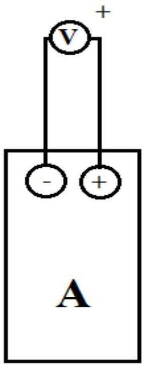
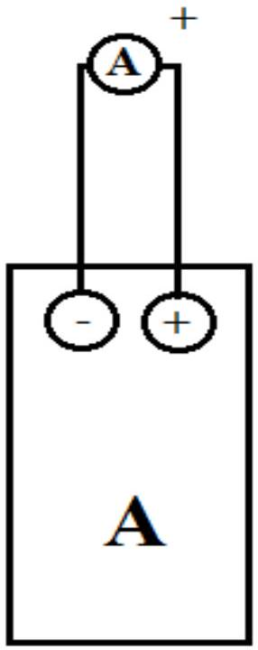
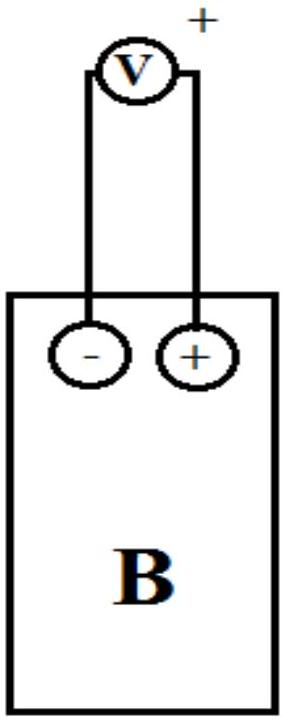
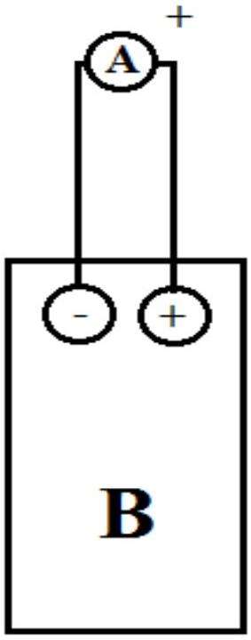

### 2.6 Couplings of the solar cells

| 2.6 | Determine which of the four arrangements of the two solar cells yields the highest possible power in the external circuit when one of the solar cells is shielded with the shielding plate (J in Fig. 2.1).   Draw the corresponding electrical diagram. | 1.0 |
| :--- | :--- | :--- |

Two approaches:
Approach 1: use a constant setting of the variable resistor to simulate a constant external load.
Approach 2: use the hint given in the question and measure values of maximal $U$ and maximal $I$ independently (no variable resistor involved).

In the following only measurements for approach 1 are presented.

a. 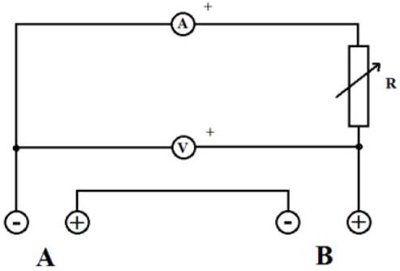
Unshielded (adjusting $R$ for reasonable $P$ )
13.10 mA; 0.794 V; 10.4 mW
A shielded: 0.37 mA; 0.022 V
B shielded: 0.83 mA; 0.049 V
b. 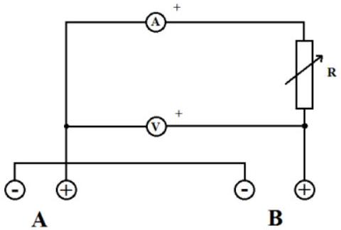

$R$ like in a.

A shielded: $1.47 \mathrm {~mA} ; 0.088 \mathrm {~V}$
B shielded: -2.82 mA; -0.170 V

c. 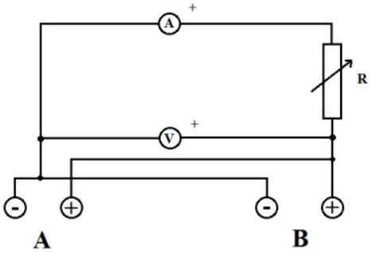

$R$ like in a.

A shielded: 6.89 mA; 0.415 V
B shielded: 6.905 mA; 0.4165 V

d. 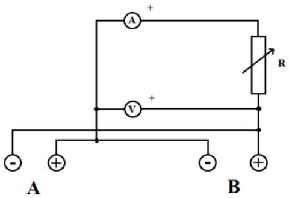

$R$ like in a.

A shielded: $7.14 \mathrm {~mA} ; 0.436 \mathrm {~V}$
B shielded: -7.76 mA; -0.474 V

Conclusion: Best power: Set-up d with B shielded. (Solar cell A slightly better than B).
(2.7 on next page)

### 2.7 The effect of the optical vessel (large cuvette) on the solar cell current

| 2.7a | Measure the current $I$, now as a function of the height, $h$, of water in the vessel, see Fig. 2.8. Make a table of the measurements and draw a graph. | 1.0 |
| :--- | :--- | :--- |
| 2.7b | Explain with only sketches and symbols why the graph looks the way it does. | 1.0 |
| 2.7 c | For this set-up do the following: - Measure the distance $r _ { 1 }$ between the light source and the solar cell, and the current $I _ { 1 }$. - Place the empty vessel immediately in front of the circular aperture and measure the current $I _ { 2 }$. - Fill up the vessel with water, almost to the top, and measure the current $I _ { 3 }$.  | 0.6 |
| 2.7 d | Use your measurements from 2.7c to find a value for the refractive index $n _ { \mathrm { w } }$ for water. Illustrate your method with suitable sketches and equations. You may include additional measurements. | 1.6 |

2.7a

| $h$ mm | I mA |
| :--- | :--- |
| 2 | 2.54 |
| 22 | 2.55 |
| 28 | 2.56 |
| 34 | 2.57 |
| 38 | 2.42 |
| 42 | 2.21 |
| 45 | 2.13 |
| 46 | 2.08 |
| 48 | 2.15 |
| 49 | 2.54 |
| 50 | 2.97 |
| 52 | 3.36 |
| 53 | 3.61 |
| 57 | 3.96 |
| 59 | 3.99 |
| 63 | 3.89 |
| 67 | 3.6 |
| 69 | 3.49 |
| 72 | 3.47 |

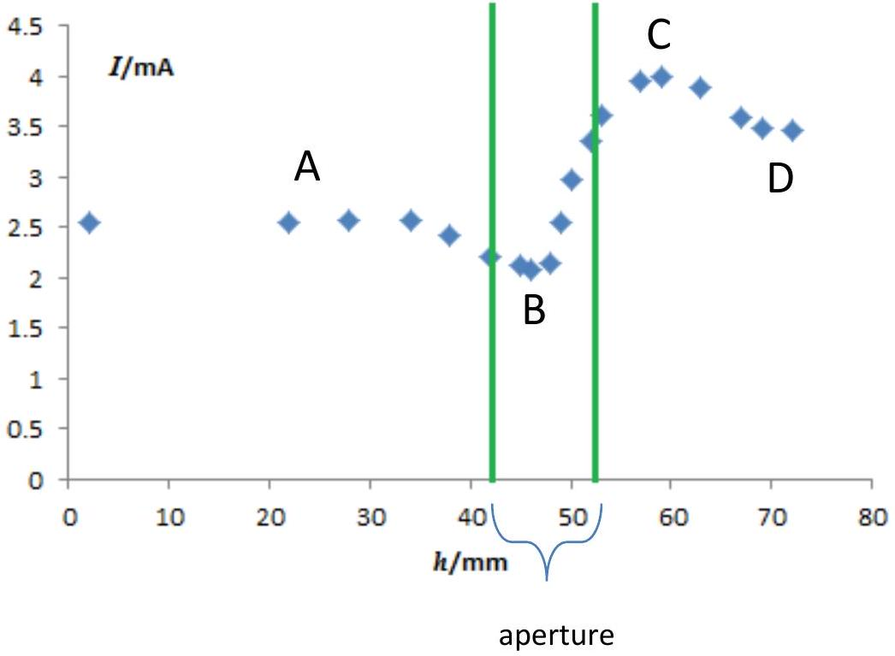

2.7b Exemple drawings for position A, B, C and D on previous graph:
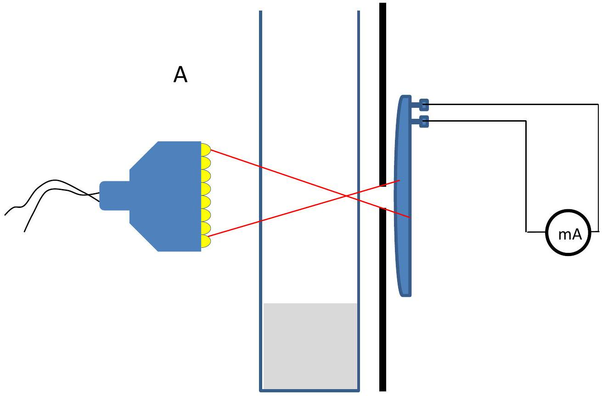
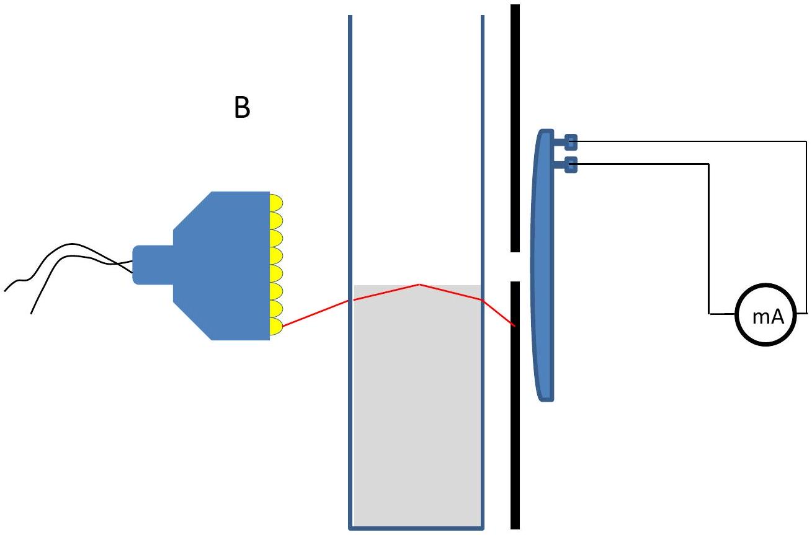

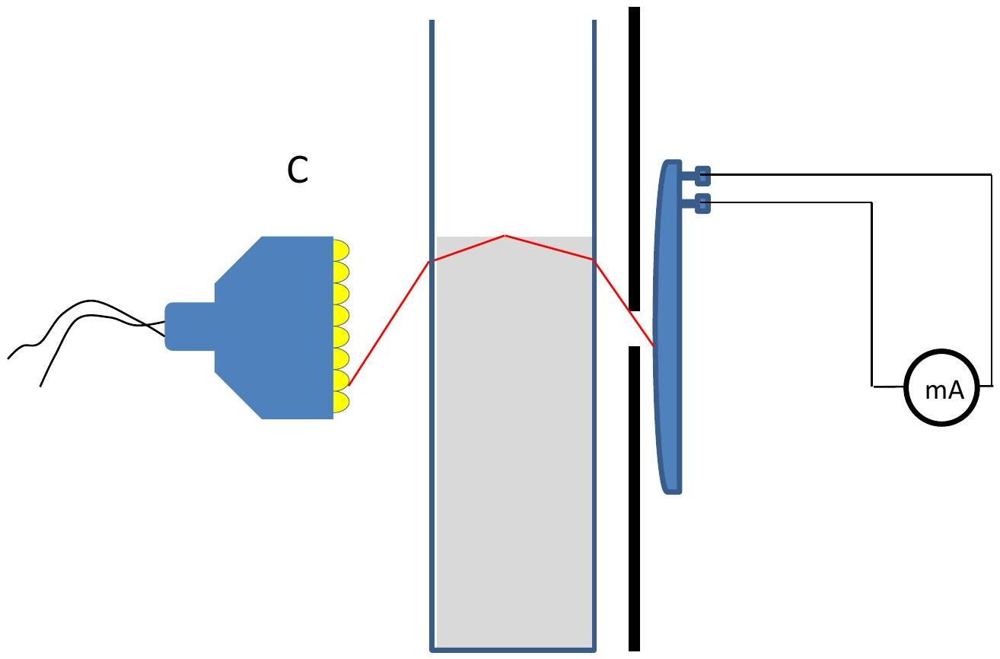
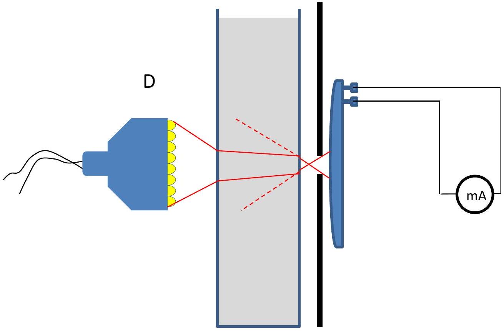

2.7c NOTE: The exemplar measurements are from a different lamp than in 2.1. For a solution to 2.7d using the distance graph it is necessary to refer to the graph below.

$$
\begin{aligned}
& r _ { 1 } = 103.5 \mathrm {~mm} ; I _ { 1 } = 0.81 \mathrm {~mA} ; I _ { 2 } = 0.705 \mathrm {~mA} ; I _ { 3 } = 0.85 \mathrm {~mA} \\
& \frac { 1 } { I _ { 3 } } \cdot \frac { I _ { 2 } } { I _ { 1 } } = 1.024 \mathrm {~mA} ^ { - 1 } \sim r _ { c } ^ { 2 } = 8800 \mathrm {~mm} ^ { 2 } \sim r _ { c } = 93.8 \mathrm {~mm}
\end{aligned}
$$

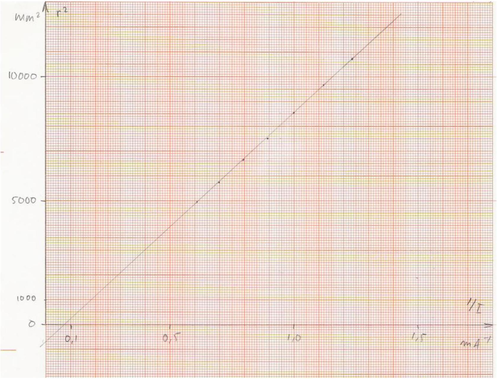

2.7d

|  | $b$ |  |
| :--- | :--- | :--- |
|  |  |    $\theta 1$ |
|  | 02 | h |
| $\theta 1$    | $\Delta r$ | $r 0$ |

$$
\begin{aligned}
& h = ( b - \Delta r ) \tan \theta _ { 1 } = b \tan \theta _ { 2 } \Rightarrow \frac { b } { b - \Delta r } = \frac { \tan \theta _ { 1 } } { \tan \theta _ { 2 } } \approx \frac { \sin \theta _ { 1 } } { \sin \theta _ { 2 } } = n , \text { da } \theta _ { 2 } < \theta _ { 1 } \ll 1 . \\
& n _ { w } \approx \frac { b } { b - \Delta r } = \frac { b } { b - \left( r _ { 1 } - r _ { c } \right) } = \frac { 26.0 \mathrm {~mm} } { 26.0 \mathrm {~mm} - ( 103.5 - 93.8 ) \mathrm { mm } } = 1.6
\end{aligned}
$$

NOTE: Better results may be obtained. The uncertainty is rather large in this method because of the subtraction of two large numbers for $\Delta r$

A different method is to determine the shift by actually moving the set-up and perhaps making an interpolation in directly measured data.
