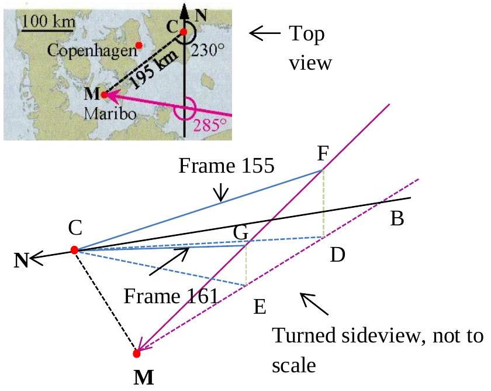

Solutions

| 1.1 |    Top view: Triangle $\mathrm { MBC } : \| \mathrm { CM } \| = 195 \mathrm {~km} , \angle \mathrm { BCM } = 230 ^ { \circ } - 180 ^ { \circ } = 50 ^ { \circ }$, and $\angle \mathrm { MBC } = 75 ^ { \circ } \text {, so } \angle \mathrm { CMB } = 180 ^ { \circ } - 75 ^ { \circ } - 50 ^ { \circ } = 55 ^ { \circ } \text {. }$   Then $\| \mathrm { CB } \| = \frac { \| \mathrm { CM } \| \sin ( \angle \mathrm { CMB } ) } { \sin ( \angle \mathrm { MBC } ) } = 165.4 \mathrm {~km}$.   Triangle $\mathrm { DBC } : \| \mathrm { BC } \| = 165.4 \mathrm {~km} , \angle \mathrm { BCD } = 215 ^ { \circ } - 180 ^ { \circ } = 35 ^ { \circ }$,and $\angle \mathrm { DBC } = 75 ^ { \circ }$, so $\angle \mathrm { CDB } = 180 ^ { \circ } - 75 ^ { \circ } - 35 ^ { \circ } = 70 ^ { \circ }$.   Then $\| \mathrm { CD } \| = \frac { \| \mathrm { BC } \| \sin ( \angle \mathrm { DBC } ) } { \sin ( \angle \mathrm { CDB } ) } = 170.0 \mathrm {~km}$.   Triangle $\mathrm { EBC } : \| \mathrm { BC } \| = 165.4 \mathrm {~km} , \angle \mathrm { BCE } = 221 ^ { \circ } - 180 ^ { \circ } = 41 ^ { \circ }$, and $\angle \mathrm { EBC } = 75 ^ { \circ }$, so $\angle \mathrm { CEB } = 180 ^ { \circ } - 75 ^ { \circ } - 41 ^ { \circ } = 64 ^ { \circ }$.   Then $\| \mathrm { CE } \| = \frac { \| \mathrm { BC } \| \sin ( \angle \mathrm { EBC } ) } { \sin ( \angle \mathrm { CEB } ) } = 177.7 \mathrm {~km}$.   Triangle EDC: $\angle \mathrm { DCE } = 41 ^ { \circ } - 35 ^ { \circ } = 6 ^ { \circ }$. Horizontal distance traveled by   Maribo: $\| \mathrm { DE } \| = \frac { \| \mathrm { DC } \| \sin ( \angle \mathrm { DCE } ) } { \sin ( \angle \mathrm { CED } ) } = 19.77 \mathrm {~km}$   Side view: Triangle CDF: $\| \mathrm { DF } \| = \| \mathrm { DC } \| \tan ( \angle \mathrm { FCD } ) = 59.20 \mathrm {~km}$   Triangle CEG: $\| \mathrm { EG } \| = \| \mathrm { CE } \| \tan ( \angle \mathrm { GCE } ) = 46.62 \mathrm {~km}$   Thus vertical distance travelled by Maribo: $\| \mathrm { DF } \| - \| \mathrm { EG } \| = 12.57 \mathrm {~km}$.   Total distance travelled by Maribo from frame 155 to 161: $\| \mathrm { FG } \| = \sqrt { \| \mathrm { DE } \| ^ { 2 } + ( \| \mathrm { DF } \| - \| \mathrm { EG } \| ) ^ { 2 } } = 23.43 \mathrm {~km} .$   The speed of Maribo is $v = \frac { 23.43 \mathrm {~km} } { 2.28 \mathrm {~s} - 1.46 \mathrm {~s} } = 28.6 \mathrm {~km} / \mathrm { s }$ | 1.3 |
| :--- | :--- | :--- |

|  | Newton's second law: $m _ { \mathrm { M } } \frac { \mathrm { d } v } { \mathrm {~d} t } = - k \rho _ { \text {atm } } \pi R _ { \mathrm { M } } ^ { 2 } v ^ { 2 }$ yields $\frac { 1 } { v ^ { 2 } } \mathrm {~d} v = - \frac { k \rho _ { \text {atm } \pi } R _ { \mathrm { M } } ^ { 2 } } { m _ { \mathrm { M } } } \mathrm { d } t$. By integration $t = \frac { m _ { \mathrm { M } } } { k \rho _ { \text {atm } } \pi R _ { \mathrm { M } } ^ { 2 } } \left( \frac { 1 } { 0.9 } - 1 \right) \frac { 1 } { v _ { \mathrm { M } } } = 0.88 \mathrm {~s}$. |  |
| :--- | :--- | :--- |
| 1.2a | Alternative solution: The average force on the meteoroid when the speed decreases from $v _ { \mathrm { M } }$ to $0.9 v _ { \mathrm { M } }$ can be estimated to $F _ { \mathrm { av } } = - k \rho _ { \text {atm } } \pi R _ { \mathrm { M } } ^ { 2 } \left( 0.95 v _ { \mathrm { M } } \right) ^ { 2 }$. Using that the acceleration is approximately constant, $a _ { \mathrm { av } } = - k \rho _ { \text {atm } } \pi R _ { \mathrm { M } } ^ { 2 } \left( 0.95 v _ { \mathrm { M } } \right) ^ { 2 } / m _ { \mathrm { M } }$, results in $t = \frac { - 0.1 v _ { \mathrm { M } } } { a _ { \mathrm { av } } } = 0.87 \mathrm {~s}$. | 0.7 |

| 1.2b | $\frac { E _ { \mathrm { kin } } } { E _ { \mathrm { melt } } } = \frac { \frac { 1 } { 2 } v _ { \mathrm { M } } ^ { 2 } } { c _ { \mathrm { sm } } \left( T _ { \mathrm { sm } } - T _ { 0 } \right) + L _ { \mathrm { sm } } } = \frac { 4.2 \times 10 ^ { 8 } } { 2.1 \times 10 ^ { 6 } } = 2.1 \times 10 ^ { 2 } \gg 1$. | 0.3 |
| :--- | :--- | :--- |

|  | $[ x ] = [ t ] ^ { \alpha } \left[ \rho _ { \mathrm { sm } } \right] ^ { \beta } \left[ c _ { \mathrm { sm } } \right] ^ { \gamma } \left[ k _ { \mathrm { sm } } \right] ^ { \delta } = [ \mathrm { s } ] ^ { \alpha } \left[ \mathrm { kg } \mathrm { m } ^ { - 3 } \right] ^ { \beta } \left[ \mathrm { m } ^ { 2 } \mathrm {~s} ^ { - 2 } \mathrm {~K} ^ { - 1 } \right] ^ { \gamma } \left[ \mathrm { kg } \mathrm { m } \mathrm { s } ^ { - 3 } \mathrm {~K} ^ { - 1 } \right] ^ { \delta }$, so $[ \mathrm { m } ] = [ \mathrm { kg } ] ^ { \beta + \delta } [ \mathrm { m } ] ^ { - 3 \beta + 2 \gamma + \delta } [ \mathrm { s } ] ^ { \alpha - 2 \gamma - 3 \delta } [ \mathrm {~K} ] ^ { - \gamma - \delta }$. |  |
| :--- | :--- | :--- |
| 1.3a | Thus $\beta + \delta = 0 , - 3 \beta + 2 \gamma + \delta = 1 , \alpha - 2 \gamma - 3 \delta = 0$, and $- \gamma - \delta = 0$. From which $( \alpha , \beta , \gamma , \delta ) = \left( + \frac { 1 } { 2 } , - \frac { 1 } { 2 } , - \frac { 1 } { 2 } , + \frac { 1 } { 2 } \right)$ and $x ( t ) \approx \sqrt { \frac { k _ { \mathrm { sm } } t } { \rho _ { \mathrm { sm } } c _ { \mathrm { sm } } } }$. | 0.6 |
| 1.3b | $x ( 5 \mathrm {~s} ) = 1.6 \mathrm {~mm}$ | 0.4 |

| 1.4a | Rb-Sr decay scheme: ${ } _ { 37 } ^ { 87 } \mathrm { Rb } \rightarrow { } _ { 38 } ^ { 87 } \mathrm { Sr } + { } _ { - 1 } ^ { 0 } \mathrm { e } + \bar { v } _ { \mathrm { e } }$ | 0.3 |
| :--- | :--- | :--- |
| 1.4b | $N _ { 87 \mathrm { Rb } } ( t ) = N _ { 87 \mathrm { Rb } } ( 0 ) \mathrm { e } ^ { - \lambda t }$ and Rb → Sr: $N _ { 87 \mathrm { Sr } } ( t ) = N _ { 87 \mathrm { Sr } } ( 0 ) + \left[ N _ { 87 \mathrm { Rb } } ( 0 ) - N _ { 87 \mathrm { Rb } } ( t ) \right]$. Thus $N _ { 87 \mathrm { Sr } } ( t ) = N _ { 87 \mathrm { Sr } } ( 0 ) + \left( \mathrm { e } ^ { \lambda t } - 1 \right) N _ { 87 \mathrm { Rb } } ( t )$, and dividing by $N _ { 86 \mathrm { Sr } }$ we obtain the equation of a straight line: $\frac { N _ { 87 \mathrm { Sr } } ( t ) } { N _ { 86 \mathrm { Sr } } } = \frac { N _ { 87 \mathrm { Sr } } ( 0 ) } { N _ { 86 \mathrm { Sr } } } + \left( \mathrm { e } ^ { \lambda t } - 1 \right) \frac { N _ { 87 \mathrm { Rb } } ( t ) } { N _ { 86 \mathrm { Sr } } } .$ | 0.7 |
| 1.4c | Slope: $\mathrm { e } ^ { \lambda t } - 1 = a = \frac { 0.712 - 0.700 } { 0.25 } = 0.050$ and $T _ { 1 / 2 } = \frac { \ln ( 2 ) } { \lambda } = 4.9 \times 10 ^ { 10 }$ year.   So $\tau _ { \mathrm { M } } = \ln ( 1 + a ) \frac { 1 } { \lambda } = \frac { \ln ( 1 + a ) } { \ln ( 2 ) } T _ { 1 / 2 } = 3.4 \times 10 ^ { 9 }$ year . | 0.4 |

| 1.5 | Kepler's 3rd law on comet Encke and Earth, with the orbital semi-major axis of Encke given by $a = \frac { 1 } { 2 } \left( a _ { \text {min } } + a _ { \text {max } } \right)$. Thus $t _ { \text {Encke } } = \left( \frac { a } { a _ { \mathrm { E } } } \right) ^ { \frac { 3 } { 2 } } t _ { \mathrm { E } } = 3.30$ year $= 1.04 \times 10 ^ { 8 } \mathrm {~s}$. | 0.6 |
| :--- | :--- | :--- |

| 1.6a | For Earth around its rotation axis: Angular velocity $\omega _ { \mathrm { E } } = \frac { 2 \pi } { 24 \mathrm {~h} } = 7.27 \times 10 ^ { - 5 } \mathrm {~s} ^ { - 1 }$. Moment of inertia $I _ { \mathrm { E } } = 0.83 \frac { 2 } { 5 } m _ { \mathrm { E } } R _ { \mathrm { E } } ^ { 2 } = 8.07 \times 10 ^ { 37 } \mathrm {~kg} \mathrm {~m} ^ { 2 }$. Angular momentum $L _ { \mathrm { E } } = I _ { \mathrm { E } } \omega _ { \mathrm { E } } = 5.87 \times 10 ^ { 33 } \mathrm {~kg} \mathrm {~m} ^ { 2 } \mathrm {~s} ^ { - 1 }$. Asteroid: $m _ { \text {ast } } = \frac { 4 \pi } { 3 } R _ { \text {ast } } ^ { 3 } \rho _ { \text {ast } } = 1.57 \times 10 ^ { 15 } \mathrm {~kg}$ and angular momentum $L _ { \text {ast } } = m _ { \text {ast } } v _ { \text {ast } } R _ { \mathrm { E } } = 2.51 \times 10 ^ { 26 } \mathrm {~kg} \mathrm {~m} ^ { 2 } \mathrm {~s} ^ { - 1 }$. $L _ { \text {ast } }$ is perpendicular to $L _ { \mathrm { E } }$, so by conservation angular momentum: $\tan ( \Delta \theta ) = L _ { \text {ast } } / L _ { \mathrm { E } } = 4.27 \times 10 ^ { - 8 }$. The axis tilt $\Delta \theta = 4.27 \times 10 ^ { - 8 }$ rad (so the North Pole moves $R _ { \mathrm { E } } \Delta \theta = 0.27 \mathrm {~m}$ ). | 0.7 |
| :--- | :--- | :--- |
| 1.6b | At vertical impact $\Delta L _ { \mathrm { E } } = 0$ so $\Delta \left( I _ { \mathrm { E } } \omega _ { \mathrm { E } } \right) = 0$. Thus $\Delta \omega _ { \mathrm { E } } = - \omega _ { \mathrm { E } } \left( \Delta I _ { \mathrm { E } } \right) / I _ { \mathrm { E } }$, and since $\Delta I _ { \mathrm { E } } / I _ { \mathrm { E } } = m _ { \text {ast } } R _ { \mathrm { E } } ^ { 2 } / I _ { \mathrm { E } } = 7.9 \times 10 ^ { - 10 }$ we obtain $\Delta \omega _ { \mathrm { E } } = - 5.76 \times 10 ^ { - 14 } \mathrm {~s} ^ { - 1 }$. The change in rotation period is $\Delta T _ { \mathrm { E } } = 2 \pi \left( \frac { 1 } { \omega _ { \mathrm { E } } + \Delta \omega _ { \mathrm { E } } } - \frac { 1 } { \omega _ { \mathrm { E } } } \right) \approx - 2 \pi \frac { \Delta \omega _ { \mathrm { E } } } { \omega _ { \mathrm { E } } ^ { 2 } } = 6.84 \times 10 ^ { - 5 } \mathrm {~s}$. | 0.7 |
| 1.6c | At tangential impact $L _ { \text {ast } }$ is parallel to $L _ { \mathrm { E } }$ so $L _ { \mathrm { E } } + L _ { \text {ast } } = \left( I _ { \mathrm { E } } + \Delta I _ { \mathrm { E } } \right) \left( \omega _ { \mathrm { E } } + \Delta \omega _ { \mathrm { E } } \right)$ and thus $\Delta T _ { \mathrm { E } } = 2 \pi \left( \frac { 1 } { \omega _ { \mathrm { E } } + \Delta \omega _ { \mathrm { E } } } - \frac { 1 } { \omega _ { \mathrm { E } } } \right) = 2 \pi \left( \frac { I _ { \mathrm { E } } + \Delta I _ { \mathrm { E } } } { L _ { \mathrm { E } } + L _ { \mathrm { ast } } } - \frac { 1 } { \omega _ { \mathrm { E } } } \right) = - 3.62 \times 10 ^ { - 3 } \mathrm {~s}$. | 0.7 |

|  | Maximum impact speed $v _ { \text {imp } } ^ { \text {max } }$ arises from three contributions:   (I) The velocity $v _ { \mathrm { b } }$ of the body at distance $a _ { \mathrm { E } }$ (Earth orbit radius) from the Sun, $v _ { \mathrm { b } } = \sqrt { \frac { 2 G m _ { S } } { a _ { E } } } = 42.1 \mathrm {~km} / \mathrm { s }$. |  |
| :--- | :--- | :--- |
| 1.7 | (II) The orbital velocity of the Earth, $v _ { \mathrm { E } } = \frac { 2 \pi a _ { E } } { 1 \text { year } } = 29.8 \mathrm {~km} / \mathrm { s }$.   (III) Gravitational attraction from the Earth and kinetic energy seen from the Earth: $\frac { 1 } { 2 } \left( v _ { \mathrm { b } } + v _ { \mathrm { E } } \right) ^ { 2 } = - \frac { G m _ { E } } { R _ { E } } + \frac { 1 } { 2 } \left( v _ { \mathrm { imp } } ^ { \max } \right) ^ { 2 } .$   In conclusion: $v _ { \text {imp } } ^ { \text {max } } = \sqrt { \left( v _ { \mathrm { b } } + v _ { \mathrm { E } } \right) ^ { 2 } + \frac { 2 G m _ { E } } { R _ { E } } } = 72.8 \mathrm {~km} / \mathrm { s }$. | 1.6 |

| Total | 9.0 |
| :--- | :--- |
