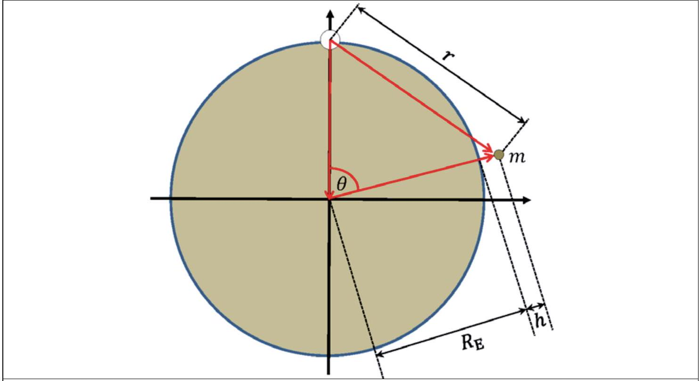
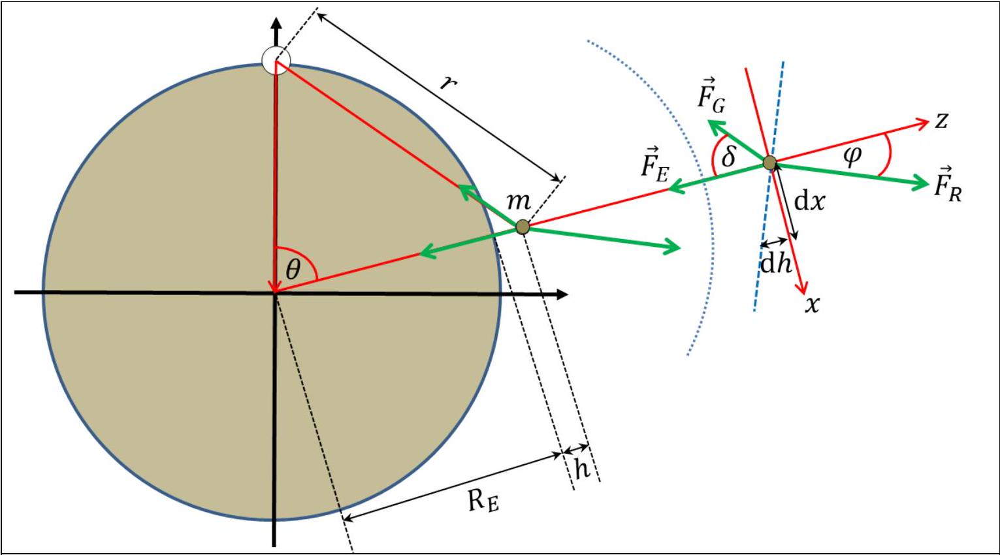

Solutions

| 3.1 | The pressure is given by the hydrostatic pressure $p ( x , z ) = \rho _ { \text {ice } } g ( H ( x ) - z )$, which is zero at the surface. | 0.3 |
| :--- | :--- | :--- |

| 3.2a | The outward force on a vertical slice at a distance $x$ from the middle and of a given width $\Delta y$ is obtained by integrating up the pressure times the area: $F ( x ) = \Delta y \int _ { 0 } ^ { H ( x ) } \rho _ { \text {ice } } g ( H ( x ) - z ) \mathrm { d } z = \frac { 1 } { 2 } \Delta y \rho _ { \text {ice } } g H ( x ) ^ { 2 }$   which implies that $\Delta F = F ( x ) - F ( x + \Delta x ) = - \frac { \mathrm { d } F } { \mathrm {~d} x } \Delta x = - \Delta y \rho _ { \text {ice } } g H ( x ) \frac { \mathrm { d } H } { \mathrm {~d} x } \Delta x$. This finally shows that $S _ { \mathrm { b } } = \frac { \Delta F } { \Delta x \Delta y } = - \rho _ { \text {ice } } g H ( x ) \frac { \mathrm { d } H } { \mathrm {~d} x }$   Notice the sign, which must be like this, since $S _ { b }$ was defined as positive and $H ( x )$ is a decreasing function of $x$. | 0.9 |
| :--- | :--- | :--- |
| 3.2b | To find the height profile, we solve the differential equation for $H ( x )$ : $- \frac { S _ { \mathrm { b } } } { \rho _ { \text {ice } } g } = H ( x ) \frac { \mathrm { d } H } { \mathrm {~d} x } = \frac { 1 } { 2 } \frac { \mathrm {~d} } { \mathrm {~d} x } H ( x ) ^ { 2 }$   with the boundary condition that $H ( L ) = 0$. This gives the solution: $H ( x ) = \sqrt { \frac { 2 S _ { b } L } { \rho _ { \text {ice } } g } } \sqrt { 1 - x / L }$   Which gives the maximum height $H _ { \mathrm { m } } = \sqrt { \frac { 2 S _ { b L } L } { \rho _ { \text {ice } } g } }$.   Alternatively, dimensional analysis could be used in the following manner. First notice that $\mathcal { L } = \left[ H _ { \mathrm { m } } \right] = \left[ \rho _ { \text {ice } } ^ { \alpha } g ^ { \beta } \tau _ { \mathrm { b } } ^ { \gamma } L ^ { \delta } \right]$. Using that $\left[ \rho _ { \rho _ { \text {ice } } } \right] = \mathcal { M } \mathcal { L } ^ { - 3 } , [ g ] = \mathcal { L } \mathcal { J } ^ { - 2 } , \left[ \tau _ { b } \right] = \mathcal { M } \mathcal { L } ^ { - 1 } \mathcal { T } ^ { - 2 }$, demands that $\mathcal { L } = \left[ H _ { \mathrm { m } } \right] = \left[ \rho _ { i } { } ^ { \alpha } g ^ { \beta } \tau _ { b } { } ^ { \gamma } L ^ { \delta } \right] = \mathcal { M } ^ { \alpha + \gamma } \mathcal { L } ^ { - 3 \alpha + \beta - \gamma + \delta } \mathcal { T } ^ { - 2 \beta - 2 \gamma }$, which again implies $\alpha + \gamma = 0 , - 3 \alpha + \beta - \gamma + \delta = 1,2 \beta + 2 \gamma = 0$. These three equations are solved to give $\alpha = \beta = - \gamma = \delta - 1$, which shows that $H _ { \mathrm { m } } \propto \left( \frac { S _ { \mathrm { b } } } { \rho _ { \rho _ { \mathrm { ice } } } g } \right) ^ { \gamma } L ^ { 1 - \gamma }$   Since we were informed that $H _ { \mathrm { m } } \propto \sqrt { L }$, it follows that $\gamma = 1 / 2$. With the boundary condition $H ( L ) = 0$, the solution then take the form $H ( x ) \propto \left( \frac { S _ { \mathrm { b } } } { \rho _ { \text {ice } } g } \right) ^ { 1 / 2 } \sqrt { L - x }$   The proportionality constant of $\sqrt { 2 }$ cannot be determined in this approach. | 0.8 |

| 3.2c | For the rectangular Greenland model, the area is equal to $A = 10 L ^ { 2 }$ and the volume is found by integrating up the height profile found in problem 3.2b: $\begin{aligned} V _ { \mathrm { G } , \text { ice } } & = ( 5 L ) 2 \int _ { 0 } ^ { L } H ( x ) \mathrm { d } x = 10 L \int _ { 0 } ^ { L } \left( \frac { \tau _ { \mathrm { b } } L } { \rho _ { \text {ice } } g } \right) ^ { 1 / 2 } \sqrt { 1 - x / L } \mathrm {~d} x = 10 H _ { \mathrm { m } } L ^ { 2 } \int _ { 0 } ^ { 1 } \sqrt { 1 - \tilde { x } } \mathrm {~d} \tilde { x } \\ & = 10 H _ { \mathrm { m } } L ^ { 2 } \left[ - \frac { 2 } { 3 } ( 1 - \tilde { x } ) ^ { 3 / 2 } \right] _ { 0 } ^ { 1 } = \frac { 20 } { 3 } H _ { \mathrm { m } } L ^ { 2 } \propto L ^ { 5 / 2 } , \end{aligned}$   where the last line follows from the fact that $H _ { \mathrm { m } } \propto \sqrt { L }$. Note that the integral need not be carried out to find the scaling with $L$. This implies that $V _ { \mathrm { G } , \mathrm { i } , \mathrm { ce } } \propto A _ { G } { } ^ { 5 / 4 }$ and the wanted exponent is $\gamma = 5 / 4$. | 0.5 |
| :--- | :--- | :--- |

| 3.3 | According to the assumption of constant accumulation c the total mass accumulation rate from an area of width $\Delta y$ between the ice divide at $x = 0$ and some point at $x > 0$ must equal the total mass flux through the corresponding vertical cross section at $x$. That is: $\rho c x \Delta y = \rho \Delta y H _ { \mathrm { m } } v _ { x } ( x )$, from which the velocity is isolated: $v _ { x } ( x ) = \frac { c x } { H _ { \mathrm { m } } }$ | 0.6 |
| :--- | :--- | :--- |

| 3.4 | From the given relation of incompressibility it follows that $\frac { \mathrm { d } v _ { z } } { \mathrm {~d} z } = - \frac { \mathrm { d } v _ { x } } { \mathrm {~d} x } = - \frac { c } { H _ { \mathrm { m } } }$   Solving this differential equation with the initial condition $v _ { z } ( 0 ) = 0$, shows that: $v _ { z } ( z ) = - \frac { c z } { H _ { \mathrm { m } } }$ | 0.6 |
| :--- | :--- | :--- |

|  | Solving the two differential equations $\frac { \mathrm { d } z } { \mathrm {~d} t } = - \frac { c z } { H _ { \mathrm { m } } } \quad \text { and } \quad \frac { \mathrm { d } x } { \mathrm {~d} t } = \frac { c x } { H _ { \mathrm { m } } }$ with the initial conditions that $z ( 0 ) = H _ { \mathrm { m } }$, and $x ( 0 ) = x _ { i }$ gives $z ( t ) = H _ { \mathrm { m } } \mathrm { e } ^ { - c t / H _ { \mathrm { m } } } \quad \text { and } \quad x ( t ) = x _ { i } \mathrm { e } ^ { c t / H _ { \mathrm { m } } }$ |  |
| :--- | :--- | :--- |
| 3.5 | This shows that $z = H _ { \mathrm { m } } x _ { i } / x$, meaning that flow lines are hyperbolas in the $x z$-plane. Rather than solving the differential equations, one can also use them to show that $\frac { \mathrm { d } } { \mathrm {~d} t } ( x z ) = \frac { \mathrm { d } x } { \mathrm {~d} t } z + x \frac { \mathrm {~d} z } { \mathrm {~d} t } = \frac { c x } { H _ { \mathrm { m } } } z - x \frac { c z } { H _ { \mathrm { m } } } = 0$ which again implies that $x z =$ const . Fixing the constant by the initial conditions, again leads to the result that $z = H _ { \mathrm { m } } x _ { i } / x$. | 0.9 |

| 3.6 | At the ice divide, $x = 0$, the flow will be completely vertical, and the $t$-dependence of $z$ found in 3.5 can be inverted to find $\tau ( z )$. One finds that $\tau ( z ) = \frac { H _ { \mathrm { m } } } { c } \ln \left( \frac { H _ { \mathrm { m } } } { z } \right)$. | 1.0 |
| :--- | :--- | :--- |

| 3.7a | The present interglacial period extends to a depth of 1492 m, corresponding to 11,700 year. Using the formula for $\tau ( z )$ from problem 3.6, one finds the following accumulation rate for the interglacial: $c _ { \mathrm { ig } } = \frac { H _ { \mathrm { m } } } { 11,700 \text { years } } \ln \left( \frac { H _ { \mathrm { m } } } { H _ { \mathrm { m } } - 1492 \mathrm {~m} } \right) = 0.1749 \mathrm {~m} / \text { year. }$   The beginning of the ice age 120,000 years ago is identified as the drop in $\delta ^ { 18 } \mathrm { O }$ in figure 3.2b at a depth of 3040 m. Using the vertical flow velocity found in problem 3.4, on has $\frac { \mathrm { d } z } { z } = - \frac { c } { H _ { \mathrm { m } } } \mathrm { d } t$, which can be integrated down to a depth of 3040 m, using a stepwise constant accumulation rate: $\begin{aligned} H _ { \mathrm { m } } \ln \left( \frac { H _ { \mathrm { m } } } { H _ { \mathrm { m } } - 3040 \mathrm {~m} } \right) & = - H _ { \mathrm { m } } \int _ { H _ { \mathrm { m } } } ^ { H _ { \mathrm { m } } - 3040 \mathrm {~m} } \frac { 1 } { Z } \mathrm {~d} z \\ & \quad = \int _ { 11,700 \text { year } } ^ { 120,000 \text { year } } c _ { \text {ia } } \mathrm { d } t + \int _ { 0 } ^ { 11,700 \text { year } } c _ { \mathrm { ig } } \mathrm {~d} t \\ & = c _ { \text {ia } } ( 120,000 \text { year-11,700 year } ) + c _ { \mathrm { ig } } 11,700 \text { year } \end{aligned}$   Isolating form this equation leads to $c _ { \mathrm { ia } } = 0.1232$, i.e. far less precipitation than now. | 0.8 |
| :--- | :--- | :--- |
| 3.7b | Reading off from figure 3.2b: $\delta ^ { 18 } \mathrm { O }$ changes from -43,5 \%o to -34,5 \%o. Reading off from figure 3.2a, $T$ then changes from $- 40 ^ { \circ } \mathrm { C }$ to $- 28 ^ { \circ } \mathrm { C }$. This gives $\Delta T \approx 12 ^ { \circ } \mathrm { C }$. | 0.2 |

| 3.8 | From the area $A _ { \mathrm { G } }$ one finds that $L = \sqrt { A _ { \mathrm { G } } / 10 } = 4.14 \times 10 ^ { 5 } \mathrm {~m}$. Inserting numbers in the volume formula found in 3.2c, one finds that: $V _ { \mathrm { G } , \mathrm { ice } } = \frac { 20 } { 3 } L ^ { 5 / 2 } \sqrt { \frac { 2 S _ { \mathrm { b } } } { \rho _ { \mathrm { ice } } g } } = 3.45 \times 10 ^ { 15 } \mathrm {~m} ^ { 3 }$   This ice volume must be converted to liquid water volume, by equating the total masses, i.e. $V _ { \mathrm { G } , \mathrm { wa } } = V _ { \mathrm { G } , \mathrm { ice } } \frac { \rho _ { \mathrm { ice } } } { \rho _ { \mathrm { wa } } } = 3.17 \times 10 ^ { 15 } \mathrm {~m} ^ { 3 }$, which is finally converted to a sea level rise, as $h _ { \mathrm { G } , \text { rise } } = \frac { V _ { \mathrm { G } , \mathrm { wa } } } { A _ { 0 } } = 8.79 \mathrm {~m}$. | 0.6 |
| :--- | :--- | :--- |

Figure 3.S1 Geometry of the ice ball (white circle) with a test mass $m$ (small gray circle).

The total mass of the ice is

$$
M _ { \text {ice } } = V _ { \mathrm { G } , \text { ice } } \rho _ { \text {ice } } = 3.17 \times 10 ^ { 18 } \mathrm {~kg} = 5.31 \times 10 ^ { - 7 } m _ { \mathrm { E } }
$$

The total gravitational potential felt by a test mass $m$ at a certain height $h$ above the surface of the Earth, and at a polar angle $\theta$ (cf. figure 3.S1), with respect to a rotated polar axis going straight through the ice sphere is found by adding that from the Earth with that from the ice:

$$
U _ { \mathrm { tot } } = - \frac { G m _ { \mathrm { E } } m } { R _ { \mathrm { E } } + h } - \frac { G M _ { \mathrm { ice } } m } { r } = - m g R _ { E } \left( \frac { 1 } { 1 + h / R _ { E } } + \frac { M _ { i c e } / m _ { E } } { r / R _ { E } } \right)
$$

where $g = G m _ { E } / R _ { E } ^ { 2 }$. Since $h / R _ { \mathrm { E } } \ll 1$ one may use the approximation given in the problem, $( 1 + \mathrm { x } ) ^ { - 1 } \approx 1 - x , | x | \ll 1$, to approximate this by

$$
U _ { \mathrm { tot } } \approx - m g R _ { E } \left( 1 - \frac { h } { R _ { E } } + \frac { M _ { i c e } / m _ { E } } { r / R _ { E } } \right) .
$$

Isolating $h$ now shows that $h = h _ { 0 } + \frac { M _ { \text {ice } } / m _ { E } } { r / R _ { E } } R _ { E }$, where $h _ { 0 } = R _ { E } + U _ { \text {tot } } / ( m g )$. Using again that $h / R _ { \mathrm { E } } \ll 1$, trigonometry shows that $r \approx 2 R _ { \mathrm { E } } | \sin ( \theta / 2 ) |$, and one has:

$$
h ( \theta ) - h _ { 0 } \approx \frac { M _ { \mathrm { ice } } / m _ { \mathrm { E } } } { 2 | \sin ( \theta / 2 ) | } R _ { E } \approx \frac { 1.69 \mathrm {~m} } { | \sin ( \theta / 2 ) | } .
$$

To find the magnitude of the effect in Copenhagen, the distance of 3500 km along the surface is used to find the angle $\theta _ { \text {CPH } } = \left( 3.5 \times 10 ^ { 6 } \mathrm {~m} \right) / R _ { E } \approx 0.549$, corresponding to $h _ { \mathrm { CPH } } - h _ { 0 } \approx 6.25 \mathrm {~m}$. Directly opposite to Greenland corresponds to $\theta = \pi$, which gives $h _ { \mathrm { OPP } } - h _ { 0 } \approx 1.69 \mathrm {~m}$. The difference is then $h _ { \mathrm { CPH } } - h _ { \mathrm { OPP } } \approx 4.56 \mathrm {~m}$, where $h _ { 0 }$ has dropped out.

Figure 3.S2 Same figure as above, but with the relevant forces depicted and showed again outside figure for clarity. The blue dotted line indicates the Earth surface. The blue dashed line indicates the local sea level, growing towards Greenland and decreasing towards the south pole.

Approach with forces:
This problem can also be solved using forces. The basic equations for mechanical equilibrium of the test particle is then a simple matter of balancing the two gravitational forces, $\vec { F } _ { E }$ and $\vec { F } _ { G }$, with the reaction force from the Earth, $\vec { F } _ { R }$. Given the angles indicated in Figure 3.S2, the force balance along locally vertical and horizontal directions, respectively, read

$$
F _ { E } + F _ { G } \cos ( \delta ) = F _ { R } \cos ( \varphi )
$$

and

$$
F _ { G } \sin ( \delta ) = F _ { R } \sin ( \varphi )
$$

which can be divided to obtain (using that $\delta = \pi / 2 - \theta / 2$ ):

$$
\begin{aligned}
\tan ( \varphi ) & = \frac { F _ { G } \sin ( \delta ) } { F _ { E } + F _ { G } \cos ( \delta ) } \\
& = \frac { F _ { G } } { F _ { E } } \cos ( \theta / 2 ) \frac { 1 } { 1 + \left( F _ { G } / F _ { E } \right) \sin ( \theta / 2 ) } \\
& \approx \frac { F _ { G } } { F _ { E } } \cos ( \theta / 2 ) \\
& = \frac { M _ { i c e } / m _ { E } } { \left( r / R _ { E } \right) ^ { 2 } } \cos ( \theta / 2 ) \\
& = \frac { M _ { i c e } / m _ { E } } { 4 \sin ^ { 2 } ( \theta / 2 ) } \cos ( \theta / 2 )
\end{aligned}
$$

where we have plugged in the gravitational forces and the relevant distances. We have also

|  | approximated the fraction, using that $M _ { \text {ice } } / m _ { E } = 5.31 \times 10 ^ { - 7 } \ll 1$, which is only valid not too close to Greenland, i.e. for a certain size of $\theta$. Since the local sea surface will be perpendicular to the reaction force, it is seen from figure 3.S2 that $\tan ( \varphi ) = \frac { \mathrm { d } h } { \mathrm {~d} x } = \frac { \mathrm { d } h } { \mathrm {~d} \theta } \frac { \mathrm {~d} \theta } { \mathrm {~d} x } = \frac { 1 } { R _ { E } } \frac { \mathrm {~d} h } { \mathrm {~d} \theta }$ whereby $\frac { \mathrm { d } h } { \mathrm {~d} \theta } = R _ { E } \frac { M _ { i c e } / m _ { E } } { 4 \sin ^ { 2 } ( \theta / 2 ) } \cos ( \theta / 2 )$ The difference in sea levels in Copenhagen and opposite to Greenland can now be obtained by integrating this expression. That is $\begin{aligned} h _ { \mathrm { CPH } } - h _ { \mathrm { OPP } } & = R _ { E } \frac { M _ { i c e } } { m _ { E } } \int _ { \pi } ^ { \theta _ { C P H } } \frac { \cos ( \theta / 2 ) } { 4 \sin ^ { 2 } ( \theta / 2 ) } \mathrm { d } \theta \\ & = R _ { E } \frac { M _ { i c e } } { 2 m _ { E } } \int _ { 1 } ^ { \sin \left( \theta _ { C P H } / 2 \right) } \mathrm { q } ^ { - 2 } \mathrm {~d} q \\ & = R _ { E } \frac { M _ { i c e } } { 2 m _ { E } } \left( \frac { 1 } { \sin \left( \theta _ { C P H } / 2 \right) } - 1 \right) \end{aligned}$ where we have made the substitution $q = \sin ( \theta / 2 )$. Plugging in the numbers found above, we obtain again $h _ { \mathrm { CPH } } - h _ { \mathrm { OPP } } \approx 4.56$. Note that this solution strategy necessarily involves consideration of tangential force components alongside with the radial components. |  |
| :--- | :--- | :--- |

| Total | 9.0 |
| :--- | :--- |
