## Experimental problem. To see invisible!

## Part 1. Qualitative observations!

## Section 1.1. Polarizers

For determination of the transmission plane of the polarizer, one can use a glaring effect from any shining surface. It is known that the reflected light is polarized in the plane of the reflecting surface. The corresponding transmission planes are shown in the figure on the right.
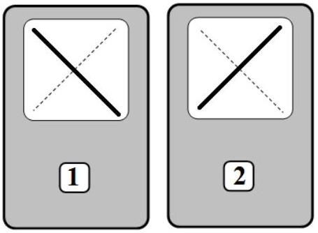

## Section 1.2. Rulers

1.2.1. In case of the incident light being polarized along the optical axis or perpendicular to it, there is only one kind of waves generated in the medium. This means that no change in light polarization is to occur. Thus, it is possible to determine either the
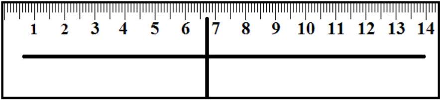
direction of the optical axis or the direction which is perpendicular to it. Those possible alternatives are shown in the figure above (either along the ruler, or perpendicular to it).
1.2.2. One can see at what parts of the rulers similar colors are observed, mainly with blue hue. The distance between those bands for the ruler No. 1 is ~12 cm, while for the two rules stacked together it is ~ 8 cm.

## Section 1.3. Strip

1.3.1 Possible directions of the optical axis of the strip can be determined in a similar way. As shown in the figure on the right, those directions make a small angle $\approx 10 ^ { \circ }$ with the sides of the strip.
1.3.2 The coordinates of the dark bands are approximately found
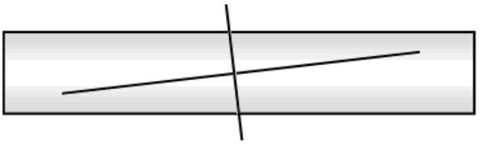
as follows $x _ { L } = 3,5 c m , x _ { R } = 7,5 c m$.

## Section 1.4. Liquid crystal cell

1.4.1 In case of zero voltage, the directions of the optical axis can be determined in the same way: It is either horizontal or vertical. At the maximum voltage applied the optical axis orients along the electric field, which means it turns perpendicular to the cell plane. 1.4.2 The voltage at which suach a sharp transition in orientation of molecules of the liquid crystal occurs is approximately equal to

$$
U _ { c r } = 2 \mathrm {~V} .
$$

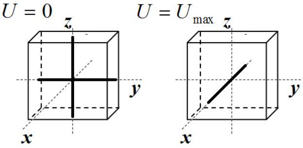

## Part 2. Measure!

## Section 2.1. Investigating a photodiode

2.1.1 In the figure below a position for a circuit switch is shown. During measurements of the resistance, the circuit switch should be unshorted.
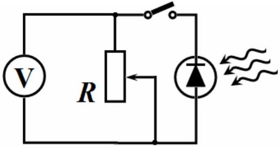
2.1.2 In table 1 the results are presented of the measurements of the voltage $U$ as a function of the resistance. Those data are plotted in the corresponding graph.

Table 1.
| $n = 0$ |  | $n = 5$ |  |
| :--- | :--- | :--- | :--- |
| $R , 10 ^ { 3 } O h m$ | $U , 10 ^ { - 3 } V$ | $R , 10 ^ { 3 } O h m$ | $U , 10 ^ { - 3 } V$ |
| 0,4 | 33 | 0,9 | 3 |
| 0,6 | 48 | 4,1 | 18 |
| 2,2 | 156 | 6,6 | 29 |
| 3,1 | 213 | 8,0 | 35 |
| 5,1 | 311 | 11,8 | 52 |
| 7,4 | 344 | 15,0 | 66 |
| 12,7 | 363 | 19,4 | 86 |
| 17,4 | 370 | 24,9 | 111 |
| 24,0 | 374 | 31,8 | 141 |
| 31,5 | 376 | 38,8 | 170 |
| 41,5 | 378 | 46,0 | 200 |
| 51,4 | 379 | 51,9 | 220 |
| 58,3 | 380 | 60,4 | 240 |
| 66,6 | 380 | 67,5 | 252 |
| 75,4 | 381 | 76,4 | 263 |
| 93,5 | 382 | 88,2 | 271 |
|  |  | 96,9 | 275 |
|  |  | 99,8 | 276 |

Note that the optimal resistance should be within the range $5 - 15 k O h m$, which corresponds to the largest variation in the voltage.

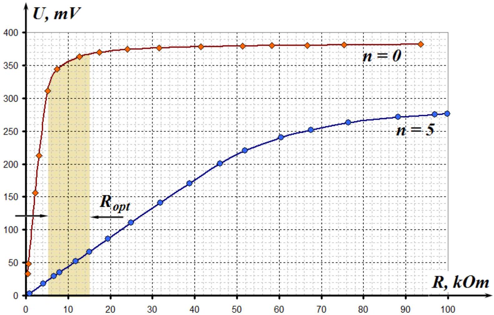
2.1.3 In table 2 the results are shown of the measurements for the voltage as a function of the number of light filters at different values of resistance.

Table 2.
| $\boldsymbol { R } =$ | 29,9 kOhm |  | 20,4 kOhm |  | 10,1 kOhm |  |
| :--- | :--- | :--- | :--- | :--- | :--- | :--- |
| $n$ | $U , m V$ | $\ln U$ | $U , m V$ | $\ln U$ | $U , m V$ | $\ln U$ |
| 0 | 391 | 5,969 | 388 | 5,961 | 377 | 5,932 |
| 1 | 370 | 5,914 | 364 | 5,897 | 341 | 5,832 |
| 2 | 346 | 5,846 | 336 | 5,817 | 294 | 5,684 |
| 3 | 317 | 5,759 | 309 | 5,733 | 179 | 5,187 |
| 4 | 288 | 5,663 | 234 | 5,455 | 105 | 4,654 |
| 5 | 212 | 5,357 | 148 | 4,997 | 66 | 4,190 |

Intensity of the light $I _ { n }$ that has passed through the filter decreases as a geometric progression when increasing the number of filters $n$ :

$$
\begin{equation*}
I _ { n } = I _ { 0 } \gamma ^ { n } . \tag{1}
\end{equation*}
$$

In case if the measured voltage is proportional to the intensity of the incident light, it obeys a similar law:

$$
\begin{equation*}
U _ { n } = U _ { 0 } \gamma ^ { n } . \tag{2}
\end{equation*}
$$

To verify equation (2), one needs to use a semi-logariphmic scale. In other words, it is necessary to plot $\ln U$ as a function of $n$ :

$$
\begin{equation*}
\ln U _ { n } = \ln U _ { 0 } + n \ln \gamma . \tag{3}
\end{equation*}
$$

That plot is shown in the following figure.

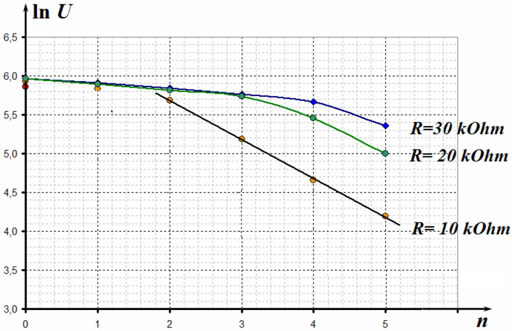

According to the graph above, by decreasing the resistance the dependence turns a linear function and further measurements should be made at the lowest resistance among given values, i.e. at $R =$ $10 k O h m$.
2.1.4. According to equation (3) , the slope is $a = \ln \gamma$. Using the Method of Least Squares, we can obtain its value $a = - 0.53 \pm 0.03$. Thus, the coefficient of transmission turns to be equal to $\gamma = \exp \alpha = 0.59$ with an error, which can be calculated by applying the following formula $\Delta \gamma = \exp ( \alpha ) \Delta \alpha = 0.02$. Finally we obtain

$$
\gamma = 0.59 \pm 0.02 .
$$

Note that values for $R = 10 k O h m$ produce the following result: $\gamma = 0.59 \pm 0.02$.

## Часть 2.2 Light transition through a plastic ruler

2.2.1 Results of measurements of the light intensity as a function of coordinates of transmission points through ruler \#1, \#2 and both rulers, are shown in table 3 and in the graph below.

Table 3.
| №1 |  |  | №2 |  |  | Both rulers |  |  |
| :--- | :--- | :--- | :--- | :--- | :--- | :--- | :--- | :--- |
| $\boldsymbol { X } \boldsymbol { , } \boldsymbol { m } \boldsymbol { m }$ | U,mV | $\Delta \varphi$ | $\boldsymbol { X } \boldsymbol { , } \boldsymbol { m } \boldsymbol { m }$ | U,mV | $\Delta \varphi$ | X,mm | U,mV | $U _ { \text {calc } }$ |
| 5 | 23 | 0,778 | 5 | 14 | 0,601 | 5 | 1 | 0,0 |
| 10 | 6 | 0,390 | 10 | 22 | 0,760 | 10 | 2 | 2,1 |
| 15 | 0 | 0,000 | 15 | 30 | 0,896 | 15 | 8 | 7,7 |
| 20 | 3 | 0,275 | 20 | 43 | 1,090 | 20 | 18 | 15,7 |
| 25 | 12 | 0,555 | 25 | 55 | 1,253 | 25 | 31 | 24,7 |
| 30 | 30 | 0,896 | 30 | 67 | 1,408 | 30 | 39 | 33,0 |
| 35 | 50 | 1,186 | 35 | 78 | 1,546 | 35 | 41 | 39,2 |
| 40 | 71 | 1,458 | 40 | 90 | 1,696 | 40 | 42 | 41,9 |
| 45 | 93 | 1,734 | 45 | 99 | 1,811 | 45 | 41 | 40,8 |
| 50 | 113 | 1,996 | 50 | 107 | 1,915 | 50 | 36 | 36,0 |
| 55 | 128 | 2,214 | 55 | 116 | 2,038 | 55 | 27 | 28,5 |
| 60 | 150 | 2,636 | 60 | 123 | 2,138 | 60 | 21 | 19,6 |
| 65 | 156 | 2,824 | 65 | 129 | 2,230 | 65 | 12 | 10,9 |
| 70 | 153 | 2,720 | 70 | 133 | 2,295 | 70 | 7 | 4,1 |
| 75 | 160 | 3,142 | 75 | 130 | 2,246 | 75 | 2 | 0,4 |
| 80 | 146 | 2,541 | 80 | 134 | 2,312 | 80 | 1 | 0,5 |
| 85 | 146 | 2,541 | 85 | 143 | 2,478 | 85 | 1 | 4,4 |
| 90 | 140 | 2,419 | 90 | 144 | 2,498 | 90 | 3 | 11,4 |
| 95 | 131 | 2,262 | 95 | 146 | 2,541 | 95 | 6 | 20,1 |
| 100 | 113 | 1,996 | 100 | 145 | 2,519 | 100 | 11 | 29,0 |

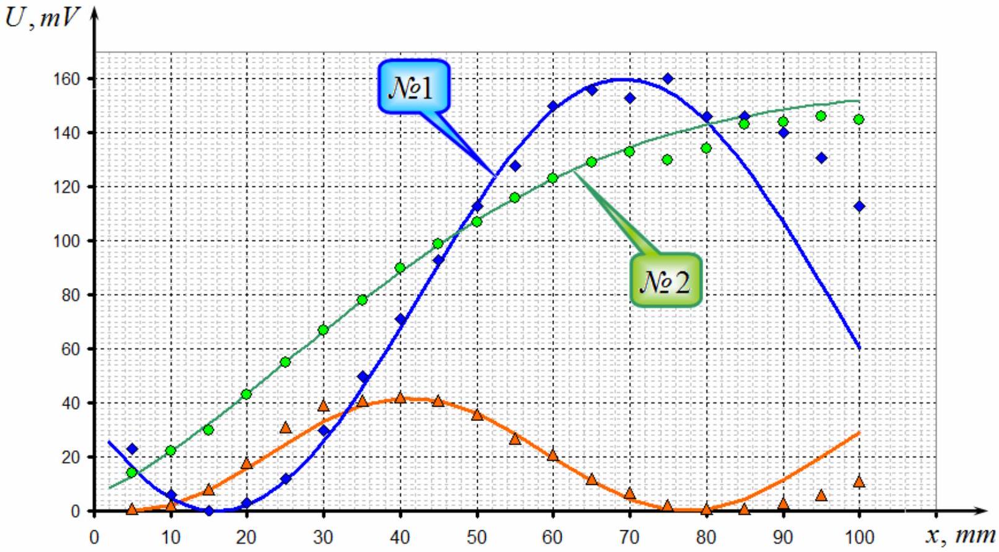

2.2.2 To calculate a phase shift, we use equation (1), mentioned in the problems formulation, which can be represented as

$$
\begin{equation*}
U = U _ { \max } \sin ^ { 2 } \frac { \Delta \varphi } { 2 } , \tag{1}
\end{equation*}
$$

where $U _ { \text {max } }$ is the largest value of voltage. But we have to be sure that this value actually corresponds to the maximum of function (1), not just another boundary point. According to measurements, (see the graph) for each ruler the most suitable value for $U _ { \text {max } }$ is $U _ { \text {max } } = 160 m V$.

The following equation

$$
\begin{equation*}
y _ { 0 } = \sin ^ { 2 } \frac { \Delta \varphi } { 2 } \tag{1}
\end{equation*}
$$

has multiple roots and it is not easy to find actual values of the phase shift, even if it's possible to calculate certain value for $U _ { \max }$, roots of the equation mentioned above are shown in the figure below
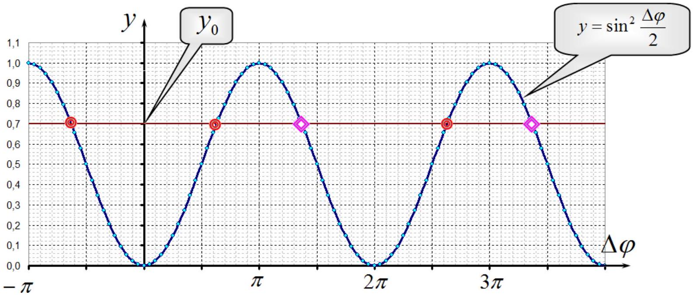

Formally we can represent the roots in different forms, for example,

$$
\begin{gather*}
\Delta \varphi = \pm 2 \left( \arcsin \sqrt { y _ { 0 } } + k \pi \right) \\
\Delta \varphi = \pm 2 \left( \pi - \arcsin \sqrt { y _ { 0 } } + k \pi \right)  \tag{2}\\
k = 0,1,2 \ldots
\end{gather*}
$$

Choosing a correct root should depend on a function obtained experimentally.
Values for the phase shifts calculated by the equation

$$
\begin{equation*}
\Delta \varphi = 2 \arcsin \sqrt { \frac { U } { U _ { \max } } } . \tag{3}
\end{equation*}
$$

are shown in table 3
It is clear that the function $\Delta \varphi ( x )$ has to be monotonous, that is why the signs of roots for the first two points must be changed, which is a mathematically correct operation (just reflecting the graph). Note that the phase shifts are calculated with uncertainty of $\pm 2 \pi k$.
2.2.3 Obtained functions are close to linear, using MLS we get

$$
\begin{aligned}
& \Delta \varphi _ { 1 } = 0.059 x - 0.94 , \\
& \Delta \varphi _ { 2 } = 0.028 x + 0.52 .
\end{aligned}
$$

Graphs of those functions are shown below.
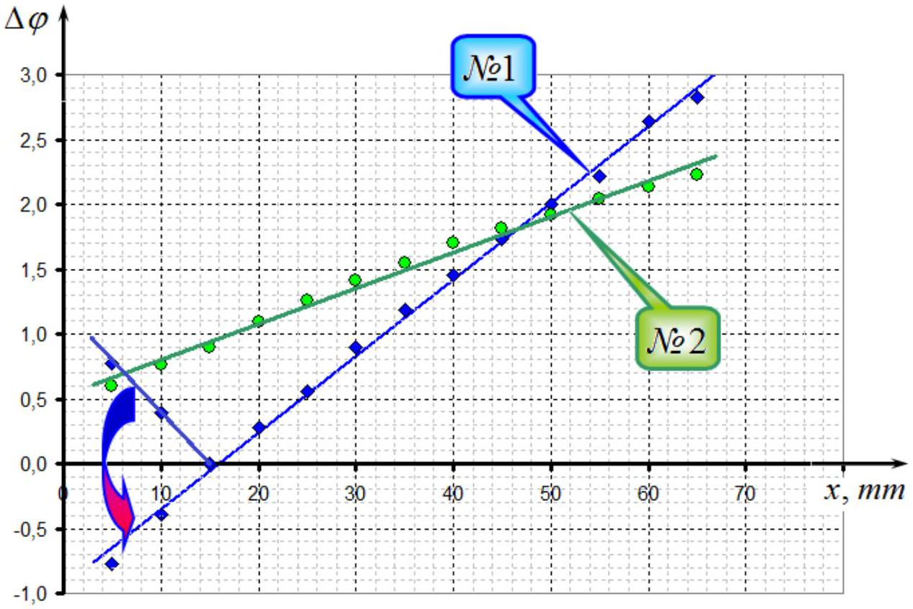
2.2.4 If two rulers are stacked together, then phase shifts simply add, and, theoretically, the intensity as function of phase shifts can be written as

$$
\begin{equation*}
U = U _ { \max } \sin ^ { 2 } \frac { \Delta \varphi _ { 1 } + \Delta \varphi _ { 2 } } { 2 } . \tag{5}
\end{equation*}
$$

Here $U _ { \text {max } }$ is the largest value of voltage at the light transition through both rulers and can be obtained from experimental data.
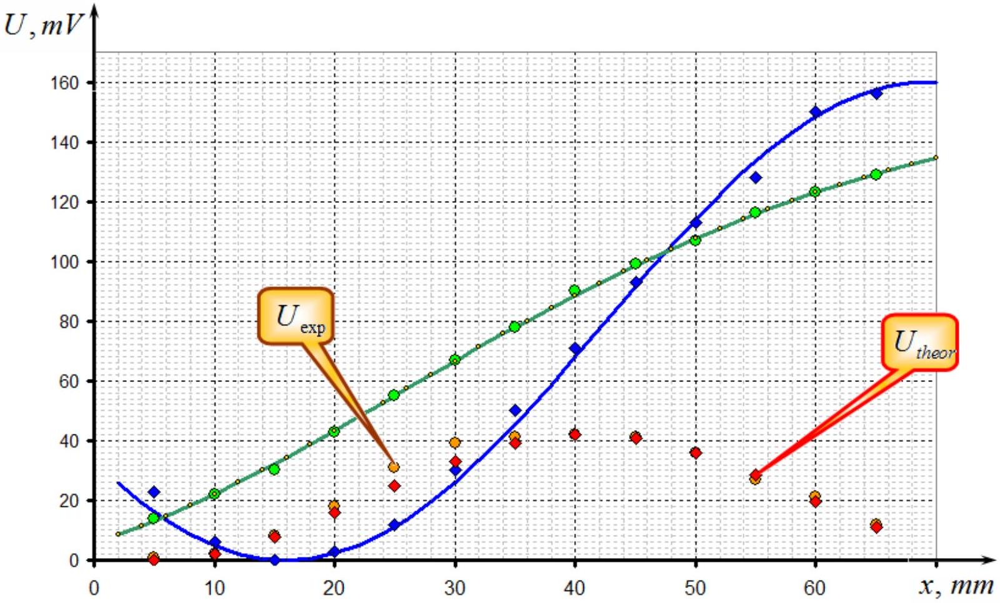

Results of the calculations are shown in table 3 and in the graph above. Consistency of theoretical calculations and experimental data can clearly be seen.

## Part 2.3 Liquid crystal cell

### 2.3.2 Light transmission through LCC

2.3.1 Results of the intensity measurements as a functions of voltage $U _ { L C }$ are shown in table $5 ^ { 1 }$. Graph of the obtained function is drawn in the figure below.

Table 5.
| $U _ { L C } , V$ | $U , m V$ | $( \Delta \varphi )$ | $\Delta \varphi$ | $\ln U _ { L C }$ | $\ln \Delta \varphi$ |
| :--- | :--- | :--- | :--- | :--- | :--- |
| 0 | 207 | 1,961 | 10,606 | - | 2,361 |
| 0,86 | 207 | 1,961 | 10,606 | -0,151 | 2,361 |
| 0,91 | 211 | 1,990 | 10,577 | -0,094 | 2,359 |
| 0,93 | 226 | 2,102 | 10,464 | -0,073 | 2,348 |
| 0,94 | 237 | 2,190 | 10,377 | -0,062 | 2,340 |
| 1,02 | 294 | 2,858 | 9,709 | 0,020 | 2,273 |
| 1,07 | 297 | 2,941 | 9,625 | 0,068 | 2,264 |
| 1,09 | 294 | 2,858 | 9,709 | 0,086 | 2,273 |
| 1,11 | 285 | 2,691 | 8,974 | 0,104 | 2,194 |
| 1,18 | 201 | 1,918 | 8,201 | 0,166 | 2,104 |
| 1,23 | 110 | 1,301 | 7,584 | 0,207 | 2,026 |
| 1,27 | 51 | 0,850 | 7,133 | 0,239 | 1,965 |
| 1,29 | 26 | 0,598 | 6,881 | 0,255 | 1,929 |
| 1,31 | 10 | 0,367 | 6,650 | 0,270 | 1,895 |
| 1,32 | 5 | 0,259 | 6,542 | 0,278 | 1,878 |
| 1,36 | 2 | 0,163 | 6,447 | 0,307 | 1,864 |
| 1,39 | 12 | 0,403 | 5,880 | 0,329 | 1,772 |
| 1,42 | 28 | 0,621 | 5,662 | 0,351 | 1,734 |
| 1,46 | 66 | 0,976 | 5,307 | 0,378 | 1,669 |
| 1,5 | 102 | 1,245 | 5,038 | 0,405 | 1,617 |
| 1,55 | 156 | 1,611 | 4,672 | 0,438 | 1,542 |
| 1,63 | 232 | 2,149 | 4,134 | 0,489 | 1,419 |
| 1,68 | 261 | 2,404 | 3,879 | 0,519 | 1,356 |
| 1,71 | 275 | 2,556 | 3,727 | 0,536 | 1,316 |
| 1,78 | 289 | 2,756 | 3,527 | 0,577 | 1,260 |
| 1,83 | 294 | 2,858 | 3,425 | 0,604 | 1,231 |
| 1,93 | 295 | 2,883 | 3,401 | 0,658 | 1,224 |
| 2,01 | 294 | 2,858 | 2,858 | 0,698 | 1,050 |
| 2,11 | 287 | 2,722 | 2,722 | 0,747 | 1,001 |
| 2,24 | 273 | 2,532 | 2,532 | 0,806 | 0,929 |
| 2,34 | 258 | 2,375 | 2,375 | 0,850 | 0,865 |
| 2,51 | 229 | 2,125 | 2,125 | 0,920 | 0,754 |
| 2,65 | 202 | 1,925 | 1,925 | 0,975 | 0,655 |
| 2,72 | 191 | 1,848 | 1,848 | 1,001 | 0,614 |
| 2,85 | 169 | 1,698 | 1,698 | 1,047 | 0,529 |
| 2,92 | 159 | 1,631 | 1,631 | 1,072 | 0,489 |
| 3,05 | 141 | 1,511 | 1,511 | 1,115 | 0,413 |
| 3,16 | 128 | 1,424 | 1,424 | 1,151 | 0,353 |
| 3,22 | 121 | 1,376 | 1,376 | 1,169 | 0,319 |
| 3,34 | 109 | 1,294 | 1,294 | 1,206 | 0,258 |
| 3,45 | 98 | 1,217 | 1,217 | 1,238 | 0,196 |
| 3,59 | 86 | 1,130 | 1,130 | 1,278 | 0,122 |
| 3,66 | 81 | 1,093 | 1,093 | 1,297 | 0,089 |
| 3,75 | 74 | 1,039 | 1,039 | 1,322 | 0,039 |

[^0]
| 3,83 | 70 | 1,008 | 1,008 | 1,343 | 0,008 |
| :--- | :--- | :--- | :--- | :--- | :--- |
| 3,91 | 65 | 0,968 | 0,968 | 1,364 | -0,032 |
| 4,03 | 58 | 0,911 | 0,911 | 1,394 | -0,094 |
| 4,21 | 50 | 0,841 | 0,841 | 1,437 | -0,173 |
| 4,43 | 41 | 0,757 | 0,757 | 1,488 | -0,278 |
| 4,79 | 30 | 0,644 | 0,644 | 1,567 | -0,441 |
| 4,98 | 25 | 0,586 | 0,586 | 1,605 | -0,535 |
| 5,15 | 21 | 0,536 | 0,536 | 1,639 | -0,625 |
| 5,51 | 15 | 0,451 | 0,451 | 1,707 | -0,796 |
| 5,79 | 11 | 0,385 | 0,385 | 1,756 | -0,954 |
| 6,07 | 8 | 0,328 | 0,328 | 1,803 | -1,115 |
| 6,59 | 4 | 0,231 | 0,231 | 1,886 | -1,463 |
| 6,94 | 2 | 0,163 | 0,163 | 1,937 | -1,811 |

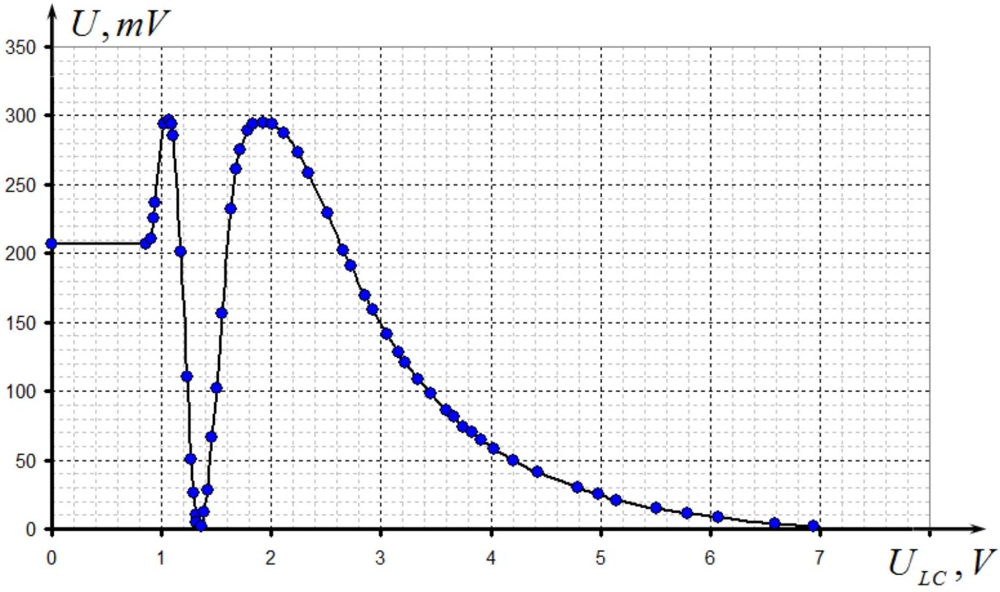

It is important to choose correct roots of equation (2) in order to adequately calculate phase shifts. In this case it is rather obvious because at large values of $U _ { L C }$ the voltage difference tends to zero, $\Delta \varphi \rightarrow 0$. Other solutions and corresponding equations are shown in the figure below.

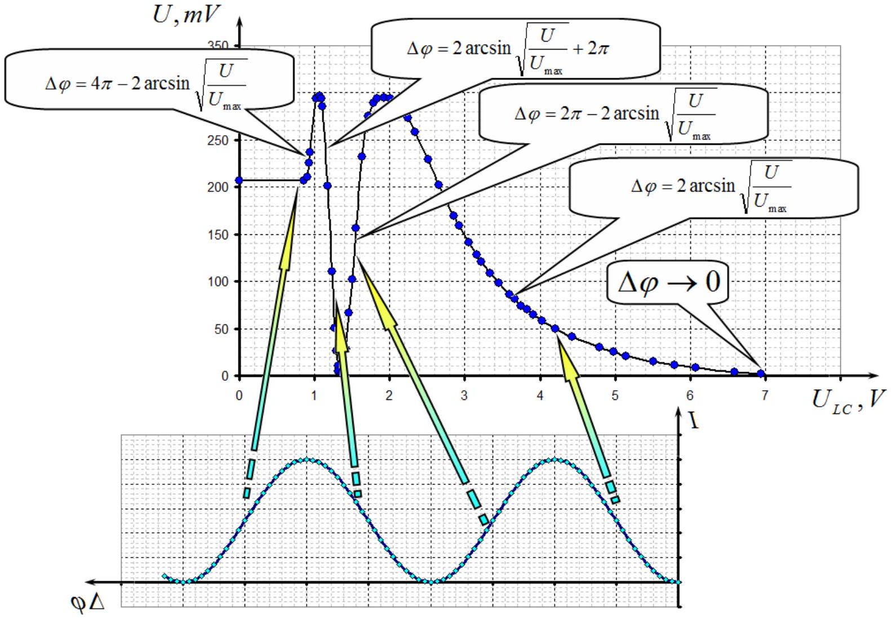

Results of calculation of $( \Delta \varphi ) ^ { \prime } = \arcsin \sqrt { \frac { U } { U _ { \text {max } } } }$ and correct values of phase shift $\Delta \varphi$ are shown in the figure below.

This figure is drawn for the sake of understanding. (It's not required to draw it for participants).
2.3.2 The value of the phase shift at zero voltage is $\Delta \varphi _ { 0 } \approx 10.6$.
2.3.3 In order to check applicability of the
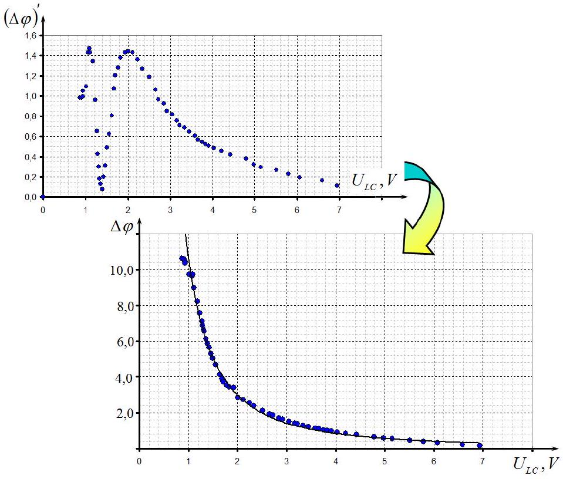 power function $\Delta \varphi = C U ^ { \beta }$ it is recommended to redraw the last graph logarithmically, as shown in the figure below.

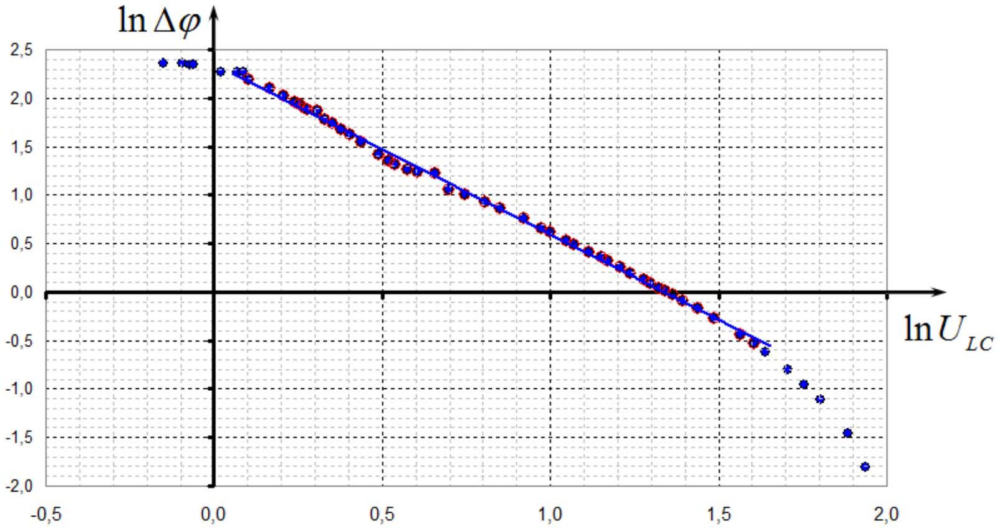

It can be seen from the graph that in the range of 1 V to 5 V the function is almost linear, which justifies the applicability of the power law. The power in that equation is equal to the slope of the graph, its numerical value is $\beta \approx 1.75$.

Section 2.4 Light transmission through a curved strip
2.4.1 Results of the measurements of the light intensity as a function of coordinate $z$ of the point of light penetration into the strip are presented in table 6 and plotted below.

Table 6.
| $x , m m$ | $U , m V$ | $\Delta \varphi ^ { \prime }$ | $\Delta \varphi$ | $z , m m$ |
| :--- | :--- | :--- | :--- | :--- |
| 40 | 16 | 0,794 | 5,489 | -22 |
| 41 | 8 | 0,554 | 5,729 | -21 |
| 42 | 3 | 0,336 | 5,947 | -20 |
| 43 | 1 | 0,194 | 6,090 | -19 |
| 44 | 1 | 0,194 | 6,090 | -18 |
| 45 | 1 | 0,194 | 6,090 | -17 |
| 46 | 1 | 0,194 | 6,090 | -16 |
| 47 | 1 | 0,194 | 6,090 | -15 |
| 48 | 1 | 0,194 | 6,090 | -14 |
| 49 | 4 | 0,389 | 5,894 | -13 |
| 50 | 11 | 0,653 | 5,630 | -12 |
| 51 | 23 | 0,964 | 5,319 | -11 |
| 52 | 41 | 1,335 | 4,948 | -10 |
| 53 | 61 | 1,711 | 4,572 | -9 |
| 54 | 78 | 2,046 | 4,237 | -8 |
| 55 | 90 | 2,322 | 3,962 | -7 |
| 56 | 99 | 2,588 | 3,696 | -6 |
| 57 | 102 | 2,706 | 2,706 | -5 |
| 58 | 100 | 2,624 | 2,624 | -4 |
| 59 | 98 | 2,553 | 2,553 | -3 |
| 60 | 96 | 2,489 | 2,489 | -2 |
| 61 | 95 | 2,459 | 2,459 | -1 |
| 62 | 93 | 2,401 | 2,401 | 0 |
| 63 | 96 | 2,489 | 2,489 | 1 |
| 64 | 99 | 2,588 | 2,588 | 2 |
| 65 | 104 | 2,805 | 2,805 | 3 |
| 66 | 107 | 3,142 | 3,142 | 4 |
| 67 | 107 | 3,142 | 3,142 | 5 |
| 68 | 98 | 2,553 | 3,730 | 6 |
| 69 | 81 | 2,111 | 4,173 | 7 |
| 70 | 65 | 1,787 | 4,496 | 8 |
| 71 | 44 | 1,392 | 4,891 | 9 |
| 72 | 24 | 0,987 | 5,296 | 10 |
| 73 | 10 | 0,621 | 5,662 | 11 |
| 74 | 3 | 0,336 | 5,947 | 12 |
| 75 | 1 | 0,194 | 6,090 | 13 |
| 76 | 1 | 0,194 | 6,090 | 14 |
| 77 | 1 | 0,194 | 6,090 | 15 |
| 78 | 1 | 0,194 | 6,090 | 16 |
| 79 | 1 | 0,194 | 6,090 | 17 |
| 80 | 2 | 0,274 | 6,009 | 18 |

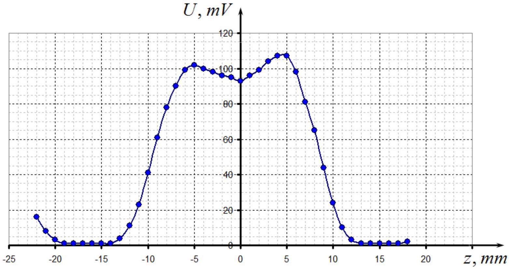
2.4.2 The shape of the curve indicates that $\Delta \varphi _ { 0 }$ lies at the ascending part of the relation between the intensity and the phase shift, which can be calculated as

$$
\Delta \varphi _ { 0 } = 10 \pi + 2 \arcsin \sqrt { \frac { U _ { 0 } } { U _ { \max } } } \approx 33.9 .
$$

Graph of the phase shift is drawn in the figure on right. Because we are interested in the central part of the graph, "reflection" parts are not shown. (This graph is not required from participants)
2.4.3 The graph shows that the central part is approximately parabolic function of $z$

$$
\begin{equation*}
\Delta \varphi = a z ^ { 2 } + b . \tag{10}
\end{equation*}
$$

In order to determine the coefficients of the function we can draw graph of $\Delta \varphi$ as a function of $z ^ { 2 }$ (see figure on the right). Using MLS, we can determine the parameters

$$
\begin{aligned}
& a = 0.0104 \mathrm { MM } ^ { - 1 } , \\
& b = 2.45 .
\end{aligned}
$$

It is necessary to add $10 \pi$ to the obtained value of $b$.

Comparing equations (9) and (10), we conclude that the parameters can be represented by the strip characteristics as:

$$
\begin{equation*}
\alpha = \frac { \Delta \varphi _ { 0 } } { 2 n ^ { 2 } R ^ { 2 } } , \quad b = \Delta \varphi _ { 0 } . \tag{11}
\end{equation*}
$$

From those equations we get the radius of
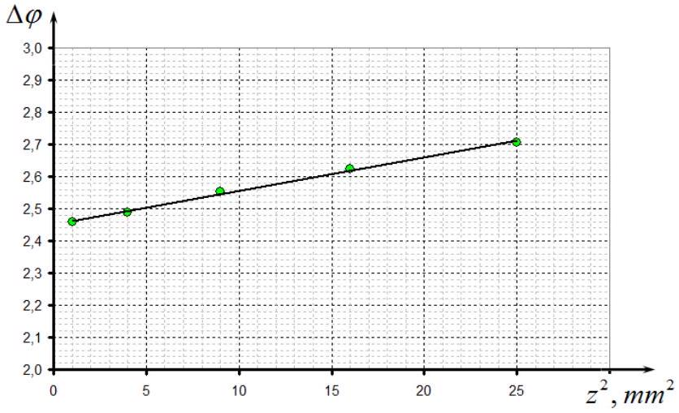
curvature of the strip

$$
\begin{equation*}
R = \frac { 1 } { n } \sqrt { \frac { b } { 2 a } } . \tag{12}
\end{equation*}
$$

Substitution of the obtained results leads us to $R = 29 m m$. Note that the obtained result is quite rough, due to uncertainties in measuring.

[^0]:    ${ } ^ { 1 }$ We do not expect that participants can take the same number of measurements, 15-20 points are enough. It is principally important to find the dip in the graph.
