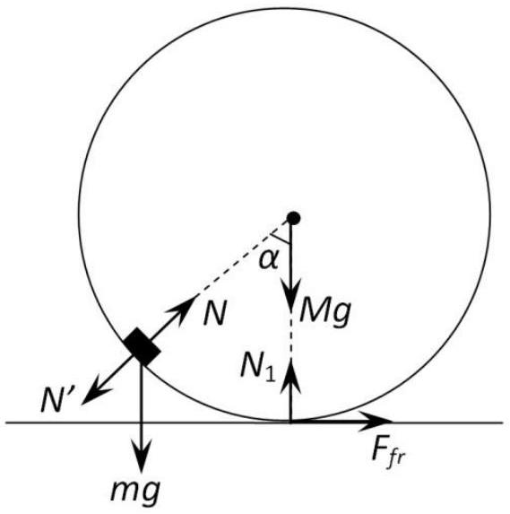
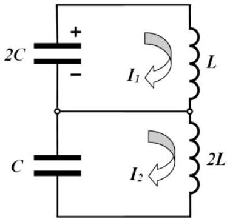
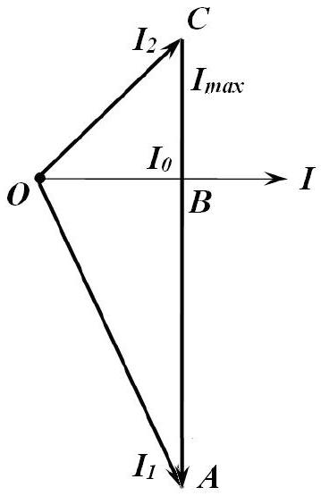

## Problem 1   Solution   Part A

Consider the forces acting on the puck and the cylinder and depicted in the figure on the right. The puck is subject to the gravity force $m g$ and the reaction force from the cylinder $N$. The cylinder is subject to the gravity force $M g$, the reaction force from the plane $N _ { 1 }$, the friction force $F _ { f r }$ and the pressure force from the puck $N ^ { \prime } = - N$. The idea is to write the horizontal projections of the equations of motion. It is written for the puck as follows

$$
\begin{equation*}
m a _ { x } = N \sin \alpha , \tag{A.1}
\end{equation*}
$$

where $a _ { x }$ is the horizontal projection of the puck acceleration.
For the cylinder the equation of motion with the acceleration $w$ is found as

$$
\begin{equation*}
M w = N \sin \alpha - F _ { f r } . \tag{A.2}
\end{equation*}
$$

Since the cylinder moves along the plane without sliding its angular acceleration is obtained as

$$
\begin{equation*}
\varepsilon = w / R \tag{A.3}
\end{equation*}
$$

Then the equation of rotational motion around the center of mass of the cylinder takes the form

$$
\begin{equation*}
I \varepsilon = F _ { f r } R , \tag{A.4}
\end{equation*}
$$

where the inertia moment of the hollow cylinder is given by

$$
\begin{equation*}
I = M R ^ { 2 } . \tag{A.5}
\end{equation*}
$$

Solving (A.2)-(A.5) yields

$$
\begin{equation*}
2 M w = N \sin \alpha . \tag{A.6}
\end{equation*}
$$

From equations (A.1) and (A.6) it is easily concluded that

$$
\begin{equation*}
m a _ { x } = 2 M w . \tag{A.7}
\end{equation*}
$$

Since the initial velocities of the puck and of the cylinder are both equal to zero, then, it follows from (A.7) after integrating that

$$
\begin{equation*}
m u = 2 M v . \tag{A.8}
\end{equation*}
$$

It is obvious that the conservation law for the system is written as

$$
\begin{equation*}
m g R = \frac { m u ^ { 2 } } { 2 } + \frac { M v ^ { 2 } } { 2 } + \frac { I \omega ^ { 2 } } { 2 } , \tag{A.9}
\end{equation*}
$$

where the angular velocity of the cylinder is found to be

$$
\begin{equation*}
\omega = \frac { v } { R } , \tag{A.10}
\end{equation*}
$$

since it does not slide over the plane.
Solving (A.8)-(A.10) results in velocities at the lowest point of the puck trajectory written as

$$
\begin{align*}
& u = 2 \sqrt { \frac { M g R } { ( 2 M + m ) } } ,  \tag{A.12}\\
& v = \frac { m } { M } \sqrt { \frac { M g R } { ( 2 M + m ) } } . \tag{A.13}
\end{align*}
$$

In the reference frame sliding progressively along with the cylinder axis, the puck moves in a circle of radius $R$ and, at the lowest point of its trajectory, have the velocity

$$
\begin{equation*}
v _ { \text {rel } } = u + v \tag{A.14}
\end{equation*}
$$

and the acceleration

$$
\begin{equation*}
a _ { \mathrm { rel } } = \frac { v _ { \mathrm { rel } } ^ { 2 } } { R } . \tag{A.15}
\end{equation*}
$$

At the lowest point of the puck trajectory the acceleration of the cylinder axis is equal to zero, therefore, the puck acceleration in the laboratory reference frame is also given by (A.15).

$$
\begin{equation*}
F - m g = \frac { m v _ { r e l } ^ { 2 } } { R } . \tag{A.16}
\end{equation*}
$$

then the interaction force between the puck and the cylinder is finally found as

$$
\begin{equation*}
F = 3 m g \left( 1 + \frac { m } { 3 M } \right) . \tag{A.17}
\end{equation*}
$$

## Part B

1) According to the first law of thermodynamics, the amount of heat transmitted $\delta Q$ to the gas in the bubble is found as

$$
\begin{equation*}
\delta Q = v C _ { V } d T + p d V , \tag{B.1}
\end{equation*}
$$

where the molar heat capacity at arbitrary process is as follows

$$
\begin{equation*}
C = \frac { 1 } { v } \frac { \delta Q } { d T } = C _ { V } + \frac { p } { v } \frac { d V } { d T } . \tag{B.2}
\end{equation*}
$$

Here $C _ { V }$ stands for the molar heat capacity of the gas at constant volume, $p$ designates its pressure, $v$ is the total amount of moles of gas in the bubble, $V$ and $T$ denote the volume and temperature of the gas, respectively.

Evaluate the derivative standing on the right hand side of (B.2). According to the Laplace formula, the gas pressure inside the bubble is defined by

$$
\begin{equation*}
p = \frac { 4 \sigma } { r } , \tag{B.3}
\end{equation*}
$$

thus, the equation of any equilibrium process with the gas in the bubble is a polytrope of the form

$$
\begin{equation*}
p ^ { 3 } V = \text { const } . \tag{B.4}
\end{equation*}
$$

The equation of state of an ideal gas has the form

$$
\begin{equation*}
p V = v R T , \tag{B.5}
\end{equation*}
$$

and hence equation (B.4) can be rewritten as

$$
\begin{equation*}
T ^ { 3 } V ^ { - 2 } = \text { const } . \tag{B.6}
\end{equation*}
$$

Differentiating (B.6) the derivative with respect to temperature sought is found as

$$
\begin{equation*}
\frac { d V } { d T } = \frac { 3 V } { 2 T } . \tag{B.7}
\end{equation*}
$$

Taking into account that the molar heat capacity of a diatomic gas at constant volume is

$$
\begin{equation*}
C _ { V } = \frac { 5 } { 2 } R , \tag{B.8}
\end{equation*}
$$

and using (B.5) it is finally obtained that

$$
\begin{equation*}
C = C _ { V } + \frac { 3 } { 2 } R = 4 R = 33.2 \frac { \mathrm {~J} } { \mathrm {~mole} \cdot \mathrm {~K} } . \tag{B.9}
\end{equation*}
$$

2) Since the heat capacity of the gas is much smaller than the heat capacity of the soap film, and there is heat exchange between them, the gas can be considered as isothermal since the soap film plays the role of thermostat. Consider the fragment of soap film, limited by the angle $\alpha$ as shown in the figure. It's area is found as

$$
\begin{equation*}
S = \pi ( \alpha r ) ^ { 2 } . \tag{B.10}
\end{equation*}
$$

and the corresponding mass is obtained as

$$
\begin{equation*}
m = \rho S h . \tag{B.11}
\end{equation*}
$$

Let $x$ be an increase in the radius of the bubble, then the Newton second law for the fragment of the soap film mentioned above takes the form

$$
\begin{equation*}
m \ddot { x } = p ^ { \prime } S ^ { \prime } - F _ { \text {surf } } , \tag{B.12}
\end{equation*}
$$

where $F _ { \text {surf } }$ denotes the projection of the resultant surface tension force acting in the radial direction, $p ^ { \prime }$ stands for the gas pressure beneath the surface of the soap film and

$$
S ^ { \prime } = S \left( 1 + 2 \frac { x } { r } \right) .
$$

$F _ { \text {surf } }$ is easily found as

$$
\begin{equation*}
F _ { \text {surf } } = F _ { S T } \alpha = \sigma \cdot 2 \cdot 2 \pi [ ( r + x ) \alpha ] \cdot \alpha . \tag{B.13}
\end{equation*}
$$

Since the gaseous process can be considered isothermal, it is written that

$$
\begin{equation*}
p ^ { \prime } V ^ { \prime } = p V . \tag{B.14}
\end{equation*}
$$

Assuming that the volume increase is quite small, (B.14) yields

$$
\begin{equation*}
p ^ { \prime } = p \frac { 1 } { \left( 1 + \frac { x } { r } \right) ^ { 3 } } \approx p \frac { 1 } { \left( 1 + \frac { 3 x } { r } \right) } \approx p \left( 1 - \frac { 3 x } { r } \right) . \tag{B.15}
\end{equation*}
$$

Thus, from (B.10) - (B.16) and (B.3) the equation of small oscillations of the soap film is derived as

$$
\begin{equation*}
\rho h \ddot { x } = - \frac { 8 \sigma } { r ^ { 2 } } x \tag{B.16}
\end{equation*}
$$

with the frequency

$$
\begin{equation*}
\omega = \sqrt { \frac { 8 \sigma } { \rho h r ^ { 2 } } } = 108 \mathrm {~s} ^ { - 1 } . \tag{B.17}
\end{equation*}
$$

## Part C

The problem can be solved in different ways. Herein several possible solutions are considered.
Method 1. Direct approach
At the moment when the current in the coils is a maximum, the total voltage across the coils is equal to zero, so the capacitor voltages must be equal in magnitude and opposite in polarity. Let $U$ be a voltage on the capacitors at the time moment just mentioned and $I _ { 0 }$ be that maximum current. According to the law of charge conservation

$$
\begin{equation*}
q _ { 0 } = 2 C U + C U , \tag{C1.1}
\end{equation*}
$$

thus,

$$
\begin{equation*}
U = \frac { q _ { 0 } } { 3 C } . \tag{C1.2}
\end{equation*}
$$

Then, from the energy conservation law

$$
\begin{equation*}
\frac { q _ { 0 } ^ { 2 } } { 2 \cdot 2 C } = \frac { L I _ { 0 } ^ { 2 } } { 2 } + \frac { 2 L I _ { 0 } ^ { 2 } } { 2 } + \frac { C U ^ { 2 } } { 2 } + \frac { 2 C U ^ { 2 } } { 2 } \tag{C1.3}
\end{equation*}
$$

the maximum current is found as

$$
\begin{equation*}
I _ { 0 } = \frac { q _ { 0 } } { 3 \sqrt { 2 L C } } . \tag{C1.4}
\end{equation*}
$$

After the key $K$ is shortened there will be independent oscillations in both circuits with the frequency

$$
\begin{equation*}
\omega = \frac { 1 } { \sqrt { 2 L C } } , \tag{C1.5}
\end{equation*}
$$

and their amplitudes are obtained from the corresponding energy conservation laws written as

$$
\begin{align*}
& \frac { 2 C U ^ { 2 } } { 2 } + \frac { L I _ { 0 } ^ { 2 } } { 2 } = \frac { L J _ { 1 } ^ { 2 } } { 2 } ,  \tag{C1.6}\\
& \frac { C U ^ { 2 } } { 2 } + \frac { 2 L I _ { 0 } ^ { 2 } } { 2 } = \frac { 2 L J _ { 2 } ^ { 2 } } { 2 } . \tag{C1.7}
\end{align*}
$$

Hence, the corresponding amplitudes are found as

$$
\begin{align*}
& J _ { 1 } = \sqrt { 5 } I _ { 0 } ,  \tag{C1.8}\\
& J _ { 2 } = \sqrt { 2 } I _ { 0 } . \tag{C1.9}
\end{align*}
$$

Choose the positive directions of the currents in the circuits as shown in the figure on the right. Then, the current flowing through the key is written as follows

$$
\begin{equation*}
I = I _ { 1 } - I _ { 2 } . \tag{C1.10}
\end{equation*}
$$

The currents depend on time as

$$
\begin{align*}
& I _ { 1 } ( t ) = A \cos \omega t + B \sin \omega t ,  \tag{C1.11}\\
& I _ { 2 } ( t ) = D \cos \omega t + F \sin \omega t , \tag{C1.12}
\end{align*}
$$

The constants $A , B , D , F$ can be determined from the initial values of the currents and their amplitudes by putting down the following set of equations

$$
\begin{align*}
& I _ { 1 } ( 0 ) = A = I _ { 0 } ,  \tag{C1.13}\\
& A ^ { 2 } + B ^ { 2 } = J _ { 1 } ^ { 2 } ,  \tag{C1.14}\\
& I _ { 2 } ( 0 ) = D = I _ { 0 } ,  \tag{C1.15}\\
& D ^ { 2 } + F ^ { 2 } = J _ { 2 } ^ { 2 } . \tag{C1.16}
\end{align*}
$$

Solving (C1.13)-(C1.16) it is found that

$$
\begin{align*}
& B = 2 I _ { 0 } ,  \tag{C1.17}\\
& F = - I _ { 0 } , \tag{C1.18}
\end{align*}
$$

The sign in $F$ is chosen negative, since at the time moment of the key shortening the current in the coil $2 L$ decreases.

Thus, the dependence of the currents on time takes the following form

$$
\begin{align*}
& I _ { 1 } ( t ) = I _ { 0 } ( \cos \omega t + 2 \sin \omega t ) ,  \tag{C1.19}\\
& I _ { 2 } ( t ) = I _ { 0 } ( \cos \omega t - \sin \omega t ) . \tag{C1.20}
\end{align*}
$$

In accordance with (C.10), the current in the key is dependent on time according to

$$
\begin{equation*}
I ( t ) = I _ { 1 } ( t ) - I _ { 2 } ( t ) = 3 I _ { 0 } \sin \omega t . \tag{C1.21}
\end{equation*}
$$

Hence, the amplitude of the current in the key is obtained as

$$
\begin{equation*}
I _ { \max } = 3 I _ { 0 } = \omega q _ { 0 } = \frac { q _ { 0 } } { \sqrt { 2 L C } } . \tag{C1.22}
\end{equation*}
$$

Method 2. Vector diagram
Instead of determining the coefficients $A , B , D , F$ the vector diagram shown in the figure on the right can be used. The segment $A C$ represents the current sought and its projection on the current axis is zero at the time of the key shortening. The current $I _ { 1 }$ in the coil of inductance $L$ grows at the same time moment because the capacitor $2 C$ continues to discharge, thus, this current is depicted in the figure by the segment $O A$. The current $I _ { 2 }$ in the coil of inductance $2 L$ decreases at the time of the key shortening since it continues to charge the capacitor $2 C$, that is why this current is depicted in the figure by the segment $O C$.

It is known for above that $O B = I _ { 0 } , O A = \sqrt { 5 } I _ { 0 } , O C = \sqrt { 2 } I _ { 0 }$. Hence, it is found from the Pythagorean theorem that

$$
\begin{align*}
& A B = \sqrt { O A ^ { 2 } - O B ^ { 2 } } = 2 I _ { 0 }  \tag{C2.1}\\
& B C = \sqrt { O C ^ { 2 } - O B ^ { 2 } } = I _ { 0 } \tag{C2.2}
\end{align*}
$$

Thus, the current sought is found as

$$
\begin{equation*}
I _ { \max } = A C = A B + B C = 3 I _ { 0 } = \omega q _ { 0 } = \frac { q _ { 0 } } { \sqrt { 2 L C } } . \tag{C2.3}
\end{equation*}
$$

Method 3. Heuristic approach
It is clear that the current through the key performs harmonic oscillations with the frequency

$$
\begin{equation*}
\omega = \frac { 1 } { \sqrt { 2 L C } } . \tag{C3.1}
\end{equation*}
$$

and it is equal to zero at the time of the key shortening, i.e.

$$
\begin{equation*}
I ( t ) = I _ { \max } \sin \omega t . \tag{C3.2}
\end{equation*}
$$

Since the current is equal to zero at the time of the key shortening, then the current amplitude is equal to the current derivative at this time moment divided by the oscillation frequency. Let us find that current derivative. Let the capacitor of capacitance $2 C$ have the charge $q _ { 1 }$. Then the charge on the capacitor of capacitance $C$ is found from the charge conservation law as

$$
\begin{equation*}
q _ { 2 } = q _ { 0 } - q _ { 1 } . \tag{C3.3}
\end{equation*}
$$

After shortening the key the rate of current change in the coil of inductance $L$ is obtained as

$$
\begin{equation*}
\dot { I } _ { 1 } = \frac { q _ { 1 } } { 2 L C } , \tag{C3.4}
\end{equation*}
$$

whereas in the coil of inductance $2 L$ it is equal to

$$
\begin{equation*}
\dot { I } _ { 2 } = - \frac { q _ { 0 } - q _ { 1 } } { 2 L C } . \tag{C3.5}
\end{equation*}
$$

Since the voltage polarity on the capacitors are opposite, then the current derivative with respect to time finally takes the form

$$
\begin{equation*}
\dot { I } = \dot { I } _ { 1 } - \dot { I } _ { 2 } = \frac { q _ { 0 } } { 2 L C } = \omega ^ { 2 } q _ { 0 } . \tag{C3.6}
\end{equation*}
$$

Note that this derivative is independent of the time of the key shortening!
Hence, the maximum current is found as

$$
\begin{equation*}
I _ { \max } = \frac { \dot { I } } { \omega } = \omega q _ { 0 } = \frac { q _ { 0 } } { \sqrt { 2 L C } } , \tag{C3.7}
\end{equation*}
$$

and it is independent of the time of the key shortening!
